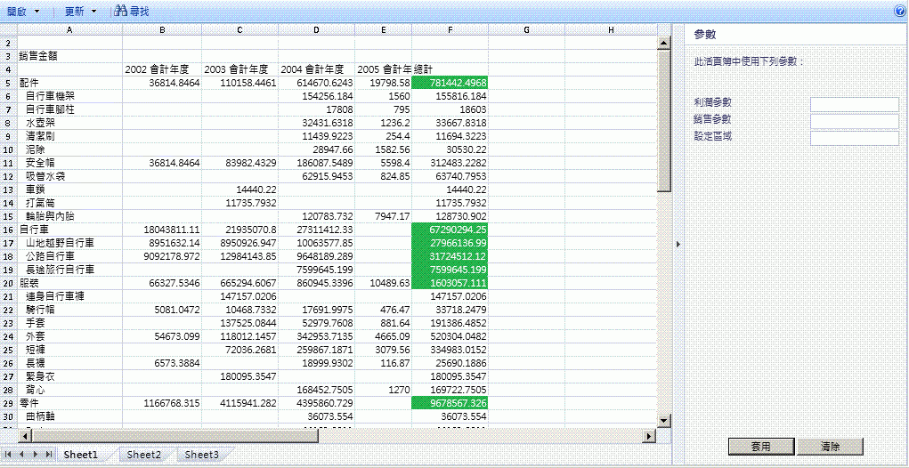

# Excel Services 概觀

Excel Services 是一款服務應用程式，它能讓您在 Microsoft SharePoint 2013 上載入、計算及顯示 Microsoft Excel 活頁簿。Microsoft Office SharePoint Server 2007 率先導入 Excel Services。
  
    
    

透過 Excel Services，您可以在 SharePoint 2013 入口網站和儀表板上重複使用及共用 Excel 活頁簿。例如，只要使用 SharePoint 2013 入口網站和儀表板，金融分析師、商務規劃人員或工程師就能在 Excel 中建立內容並與他人共用，完全不需要撰寫自訂程式碼。您可以控制要顯示的資料，也可以維護單一版本的 Excel 活頁簿。 
Excel Services 有四個主要介面： 
  
    
    

- 讓您使用瀏覽器檢視即時活頁簿及進行互動的 Excel Web Access 網頁組件 
    
  
- 供程式設計存取之用的 Excel Web Services
    
  
- 一種用於自動化和自訂化的 ECMAScript (JavaScript, JScript) 物件模型，可用來驅動 Excel Web Access 控制及建立更具有吸引力、整合度更高的解決方案，同時賦予使用使用者定義函式來擴充 ECMAScript (JavaScript, JScript) 物件模型的能力
    
  
- 直接透過 URL 存取活頁簿組件的代表性狀態傳輸 (REST) API
    
  

> **注意事項**
> Excel Interactive View 功能已停用。如需將網站中該項功能移除的相關資訊，請參閱 [Excel 互動式檢視移除網頁](removing-excel-interactive-view-from-a-webpage.md)。 
  
    
    

您也可以使用使用者定義函數 (UDF) 來擴充 Excel Calculation Services。
> **注意事項**
> 如需 Excel Calculation Services的詳細資訊，請參閱  [Excel Services 架構](excel-services-architecture.md)。 
  
    
    

透過 Excel Services，您只需要使用瀏覽器就能檢視即時的互動式活頁簿。這表示您可以儲存 Excel 活頁簿，並從入口網站內部與其互動。您也可以利用排序、 篩選、 展開或摺疊樞紐分析表，以及傳入參數等方式來與 Excel 資料互動。如此一來，您就可以針對發佈的活頁簿執行分析。您可以在不變更已發佈之活頁簿的情況下與活頁簿互動，這對報表作者和報表取用者來說是很珍貴的功能。Excel Services 支援連接外部資料來源的活頁簿。您可以在活頁簿中內嵌外部資料來源的連線字串，或將它們集中儲存在資料連線庫檔案中。藉由將工作表中選取的儲存格變成具名的範圍 (參數)，您還可以把它們變成可編輯的項目。您選擇要變成可檢視項目的內容，會在儲存到 Excel Services 時出現在 Excel Web Access 中的 [ **參數**] 窗格內。您可以在 [ **參數**] 窗格內變更這些具名範圍的值並重新整理活頁簿。也可以使用入口網站的篩選器網頁組件同時篩選好幾個網頁組件 (Excel Web Access 和其他類型的網頁組件)。 不過，您無法使用 Excel Services 來建立新活頁簿或編輯現有活頁簿。若要撰寫用於 Excel Services 的活頁簿，您可以使用 Microsoft Excel 2013。
> **注意事項**
> Microsoft Excel Online 是 Office Online 的一部分，它也支援在瀏覽器中操作 Excel 活頁簿。如需 Excel Online 的詳細資訊，請參閱 [開始使用新的 Office](http://office.microsoft.com/en-us/support/getting-started-with-office-2013-FX102809998.aspx)。 
  
    
    

Excel Services 也有 Web 服務。您可以使用 Excel Web Services 來載入活頁簿、設定儲存格和範圍中的值、重新整理外部資料連線、計算工作表，以及擷取計算結果 (包括儲存格值、整份計算過的活頁簿或活頁簿的快照)。在 SharePoint 2013 中，您還可以儲存、儲存複本，以及使用 Excel Web Services 來參與共同作業的編輯工作階段。
> **注意事項**
> 如需快照集的詳細資訊，請參閱 [How to: Get an Entire Workbook or a Snapshot](how-to-get-an-entire-workbook-or-a-snapshot.md)。 
  
    
    

Excel Services 支援 UDF，因此您可以使用它來擴充 Excel Calculation Services 的功能。例如，實作自訂計算庫，抑或是讀取 Excel Services 非原生支援之 Web 服務和資料來源的資料。Excel Services 的設計宗旨，在於成為具備擴充性、穩定度且能提供 Excel 功能和計算精確度的企業級伺服器。
## 案例和功能

Excel Services 支援許多不同的案例和功能，本節僅針對其中的部分內容加以說明。 
  
    
    

### 商業智慧入口網站和活頁簿分析

商業智慧入口網站能顯示計分卡和報告，讓使用者使用瀏覽器即可瀏覽資料。SharePoint Server 中的 **BI 中心** 功能包含商業智慧入口網站和儀表板功能。圖 1 顯示已設定報告庫、圖表及關鍵效能指標 (KPI) 的報告中心儀表板。
  
    
    
Excel Services 也能讓您計算伺服器上的資料。 Excel Services 藉由提供計算 Excel 內容及顯示在整合式 BI 儀表板上的能力參與 **BI 中心** 。您可以使用 Excel Web Access 網頁組件顯示 Excel 活頁簿、連接外部資料來源，以及與活頁簿中的資料進行深入互動。
  
    
    
 圖 1 顯示含有篩選網頁組件的儀表板，以及使用 Excel Web Access 網頁組件顯示的 Excel 活頁簿。
  
    
    

**圖 1. 啟用篩選功能及顯示 Excel 內容的儀表板**

  
    
    

  
    
    

  
    
    
除了參與整合式儀表板之外，Excel Services 也可以用來顯示所有或部分 Excel 活頁簿，讓使用者在熟悉的 Excel 使用者介面中與內容互動。圖 2 指出顯示中的範圍，以及為了讓使用者透過參數輸入內容而顯示的儲存格。將特定儲存格指定為參數，讓使用者得以使用右窗格的編輯方塊變更工作表中這些儲存格的值。Excel Services 隨後再根據新值重新計算工作表。
  
    
    
如果您想要使用 Excel 中的某些功能，或是想要使用所有 Excel 功能來分析活頁簿，可以按一下 [ **在 Excel 中開啟**] 以在 Excel 中開啟活頁簿。您也可以在 Excel 中開啟活頁簿，以便列印及離線工作。
  
    
    

    
> **注意事項**
> 若要使用 [ **在 Excel 中開啟**] 命令開啟活頁簿，您必須擁有「開啟」權限。如需詳細資訊，請參閱下一節＜ **管理活頁簿**＞和  [TechNet](http://technet.microsoft.com/zh-tw/library/cc263215%28office.14%29.aspx) 上的 [使用者權限與權限等級](http://technet.microsoft.com/zh-tw/library/cc721640%28office.14%29.aspx)。沒有「開啟」權限的使用者依然可以在 Excel 中開啟快照集。 
  
    
    

**圖 2. 使用參數窗格**

  
    
    

  
    
    

  
    
    
您也可以使用 Excel Web Access 來分析、樞紐分析資料，以及與資料互動。
  
    
    
如需 Excel Services 和 SharePoint 2013 之商業智慧功能的詳細資訊，請參閱「SharePoint Server 說明」中的商業智慧文件。 
  
    
    

### 管理活頁簿

Excel Services 的活頁簿管理和鎖定功能可讓您：
  
    
    

- 維護單一副本的活頁簿，該副本由信任之作者在安全的中心位置製作及變更，避免在每位使用者的電腦上維護多個副本。使用者可以輕易地從 Excel、SharePoint 及其他應用程式尋找、共用及使用正確版本的工作表。 
    
  
- 保護活頁簿模型和後端資料。您可以將僅限檢視權限授予使用者，藉此限制活頁簿的存取。例如，您可以禁止使用者使用 Excel 開啟活頁簿，或控制他們可以檢視的活頁簿內容。使用者可以利用瀏覽器存取作者想共用的活頁簿內容，但無法在 Excel 用戶端中開啟活頁簿、檢視公式，抑或是檢視活頁簿中可能會有的支援內容或其他智慧財產權。 
    
  
- 建立活頁簿的快照集。
    
  
Excel Services 已針對許多使用者和許多活頁簿最佳化。它也有助於整個伺服器陣列的負載平衡計算。
  
    
    
如需使用 Excel Services 管理活頁簿的詳細資訊，請參閱  [TechNet](http://technet.microsoft.com/zh-tw/library/ee424405%28office.14%29.aspx) 上的 SharePoint Server 文件或「SharePoint Server 說明」。
  
    
    

### 透過自訂 .NET 應用程式的程式設計存取

您可以建立具備以下功能的自訂應用程式 (如 ASP.NET 應用程式)：
  
    
    

- 呼叫 Excel Web Services 來存取、參數化及計算活頁簿。
    
  
- 開啟、重新整理外部資料、設定儲存格或範圍、重新計算、參與涉及其他應用程式或人員的共同作業編輯工作階段、儲存及另存新檔。 
    
  
- 使用自訂工作流程來排程計算作業或傳送電子郵件通知 (這會使用 SharePoint 功能，因此不是 Excel Services 的原生部分)。
    
  

### 使用者定義函式 (UDF)

您也可以使用 Excel Services UDF，其讓您在儲存格中使用公式來呼叫以 Managed 程式碼撰寫並部署到 SharePoint Server 的自訂函式。
  
    
    
如需 Excel Services 之 UDF 的詳細資訊，請參閱 [Understanding Excel Services UDFs](understanding-excel-services-udfs.md)。
  
    
    

### ECMAScript (JavaScript, JScript)

您也可以在 Excel Services 中使用 JavaScript 物件模型，藉此自動化、自訂及驅動 Excel Web Access 網頁組件控制項。您可以使用 JavaScript 物件模型來建立更多令人讚嘆的整合式解決方案。
  
    
    

### JavaScript 使用者定義函式 (UDF)

當您在 SharePoint 中使用內嵌 Excel 活頁簿搭配 OneDrive 或 Excel Web AccessExcel Web Access 網頁組件時，新加入 Microsoft Excel Services 和 Microsoft SharePoint 2013 的 ECMAScript (JavaScript, JScript) UDF 可讓您將自訂函式新增到 Excel。除了在 Excel 中使用的內建函式之外，您還可以在 中使用可從公式內呼叫的 JavaScript UDF 新增自己的自訂函式。
  
    
    
JavaScript UDF 與您針對Microsoft Excel 建立的  [UDF](http://msdn.microsoft.com/zh-tw/library/ms499792.aspx) 相似。差異在於 JavaScript UDF 僅能用於網頁內嵌的活頁簿，因此只存在於該網頁中。
  
    
    

### JavaScript 物件模型

Excel Services JSOM API 現在包含下列特性：
  
    
    

- 重新載入內嵌活頁簿的能力。現在您可以將內嵌活頁簿重設為基礎活頁簿檔案中的資料。
    
  
- 使用者建立的浮動物件。EwaControl 物件提供的新方法可讓您新增/移除自己建立的浮動物件。
    
  
- 改善 Ewa 控制項之可檢視區域的控制能力。
    
  
- SheetChanged 事件。當工作表上的某個項目變更 (如更新儲存格、刪除或清除儲存格、複製、剪下或貼上範圍及復原/取消復原動作) 時，會引發此事件。
    
  
- 啟用資料驗證。您現在可以驗證使用者輸入的資料。
    
  

### REST API

您可以在 Excel Services 中使用 REST API 來直接透過 URL 存取活頁簿組件或項目。Excel Services REST API 內建的探索機制，讓開發人員和使用者得以利用手動或程式設計的方式瀏覽活頁簿內容。 
  
    
    
如需 Excel Services 之 REST API 的詳細資訊，請參閱  [Excel Services REST API](excel-services-rest-api.md)。
  
    
    

### REST ODATA

Microsoft Excel Services 和 Microsoft SharePoint 2013 中的新功能；透過在 Excel Services REST API 中使用新的 OData 功能，您可以利用 OData 形式要求 Excel 活頁簿中的資料表。例如，若要使用 REST 呼叫來要求 SampleWorkbook.xlsx 活頁簿中有關可用資源的 Excel 中繼資料，您可以使用以下語法。
  
    
    
http://<ServerName>/_vti_bin/ExcelRest.aspx/Docs/Documents/SampleWorkbook.xlsx/model 如需 REST API 的詳細資訊，請參閱 
  
    
    
SharePoint 2013 SDK 文件中的  [Excel Services 2010 REST API](http://msdn.microsoft.com/zh-tw/library/ee556413.aspx)。
  
    
    
若要使用 OData 來要求 SampleWorkbook.xlsx 活頁簿中有關可用資源的中繼資料，請使用相同的 REST 語法，惟請將 /Model 取代為 /Odata (如以下要求所示)。 
  
    
    
http://<ServerName>/_vti_bin/ExcelRest.aspx/Docs/Documents/sampleWorkbook.xlsx/OData
  
    
    
如此一來，您可以使用 OData 系統查詢選項來取得活頁簿內資料表的特定資訊。
  
    
    

## 其他資源

-  [Excel Services Development Roadmap](excel-services-development-roadmap.md)
    
  
-  [Excel Services 架構](excel-services-architecture.md)
    
  
-  [JavaScript 的使用者定義函數概觀 (英文)](javascript-user-defined-functions-overview.md)
    
  
-  [使用 Excel Services in SharePoint 2013 的 REST 與 OData](using-odata-with-excel-services-rest-in-sharepoint-2013.md)
    
  
-  [逐步解說： 開發自訂應用程式中使用 Excel Web Services](walkthrough-developing-a-custom-application-using-excel-web-services.md)
    
  
-  [Frequently Asked Questions About Excel Services UDFs](frequently-asked-questions-about-excel-services-udfs.md)
    
  
-  [Unsupported Features in Excel Services](http://msdn.microsoft.com/library/5868e672-4786-4fed-9168-07ff538f6f5c%28Office.15%29.aspx)
    
  
-  [Excel Services 部落格、 論壇、 與資源](excel-services-blogs-forums-and-resources.md)
    
  

