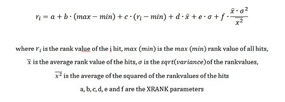

# 快速查詢語言 (FQL) 語法參照
深入了解如何使用「快速查詢語言 (FQL)」為 在 SharePoint 2013 中搜尋 建構複雜的搜尋查詢。此參考說明 FQL 查詢的元素，以及如何在 FQL 查詢中使用屬性規格、語彙基元運算式和運算子。
## SharePoint Server 2013 中的 FQL 和查詢語言子運算式與運算式的簡介
<a name="SP15FQL_about"> </a>

快速查詢語言 (FQL) 是一種強大的查詢語言，可讓開發人員執行明確的搜尋，並且為值屬於特定受管理屬性或全文檢索索引的搜尋縮小範圍。
  
    
    
表 1 所述的查詢語言運算式可以包含內含查詢字詞、屬性規格和運算子的巢狀子運算式。
  
    
    

**表 1：查詢語言運算式中的子運算式**


|**項目**|**描述**|
|:-----|:-----|
|語彙基元運算式  <br/> |要在查詢中搜尋的一或多個查詢字詞、片語或數值。  <br/> |
|屬性規格  <br/> |要與受影響的運算式比對的屬性或全文檢索索引。  <br/> |
|運算子  <br/> |指定布林值運算的關鍵字 (例如 **AND**、 **OR** ) 或其他運算元條件約束 (例如 **FILTER** )。 <br/> |
   

### FQL 查詢範例

下列 FQL 查詢範例會在已編製索引項目的 **body** 受管理屬性中搜尋字詞 "hello" 和 "world"：
  
    
    
 `body:string("hello world", mode="and")`
  
    
    
在範例中：
  
    
    

-  `body:` 將查詢限制在項目中 body 受管理屬性範圍。
    
  
-  `"hello world"` 是 **STRING** 運算子的運算元，指出要搜尋的字詞。
    
  
-  `mode="and"` 指出將套用 **AND** 查詢邏輯運算子至 `"hello world"`。
    
  
「快速查詢語言」查詢的長度限制在 2048 個字元。
  
    
    

## FQL 中的屬性規格
<a name="property_specification"> </a>

屬性規格可將受影響運算式的範圍限制在已編輯索引的內容的特定區域。這類區域可以經由全文檢索索引或受管理屬性加以識別。 
  
    
    
類型 **Text** 和 **YesNo** 的受管理屬性會評估為文字。所有其他受管理屬性類型，包括 **Datetime** 類型則評估為數值。
  
    
    
如果您未包含運算式的屬性規格，搜尋引擎會嘗試比對索引結構描述中定義的預設全文檢索索引。
  
    
    
屬性名稱必須一律在前面加上冒號 ( **In** 運算子)，而數值運算子則必須一律包含屬性規格。
  
    
    
屬性規格 ( **In** 運算子) 可套用至下列查詢實體：
  
    
    

- 單一字詞或片語，如下所示：
    
     `author:shakespeare`
  
    
    
 `title:"to be or not to be"`
    
  
- 運算子，例如 **STRING** 運算子，如下所示：
    
  ```
  
title:string("to be or not to be")
  ```


    在此情況下，屬性規格適用於完整運算子的運算式。
    
  

### 範例

以下的每個運算式會比對 **title** 受管理屬性中同時具備 "much" 及 "nothing" 的項目。
  
    
    
 `title:and(much, nothing)`
  
    
    
 `and(title:much, title:nothing)`
  
    
    
 `title:string("much nothing", mode="and")`
  
    
    

## FQL 中的語彙基元運算式
<a name="token_expressions"> </a>

語彙基元運算式是比對索引的字詞、片語或數值。
  
    
    
文字語彙基元運算式可以是單一字詞或片語，以雙引號括住。
  
    
    
數值語彙基元運算式可以是單一值或值範圍運算式。
  
    
    

### 萬用字元運算式

萬用字元運算式可指出包含星號 (" *****") 字元的單一字詞或片語；星號隱含會比對零或多個字元，但空白字元除外。FQL 支援個別文字受管理屬性和全文檢索索引的前置詞搜尋。
  
    
    

#### 萬用字元運算式範例

以下是 FQL 中萬用字元運算式的有效使用方式清單：
  
    
    

-  `text*`
    
  
-  `string("this examp*")`
    
  

### 數值字詞運算式
<a name="fql_token_numeric"> </a>

每個數值字詞運算式必須包含相容的索引結構描述資料類型的屬性規格。表 2 列出可用於 FQL 的數值資料類型。 
  
    
    

**表 2：可用於 FQL 的數值資料類型**


|**FQL 類型**|**相容的索引結構描述類型**|**描述**|
|:-----|:-----|:-----|
|**Int** <br/> |**Integer** <br/> |64 位元整數。  <br/> |
|**Float** <br/> |**Double** <br/> |64 位元 (雙精度) 浮點數。  <br/> |
|**Decimal** <br/> |**Decimal** <br/> |128 位元十進位  <br/> |
|**Datetime** <br/> |**Datetime** <br/> |日期和時間值。  <br/> FQL 中的日期/時間支援可啟用對日期/時間值如同對其他數值一般，執行相同的數值運算。  <br/> |
   

#### 日期和時間查詢運算式
<a name="fql_token_datetime"> </a>

FQL 為日期和時間提供 **datetime** 資料類型。
  
    
    
查詢中支援下列 ISO 8601 相容 **datetime** 格式：
  
    
    

- YYYY-MM-DD 
    
  
- YYYY-MM-DDThh:mm:ss 
    
  
- YYYY-MM-DDThh:mm:ssZ 
    
  
- YYYY-MM-DDThh:mm:ssfrZ
    
  
在這些 **datetime** 格式中：
  
    
    

-  _YYYY_ 指定四位數年份。
    
    > **注意事項**
      > 僅支援四位數的年份。 
-  _MM_ 指定兩位數的月份。例如，01 = 1 月。
    
  
-  _DD_ 指定兩位數的日期 (01 到 31)。
    
  
-  _T_ 指定字母 "T"。
    
  
-  _hh_ 指定兩位數的小時 (00 到 23)。不允許 A.M./P.M. 表示。
    
  
-  _mm_ 指定兩位數的分鐘 (00 到 59)。
    
  
-  _ss_ 指定兩位數的秒 (00 到 59)。
    
  
-  _fr_ 指定秒的選用分數 _ss_；接在秒後的 **.** 後面，1 到 7 位數。例如，2012-09-27T11:57:34.1234567。
    
  
所有日期/時間值均必須根據 UTC (國際標準時間)，也稱為 GMT (格林威治標準時間) 時區來指定。UTC 時區識別碼 (尾端的 "Z" 字元) 是選用的。
  
    
    

### 保留字、特殊字元及逸出
<a name="fql_token_numeric"> </a>

下列的文字為 FQL 內保留使用。
  
    
    
 `and, or, any, andnot, count, decimal, rank, near, onear, int, in32, int64, float, double, datetime, max, min, range, phrase, scope, filter, not, string, starts-with, ends-with, equals, words, xrank.`
  
    
    
如果您想要在查詢運算式中表達這些字詞中的任一個，必須以雙引號將它們括住，如下列範例所示： 
  
    
    

-  `or("any", "and", "xrank")`
    
  
-  `string("any and xrank", mode="OR")`
    
  
-  `phrase(this, is, a, "phrase")`
    
  

> **秘訣**
> 保留字和字元都不區分大小寫，但針對未來的相容性，建議使用小寫字元。 
  
    
    

FQL 並未一律要求使用雙引號括住字串。例如，儘管沒有雙引號括住  `cat` 和 `dog`， `and(cat, dog)` 亦為有效的 FQL。不過，建議您使用雙引號以避免發生保留字的衝突。
  
    
    
查詢字詞會根據您的地區設定語彙基元化。語彙基元化程序會移除某些特殊字元。由於特殊字元被移除，下列 FQL 運算式是相同的。
  
    
    
 `and("[king]", "<queen>")`
  
    
    
 `and("king", "queen")`
  
    
    
當查詢包含使用者或另一個應用程式輸入的字詞時，使用  `string("<query terms>", mode="AND|OR|PHRASE")` 運算子，以避免與查詢語言中的保留字發生衝突。您也必須從使用者提供的查詢中移除可能的雙引號。
  
    
    

## FQL 運算子
<a name="fql_operators"> </a>

快速查詢語言 (FQL) 運算子是指定布林值運算或其他運算元條件約束的關鍵字。FQL 運算子的語法如下：
  
    
    
 `[property-spec:]operator(operand [,operand]* [, parameter="value"]*)`
  
    
    
在語法中：
  
    
    

-  _property-spec_ 是一個選擇性的屬性規格，後面接著 "in" 運算子。
    
  
-  _operator_ 是指定要執行運算的關鍵字。
    
  
-  _operand_ 是字詞運算式或另一個運算子。
    
  
-  _parameter_ 是會變更運算子行為的值名稱。
    
  
-  _value_ 是要用於參數名稱的值。
    
  
運算子名稱、參數名稱和參數文字值不區分大小寫。運算子內文內允許空白字元，但除非使用雙引號括住，否則會忽略。「快速查詢語言」查詢的長度限制在 2048 個字元。
  
    
    
表 3 列出 FQL 運算子支援的類型。 
  
    
    

**表 3：FQL 支援的運算子類型**


|**類型**|**描述**|**運算子**|
|:-----|:-----|:-----|
|字串  <br/> |可讓您指定對一串字詞的查詢運算。這是對文字字詞最常使用的運算子。  <br/> | [STRING](fast-query-language-fql-syntax-reference.md#fql_string_operator) <br/> |
|布林值  <br/> |可讓您在查詢中結合字詞與子運算式。  <br/> | [AND](fast-query-language-fql-syntax-reference.md#fql_and_operator)、 [OR](fast-query-language-fql-syntax-reference.md#fql_or_operator)、 [ANY](fast-query-language-fql-syntax-reference.md#fql_any_operator)、 [ANDNOT](fast-query-language-fql-syntax-reference.md#fql_andnot_operator)、 [NOT](fast-query-language-fql-syntax-reference.md#fql_not_operator)、 [COUNT](fast-query-language-fql-syntax-reference.md#fql_count_operator)、 [COUNT](fast-query-language-fql-syntax-reference.md#fql_count_operator) <br/> |
|近似性  <br/> |可讓您在比對文字序列中指定查詢字詞的近似值。  <br/> | [NEAR](fast-query-language-fql-syntax-reference.md#fql_near_operator)、 [ONEAR](fast-query-language-fql-syntax-reference.md#fql_onear_operator)、 [PHRASE](fast-query-language-fql-syntax-reference.md#fql_phrase_operator)、 [STARTS-WITH](fast-query-language-fql-syntax-reference.md#fql_startswith_operator)、 [ENDS-WITH](fast-query-language-fql-syntax-reference.md#fql_endswith_operator)、 [EQUALS](fast-query-language-fql-syntax-reference.md#fql_equals_operator) <br/> |
|數值  <br/> |可讓您在查詢中指定數值條件。  <br/> | [RANGE](fast-query-language-fql-syntax-reference.md#fql_range_operator)、 [INT](fast-query-language-fql-syntax-reference.md#fql_int_operator)、 [FLOAT](fast-query-language-fql-syntax-reference.md#fql_float_operator)、 [DATETIME](fast-query-language-fql-syntax-reference.md#fql_datetime_operator)、 [DECIMAL](#fql_decimal_operator) <br/> |
|相關性  <br/> |可讓您影響查詢的相關性評估。  <br/> | [XRANK](fast-query-language-fql-syntax-reference.md#fql_xrank_operator) 和 [FILTER](fast-query-language-fql-syntax-reference.md#fql_filter_operator) <br/> |
   
表 4 列出支援的運算子。
  
    
    

**表 4：FQL 支援的運算子**


|**運算子**|**描述**|**類型**|
|:-----|:-----|:-----|
| [AND](fast-query-language-fql-syntax-reference.md#fql_and_operator) <br/> |僅傳回符合所有 **AND** 運算元的項目。 <br/> |布林值  <br/> |
| [ANDNOT](fast-query-language-fql-syntax-reference.md#fql_andnot_operator) <br/> |僅傳回符合第一個運算元，但不符合後續運算元的項目。  <br/> |布林值  <br/> |
| [ANY](fast-query-language-fql-syntax-reference.md#fql_any_operator) <br/> |類似 **OR** 運算子，不同處在於動態排名 (結果集中的相關性分數) 不會受到符合的運算元數目或是項目中字詞之間的距離之影響。 <br/> |布林值  <br/> |
| [COUNT](fast-query-language-fql-syntax-reference.md#fql_count_operator) <br/> |可讓您指定項目必須包含以傳回為結果的查詢字詞出現次數。運算元可以是單一查詢字詞、片語或萬用字元查詢字詞。  <br/> |布林值  <br/> |
| [DATETIME](fast-query-language-fql-syntax-reference.md#fql_datetime_operator) <br/> |提供明確輸入的數值。  <br/> 明確類型轉換為選用，且通常不需要。會根據目標數值受管理屬性的類型來偵測查詢字詞的類型。  <br/> |數值  <br/> |
| [DECIMAL](fast-query-language-fql-syntax-reference.md#fql_decimal_operator) <br/> |提供明確輸入的數值。  <br/> 明確類型轉換為選用，且通常不需要。會根據目標數值受管理屬性的類型來偵測查詢字詞的類型。  <br/> |數值  <br/> |
| [ENDS-WITH](fast-query-language-fql-syntax-reference.md#fql_endswith_operator) <br/> |指定字詞或片語必須出現在受管理屬性的結尾。  <br/> |近似性  <br/> |
| [EQUALS](fast-query-language-fql-syntax-reference.md#fql_equals_operator) <br/> |指定字詞或片語的字詞或片語必須提供與受管理屬性完全符合的語彙基元。  <br/> |近似性  <br/> |
| [FILTER](fast-query-language-fql-syntax-reference.md#fql_filter_operator) <br/> |用來查詢中繼資料或其他結構化資料。  <br/> |相關性  <br/> |
| [FLOAT](fast-query-language-fql-syntax-reference.md#fql_float_operator) <br/> |提供明確輸入的數值。  <br/> 明確類型轉換為選用，且通常不需要。會根據目標數值受管理屬性的類型來偵測查詢字詞的類型。  <br/> |數值  <br/> |
| [INT](fast-query-language-fql-syntax-reference.md#fql_int_operator) <br/> |提供明確輸入的數值。  <br/> 明確類型轉換為選用，且通常不需要。會根據目標數值受管理屬性的類型來偵測查詢字詞的類型。  <br/> |數值  <br/> |
| [NEAR](fast-query-language-fql-syntax-reference.md#fql_near_operator) <br/> |將結果集限制在彼此距離某個範圍內具有  `N` 字詞的項目。 <br/> |近似性  <br/> |
| [NOT](fast-query-language-fql-syntax-reference.md#fql_not_operator) <br/> |僅傳回排除運算元的項目。  <br/> |布林值  <br/> |
| [ONEAR](fast-query-language-fql-syntax-reference.md#fql_onear_operator) <br/> |**NEAR** 的排序變異，而且需要比對排序的字詞。 **ONEAR** 運算子可以用來將結果集限制在特定距離內有 `N` 字詞的項目，僅傳回不符合運算元的唯一項目。運算元之間可以是任何有效的 FQL 運算式。 <br/> |近似性  <br/> |
| [OR](fast-query-language-fql-syntax-reference.md#fql_or_operator) <br/> |僅傳回至少符合一個 **OR** 運算元的項目。如果符合多個 **OR** 運算元，符合的項目將獲得較高的動態排名 (結果集中的相關性分數)。 <br/> |布林值  <br/> |
| [PHRASE](fast-query-language-fql-syntax-reference.md#fql_phrase_operator) <br/> | 僅傳回符合確切語彙基元字串的項目。 <br/> |近似性  <br/> |
| [RANGE](fast-query-language-fql-syntax-reference.md#fql_range_operator) <br/> | 啟用範圍比對運算式。 **RANGE** 運算子用於數值和日期/時間受管理的屬性。 <br/> |數值  <br/> |
| [STARTS-WITH](fast-query-language-fql-syntax-reference.md#fql_startswith_operator) <br/> |指定字詞或片語必須出現在受管理屬性的開頭。  <br/> |近似性  <br/> |
| [STRING](fast-query-language-fql-syntax-reference.md#fql_string_operator) <br/> |定義文字字串的布林值比對條件。  <br/> |字串  <br/> |
| [XRANK](fast-query-language-fql-syntax-reference.md#fql_xrank_operator) <br/> |可讓您根據特定字詞的出現次數提升項目的動態排名，而不會變更符合查詢的項目。 **XRANK** 運算式包含必須符合的一個元件與僅對動態排名有影響的一或多個元件。 <br/> |相關性  <br/> |
   

> **注意事項**
> 在 SharePoint 2013 中， **RANK** 運算子已過時，不再有任何影響。請改用 **XRANK**。 
  
    
    


### AND
<a name="fql_and_operator"> </a>

僅傳回符合所有 **AND** 運算元的項目。運算元可以是單一字詞或任何有效的 FQL 子運算式。
  
    
    

#### 語法

 `and(operand, operand [, operand]*)`
  
    
    

#### 參數

不適用。
  
    
    

#### 範例

下列運算式會比對預設全文檢索索引包含 "cat"、"dog" 和 "fox" 的項目。
  
    
    
 `and(cat, dog, fox)`
  
    
    

### ANDNOT
<a name="fql_andnot_operator"> </a>

僅傳回符合第一個運算元，但不符合後續運算元的項目。運算元可以是單一字詞或任何有效的 FQL 子運算式。
  
    
    

#### 語法

 `andnot(operand, operand [,operand]*)`
  
    
    

#### 參數

不適用。
  
    
    

#### 範例

 **範例 1：** 下列運算式會比對預設全文檢索索引包含 "cat" 但不包含 "dog" 的項目。
  
    
    
 `andnot(cat, dog)`
  
    
    
 **範例 2：** 下列運算式會比對預設全文檢索索引包含 "dog"，但不包含 "beagle" 或 "chihuahua" 的項目。
  
    
    
 `andnot(dog, beagle, chihuahua)`
  
    
    

### ANY
<a name="fql_any_operator"> </a>


> **注意事項**
> 在 SharePoint Server 2013 中， **ANY** 運算子已過時。請改用 **OR** 運算子。
  
    
    

類似  [OR](fast-query-language-fql-syntax-reference.md#fql_or_operator) 運算子，不同處在於動態排名 (結果集中的相關性分數) 不會受到符合的運算元數目或是項目中字詞之間的距離之影響。運算元可以是單一字詞或任何有效的 FQL 子運算式。
  
    
    
此部分查詢的動態排名元件是基於 **ANY** 運算式內最符合的字詞。
  
    
    

> **注意事項**
> 與 **OR** 的差異在於僅與結果集內的排名相關。項目集的總計會與查詢相符。
  
    
    


#### 語法

 `any(operand, operand [,operand]*)`
  
    
    

#### 參數

不適用。
  
    
    

#### 範例

 下列運算式會比對預設全文檢索索引包含 "cat" 或 "dog" 的項目。
  
    
    
如果索引同時包含 "cat" 和 "dog"，但將 "cat" 視為更進一步的相符項目，項目的動態排名將基於 "cat"而不會考量 "dog" 的部分。
  
    
    
 `any(cat, dog)`
  
    
    

### COUNT
<a name="fql_count_operator"> </a>

指定項目必須包含以將項目傳回為結果的查詢字詞出現次數。運算元可以是單一查詢字詞、片語或萬用字元查詢字詞。
  
    
    

#### 語法

 `property-spec:count(operand [,from=<numeric value>, to=<numeric value>])`
  
    
    

#### 參數


|**參數**|**值**|**描述**|
|:-----|:-----|:-----|
| _From_ <br/> | _<numeric_value>_ <br/> | _from_ 參數的值必須是正整數，指定特定的運算元必須符合的最低次數。 <br/> 如果未指定  _from_ 參數，則沒有下限。 <br/> |
| _to_ <br/> | _<numeric_value>_ <br/> | _to_ 參數的值必須是正整數，指定特定的運算元必須符合的非內含次數上限。例如， _to_ 值 **11** 指定 10 次或更少。 <br/> 如果未指定  _to_ 參數，則沒有上限。 <br/> |
   

#### 範例

 **範例 1：** 下列運算式會比對文字 "cat" 出現次數至少 5 次的項目。
  
    
    
 `count(cat, from=5)`
  
    
    
 **範例 2：** 下列運算式會比對文字 "cat" 出現次數至少 5 次但不超過 10 次的項目。
  
    
    
 `count(cat, from=5, to=10)`
  
    
    
 **範例 3：** 以下的每個運算式會比對出現特定字至少 3 次的項目，並且該字詞可以是 "cat" 或 "dog"。
  
    
    
 `count(or(cat, dog), from=3)count(string("cat dog", mode="or"), from=3)`
  
    
    
下表包含受管理屬性字串值的範例，並說明它們是否符合範例 3 中的兩個運算式。
  
    
    


|**比對？**|**文字**|
|:-----|:-----|
|是  <br/> |My cat likes my dog, but my dog hates my cat.  <br/> |
|否  <br/> |My bird likes my newt, but my dog hates my cat.  <br/> |
   

### DATETIME
<a name="fql_datetime_operator"> </a>

提供明確輸入的日期/時間數值。運算元是基於  [FQL 中的語彙基元運算式](fast-query-language-fql-syntax-reference.md#token_expressions)中指定語法的日期/時間格式字串。
  
    
    
明確類型轉換為選用，且通常不需要。會根據目標數值受管理屬性的類型來偵測查詢字詞的類型。
  
    
    

#### 語法

 `datetime(<date/time string>)`
  
    
    

#### 參數

不適用。
  
    
    

### DECIMAL
<a name="fql_decimal_operator"> </a>

提供明確輸入的十進位值。運算元是基於  [FQL 中的語彙基元運算式](fast-query-language-fql-syntax-reference.md#token_expressions) 中指定語法的十進位值。
  
    
    
明確類型轉換為選用，且通常不需要。會根據目標數值受管理屬性的類型來偵測查詢字詞的類型。
  
    
    

#### 語法

 `decimal(<decimal point value>)`
  
    
    

#### 參數

不適用。
  
    
    

### ENDS-WITH
<a name="fql_endswith_operator"> </a>

指定字詞或片語必須出現在受管理屬性的結尾 (界限比對)。
  
    
    
數值受管理屬性上不支援界限比對。數值受管理屬性一律受限於完全符合或值範圍比對。 
  
    
    
某些應用程式可能要求您可以執行受管理屬性的完全符合比對。例如，這可能是 **product name** 受管理屬性，其中，一項產品的完整名稱是另一個產品名稱的子字串。
  
    
    

#### 語法

 `ends-with(<term or phrase>)`
  
    
    

#### 參數

不適用。
  
    
    

#### 範例

下列運算式會比對 "author" 受管理屬性中具有值 "Mr Adam Jones" 和 "Adam Jones"的項目。不會比對具有值 "Adam Jones sr" 的項目。
  
    
    
 `author:ends-with("adam jones")`
  
    
    

#### 備註

界限比對可套用至受管理屬性的所有文字，或在受管理屬性中含有清單 (例如名稱清單) 的字串值的個別字串。在此情況下，您可能想要比對每個字串的確切內容，並避免跨字串界限進行查詢比對。 
  
    
    
若要套用界限比對查詢，您必須在索引結構描述中設定相關的受管理屬性。 
  
    
    
藉由啟用受管理屬性的界限比對功能，您可以執行下列作業： 
  
    
    

- 使用明確的界限比對查詢。 
    
  
- 防止跨字串界限比對片語。針對包含多個字串的受管理屬性，此功能可確保該字串不會在界限指定之前或之後比對字串。
    
  

### EQUALS
<a name="fql_equals_operator"> </a>

指定字詞或片語必須提供與受管理屬性完全符合的語彙基元。
  
    
    

#### 語法

 `equals(<term or phrase>)`
  
    
    

#### 參數

不適用。
  
    
    

#### 範例

下列範例會比對 "author" 受管理屬性中具有值 "Adam Jones" 的項目。不會比對具有值 "Adam Jones sr" 或 "Mr Adam Jones" 的項目。
  
    
    
 `author:equals("adam jones")`
  
    
    

#### 備註

另請參閱  [ENDS-WITH](fast-query-language-fql-syntax-reference.md#fql_endswith_operator)。
  
    
    

### FILTER
<a name="fql_filter_operator"> </a>

用來查詢中繼資料或其他結構化資料。 
  
    
    
使用 **FILTER** 運算子會為指定的查詢自動隱含下列項目：
  
    
    

- 語言將設為 linguistics="OFF"。
    
  
- 將停用排名。
    
  
- 針對查詢結果的命中項目，不會在命中項目醒目提示摘要中使用查詢反白顯示。
    
  

> **秘訣**
> 如果您在 **FILTER** 運算式內使用 **STRING** 運算子，預設會停用語言。利用運算元 `linguistics="ON"`，您可以在 **FILTER** 的每個 **STRING** 運算式內啟用語言處理。
  
    
    


#### 語法

 `filter(<any valid FQL operator expression>)`
  
    
    

#### 參數

不適用。
  
    
    

#### 範例

下列運算式會比對 **Title** 受管理屬性包含 "sonata" 和 **Doctype** 受管理屬性只包含語彙基元 "audio" 的項目。將不會對 "audio" 執行語言比對。因為 **FILTER** 語彙基元會用於比對 "audio"，該文字將不會在命中項目醒目提示摘要中反白顯示。
  
    
    
 `and(title:sonata, filter(doctype:equals("audio")))`
  
    
    

#### 備註

如果必須限制您的查詢，以比對一組大量的數值屬性中的至少一個整數值，您可以使用這兩個功能上相同的方式來表示： 
  
    
    

-  `and(string("hello world"), filter(property-spec:or(1, 20, 453, ... , 3473)))`
    
  
-  `and(string("hello world"), filter(property-spec:int("1 20 453 ... 3473", mode="or")))`
    
  
第二個範例使用一組以雙引號括住數值的字串，來使用 **INT** 運算子。篩選一組大量的數值時，這會提供更顯著的查詢效能。
  
    
    
如果您必須篩選一組大量的值，應該考慮使用數值而非字串值，並使用最佳化語法來表示您的查詢。
  
    
    

### FLOAT
<a name="fql_float_operator"> </a>

提供明確輸入的浮點數值。運算元是基於  [FQL 中的語彙基元運算式](fast-query-language-fql-syntax-reference.md#token_expressions)中指定語法的浮點值。
  
    
    
明確類型轉換為選用，且通常不需要。會根據目標數值受管理屬性的類型來偵測查詢字詞的類型。
  
    
    

#### 語法

 `float(<floating point value>)`
  
    
    

#### 參數

不適用。
  
    
    

### INT
<a name="fql_int_operator"> </a>

提供明確輸入的整數值。運算元是基於  [FQL 中的語彙基元運算式](fast-query-language-fql-syntax-reference.md#token_expressions)中指定語法的整數值。
  
    
    
明確類型轉換為選用，且通常不需要。會根據目標數值受管理屬性的類型來偵測查詢字詞的類型。
  
    
    
 **INT** 運算子也可用來做為布林值 FQL 運算子引數，以表示一組整數值。這提供有效率的方式在查詢中提供一組整數值，因為使用 **INT** 運算子傳遞的值，不會由 FQL 查詢剖析器剖析，而是會直接傳遞至符合查詢的元件。
  
    
    

#### 語法

 `int(<integer value>)`
  
    
    
 `int("value, value, … , value")`
  
    
    
第一個語法指定單一整數。第二個語法指定以雙引號括住的整數值逗號分隔清單。
  
    
    

#### 參數

不適用。
  
    
    

#### 範例

如果您需要將查詢限制在至少符合數值屬性中一組大量整數值中的一個，您可以使用 **INT** 運算子來表示：
  
    
    
 `and(string("hello world"), filter(id:int("1 20 49 124 453 985 3473", mode="or")))`
  
    
    

### NEAR
<a name="fql_near_operator"> </a>

將結果集限制在彼此距離某個範圍內具有  _N_ 字詞的項目。
  
    
    
查詢字詞的順序對比對並不重要，只有距離有影響。 
  
    
    
任何數目的字詞均可以與 **NEAR** 運算子結合。
  
    
    
 **NEAR** 運算元可以是單一字詞、片語或布林值 **OR** 或 **ANY** 運算子的運算式。接受使用萬用字元。
  
    
    
如果 **NEAR** 運算子的多個運算元符合編製索引相同語彙基元，會將它們視為鄰近。
  
    
    

#### 語法

 `near(arg, arg [, arg]* [, N=<numeric value>])`
  
    
    

#### 參數


|**參數**|**值**|**描述**|
|:-----|:-----|:-----|
| _N_ <br/> | _<numeric_value>_ <br/> |指定字詞 (明確近似值) 之間允許出現的字詞數目上限。  <br/> 如果 **NEAR** 包含兩個以上的運算元，字詞之間所允許的文字最大數目會在整個運算式內計算 ( _N_)。  <br/> 預設值： **4** <br/> |
   

#### 範例

 **範例 1：** 下列運算式會比對包含 "cat" 和 "dog" 的字串，前提是將其分隔的索引語彙基元不超過四個 (預設)。
  
    
    
 `near(cat, dog)`
  
    
    
 **範例 2：** 下列運算式會比對包含 "cat"、"dog"、"fox" 和 "wolf" 的字串，前提是將其分隔的索引語彙基元不超過四個。
  
    
    
 `near(cat, dog, fox, wolf)`
  
    
    
下表包含受管理屬性字串值的範例，並說明它們是否符合範例 2 中先前的運算式。
  
    
    


|**比對？**|**文字**|
|:-----|:-----|
|是  <br/> |The picture shows a cat, a dog, a fox, and a wolf.  <br/> |
|是 (使用相關字詞功能)  <br/> |Dogs, foxes, and wolves are canines, but cats are felines.  <br/> |
|否  <br/> |The picture shows a cat with a dog, a fox, and a wolf.  <br/> |
   
下列運算式會比對前一個表格中的字串。
  
    
    
 `near(cat, dog, fox, wolf, N=5)`
  
    
    

#### 備註

 **NEAR/ONEAR 字詞距離考量**
  
    
    
 _N_ 指出在項目相符區段內的查詢字詞之間所允許顯示的文字數目上限。如果 **NEAR** 或 **ONEAR** 包含兩個以上的運算元，查詢字詞之間所允許文字的上限 ( _N_) 會在符合所有 **NEAR** 或 **ONEAR** 字詞的項目區段內計算。
  
    
    
 **NEAR** 或 **ONEAR** 可對語彙基元化文字運作。這表示特殊字元，例如逗號 (" **,** ")、句號 (" **.** ")，冒號 (" **:** ")，或分號 (" **;** ") 會被視為空白字元。「距離」一詞與編製索引的文字中的語彙基元有關。
  
    
    
如果您使用 **ONEAR** 或 **NEAR** 搭配 equal 運算元，運算子的運作方式如下：
  
    
    
 `near(a, a, n=x)`
  
    
    
如果至少一個 '' `a`'' 執行個體出現在內容中，此查詢一律會傳回 **true**。這也表示 **NEAR** 不能當作 **COUNT** 運算子。如需計算字詞出現次數的詳細資訊，請參閱 [COUNT](fast-query-language-fql-syntax-reference.md#fql_count_operator) 運算子。
  
    
    
套用至片語的 **NEAR** 也會比對文字中重疊的片語。
  
    
    
如果相符區段中的語彙基元會對 **NEAR** 或 **ONEAR** 運算式比對多個運算元，即使相符區段中不相符語彙基元的數目超過 **NEAR** 或 **ONEAR** 運算子的運算式中 ' _N_' 的值，查詢仍會比對。例如，重疊可以是重疊片語。如果語彙基元重疊相符的數目是 ' `O`'，查詢會比對是否多個 ' `N+O`' 不相符的語彙基元出現在項目的相符區段。 
  
    
    
 ** **NEAR** 或 **ONEAR** 搭配 **NOT****
  
    
    
 **NOT** 運算子不能使用在 **NEAR** 或 **ONEAR** 運算子內。以下是不正確的 FQL 語法：
  
    
    
 `near(audi,not(bmw),n=2)`
  
    
    

### NOT
<a name="fql_not_operator"> </a>

僅傳回不符合運算元的項目。運算元可以是任何有效的 FQL 運算式。
  
    
    

#### 語法

 `not(operand)`
  
    
    

#### 參數

不適用。
  
    
    

### ONEAR
<a name="fql_onear_operator"> </a>

 **NEAR** 的排序變異，而且需要比對排序的字詞。 **ONEAR** 運算子可以用來將結果集限制在彼此距離某個範圍內具有 _N_ 字詞的項目。
  
    
    

#### 語法

 `onear(arg, arg [, arg]* [, N=<numeric value>])`
  
    
    

#### 參數


|**參數**|**值**|**描述**|
|:-----|:-----|:-----|
| _N_ <br/> | _<numeric_value>_ <br/> |指定字詞 (明確近似值) 之間允許出現的字詞數目上限。  <br/> 如果 **ONEAR** 包含兩個以上的運算元，字詞之間所允許的文字最大數目會在整個運算式內計算 ( _N_)。  <br/> 預設值： **4** <br/> |
   

#### 範例

 **範例 1：** 下列運算式會比對依序出現的 "cat"、"dog"、"fox" 和 "wolf" 文字的所有出現次數，前提是將其分隔的索引語彙基元不超過四個 (預設)。
  
    
    
 `onear(cat, dog, fox, wolf)`
  
    
    
下表包含受管理屬性字串值的範例，並說明它們是否符合先前的運算式。
  
    
    


|**比對？**|**文字**|
|:-----|:-----|
|是  <br/> |The picture shows a cat, a dog, a fox, and a wolf.  <br/> |
|否  <br/> |Dogs, foxes, and wolves are canines, but cats are felines.  <br/> |
|否  <br/> |The picture shows a cat with a dog, a fox, and a wolf.  <br/> |
   
 **範例 2：** 下列運算式會比對 (使用相關字詞功能) 前一個表格的第二個資料列中的文字。
  
    
    
 `onear(dog, fox, wolf, cat, N=5)`
  
    
    
 **範例 3：** 下列運算式會比對前一個表格中第一個和第三個資料列中的文字。
  
    
    
 `onear(cat, dog, fox, wolf, N=5)`
  
    
    

#### 備註

另請參閱  [NEAR](fast-query-language-fql-syntax-reference.md#fql_near_operator)。
  
    
    

### OR
<a name="fql_or_operator"> </a>

僅傳回至少符合一個 **OR** 運算元的項目。如果符合多個 **OR** 運算元，符合的項目將獲得較高的動態排名 (結果集中的相關性分數)。運算元可以是單一字詞或任何有效的 FQL 子運算式。
  
    
    

#### 語法

 `or(operand, operand [,operand]*)`
  
    
    

#### 參數

不適用。
  
    
    

#### 範例

下列運算式會比對預設全文檢索索引包含 "cat" 或 "dog" 的所有項目。如果項目的預設全文檢索索引包含 "cat" 和 "dog"，它會比對並相較於只包含其中一個語彙基元，具有較高的動態排名。
  
    
    
 `or(cat, dog)`
  
    
    

### PHRASE
<a name="fql_phrase_operator"> </a>

搜尋語彙基元的確切字串。 
  
    
    
 **PHRASE** 運算元可以是單一字詞。接受使用萬用字元。
  
    
    

#### 語法

 `phrase(term [, term]*)`
  
    
    

#### 參數

不適用。
  
    
    

#### 備註

另請參閱  [STRING](fast-query-language-fql-syntax-reference.md#fql_string_operator)。
  
    
    

### RANGE
<a name="fql_range_operator"> </a>

將 **RANGE** 用於數值和日期/時間受管理的屬性。運算子可啟用範圍比對運算式。
  
    
    

#### 語法

 `range(start, stop [,from="GE"|"GT"] [,to="LE"|"LT"])`
  
    
    

#### 參數


|**參數**|**值**|**描述**|
|:-----|:-----|:-----|
| _start_ <br/> | _<numeric_value>|<date/time_value>_ <br/> |範圍的起始值。  <br/> 若要指定範圍沒有下限，請使用保留字 **min** 。 <br/> |
| _stop_ <br/> | _<numeric_value>|<date/time_value>_ <br/> |範圍的結束值。  <br/> 若要指定範圍沒有上限，請使用保留字 **max** 。 <br/> |
| _from_ <br/> |**GE|GT** <br/> | 指出開啟或關閉開始間隔的選擇性參數。 <br/>  有效的值： <br/> **GE** 大於或等於起始值 (>= 間隔的開始)。 <br/> **GT** 大於起始值 (> 間隔的開始)。 <br/>  預設值： **GE** <br/> |
| _to_ <br/> |**LE|LT** <br/> | 表示開啟或關閉結束間隔的選擇性參數。 <br/>  有效的值： <br/> **LE** 小於或等於結束值 (<= 間隔結束)。 <br/> **LT** 小於結束值 (< 間隔的結束)。 <br/>  預設值： **LT** <br/> |
   

#### 範例

下列運算式會比對以片語 "olympic games" 開頭，大小至少 10 000 位元組的項目中出現的說明內容。
  
    
    
 `and(size:range(10000, max), description:starts-with("olympic games"))`
  
    
    

### STARTS-WITH
<a name="fql_startswith_operator"> </a>

指定字詞或片語必須出現在受管理屬性的開頭。
  
    
    

#### 語法

 `starts-with(<term or phrase>)`
  
    
    

#### 參數

不適用。
  
    
    

#### 範例

下列運算式會比對 **author** 受管理屬性中具有 "Adam Jones sr" 和 "Adam Jones" 值的項目。不會比對具有值 "Mr Adam Jones" 的項目。
  
    
    
 `author:starts-with("adam jones")`
  
    
    

#### 備註

如需界限比對的其他備註，請參閱  [ENDS-WITH](fast-query-language-fql-syntax-reference.md#fql_endswith_operator)。
  
    
    

### STRING
<a name="fql_string_operator"> </a>

定義文字字串的布林值比對條件。
  
    
    
運算元為要比對的文字字串 (一或多個字詞)。字串後面是零或多個參數。 
  
    
    
 **STRING** 運算子也可用為類型轉換。例如，查詢 `string("24.5")`，會將數值 "24.5" 視為文字字串。
  
    
    

#### 語法

 `string("<text string>"`
  
    
    
 ` [, mode=<mode>]`
  
    
    
 ` [, n=<near>]`
  
    
    
 ` [, weight=<n>]`
  
    
    
 ` [, linguistics=<on|off>]`
  
    
    
 ` [, wildcard=<on|off>])`
  
    
    

#### 參數


|**參數**|**值**|**描述**|
|:-----|:-----|:-----|
| _mode_ <br/> | _<mode>_ <br/> | _mode_ 參數會指定如何評估 <text string> 值。下列清單顯示有效的值。 <br/> **"PHRASE"** - `phrase(term [,term]*)` <br/> |**Mode**|**相等運算子的運算式**|
|:-----|:-----|
|**"PHRASE"** <br/> | `phrase(term [,term]*)` <br/> |
|**"AND"** <br/> | `and(term, term [,term]*)` <br/> |
|**"OR"** <br/> | `or(term, term [,term]*)` <br/> |
|**"ANY"** <br/> | `any(term, term [,term]*)` <br/> |
|**"NEAR"** <br/> | `near(term, term [,term]*, N)` <br/> |
|**"ONEAR"** <br/> | `onear(term, term [,term]*, N)` <br/> |
   
 預設值： **"PHRASE"** <br/> |
| _n_ <br/> | _<numeric_value>_ <br/> |此參數指出  _mode_= **"NEAR"** 或 _mode_= **"ONEAR"** 的最大字詞距離。 <br/> 下列運算式是相同的：  <br/>  `string("hello world", mode="NEAR", n=5)` <br/>  `near(hello, world, n=5)` <br/> 預設值： **4** <br/> |
| _weight_ <br/> | _<numeric_value>_ <br/> |此參數是正數值，指出動態排名的字詞權數。  <br/> 值愈低表示字詞對排名的影響愈小。值愈高表示字詞對排名的影響愈大。weight 參數值為零指定字詞應該不會影響動態排名。  <br/>  _weight_ 參數適用於 **STRING** 運算式中的所有字詞。 <br/> > **秘訣**> weight 參數將只會影響全文檢索索引查詢。           預設值： **100** 。 <br/> |
| _linguistics_ <br/> |**on|off** <br/> |停用/啟用字串 (詞形還原、同義字，拼字檢查) 的所有語言功能 (若已對查詢啟用)。  <br/> 若您仍希望字詞或字串可影響排名，您可以使用此參數來關閉指定字詞或字串的語言處理。  <br/> 預設值： **"ON"** <br/> |
| _wildcard_ <br/> |**on|off** <br/> | 此參數控制 _<text string>_ 內字詞的萬用字元延伸。此設定會覆寫查詢參數中任何萬用字元的設定，並允許在查詢的特定部分啟用或停用延伸的萬用字元。 <br/>  有效值如下： <br/> **"ON"** 指定將字元 " *****" 評估為萬用字元。" *****" 字元會比對零或多個字元。  <br/> **"OFF"** 指定字元 " *****" 不會評估為萬用字元。  <br/>  預設值： **"ON"** <br/> |
   

> **注意事項**
> 在 SharePoint 2013 中， **STRING** 運算子的 _minexpansion_、 _maxexpansion_ 和 _annotation_class_ 參數已過時。
  
    
    


#### 範例

 **範例 1：** 因為預設字串模式是 " **STRING** "，下列每個運算式都會傳回相同的結果。
  
    
    
 `"what light through yonder window breaks"string("what light through yonder window breaks")string("what light through yonder window breaks", mode="phrase")phrase(what, light, through, yonder, window, breaks)`
  
    
    
 **範例 2：** 下列字串語彙基元運算式與 **AND** 運算子的運算式會傳回相同的結果。
  
    
    
 `string("cat dog fox", mode="and")and(cat, dog, fox)`
  
    
    
 **範例 3：** 下列字串語彙基元運算式與 **OR** 運算子的運算式會傳回相同的結果。
  
    
    
 `string("coyote saguaro", mode="or")or(coyote, saguaro)`
  
    
    
 **範例 4：** 下列字串語彙基元運算式與 **ANY** 運算子的運算式會傳回相同的結果。
  
    
    
 `string("coyote saguaro", mode="any")any(coyote, saguaro)`
  
    
    
 **範例 5：** 下列字串語彙基元運算式與 **NEAR** 運算子的運算式會傳回相同的結果。
  
    
    
 `string("coyote saguaro", mode="near")near(coyote, saguaro)`
  
    
    
 **範例 6：** 下列字串語彙基元運算式與 **NEAR** 運算子的運算式會傳回相同的結果。
  
    
    
 `string("cat dog fox wolf", mode="near", N=4)near(cat, dog, fox, wolf, N=4)`
  
    
    
 **範例 7：** 下列字串語彙基元運算式與 **ONEAR** 運算子的運算式會傳回相同的結果。
  
    
    
 `string("cat dog fox wolf", mode="onear")onear(cat, dog, fox, wolf)`
  
    
    
 **範例 8：** 下列字串語彙基元運算式會在語言功能停用的情況下比對 "nobler" 文字，因此，不會使用相關字詞功能比對其他形式的文字 (例如 "ennobling")。
  
    
    
 `string("nobler", linguistics="off")`
  
    
    
 **範例 9：** 下列運算式會比對包含 "cat"或 "dog" 的項目，但此運算式會增加包含 "dog" 多於包含 "cat" 的項目的動態排名。
  
    
    
 `or(string("cat", weight="200"), string("dog", weight="500"))`
  
    
    

#### 備註

 **動態排名相關性權數**
  
    
    
 **weight** 參數的主要影響是針對 **OR** 查詢。也可能對 **AND** 查詢有影響。動態排名演算法可能隱含會根據字詞比對發生的位置對不同的字詞提供不同的排名比重。
  
    
    
排名比重的差異也可能根據字詞頻率和反向項目頻率。範例如下：
  
    
    

- 查詢： `and(string("a"), string("b", weight=200))`
    
  
- 索引結構描述： **title** 受管理屬性較 **body** 受管理屬性具有較高的權數。
    
  
- 索引項目 1 的標題包含字詞 'a' 和內文包含字詞 'b'。 
    
  
- 索引項目 2 的內文包含字詞 'a' 和標題包含字詞 'b'。 
    
  
在此範例中，項目 2 會獲得較高的總排名，因為具有較高動態排名比重的項目會獲得更多提升。
  
    
    

> **秘訣**
> 相對字詞提升 (正數或負數) 會套用至總排名的動態排名元件。不過，近似值提升 (字與字之間的距離) 排名計算不受字詞權數影響。相對權數不一定隱含項目的總排名已根據指定的百分比修改。 > 下列查詢會搜尋字詞 "peter"、"paul" 或 "mary"，其中 "peter" 將較其他兩個字詞有兩倍的排名比重。 >  `or(peter, string("paul mary", mode="OR", weight=50))`
  
    
    

 **處理具有特殊字元的字串**
  
    
    
特殊字元，例如逗號 (",")、分號 (";")、冒號 (":")、句號 (".")、減號 ("-")、底線 ("_") 或正斜線 ("/") 在以雙引號括住的字串運算式中會被視為空白字元。這與語彙基元化程序相關。這些字元也隱含這些字元分隔的語彙基元的隱含片語。 
  
    
    
下列查詢運算式是相同的。
  
    
    
 `title:string("animals birds", mode="phrase")title:"animals/birds"title:string("animals/birds", mode="and")title:string("animals/birds", mode="or")`
  
    
    
下列查詢運算式是相同的。
  
    
    
 `title:or(string("animals birds", mode="phrase"), string("animals insects", mode="phrase"))title:string("animals/birds animals/insects", mode="or")`
  
    
    
下列查詢運算式是相同的。
  
    
    
 `body:string("help contoso com", mode="phrase")body:string("help@contoso.com")`
  
    
    
 **語彙基元化片語比對**
  
    
    
您可以使用 **STRING** 運算子搭配 _mode_="phrase" 或 **PHRASE** 運算子來搜尋語彙基元的確切字串。
  
    
    
所有這類片語運算隱含語彙基元化的片語比對。這表示特殊字元，例如逗號 (" **,** ")、分號 (" **;** ")、冒號 (" **:** ")、底線 (" **_** ")、減號 (" **-** ") 或正斜線 (" **/** ") 會被視為空白字元。這與語彙基元化程序相關。
  
    
    

### XRANK
<a name="fql_xrank_operator"> </a>

在  _match expression_ 內根據特定字詞的出現次數提升項目的動態排名，而不會變更與查詢相符的項目。 **XRANK** 運算式包含必須符合的一個元件 ( _match expression_)，與僅對動態排名有影響的一或多個元件 ( _rank expression_)。至少必須指定 **一個** 參數 ( _n_ 除外)，XRANK 運算式才有效。
  
    
    
 _Match expressions_ 可以是任何有效的 FQL 運算式，包括巢狀 **XRANK** 運算式。 _Rank expressions_ 則可以是沒有 **XRANK** 運算式的任何有效 FQL 運算式。如果 FQL 查詢有多個 **XRANK** 運算子，最終動態排名值的計算方式等於所有提升的 **XRANK** 運算子的加總。
  
    
    

> **注意事項**
> 在 SharePoint Server 2010 中， **XRANK** 運算子有兩個參數： _boost_ 和 _boostall_，以及下列語法： `xrank(operand, rank-operand [, rank-operand]* [,boost=n] [,boostall=yes])`。此語法及其參數在 SharePoint Server 2013 中已過時。建議改為使用新語法和參數。 
  
    
    


#### 語法

 `xrank(<match expression> [, <rank-expression>]*, rank-parameter[, rank-parameter]*)`
  
    
    

#### 公式


  
    
    

  
    
    

  
    
    

  
    
    

#### 參數


|**參數**|**值**|**描述**|
|:-----|:-----|:-----|
| _N_ <br/> | _<integer_value>_ <br/> |指定要計算統計資料的結果數目。  <br/> 此參數不會影響動態排名對其有影響的結果數目；它只是從統計資料計算中排除不相關項目的方法。  <br/> 預設值： **0** 。零值的語意為 *所有文件*  。 <br/> |
| _Nb_ <br/> | _<float_value>_ <br/> | _nb_ 參數指的是正規化的提升。此參數指定的係數會乘上結果集的排名值的變異和平均分數的乘積。 <br/> XRANK 公式中的  _f_。  <br/> |
   
一般正規化的提升， _nb_ 是修改的唯一參數。此參數提供提升或降低特定項目必要的控制，而不考慮標準差。
  
    
    

#### 進階的參數

下列進階參數仍可供使用。不過，通常不會使用它們。
  
    
    


|**參數**|**值**|**描述**|
|:-----|:-----|:-----|
| _cb_ <br/> | _<float_value>_ <br/> | _cb_ 參數指的是常數提升。 <br/> 預設值： **0** 。 <br/> XRANK 公式中的  _a_。  <br/> |
| _stdb_ <br/> | _<float_value>_ <br/> | _stdb_ 參數指的是標準差提升。 <br/> 預設值： **0** 。 <br/> XRANK 公式中的  _e_。  <br/> |
| _avgb_ <br/> | _<float_value>_ <br/> | _avgb_ 參數指的是平均提升。此係數乘以結果集的平均排名值。 <br/> 預設值： **0** 。 <br/> XRANK 公式中的  _d_。  <br/> |
| _rb_ <br/> | _<float_value>_ <br/> | _rb_ 參數指的是範圍提升。此係數乘以結果集中排名值的範圍。 <br/> 預設值： **0** 。 <br/> XRANK 公式中的  _b_。  <br/> |
| _pb_ <br/> | _<float_value>_ <br/> | _pb_ 參數指的是百分比提升。此係數乘以相較於主體中最小值項目本身的排名。 <br/> 預設值： **0** 。 <br/> XRANK 公式中的  _c_。  <br/> |
   

#### 範例

 **範例 1：** 下列運算式會比對預設全文檢索索引包含 "cat" 或 "dog" 的項目。對於也包含 "thoroughbred" 的項目，運算式會以 100 的常數提升，來增加這些項目的動態排名。
  
    
    
 `xrank(or(cat, dog), thoroughbred, cb=100)`
  
    
    
 **範例 2：** 下列運算式會比對預設全文檢索索引包含 "cat" 或 "dog" 的項目。對於也包含 "thoroughbred" 的項目，運算式會以 1.5 的正規化提升，來增加這些項目的動態排名。
  
    
    
 `xrank(or(cat, dog), thoroughbred, nb=1.5)`
  
    
    
 **範例 3：** 下列運算式會比對預設全文檢索索引包含 "cat" 或 "dog" 的項目。對於也包含 "thoroughbred" 的項目，運算式會以 100 的常數提升與 1.5 的正規化提升，來增加這些項目的動態排名。
  
    
    
 `xrank(or(cat, dog), thoroughbred, cb=100, nb=1.5)`
  
    
    
 **範例 4：** 下列運算式會比對包含字詞 "animals" 的所有項目，並提升動態排名，如下所示：
  
    
    

- 包含字詞 "dogs" 的項目動態排名會提升 100 點。
    
  
- 包含字詞 "cats" 的項目動態排名會提升 200 點。
    
  
- 包含字詞 "dogs" 與 "cats" 的項目動態排名會提升 300 點。
    
  
 `xrank(xrank(animals, dogs, cb=100), cats, cb=200)`
  
    
    

## 其他資源
<a name="SP15FQL_addlresources"> </a>


-  [在 SharePoint 2013 中建立搜尋查詢](building-search-queries-in-sharepoint-2013.md)
    
  
