# SharePoint 2013 中適合開發人員的新增功能
深入了解 SharePoint 2013 的新功能與功用，包括新的雲端增益集模型、開發工具、平台增強功能、行動增益集等。
## 雲端增益集模型

SharePoint 2013 引進「雲端增益集模型」，可讓您建立增益集。SharePoint Add-ins 是 SharePoint 網站的獨立延伸功能。增益集可以包含 SharePoint 元件，例如清單、工作流程和網站頁面，但也可呈現遠端 Web 應用程式和 SharePoint 中的遠端資料。除了平台上內建的軟體，增益集幾乎不需依存其安裝之裝置或平台上的任何其他軟體。這項特性使得增益集的安裝簡單，並可完全解除安裝。增益集沒有在 SharePoint 伺服器上執行的自訂程式碼。相反地，所有自訂邏輯都「上移」至雲端或「下移」至用戶端電腦。此外，SharePoint 2013 也引進 SharePoint Add-ins 的創新傳遞模型，含有 Office 市集與增益集目錄之類的元件。
  
    
    
 [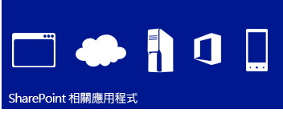
  
    
    
](http://msdn.microsoft.com/library/cd1eda9e-8e54-4223-93a9-a6ea0d18df70%28Office.15%29.aspx) [
  
    
    
](http://msdn.microsoft.com/library/d15a74a7-3c10-485a-9885-7ef11aaa0d90%28Office.15%29.aspx) [
  
    
    
](http://msdn.microsoft.com/library/d15a74a7-3c10-485a-9885-7ef11aaa0d90%28Office.15%29.aspx)
  
    
    

## 使用 Web 標準的熟悉程式設計模型

SharePoint 2013 對 Web 開發人員而言很容易使用 (包括在非 Microsoft 平台堆疊上工作的開發人員)，可以輕鬆建立 SharePoint 方案。可以做到這一點是因為 SharePoint 2013 以 HTML、CSS 和 JavaScript 等通用 Web 標準為基礎。此外，實作是依賴開放式資料通訊協定 (OData) 和 OAuth 等既定通訊協定。
  
    
    
 [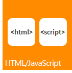
  
    
    
](http://msdn.microsoft.com/library/cd1eda9e-8e54-4223-93a9-a6ea0d18df70%28Office.15%29.aspx) [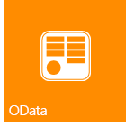
  
    
    
](using-odata-sources-with-business-connectivity-services-in-sharepoint-2013.md) [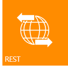
  
    
    
](get-to-know-the-sharepoint-2013-rest-service.md) [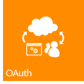
  
    
    
](http://msdn.microsoft.com/library/bde5647a-fff1-4b51-b67b-2139de79ce4a%28Office.15%29.aspx)
  
    
    

## 開發工具

目前版本呈現了最佳化 Visual Studio 和 SharePoint Designer 等現有開發工具方面的巨大進步，同時提供新開發 Web 型工具版本 Napa Office 365 開發工具 以供開發增益集。Visual Studio 中的新整合專案系統可讓您開發包含由 SharePoint 主控之 Office 增益集 或 Office 增益集 的 SharePoint Add-ins、Office 增益集、SharePoint Add-ins。除了舊版所提供的 SharePoint 專案範本，Visual Studio 2012 現在在增益集資料夾中還包含一個名為「Add-ins for SharePoint 2013」的新增益集專案範本。[屬性] 視窗和 [屬性] 頁面加入數個新屬性用以支援 SharePoint Add-in 專案。其他改進功能包括完整支援針對雲端增益集模型的開發，包括 OData 和 OAuth 支援，以及完整支援針對 Workflow Manager Client 1.0 平台的開發。
  
    
    
 [
  
    
    
](http://msdn.microsoft.com/library/82a3645c-0911-4926-9176-236ac8d28bdd%28Office.15%29.aspx) [
  
    
    
](http://msdn.microsoft.com/library/e00dc63f-b4a4-4c08-b058-729fcb09af41%28Office.15%29.aspx) [
  
    
    
](workflow-development-in-sharepoint-designer-and-visio.md)
  
    
    

## 核心平台增強功能

SharePoint 2013 在更廣泛的範圍都已獲得改善與增強，以支援新的雲端架構和應用程式導向開發架構。從最低層級的 SharePoint API 連線到社交媒體整合，SharePoint 2013 的設計和執行都是以支援豐富的應用程式開發經驗為目的。除了針對 Web 服務使用代表性狀態傳輸 (REST) 端點，還有同時適用於伺服器及用戶端開發的新 API。除了用戶端轉譯，現在也支援遠端事件接收器。 
  
    
    
 [
  
    
    
](e1ff2979-1c16-4cb0-a57e-9168dfe20a7c.md) [
  
    
    
](choose-the-right-api-set-in-sharepoint-2013.md) [
  
    
    
](how-to-customize-a-field-type-using-client-side-rendering.md) [
  
    
    
](http://msdn.microsoft.com/library/c050d056-8548-4496-a053-016779d723d9%28Office.15%29.aspx)
  
    
    

## 行動性

使用 SharePoint 2013，您可以將 Windows Phone 7 應用程式結合內部部署 SharePoint 服務及應用程式，或結合在雲端執行的遠端 SharePoint 服務及應用程式 (例如使用 SharePoint Online 的服務及應用程式)，以建立可擴充傳統桌上型電腦或膝上型電腦功能的強大應用程式，進入真正可攜式且更容易存取的環境。SharePoint 2013 中的新行動功能建置在現有的 Microsoft 工具和技術上，例如 SharePoint、Windows Phone 7、Visual Studio 和 Microsoft Silverlight。您可以使用 Visual Studio 中的新 SharePoint 電話應用程式精靈範本 (此範本可讓您建立簡單的清單型行動應用程式)，為 Windows Phone 建立 SharePoint 提供支援的行動應用程式。您可以將 SharePoint 2013 引進的新功能 (例如地理位置欄位類型和 SharePoint Server 的「發送」通知) 整合至您的行動應用程式。
  
    
    
 [
  
    
    
](overview-of-windows-phone-sharepoint-2013-application-templates-in-visual-studio.md) [
  
    
    
](how-to-configure-and-use-push-notifications-in-sharepoint-2013-apps-for-windows.md) [
  
    
    
](integrating-location-and-map-functionality-in-sharepoint-2013.md)
  
    
    

## 社交與共同作業

新增及改良的社交與共同作業功能方便使用者進行通訊，並保持互動、隨時獲得通知。改良的 My Site 社交摘要可讓使用者獲得他們所關心人事物的最新狀態。新的「社群網站」功能提供豐富的社群功能，可讓使用者輕鬆尋找並共用資訊，以及尋找有共同興趣的人。
  
    
    
 [
  
    
    
](work-with-social-feeds-in-sharepoint-2013.md) [
  
    
    
](what-s-new-for-developers-in-social-and-collaboration-features-in-sharepoint-201.md#bkmk_Collab) [
  
    
    
](follow-people-in-sharepoint-2013.md) [
  
    
    
](follow-content-in-sharepoint-2013.md)
  
    
    

## 搜尋

SharePoint 2013 中的搜尋功能包含數種增強功能、使用內容擴充 Web 服務的自訂內容處理，以及用來呈現搜尋結果類型的新架構。此外，對關鍵字查詢語言 (KQL) 也進行了大幅增強。
  
    
    
 [
  
    
    
](custom-content-processing-with-the-content-enrichment-web-service-callout.md) [
  
    
    
](what-s-new-in-sharepoint-2013-search-for-developers.md) [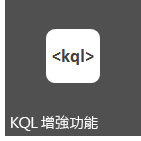
  
    
    
](building-search-queries-in-sharepoint-2013.md)
  
    
    

## 工作流程

Workflow Manager Client 1.0 是重新設計的工作流程基礎結構，建置於 Windows Workflow Foundation 4 上，為 SharePoint 2013 中的工作流程撰寫提供新功能與彈性。完整宣告式撰寫環境可讓資訊工作者使用 SharePoint Designer 2013 來撰寫強大的工作流程，而一組新的 Visual Studio 2012 工作流程專案範本可讓開發人員存取更複雜的功能，例如自訂動作。而其中最重要的可能是 Workflow Manager Client 1.0 與 SharePoint 增益集相關的模型 完整整合。此外，工作流程是在雲端執行，而不是在 SharePoint，為設計工作流程型 SharePoint Add-ins提供極大的彈性。
  
    
    
 [
  
    
    
](what-s-new-in-workflows-for-sharepoint-2013.md) [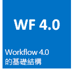
  
    
    
](sharepoint-2013-workflow-fundamentals.md) [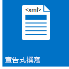
  
    
    
](workflow-development-in-sharepoint-designer-and-visio.md) [
  
    
    
](develop-sharepoint-2013-workflows-using-visual-studio.md)
  
    
    

## Enterprise Content Management

在 SharePoint 2013 中，您現在可以使用 .NET 用戶端、Silverlight、Windows Phone 和 JavaScript API，再加上新的 .NET 伺服器 Managed API 擴充集，來自訂 Enterprise Content Management (ECM) 經驗和行為。
  
    
    
 [
  
    
    
](what-s-new-with-sharepoint-2013-site-development.md) [
  
    
    
](managed-navigation-in-sharepoint-2013.md) [
  
    
    
](cross-site-publishing-in-sharepoint-2013.md) [
  
    
    
](ediscovery-in-sharepoint-2013.md)
  
    
    

## Business Connectivity Services

Business Connectivity Services (BCS) 可讓 SharePoint 從 SAP、ERP 和 CRM 等外部資料系統以及其他透過 WCF 服務或 OData 端點公開的資料導向應用程式，來存取資料。SharePoint 2013 中的 BCS 在許多方面已獲得改進與增強，包括 OData 連線、外部事件、增益集中的外部資料、篩選和排序、支援 REST 等。
  
    
    
 [
  
    
    
](using-odata-sources-with-business-connectivity-services-in-sharepoint-2013.md) [
  
    
    
](add-in-scoped-external-content-types-in-sharepoint-2013.md) [
  
    
    
](external-events-and-alerts-in-sharepoint-2013.md)
  
    
    

## 應用程式服務

SharePoint Server 2013 包含數個服務，可使用 SharePoint 網站中的資料。SharePoint 的新功能則是「機器翻譯服務」，提供多語系支援的網站、文件和資料流翻譯。SharePoint Server 2013 也包含 Access Services 和新的資料存取模型。至於將檔案及資料流轉換成其他格式，SharePoint Server 2013 提供 Word Automation Services 和 PowerPoint Automation Services (SharePoint 的新功能)。SharePoint 也提供資料分析工具，例如 PerformancePoint Services 和 Visio Services，可以啟用商業智慧以及 Excel Services 中的強大新功能。
  
    
    
 [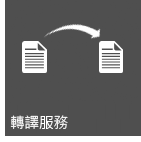
  
    
    
](machine-translation-services-in-sharepoint-2013.md) [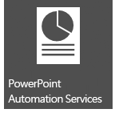
  
    
    
](powerpoint-automation-services-in-sharepoint-2013.md) [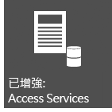
  
    
    
](what-s-new-in-access.md) [
  
    
    
](09e96c8b-cb55-4fd1-a797-b50fbf0f9296.md)
  
    
    

## 其他資源

-  [SharePoint 2013 開發概觀](sharepoint-2013-development-overview.md)
    
  
-  [開發 SharePoint 的增益集](http://msdn.microsoft.com/library/71ddde4b-fac4-4d8c-aa2e-524f9c2c4c99%28Office.15%29.aspx)
    
  
-  [與 SharePoint 解決方案比較 SharePoint 增益集](sharepoint-add-ins-compared-with-sharepoint-solutions.md)
    
  
-  [選擇 [設定 SharePoint 2013 中的右 API](choose-the-right-api-set-in-sharepoint-2013.md)
    
  
-  [在 SharePoint 2013 中的協助工具](accessibility-in-sharepoint-2013.md)
    
  

