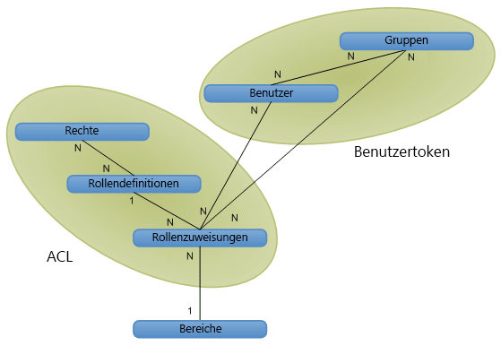

# Autorisierung, Benutzer, Gruppen und das Objektmodell in SharePoint 2013

In SharePoint 2013 wird der Zugriff auf Websites, Listen, Ordner und Listenelemente über ein rollenbasiertes Mitgliedschaftssystem geregelt, das Benutzern Rollen zuweist und sie zum Zugriff auf SharePoint 2013-Objekte autorisiert.
  
    
    

Wenn Sie einem Benutzer Zugriff auf ein Objekt erteilen möchten, fügen Sie den Benutzer zu einer Gruppe hinzu, die bereits Berechtigungen für das Objekt besitzt. Oder Sie können ein Rollenzuweisungsobjekt erstellen, den Benutzer für die Rollenzuweisung festlegen, die Rollenzuweisung optional an eine entsprechende Rollendefinition mit Basisberechtigungen binden und dann die Zuweisung der Auflistung der Rollenzuweisungen für das Listenelement, die Liste oder die Website hinzufügen. Wenn Sie während der Benutzerzuweisung die Rollenzuweisung nicht an eine Rollendefinition binden, erhält der Benutzer keine Berechtigungen.
Es folgt eine Beschreibung der Verfahren, die SharePoint 2013 zur Steuerung des Zugriffs auf Objekte bereitstellt:
  
    
    

- Objekte können dieselben Berechtigungen wie die übergeordnete Website, Liste oder der übergeordnete Ordner haben (wobei sie die Rollen und Benutzer des übergeordneten Objekts erben), oder sie können einzigartige Berechtigungen haben. 
    
  
- Websites, Listen, Ordner und Elemente stellen jeweils eigene Sammlungen mit Rollenzuweisungen bereit, sodass eine präzise Verwaltung des Benutzerzugriffs auf Objekte ermöglicht wird.
    
  
- Gruppen bestehen aus Benutzern und können ggf. zu Rollen zugewiesen sein. SharePoint 2013 enthält standardmäßig drei Gruppen:
    
  - **owners** (Administrator)
    
  
  - **members** (Mitwirkender)
    
  
  - **visitors** (Leser)
    
  

    Wenn Sie eine Website mit eindeutigen Berechtigungen über die Benutzeroberfläche erstellen, werden Sie zu einer Seite geleitet, auf der Sie als Teil der Websitebereitung Benutzer zu diesen Gruppen zuweisen können.
    
  
- Per anonymen Zugriff können Benutzer anonym Beiträge in Listen schreiben, an Umfragen teilnehmen oder Seiten anzeigen. Sie können auch „allen authentifizierten Benutzern" Zugriff erteilen, damit alle Mitglieder Ihrer Domäne eine Website öffnen können, ohne den anonymen Zugriff aktivieren zu müssen. 
    
  
- Berechtigungen zum Erstellen einer Website ( **CreateSSCSite** und **ManageSubwebs**) steuern, welche Benutzer Websites oberster Ebene, Unterwebsite oder Arbeitsbereiche erstellen dürfen.
    
  
Benutzer werden Mitglieder eines SharePoint-Objekts, und zwar entweder indirekt über eine Gruppe, die über eine Rollenzuweisung verfügt, oder direkt über eine Rollenzuweisung. Benutzer können auch Mitglieder einer Microsoft Windows NT-Domänengruppe sein, die einer Gruppe oder Rolle hinzugefügt wird. Durch eine Rollendefinition wird ein Benutzer oder eine Gruppe mit einem einzelnen Recht oder einem Satz von Rechten verknüpft, die den Werten der  [Microsoft.SharePoint.SPBasePermissions](https://msdn.microsoft.com/library/Microsoft.SharePoint.SPBasePermissions.aspx) -Enumeration entsprechen. Jeder Benutzer bzw. jede Gruppe verfügt über eine eindeutige Mitglieds- [ID](https://msdn.microsoft.com/library/Microsoft.SharePoint.SPMember.ID.aspx) .Mit dem Objektmodell können Sie Rollenzuweisungen und -definitionen auf andere Weise erstellen oder ändern als mit der Funktionalität der Dateien „addrole.aspx" und „editrole.aspx". Das Objektmodell setzt, anders als diese Seiten, die auf der Benutzeroberfläche verfügbar sind, keine Rechteabhängigkeit durch. Sie können also eine Rollendefinition mit einer beliebigen Rechtekombination erstellen. Sie sollten aber bei Verwendung des Objektmodells zur Anpassung von Rollendefinitionen und Berechtigungen sorgfältig planen, da eine schlecht geplante Rollendefinition und falsch zugewiesene Rechte zu weniger Benutzerfreundlichkeit führen können.Weitere Informationen zu SharePoint 2013 Rechten finden Sie unter  [SPBasePermissions](https://msdn.microsoft.com/library/Microsoft.SharePoint.SPBasePermissions.aspx) .
## Sicherheitsrichtlinie

Anhand einer Sicherheitsrichtlinie kann einheitliche Sicherheit in allen Websitesammlungen innerhalb einer Webanwendung (virtueller Server) durchgesetzt werden. Mit der Richtlinie können Sie einzelnen SharePoint 2013-Benutzern eine Rolle oder eine Sammlung von Rechten zuweisen sowie auch Domänengruppen, die Windows-Authentifizierung oder austauschbare Authentifizierungssysteme verwenden. Dies gilt aber nicht für SharePoint-Gruppen. Jeder Sicherheitseintrag gibt Rechte für einen Benutzer oder eine Gruppe in der Webanwendung an.
  
    
    
Die Richtlinie wird auf der logischen Webanwendungsebene oder auf der Zonenebene festgelegt. Ein Benutzer kann beispielsweise unterschiedliche Richtlinien für  `http://Server` und `http://Server.extranet.microsoft.com` haben, selbst wenn die beiden Webanwendungen gleiche Inhalte haben.
  
    
    
Über Richtlinien können Rechte erteilt oder entzogen werden. Die Erteilung eines Rechts gibt dem Benutzer oder der Gruppe Zugriffsrechte auf alle geschützten Objekte in der Webanwendung, unabhängig von der lokalen Berechtigung für das Objekt. Der Entzug eines Rechts hat höhere Priorität als die Erteilung eines Rechts und sperrt aktiv das Recht des Benutzers oder der Gruppe auf Zugriff auf geschützte Objekte innerhalb der Webanwendung. Die Entziehung aller Rechte eines Benutzers hindert den Benutzer am Zugriff auf beliebige Inhalte, selbst wenn der Benutzer explizite Berechtigungen für bestimmte Inhalte hat. Die Richtlinie setzt Berechtigungen auf Websiteebene außer Kraft.
  
    
    
In Richtlinienrollen werden Benutzer und Gruppen sowohl durch ihre Sicherheits-ID (SID) als auch durch ihren Anmelde- oder Benutzernamen. Die Zuweisung einer Richtlinienrolle ist ähnlich wie die Berechtigungsverwaltung für eine Website, eine Liste, einen Ordner oder ein Dokument. Sie fügen Benutzer oder Gruppen hinzu und weisen ihnen eine oder mehrere Rollendefinitionen zu. Jede Webanwendung hat eigene Richtlinienrollen. Ein weiterer Unterschied zwischen Richtlinienrollen und Berechtigungsverwaltung besteht darin, dass Zentraladministratoren Rechte eines Benutzers für die komplette Webanwendung entziehen können.
  
    
    

> **HINWEIS**
> Richtlinienrollen in der Zentraladministration unterscheiden sich von den Rollendefinitionen für eine Websitesammlung. 
  
    
    

## Benutzer, Gruppen und Prinzipale

Ein einzelner Benutzer ( [SPUser](https://msdn.microsoft.com/library/Microsoft.SharePoint.SPUser.aspx) ) hat Zugriff auf SharePoint-Objekte direkt über eine individuelle Rollenzuweisung oder indirekt über die Mitgliedschaft in einer Domänengruppen oder einer SharePoint-Gruppe ( [SPGroup](https://msdn.microsoft.com/library/Microsoft.SharePoint.SPGroup.aspx) ) mit Rollenzuweisung. Bei einer direkten Rollenzuweisung ist der Benutzer der Prinzipal ( [SPPrincipal](https://msdn.microsoft.com/library/Microsoft.SharePoint.SPPrincipal.aspx) ). In einer Domänengruppen- oder SharePoint-Gruppen-Rollenzuweisung ist die Domänengruppe oder die SharePoint-Gruppe der Prinzipal.
  
    
    
SharePoint Server unterstützt Windows-Benutzer (zum Beispiel  _DOMAIN_\\ _User_Alias_) und externe Benutzer (über austauschbare Authentifizierung). Die Benutzeridentität wird vom Identitätsverwaltungssystem gepflegt (wie den Active Directory-Verzeichnisdienst). Das Benutzerprofil (das den Anzeigenamen des Benutzers, seine E-Mail-Adresse und weitere Informationen enthält) ist auf den Ebenenbereich der Websitesammlung bezogen. Wird eine Anzeigename geändert, betrifft dies die gesamte Websitesammlung.
  
    
    
Eine Gruppe ist eine Sammlung von Benutzern, über die SharePoint Server die Sicherheit verwaltet. Eine benutzerbasierte Verwaltung ist problemlos bei einfachen Websites, wird aber kompliziert, sobald die Anzahl der eindeutig gesicherten Ressourcen anwächst. Beispiel: Ein Benutzer hat die **Contribute**-Rolle für Liste 1, die **Read**-Rolle für Liste 2 und die **Design**-Rolle für Liste 3. Dieses Modell nimmt keine Skalierung vor, wenn es beispielsweise 50.000 Benutzer gibt. Dieses Vorgehen würde zu Zugriffssteuerungslisten (Access Control Lists, ACLs) mit 50.000 Zugriffssteuerungseinträgen (Access Control Entries, ACEs) für jedes eindeutig gesicherte Objekt führen. 
  
    
    
Gruppen sind die Antwort auf Probleme bei Verwaltbarkeit und Skalierung einer benutzerbasierter Rechteverwaltung. Das Konzept einer gruppenbasierten Verwaltung mag abstrakter oder komplizierter klingen, aber es sorgt für eine einfachere Verwaltung komplexer Websites mit vielen eindeutig gesicherten Objekten. Beispiel: Der Fall, in dem Sie einen Benutzer zu einer Gruppe hinzufügen, der bereits die entsprechende Rolle für verschiedene Objekte im System zugewiesen wurde. Die Überprüfung von Gruppenberechtigungen lässt sich besser skalieren, da weniger Gruppen-ACEs gespeichert werden müssen.
  
    
    
SharePoint Server unterstützt zwei Gruppentypen: Domänengruppen und SharePoint-Gruppen. Domänengruppen liegen außerhalb der Kontrolle durch SharePoint Server; Benutzer können SharePoint Server nicht dazu verwenden, Domänengruppenmitgliedschaften zu definieren, zu durchsuchen oder zu ändern. SharePoint-Gruppen sind auf den Bereich der Websitesammlungsebene bezogen und können nur innerhalb der Websitesammlung verwendet werden. Domänengruppen können überall im Bereich des Active Directory-Verzeichnisdiensts verwendet werden.
  
    
    
Ein Prinzipal ist ein Benutzer oder eine Gruppe, der bzw. die für die Verwaltung der Sicherheit verwendet wird. Wenn Sie einen Benutzer zu einer Website hinzufügen, ist der Benutzer der Prinzipal, wenn Sie aber der Website eine Gruppe hinzufügen, ist die Gruppe der Prinzipal. Der Schlüssel für eine Skalierung der Sicherheit in SharePoint Server ist, die Anzahl der Prinzipale pro Bereich möglichst gering zu halten. Mithilfe von Gruppen gibt es eine geringe Anzahl an Prinzipalen, die einer größeren Anzahl Benutzer Zugriff erteilen.
  
    
    

## Ansicht der Objektbeziehungen - Bereiche, Benutzer, Gruppen und Rollen

Abbildung 1 zeigt einen Überblick des SharePoint Server-Sicherheitsverwaltungssystems in einem logischen Datenbankdiagramm. jedes Feld steht für ein Sicherheitsobjekt im System. Die Linien symbolisieren die Beziehungen zwischen den Objekten. Die Notationen **1** und **N** stehen für den Beziehungstyp. Die Abbildung zeigt, wie Berechtigungsdaten in einem Benutzertoken und in einer ACL strukturiert sind.
  
    
    

**Abbildung 1: Autorisierungsobjektbeziehungen**

  
    
    

  
    
    

  
    
    
Ein Bereich steht für ein eindeutig gesichertes Objekt bzw. eine Objektgruppe. Ein Bereich kann eine Website, eine Liste, ein Ordner oder ein Element sein.
  
    
    
Benutzer und Gruppen haben eine Many-to-Many-Beziehung (N:N). Jeder Benutzer ( [SPUser](https://msdn.microsoft.com/library/Microsoft.SharePoint.SPUser.aspx) ) kann Mitglied mehrerer Gruppen sein, und jede Gruppe ( [SPGroup](https://msdn.microsoft.com/library/Microsoft.SharePoint.SPGroup.aspx) ) kann mehrere Benutzer haben.
  
    
    
Rechte und Rollendefinitionen haben ebenfalls eine Many-to-Many-Beziehung (N:N). Jedes Recht ( [SPBasePermissions](https://msdn.microsoft.com/library/Microsoft.SharePoint.SPBasePermissions.aspx) ) kann Teil mehrerer Rollendefinitionen sein. Beispiel: Das **Insert List Items**-Recht ist mit eingeschlossen in die **Contributor**, **Designer**- und **Administrator**-Rollendefinitionen. Jede Rollendefinition ( [SPRoleDefinition](https://msdn.microsoft.com/library/Microsoft.SharePoint.SPRoleDefinition.aspx) ) kann mehrere Rechte beinhalten. Beispiel: **Contributor** beinhaltet das Recht zum Einfügen, Aktualisieren und Löschen von Listenelementen.
  
    
    
Rollendefinitionen und Rollenzuweisungen ( [SPRoleAssignment](https://msdn.microsoft.com/library/Microsoft.SharePoint.SPRoleAssignment.aspx) ) haben eine One-to-Many-Beziehung (1:N). Jede Rollendefinition wird in mehreren Rollenzuweisungen verwendet. Die Leser in Liste 1 und die Leser in Liste 2 können unterschiedlich sein, aber ihre Rollenzuweisungen können eine gemeinsame Rollendefinition haben: **Reader**.
  
    
    
Benutzer oder Gruppen und Rollenzuweisungen haben eine Many-to-Many-Beziehung (N:N). Jeder Benutzer bzw. jede Gruppe kann Mitglied mehrerer Rollenzuweisungen für ein bestimmtes Objekt sein. Beispiel: Ein Benutzer kann die Rolle **Designer** und die Rolle **Administrator** bei ein und demselben Objekt haben.
  
    
    
Bereiche und Rollenzuweisungen haben eine One-to-Many-Beziehung (1:N). Jeder Bereich hat mehrere Rollenzuweisungen, aber jede Rollenzuweisung hat nur einen Bereich. Beispiel: Ein Benutzer kann Leser der Liste „Veranstaltungen" sein, ein anderer Leser kann Mitwirkender der Liste „Veranstaltungen" sein, aber keine dieser Rollenzuweisungen gilt für die Liste „Ankündigungen". Die beiden Listen können nur dieselbe Rollenzuweisung haben, wenn sie ihre Berechtigungen vom übergeordneten Container erben. In diesem Fall ist der Sicherheitsbereich der Container und nicht die beiden Listen.
  
    
    

## Benutzertoken und Zugriffssteuerungslisten

SharePoint Server stellt Benutzertoken und ACLs in seinem Sicherheitsmodell bereit, um die Überprüfung der Berechtigungen zu beschleunigen. Das Benutzertoken identifiziert den Authentifizierungsvorgang des Benutzers. Ein Windows-Benutzer hat ein komplexes Token: eine eindeutige Zeichenfolge für den Benutzer (SID) und eine Liste aller Windows-Domänengruppen des Benutzers (Beispiel:  _DOMAIN_\\Department 15688). Ein Benutzer ohne Windows-Authentifizierung hat möglicherweise ein ganz einfaches Token mit einer eindeutigen Zeichenfolge für den Bennutzernamen oder ein komplexes Token mit Gruppen-/Rollenmitgliedschaft, das als Windows-Authentifizierung ausgedrückt wird. SharePoint-Gruppenmitgliedschaft für jeden Benutzer wird mit einem Benutzertoken ausgedrückt. Bei Lesen des Tokens identifiziert SharePoint Server alle Gruppen des aktuellen Benutzers.
  
    
    
Eine ACL ist ein binäres Objekt, das die Rechte der Benutzer und Gruppen bezüglich eines bestimmten Objekts haben. Eine ACL besteht aus mehreren ACEs, wobei jeder Sicherheitsprinzipal (Benutzer oder Gruppe) ein ACE in der ACL ist. Rechte, Rollendefinitionen und Rollenzuweisungen werden in einer ACL für jeden Bereich strukturiert, so dass SharePoint Server erkennt, welcher Benutzer/welche Gruppe welche Aktionen im Bereich ausführen darf.
  
    
    

## Objektmodelländerungen: veraltete, aber abwärtskompatible Sicherheitsobjekte

In SharePoint 2013 nutzen alle Objektbereiche dieselbe grundlegende Berechtigungsverwaltung gemeinsam. SharePoint 2013 verwaltet Berechtigungen über Rollendefinitionen, die auf Listen-, Ordner- und Elementebene eine konsistente Bedienerfreundlichkeit bieten. Die folgenden Sicherheitsobjekte in Windows SharePoint Services 2.0 sind veraltet, aber dienen immer noch der Rückwärtskompatibilität:
  
    
    

-  [Microsoft.SharePoint.SPPermission](https://msdn.microsoft.com/library/Microsoft.SharePoint.SPPermission.aspx)
    
  
-  [Microsoft.SharePoint.SPPermissionCollection](https://msdn.microsoft.com/library/Microsoft.SharePoint.SPPermissionCollection.aspx)
    
  
-  [Microsoft.SharePoint.SPRights](https://msdn.microsoft.com/library/Microsoft.SharePoint.SPRights.aspx)
    
  
-  [Microsoft.SharePoint.SPRole](https://msdn.microsoft.com/library/Microsoft.SharePoint.SPRole.aspx)
    
  
-  [Microsoft.SharePoint.SPRoleCollection](https://msdn.microsoft.com/library/Microsoft.SharePoint.SPRoleCollection.aspx)
    
  
Wenn Sie Benutzer zu Rollen zuweisen möchten, verwenden Sie die Elemente der  [Microsoft.SharePoint.SPRoleAssignment](https://msdn.microsoft.com/library/Microsoft.SharePoint.SPRoleAssignment.aspx) -Klasse und der [Microsoft.SharePoint.SPRoleAssignmentCollection](https://msdn.microsoft.com/library/Microsoft.SharePoint.SPRoleAssignmentCollection.aspx) -Klasse. Die [SPBasePermisssions](https://msdn.microsoft.com/library/Microsoft.SharePoint.SPBasePermisssions.aspx) -Enumeration, die [SPRights](https://msdn.microsoft.com/library/Microsoft.SharePoint.SPRights.aspx) ersetzt, beinhaltet weitere Berechtigungen. Die [SPBasePermisssions](https://msdn.microsoft.com/library/Microsoft.SharePoint.SPBasePermisssions.aspx) -Enumeration enthält auch ältere Berechtigungen, die zu denselben Konstantenwerten wie vorherige Berechtigungen in [SPRights](https://msdn.microsoft.com/library/Microsoft.SharePoint.SPRights.aspx) passen. Das SharePoint-Gruppenkonzept wird dem vorhandenen [SPGroup](https://msdn.microsoft.com/library/Microsoft.SharePoint.SPGroup.aspx) -Objekt und dem [SPGroupCollection](https://msdn.microsoft.com/library/Microsoft.SharePoint.SPGroupCollection.aspx) -Objekt, das für websiteübergreifende Gruppen steht, zugeordnet.
  
    
    

### Richtlinienrollen: Erstellen oder Ändern von Sicherheitsrichtlinien für URL-Zonen

Wenn Sie Sicherheitsrichtlinien für URL-Zonen erstellen oder ändern möchten, verwenden Sie die folgenden Klassen und ihre Member:
  
    
    

-  [Microsoft.SharePoint.Administration.SPPolicy](https://msdn.microsoft.com/library/Microsoft.SharePoint.Administration.SPPolicy.aspx)
    
  
-  [Microsoft.SharePoint.Administration.SPPolicyCollection](https://msdn.microsoft.com/library/Microsoft.SharePoint.Administration.SPPolicyCollection.aspx)
    
  
-  [Microsoft.SharePoint.Administration.SPPolicyRole](https://msdn.microsoft.com/library/Microsoft.SharePoint.Administration.SPPolicyRole.aspx)
    
  
-  [Microsoft.SharePoint.Administration.SPPolicyRoleCollection](https://msdn.microsoft.com/library/Microsoft.SharePoint.Administration.SPPolicyRoleCollection.aspx)
    
  
-  [Microsoft.SharePoint.Administration.SPPolicy.SPPolicyRoleBindingCollection](https://msdn.microsoft.com/library/Microsoft.SharePoint.Administration.SPPolicy.SPPolicyRoleBindingCollection.aspx)
    
  
-  [Microsoft.SharePoint.Administration.SPPolicyPermissions](https://msdn.microsoft.com/library/Microsoft.SharePoint.Administration.SPPolicyPermissions.aspx)
    
  

## Gastrollen (Beschränkter Zugriff) für eine Anpassung gemeinsam genutzter Ressourcen

Eine Gastrolle soll die gemeinsam auf der Plattform genutzten Ressourcen zu harmonisieren. Beispiel: Die Design- und Navigationsstruktur der Website dient zum Rendern der Seite in eine Listenansicht. Dieses Prinzip wird erweitert, um Berechtigungen auf Ordnerebene und Listenebene mit einzuschließen.
  
    
    
Das SharePoint-Objektmodell nennt dies weiterhin die **Guest**-Rolle für semantische Kompatibilität mit dem vorherigen Objektmodell, obwohl die Rolle in der Benutzeroberfläche jetzt **Beschränkter Zugriff** genannt wird.
  
    
    

### Ordern- und Elementerweiterungen

Wenn einem Benutzer Berechtigungen für einen Ordner erteilt werden, erhält er ebenfalls die **Guest**-Rolle für die übergeordnete Liste dieses Ordners und für die übergeordnete Website dieser Liste, für jeden eindeutig gesicherten Bereich oberhalb des Ordners, bis hin zur ersten eindeutigen Vorgängerwebsite. Dies gilt auch für Listenelemente: Die Erteilung einer Benutzerberechtigung für ein Element gibt dem Benutzer auch die **Guest**-Rolle für alle übergeordneten Ordner, Listen und Website, bis hin zur ersten eindeutigen Vorgängerwebsite.
  
    
    

## Entfernen von Benutzern aus einem Bereich oder aus allen Bereichen

Das Entfernen eines Benutzers aus einem Bereich entfernt ihn ebenfalls aus allen eindeutig gesicherten Bereich unterhalb des aktuellen Bereichs. Beispiel: Das Entfernen eines Benutzers von einer Website entfernt ihn auch aus den eindeutig gesicherten Listen auf der Website.
  
    
    
Die einzige Möglichkeit, einen Benutzer aus allen Bereichen zu entfernen, ist, ihn aus der Websitesammlung zu entfernen. Diese Vorgehensweise entfernt den Benutzer aus allen Rollen für alle Bereiche in der Websitesammlung.
  
    
    

## Zusätzliche Ressourcen

-  [Authentifizierung, Autorisierung und Sicherheit in SharePoint 2013](authentication-authorization-and-security-in-sharepoint-2013.md)
    
  
-  [Rolle, die Vererbung von, Erhöhung von Berechtigungen und Kennwortänderungen in SharePoint 2013](role-inheritance-elevation-of-privilege-and-password-changes-in-sharepoint-2013.md)
    
  
-  [Anspruchsbasierte Identität in SharePoint 2013](claims-based-identity-in-sharepoint-2013.md)
    
  
-  [Anspruchsbasierte Identität und-Konzepte in SharePoint 2013](claims-based-identity-and-concepts-in-sharepoint-2013.md)
    
  
-  [Konfiguration, Verwaltung und Ressourcen in SharePoint 2013](configuration-administration-and-resources-in-sharepoint-2013.md)
    
  

