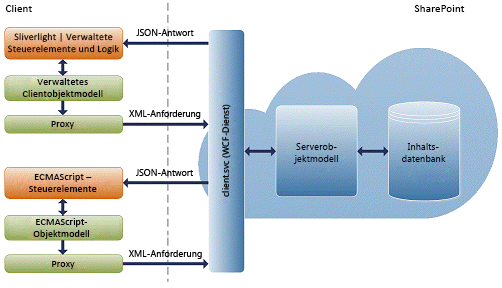
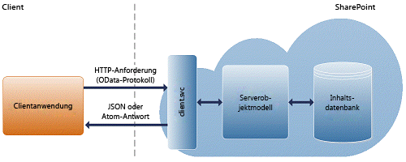

# Erstellen von Windows Phone-Apps, die auf SharePoint 2013 zugreifen
Erfahren Sie, wie Sie SharePoint-Add-Ins erstellen können, die SharePoint 2013 und mobilen Geräte integrieren, z. B. Windows Phone 8 und Windows Phone 7.
## Einführung in das Erstellen von mobilen Apps mit SharePoint 2013

SharePoint 2013 gibt Entwicklern die Möglichkeit, mobile Apps zu erstellen, die die Benutzer begleiten, attraktiv und interaktiv sowie immer und überall verfügbar sind, wenn die Benutzer mit ihnen arbeiten wollen. Sie können Windows Phone 8- und Windows Phone 7Anwendungen mit lokalen SharePoint-Diensten und -Anwendungen kombinieren oder mit SharePoint-Remotediensten und -anwendungen, die in der Cloud ausgeführt werden (z. B. solche, die SharePoint Online verwenden), um leistungsfähige Anwendungen zu erstellen, die die Funktionalität über den klassischen Desktop- oder Laptopcomputer hinaus in eine wirklich mobile und besser zugängliche Umgebung erweitern.
  
    
    
Die neuen von SharePoint 2013 bereitgestellten Mobilitätsfeatures basieren auf vorhandenen Microsoft-Tools und -Technologien wie SharePoint, Windows Phone, Visual Studio und Silverlight. Entwickler, die bereits mit diesen Technologien und deren zugehörigen Tools vertraut sind, können damit mobile Apps mit SharePoint für Windows Phone ohne Einarbeitungsphase erstellen. In diesem Abschnitt betrachten wir einige Arten von mobilen Apps mit SharePoint näher, die Sie für Windows Phone 8 und erstellen können, und sehen uns die häufigsten Möglichkeiten zum Anpassen dieser Anwendungen an. bietet ein Framework und Tools für Entwickler, einschließlich -Projektvorlagen, um mithilfe vonSharePoint Online mobile Lösungen zu erstellen, die mit SharePoint-Daten sowohl in lokalen SharePoint-Installationen als auch in der Cloud interagieren. Abbildung 1 zeigt, wie eine einfache Listenanwendung auf einem Windows Phone aussehen könnte.
  
    
    

**Abbildung 1. SharePoint-Listenelemente in einer Windows Phone-App**

  
    
    

  
    
    

  
    
    

  
    
    

  
    
    

## Welche Qualifikationen benötigen Sie zum Erstellen von mobilen Apps?

In diesem Abschnitt wird davon ausgegangen, dass Sie mit SharePoint, .NET Framework, dem Visual Studio-Entwicklungssystem und Visual C# vertraut sind. Es ist auch von Vorteil, wenn Sie über etwas Erfahrung mit der Windows Phone 8- oder Windows Phone 7-Anwendungsentwicklung mithilfe von Silverlight verfügen, und es ist hilfreich, wenn Sie mit XAML, dem StackPanel und Pivot-Steuerelementen für Windows Phone sowie mit Konzepten, wie z. B. Tombstoning, Silverlight-Datenbindung usw., vertraut sind. Wenn Sie noch nicht der Windows Phone-Anwendungsentwicklung mithilfe von Silverlight vertraut sind, empfehlen wir, dass Sie sich die folgenden Ressourcen ansehen.
  
    
    

-  [Entwickeln einer Windows Phone-Anwendung von Anfang bis Ende](http://msdn.microsoft.com/de-de/library/gg680270%28v=pandp.11%29.aspx)
    
  
-  [Benutzeroberfläche für Windows Phone](http://msdn.microsoft.com/de-de/library/windowsphone/develop/ff967556%28v=vs.105%29.aspx)
    
  
-  [Schnellstart: Erstellen einer Benutzeroberfläche mit XAML für Windows Phone](http://msdn.microsoft.com/de-de/library/windowsphone/develop/jj207025%28v=vs.105%29.aspx)
    
  
-  [Pivot-Steuerelementarchitektur für Windows Phone](http://msdn.microsoft.com/de-de/library/windowsphone/develop/ff941097%28v=vs.105%29.aspx)
    
  

## Entwicklungsübersicht für mobile Apps mithilfe von SharePoint 2013

Sie können eine Vielzahl von mobilen Apps mithilfe von SharePoint 2013 erstellen. In diesem Abschnitt wird beschrieben, was in der Version SharePoint 2013, die die Entwicklung mobiler Apps für Entwickler erleichtert, neu ist oder sich geändert hat.
  
    
    

### Vorlage für Windows Phone SharePoint 2013-Anwendung

Dies ist die einfachste Art von mobilen App, die Sie erstellen können, um eine normale Liste auf das Telefon zu bringen. SharePoint 2013 bietet eine Visual Studio-Vorlage, damit Sie schnell und einfach SharePoint-Listenanwendungen für Windows Phone erstellen können. Sie können z. B. eine Windows Phone-Anwendung in der Art einer "Aufgabenliste" erstellen, die Ihre Aufgabenliste aus SharePoint auf das Windows Phone bringt und Ihnen so ermöglicht, den Status einer Aufgabe mit Ihrem Telefon unterwegs zu aktualisieren. Ein weiteres Beispiel ist ein Produktkatalog für eine Bestandsliste in SharePoint, der für Vertriebsmitarbeiter auf dem Telefon verfügbar ist. Durch Installieren des Windows Phone SharePoint-SDKs erhalten Sie zwei Vorlagen für eine Windows Phone SharePoint-Anwendung in Visual Studio 2010 oder Visual Studio 2010 Express für Windows Phone. (Siehe  [Vorgehensweise: Einrichten einer Umgebung für die Entwicklung von mobilen Anwendungen für SharePoint](how-to-set-up-an-environment-for-developing-mobile-apps-for-sharepoint.md).) Mithilfe der Vorlage für die Windows Phone SharePoint-Anwendung können Sie den Schritten eines Assistenten zum Erstellen einer funktionalen Windows Phone-App folgen, die auf Daten in einer SharePoint-Liste zugreifen und diese bearbeiten dann.
  
    
    

### Neues und verbessertes Mobilitätsobjektmodell in SharePoint 2013

SharePoint 2013 Fügt mehrere neue Klassen sowohl zu den Server- als auch zu den Clientobjektmodellen hinzu, um die weiter oben in diesem Artikel beschriebenen SharePoint-Mobilitätsszenarien zu ermöglichen.
  
    
    
Um standortabhängige Apps zu aktivieren, gibt es neben mehreren zugeordneten Klassen zum Strukturieren des Werts von Ortsfeldern und deren Rendering eine neue systemeigene Feldtypklasse, **SPFieldGeoLocation**. Diese Klassen können auch im SharePoint 2013-Clientobjektmodell für Silverlight aufgerufen werden. Der neue Feldtyp enthält auch eine Definition, die der standardmäßigen SharePoint-Datei „fldtypes.xml" hinzugefügt wurde, und neue Benutzersteuerelemente zum Rendern des Felds auf den Anzeige-, Bearbeitungs- und neuen Formularen. Eine Übersicht finden Sie unterIntegrieren von Standort- und Kartenfunktionen in SharePoint 2013. 
  
    
    
Um die SharePoint 2013-Authentifizierung für Windows Phone-Benutzer zu ermöglichen, umfasst das Clientobjektmodell eine neue **Authenticator**-Klasse und mehrere verknüpfte Klassen. Eine Übersicht finden Sie unter  [Übersicht über das SharePoint 2013-Objektmodell für die mobile Clientauthentifizierung](overview-of-the-sharepoint-2013-mobile-client-authentication-object-model.md).
  
    
    
Um automatische Benachrichtigungen für Windows Phone-Benutzer für Ereignisse auf einer SharePoint-Farm zu ermöglichen, enthält das Serverobjektmodell mehrere neue Klassen, von denen jede auch über das Clientobjektmodell aufgerufen werden kann. Zu diesen Klassen gehören Methoden, über die sich Telefon-Apps bei SharePoint 2013-Server-Apps für Benachrichtigungen zu bestimmten Typen von Ereignissen registrieren können. Es gibt auch Methoden, die die Server-Apps verwenden, um Benachrichtigungen an registrierte Abonnenten zu senden. Eine Übersicht finden Sie unter  [Erstellen einer SharePoint-Listen-App für Windows Phone zum Empfangen von Pushbenachrichtigungen](how-to-configure-and-use-push-notifications-in-sharepoint-2013-apps-for-windows.md#BKMK_NotificationPhoneApp).
  
    
    
Mit SharePoint 2013 sind Sie nicht auf die Entwicklung mobiler Apps nur für Windows Phone 8 und Windows Phone 7 beschränkt. Mit der JavaScript-Programmierschnittstelle und der neuen REST-Programmierschnitstelle (Representational State Transfer), die von SharePoint 2013 bereitgestellt wird, können Sie Anwendungen für andere Geräte als Windows Phone-Geräte erstellen. Sie können mit SharePoint-Websites mithilfe von JavaScript interagieren, das wie Skripts im Browser ausgeführt wird, oder remote mithilfe einer beliebigen Technologie, die standardmäßige REST-Funktionen unterstützt. Der folgende Abschnitt enthält einen Überblick über die REST- und JavaScript-Programmierschnittstellen.
  
    
    

#### Objektmodellarchitektur ECMAScript (JavaScript, JScript)

In SharePoint Foundation 2010 wurden die Clientobjektmodelle eingeführt, über die Entwickler eine Remotekommunikation mit SharePoint mithilfe einer Webprogrammiertechnologie ihrer Wahl ausführen konnten: .NET Framework, Silverlight oder JavaScript.
  
    
    
In SharePoint Foundation 2010 stellen die Clientobjektmodelle APIs bereit, mit denen Entwickler über ein Skript, das im Browser ausgeführt wird, über Code (basierend auf .NET Framework 3.5 oder höher), der in einer von .NET Framework verwalteten Anwendung ausgeführt wird, oder über Code, der in einer Silverlight 2.0-Anwendung ausgeführt wird, mit SharePoint-Websites interagieren können. Die Datei „proxy.js" und verwaltete DLL-Dateien, aus denen die Clientobjektmodelle bestehen, basieren auf dem client.svc-Webdienst und verarbeiten die effektive Batchverarbeitung, die Serialisierung von Anforderungen sowie die Analyse von Antworten. Abbildung 2 zeigt eine allgemeine Übersicht über die Architektur des SharePoint-Clientobjektmodells.
  
    
    

**Abbildung 2. Architektur des SharePoint-Clientobjektmodells**

  
    
    

  
    
    

  
    
    
Informationen zum Verwenden des JavaScript-Clientobjektmodells mit SharePoint-Daten finden Sie unter  [ECMAScript-Clientobjektmodell](http://channel9.msdn.com/learn/courses/SharePoint2010Developer/ClientObjectModel/ECMAScriptClientObjectModel).
  
    
    

#### REST-Endpunkte in SharePoint 2013

Um die REST-Funktionen zu nutzen, die in SharePoint 2013 integriert sind, erstellen Sie mithilfe des OData-Standards (Open Data Protocol), welcher der Clientobjektmodell-API entspricht, die Sie verwenden möchten, eine RESTful-HTTP-Anforderung. Der client.svc-Webdienst verarbeitet die HTTP-Anforderung und liefert die entsprechende Antwort im Atom- oder JavaScript Object Notation (JSON)-Format. Die Clientanwendung muss diese Antwort dann analysieren. In Abbildung 3 ist eine allgemeine Ansicht der SharePoint-REST-Architektur dargestellt.
  
    
    

**Abbildung 3. SharePoint-REST-Architektur**

  
    
    

  
    
    

  
    
    
Derzeit ist der REST-Dienst in SharePoint 2013 schreibgeschützt. Dies bedeutet, dass nur REST-Endpunkte, die eine HTTP-GET-Operation darstellen, verfügbar sind.
  
    
    
Standardmäßig werden die Antworten des SharePoint 2013 REST-Diensts mithilfe des Atom-Protokolls gemäß der OData-Spezifikation formatiert. Darüber hinaus unterstützt der REST-Dienst HTTP-Accept-Header, mit denen Entwickler angeben können, dass die Antwort im JSON-Format zurückgegeben wird. Weitere Informationen zur REST-Diensten in SharePoint 2013 finden Sie unter  [Programmieren mit dem SharePoint 2013 REST-Dienst](use-odata-query-operations-in-sharepoint-rest-requests.md).
  
    
    
Der SharePoint 2013 REST-Dienst unterstützt die folgenden OData-Abfrageoperatoren:
  
    
    

- Filter
    
  
- Take
    
  
- Expand
    
  

## Beginnen mit der Entwicklung von mobilen Apps für SharePoint 2013

Die folgenden Vorgehensweisen und Übersichten befassen sich mit den spezifischen Informationen, die Sie benötigen, um mit der Entwicklung Ihrer mobilen Apps zu beginnen:
  
    
    

-  [Vorgehensweise: Einrichten einer Umgebung für die Entwicklung von mobilen Anwendungen für SharePoint](how-to-set-up-an-environment-for-developing-mobile-apps-for-sharepoint.md)
    
  
-  [Überblick über Anwendungsvorlagen für Windows Phone SharePoint 2013 in Visual Studio](overview-of-windows-phone-sharepoint-2013-application-templates-in-visual-studio.md)
    
  
-  [Architektur der Vorlage Windows Phone SharePoint-Liste-Anwendung](architecture-of-the-windows-phone-sharepoint-list-application-template.md)
    
  
-  [Vorgehensweise: Erstellen eine Windows Phone SharePoint 2013 Liste app](how-to-create-a-windows-phone-sharepoint-2013-list-app.md)
    
  
-  [Vorgehensweise: anmelden und Fortsetzen von Anrufen SharePoint Listenelementen auf einem Telefon mit Windows](how-to-store-and-retrieve-sharepoint-list-items-on-a-windows-phone.md)
    
  
-  [Vorgehensweise: Implementieren von Validierung von Business Logik und die Daten in einem Windows Phone-app für SharePoint 2013](how-to-implement-business-logic-and-data-validation-in-a-windows-phone-app-for-s.md)
    
  
-  [Vorgehensweise: Support- und konvertieren SharePoint 2013 FieldTypes für Windows Phone-apps](how-to-support-and-convert-sharepoint-2013-field-types-for-windows-phone-apps.md)
    
  
-  [Vorgehensweise: Anpassen der Liste Element Abfragen und Filtern von Daten für Windows Phone-apps](how-to-customize-list-item-queries-and-filter-data-for-windows-phone-apps.md)
    
  
-  [Gewusst wie: Anpassen der Benutzeroberfläche einer SharePoint 2013-Listen-App für Windows Phone](how-to-customize-the-user-interface-of-a-sharepoint-2013-list-app-for-windows-ph.md)
    
  
-  [Vorgehensweise: Verwenden mehrerer 2013 für SharePoint-in ein Windows Phone-app Listen](how-to-use-multiple-sharepoint-2013-lists-in-a-windows-phone-app.md)
    
  
-  [Vorgehensweise: Konfigurieren und Verwenden von Pushbenachrichtigungen in SharePoint 2013-apps für Windows Phone](how-to-configure-and-use-push-notifications-in-sharepoint-2013-apps-for-windows.md)
    
  
-  [Integrieren von Standort- und Kartenfunktionen in SharePoint 2013](integrating-location-and-map-functionality-in-sharepoint-2013.md)
    
  
-  [Vorgehensweise: Erstellen eine mobile app in SharePoint 2013, die Daten aus einer externen Datenquelle enthält.](how-to-create-a-mobile-app-in-sharepoint-2013-that-contains-data-from-an-externa.md)
    
  
-  [Vorgehensweise: Integrieren von Zuordnungen in Windows Phone-Anwendungen und SharePoint 2013 aufgelistet](how-to-integrate-maps-with-windows-phone-apps-and-sharepoint-2013-lists.md)
    
  
-  [Vorgehensweise: Erstellen Suchvorgänge gesteuerte mobile Anwendungen mit der Navigation und Ereignis protokollieren von REST-Schnittstellen](how-to-build-search-driven-mobile-apps-with-the-navigation-and-event-logging-res.md)
    
  

## Zusätzliche Ressourcen

  
    
    

-  [Programmiermodelle in SharePoint 2013](programming-models-in-sharepoint-2013.md)
    
  
-  [Vorgehensweise: Einrichten einer Umgebung für die Entwicklung von mobilen Anwendungen für SharePoint](how-to-set-up-an-environment-for-developing-mobile-apps-for-sharepoint.md)
    
  
-  [Windows Phone SDK 8.0](http://www.microsoft.com/de-de/download/details.aspx?id=35471)
    
  
-  [Microsoft SharePoint SDK für Windows Phone 8](http://www.microsoft.com/de-de/download/details.aspx?id=36818)
    
  
-  [Windows Phone SDK 7.1](http://www.microsoft.com/de-de/download/details.aspx?id=27570)
    
  
-  [Microsoft SharePoint SDK für Windows Phone 7.1](http://www.microsoft.com/en-us/download/details.aspx?id=30476)
    
  
-  [Informationen zu Expression Blend](http://msdn.microsoft.com/de-de/library/cc296376%28Expression.40%29.aspx)
    
  

