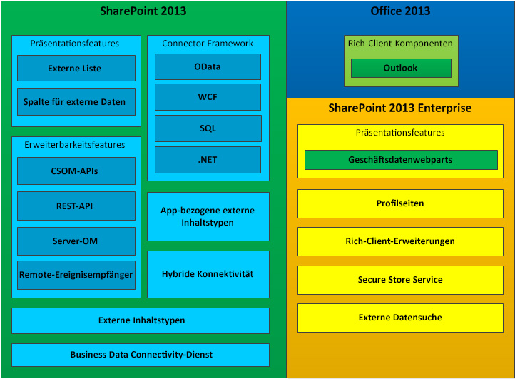

# Business Connectivity Services in SharePoint 2013
Erfahren Sie, worum es sich bei Business Connectivity Services (BCS) handelt, welche Möglichkeiten es Ihnen bietet, und wie Sie in die Entwicklung von BCS-Anwendungen in SharePoint 2013 einsteigen.
Sie können SharePoint 2013 als Zentrale für die Erstellung umfangreicher Produktivitäts- und Zusammenarbeitslösungen verwenden, die mit verschiedensten externen Systemen verwendet werden können. Business Connectivity Services (BCS) stellt die Infrastruktur bereit, die es SharePoint 2013 ermöglicht, Daten aus diesen externen Systemen in einem zentralen System zusammenzuführen. Die Tatsache, dass BCS eine flexible und umfassende Möglichkeit bietet, die externe Systemdatenquelle und die Interaktion mit dieser zu beschreiben, stellt ein überzeugendes Argument dafür dar, zusätzlich zu neuen SharePoint-Add-InsSharePoint 2013 als die zentrale Schnittstelle für die Arbeit mit Legacy-Geschäftssystemen zu verwenden.
  
    
    

## Welche Möglichkeiten bietet BCS?

BCS bietet Mechanismen, die erfahrenen Benutzern, Entwicklern und IT-Experten in Geschäftseinheiten die folgenden Aufgaben erheblich erleichtern:
  
    
    

- Offenlegen externer Daten aus Unternehmensanwendungen, Webdiensten und OData-Diensten in SharePoint Server 2013 und Rich-Client-Office-Anwendungen
    
  
- Bereitstellen von Office-typischen Verhaltensweisen (wie Kontakten, Aufgaben und Terminen) und Funktionen für externe Daten und Dienste
    
  
- Bereitstellen uneingeschränkter Interaktion mit den Daten, einschließlich Zurückschreibfunktionen von Office-Anwendungen und SharePoint Server in die zugrunde liegenden externen Systemdaten und Geschäftsobjekte
    
  
- Aktivieren der Offlineverwendung von externen Daten und Prozessen
    
  
- Überwinden der Kluft zwischen der Welt unstrukturierter Dokumente und Personen und den entsprechenden strukturierten Daten, die in externen Systemen unerreichbar sind
    
  

## Komponenten von BCS

Abbildung 1 zeigt die Features, die in SharePoint 2013 und Office 2013 enthalten sind.
  
    
    

**Abbildung 1. Featuregruppe der Business Connectivity Services**

  
    
    

  
    
    

  
    
    

  
    
    

  
    
    

## Verwenden externer Inhaltstypen in BCS

Externe Inhaltstypen sind der Kern von BCS. Sie können damit die Metadaten und Verhaltensweisen einer Geschäftseinheit (etwa eines Kunden oder einer Bestellung) an einem zentralen Ort verwalten und wiederverwenden. Sie ermöglichen Benutzern, mit diesen externen Daten zu interagieren und sie auf sinnvollere Weise zu verarbeiten.
  
    
    
Nehmen wir als Beispiel eine Geschäftsentität, etwa einen Kunden. Sie möchten in der Lage sein, aus Ihrer proprietären Datenbank Daten zu ziehen und damit in SharePoint zu arbeiten. Außerdem möchten Sie Ihren Außendienstmitarbeitern erlauben, Daten in Outlook 2013 offline zu nehmen. Es kann auch sein, dass Sie möchten, dass der Benutzer aus einer Liste von Kunden in einem Bestellvertragsdokument in Microsoft Word einen Kunden auswählen kann. Für all diese Aufgaben können Sie einen einzelnen externen Inhaltstypen erstellen und ihn dann überall wiederverwenden, wo Sie ihn benötigen.
  
    
    
Weitere Informationen zur Verwendung externer Inhaltstypen in BCS finden Sie unter  [Externe Inhaltstypen in SharePoint 2013](external-content-types-in-sharepoint-2013.md).
  
    
    

## Entwickeln von Lösungen mit BCS

Sie können in SharePoint 2013 mit BCS eine breite Palette von Lösungen erstellen. Dazu zählen einfache Lösungen, die auf nativen Funktionen basieren, für die nur geringfügige oder keine Anpassungen erforderlich sind, mittlere Lösungen, für die Features in SharePoint 2013 und Office 2013 angepasst werden müssen, und erweiterte Lösungen, die komplexe Szenarios und reichhaltige Anwendungen ermöglichen, die deren Funktionsumfang erweitern. Für erweiterte Lösungen muss mithilfe von Visual Studio Code geschrieben werden. Dabei kann es sich entweder um vollständige End-to-End-Lösungen oder wiederverwendbare codebasierte Komponenten handeln, die in einer mittleren Lösung enthalten sind.
  
    
    
BCS ermöglicht Geschäftsbenutzern, mithilfe eines Webbrowers oder einer Microsoft Office-Clientanwendung wie Word oder Excel auf schnelle und einfache Weise ein breites Spektrum an Anforderungen bezüglicher externer Daten zu erfüllen. Benutzer können, ohne Code zu schreiben, mithilfe von BCS-Features wie externen Listen und Spalten für externe Daten und wiederverwendbaren BCS-Komponenten, die von Entwicklern erstellt und von der IT genehmigt werden, in Office-Clientanwendungen und SharePoint-Websites kombinierte Lösungen zusammenstellen. Diese Lösungen ermöglichen Geschäftsbenutzern (und ihren Teams), mit externen Daten so einfach wie mit SharePoint-Daten zu arbeiten - entweder offline oder verbunden oder direkt in Office 2013.
  
    
    
Weitere Informationen zum Einstieg finden Sie unter  [Einrichten einer Entwicklungsumgebung für BCS in SharePoint 2013](setting-up-a-development-environment-for-bcs-in-sharepoint-2013.md).
  
    
    

## Verwenden von OData mit Business Connectivity Services in SharePoint 2013

Das Open Data Protocol (OData) ist ein Webprotokoll, mit dem Sie mithilfe von Technologien wie HTTP, JavaScript Object Notation (JSON) und AtomPub dem Web Daten zur Verfügung stellen können. Der Zugriff auf die Daten erfolgt über speziell gestaltete URLs. Diese Architektur erlaubt Ihnen, über eine Vielzahl von Technologien mit Daten zu interagieren.
  
    
    
Weitere Informationen finden Sie unter  [Verwenden von OData-Quellen mit Business Connectivity Services in SharePoint 2013](using-odata-sources-with-business-connectivity-services-in-sharepoint-2013.md).
  
    
    

## In diesem Abschnitt

-  [Was ist neu in Business Connectivity Services in SharePoint 2013](what-s-new-in-business-connectivity-services-in-sharepoint-2013.md)
    
  
-  [Erste Schritte mit den Business Connectivity Services in SharePoint 2013](get-started-with-business-connectivity-services-in-sharepoint-2013.md)
    
  
-  [Externe Inhaltstypen in SharePoint 2013](external-content-types-in-sharepoint-2013.md)
    
  
-  [Verwenden von OData-Quellen mit Business Connectivity Services in SharePoint 2013](using-odata-sources-with-business-connectivity-services-in-sharepoint-2013.md)
    
  
-  [Externe Ereignisse und Warnungen in SharePoint 2013](external-events-and-alerts-in-sharepoint-2013.md)
    
  
-  [Add-in-bezogenen externen Inhaltstypen in SharePoint 2013](add-in-scoped-external-content-types-in-sharepoint-2013.md)
    
  
-  [Erste Schritte der Verwendung des Clientobjektmodells mit externen Daten in SharePoint 2013](get-started-using-the-client-object-model-with-external-data-in-sharepoint-2013.md)
    
  
-  [Business Connectivity Services-Programmierreferenz für SharePoint 2013](business-connectivity-services-programmers-reference-for-sharepoint-2013.md)
    
  

## Zusätzliche Ressourcen

-  [Hinzufügen von SharePoint 2013-Funktionen](add-sharepoint-2013-capabilities.md)
    
  
-  [Einrichten einer Entwicklungsumgebung für BCS in SharePoint 2013](setting-up-a-development-environment-for-bcs-in-sharepoint-2013.md)
    
  
-  [Übersicht über die SharePoint 2013-Entwicklung](sharepoint-2013-development-overview.md)
    
  

