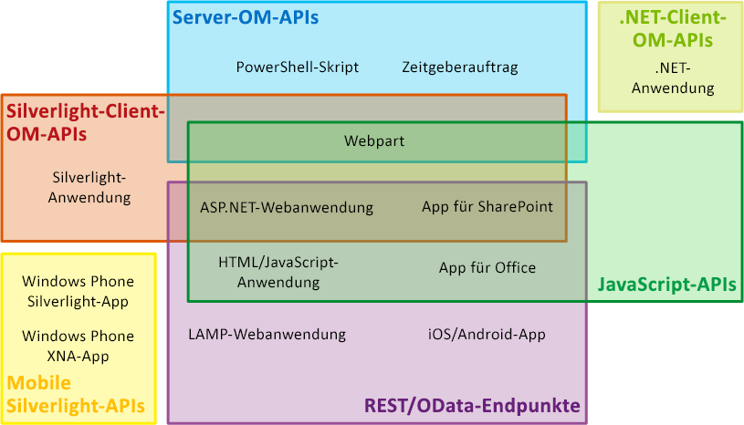
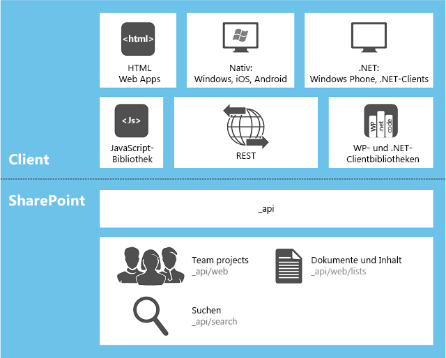

# Auswählen des richtigen API-Satzes in SharePoint 2013
Erfahren Sie mehr über die verschiedenen API-Gruppen, die in SharePoint 2013 bereitgestellt werden, einschließlich des Serverobjektmodells und der verschiedenen Clientobjektmodellen und des REST/OData-Webdiensts.
**Video ansehen: SharePoint 2013-Strategie für das SharePoint-Clientobjektmodell (CSOM) und REST**

  
    
    

  
    
    

  
    
    

  
    
    

  
    
    

## Faktoren, die bestimmen, welche API-Gruppe verwendet werden soll

Sie können aus verschiedenen API-Gruppen wählen, um auf die SharePoint 2013-Plattform zuzugreifen. Welche Sie verwenden sollten, hängt von folgenden Faktoren ab:
  
    
    

- **Der Anwendungstyp.** Zu den Möglichkeiten gehören u. a. folgende, sich nicht gegenseitig ausschließende Kategorien: eine SharePoint-Add-In, ein Webpart auf einer SharePoint-Seite, eine Silverlight-Anwendung, die auf einem Client-Computer oder einem Client-Mobilgerät ausgeführt wird, eine ASP.NET-Anwendung, die in SharePoint über ein IFrame-Element verfügbar ist, JavaScript, das auf einer SharePoint-Websiteseite ausgeführt wird, eine SharePoint-Anwendungsseite, eine Microsoft .NET Framework-Anwendung, die auf einem Client-Computer ausgeführt wird, ein Windows PowerShell-Skript und ein Zeitgeberauftrag, der auf einem SharePoint-Server ausgeführt wird.
    
  
- **Ihre vorhandenen Fachkenntnisse.** Überraschenderweise können Sie Anwendungen in SharePoint 2013 erstellen, ohne sich mit dem Programmieren in SharePoint beschäftigen zu müssen. Sie können direkt mit der SharePoint-Entwicklung beginnen, wenn Sie bereits versiert im Umgang mit folgenden Programmierungsmodellen sind:
    
  - JavaScript
    
  
  - ASP.NET
    
  
  - REST/OData
    
  
  - .NET Framework
    
  
  - Windows Phone
    
  
  - Silverlight
    
  
  - Windows PowerShell
    
  
- **Das Gerät, auf dem der Code ausgeführt wird.** Zu den Möglichkeiten gehört ein Server in der SharePoint-Farm, ein externer Server, wie z. B. ein Server in der Cloud, ein Client-Computer und ein Mobilgerät.
    
  
In diesem Thema erhalten Sie einen Überblick zu den verschiedenen API-Gruppen, die von SharePoint 2013 bereitgestellt werden. In Abbildung 1 ist dargestellt, welche API-Gruppen verwendet werden können, um eine der 13 allgemeinen SharePoint-bezogenen Anwendungen zu entwickeln. Bei vielen Anwendungen können Sie verschiedene APIs auswählen.
  
    
    

**Abbildung 1. Ausgewählte SharePoint-Erweiterungstypen und API-Gruppen in SharePoint**

  
    
    

  
    
    

  
    
    

  
    
    
In der folgenden Tabelle finden Sie Anleitungen dazu, welche API-Gruppen Sie für eine ausgewählte Liste allgemeiner SharePoint-Erweiterungsprojekte verwenden sollten. In den restlichen Abschnitten dieses Themas werden die verschiedenen API-Gruppen erläutert.
  
    
    

|**Wenn Sie diese Funktionen verwenden möchten...**|**... sollten Sie diese APIs einsetzen**|
|:-----|:-----|
|Erstellen Sie eine ASP.NET-Webanwendung, die Erstell-/Lese-/Aktualisier-/Lösch-Vorgänge über eine Firewall zu SharePoint-Daten oder externen Daten durchführt, die in SharePoint durch einen Microsoft Business Connectivity Services (BCS) externen Inhaltstyp dargestellt werden    |JavaScript-Clientobjektmodell    |
|Erstellen Sie eine ASP.NET-Webanwendung, die CRUD-Vorgänge zu SharePoint-Daten oder externen Daten durchführt, die in SharePoint durch einen externen BCS-Inhaltstyp dargestellt werden, SharePoint jedoch nicht über eine Firewall aufrufen müssen    |.NET Framework-Clientobjektmodell, Silverlight-Clientobjektmodell oder REST/OData-Endpunkte    |
|Erstellen Sie eine LAMP-Webanwendung, die CRUD-Vorgänge zu SharePoint-Daten oder externen Daten durchführt, die in SharePoint durch einen externen BCS-Inhaltstyp dargestellt werden    |REST/OData-Endpunkte    |
|Erstellen Sie eine Windows Phone-App, die CRUD-Vorgänge zu SharePoint-Daten durchführt    |Mobiles Clientobjektmodell    |
|Erstellen Sie eine Windows Phone-App, die den Microsoft-Pushbenachrichtigungsdienst verwendet, um das Mobilgerät über Ereignisse in SharePoint zu benachrichtigen    |Mobiles Clientobjektmodell und das Serverobjektmodell    |
|Erstellen Sie eine iOS- oder Android-App, die CRUD-Vorgänge zu SharePoint-Daten durchführt    |REST/OData-Endpunkte    |
|Erstellen Sie eine .NET Framework-Anwendung, die CRUD-Vorgänge zu SharePoint-Daten durchführt    |.NET Framework-Clientobjektmodell    |
|Erstellen Sie eine Silverlight-Anwendung, die CRUD-Vorgänge zu SharePoint-Daten durchführt    |Silverlight-Clientobjektmodell    |
|Erstellen Sie eine HTML/JavaScript-Anwendung, die CRUD-Vorgänge zu SharePoint-Daten durchführt    |JavaScript-Clientobjektmodell    |
|Erstellen Sie eine Office-Add-In, die mit SharePoint funktioniert    |JavaScript-Clientobjektmodell    |
|Erstellen Sie einen benutzerdefinierten Windows PowerShell-Befehl    |Serverobjektmodell    |
|Erstellen eines Zeitgeberauftrags    |Serverobjektmodell    |
|Erstellen einer Erweiterung der Zentraladministration    |Serverobjektmodell    |
|Erstellen eines konsistenten Branding in einer ganzen SharePoint-Farm    |Serverobjektmodell    |
|Erstellen eines benutzerdefinierten Webparts, einer Anwendungsseite oder eines ASP.NET-Benutzersteuerelements    |Serverobjektmodell    > **WICHTIG**> Wenn sich die Funktion, die Sie Kunden anbieten möchten, nicht an der SharePoint-Verwaltung in einem breiteren Bereich als eine Websitesammlung orientiert, wird empfohlen, anstelle das Serverobjektmodell zu verwenden, eine SharePoint-Add-In zu erstellen, die eine ASP.NET-Remote-Webanwendung mit benutzerdefinierten Webparts und ggf. Benutzersteuerelemente umfasst. Weitere Informationen dazu finden Sie in den oberen beiden Zeilen dieser Tabelle.           |
   

## Serverobjektmodell

Die größte API-Gruppe befindet sich im Serverobjektmodell der verwalteten Klassen. Auf der SharePoint Foundation 2013-Ebene umfasst dieses Objektmodell Klassen und Elemente, mit denen die Programmsteuerung der Basiswebsite und der Listenstruktur von SharePoint Foundation erfolgen kann. Der Großteil dieser Klassen befindet sich im  [Microsoft.SharePoint](https://msdn.microsoft.com/library/Microsoft.SharePoint.aspx) -Namespace. Außerdem können Sie fast jede SharePoint Foundation-Komponente erweitern, indem Sie das Serverobjektmodell verwenden, dazu gehören auch Workflows, Warnungen, Webparts, Standardsuchen und Microsoft Business Connectivity Services (BCS). Das Serverobjektmodell umfasst außerdem umfangreiche API-Gruppen-Aktivierungserweiterungen der Verwaltung und des Sicherheitssystems von SharePoint Foundation, einschließlich Sicherung, Farmintegrität und Diagnose, Protokollierung, Farm- und Webanwendungsverwaltung, Upgrade, Bereitstellung, Zwischenspeicherung und Windows PowerShell-Anpassung.
  
    
    
Auf der SharePoint Server 2013-Ebene werden noch viele weitere Klassen hinzugefügt, zum Programmieren der Enterprise Content Management (ECM), Benutzerprofile, Taxonomie, erweiterte Suche und weitere Features von SharePoint Server 2013.
  
    
    
Sie können  [LINQ to Objects](http://msdn.microsoft.com/de-de/library/bb397919.aspx) verwenden, um jede **IEnumerable**-Sammlung im Speicher abzufragen, mit  [LINQ to SharePoint-Anbieter](http://msdn.microsoft.com/library/3fa2dc5f-d308-4337-aefd-191a5df8dbbe%28Office.15%29.aspx) haben Sie jedoch die Möglichkeit, die Listen direkt in den SharePoint-Inhaltsdatenbanken abzufragen. Genau genommen ist dieser Anbieter nicht für die anderen in diesem Thema erläuterten API-Gruppen verfügbar; es gibt jedoch Möglichkeiten, LINQ-Syntax für den Großteil der anderen Gruppen zu verwenden.
  
    
    
Die Assemblys, die die integrierten serverseitigen Klassen definieren, sind im globalen Assemblycache jedes Servers installiert, wenn SharePoint 2013 installiert ist. Wenn Sie etwas für das Serverobjektmodell programmieren, werden Ihre Assemblys als Farmlösungen im globalen Assemblycache installiert.
  
    
    

> **HINWEIS**
> Das Entwickeln von neuem Sandkastenlösungen für SharePoint 2013 ist eine veraltete Methode, die dem Entwickeln von SharePoint-Add-Ins gewichen ist. Sandkastenlösungen kann weiterhin in Websitesammlungen in SharePoint 2013 installiert werden. Die Assemblys dieser Lösungen verbleiben im Paket, sofern sie nicht verwendet werden, ansonsten werden sie temporär in einem Ordner auf dem Server installiert. Weitere Informationen dazu finden Sie unter  [Wo werden Assemblys in Sandkastenlösungen bereitgestellt?](http://msdn.microsoft.com/library/dadbb20b-1bf7-442c-9eeb-bd9f01dbda45%28Office.15%29.aspx). 
  
    
    

### Beschränkungen zum Verwenden des Serverobjektmodells

Die benutzerdefinierte Logik in SharePoint-Add-Ins wird immer "hinunter" bis zum Client oder "hinauf" zur Cloud verteilt (oder "hinüber" zu einem Server außerhalb der SharePoint-Farm). In all diesen Verteilungsmodellen muss eines der Clientobjektmodelle oder die die REST/OData-Endpunkte verwendet werden. (Sie können das Serverobjektmodell nicht in einer SharePoint-Add-In verwenden). Wenn die App beispielsweise von SharePoint gehostete Seiten enthält, können diese Seiten auf SharePoint-Daten zugreifen, indem Sie das JavaScript-Clientobjektmodell verwenden. Diese Seiten können auch Silverlight-Anwendungen verfügbar machen, die das SharePoint 2013 Silverlight-Clientobjektmodell verwenden. Weitere Informationen über SharePoint-Add-Ins finden Sie unter  [Wichtige Aspekte der Architektur und Entwicklungslandschaft von Add-Ins für SharePoint](http://msdn.microsoft.com/library/ae96572b-8f06-4fd3-854f-fc312f7f2d88%28Office.15%29.aspx).
  
    
    

## Clientobjektmodelle für verwalteten Code

SharePoint 2013 verfügt über drei Clientobjektmodelle für verwalteten Code: .NET, Silverlight und Mobil.
  
    
    

### .NET-Clientobjektmodell

Das SharePoint 2013-Objektmodell für .NET Framework wird in .NET Framework-Anwendungen verwendet, die auf einem Windows-Client (kein Telefon) ausgeführt werden. Folgende Clients gehören zu dieser Gruppe:
  
    
    

- Ein Benutzer-Computer
    
  
- Ein Server außerhalb der SharePoint 2013-Farm
    
  
- Eine Webrolle oder Workerrolle in Microsoft Azure
    
  
Nahezu jede Klasse im zentralen serverseitigen Objektmodell für Websites und Listen verfügt über eine entsprechende Klasse im .NET Framework-Clientobjektmodell. Außerdem macht das .NET Framework-Clientobjektmodell eine vollständige API-Gruppe zum Erweitern weiterer Features verfügbar, dazu gehören einige SharePoint Server 2013-Features, wie z. B. ECM, Taxonomie, Benutzerprofile, erweiterte Suche, Analyse, BCS und andere.
  
    
    
Um die Leistung zu verbessern, werden im .NET Framework-Clientobjektmodell geschriebene Codezeilen in Batches an den SharePoint-Server gesendet. Dort werden sie in serverseitigen Code konvertiert und ausgeführt. Die abgefragten Ergebnisse und der neue Status aller Variablen werden anschließend an den Client zurückgegeben. Als Entwickler können Sie bestimmen, ob ein Batch synchron oder asynchron ausgeführt wird. (Bei einem synchronen Batch wartet die .NET Framework-Anwendung auf die vom Server zurückgegebenen Ergebnisse, bevor sie fortfährt; bei einem asynchronen Batch wird die clientseitige Verarbeitung sofort fortgesetzt und Client-Benutzeroberfläche bleibt reaktionsfähig.
  
    
    
Sie können LINQ-Abfragesyntax in Ihrem Clientcode verwenden, um beliebige **IEnumerable**-Objekte abzufragen, dazu gehören auch SharePoint 2013-Objekte, in denen **IEnumerable** implementiert ist. Wenn Sie so vorgehen, verwenden Sie jedoch [LINQ to Objects](http://msdn.microsoft.com/de-de/library/bb397919.aspx) und nicht [LINQ to SharePoint-Anbieter](http://msdn.microsoft.com/library/3fa2dc5f-d308-4337-aefd-191a5df8dbbe%28Office.15%29.aspx), die dazugehörige Dokumentation ist also für clientseitigen Code nicht relevant.
  
    
    
Die Assemblys für das .NET Framework-Clientobjektmodel muss auf dem Client installiert sein. Sie sind in einem verteilbaren Paket enthalten, das Sie unter  [SharePoint-Clientkomponenten](http://www.microsoft.com/en-us/download/details.aspx?id=35585) abrufen können.
  
    
    
Beispiele zum Verwenden des .NET Framework-Objektmodells finden Sie unter  [Ausführen grundlegender Vorgänge unter Verwendung von SharePoint 2013-Clientbibliothekscode](http://msdn.microsoft.com/library/5a69c9e3-73bf-4ed5-bc19-182056bdb394%28Office.15%29.aspx).
  
    
    

> **HINWEIS**
> Sie können die SharePoint REST/OData-Endpunkte auch in einer .NET Framework-Anwendung verwenden. Einen Vergleich des .NET Framework-Clientobjektmodells mit den SharePoint REST/OData-Endpunkten finden Sie im Abschnitt  [REST/OData-Endpunkte](#RESTOData) weiter unten in diesem Artikel.
  
    
    

### Silverlight-Clientobjektmodell

Das SharePoint 2013-Objektmodell für Silverlight wird in Silverlight-Anwendungen unabhängig davon verwendet, wo die kompilierte XAP-Datei gespeichert ist. Das kann eine Objektbibliothek auf einer SharePoint 2013-Website, ein Client-Computer, ein Cloud-Speicher oder ein externer Server sein. In der Regel wird eine Silverlight-Anwendung SharePoint 2013 in einem  [SilverlightWebPart](https://msdn.microsoft.com/library/Microsoft.SharePoint.WebPartPages.SilverlightWebPart.aspx) -Objekt dargestellt. Das Silverlight-Clientobjektmodell in SharePoint 2013 ist fast identisch mit dem .NET Framework-Clientobjektmodell und umfasst Unterstützung für die gleichen Erweiterbarkeitsbereiche. Der Hauptunterschied liegt darin, dass in der Silverlight-Version alle Batches der Befehle asynchron an den Server gesendet werden, damit die Benutzeroberfläche aktiv bleibt.
  
    
    
Die Assemblys für das Silverlight-Clientobjektmodel werden auf jedem SharePoint 2013-Server unter %ProgramFiles%\\Common Files\\Microsoft Shared\\web server extensions\\15\\TEMPLATE\\LAYOUTS\\ClientBin gespeichert. Sie müssen nicht auf dem Computer installiert werden, auf dem die Silverlight-Anwendung läuft, haben jedoch die Möglichkeit dazu. Sie können sie auch in der XAP-Datei der Anwendung zu einem Paket zusammenfassen.
  
    
    
Silverlight XAP-Dateien können einer SharePoint-Add-Ins hinzugefügt werden, darunter auch von SharePoint gehostete Apps. Dabei wird die XAP-Datei in einer Bibliothek im App-Web bereitgestellt. (Weitere Informationen zu App-Webs finden Sie unter [Hostwebsites, Add-In-Websites und SharePoint-Komponenten in SharePoint 2013](http://msdn.microsoft.com/library/b791cdf5-8aa2-47fa-bc4c-aee437354759%28Office.15%29.aspx).) So erhält man mit der Silverlight-App eine nützliche Methode zum Hinzufügen von benutzerdefiniertem SharePoint-Code in einer App, da benutzerdefinierter serverseitiger Code in SharePoint-Add-Ins nicht zulässig ist. Zudem können Silverlight-Entwickler für die Erstellung von SharePoint 2013-Anwendungen mit einer minimalen Lernkurve nutzen.
  
    
    

> **HINWEIS**
> Sie können auch die SharePoint REST/OData-Endpunkte in einer Silverlight-Anwendung verwenden. Einen Vergleich zwischen dem Silverlight-Clientobjektmodell und den SharePoint REST/OData-Endpunkten finden Sie im Abschnitt  [REST/OData-Endpunkte](#RESTOData) weiter unten in diesem Artikel.
  
    
    

### Mobiles Objektmodell

Für Windows Phone-Geräte ist eine spezielle Version des Silverlight-Clientobjektmodells verfügbar. Es umfasst zusätzliche APIs, die nur für Telefone relevant sind, wie z. B. APIs, mit der sich eine Smartphone-App für Benachrichtigungen vom Microsoft-Pushbenachrichtigungsdienst registrieren kann. Sie unterstützt alle wichtigen SharePoint 2013-Funktionen; es bietet jedoch keine Unterstützung für Nebenerweiterungsbereiche, die von den anderen beiden Clientobjektmodellen für verwalteten Code unterstützt werden. Verwenden Sie zum Zugreifen auf diese zusätzlichen Bereiche die SharePoint REST/OData-Endpunkte in Ihrer mobilen App. Weitere Informationen dazu finden Sie im Abschnitt  [REST/OData-Endpunkte](#RESTOData) weiter unten in diesem Artikel.
  
    
    
Die Assemblys für das mobile Objektmodell werden auf jedem SharePoint 2013-Server unter %ProgramFiles%\\Common Files\\Microsoft Shared\\web server extensions\\15\\TEMPLATE\\LAYOUTS\\ClientBin gespeichert. Sie können Sie in der XAP-Datei in Ihrer Windows Phone-Anwendung zu einem Paket zusammenfassen.
  
    
    

## JavaScript-Objektmodell

SharePoint 2013 stellt ein JavaScript-Objektmodell für die Nutzung in einem Inline-Skript oder separaten JS-Dateien bereit. Es umfasst die gleichen Funktionen wie die Clientobjektmodelle .NET Framework und Silverlight. Genau wie das Silverlight-Clientobjektmodell bietet das JavaScript-Objektmodell eine nützliche Methode zum Hinzufügen von benutzerdefiniertem SharePoint-Code in einer App, da benutzerdefinierter serverseitiger Code in SharePoint-Add-Ins nicht zulässig ist. Zudem können Webentwickler ihre vorhandenen JavaScript-Kenntnisse für die Erstellung von SharePoint-Anwendungen mit einer minimalen Lernkurve nutzen.
  
    
    
Genau wie Objektmodelle mit verwaltetem Code interagiert die JavaScript-Infrastruktur für SharePoint 2013 mit den Farm-Servern in Batches. Diese Batches werden immer asynchron ausgeführt. Außerdem ist es nun möglich, in JavaScript domänenübergreifend auf SharePoint-Daten zuzugreifen (jedoch nur Daten, die sich in der gleichen übergeordneten Websitesammlung befinden), was in vorherigen SharePoint-Versionen nicht möglich war. Weitere Informationen finden Sie unter  [Zugreifen auf SharePoint 2013-Daten über Add-Ins mithilfe der domänenübergreifenden Bibliothek](http://msdn.microsoft.com/library/bc37ff5c-1285-40af-98ae-01286696242d%28Office.15%29.aspx). Daten werden in JavaScript Object Notation (JSON) vom Server zurückgegeben.
  
    
    
Das JavaScript-Objektmodell ist in einer JS-Dateigruppe definiert, die sich auf jedem Server unter %ProgramFiles%\\Common Files\\Microsoft Shared\\web server extensions\\15\\TEMPLATE\\LAYOUTS befinden.
  
    
    
Beispiele zum Verwenden des .NET Framework-Objektmodells finden Sie unter  [Ausführen grundlegender Vorgänge unter Verwendung von JavaScript-Bibliothekscode in SharePoint 2013](http://msdn.microsoft.com/library/29089af8-dbc0-49b7-a1a0-9e311f49c826%28Office.15%29.aspx).
  
    
    

> **HINWEIS**
> In einer JavaScript-Anwendung können Sie auch die SharePoint REST/OData-Endpunkte verwenden. Einen Vergleich zwischen dem JavaScript-Clientobjektmodell und den SharePoint REST/OData-Endpunkten finden Sie im folgenden Abschnitt. 
  
    
    

## REST/OData-Endpunkte

Für den Zugriff auf SharePoint-Entitäten über Clienttechnologien, die nicht JavaScript verwenden und nicht auf den Plattformen .NET Framework oder Silverlight basieren, bietet SharePoint 2013 eine Implementierung eines REST-Webdiensts, der CRUDQ-Vorgänge bei SharePoint-Listendaten über das  [OData-Protokoll](http://www.odata.org/) ausführt. Zudem verfügt nahezu jede API in den Clientobjektmodellen über einen entsprechenden REST-Endpunkt. Dadurch kann im Code mithilfe jeder Technologie, die REST-Standardfunktionen unterstützt, direkt mit SharePoint 2013 interagiert werden. Der Webdienst "svc.web" behandelt die HTTP-Anforderung und liefert eine Antwort im Atom- oder JSON-Format.
  
    
    
Weitere Informationen über den REST/OData-Webdienst finden Sie unter dem Knoten  [Programmieren mit dem SharePoint 2013 REST-Dienst](use-odata-query-operations-in-sharepoint-rest-requests.md); Beispiele dazu finden Sie im Thema  [Ausführen grundlegender Vorgänge unter Verwendung von SharePoint 2013-REST-Endpunkten](http://msdn.microsoft.com/library/e3000415-50a0-426e-b304-b7de18f2f7d9%28Office.15%29.aspx).
  
    
    

### Vergleich zur REST/OData-Programmierung mit der Clientobjektmodell-Programmierung

In einigen Situationen ist die Verwendung von REST-Endpunkten möglicherweise vorzuziehen, selbst in Anwendungen, in denen ein SharePoint-Objektmodell verfügbar ist. Insbesondere für Entwickler, die über keine Erfahrung Im Entwickeln von Windows-basiertem Code haben. In der folgenden Tabelle finden Sie einen Vergleich zwischen den wichtigsten Funktionen dieser Programmierungsoptionen für einen Entwickler, der eine Anwendung auf einer Windows-Plattform oder mit einer Plattform erstellt, die JavaScript unterstützt.
  
    
    

|**Feature**|**.NET Framework oder Silverlight-Objektmodelle**|**JavaScript-Objektmodell**|**Von einer Windows-Plattform oder von JavaScript abgerufene REST/OData-Endpunkte**|
|:-----|:-----|:-----|:-----|
|Objektorientiertes Programmieren    |Ja    |Ja    |Nein    |
|Batch-Verarbeitung    |Ja    |Ja    |Ja    |
|APIs für die bedingte Verarbeitung und Ausnahmebehandlungen    |Ja    |Nein    |Nein    |
|Verfügbarkeit der LINQ-Syntax    |Ja    |Nein    |Nein    |
|Kombinieren von Listendaten aus verschiedenen SharePoint-Webanwendungen    |Ja    |Nein    |Ja    |
|Vertrautheit für erfahrene REST/OData-Entwickler    |Nein    |Nein    |Ja    |
|Ähnlichkeiten zur nicht-Windows-Programmierung oder JavaScript-Programmierung    |Nein    |Ja    |Ja    |
|Starke Typisierung für Listenelementfelder    |Nein (außer mit LINQ)    |Nein    |Ja, von einer Windows-Plattform          Nein, von JavaScript    |
|Nutzen von jQuery, Knockout und anderen JavaScript-Bibliotheken    |Nein    |Ja    |Nein, von einer Windows-Plattform          Ja, von JavaScript    |
   

## Framework für die WCF Data Services

Wenn Sie LINQ-Syntax in .NET Framework- oder Silverlight-Clientanwendungen bevorzugen, unterstützt SharePoint 2013 die  [WCF Data Services](http://msdn.microsoft.com/de-de/library/cc668792.aspx) als LINQ-Anbieter. Sie können wie in vorherigen Versionen von SharePoint Foundation die "listdata.svc" (nur für Listendaten) vorgeben, oder die gleiche "client.svc" vorgeben, die die OData-Schnittstelle für den Zugriff auf alle SharePoint-Entitäten und Listendaten unterstützt. Weitere Informationen dazu finden Sie unter [Abfragen von SharePoint Foundation mit ADO.NET Data Services](http://msdn.microsoft.com/library/3e3e16f7-620a-4710-a3f3-19d0236f4b4a%28Office.15%29.aspx).
  
    
    
In Abbildung 2 ist die Beziehung zwischen den verschiedenen Client-APIs, verschiedenen Client-Anwendungstypen und SharePoint dargestellt. Die unterschiedlichen _api*-URLs sind die farmrelativen URLs für die REST-Endpunkte. Weitere Informationen dazu finden Sie unter dem Thema  [Weitere Informationen zum SharePoint 15 REST-Dienste](get-to-know-the-sharepoint-2013-rest-service.md#bk_learnmore).
  
    
    

**Abbildung 2. Client-Anwendungen und APIs in SharePoint**

  
    
    

  
    
    

  
    
    

  
    
    

  
    
    

## Veraltete API-Gruppen

Zwei API-Gruppen werden weiterhin im SharePoint 2013-Framework für die Abwärtskompatibilität unterstützt, es wird jedoch empfohlen, sie nicht für neue Projekte zu verwenden: die  [ASP.NET-Webdienste (asmx)](http://msdn.microsoft.com/library/c587ee90-1f88-43f3-b1a7-5f3072d038f8%28Office.15%29.aspx) und [direkte Remoteprozeduraufrufe rufen die Datei owssvr.dll](http://msdn.microsoft.com/library/4aa5c82b-90fb-4be5-b30c-d35ecae42a81%28Office.15%29.aspx) auf.
  
    
    

## Zusätzliche Ressourcen

-  [Übersicht über die SharePoint 2013-Entwicklung](sharepoint-2013-development-overview.md)
    
  
-  [Programmiermodelle in SharePoint 2013](programming-models-in-sharepoint-2013.md)
    
  
-  [SharePoint-Add-Ins im Vergleich zu SharePoint-Lösungen](sharepoint-add-ins-compared-with-sharepoint-solutions.md)
    
  
-  [Programmieren mit dem SharePoint 2013 REST-Dienst](use-odata-query-operations-in-sharepoint-rest-requests.md)
    
  
-  [Ausführen grundlegender Vorgänge unter Verwendung von SharePoint 2013-REST-Endpunkten](http://msdn.microsoft.com/library/e3000415-50a0-426e-b304-b7de18f2f7d9%28Office.15%29.aspx)
    
  
-  [Ausführen grundlegender Vorgänge unter Verwendung von SharePoint 2013-Clientbibliothekscode](http://msdn.microsoft.com/library/5a69c9e3-73bf-4ed5-bc19-182056bdb394%28Office.15%29.aspx)
    
  
-  [Ausführen grundlegender Vorgänge unter Verwendung von JavaScript-Bibliothekscode in SharePoint 2013](http://msdn.microsoft.com/library/29089af8-dbc0-49b7-a1a0-9e311f49c826%28Office.15%29.aspx)
    
  
-  [Abfragen von SharePoint Foundation mit ADO.NET Data Services](http://msdn.microsoft.com/library/3e3e16f7-620a-4710-a3f3-19d0236f4b4a%28Office.15%29.aspx)
    
  

  
    
    
