# Erstellen einer SharePoint-Workflow-App mit Visual Studio 2012
Exemplarische Vorgehensweise zum Erstellen einer Workflow-SharePoint-Add-In mit Microsoft Visual Studio 2012
## Voraussetzungen
<a name="bmPreReq"> </a>

In diesem Entwicklungsszenario wird vorausgesetzt, dass eine SharePoint Server 2013-Farm und eine Workflow-Manager 1.0-Farm installiert und verbunden sind. Diese beiden Farmen können sich auf demselben oder auf separaten Servercomputern befinden. Im Szenario wird weiter davon ausgegangen, dass die Workflowentwicklung remote - d. h. auf keinem der Servercomputer - und mit Microsoft Visual Studio 2012 oder höher erfolgt.
  
    
    

- Auf den Serverplattformen:
    
  - Windows Server 2008 R2
    
  
  - Microsoft SharePoint Server 2013
    
  
  - Workflow-Manager 1.0
    
  
- Auf der Entwicklungsplattform:
    
  - Microsoft Visual Studio 2012 oder höher
    
  
  - Office Developer Tools für Visual Studio 2013
    
    > **HINWEIS**
      > Office Developer Tools für Visual Studio 2013 ist nur erforderlich, wenn Visual Studio 2012 verwendet wird. Höhere Versionen von Visual Studio enthalten die Office Developer Tools. 
Hilfe beim Einrichten und Konfigurieren Ihrer SharePoint-Workflow-Entwicklungsumgebung finden Sie hier:
  
    
    

-  [Vorbereiten auf das Einrichten und Konfigurieren einer SharePoint-Workflowentwicklungsumgebung](prepare-to-set-up-and-configure-a-sharepoint-workflow-development-environment.md)
    
  
-  [Konfigurieren von Workflows in SharePoint Server 2013](http://technet.microsoft.com/de-de/library/jj658586%28v=office.15%29)
    
  
-  [Videoreihe: Installieren und Konfigurieren von Workflows in SharePoint Server 2013](http://technet.microsoft.com/de-de/library/dn201724%28v=office.15%29)
    
  

## Erste Schritte
<a name="bmGetStarted"> </a>

Ein häufiges Szenario für Workflow in Geschäftsumgebungen ist der Prozess der Prüfung und Genehmigung von Dokumenten. In dieser exemplarischen Vorgehensweise erstellen wir eine SharePoint-Add-In, die Routing, Benachrichtigungen und Genehmigung (oder Ablehnung) eines Dokuments mithilfe eines SharePoint-Workflows automatisiert. Wir erstellen diesen Workflow mithilfe des SharePoint-Workflow-Designers in Microsoft Visual Studio 2012.
  
    
    
Hier ist ein Flussdiagramm, das den Ablauf des Workflows veranschaulicht, den wir erstellen möchten.
  
    
    

**Abbildung 1. Flussdiagramm des Dokumentgenehmigungs-Workflows**

  
    
    

  
    
    
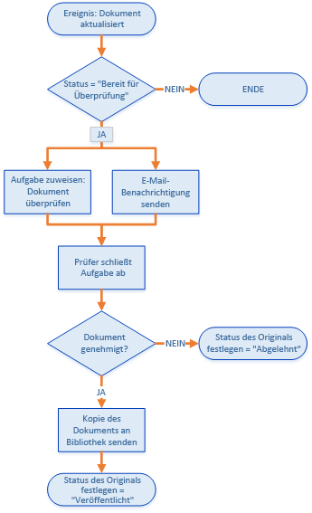
  
    
    
Zusammengefasst führt der Workflow Folgendes aus:
  
    
    

  
    
    

1. Ein Dokumentänderungsereignis, das einer bestimmten Dokumentbibliothek zugeordnet ist, startet die Workflowinstanz.
    
  
2. Wenn der Status des Dokuments auf "Bereit zur Überprüfung" festgelegt ist, weist der Workflow einem vordefinierten Prüfer eine Aufgabe zu und sendet dann dem Prüfer eine E-Mail-Benachrichtigung über die Aufgabe.
    
  
3. Wenn der Prüfer das Dokument nicht genehmigt, bleibt die Dokumentdatei in der Bibliothek **Entwurfsdokumente**. Der Status des Dokuments wird jedoch auf "Abgelehnt" festgelegt.
    
  
4. Wenn der Prüfer das Dokument genehmigt, kopiert der Workflow das Dokument in eine Dokumentbibliothek **Veröffentlichte Dokumente**. Die Originaldatei bleibt in der Bibliothek **Entwurfsdokumente**, aber der Status wird auf "Veröffentlicht" festgelegt.
    
  

    
> **WICHTIG**
> Bevor Sie mit dieser exemplarischen Vorgehensweise beginnen, stellen Sie sicher, dass Sie über eine ordnungsgemäß installierte und konfigurierte Entwicklungsumgebung für Workflows verfügen. Weitere Informationen finden Sie unter  [Vorbereiten auf das Einrichten und Konfigurieren einer SharePoint-Workflowentwicklungsumgebung](prepare-to-set-up-and-configure-a-sharepoint-workflow-development-environment.md). Stellen Sie außerdem sicher, dass Sie über eine SharePoint Server 2013-Instanz verfügen, für die Sie Ihren Workflow entwickeln können. Weitere Informationen finden Sie unter  [Installieren von SharePoint 2013](http://technet.microsoft.com/de-de/library/cc303424.aspx). 
  
    
    


## Vorbereiten der Umgebung
<a name="bmPrepare"> </a>

Im ersten Schritt wird die SharePoint-Website mit Dokumentbibliotheken vorbereitet, die im Workflow verwendet werden.
  
    
    

1. Starten Sie Visual Studio 2012, und erstellen Sie ein neues Projekt unter Verwendung der Vorlage **App für SharePoint 2013**, wie in Abbildung 2 dargestellt.
    
    > **HINWEIS**
      > In dieser exemplarischen Vorgehensweise wird die Lösungsdatei "DocApprovalWorkflow1" genannt. Es wird empfohlen, denselben Namen zu verwenden. Wenn Sie Ihre Lösung anders nennen, müssen Sie darauf achten, in den folgenden Anweisungen die nötigen Anpassungen vorzunehmen. 

   **Abbildung 2. Erstellen eines neuen Projekts in Visual Studio 2012**

  

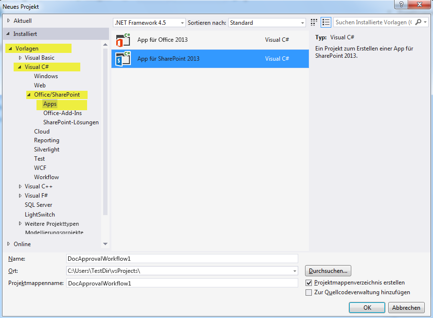
  

  

  
2. Erstellen Sie auf Ihrer entsprechenden SharePoint-Website wie folgt zwei neue Dokumentbibliotheken:
    
  - Klicken Sie im **Projektmappen-Explorer** mit der rechten Maustaste auf das Symbol **DocApprovalWorkflow1**, und wählen Sie **Hinzufügen** > **Neues Element** und dann **Liste** aus.
    
  
  - Geben Sie im resultierenden **Assistenten zum Anpassen von SharePoint** im Namenfeld **Entwurfsdokumente** ein. Wählen Sie dann in der Dropdownliste unter dem ersten Optionsfeld **Dokumentbibliothek** aus, wie in Abbildung 3 dargestellt.
    
  
  - Klicken Sie auf **Weiter**, übernehmen Sie die Standardeinstellungen, und klicken Sie dann auf **Fertig stellen**.
    
   **Abbildung 3. Assistent zum Anpassen von SharePoint für Listeneinstellungen**

  

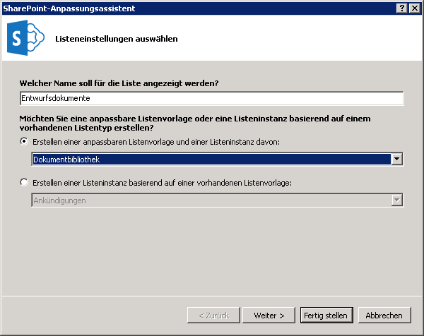
  

  

  
3. Erstellen Sie die zweite Dokumentbibliothek mit den gleichen Schritten wie oben, aber nennen Sie diese zweite Bibliothek **Veröffentlichte Dokumente**.
    
  
4. Fügen Sie zwei benutzerdefinierte Spalten zu **beiden** neuen Dokumentbibliotheken hinzu, die Sie soeben erstellt haben:
    
  - Erstellen Sie eine benutzerdefinierte Spalte namens **Genehmigende Person** mit dem Listenspaltentyp **Person oder Gruppe**.
    
  
  - Erstellen Sie eine benutzerdefinierte Spalte namens **Dokumentstatus** mit dem Spaltentyp **Auswahlliste** (siehe Abbildung 4).
    
  
5. Fügen Sie in der Spalte **Dokumentstatus** fünf Auswahlmöglichkeiten hinzu, indem Sie die **Type**-Eigenschaft im Eigenschaftenraster erweitern und dann in der **Items**-Eigenschaft auf die Schaltfläche mit den Auslassungszeichen ( **…**) klicken. Geben Sie die Auswahlwerte im daraufhin angezeigten Dialogfeld ein, wie in Abbildung 4 dargestellt.
    
  - Entwurf in Bearbeitung
    
  
  - Bereit zur Überprüfung
    
  
  - Genehmigt zur Veröffentlichung
    
  
  - Abgelehnt
    
  
  - Veröffentlicht
    
  

   ****

  

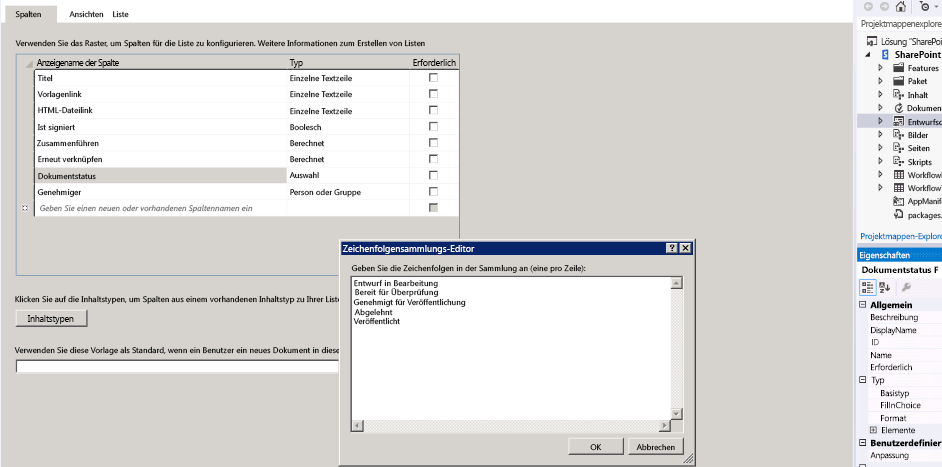
  

  

  

## Erstellen des grundlegenden Workflows
<a name="bmCreateWorkflow"> </a>

Nun sind wir bereit, den Workflow selbst zu erstellen.
  
    
    

1. Erstellen Sie in Visual Studio einen neuen Workflow, indem Sie (im **Projektmappen-Explorer**) mit der rechten Maustaste auf das Symbol **DocApprovalWorkflow1** klicken und **Hinzufügen** > **Neues Element** und dann **Workflow** auswählen (siehe Abbildung 5).
    
   **Abbildung 5. Neues Element hinzufügen > Workflow-Assistent**

  

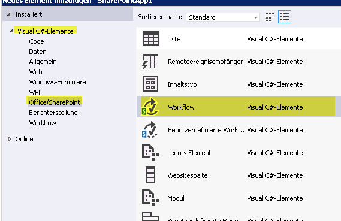
  

  

  
2. Wenn Sie aufgefordert werden, nennen Sie den Workflow **DocumentApprovalWorkflow**, und wählen Sie **Listenworkflow** als Workflowtyp aus (siehe Abbildung 6).
    
   **Abbildung 6. Angeben von Workflowname und -typ**

  

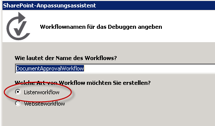
  

  

  
3. Ordnen Sie im **Assistenten zum Anpassen von SharePoint** den neuen Workflow der Bibliothek **Entwurfsdokumente** zu. Wählen Sie dann die Option, eine neue Verlaufsliste und eine neue Workflowaufgabenliste zu erstellen, wie in Abbildung 7 dargestellt. Klicken Sie dann auf **Weiter**.
    
   **Abbildung 7. Abschließen des Assistenten zum Anpassen von SharePoint für den neuen Workflow**

  

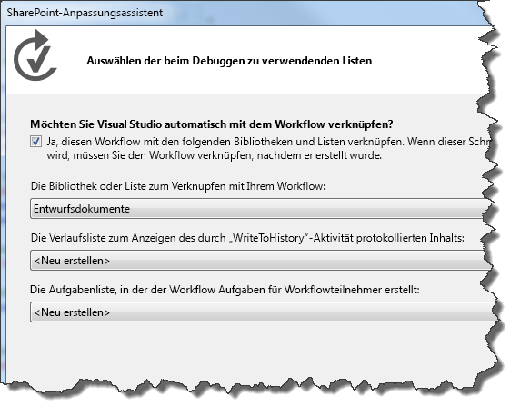
  

  

  
4. Legen Sie fest, dass der Workflow automatisch gestartet wird, wenn ein Element in der Bibliothek **Entwurfsdokumente** geändert wird. Sie können auch das Kontrollkästchen für manuelles Starten des Workflows aktiviert lassen. Dadurch können Sie den Workflow einfach testen, ohne ein Dokument zu ändern. Siehe Abbildung 8.
    
   **Abbildung 8. Festlegen von Aktivierungsparametern für den Workflow**

  

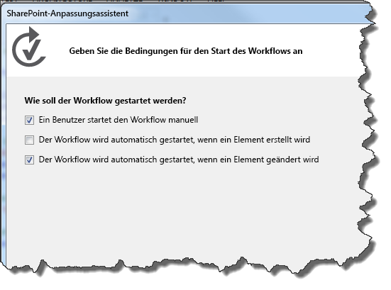
  

    
> **HINWEIS**
> Sie können den Workflowzuordnungstyp nach Erstellen des Workflows im Eigenschaftenraster ändern, während der Workflow im **Projektmappen-Explorer** ausgewählt ist (siehe Abbildung 9). Klicken Sie dann auf **Fertig stellen**. 

   **Abbildung 9. Das Eigenschaftsraster des Workflows**

  

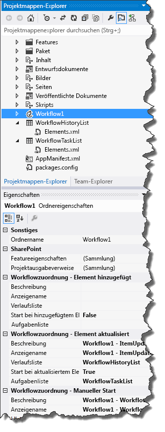
  

  

  
5. Konfigurieren Sie schließlich Ihren SharePoint Server für die Verwaltung ausgehender E-Mails über den SMTP-Dienst. Anweisungen finden Sie unter  [Konfigurieren ausgehender E-Mails für eine SharePoint 2013-Farm](http://technet.microsoft.com/de-de/library/cc263462.aspx). Dies ist nötig, damit vom Workflow E-Mail-Benachrichtigungen im Zusammenhang mit Workflowaufgaben gesendet werden können.
    
  

## Implementieren der Workflowlogik
<a name="bmImplementLogic"> </a>

Nachdem wir unseren SharePoint Server eingerichtet und den grundlegenden Workflow erstellt haben, können wir nun die Workflowlogik entwerfen.
  
    
    

1. Öffnen Sie den Workflow-Designer durch Doppelklicken auf das Workflow-Projektelement im **Projektmappen-Explorer**. Sie sehen die Workflow-Designeroberfläche (und die Workflow-Toolbox). Der Designer wird mit einer anfänglichen Workflowphase namens **Sequenz** aufgefüllt.
    
  
2. Unser erster Schritt besteht darin, die **LookupSPListItem**-Aktivität aus der Toolbox (siehe Abbildung 10) in die Phase **Sequenz** auf der Designeroberfläche zu ziehen. Wir verwenden diese Aktivität, um zu einem beliebigen Zeitpunkt den Status des Dokuments abzurufen. Die **LookupSPListItem**-Aktivität gibt diesen als  [DynamicValue](http://msdn.microsoft.com/de-de/library/windowsazure/microsoft.activities.dynamicvalue%28v=azure.10%29.aspx)-Objekt zurück, das einen Satz von SharePoint-Listenelementeigenschaften als Schlüssel-Wert-Paare enthält.
    
   **Abbildung 10. "LookupSPListItem"-Aktivitätsauswahl.**

  

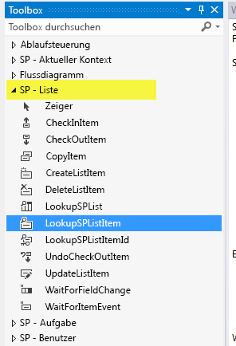
  

  

1. Zum Konfigurieren der **LookupSPListItem**-Aktivität klicken Sie zunächst im Designer darauf, um sie auszuwählen. Dadurch wird das Eigenschaftenraster für die Aktivität aktiviert.
    
  
2. Konfigurieren Sie die **LookupSPListItem**-Aktivität mithilfe der Kombinationsfelder im Eigenschaftenraster so, dass für **ItemId** das aktuelle Element und als **ListId** die aktuelle Liste verwendet wird, wie in Abbildung 11 dargestellt.
    
   **Abbildung 11. Konfigurieren von Eigenschaften von "LookupSPListItem"**

  

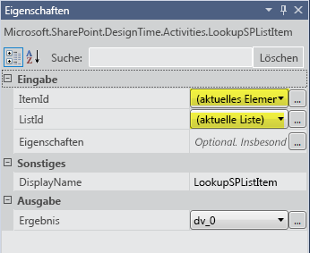
  

  

  
3. Klicken Sie auf der Kachel der **LookupSPListItem**-Aktivität auf den Link **Eigenschaften abrufen**. Dadurch werden zwei wichtige Schritte für Sie ausgeführt:
    
1. Erstens wird eine Variable vom Typ **DynamicValue** erstellt und an das Ausgabeargument (namens _Result_) der **LookupSPListItem**-Aktivität gebunden. In dieser Variablen werden die Eigenschaften des Listenelements gespeichert.
    
  
2. Zweitens wird eine neue Aktivität namens **GetDynamicValueProperties** hinzugefügt (siehe Abbildung 12) und die neu erstellte Variable **DynamicValue** als Eingabeargument der neuen Aktivität festgelegt. Diese Aktivität ermöglicht das Extrahieren der Listenelementeigenschaften aus der **DynamicValue**-Variablen.
    
  
4. Klicken Sie auf der **GetDynamicValueProperties**-Aktivität auf **Definieren…**, um ein Dialogfeld zur Auswahl der Eigenschaften zu öffnen, die Sie extrahieren möchten. Zur Auswahl von Eigenschaften finden Sie in Abbildung 12 einen Teil der Designeroberfläche, zusammen mit dem geöffneten Dialogfeld **Eigenschaften**.
    
   **Abbildung 12. Auswählen der zu extrahierenden DynamicValue-Eigenschaften**

  

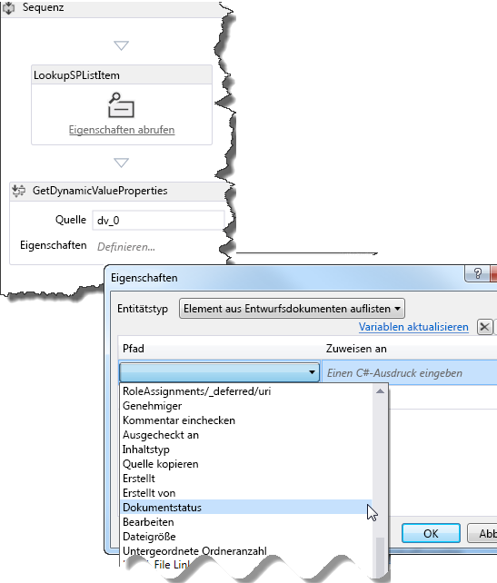
  

  

1. Wählen Sie für **Entitätstyp** die Option **Listenelement von Entwurfsdokumenten** aus.
    
  
2. Klicken Sie im Datenraster in der **Pfad**-Spalte auf **Eigenschaft erstellen**, um ein Kombinationsfeld zu öffnen, das die verfügbaren Eigenschaften für Listenelemente in der Bibliothek **Entwurfsdokumente** enthält. Wählen Sie **Dokumentstatus** im Kombinationsfeld aus.
    
  
3. Klicken Sie in der nächsten Zeile im Datenraster erneut auf **Eigenschaft erstellen**. Dieses Mal wählen Sie **Genehmigende Person** im Kombinationsfeld aus.
    
  
4. Klicken Sie nun auf den Link **Variablen auffüllen** im Dialogfeld. Dies erstellt eine Variable vom entsprechenden Datentyp für jede Zeile und weist sie der **Zuweisen zu**-Spalte des Datenrasters zu, wie in Abbildung 13 dargestellt.
    
   **Abbildung 13. Abrufen der Eigenschaften "Dokumentstatus" und "Genehmigende Person"**

  

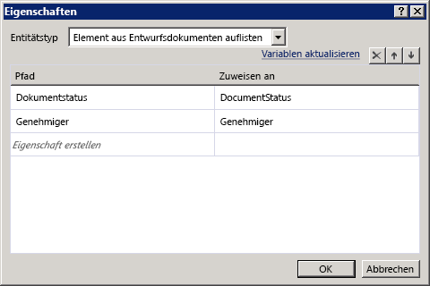
  

  

  
5. Wir haben nun die Listenelementwerte, die wir benötigen. Als Nächstes wird der Workflow dafür eingerichtet, zu überprüfen, ob das Dokument "Bereit zur Überprüfung" ist, und ggf. die entsprechenden Maßnahmen zu ergreifen.
    
1. Ziehen Sie die **If**-Aktivität aus der Toolbox auf die Oberfläche des Workflow-Designers. (Sie finden die **If**-Aktivität im Abschnitt **Ablaufsteuerung** der Toolbox.)
    
  
2. Legen Sie die **If**-Bedingung auf  `DocumentStatus.Equals("Ready for Review")` fest, wie in Abbildung 14 dargestellt.
    
   **Abbildung 14. Erstellen einer WENN/DANN-Klausel zum Auslösen einer Aufgabe**

  

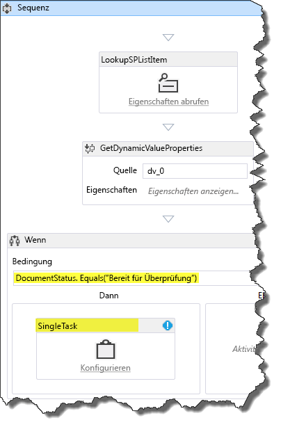
  

  

  
3. Als Nächstes ziehen Sie aus dem Abschnitt **SP - Aufgabe** der Toolbox eine **SingleTask**-Aktivität in das **Then**-Feld Ihrer **If**-Aktivität. Faktisch haben Sie den Workflow so konfiguriert, dass **If** das Dokument bereit zur Überprüfung ist, **Then** diese Aufgabe ausgeführt wird.
    
  
6. Im nächsten Schritt wird die soeben erstellte Aufgabe mithilfe des Konfigurationsdialogfelds aus Abbildung 15 konfiguriert.
    
   **Abbildung 15. Dialogfeld für die Aufgabenkonfiguration**

  

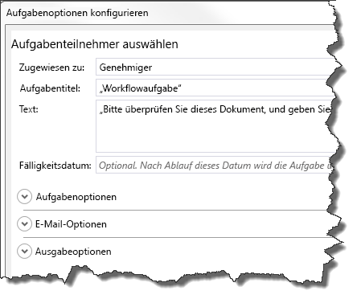
  

  

1. Zuerst weisen wir die Aufgabe einer genehmigenden Person zu. Klicken Sie hierzu auf den Link **Konfigurieren** in der **SingleTask**-Aktivitätskachel.
    
  
2. Legen Sie das Feld **Zugewiesen zu:** auf **Genehmigende Person** fest.
    
  
3. Beachten Sie, dass das Feld **Aufgabentitel:** automatisch mit **Workflowaufgabe** ausgefüllt wird.
    
  
4. Geben Sie im Feld **Text:** eine einfache Nachricht mit Anweisungen für die genehmigende Person ein, wie z. B. "Bitte überprüfen Sie dieses Dokument, um seine Veröffentlichung zu genehmigen."
    
  
5. Klicken Sie auf **OK**, um zu speichern.
    
  

    Beachten Sie, dass zu diesem Zeitpunkt ein Überprüfungsfehler für die **SingleTask**-Aktivität angezeigt wird. Sehen Sie, während die **SingleTask**-Kachel ausgewählt ist, die **AssignedTo**-Eigenschaft im Eigenschaftenraster an, und beachten Sie, dass sie ein Fehlersymbol aufweist. Zeigen Sie auf den Eigenschaftennamen, um eine QuickInfo anzuzeigen, die das Problem beschreibt. Wir sehen, dass die **AssignedTo**-Eigenschaft einen **String**-Wert erwartet, die Variable **Approver** jedoch vom Datentyp **Int32** ist.
    
    Um diesen Fehler zu beheben, wandeln Sie die Variable in den Datentyp **String** um, indem Sie in der **AssignedTo**-Zeile des Eigenschaftenrasters ".ToString()" an "Approver" anfügen, wie in Abbildung 16 dargestellt.
    

   **Abbildung 16. Umwandeln der Variablen "Approver" in den Datentyp "String" im Eigenschaftenraster**

  

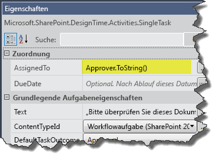
  

Zum gegenwärtigen Zeitpunkt in dieser exemplarischen Vorgehensweise haben Sie eine Workflowaufgabe erstellt und konfiguriert, die zwei Dinge umfasst: es wird ein zu überprüfendes Dokument festgelegt und eine E-Mail an den mit der Aufgabe Beauftragten (in diesem Fall "Genehmigende Person") gesendet, dass eine Aufgabe zugewiesen wurde und Aktionen erwartet werden.
    
  
7. Sehen wir uns das Eigenschaftenraster für die **SingleTask**-Aktivität an. Führen Sie einen Bildlauf zum Ende des Eigenschaftenrasters durch, und beachten Sie, dass der Abschnitt **Ausgabe** zwei Eigenschaften **Outcome** und **TaskItemId** enthält, die Ausgabeargumente sind.
    
    Notieren Sie den Namen der **Outcome**-Variablen:  _outcome_0_ (oder ähnlich). Wir verwenden diese Variable, um das Ergebnis des Vorgangs zu überprüfen - d. h., ob die genehmigende Person das Dokument genehmigt oder abgelehnt hat.
    
    > **HINWEIS**
      > Das **Outcome**-Ausgabeargument gibt einen **Int32**-Wert entsprechend dem Index der Ausgabe zurück - d. h. **0** für "Genehmigt" und **1** für "Abgelehnt". Diese ganzen Zahlen sind die Standardwerte in der vordefinierten SharePoint-Websitespalte namens "Ergebnis des Vorgangs".
8. Damit der Workflow das Ergebnis des Vorgangs überprüft, müssen wir nun eine weitere **If**-Aktivität hinzufügen. Sie wird hinter der **SingleTask**-Aktivität, aber innerhalb des **Then**-Bereichs platziert, wie in Abbildung 17 dargestellt. Durch Festlegen der **If**-Bedingung auf " `outcome_0 == 0`" wird mitgeteilt, ob das Dokument genehmigt wurde.
    
   **Abbildung 17. Hinzufügen der IF-Aktivität zum Überprüfen des Aufgabenstatus**

  


  

  

  
9. Wenn die genehmigende Person die Aufgabe auf "Genehmigt" festgelegt hat, aktualisieren wir den Dokumentstatus auf "Genehmigt zur Veröffentlichung" und kopieren die Dokumentdatei in die Bibliothek **Veröffentlichte Dokumente**. Wenn die genehmigende Person das Dokument dagegen abgelehnt hat, müssen wir den Dokumentstatus auf "Abgelehnt" festlegen.
    
1. Ziehen Sie in dieser neuen **If**-Aktivität eine **UpdateListItem**-Aktivität in das **Then**-Feld.
    
  
2. Konfigurieren Sie die **UpdateListItem**-Aktivität im zugehörigen Eigenschaftenraster so, dass **ItemId** auf "(Aktuelles Element)" und **ListId** auf "(Aktuelle Liste)" festgelegt wird, wie in Abbildung 18 dargestellt.
    
  
3. Anschließend klicken Sie, während die **UpdateListItem**-Aktivität ausgewählt ist, auf die Schaltfläche mit den Auslassungszeichen ( **…**) neben dem **ListItemPropertiesDynamicValue**-Feld im Eigenschaftenraster. Dadurch wird ein Dialogfeld geöffnet, in dem Sie die Listenelementeigenschaften angeben können, die Sie aktualisieren möchten.
    
   **Abbildung 18. Festlegen der zu aktualisierenden Listenelementeigenschaften**

  

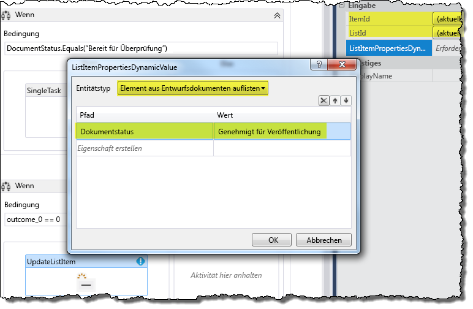
  

  

  
4. Verwenden Sie im Dialogfeld zuerst das Kombinationsfeld, um **Entitätstyp** auf **Listenelement aus Entwurfsdokumenten** festzulegen (siehe Abbildung 18). Klicken Sie im Datenraster auf **Eigenschaft erstellen**, und wählen Sie **Dokumentstatus** aus der Dropdownliste aus. Geben Sie dann unter der **Wert**-Spalte "Genehmigt zur Veröffentlichung" (einschließlich der Anführungszeichen) ein, und klicken Sie auf **OK**.
    
  
10. Ziehen Sie aus dem **Then**-Bereich der aktuellen **If**-Aktivität eine **CopyItem**-Aktivität direkt unter die **UpdateListItem**-Aktivität, wie in Abbildung 19 dargestellt.
    
   **Abbildung 19. Hinzufügen einer "CopyItem"-Aktivität zum Workflow**

  

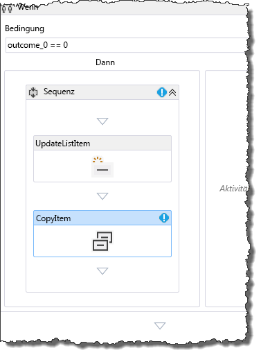
  

Konfigurieren Sie dann die Eigenschaften der **CopyItem**-Aktivität im Eigenschaftenraster, wie in Abbildung 20 dargestellt. Eigenschaftswerte sind hervorgehoben.
    

   **Abbildung 20. Konfigurieren der "CopyItem"-Aktivität**

  

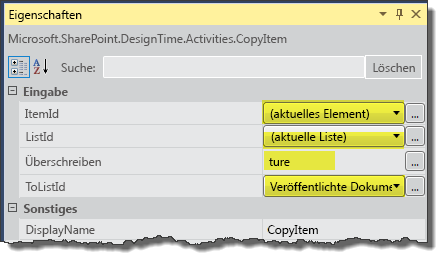
  

    
> **HINWEIS**
> Für diese exemplarische Vorgehensweise werden wir davon ausgehen, dass alle unsere veröffentlichten Dokumente aus der Bibliothek **Entwurfsdokumente** stammen. Daher müssen wir uns nicht um doppelte Dateinamen kümmern.

11. Schließlich müssen wir eine Aktivität hinzufügen, um den Fall zu behandeln, dass der Prüfer das Dokument ablehnt. Dazu fügen wir eine **UpdateListItem**-Aktivität im **Else**-Bereich der aktuellen **If**-Aktivität hinzu. Konfigurieren Sie diese **UpdateListItem**-Aktivität genau so wie die vorherige in Schritt 9(c), allerdings legen wir den Dokumentstatus jetzt auf "Abgelehnt" fest, wie in Abbildung 21 dargestellt.
    
   **Abbildung 21. Konfigurieren von Eigenschaften der "UpdateListItem"-Aktivität für abgelehnte Dokumente**

  

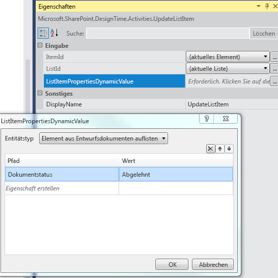
  

  

  
Damit ist das Erstellen eines SharePoint-Dokumentgenehmigungs-Workflows abgeschlossen. Der vollständige Workflow ist in Abbildung 22 dargestellt.
  
    
    

**Abbildung 22. Abgeschlossener SharePoint-Dokumentgenehmigungs-Workflow**

  
    
    

  
    
    
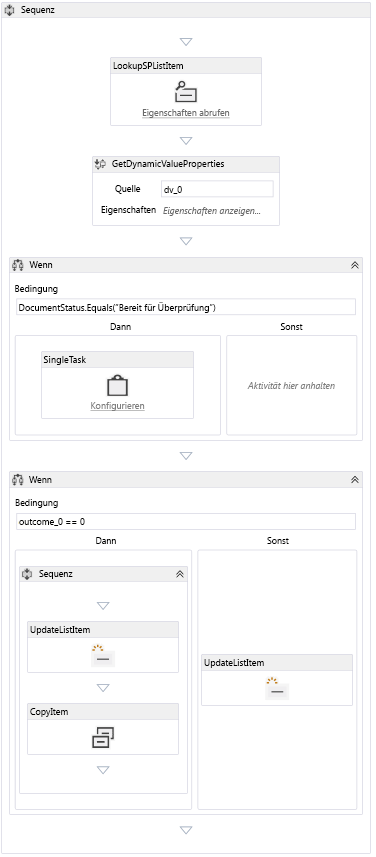
  
    
    

  
    
    

  
    
    

## Packen und Bereitstellen des Workflows
<a name="bk_deploy"> </a>

Die folgenden Ressourcen bieten Hilfestellung für das Packen und Bereitstellen Ihres Workflows als SharePoint-Add-In:
  
    
    

-  [Bereitstellen und Installieren von Apps für SharePoint: Methoden und Optionen](http://msdn.microsoft.com/de-de/library/fp179933.aspx)
    
  
-  [Veröffentlichen von Apps für SharePoint](http://msdn.microsoft.com/de-de/library/jj164070.aspx)
    
  
-  [Gewusst wie: Erstellen und Bereitstellen von deklarativen Workflows in Sandkastenlösungen](http://msdn.microsoft.com/de-de/library/gg615452%28v=office.14%29.aspx) (Mit SharePoint Designer 2013)
    
  

> **VORSICHT**
> SharePoint-Add-Ins mit integrierten Workflows (die Listen im übergeordneten Web zugeordnet sein können) werden von normalen Workflow-Apps unterschieden, indem das folgende Tag in der Datei  `workflowmanifest.xml` im App-Paket in **true** geändert wird:
  
    
    


```XML

<SPIntegratedWorkflow xmlns="http://schemas.microsoft.com/sharepoint/2014/app/integratedworkflow">
    <IntegratedApp>true</IntegratedApp>
</SPIntegratedWorkflow>

```


## Weitere Ressourcen
<a name="bk_addresources"> </a>


-  [Workflows in SharePoint 2013](workflows-in-sharepoint-2013.md)
    
  
-  [Vorbereiten auf das Einrichten und Konfigurieren einer SharePoint-Workflowentwicklungsumgebung](prepare-to-set-up-and-configure-a-sharepoint-workflow-development-environment.md)
    
  
-  [Bewährte Methoden für die SharePoint-Workflowentwicklung](sharepoint-workflow-development-best-practices.md)
    
  
-  [Entwickeln von SharePoint 2013-Workflows mit Visual Studio](develop-sharepoint-2013-workflows-using-visual-studio.md)
    
  

  
    
    

