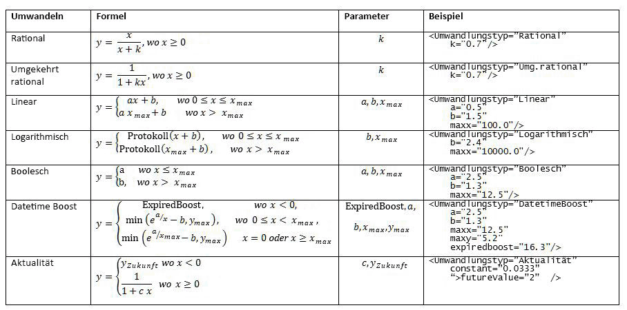
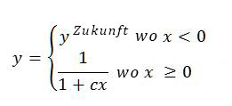
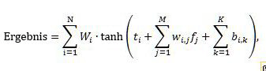
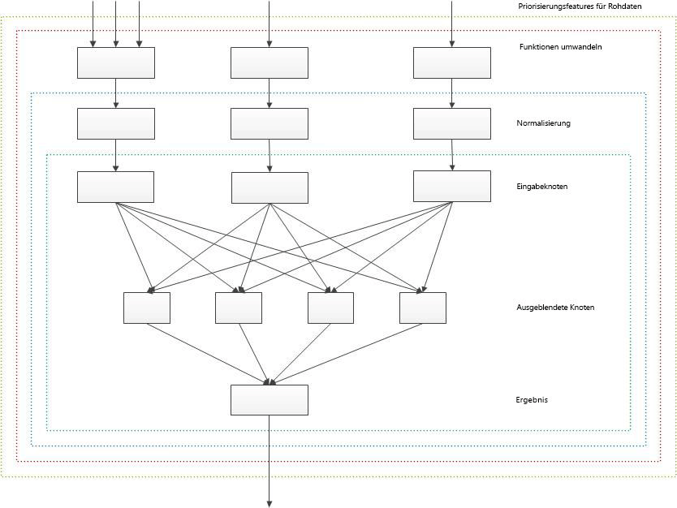

# Anpassen von Bewertungsmodellen zur Verbesserung der Relevanz in SharePoint 2013
Verbessern Sie die Suchrelevanz, indem Sie die Bewerungsmodelle so anpassen, dass das Bewertungsergebnis (Relevanzbewertung) mithilfe der Bewertungsfunktionen in SharePoint Server 2013 berechnet wird.
Sie können  [Suchergebnisse in SharePoint 2013](sorting-search-results-in-sharepoint-2013.md) mit vier verschiedenen Methoden sortieren, eine ist die Sortierung nach dem Bewertungsergebnis. Wenn Sie Suchergebnisse nach dem Bewertungsergebnis sortieren, stellt SharePoint Server 2013 die relevantesten Ergebnisse oben im Suchergebnissatz bereit.
  
    
    

Ein Suchergebnis ist relevant, wenn es ein hohes Bewerungsergebnis erhält. Dabei handelt es sich um ein spezifisches numerisches Ergebnis, das vom Suchmodul eines Bewertungsmodells berechnet wird. Ein Bewertungsmodell ist eine Liste einer oder mehrerer Bewerungsstufen, die einen Satz Bewertungsfunktionen enthält.
Das Bewertungsmodell definiert, wie das Suchmodul die Relevanzbewertung anhand verschiedener Faktoren berechnet, die im Bewerungsmodell als Bewertungsfunktionen dargestellt sind. Zu den für die Berechnung der Relevanzbewertung verwendeten Faktoren gehören folgende:
  
    
    


- Die Darstellung der Abfragebegriffe im Fulltextindex, zu denen beispielsweise Informationen wie der Titel und Text eines Dokuments gehören.
    
  
- Die mit einem bestimmten Element verknüpften Metadaten, z. B. der Dateityp eines Dokuments oder die URL-Länge.
    
  
- Der mit den URL-Links verknüpfte Text, die auf ein bestimmtes Element verweist.
    
  
- Die Informationen zu Benutzerklicks für jedes Element.
    
  
- Die Annäherung an Abfragebegriffe im Text oder Titel eines Dokuments.
    
  

## Starten der Bewertungsmodellanpassung basierend auf einer SharePoint-Bewertungsmodellvorlage
<a name="sp15_using_custom_ranking_model"> </a>

Um die Anpassung einfacher zu gestalten, beginnen Sie damit, eine der Standard-Bewertungsmodelle in SharePoint Server 2013 als Vorlage zu verwenden. Passen Sie das Bewerungsmodell anschließend an Ihren Datensatz an.
  
    
    
SharePoint Server 2013 bietet standardmäßig 14 Bewertungsmodelle. Weitere Informationen zu diesen Bewertungsmodellen und ihren Funktionen finden Sie auf TechNet unter  [Was ist ein Bewertungsmodell?](http://technet.microsoft.com/library/7c8ddec1-c8ff-4a90-afae-387b27a653f1.aspx#Ranking_Models).
  
    
    

> **WICHTIG**
> Wenn Sie das kumulative Update von August 2013 für SharePoint Server 2013 installieren, empfehlen wir, die **Search Ranking Model with Two Linear Stages** als Basismodell für das benutzerdefinierte Bewertungsmodell zu verwenden. Das **Search Ranking Model with Two Linear Stages** ist eine Kopie des **Default Search Model** mit einer zweiten linearen Stufe statt einer zweiten Stufe eines neuronalen Netzwerks.
  
    
    

Verwenden Sie zum Anpassen von Bewertungsmodellen folgende Windows PowerShell-Cmdlets:
  
    
    

-  [Get-SPEnterpriseSearchRankingModel](http://technet.microsoft.com/de-de/library/ff607990.aspx)
    
  
-  [New-SPEnterpriseSearchRankingModel](http://technet.microsoft.com/de-de/library/ff607980.aspx)
    
  
-  [Remove-SPEnterpriseSearchRankingModel](http://technet.microsoft.com/de-de/library/ff608045.aspx)
    
  
-  [Set-SPEnterpriseSearchRankingModel](http://technet.microsoft.com/de-de/library/ff607940.aspx)
    
  

### Auflisten aller verfügbaren Bewerungsmodelle


1. Öffnen Sie SharePoint-Verwaltungsshell als Administrator.
    
  
2. Führen Sie fogende Sequenz von Windows PowerShell-Cmdlets aus.
    
  ```
  
$ssa = Get-SPEnterpriseSearchServiceApplication -Identity "Search Service Application"
$owner = Get-SPenterpriseSearchOwner -Level ssa
Get-SPEnterpriseSearchRankingModel -SearchApplication $ssa -Owner $owner
  ```


### Aufrufen einer Standard-Bewerungsmodell zur Verwendung als Vorlage


1. Öffnen Sie SharePoint-Verwaltungsshell als Administrator.
    
  
2. Führen Sie folgende Sequenz von Windows PowerShell-Cmdlets aus;  *filename.xml*  ist der Name einer Datei, in der Sie das Bewertungsmodell speichern möchten.
    
  ```
  
$ssa = Get-SPEnterpriseSearchServiceApplication
$owner = Get-SPenterpriseSearchOwner -Level ssa
$defaultRankingModel = Get-SPEnterpriseSearchRankingModel -SearchApplication $ssa -Owner $owner | Where-Object { $_.IsDefault -eq $True }
$defaultRankingModel.RankingModelXML > filename.xml

  ```

Wenn Sie das kumuplative Update von August 2013 für SharePoint Server 2013 installieren, können Sie folgendes Verfahren verwenden, um das Suchbewertungsmodell mit zwei linearen Stufen abzurufen, damit Sie es als Vorlage für Ihr benutzerdefiniertes Bewertungsmodell verwenden können.
  
    
    

### Aufrufen des Suchbewertungsmodells mit zwei linearen Stufen zur Verwendung als Vorlage


1. Öffnen Sie SharePoint-Verwaltungsshell als Administrator.
    
  
2. Führen Sie folgende Sequenz von Windows PowerShell-Cmdlets aus;  *filename.xml*  ist der Name einer Datei, in der Sie das Bewertungsmodell speichern möchten.
    
  ```
  
$ssa = Get-SPEnterpriseSearchServiceApplication
$owner = Get-SPenterpriseSearchOwner -Level ssa 
$twoLinearStagesRankingModel = Get-SPEnterpriseSearchRankingModel -SearchApplication $ssa -Owner $owner -Identity 5E9EE87D-4A68-420A-9D58-8913BEEAA6F2 
$twoLinearStagesRankingModel.RankingModelXML > filename.xml

  ```


### Bereitstellen eines benutzerdefinierten Bewertungsmodells


1. Kopieren Sie aus der Liste der verfübaren Bewertungsmodelle die GUID des Bwertungsmodells, das Sie als Vorlage verwenden möchten. (Unter  [Auflisten aller verfügbaren Bewertungsmodelle](#sp15_list_available_ranking_models) finden Sie die Sequenz der zu verwendenden Windows PowerShell-Cmdlets).
    
  
2. Führen Sie folgende Sequenz von Windows PowerShell-Cmdlets mithilfe der in Schritt für  _<GUID>_ kopierten GUID aus.
    
  ```
  
$ssa = Get-SPEnterpriseSearchServiceApplication
$owner = Get-SPenterpriseSearchOwner -Level ssa
$rm = Get-SPEnterpriseSearchRankingModel -Identity <GUID> -SearchApplication $ssa -Owner $owner
$rm.RankingModelXML > myrm.xml 

  ```

3. Bearbeiten Sie die  `myrm.xml`-Datei in einem XML-Editor. Sie müssen neue GUID-Werte für die **id**-Attribute im  _RankModel2Stage_-Element und alle  _RankingModel2NN_-Elemente verwenden. Um einen neuen GUID-Wert abzurufen, können Sie beispielsweise folgenden Windows PowerShell-Befehl verwenden:  `[guid]::NewGuid()`
    
  
4. Erstellen Sie ein neues Bewertungsmodell mit dem  [New-SPEnterpriseSearchRankingModel](http://technet.microsoft.com/de-de/library/ff607980.aspx)-Cmdlet, indem Sie folgende Befehle ausführen.
    
  ```
  
$myRankingModel = Get-Content .\\myrm.xml
$myRankingModel = [String]$myRankingModel
$ssa = Get-SPEnterpriseSearchServiceApplication
$owner = Get-SPenterpriseSearchOwner -Level ssa
$newrm = New-SPEnterpriseSearchRankingModel -SearchApplication $ssa -Owner $owner -RankingModelXML $myRankingModel
  ```


### Bewertungsdetail


> **WICHTIG**
> Wir bieten das Bewertungsdetail und die dazugehörige ExplainRank-Seite aus Gründen der Einfachheit und nur zur Optimierung und Debuggen Ihrer eigenen benutzerdefinierten Bewertungsmodelle. Die Inhalte des Bewertungsdetails und der dazugehörigen ExplainRank-Seite werden nicht unterstützt und können in zukünfitgen Software-Patches und -Updates ohne vorherige Ankündigung geändert werden. 
  
    
    

Das Bewertungsdetail ist ein XML-Dokument, das detaillierte Informationen zur Berechnung des Bewertungsergebnisses für ein einzelnes Element bereitstellt, das mit einer angegebenen Benutzer-Abfrage übereinstimmt. Das Bewertungsdetail wird in einer speziell verwalteten Eigenschaft mit der Bezeichnung **rankdetail** gespeichert.
  
    
    
Jede Bewertungsfunktion in einem Bewertungsmodell besitzt einen separaten XML-Knoten im Bewertungsdetail, das Details zur Berechnung des Bewertungsergebnisses beschreibt. Das Bewertungsdetail wird nur für Abfragen bereitgestellt, die Suchergebnisse mit höchstens 100 Elementen aufweisen.
  
    
    
Das Konzept des Gesamtformats des Bewertungsdetails ist im folgenden Beispiel dargestellt.
  
    
    


```XML

<rank_log version='15.0.0000.1000' id='[internal guid of ranking model used for calculation]' >
    <query tree='[representation of user query used for ranking]'/>
    <stage type='linear'>
        [Details of rank calculation of the first ranking stage. One XML node for each rank feature.]
        <stage_model>
            [Definition of the first stage of the ranking model]
        </stage_model>
    </stage>
    <stage type='neural_net' >
        [Details of rank calculation of the second ranking stage. One XML node for each rank feature.]
        <stage_model>
            [Definition of the second stage of the ranking model]
        </stage_model>
    </stage>
</rank_log>
```

Um das Bewertungsdetail abzurufen, müssen Sie der Administrator der Suchdienstanwendung sein.
  
    
    

### Abrufen des Bewertungsdetails


1. Öffnen Sie SharePoint-Verwaltungsshell als Administrator.
    
  
2. Führen Sie folgende Sequenz von Windows PowerShell-Cmdlets aus und tauschen Sie  _<query_text>_ und _<url>_ durch tatsächliche Werte aus.
    
  ```
  
$app = Get-SPEnterpriseSearchServiceApplication
$searchAppProxy =  Get-spenterprisesearchserviceapplicationproxy | Where-Object { ($_.ServiceEndpointUri.PathAndQuery -like $app.Uri.PathAndQuery)}
$request = New-Object Microsoft.Office.Server.Search.Query.KeywordQuery($searchAppProxy)
$request.ResultTypes = [Microsoft.Office.Server.Search.Query.ResultType]::RelevantResults
$request.QueryText = "<query_text> AND path:""<url>"""
$request.SelectProperties.Add("rankdetail")
$searchexecutor = new-Object Microsoft.Office.Server.Search.Query.SearchExecutor 
$resultTables = $searchexecutor.ExecuteQuery($request) 
$resultTables[([Microsoft.Office.Server.Search.Query.ResultType]::RelevantResults)].Table

  ```


### Grundlegendes zur Berechnung des Bewertungsergebnisses über die ExplainRank-Seite

SharePoint Server 2013 bietet die **ExplainRank**-Seite, die sich im Layoutordner befindet ( `<searchCenter>/_layouts/15/`). Diese Seite enthält detaillierte Informationen zum Bewertungsergebnis für jede Bewertungsfunktion basierend auf einer angegebenen Suchabfrage, eine Dokument-ID und einer optionalen Bewertungsmodell-ID. Die Informationen werden abgerufen und aus dem Bewertungsdetail analysiert.
  
    
    
Sie können über folgende URL auf die **ExplainRank**-Seite zugreifen: 
  
    
    
 `http://<searchCenter>/_layouts/15/ExplainRank.aspx?q={x}&amp;d={y}&amp;rm={z}`
  
    
    
Wobei Folgendes gilt:
  
    
    

-  *x*  ist die Suchabfrage.
    
  
-  *y*  ist die Dokument-ID.
    
  
-  *z*  ist die optionale Bewertungsmodell-ID. Wenn keine Bewertungsmodell-ID bereitgestellt wird, wird das Standard-Bewertungsmodell verwendet.
    
  
Genau wie bei dem Bewertungsdetail müssen Sie auch zum Anzeigen der **ExplainRank**-Seite der Administrator der Suchdienstanwendung sein.
  
    
    

## Optimieren Ihres Bewertungsmodells mit Bewertungsfunktionen
<a name="sp15_rank_features"> </a>

Bewertungsfunktionen funktionieren wie Optimierungsskalen für ein Bewertungsmodell. In den folgenden Abschnitten werden die Bewertungsfunktionen beschrieben, die im SharePoint Server 2013-Standardbewertungsmodell verfügbar sind und welche Rolle Sie bei der Berechnung der Relevanzbewertung spielen.
  
    
    

### BM25

Die BM25-Bewertungsfunktion bewertet Elemente basierend auf der Anzeige der Abfragebegriffe im Volltextindex. Die Eingabe in BM25 kann eine beliebige der verwalteten Eigenschaften im Volltextindex sein.
  
    
    

> **HINWEIS**
> Die in diesem Kontext verwendete BM25-Bewertungsfunktion ist die Feldversion BM25F. 
  
    
    

Die BM25-Bewertungsfunktion berechnet das Relevanzbewertungsergebnis anhand der folgenden Formel.
  
    
    

  
    
    

  
    
    
Wobei Folgendes gilt:
  
    
    

-  _D_ ist ein Dokument, das als Liste von Textfeldern wie beispielsweise der Titel oder Text des Dokuments dargestellt wird.
    
  
-  _Q_ ist die Benutzerabfrage, die als Liste von Abfragebegriffen dargestellt wird, _t_.
    
  
-  _S_ definiert die Liste von Feldern, die Anteil an der Relevanzbewertung haben; diese Liste wird durch das Bewertungsmodell definiert.
    
  
-  _w_fist ein numerischer Wert, der die relative Gewichtung des Felds  _f_ ∈ _S_ definiert; dieser Wert wird durch das Bewerungsmodell definiert.
    
  
-  _b_fist ein numerischer Wert, der die Dokumentlänge-Normalisierung für jedes Feld  _f_ ∈ _S_ definiert.
    
  
-  _TF_f _(t,D)_ ist die Anzahl von Vorkommnissen des Abfragebegriffs _t_ im Feld _f_ des Dokuments _D_.
    
  
-  _DL_f _(D)_ ist die Gesamtanzahl Wörter im Feld _f_ des Dokuments _D_.
    
  
-  _N_ ist die Gesamtanzahl von Dokumenten im Index.
    
  
-  _n_tist eine Menge von Dokumenten, bei denen der Begriff  _t_ in mindestens einer der Eigenschaften enthalten ist.
    
  
-  _AVDL_fist der der durchschnittliche  _DL_f _(D)_ aller indizierten Dokumente.
    
  
-  _k_1ist ein skalierbarer Parameter; dieser Wert wird durch das Bewertungsmodell definiert.
    
  
Sie müssen dem Standard-Volltextindex die für die BM25-Bewertungsfunktion verwendeten verwalteten Eigenschaften im Benutzeroberflächen-Steuerelement **Erweiterte durchsuchbare Einstellungen auswählen** zuweisen.
  
    
    
Innerhalb einer Benutzerabfrage werden Abfragebegreiffe, die Teil der folgenden Operatoren sind, von den Relevanzbewertungsberechnungen ausgeschlossen:  `NOT(…)` in FQL, `NOT(…)` in KQL und `FILTER(…)` in FQL.
  
    
    
Außerdem werden im Bereich liegende Abfragebegriffe, z. B.  `title:apple AND body:orange`, aus den Relevanzbewertungsberechnungen ausgeschlossen.
  
    
    
 **Beispieldefinition einer BM25-Bewertungsfunktion**
  
    
    


```XML

<BM25Main name="ContentRank" k1="1">
    <Layer1Weights>
        <Weight>0.26236235707678</Weight>
    </Layer1Weights>
    <Properties>
        <Property name="body" w="0.019391078235467" b="0.44402228898786156" propertyName="body" />
        <Property name="Title" w="0.36096989709360422" b="0.38179554361297785" propertyName="Title" />
        <Property name="Author" w="0.15808522836934547" b="0.13896219383271818" propertyName="Author" />
        <Property name="Filename" w="0.15115036355698144" b="0.96245017871125826" propertyName="Filename" />
        <Property name="QLogClickedText" w="0.3092664171701901" b="0.056446823262849853" propertyName="QLogClickedText" />
        <Property name="AnchorText" w="0.021768362296187508" b="0.74173561196103566" propertyName="AnchorText" />
        <Property name="SocialTag" w="0.10217215754116529" b="0.55968554315932328" propertyName="SocialTag" />
    </Properties>
</BM25Main>
```

 **Beispiel-Bewertungsdetail für das BM25-Bewertungsfunktion**
  
    
    


```

<bm25 name='ContentRank'>
<schema pid_mapping='[1:content::7:%default] [2:content::1:%default] [3:content::5:%default] [56:content::2:%default] [100:content::3:link] [10:content::6:link] [264:content::14:link] ' pids_not_mapped=''/>
<query_term term='WORDS(content:integration, content:integrations, content:integrations)'>
    <index name='content' N='10035' n='8'
           avdl='1 2.98018 2.00427 1 1 2.39394 1 637.308 1 1 1 1 1 1 1 1 '>
        <group id='%default'
               ext_doc_id='55' int_doc_id='16' precalc='0' tf_prime='0.500486' weight='1'
               tf='0 1 1 0 0 0 0 11 0 0 0 0 0 0 0 0 '
               dl='0 4 9 0 0 2 0 1291 0 0 0 0 0 0 0 0 '/>
        <group id='link'/>
    </index>
    <rank score='2.37967' score_acc='2.37967' term_weight='7.13439'/>
</query_term>

<query_term term='WORDS(content:effort, content:efforts, content:efforts)'>
    <index name='content' N='10035' n='9'
           avdl='1 2.98018 2.00427 1 1 2.39394 1 637.308 1 1 1 1 1 1 1 1 '>
        <group id='%default'/>
        <group id='link'/>
    </index>
    <rank score='0' score_acc='2.37967' term_weight='7.01661'/>
</query_term>

<query_term term='PHRASE(content:fastserver, content:plugin)'>
    <index name='content' N='10035' n='3'
           avdl='1 2.98018 2.00427 1 1 2.39394 1 637.308 1 1 1 1 1 1 1 1 '>
        <group id='%default'
               ext_doc_id='55' int_doc_id='16' precalc='0' tf_prime='0.0399696' weight='1'
               tf='0 0 0 0 0 0 0 3 0 0 0 0 0 0 0 0 '
               dl='0 4 9 0 0 2 0 1291 0 0 0 0 0 0 0 0 '/>
        <group id='link'/>
    </index>
    <rank score='0.311896' score_acc='2.69157' term_weight='8.11522'/>
</query_term>
<final score='2.69157' transformed='2.69157' normalized='2.69157' hidden_nodes_adds='0.706166 '/>
</bm25>

```


#### Gewichtungsgruppen

In einem benutzerdefinierten Bewertungsmodell können Sie zwei oder mehr verwaltete Eigenschaften besitzen, die der gleichen Gewichtungsgruppe im Suchschema zugeordnet sind. In solchen Fällen werden die Inhalte dieser verwalteten Eigenschaften im Volltextindex kombiniert und können nicht separat in der BM25-Berechnung bewertet werden. Dieser Effekt entspricht dem Festlegen der gleichen Werte für den  _w_fund  _b_fParameter innerhalb der einzelnen Gruppen der verwalteten Eigenschaften, werden der gleichen Gewichtungsgruppe im Suchschema zugeordnet. Um dies zu verhindern, müssen Sie die verwalteten Eigenschaften einer der 16 verschiedenen Gewichtungsgruppen zuordnen, die im Suchschema verfügbar sind.
  
    
    
Gewichtungsgruppen werden auch als Kontext bezeichnet. Weitere Informationen zur Beziehung zwischen einer verwalteten Eigenschaft und ihrem Kontext finden Sie auf TechNet unter  [Beeinflussen der Bewerung von Suchergebnissen durch die Verwendung des Suchschemas](http://technet.microsoft.com/library/7c8ddec1-c8ff-4a90-afae-387b27a653f1.aspx#Ranking_Schema).
  
    
    

### Statisch

Die statische Bewertungsfunktion bewertet die Elemente basierend auf numerischen verwalteten Eigenschaften, die im Suchindex gespeichert werden. Die zur Relevanzbewertungsberechnung in statischen Bewertungsfunktionen verwendeten numerischen verwalteten Eigenschaften müssen den Typ  [Integer](https://msdn.microsoft.com/library/System.Integer.aspx) besitzen und im Suchschema auf [Refinable](https://msdn.microsoft.com/library/Microsoft.Office.Server.Search.Administration.ManagedProperty.Refinable.aspx) oder [Sortable](https://msdn.microsoft.com/library/Microsoft.Office.Server.Search.Administration.ManagedProperty.Sortable.aspx) festgelegt sein. Sie können keine verwalteten Eigenschaften mit mehreren Werten in Kombination mit der statischen Bewertungsfunktion verwenden.
  
    
    
Bevor die statische Bewertungsfunktion kann mit anderen Bewertungsfunktionen aggregiert werden, wird jede statische Bewertungsfunktion über eine einzelne Transformation vorverarbeitet. Tabelle 1 listet alle unterstützten Transformationsfunktionen auf.
  
    
    

**Tabelle 1. Unterstützte Transformationsfunktionen für die statischen und Näherungsbewertungsfunktionen**

  
    
    

  
    
    

  
    
    
 **Beispieldefinition einer statischen Bewertungsfunktion**
  
    
    


```XML

<Static name="clickdistance" default="5" propertyName="clickdistance">
    <Transform type="InvRational" k="0.27618729159042193" />
    <Layer1Weights>
        <Weight>0.616326852981262</Weight>
    </Layer1Weights>
</Static>

```

 **Beispiel-Bewertungsdetail für eine statische Bewertungsfunktion**
  
    
    


```

<static_feature name='clickdistance' property_name='clickdistance'
    used_default='1' raw_value='5' raw_value_transformed='5' 
    transformed='0.420003' normalized='0.420003'
    hidden_nodes_adds='0.258859 '/>

```


### Zusammengefasste Statik

Die zusammengefasste Statik-Bewertungsfunktion bewertet Dokumente basierend auf dem Dateityp und der Sprache. Die Definition einer zusammengefassten Statik-Bewertungsfunktion innerhalb eines Bewertungsmodells hängt davon ab, ob die Bewertungsfunktion Teil eines linearen Modells oder neuralen Netzwerks ist. Die folgenden Beispiele gelten nur für lineare Modelle. Bei neuralen Netzwerken muss die Anzahl der  `<Add>`-Attribute für jeden Bucket mit der Anzahl der versteckten Knoten im neuralen Netzwerk übereinstimmen.
  
    
    
Die zur Relevanzbewertungsberechnung verwendeten verwalteten Eigenschaften in den zusammengefassten Statik-Bewertungsfunktionen müssen den Typ  [Integer](https://msdn.microsoft.com/library/System.Integer.aspx) besitzen und im Suchschema auf [Refinable](https://msdn.microsoft.com/library/Microsoft.Office.Server.Search.Administration.ManagedProperty.Refinable.aspx) oder [Sortable](https://msdn.microsoft.com/library/Microsoft.Office.Server.Search.Administration.ManagedProperty.Sortable.aspx) festgelegt werden. Sie können keine verwalteten Eigenschaften mit mehreren Werten in Kombination mit der zusammengefassten Statik-Bewertungsfunktion verwenden.
  
    
    
 **Beispieldefinition einer zusammengefassten Statik-Beweretungsfunktion für den Dateityp**
  
    
    
Jedem Dokument ist ein Dateityp zugewiesen, den die Inhaltsverarbeitungskomponente erkennt und im Suchindex als nullbasierten Ganzzahlwert speichert. Wenn Sie die zusammengefasste Statik-Bewertungsfunktion verwenden, um Dokumente basierend auf den Dateitypen zu bewerten, erhält jeder Dokumenttyp ein bestimmte Relevanzbewertungsergebnis. In der folgenden Definition entspricht das Bucket beispielsweise **2** einem PPT-Dokument; der Knoten `<Add>0.680984743282165</Add>` definiert zusätzliche Bewertungspunkte, die für alle PPT-Dokumente zu den Relevanzbewertungsergebnissen hinzugefügt werden.
  
    
    


```XML

<BucketedStatic name="InternalFileType" default="0" propertyName="InternalFileType">
    <Bucket name="Html" value="0">
        <HiddenNodesAdds>
            <Add>0.464062832328107</Add>
        </HiddenNodesAdds>
    </Bucket>
    <Bucket name="Doc" value="1">
        <HiddenNodesAdds>
            <Add>0.551558196047853</Add>
        </HiddenNodesAdds>
    </Bucket>
    <Bucket name="Ppt" value="2">
        <HiddenNodesAdds>
            <Add>0.680984743282165</Add>
        </HiddenNodesAdds>
    </Bucket>
    <Bucket name="Xls" value="3">
        <HiddenNodesAdds>
            <Add>-0.143152682829863</Add>
        </HiddenNodesAdds>
    </Bucket>
    <Bucket name="Xml" value="4">
        <HiddenNodesAdds>
            <Add>-1.29219869408375</Add>
        </HiddenNodesAdds>
    </Bucket>
    <Bucket name="Txt" value="5">
        <HiddenNodesAdds>
            <Add>-0.456669562992298</Add>
        </HiddenNodesAdds>
    </Bucket>
    <Bucket name="ListItems" value="6">
        <HiddenNodesAdds>
            <Add>0.170944938307345</Add>
        </HiddenNodesAdds>
    </Bucket>
    <Bucket name="Message" value="7">
        <HiddenNodesAdds>
            <Add>-0.0666769377412764</Add>
        </HiddenNodesAdds>
    </Bucket>
    <Bucket name="Image" value="8">
        <HiddenNodesAdds>
            <Add>0.106988843357609</Add>
        </HiddenNodesAdds>
    </Bucket>
</BucketedStatic>
```

 **Beispieldefinition einer zusammengefassten Statik-Bewertung für die Dokumentensprache**
  
    
    
Die Inhaltsverarbeitungskomponente erkennt die Sprache für jedes Dokument automatisch, bevor es zum Suchindex hinzugefügt wird. Wenn Sie die zusammengefasste Statik-Bewertungsfunktion zum Bewerten von Dokumenten basierend auf der Sprache verwenden, können Sie definieren, wie das Bewertungsergebnis so berechnet werden kann, dass dabei basierend auf der Sprache des Dokuments, die automatisch erkannt wurde, berücksichtigt wird, ob sie mit der Sprache der Abfrage übereinstimmt.
  
    
    
Zum Abfragezeitpunkt werden Informationen über die Sprache des Benutzers als Abfrageeigenschaft in das Suchmodul geschrieben.
  
    
    

### Näherung

Die Näherungsbewertungsfunktion bewertet Elemente in Abhängigkeit des Abstands zwischen den Abfragebegriffen im Volltextindex. Das Bewertungsergebnis wird verstärkt, wenn zwei Abfragebegriffe innerhalb des Volltextindex in den gleichen verwalteten Eigenschaften angezeigt werden. Näherungsberechnungen sind hinsichtlich Datenträgeraktivität und CPU-Auslastung recht intensiv; deshalb wird die Näherungsverstärkung nur während der zweiten Stufe des SharePoint Server 2013-Standardbewertungsmodells duchgeführt (falls verfügbar).
  
    
    
Sie können die Näherungsbewertungsfunktion bewerten, indem Sie verschiedenen Optionen verwenden, die durch die in Tabelle 2 gesteuert werden.
  
    
    

**Tabelle 2. Attribute zur Steuerung der Bewertung der Näherungsbewertungsfunktionen**


|**Attribute**|**Beschreibung**|
|:-----|:-----|
| `isExact=0` <br/> |In diesem Modus versucht der Näherungsalgorithmus, die minimale Spanne (Abstand) der Teilmenge der Abfragebegriffe in einem Dokument zu finden.  <br/> Der Näherungsalgorithmus berücksichtigt Fragmente, die Abfragebegriffe in der gleichen Reihenfolge enthält, wie es auch in der Benutzerabfrage der Fall ist. Wenn kein Fragment für alle Abfragebegriffe vorhanden ist, berücksichtigt der Näherungsalgorithmus Fragmente, die bis auf einen alle Abfragebegriffe enthalten. Dieser Prozess wird so oft bei verringerter Anzahl von Abfragebegriffen wiederholt, bis die Länge des Fragments  `maxMinSpan` überschreitet. <br/>  `maxMinSpan` ist ein Attribut innerhalb der Näherungsbewertungsfunktion, die einen Schwellenwert angibt, der die maximale Länge eines Fragments definiert. <br/> Ein ideales Fragment enthält alle Abfragebegriffe, ist jedoch kleiner als  `maxMinSpan`.  <br/> |
| `isExact=1` <br/> |In diesem Modus versucht der Näherungsalgorithmus einen aufeinanderfolgenden Codeabschnitt eines Dokuments zu finden, der alle Abfragebegriffe (oder den Abfrageausdruck) enthält.  <br/> |
| `isDiscounted` <br/> |Dieses Attribut gilt für  `isExact=1` und `isExact=0`. Wenn  `isDiscounted` aktiviert ist, wird der Näherungswert mit diesem Teil multipliziert: (Anzahl von Vorkommen des besten Fragments oder exakter Treffer) dividiert durch (Anzahl von Vorkommen des seltensten Abfragebegriffs in diesem Kontext). <br/> |
| `proximity="complete"` <br/> |In diesem Modus verstärkt die Näherungsbewertungsfunktion nur Dokumente, in denen der gesamte Abfragetext des Benutzers innerhalb einer bestimmten verwalteten Eigenschaft vorkommt.  <br/> |
| `proximity="perfect"` <br/> |Dieser Modus ist ähnlich wie der  `complete`-Modus, wird jedoch auf kurze Felder angewendet z. B. **title**. Die Näherungsbewertungsfunktion verstärkt nur Dokumente, in denen der gesamte Abfragetext des Benutzers mit einem exakten **title** innerhalb einer bestimmten verwalteten Eigenschaft übereinstimmt. Wenn der **title** außerhalb der Benutzerabfrage zusätzliche Begriffe enthält, wird das Element nicht vom Näherungsalgorithmus berücksichtigt. <br/> |
| `default` <br/> |Dieses Attribut gilt nur für Abfragen mit einem einzelnen Begriff. Bei Elementen, die den Abfragebegriff enthalten, wird der  `default`-Wert von der Näherungsbewertungsfunktion als Bewertungsergebnis-Ausgabe verwendet.  <br/> Die  `perfect` Näherung ist eine Ausnahme dieser Regel. Bei der `perfect` Näherung wird der Standardwert niemals verwendet. Stattdessen werden Abfragen mit einem einzelnen Begriff genauso verarbeitet wie andere Abfragen. <br/> |
   
 **Beispieldefinition der Näherungsbewertungsfunktion**
  
    
    
Das folgende Beispiel ist ein Auszug aus dem SharePoint Server 2013-Standardbewertungsmodell. In diesem Modell ist die Näherungsfunktion nur Teil der Berechnung der zweiten Stufe, bei der ein neurales Netzwerk einbezogen wird. Deshalb enthält das Beispiel mehrere Gewichtungselemente,  `<LayerWeights>`, die mit der Anzahl von Neuronen in der versteckten Ebene des neuralen Netzwerks übereinstimmt.
  
    
    


```XML

<MinSpan name="Title_MinSpanExactDiscounted" default="0.43654446989518952" maxMinSpan="1" isExact="1" isDiscounted="1" propertyName="Title">
    <Normalize SDev="0.20833333333333334" Mean="0.375" />
    <Transform type="Linear" a="1" b="0" maxx="10000" />
    <Layer1Weights>
        <Weight>0.0399835450090479</Weight>
        <Weight>-0.00693681478614802</Weight>
        <Weight>0.0286196612755843</Weight>
        <Weight>0.11775902923563</Weight>
        <Weight>0.0885860088190342</Weight>
        <Weight>0.102859503886488</Weight>
    </Layer1Weights>
</MinSpan>

```

Sie müssen die in den Näherungsbewertungsfunktionen verwendeten verwalteten Eigenschaften dem Standard-Volltextindex im Suchschema zuordnen.
  
    
    
 **Beispiel-Bewertungsdetail für die Näherungsbewertungsfunktion**
  
    
    


```XML

<proximity_feature name='Title_MinSpanExactDiscounted' pid='2'
                   proximity_type='exact_discounted' 
                   used_default='0' raw_value='0' transformed='0'
                   normalized='-1.8' 
                   hidden_nodes_adds='-0.0719704 0.0124863 -0.0515154 -0.211966 -0.159455 -0.185147 ' />

```


### Dynamisch

Die dynamische Bewertungsfunktion bewert ein Element abhängig davon, ob die Abfrageeigenschaft mit einer angegebenen verwalteten Eigenschaft übereinstimmt. Wenn es eine Übereinstimmung gibt, wird das Bewertungsergebnis des Elements mit einem bestimmten Wert multipliziert, um das Element zu ermitteln. Das Gewichtungsattribut wird verwendet, um zu steuern, welche Auswirkungen diese Funktion auf das Gesamtbewertungsergebnis hat.
  
    
    

> **HINWEIS**
> Die dynamische Bewertungsfunktion kann nicht angepasst werden; es dient nur zu internen Zwecken. Wenn Sie jedoch das kumulative Update von August 2013 für SharePoint Server 2013 installieren, ist die AnchortextComplete-Bewertungsfunktion eine anpassbare dynamische Bewertungsfunktion, die Teil des Standard-Bewertungsmodells ist. 
  
    
    

 **Beispieldefinition einer dynamischen Bewertungsfunktion**
  
    
    


```XML

<Dynamic name="AnchortextComplete" pid="501" default="0" property="AnchortextCompleteQueryProperty">
    <Transform type="Rational" k="0.91495552365614574" />
        <Layer1Weights>
            <Weight>0.715419978898093</Weight>
        </Layer1Weights>
</Dynamic>
```


### Aktualität

Das SharePoint 2013-Standardbewertungsmodell verstärkt die Bewertung der Suchergebnisse nicht nach Aktualität. Fügen Sie dazu eine neue Statik-Bewertungsfunktion hinzu, die Informationen mithilfe der Aktualitätstransformationsfunktion aus der verwalteten **LastModifiedTime**-Eigenschaft mit der **DateTimeUtcNow**-Abfrageeigenschaft kombiniert. Die Aktualitätstransformationsfunktion ist die einzige Transformation, die Sie für diese Aktualitätsbewertungsfunktion verwenden können, da sie das Alter des Elements einer aus einer internen Darstellung in Tage konvertiert.
  
    
    
Die Aktualitätstransformation basiert auf der folgenden Formel:
  
    
    

  
    
    

  
    
    
Wobei Folgendes gilt:
  
    
    

-  _c_ und _y_zukünftigewerden im Rangfolgemodell definiert.
    
  
-  _x_ ist das Alter eines Elements in Tagen.
    
  
- Der Wert von  _y_zukünftigendefiniert die Aktualitätsverstärkung für Elemente, bei denen **LastModifiedTime** größer istal das aktuelle Datum und die aktuelle Uhrzeit.
    
  
 **Beispieldefinition der Aktualitätsbewertungsfunktion**
  
    
    


```XML

<Static name='freshboost' propertyName='LastModifiedTime' default='-1' convertPropertyToDatetime='1' rawValueTransform='compare' property='DateTimeUtcNow'>
    <Transform type="Freshness" constant="0.0333" futureValue="2" />
    <Layer1Weights>
        <Weight>1.0</Weight>
    </Layer1Weights>
</Static>
```

 **Beispiel-Bewertungsdetail für die Aktualitätsbewertungsfunktion unter Verwendung eines alten Dokuments (ca. 580 Tage alt)**
  
    
    


```XML

<static_feature name='freshboost' property_name='LastModifiedTime' raw_value_transform='compare' used_default='0' property_value_found='1' property_value='9807115930137649186' raw_value='9.80661e+018' raw_value_transformed='-5.03135e+014' transformed='0.0490396' normalized='0.0490396' hidden_nodes_adds='0.0490396 '/>

```

 **Beispiel-Bewertungsdetail für die Aktualitätsbewertungsfunktion unter Verwendung eines neuen Dokuments (<1 Tag alt)**
  
    
    


```XML

<static_feature name='freshboost' property_name='LastModifiedTime' raw_value_transform='compare' used_default='0' property_value_found='1' property_value='9807115934928966979' raw_value='9.80712e+018' raw_value_transformed='-2.55529e+011' transformed='0.990248' normalized='0.990248'hidden_nodes_adds='0.990248 '/>

```


## Aggregation von Bewertungsfunktionen
<a name="sp15_aggregation_of_rank_features"> </a>

Ein Bewertungsmodell besteht aus verschiedenen Bewertungsfunktionen, die zusammen zur Berechnung eines Bewertungsergebnisses dienen.
  
    
    

### Zweistufige Bewertungsmodelle

Ein Bewertungsmodell kann zwei Bewertungsstufen besitzen. In der ersten Stufe wendet das Bewertungsmodell relativ einfache Bewertungsfunktionen an, um eine Bruttobewertung der Ergebnisse abzurufen. In der zweiten Stufe wendet das Bewertungsmodell zusätzliche und komplexere Bewertungsfunktionen auf die Elemente mit dem höchsten Bewertungsergebnis an.
  
    
    
Das SharePoint Server 2013-Standardbewertungsmodell ist ein Beisoiel eines zweistufigen Bewertungsmodells. In diesem Modell arbeitet die zweite Sufe mit den Top 1000-Elementen mit dem höchsten Bewertungsergebnis aus der ersten Stufe.
  
    
    
Nachdem der Bewertungsvorgang in der ersten Stufe abgeschlossen ist, sortiert das Suchmodul alle Elemente, inklusive der aus der zweiten Stufe augeschlossenen Elemente. Das führt in der Regel dazu, dass Elemente aus der zweiten Stufe im Vergleich zu den Elementen aus der ersten Stufe ein niedrigeren Bewertungsergebnis aufweisen.
  
    
    
Um jedoch gewährleisten zu können, dass das Suchmodul die Elemente genau sortiert, müssen Elemente aus der zweiten Stufe ein höheres Bewertungsergebnis aufweisen als die Elemente aus der ersten Stufe. Um dieses Problem zu lösen, werden die Bewertungsergebnisse der zweiten Stufe verstärkt. Das Suchmodul führt diese Berechnung basierend auf einer Kombination von Bewertungsfunktionen automatisch durch.
  
    
    

> **HINWEIS**
> Wenn Sie das kumulative Update von August 2013 für SharePoint Server 2013 installieren, verwendet das Standard-Bewertungsmodell eine lineare erste Stufe und in der zweiten Stufe ein neurales Netzwerk. **The Search Ranking Model with Two Linear Stages** ist eine Kopie des **Default Search Model** mit zwei linearen Stufen. Wir empfehlen, dieses Modell als Grundmodell für Ihr benutzerdefiniertes Bewertungsmodell zu verwenden, da es einfacher ist, ein lineares Modell als ein Modul mit neuralem Netzwerk zu optimieren .
  
    
    


#### Lineares Modell

Das lineare Modell definiert eine lineare Kombination von Bewertungsergebnissen aus Bewertungsfunktionen.
  
    
    
Das von den linearen Modellen bereitgestellte Bewertungsergebnis wird mithilfe folgender Formel berechnet:
  
    
    

  
    
    

  
    
    

  
    
    

  
    
    
Wobei Folgendes gilt:
  
    
    

-  _score_ ist das vom linearen Modell erzeugte Ausgabebewertungsergebnis.
    
  
-  _M_ ist die Anzahl der Bewertungsfunktionen ohne zusammengefasste Statik-Bewertungsfunktionen.
    
  
-  _K_ ist die Anzahl der zusammengefassten Statik-Bewertungsfunktionen.
    
  
-  _f_j ist der Wert der _j_n-Funktion nach der Transformation.
    
  
-  _w_j ist die Beitragsgewichtung der _j_n-Funktion für die lineare Kombination 
    
  

#### Neurales Netzwerk

Das neurale Netzwerk definiert eine nicht lineare Kombination von Bewertungsergebnissen von Bewertungsfunktionen. Aktuell unterstützt SharePoint Server 2013 neurale Netzwerke, die auf eine versteckte Ebene mit bis zu acht Neuronen begrenzt ist.
  
    
    
Das von einem neuralen Netzwerk erzeugte Bewertungsergebnis wird mithilfe folgender Formel berechnet:
  
    
    

  
    
    

  
    
    

  
    
    

  
    
    
Dabei gilt:
  
    
    

-  _score_ ist das vom neuralen Netzwerk erzeugte Ausgabe-Bewertungsergebnis.
    
  
-  _N_ ist die Anzahl der Neuronen auf der versteckten Ebene des neuralen Netzwerks.
    
  
-  _M_ ist die Anzahl der Bewertungsfunktionen ohne zusammengefasste Statik-Bewertungsfunktionen.
    
  
-  _K_ ist die Anzahl der zusammengefassten Statik-Bewertungsfunktionen.
    
  
-  _W_i ist die Beitragsgewichtung des versteckten _i_n-Neurons.
    
  
-  _t_i ist der Schwellenwert des versteckten _i_n-Neurons.
    
  
-  _W_i,j ist die Beitragsgewichtung der _j_n-Funktion für das versteckten  _i_n-Neuron.
    
  
-  _b_i,k ist der Zusatz aus der zusammengefassten _k_n-Statistikfunktion für das versteckte  _i_n-Neuron.
    
  
Das Gesamtschema der Bewertungsergebnisberechnung mit einem neuralen Netzwerk mit zwei Ebenen wird in folgendem Diagramm dargestellt. Dieses Diagramm berücksichtigt nicht die zusammengefasste Statik-Bewertungsfunktion, die an neuralen Netzwerken beteiligt ist, indem es benutzerdefinierte Werte ohne Transformation oder Normalisierung direkt in versteckten Knoten hinzufügt.
  
    
    

**Abbildung 1. Gesamtschema der Bewertungsergebnisberechnung mit einem neuralen Netzwerk mit zwei Ebenen**

  
    
    

  
    
    

  
    
    

  
    
    

  
    
    

## Vorberechnung in BM25 und Statik-Bewertungsfunktionen
<a name="sp15_precalculation_BM25_static_rank_features"> </a>

In einem Bewertungsmodell können BM25 und Statik-Bewertungsfunktionen Vorberechnungen nutzen, um die Abfragelatenz für Abfragebegriffe zu verbessern, die häufig in Elementen vorkommen. Bei dieser Abfragelatenzverbesserung entstehen durch zusätzliche Indizierung Kosten, sowohl hinsichtlich des verbrauchten Speicherplatzes durch den Suchindex als auch der CPU-Auslastung.
  
    
    
Sie sollten die Vorberechnung nur bei der ersten Stufe des Bewertungsmodells nutzen. Dementsprechend ist das Bewertungsdetail der ersten Stufe bei aktivierter Vorberechnung nicht vollständig.
  
    
    
Um die Vorberechnung zu aktivieren, müssen Sie das  `precalcEnabled`-Attribut in der Bewerungsstufendefinition auf **1** setzen. Sie können Vorberechnungen nur einmal in einem Bewertunsgmodell verwenden.
  
    
    

## Abfrageeigenschaften
<a name="sp15_query_properties_ranking"> </a>

Abfrageeigenschaften sind ein Bewertungsmechanismus, der zusätzliche Informationen einpflegt, die nützlich für die Bewertungsergebnis-Berechnung sind. Abfrageeigenschaften sind beispielsweise die Uhrzeit und das Datum der Ausführung der Abfrage, die von der Aktualitätsbewertungsfunktion verwendet werden können. Tabelle 3 listet die zur Bewertung verfügbaren Eigenschaften auf. Sie können Abfrageeigenschaften nicht konfigurieren.
  
    
    

**Tabelle 3. Abfrageeigenschaften zur Bewertung**


|**Abfrageeigenschaft**|**Beschreibung**|
|:-----|:-----|
|AnchortextCompleteQueryProperty  <br/> |Erhöht den kompletten Ankertext.  <br/> |
|DateTimeUtcNow  <br/> |Aktuelles Datum und Uhrzeit. Diese Abfrageeigenschaft kann von der Aktualitätsbewertungsfunktion verwendet werden.  <br/> |
|DetectedLanguageRanking  <br/> |ID der Abfragesprache. Diese Abfrageeigenschaft wird von der **DetectedLanguageRanking**-Bewertungsfunktion verwendet.  <br/> |
|PersonalizationData  <br/> |Bewertet personalisierte Daten.  <br/> |
|RecommendedforQueryProperty  <br/> |Bewertungsempfehlungen.  <br/> |
   

## Beipsiel 1: Einfaches Bewertungsmodell mit einer linearen Stufe, die eine einzelne Statik-Bewertungsfunktion enthält
<a name="sp15_example_1_ranking"> </a>

Dieses Bewertungsmodell geht davon aus, dass der Kunde eine verwaltete Eigenschaft mit der Bezeichnung **CustomRating** erstellt hat. Bei der Statik-Bewerungsfunktion muss **CustomRating** den Datentyp [Integer](https://msdn.microsoft.com/library/System.Integer.aspx) besitzen und im Suchschema als [Sortable](https://msdn.microsoft.com/library/Microsoft.Office.Server.Search.Administration.ManagedProperty.Sortable.aspx) oder [Refinable](https://msdn.microsoft.com/library/Microsoft.Office.Server.Search.Administration.ManagedProperty.Refinable.aspx) konfiguriert sein. Für jedes Dokument inder Ergebnisgruppe entspricht das durch dieses Bewertungsmodell erzeugte Beweretungsergebnis dem Wert von **CustomRating** für das Dokument. Der Effekt dieses Modells ähnelt dem Sortieren aller Suchergebnisse in absteigender Reihenfolge mit der **CustomRating** verwalteten Eigenschaft.
  
    
    

```XML

<?xml version="1.0"?>
<RankingModel2Stage name="RankModel1"
    description="Rank model -- example 1"
    id="D3FAF680-D213-4916-A95A-0409031643F8"
    xmlns="urn:Microsoft.Search.Ranking.Model.2NN">
    <RankingModel2NN id="619F2ECD-24F7-41CD-824C-234FC2EFDDCA" precalcEnabled="0" >
        <HiddenNodes count="1">
            <Thresholds>
                <Threshold>0</Threshold>
            </Thresholds>
            <Layer2Weights>
                <Weight>1</Weight>
            </Layer2Weights>
        </HiddenNodes>
        <RankingFeatures>
            <Static name="CustomRating" propertyName="CustomRating" default="0.0">
                <Transform type="Linear" a="1" b="0" maxx="1000"/>
                    <Layer1Weights>
                        <Weight>1.0</Weight>
                    </Layer1Weights>
            </Static>
        </RankingFeatures>
    </RankingModel2NN>
</RankingModel2Stage>
```


## Beispiel 2: Komplexeres Bewertungsmodell mit einer linearen Stufe und vier Bewertungsfunktionen
<a name="sp15_example_2_ranking"> </a>

Dieses Bewertungsmodell mit einer linearen Stufe enthält vier Bewertungsfunktionen:
  
    
    

-  `BM25` Diese Bewertungsfunktion basiert auf den verwalteten Eigenschaften **Title** und **body**; das  `w`-Attribut für **title** wird so festgelegt, dass Treffer der Abfragebegriffe in **Title** zweimal (2x) wichtiger sind, als Treffer der Abfragetreffer in **body**.
    
  
-  `UrlDepth` Diese Bewertungsfunktion basiert auf der verwalteten Eigenschaft **UrlDepth**, die standardmäßig bei SharePoint-Installationen verfügbar ist. **UrlDepth** enthält die Anzahl der umgekehrten Schrägstriche (\\) in der URL eines Dokuments. Die inverse rationale ( `InvRational`) Transformation gewährleistet, das Dokumente mit kürzeren URLs erhalten höhere Bewertungsergebnisse.
    
  
-  `TitleProximity` Diese Bewertungsfunktion erhöht Dokumente, wenn einige der Abfragebegriffe nah beieinander im **title** dieser Dokumente vorkommen.
    
  
-  `InternalFileType` Diese Bewertungsfunktion erhöht Dokumente des Typs HTML, DOC, XLS oder PPT. Die Namen der Buckets in der Definition des Bewertungsmodells dienen nur der einfacheren Lesbarkeit.
    
    > **HINWEIS**
      > Die standardmäßig verfügbare, verwaltete Eigenschaft  `InternalFileType` verwendet den Wert Null ( `0`), um HTML-Dokumente zu verschlüsseln, den Wert  `1` für DOC, den Wert `2` für XLS usw. In der Definition des SharePoint-Standardbewertungsmodells finden Sie eine Liste aller für die verwaltete Eigenschaft **FileType** verwendeten Dateitypen.

```XML

<?xml version="1.0"?>
<RankingModel2Stage name=" RankModel2"
                    description="Rank model -- example 2"
                    id="DE48A3A1-67CE-44A2-9712-E8A5128787CF"
                    xmlns="urn:Microsoft.Search.Ranking.Model.2NN">
    <RankingModel2NN id="A0A030D1-805D-437E-A001-CC151ED7473A" precalcEnabled="0">
        <HiddenNodes count="1">
            <Thresholds>
                <Threshold>0</Threshold>
            </Thresholds>
            <Layer2Weights>
                <Weight>1</Weight>
            </Layer2Weights>
        </HiddenNodes>
        <RankingFeatures>
            <BM25Main name="BM25" k1="1">
                <Layer1Weights>
                    <Weight>1</Weight>
                </Layer1Weights>
                <Properties>
                    <Property name="Title" propertyName="Title" w="2" b="0.5" />
                    <Property name="body" propertyName="body" w="1" b="0.5" />
                </Properties>
            </BM25Main>
            <Static name="UrlDepth" propertyName="UrlDepth" default="1">
                <Transform type="InvRational" k="1.5"/>
                <Layer1Weights>
                    <Weight>0.5</Weight>
                </Layer1Weights>
            </Static>
            <MinSpan name="TitleProximity" propertyName="Title" default="0" maxMinSpan="1" isExact="0" isDiscounted="0">
                <Normalize SDev="1" Mean="0"/>
                <Transform type="Linear" a="1" b="-0.5" maxx="2"/>
                <Layer1Weights>
                    <Weight>1.2</Weight>
                </Layer1Weights>
            </MinSpan>
            <BucketedStatic name="InternalFileType" propertyName="InternalFileType" default="0">
                <Bucket name="http" value="0">
                    <HiddenNodesAdds>
                        <Add>1.5</Add>
                    </HiddenNodesAdds>
                </Bucket>
                <Bucket name="doc" value="1">
                    <HiddenNodesAdds>
                        <Add>2.5</Add>
                    </HiddenNodesAdds>
                </Bucket>
                <Bucket name="ppt" value="2">
                    <HiddenNodesAdds>
                        <Add>0.5</Add>
                    </HiddenNodesAdds>
                </Bucket>
                <Bucket name="xls" value="3">
                    <HiddenNodesAdds>
                        <Add>-3.5</Add>
                    </HiddenNodesAdds>
                </Bucket>
            </BucketedStatic>
        </RankingFeatures>
    </RankingModel2NN>
</RankingModel2Stage>

```


## Zusätzliche Ressourcen
<a name="bk_addresources"> </a>


-  [Suche in SharePoint 2013](search-in-sharepoint-2013.md)
    
  
-  [Syntaxreferenz für die Keyword Query Language (KQL)](keyword-query-language-kql-syntax-reference.md)
    
  
-  [Syntaxreferenz für FQL (FAST Query Language)](fast-query-language-fql-syntax-reference.md)
    
  
-  [Übersicht der Suchergebnis-Bewertung in SharePoint Server 2013](http://technet.microsoft.com/library/7c8ddec1-c8ff-4a90-afae-387b27a653f1.aspx)
    
  
-  [Erstellen eines benutzerdefinierten Bewertungsmodell durch die Verwendung der Bewertungsmodelltuning-App](http://office.microsoft.com/de-de/office365-sharepoint-online-enterprise-help/create-a-custom-ranking-model-by-using-the-ranking-model-tuning-app-HA104104860.aspx?CTT=1)
    
  

  
    
    

