# Debuggen von SharePoint Server 2013-Workflows
Hier finden Sie Erläuterungen dazu, wie SharePoint Server 2013 jetzt Workflow-Manager 1.0 für die Workflowverarbeitung und -verwaltung nutzt. Außerdem werden die Debugoptionen vorgestellt.
 **Bereitgestellt von:** [Andrew Connell](http://social.msdn.microsoft.com/profile/andrew%20connell%20%5bmvp%5d/),  [www.AndrewConnell.com](http://www.andrewconnell.com)
  
    
    


## 

Microsoft verwendet in SharePoint Server 2013 eine andere Herangehensweise an Workflows als in früheren Versionen von SharePoint. Das Workflowteam hat mit dem Azure-Team zusammengearbeitet, um ein neues Produkt mit dem Namen Workflow-Manager zu entwickeln. Workflow-Manager hostet die aktuelle Version der Windows Workflow Foundation-Laufzeit sowie alle benötigten Dienste auf verfügbare und skalierbare Art und Weise. Das Produkt nutzt Microsoft Azure Service Bus für Leistung und Skalierbarkeit. Wenn es bereitgestellt wird, wird es in einer lokalen Bereitstellung und in der Cloud genau gleich ausgeführt, ähnlich wie Office 365. SharePoint 2013 wird dann verbunden und so konfiguriert, dass die gesamte Workflowausführung und zugehörige Aufgaben an die Workflow-Manager-Farm übergeben werden.
  
    
    
Diese Änderung der Architektur machte auch einige Änderungen der beiden wichtigsten Workflowerstellungstools (SharePoint Designer 2013 und Visual Studio 2012) erforderlich, die Kunden zum Erstellen benutzerdefinierter Workflows verwenden. Die Debuggingmethoden, die von den Entwicklern in SharePoint 2007 und SharePoint 2010 eingeführt wurden, finden immer noch Anwendung. Die neue Architektur stellt eine neue Option für Workflows bereit, die entweder mit SharePoint Designer 2013 oder Visual Studio 2012 erstellt wurden, indem Fiddler zum Überwachen des Datenverkehrs zwischen SharePoint Server 2013 und Workflow-Manager verwendet werden kann.
  
    
    

## Überblick über das Workflowdebugging in SharePoint 2013

Das Debuggen benutzerdefinierter Workflows, die für SharePoint Server 2013 erstellt wurden, funktioniert auf die gleiche Weise wie in früheren Versionen, einschließlich SharePoint 2010 und SharePoint 2007. Welche Debuggingoptionen verfügbar sind, hängt von dem Tool ab, das zum Erstellen des Workflows verwendet wird (SharePoint Designer 2013 oder Visual Studio 2012), sowie von der Art der SharePoint-Bereitstellung, ob lokal oder Office 365 (gehostet).
  
    
    
Es gibt vier Verfahren zum Debuggen von Workflows, die Workflowautoren nutzen können:
  
    
    

- Protokollieren in der Workflowverlaufsliste
    
  
- Setzen von Haltepunkten
    
  
- Senden von Debugmeldungen an die Konsole
    
  
- Überwachen des Verkehrs zwischen SharePoint und Workflow-Manager mit Fiddler
    
  
Jede Option hat ihre Vor- und Nachteile. Es ist hilfreich, wenn Sie wissen, was jeweils mit den beiden Workflowerstellungstools (SharePoint Designer 2013 oder Visual Studio 2012) sowie mit dem Typ der Workflowbereitstellung (lokal oder Office 365) möglich ist. Die folgende Tabelle zeigt eine Matrix der Erstellungstools, Bereitstellungsziele und der für die das jeweilige Szenario verfügbaren Optionen.
  
    
    


||**SharePoint 2013 lokal**|**Office 365 SharePoint Online**|
|:-----|:-----|:-----|
|SharePoint Designer 2013, SharePoint Online  <br/> | Protokollieren in Verlaufsliste <br/>  Fiddler <br/> | Protokollieren in Verlaufsliste <br/> |
|Visual Studio 2012  <br/> | Protokollieren in Verlaufsliste <br/>  Haltepunkte <br/>  Debugmeldungen in Konsole <br/>  Fiddler <br/> | Protokollieren in Verlaufsliste <br/>  Haltepunkte <br/> |
   

## Debuggen mit der Workflowverlaufsliste

Die einzige Debugoption, die in jeder SharePoint 2013-Bereitstellung verfügbar ist, ist das Schreiben von Protokollmeldungen in die Workflowverlaufsliste. Mit dieser Methode können Sie entweder die Aktion **In Verlaufsliste protokollieren** in SharePoint Designer 2013 oder die Aktivität **WriteToHistory** in Visual Studio 2012 verwenden, um eine Zeichenfolgenmeldung als neues Element zur Liste hinzuzufügen, die in der Workflowzuordnung angegeben ist. Hierbei handelt es sich um den Container für alle Verlaufsprotokollmeldungen. Es kann sich um einfache Zeichenfolgen oder eine Zusammensetzung aus dem Variableninhalt im Workflow handeln.
  
    
    
Es ist nicht ideal, die Verlaufsliste als Debugtool zu verwenden, da die Benutzer die Meldungen sehen können. Daher muss der Workflowentwickler nach Abschluss der Debugsitzung und Freigabe des Workflows für die Produktion diese Meldungen entfernen, sodass zwischen dem Debuggen und der Bereitstellung ein weiterer Arbeitsschritt anfällt. Dies bleibt jedoch weiterhin die einzige Option, die für jedes Szenario verfügbar ist, unabhägig von dem Tool, das zum Erstellen des Workflows verwendet wurde oder um welchen Typ von SharePoint 2013-Bereitstellung es sich handelt.
  
    
    

## Debuggen mit Visual Studio 2012-Haltepunkten

Eine weitere Debugoption ist die Nutzung von Haltepunkten. Haltepunkte sind nur für Workflows verfügbar, die mit Visual Studio 2012 erstellt wurden, da in SharePoint Designer 2013 keine Möglichkeit zum Setzen von Haltepunkten oder zum Anfügen eines Debuggers an den laufenden Prozess verfügbar ist. Diese Möglichkeiten sind sowohl in lokalen SharePoint 2013- als auch in gehosteten Bereitstellungen wie Office 365 verfügbar. In diesem Szenario setzen Sie einen Haltepunkt für eine Aktivität im Workflow und starten den Workflow dann im Debugmodus.
  
    
    

**Abbildung 1: Starten des Workflows**

  
    
    

  
    
    
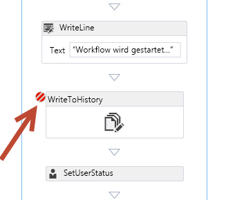
  
    
    
Visual Studio stellt den Workflow in der SharePoint-Zielumgebung bereit und fügt einen Debugger an. Wenn der Workflowprozess die Aktivität mit dem Haltepunkt erreicht, wird Visual Studio wieder aufgerufen, sodass Sie die Werte der Workflowvariablen überprüfen und die einzelnen Aktivitäten über Visual Studio 2012 durchgehen können, wie in der folgenden Abbildung dargestellt.
  
    
    

**Abbildung 2: Workflow-Haltepunkt**

  
    
    

  
    
    
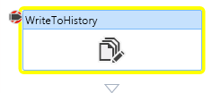
  
    
    

  
    
    

  
    
    

## Debuggen von Workflows mithilfe von Debugmeldungen und des Testdiensthosts

Mit der Einführung von Workflow-Manager in SharePoint 2013-Workflows stehen nun zwei neue Debugoptionen zur Verfügung, wenn Sie benutzerdefinierte Workflows mit Visual Studio 2012 erstellen und sie in einer lokalen Bereitstellung testen. Visual Studio 2012 umfasst eine **WriteLine** -Aktivität, die eine einzelne, zeichenfolgenbasierte Meldung als Eingabe akzeptiert.
  
    
    

**Abbildung 3: WriteLine-Aktivität**

  
    
    

  
    
    
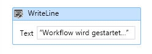
  
    
    
Diese Aktivität schreibt die Meldung, die die **System.Diagnostics.Debug.WriteLine()**-Methode darstellt, in eine standardmäßige .NET-Windows-Konsolenanwendung. Das Workflow-Manager 1.0-Entwicklungstool beinhaltet das Konsolendienstprogramm **Test Service Host**, das von Visual Studio 2012 beim Starten einer neuen Debugsitzung und beim Testen mit einer lokalen SharePoint 2013-Bereitstellung geöffnet wird. Dieses Konsolendienstprogramm, **Microsoft.Workflow.TestServiceHost.exe** in **C:\\Program Files (x86)\\Workflow Manager Tools\\1.0**, wird an die registrierte Workflow-Manager-Instanz angefügt und überwacht Meldungen, die von der **WriteLine**-Aktivität ausgegeben werden, wie in der folgenden Abbildung dargestellt.
  
    
    

**Abbildung 4: Meldungen für WriteLine-Aktivität**

  
    
    

  
    
    
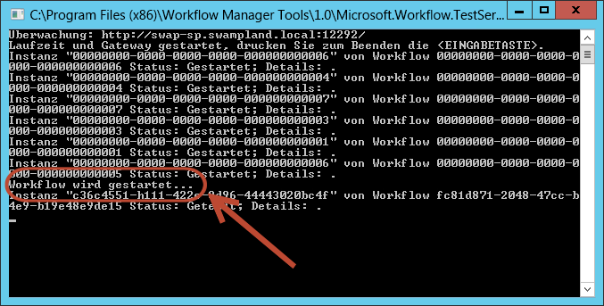
  
    
    
Diese Meldungen sehen aus wie Codekommentare oder Debugmeldungen in einer Konsolenanwendung. Im Gegensatz zum Schreiben in die Workflowverlaufsliste müssen Sie diese nicht entfernen, bevor Sie den Workflow in der Produktionsumgebung bereitstellen. Solange das **Test Service Host**-Dienstprogramm nicht mit Workflow-Manager verbunden ist, sind die Meldungen nicht von Bedeutung.
  
    
    
Diese Debugoption ist nicht für Workflows verfügbar, die mit SharePoint Designer 2013 erstellt wurden, da keine Aktion vorhanden ist, die der **WriteLine**-Aktivität zugeordnet ist. Diese Debugoption steht leider nur für lokale SharePoint 2013-Installationen zur Verfügung, da auf den vom Test Service Host-Dienstprogramm verwendeten Port normalerweise nicht von außerhalb des lokalen Netzwerks öffentlich zugegriffen werden kann. Dies gilt auch für Office 365. Die Ports, die SharePoint für die Verbindung mit Workflow-Manager verwendet, sind die gleichen, die der Test Service Host verwendet. Auf sie kann nur innerhalb des vertrauenswürdigen Netzwerks zugegriffen werden. Dies bedeutet jedoch nicht, dass Sie die Workflows ändern müssen, um **WriteLine**-Aktivitäten vor der Bereitstellung in Office 365 zu entfernen. Diese Aktivitäten können im Workflow verbleiben, da sie nicht sichtbar sind, solange der **Test Service Host** nicht mit Workflow-Manager verbunden ist.
  
    
    

## Debuggen mit Fiddler zum Überwachen des HTTP-Datenverkehrs

Die letzte Debugoption für SharePoint Server 2013-Workflows ist aufgrund der geänderten Funktionsweise von Workflows in der aktuellen Plattform neu für Workflowentwickler hinzugekommen. Wie bereits oben erwähnt, wird in SharePoint Server 2013 die gesamte Workflowverarbeitung an ein externes Produkt, Workflow-Manager 1.0, übergeben. Wenn ein Workflow mit SharePoint kommunizieren muss, um zum Beispiel den aktuellen Status des Workflows zu aktualisieren, Daten aus Elementen oder Benutzer in einer SharePoint-Website zu sammeln oder bei der Arbeit mit Aufgaben, nutzen die Aktivitäten von Workflow Manager hierzu die SharePoint 2013 REST-API. SharePoint kommuniziert mit Workflow-Manager über eine Clientbibliothek, die als Proxy für die von Workflow-Manager verfügbar gemachten REST-Dienste dient. SharePoint 2013 und Workflow-Manager kommunizieren über standardmäßige HTTP- und HTTPS-Protokolle miteinander.
  
    
    
Diese Architektur bietet Workflowerstellern eine neue Debugoption. Mithilfe des HTTP-Debugproxytools Fiddler können Sie alle Anforderungen und die entsprechenden Antworten zwischen den beiden Produkten überwachen. Darüber hinaus können auch alle benutzerdefinierten Dienste, die von den benutzerdefinierten Workflows mit der **HttpSend**-Aktivität in Visual Studio 2012 oder der entsprechenden **Call HTTP Web Service**-Aktion in SharePoint Designer 2013 aufgerufen werden, ebenso mit Fiddler überwacht und geprüft werden. Dieses Debugmodell ist unabhängig von dem Tool verfügbar, das Sie zum Erstellen von benutzerdefinierten Workflows verwenden (SharePoint Designer 2013 oder Visual Studio 2012).
  
    
    
Diese Option steht nur dann nicht zur Verfügung, wenn Sie Workflows mit einer Office 365-Bereitstellung von SharePoint 2013 testen. Da der gesamte Datenverkehr zwischen SharePoint Server 2013 und Workflow-Manager serverseitig verläuft, ist es nicht möglich, eine Verbindung zu einem der Server in Office 365 herzustellen und Fiddler von der Konsole aus zu starten.
  
    
    
Diese Option bietet eine Transparenz und Einblicke in das Workflowmodul, die beim Entwickeln von Workflows in SharePoint-Versionen vor SharePoint Server 2013 nicht möglich waren.
  
    
    
So können Sie zum Beispiel die unformatierten Antworten sehen, die von Workflow-Manager oder SharePoint Server 2013 in einem Webdienstaufruf zurückgegeben werden. In einigen Fällen antwortet Workflow-Manager möglicherweise mit einer bestimmten Fehlermeldung. SharePoint Server 2013 verwendet benutzerfreundliche Fehlermeldungen, die möglicherweise jedoch nicht spezifisch genug sind. Mit Fiddler werden die genauen Fehlermeldungen angezeigt, die Sie beim Beheben des Problems unterstützen.
  
    
    
Ein anderer Anwendungsfall ist das Untersuchen der Antwort eines erfolgreichen Webdienstaufrufs. Wenn Sie Webdienste in Workflows verwenden, müssen Sie unabhängig vom Erstellungstool den genauen Eigenschaftennamen (und den Pfad, wenn es sich um eine komplexe Antwort handelt) für einen in einer Antwort enthaltenen Wert kennen. Mit Fiddler werden Ihnen die gesamten Antwortdaten angezeigt.
  
    
    

### Grundlegendes zu SharePoint und Workflow Manager für das Debuggen mit Fiddler

Um Workflows in SharePoint 2013 und Workflow-Manager 1.0 mit Fiddler debuggen zu können, müssen Sie vor dem Debuggen in einer Entwicklungsumgebung einige Konfigurations- und Einrichtungsschritte durchführen. Bevor Sie diese Schritte durchführen, ist es nützlich, die Funktionsweise von Fiddler sowie die Funktionsweise von Workflows in SharePoint 2013 zu kennen.
  
    
    

#### Fiddler kann nur Datenverkehr vom lokalen Server überprüfen

Fiddler kann nur solchen Datenverkehr abfangen und überprüfen, bei dem es sich Anfoderungen handelt, die von dem lokalen Server ausgehen, auf dem Fiddler gestartet wurde. Dies kann schwierig sein, wenn Fiddler als Debugtool für SharePoint Server 2013-Workflows verwendet werden soll.
  
    
    
Wenn SharePoint Server 2013 und Workflow-Manager 1.0 auf unterschiedlichen Servern installiert sind und Fiddler von SharePoint Server gestartet wird, zeigt Fiddler nur den Datenverkehr an, wenn die Anforderung von SharePoint ausging. Der Datenverkehr, der von Workflow-Manager 1.0 ausgeht, wird nicht abgefangen, selbst wenn sein Ziel SharePoint Server ist.
  
    
    
Daher ist es beim Entwickeln von Workflows einfacher, sie zu debuggen, wenn sowohl SharePoint Server 2013 und Workflow-Manager 1.0 auf demselben Server installiert sind. Beachten Sie, dass dies keine Voraussetzung ist. Sie können Fiddler sowohl auf SharePoint Server- als auch Workflow-Manager-Servern starten, wobei es jedoch komplizierter ist, zwei Instanzen auf zwei Servern für den gleichen Workflowprozess zu überwachen.
  
    
    

#### Fiddler kann nur Datenverkehr des aktuell angemeldeten Benutzers überprüfen

Fiddler kann nur den Datenverkehr des aktuell angemeldeten Benutzers abfangen und den Datenverkehr dieses Benutzers überprüfen. Um von SharePoint ausgehenden Datenverkehr anzuzeigen, müssen Sie sich bei SharePoint Server mit dem Windows-Konto anmelden, das als Identität für den Anwendungspool konfiguriert ist, der die Webanwendung für die SharePoint-Website hostet, von der der Workflow ausgeht.
  
    
    
Dies gilt auch für Workflow-Manager. Um von Workflow-Manager ausgehenden Datenverkehr abfangen und überprüfen zu können, müssen Sie sich mit der Windows-Identität anmelden, die bei der Bereitstellung der Workflow-Manager-Farm als Dienstkonto für Workflow-Manager konfiguriert wurde.
  
    
    
Bei der Verwendung von Fiddler zum Debuggen von Workflows ist das Debuggen nicht nur dann einfacher, wenn Workflow-Manager und SharePoint Server 2013 auf demselben Server installiert und konfiguriert sind, sondern wenn sie auch die gleiche Windows-Identität wie das Dienstkonto verwenden. Der gesamte Datenverkehr von Workflow-Manager und SharePoint Server 2013 kann von Fiddler abgefangen und überprüft werden.
  
    
    

#### SharePoint muss dem Fiddler-Zertifikat vertrauen

Bevor Sie Fiddler zum Debuggen von SharePoint Server 2013-Workflows verwenden, müssen Sie wissen, wie verschlüsselter Datenverkehr gehandhabt wird. Verschlüsselter Datenverkehr über HTTP, als „HTTPS" bezeichnet, wird implementiert, indem mit dem privaten Schlüssel eines Zertifikats Daten verschlüsselt und dann an einen anderen Empfänger gesendet werden. Der Empfänger verfügt über den öffentlichen Schlüssel des Zertifikats, der mit dem privaten Schlüssel gekoppelt ist. Wenn der Empfänger einen Anforderung erhält, kann der Empfänger sicherstellen, dass die Anforderung von dem Absender stammt, da die Signatur des verschlüsselten Inhalts dem öffentlichen Schlüssel entspricht. Dies kann nur dann der Fall sein, wenn die Verschlüsselung durch den privaten Schlüssel des Zertifikats erfolgt ist.
  
    
    
Fiddler kann HTTPS-Datenverkehr abfangen und so zur Entschlüsselung konfiguriert werden, dass der Datenverkehr in einem lesbaren Format zur Überprüfung im Tool vorliegt. Nach dem Anzeigen der Anforderung verwendet Fiddler dann ein eigenes Zertifikat, um den Datenverkehr erneut zu verschlüsseln und an den entsprechenden Empfänger zu senden. Dies kann jedoch problematisch sein, da der Empfänger zwar die ursprüngliche Antwort erhalten hat, diese jedoch nicht mehr durch das Zertifikat des ursprünglichen Absenders gesichert ist. Dies kann beim Debuggen von SharePoint-Workflows ein Problem verursachen, da das Fiddler-Zertifikat von SharePoint nicht als vertrauenswürdig eingestuft wird. Um Fiddler zum Abfangen und Überprüfen von HTTPS-Datenverkehr zwischen SharePoint Server 2013 und Workflow-Manager verwenden zu können, muss das Fiddler-Zertifikat von SharePoint als vertrauenswürdig eingestuft werden.
  
    
    

### Konfigurieren von SharePoint Server 2013 und Workflow Manager 1.0 für das Workflowdebugging mit Fiddler

In den folgenden Abschnitten wird erläutert, wie Sie Fiddler und SharePoint für das Workflowdebugging konfigurieren.
  
    
    

#### .NET Framework-Standardproxykonfiguration konfigurieren

Als ersten Schritt müssen Sie die Standardproxykonfiguration für .NET Framework definieren. Durch diese Änderungen wird es Fiddler ermöglicht, den von SharePoint Server 2013 und Workflow-Manager ausgehenden Datenverkehr abzufangen und zu überprüfen. Öffnen Sie die **machine.config**-Datei an den beiden folgenden Speicherorten:
  
    
    

-  `%systemdrive%\\Windows\\Microsoft.NET\\Framework\\v4.0.30319\\Config\\machine.config`
    
  
-  `%systemdrive%\\Windows\\Microsoft.NET\\Framework64\\v4.0.30319\\Config\\machine.config`
    
  
Fügen Sie als Nächstes das folgende Markup unten in jeder Datei hinzu, bevor Sie das **<configuration>**-Element schließen:
  
    
    


```

<system.net>
  <defaultProxy enabled="true">
    <proxy bypassonlocal="false" usesystemdefault="true" />
  </defaultProxy>
</system.net>
```

Speichern Sie die Änderungen, und schließen Sie die Dateien.
  
    
    

#### Fiddler zum Abfangen und Überprüfen von HTTPS-Datenverkehr konfigurieren

Als Nächstes müssen Sie Fiddler zum Abfangen von verschlüsseltem Datenverkehr und zum Entschlüsseln konfigurieren.
  
    
    

1. Starten Sie Fiddler.
    
  
2. Wenn Sie die lokale HOSTS-Datei verwenden, stellen Sie sicher, dass die Einträge in Fiddler enthalten sind. Wählen Sie hierzu die Menüoption **Tools -> HOSTS**.
    
  
3. Aktivieren Sie die Option **Enable remapping of requests for one host to a different host or IP, overriding DNS**,
    
  
4. Klicken Sie auf **Import Windows Hosts File**, und klicken Sie dann auf **Save**.
    
  

**Abbildung 5: Hostneuzuordnung**

  
    
    

  
    
    
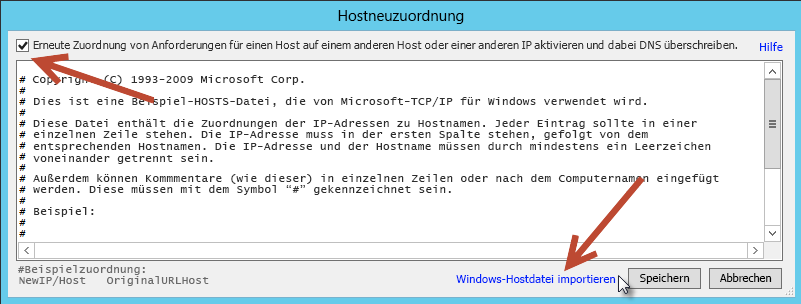
  
    
    
Als Nächstes konfigurieren Sie die Verbindungsoptionen von Fiddler.
  
    
    

  
    
    

1. Wählen Sie die Menüoption **Tools -> Fiddler Options**.
    
  
2. Klicken Sie auf die Registerkarte **Verbindungen**.
    
  
3. Heben Sie die Auswahl von **Chain to upstream gateway proxy** auf.
    
  
4. Wählen Sie die Optionen **Act as system proxy on startup** und **Monitor all connections** aus, wie in der folgenden Abbildung dargestellt.
    
   **Abbildung 6: Fiddler-Verbindungsoptionen**

  

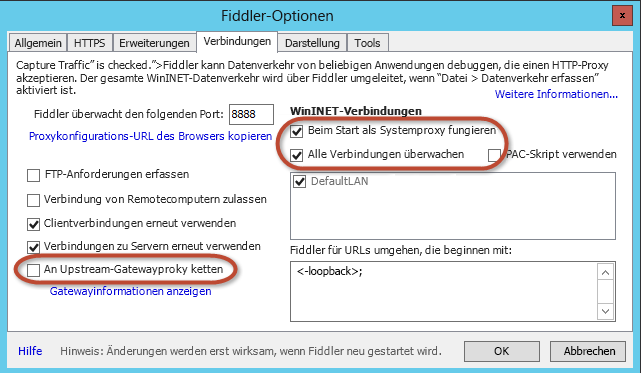
  

  

  
5. Wählen Sie die Registerkarte **HTTPS** im Dialogfeld **Fiddler Options**.
    
  
6. Aktivieren Sie das Kontrollkästchen **Capture HTTPS CONNECTs**.
    
  
7. Wählen Sie **Decrypt HTTPS Traffic**.
    
  
8. Wählen Sie **… from all processes**.
    
  
9. Aktivieren Sie das Kontrollkästchen **Ignore server certificate errors**.
    
  
10. Klicken Sie auf **Export Root Certificate to Desktop**.
    
  
11. Wenn eine Warnmeldung angezeigt wird, klicken Sie auf **Yes**, um **Trust the Fiddler Root certificate** zu bestätigen.
    
  
Hierdurch wird das Zertifikat in Windows als vertrauenswürdig konfiguriert, obwohl es in SharePoint noch nicht als vertrauenswürdig eingestuft wird.
  
    
    

**Abbildung 7: HTTPS-Registerkarte**

  
    
    

  
    
    
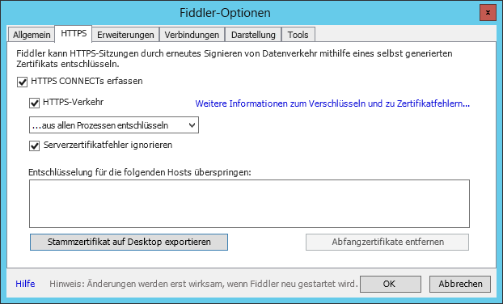
  
    
    
 **Hinweis**: Wenn eine Sicherheitswarnung angezeigt wird, dass dem Fiddler-Zertifikat nicht vertraut werden sollte, klicken Sie auf **Ja**, um mit der Installation des Zertifikats fortzufahren.
  
    
    

#### SharePoint konfigurieren, das Zertifikat als vertrauenswürdig einzustufen

Als letzten Schritt müssen Sie SharePoint so konfigurieren, dass das im vorherigen Schritt exportierte Fiddler-Zertifikat als vertrauenswürdig eingestuft wird.
  
    
    

1. Melden Sie sich als Farmadministrator bei SharePoint an.
    
  
2. Starten Sie die SharePoint 2013-Verwaltungsshell.
    
  
3. Ladne Sie das SharePoint 2013-Snap-In.
    
  ```
  
PS C:\\> Add-PSSnapIn Microsoft.SharePoint.PowerShell
  ```

4. Installieren Sie mithilfe des Zertifikatdienstprogramms das Fiddler-Zertifikat.
    
  ```
  PS C:\\> $fidderCertificatePath = [full path to exported FiddlerRoot.cer certificate file]
PS C:\\> certutil.exe -addstore -enterprise -f -v root $fidderCertificatePath
PS C:\\> $fiddlerCertificate = Get-PfxCertificate -FilePath $fidderCertificatePath
PS C:\\> New-SPTrustedRootAuthority -Name "Fiddler" -Certificate $fiddlerCertificate

  ```

5. Führen Sie IISRESET aus, um sicherzusstellen, dass SharePoint die Änderung hinsichtlich der Vertrauenswürdigkeit des Zertifikats übernommen hat.
    
  

### Exemplarische Vorgehensweise: Debuggen eines SharePoint 2013-Workflows mit Fiddler

Diese einfache exemplarische Vorgehensweise veranschaulicht die Verwendung von Fiddler zum Debuggen eines SharePoint Server 2013-Workflows, der mit Visual Studio 2012 erstellt wurde. Beim Starten des Workflows wird eine Kunden-ID aus einem Feld in einer benutzerdefinierten Liste abgerufen. Anhand dieser Kunden-ID wird ein öffentlich zugänglicher Dienst abgefragt, um weitere Details über den Kunden abzurufen. Der Workflow verwendet dann diese Werte, um das ursprüngliche Listenelement zu aktualisieren. Sie finden den Workflow im folgenden MSDN-Codebeispiel:  [SharePoint 2013 Workflow: Call an External Web Service](http://code.msdn.microsoft.com/officeapps/SharePoint-2013-workflow-48ea87d4.aspx).
  
    
    
Für diese exemplarische Vorgehensweiese gelten die folgenden Voraussetzungen:
  
    
    

- SharePoint Server 2013 und Workflow-Manager 1.0 müssen auf dem gleichen Server installiert sein.
    
  
- Die Windows-Identität **CONTOSO\\SP_Content** ist für die Anwendungspoolidentität konfiguriert, die die Webanwendung für die SharePoint-Website hostet, von der der Workflow gestartet wird.
    
  
- Die SharePoint Server 2013-Website, von der der Workflow gestartet wird, ist **http://intranet.contoso.com**
    
  
- Der Workflow-Manager 1.0-Farmendpunkt ist **w15sp.contoso.com**.
    
  
- SharePoint Server 2013 und Workflow-Manager 1.0 sind so konfiguriert, dass sie OAuth über HTTP zulassen.
    
    > **VORSICHT**
      > Die sollte nie auf einem Produktionsserver durchgeführt werden, sondern nur zum Testen und Debuggen. 

1. Melden Sie sich bei dem Server an, auf dem Workflow Manager und SharePoint 2013 installiert sind, wobei die Windows-Identität als Workflow-Manager 1.0-Farmkonto und SharePoint 2013-Anwendungspoolidentität konfiguriert ist.
    
  
2. Starten Sie Fiddler. Fiddler fängt nun den Datenverkehr vom aktuellen Benutzer ab. Wenn bereits Verbindungen vorhanden sind oder Prozesse ausgeführt werden, werden diese möglicherweise nicht von Fiddler abgefangen, da Fiddler beim Herstellen der Verbindungen noch nicht ausgeführt wurde. Um sowohl Workflow Manager als auch den SharePoint-Server zurückzusetzen und zu veranlassen, dass ihr Datenverkehr von Fiddler abgefangen wird, setzen Sie SharePoint mit IISRESET zurück, und setzen Sie Workflow Manager zurück, indem Sie den Windows-Dienst **Workflow Manager Backend** anhalten und neu starten. Verwenden Sie hierzu die folgenden beiden Befehle an einer administrativen Eingabeaufforderung.
    
  ```
  
PS C:\\> IISRESET
PS C:\\> net stop WorkflowServiceBackend
PS C:\\> net start WorkflowServiceBackend

  ```

3. Starten Sie den Workflow.
    
  
Beachten Sie in der Abbildung unten, dass die Sitzungen 18-36 von SharePoint 2013 stammen und die Sitzungen 37-43 von Workflow-Manager.
  
    
    

**Abbildung 8: Starten des Workflows**

  
    
    

  
    
    
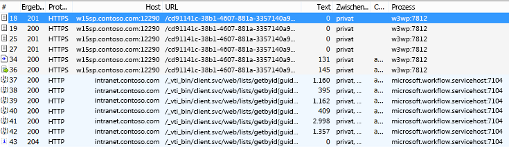
  
    
    
Beachten Sie in Sitzung 36, dass SharePoint Server 2013 eine Anforderung an Workflow-Manager zum Starten eines Workflows richtet (in der Abbildung durch [A] gekennzeichnet). Workflow-Manager antwortet mit einer Erfolgsmeldung (in der Abbildung durch [B] gekennzeichnet):
  
    
    

**Abbildung 9: Erfolgsmeldung**

  
    
    

  
    
    
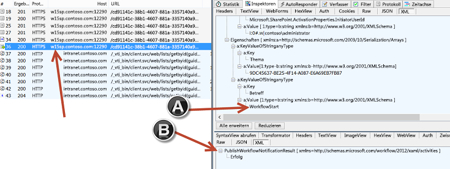
  
    
    
In Sitzung 40 ruft Workflow-Manager die Listenelement-ID und -GUID von SharePoint ab.
  
    
    

**Abbildung 11: Abrufen der ID und GUID des Elements**

  
    
    

  
    
    
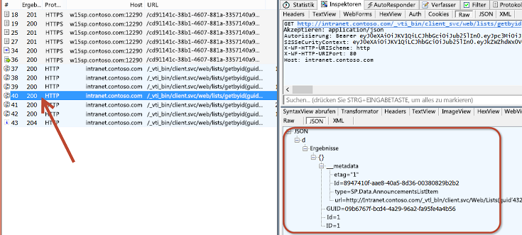
  
    
    
In Sitzung 43 aktualisiert Workflow-Manager das Listenelement in SharePoint mit einem neuen Wert für das Feld **Body** des Ankündigungselements, indem er ein JavaScript Object Notation (JSON)-Objekt (in der Abbildung durch [A] gekennzeichnet) als Nutzlast weitergibt. SharePoint antwortet mit dem HTTP-Status 204, der darauf hinweist, dass die Anforderung erfolgreich verarbeitet wurde. Die Antwort enthält jedoch keine Meldung.
  
    
    

**Abbildung 11: Aktualisieren des Listenelements**

  
    
    

  
    
    
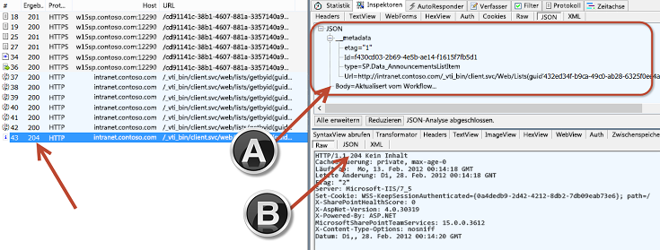
  
    
    

  
    
    

  
    
    

## Schlussbemerkung

In der Version SharePoint Server 2013 wurde für Workflows eine neue Abstraktionsebenen eingeführt: Workflow-Manager 1.0. Diese neue Architektur veränderte die Art und Weise, in der Workflows verarbeitet werden. SharePoint Server 2013 überlässt jetzt Workflow-Manager 1.0 die gesamte Workflowverarbeitung und -verwaltung.
  
    
    
Eine Aufgabe, die Sie beim Erstellen benutzerdefinierter Anwendungen und Geschäftsprozesse in Workflows durchführen müssen, ist das Debuggen Ihrer Arbeit. Die neue Workflowarchitektur von SharePoint Server 2013 bietet die gleichen Debugoptionen wie frühere Versionen von SharePoint. Die neue Architektur bietet jedoch zwei neue Optionen beim Erstellen benutzerdefinierter Workflows mithilfe dieser Architektur. In diesem Artikel wurden sowohl die älteren als auch die neuen Debugoptionen, die durch die **WriteLine**-Aktivität zur Verfügung stehen, erläutert. Außerdem wurde die Verwendung von Fiddler zum Abfangen und Überprüfen von Datenverkehr zwischen SharePoint Server 2013 und Workflow-Manager 1.0 erläutert.
  
    
    

## Weitere Ressourcen
<a name="bk_addresources"> </a>


-  [Fiddler](http://fiddler2.com/home)
    
  

  
    
    

