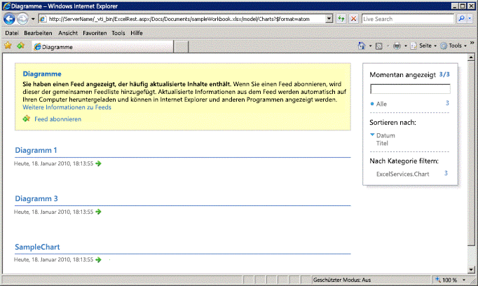
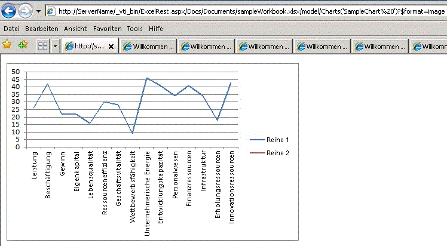

# Ermittlung in der Excel Services-REST-API

In diesem Thema werden die Ermittlungsmechanismen behandelt, die in die Excel Services-REST-API integriert sind.
  
    
    


> **HINWEIS**
> Excel Services REST-API gilt für SharePoint 2013 und SharePoint 2016 lokale. Verwenden Sie die Excel-REST-APIs, die Teil des Endpunkts  [Microsoft Graph](http://graph.microsoft.io/en-us/docs/api-reference/v1.0/resources/excel
) sind für Office 365 Education, Geschäfts- und Enterprise-Konten.
  
    
    


## Basis-URL und Beispiel für die Ermittlung

Mithilfe der Ermittlung können Entwickler und Benutzer Informationen über und den Inhalt einer Arbeitsmappe manuell oder programmgesteuert ermitteln. Der Ermittlungsmechanismus stellt den  [Atom](http://tools.ietf.org/html/rfc4287)-Feed bereit, der Informationen über die Ressourcen in einer Arbeitsmappe enthält. Sie können mithilfe der Ermittlung die Ressourcen in der Arbeitsmappe erkunden und anzeigen. Hierzu gehören Bereiche, Diagramme, Tabellen und PivotTables.
  
    
    
Im Folgenden das Konstrukt der REST-URL zu einem einzelnen Element in einer Arbeitsmappe:
  
    
    


```

http://<ServerName>/_vti_bin/ExcelRest.aspx/<DocumentLibrary>/<FileName>/<ResourceLocation>
```

Wie im Thema  [Grundlegende URI-Struktur und Pfad](basic-uri-structure-and-path.md) beschrieben, sehen Sie im Folgenden die REST-URL für den Zugriff auf die Arbeitsmappe **sampleWorkbook.xlsx** und die Anzeige des Diagramms **SampleChart**: 
  
    
    


```
http://<ServerName>/_vti_bin/ExcelRest.aspx/Docs/Documents/sampleWorkbook.xlsx/model/Charts('SampleChart')
```

Zum Starten und Erkunden der Ressourcen in der Arbeitsmappe und zum Anzeigen der Ressourcen mithilfe der Ermittlung navigieren Sie mithilfe einer URL, die folgendem Beispiel entspricht, zur Modellseite:
  
    
    


```
http://<ServerName>/_vti_bin/ExcelRest.aspx/<DocumentLibrary>/<FileName>/model
```

Wird die Beispielarbeitsmappe **sampleWorkbook.xlsx** verwendet, lautet der URI wie folgt:
  
    
    


```
http://<ServerName>/_vti_bin/ExcelRest.aspx/Docs/Documents/sampleWorkbook.xlsx/model
```

Im Folgenden ein Screenshot der Modellseite.
  
    
    

**Excel Services REST-Modell-URL**

  
    
    

  
    
    

  
    
    
Die URL zur Modellseite ist der Ausgangspunkt der Ermittlung. Auf der Modellseite werden vier Ressourcenauflistungen angezeigt, die derzeit von der Excel Services-REST-API unterstützt werden. Die Ressourcenauflistungen sind Bereiche, Diagramme, Tabellen oder PivotTables. Sie können diese Ressourcen in einer bestimmten Arbeitsmappe erkunden, indem Sie auf der Modellseite auf **Bereiche**, **Diagramme**, **Tabellen** oder **PivotTables** klicken.
  
    
    
Wenn Sie beispielsweise mithilfe der Ermittlung auf das Diagramm in der Arbeitsmappe zugreifen möchten, führen Sie folgende Schritte aus:
  
    
    

  
    
    

1. Klicken Sie auf der Modellseite auf **Diagramme**. Durch Klicken auf den Link **Diagramme** gelangen Sie zu einem weiteren Atom-Feed. Dieser Feed listet alle Diagramme auf, die in der Arbeitsmappe **sampleWorkbook.xlsx** verfügbar sind. Die Arbeitsmappe **sampleWorkbook.xlsx** enthält drei Diagramme: **Chart 1**, **Chart 3** und **SampleChart**. Daher werden drei Diagrammnamen angezeigt, wie im folgenden Screenshot zu sehen ist.
    
   **Ermittlung von Excel Services REST-Diagrammliste**

  


  

  

  
2. Klicken Sie auf der Modellseite auf **SampleChart**. Dadurch wird das Diagramm namens **SampleChart** angezeigt, das sich in der Arbeitsmappe **sampleWorkbook.xlsx** befindet, wie im folgenden Screenshot gezeigt.
    
   **Anzeigen von Diagrammen mit REST**

  


  

  

  
3. Auf gleiche Weise wird durch Klicken auf **Chart 1** oder **Chart 3** das entsprechende Diagramm angezeigt. Wenn Sie auf **SampleChart** klicken, wird zur tatsächlichen URL des Diagramms navigiert. Im Folgenden die URL zum **SampleChart**-Bild (wie im folgenden Screenshot gezeigt):
    
  ```
  http://<ServerName>/_vti_bin/ExcelRest.aspx/Docs/Documents/sampleWorkbook.xlsx/model/Charts('SampleChart%20')?$format=image
  ```


## Atom-Feed

Mithilfe des von der REST-API bereitgestellten  [Atom](http://tools.ietf.org/html/rfc4287)-Feeds können Sie einfacher auf die Daten zugreifen ,die für Sie von Interesse sind. Wenn Sie die Quelle der Webseite anzeigen, erhalten Sie den XML-Code. Ein Beispiel aus den Diagrammen in **sampleWorkbook.xlsx** sehen Sie unten.
  
    
    
Wie aus dem XML-Code ersichtlich ist, enthält der Feed überquerbare Elemente, anhand derer der Code ermitteln kann, welche Elemente in der Arbeitsmappe vorhanden sind. Jeder Atom-Eintrag entspricht einem Diagramm, auf das Sie zugreifen können. Dieser Mechanismus gilt in gleicher Weise für die Ermittlung von Bereichen, Tabellen und PivotTables.
  
    
    


```XML
<?xml version="1.0" encoding="utf-8" standalone="yes"?>
<feed xmlns="http://www.w3.org/2005/Atom" xmlns:x="http://schemas.microsoft.com/office/2008/07/excelservices/rest" xmlns:d="http://schemas.microsoft.com/ado/2007/08/dataservice" xmlns:m="http://schemas.microsoft.com/ado/2007/08/dataservices/metadata">
  <title type="text">Charts</title>
  <id>http://ServerName/_vti_bin/ExcelRest.aspx/Docs/Documents/sampleWorkbook.xlsx/model/Charts</id>
  <updated>2010-01-19T19:32:53Z</updated>
  <author>
    <name />
  </author>
  <link rel="self" href="http://ServerName/_vti_bin/ExcelRest.aspx/Docs/Documents/sampleWorkbook.xlsx/model/Charts?$format=atom" title="Charts" />
  <entry>
    <category term="ExcelServices.Chart" scheme="http://schemas.microsoft.com/ado/2007/08/dataservices/scheme" />
    <title>Chart 1</title>
    <id>http://ServerName/_vti_bin/ExcelRest.aspx/Docs/Documents/sampleWorkbook.xlsx/model/Charts('Chart%201')</id>
    <updated>2010-01-19T19:32:53Z</updated>
    <author>
      <name />
    </author>
    <link rel="alternate" title="Chart 1" href="http://ServerName/_vti_bin/ExcelRest.aspx/Docs/Documents/sampleWorkbook.xlsx/model/Charts('Chart%201')?$format=image" />
    <content type="image/png" src="http://ServerName/_vti_bin/ExcelRest.aspx/Docs/Documents/sampleWorkbook.xlsx/model/Charts('Chart%201')?$format=image" />
  </entry>
  <entry>
    <category term="ExcelServices.Chart" scheme="http://schemas.microsoft.com/ado/2007/08/dataservices/scheme" />
    <title>Chart 3</title>
    <id>http://ServerName/_vti_bin/ExcelRest.aspx/Docs/Documents/sampleWorkbook.xlsx/model/Charts('Chart%203')</id>
    <updated>2010-01-19T19:32:53Z</updated>
    <author>
      <name />
    </author>
    <link rel="alternate" title="Chart 3" href="http://ServerName/_vti_bin/ExcelRest.aspx/Docs/Documents/sampleWorkbook.xlsx/model/Charts('Chart%203')?$format=image" />
    <content type="image/png" src="http://ServerName/_vti_bin/ExcelRest.aspx/Docs/Documents/sampleWorkbook.xlsx/model/Charts('Chart%203')?$format=image" />
  </entry>
  <entry>
    <category term="ExcelServices.Chart" scheme="http://schemas.microsoft.com/ado/2007/08/dataservices/scheme" />
    <title>SampleChart </title>
    <id>http://ServerName/_vti_bin/ExcelRest.aspx/Docs/Documents/sampleWorkbook.xlsx/model/Charts('SampleChart%20')</id>
    <updated>2010-01-19T19:32:53Z</updated>
    <author>
      <name />
    </author>
    <link rel="alternate" title="SampleChart" href="http://ServerName/_vti_bin/ExcelRest.aspx/Docs/Documents/sampleWorkbook.xlsx/model/Charts('SampleChart%20')?$format=image" />
    <content type="image/png" src="http://ServerName/_vti_bin/ExcelRest.aspx/Docs/Documents/sampleWorkbook.xlsx/model/Charts('SampleChart%20')?$format=image" />
  </entry>
</feed>
```


## Siehe auch


#### Konzepte


  
    
    
 [Ressourcen-URI für die REST API in Excel Services](resources-uri-for-excel-services-rest-api.md)
