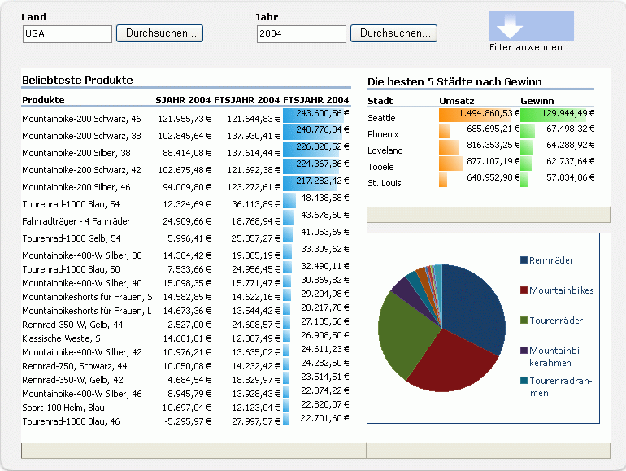

# Excel Services (Übersicht)

Excel Services ist eine Dienstanwendung, mit der Sie Microsoft Excel-Arbeitsmappen in Microsoft SharePoint 2013 laden, berechnen und anzeigen können. Excel Services wurde in Microsoft Office SharePoint Server 2007 eingeführt.
  
    
    

Mit Excel Services können Excel-Arbeitsmappen auf SharePoint 2013-Portalen und -Dashboards wiederverwendet und gemeinsam genutzt werden. Beispielsweise können Finanzanalysten, Unternehmensplaner oder Ingenieure Inhalte in Excel erstellen und für andere Benutzer über ein SharePoint 2013-Portal und -Dashboard freigeben, ohne benutzerdefinierten Code zu schreiben. Sie können bestimmen, welche Daten angezeigt werden, und können eine einzige Version Ihrer Excel-Arbeitsmappe verwalten. 
Es gibt vier primäre Schnittstellen für Excel Services: 
  
    
    

- Ein Excel Web Access-Webpart, mit dem Sie eine aktive Arbeitsmappe in einem Browser anzeigen und mit dieser kommunizieren können 
    
  
- Excel Web Services für den programmgesteuerten Zugriff
    
  
- Ein ECMAScript (JavaScript, JScript)-Objektmodell zum Automatisieren, Anpassen und Steuern des Excel Web Access-Steuerelements, um das Erstellen ansprechender, integrierter Lösungen zu unterstützen, und mit der Möglichkeit, das ECMAScript (JavaScript, JScript)-Objektmodell um benutzerdefinierte Funktionen zu erweitern
    
  
- Eine REST-API (Representational State Transfer) für den direkten Zugriff auf Arbeitsmappenkomponenten über eine URL
    
  

> **HINWEIS**
> Das Feature für die interaktive Excel-Ansicht wurde deaktiviert. Informationen zum Entfernen des Features von Ihrer Website finden Sie unter  [Interaktive Excel-Ansicht entfernen aus einer Webseite](removing-excel-interactive-view-from-a-webpage.md). 
  
    
    

Zudem können Sie Dienste für Excel-Berechnungen mithilfe von benutzerdefinierten Funktionen (User-Defined Functions, UDFs) erweitern.
> **HINWEIS**
> Weitere Informationen zu Dienste für Excel-Berechnungen finden Sie unter  [Excel Services-Architektur](excel-services-architecture.md). 
  
    
    

Mit Excel Services können Sie interaktive Live-Arbeitsmappen lediglich mithilfe eines Browsers anzeigen. Das heißt, Sie können Excel-Arbeitsmappen speichern und damit auf Portalwebsites interagieren.Darüber hinaus können Sie mit Excel-basierten Daten interagieren, indem Sie PivotTables sortieren, filtern, erweitern oder reduzieren und indem Sie Parameter übergeben. Dies ermöglicht das Analysieren von veröffentlichten Arbeitsmappen. Sie können mit einer Arbeitsmappe interagieren, ohne die veröffentlichte Arbeitsmappe zu ändern. Dies ist für Berichtsautoren und Berichtsconsumer hilfreich.Excel Services unterstützt Arbeitsmappen, die mit externen Datenquellen verbunden sind. Sie können Verbindungszeichenfolgen für externe Datenquellen in die Arbeitsmappe einbetten oder die Verbindungszeichenfolgen zentral in einer Datenverbindungsbibliothek-Datei speichern.Darüber hinaus können Zellen in Arbeitsmappen bearbeitbar gemacht werden, indem sie als benannte Bereiche (Parameter) festgelegt werden. Elemente, die Sie beim Speichern in Excel Services als sichtbar festlegen, werden im Bereich **Parameter** in Excel Web Access angezeigt. Sie können die Werte dieser benannten Bereiche im Bereich **Parameter** ändern und die Arbeitsmappe aktualisieren. Außerdem können Sie mit dem Filter-Webpart des Portals mehrere Webparts (Excel Web Access-Webparts und andere Arten von Webparts) gemeinsam filtern.Es ist jedoch nicht möglich, mit Excel Services neue Arbeitsmappen zu erstellen oder vorhandene Arbeitsmappen zu bearbeiten. Verwenden Sie Microsoft Excel 2013, um eine Arbeitsmappe für die Verwendung mit Excel Services zu erstellen.
> **HINWEIS**
> Microsoft Excel Online ist im Lieferumfang von Office Online enthalten und unterstützt auch Excel-Arbeitsmappen im Browser. Weitere Informationen zu Excel Online finden Sie unter  [Erste Schritte mit dem neuen Office](http://office.microsoft.com/de-de/support/getting-started-with-office-2013-FX102809998.aspx). 
  
    
    

Excel Services weist auch einen Webdienst auf. Mit Excel Web Services können Sie Arbeitsmappen laden, Werte in Zellen und Bereichen festlegen, externe Datenverbindungen aktualisieren, Arbeitsmappen berechnen und berechnete Ergebnisse extrahieren (einschließlich Zellwerten, der gesamten berechneten Arbeitsmappe oder einer Momentaufnahme der Arbeitsmappe). In SharePoint 2013 können Sie mit Excel Web Services auch speichern, eine Kopie speichern und an gemeinsamen Bearbeitungssitzungen teilnehmen.
> **HINWEIS**
> Weitere Informationen zu Momentaufnahmen finden Sie unter  [How to: Get an Entire Workbook or a Snapshot](how-to-get-an-entire-workbook-or-a-snapshot.md). 
  
    
    

Excel Services unterstützt UDFs, mit denen Sie den Funktionsumfang von Dienste für Excel-Berechnungen erweitern können. Beispielsweise, um benutzerdefinierte Berechnungsbibliotheken zu implementieren oder um Daten in Webdiensten und Datenquellen zu lesen, die systemintern von Excel Services nicht unterstützt werden.Excel Services wurde als skalierbarer, leistungsfähiger Enterprise-Server entwickelt, der Feature- und Berechnungsgenauigkeit mit Excel bietet.
## Szenarien und Features

Excel Services unterstützt viele verschiedenen Szenarien und Features, von denen einige in diesem Abschnitt beschrieben werden. 
  
    
    

### Business Intelligence-Portal und Arbeitsmappenanalyse

In einem Business Intelligence-Portal werden Scorecards und Berichte angezeigt, und Benutzer können Daten lediglich mit einem Browser anzeigen. Das **Business Intelligence Center**-Feature in SharePoint Server weist ein Business Intelligence-Portal und Dashboardfunktionen auf. In Abbildung 1 ist ein Berichtscenterdashboard mit einer Berichtsbibliothek, einem Diagramm und bereits eingerichteten Key Performance Indicators (KPIs) dargestellt.
  
    
    
Mit Excel Services können Sie auch Daten auf dem Server berechnen. Excel Services ist am **Business Intelligence Center** beteiligt, indem es die Möglichkeit bietet, Excel-basierte Inhalte in integrierten BI-Dashboards zu berechnen und verfügbar zu machen. Sie können eine Excel-Arbeitsmappe mithilfe des Excel Web Access-Webparts anzeigen, eine Verbindung mit externen Datenquellen herstellen und mit den Daten in der Arbeitsmappe weiter interagieren.
  
    
    
 In Abbildung 1 sehen Sie ein Dashboard mit einem Filter-Webpart sowie Excel-Arbeitsmappen, die mithilfe der Excel Web Access-Webparts angezeigt werden.
  
    
    

**Abbildung 1. Dashboard mit Filter und Excel-Inhalt**

  
    
    

  
    
    

  
    
    
Neben der Beteiligung an integrierten Dashboards können mit Excel Services auch Excel-Arbeitsmappen vollständig oder teilweise angezeigt werden, damit Benutzer mit diesem Inhalt in der vertrauten Excel-Benutzeroberfläche interagieren können. In Abbildung 2 sehen Sie einen dargestellten Bereich und Zellen, die für die Benutzereingabe über Parameter verfügbar gemacht werden. Durch die Festlegung bestimmter Zellen als Parameter können Benutzer mithilfe der Bearbeitungsfelder im rechten Bereich Werte in diesen Zellen einer Arbeitsmappe ändern. Die Arbeitsmappe wird dann von Excel Services anhand der neuen Werte neu berechnet.
  
    
    
Wenn Sie bestimmte Funktionen in Excel verwenden oder eine Arbeitsmappe mithilfe aller Excel-Funktionen analysieren möchten, können Sie durch Klicken auf **In Excel öffnen** eine Arbeitsmappe in Excel öffnen. Eine Arbeitsmappe können Sie auch in Excel öffnen, um sie zu drucken und um offline zu arbeiten.
  
    
    

    
> **HINWEIS**
> Zum Öffnen einer Arbeitsmappe mit dem Befehl **In Excel öffnen** benötigen Sie das Recht zum Öffnen. Weitere Informationen finden Sie im nächsten Abschnitt, **Verwalten von Arbeitsmappen**, und unter  [Benutzerberechtigungen und Berechtigungsstufen](http://technet.microsoft.com/de-de/library/cc721640.aspx) im [TechNet](http://technet.microsoft.com/de-de/library/cc263215.aspx). Benutzer ohne das Recht zum Öffnen können weiterhin eine Momentaufnahme in Excel öffnen. 
  
    
    

**Abbildung 2. Verwenden des Parameterbereichs**

  
    
    

  
    
    

  
    
    
Mit Excel Web Access können Sie auch Daten analysieren, pivotieren und mit diesen interagieren.
  
    
    
Weitere Informationen zu Excel Services und zu den Business Intelligence-Funktionen in SharePoint 2013 finden Sie in der Business Intelligence-Dokumentation in der Hilfe zu SharePoint Server. 
  
    
    

### Verwalten von Arbeitsmappen

Die Arbeitsmappenverwaltungs- und Sperrfunktionen von Excel Services ermöglichen Folgendes:
  
    
    

- Verwalten einer einzigen Arbeitsmappenkopie, die von einem vertrauenswürdigen Autor an einem zentralen, sicheren Ort erstellt und geändert wird, anstatt mehrere Kopien auf dem Computer jedes Benutzers zu verwalten. Die richtige Version der Arbeitsmappe ist dadurch in Excel, SharePoint und anderen Anwendungen leichter zu finden, gemeinsam zu nutzen und zu verwenden. 
    
  
- Sichern und Schützen der Arbeitsmappenmodelle und Back-End-Daten. Sie können Benutzern nur das Recht zum Anzeigen erteilen, um den Zugriff auf die Arbeitsmappe zu beschränken. Beispielsweise können Sie Benutzer am Öffnen einer Arbeitsmappe mit Excel hindern, oder aber steuern, was sie in einer Arbeitsmappe anzeigen dürfen. Benutzer können browserbasierten Zugriff auf den Inhalt in einer Arbeitsmappe haben, den der Autor freigeben möchte, aber nicht berechtigt sein, die Arbeitsmappe im Excel-Client zu öffnen, Formeln anzuzeigen oder unterstützende Inhalte und sonstiges geistiges Eigentum aus der Arbeitsmappe anzuzeigen. 
    
  
- Erstellen von Momentaufnahmen einer Arbeitsmappe.
    
  
Excel Services ist für viele Benutzer und viele Arbeitsmappen optimiert. Hiermit können auch Berechnungsvorgänge auf die Serverfarm verteilt werden.
  
    
    
Weitere Informationen zum Verwalten von Arbeitsmappen mithilfe von Excel Services finden Sie in der SharePoint Server-Dokumentation auf  [TechNet](http://technet.microsoft.com/de-de/library/ee424405%28office.14%29.aspx) oder in der Hilfe zu SharePoint Server.
  
    
    

### Programmgesteuerter Zugriff über benutzerdefinierte .NET-Anwendungen

Sie können benutzerdefinierte Anwendungen wie z. B. ASP.NET-Anwendungen für folgende Aktionen erstellen:
  
    
    

- Aufrufen von Excel Web Services, um Arbeitsmappen zu parametrisieren, zu berechnen und darauf zuzugreifen.
    
  
- Öffnen, Aktualisieren externer Daten, Festlegen von Zellen oder Bereichen, Neuberechnen, Teilnehmen an gemeinsamen Bearbeitungssitzungen mit anderen Anwendungen oder Personen, Speichern und Speichern unter. 
    
  
- Planen von Berechnungsvorgängen oder Senden von E-Mail-Benachrichtigungen mithilfe benutzerdefinierter Workflows (hierfür werden SharePoint-Funktionen verwendet, die nicht Bestandteil von Excel Services sind).
    
  

### Benutzerdefinierte Funktionen (User-Defined Functions, UDFs)

Excel Services-UDFs ermöglichen Ihnen die Verwendung von Formeln in Zellen zum Aufrufen von benutzerdefinierten Funktionen, die in verwaltetem Code geschrieben und in SharePoint Server bereitgestellt wurden.
  
    
    
Weitere Informationen zu UDFs in Excel Services finden Sie unter  [Understanding Excel Services UDFs](understanding-excel-services-udfs.md).
  
    
    

### ECMAScript (JavaScript, JScript)

Mit dem JavaScript-Objektmodell in Excel Services können Sie das Excel Web Access-Webpart-Steuerelement automatisieren, anpassen und damit interagieren. Verwenden Sie das JavaScript-Objektmodell, um ansprechende, integrierte Lösungen zu erstellen.
  
    
    

### Benutzerdefinierte JavaScript-Funktionen (UDFs)

In Microsoft Excel Services und Microsoft SharePoint 2013 können Sie nun mithilfe von ECMAScript (JavaScript, JScript)-UDFs (User-Defined Functions) benutzerdefinierte Funktionen zu Excel hinzufügen, wenn Sie eine eingebettete Excel-Arbeitsmappe mit OneDrive oder ein Excel Web AccessExcel Web Access-Webpart in SharePoint verwenden. Neben den integrierten Funktionen, die Sie in Excel verwenden, können Sie mithilfe von JavaScript-UDFs eigene benutzerdefinierte Funktionen hinzufügen, die Sie in in Formeln aufrufen können.
  
    
    
JavaScript-UDFs ähneln  [UDFs](http://msdn.microsoft.com/de-de/library/ms499792.aspx), die Sie für Microsoft Excel erstellen können. Der Unterschied besteht darin, dass JavaScript-UDFs nur in Arbeitsmappen verwendet werden, die in eine Webseite eingebettet sind, und nur auf dieser Webseite vorhanden sind.
  
    
    

### JavaScript-Objektmodell

Die JSOM-API der Excel Services umfasst jetzt Folgendes:
  
    
    

- Die Möglichkeit, die eingebettete Arbeitsmappe erneut zu laden. Jetzt können Sie die eingebettete Arbeitsmappe auf die Daten in der zugrunde liegenden Arbeitsmappendatei zurücksetzen.
    
  
- Vom Benutzer erstellte unverankerte Objekte. Das EwaControl-Objekt verfügt über neue Methoden, mit denen Sie selbst erstellte unverankerte Objekte hinzufügen oder entfernen können.
    
  
- Mehr Kontrolle über den sichtbaren Bereich des EWA-Steuerelements.
    
  
- SheetChanged-Ereignis. Dieses Ereignis wird auslöst, wenn in einem Arbeitsblatt Änderungen erfolgen, z. B. Aktualisieren von Zellen, Löschen oder Entfernen von Zellen, Kopieren, Ausschneiden oder Einfügen von Bereichen und Rückgängig-/Wiederholen-Aktionen.
    
  
- Aktivieren der Datenüberprüfung. Sie können nun Daten überprüfen, die von einem Benutzer eingegeben wurden.
    
  

### REST-API

Mit der REST-API in Excel Services können Sie direkt über eine URL auf Arbeitsmappenkomponenten oder -elemente zugreifen. Mit den in die REST-API von Excel Services integrierten Ermittlungsmechanismen können Entwickler und Benutzer den Inhalt einer Arbeitsmappe manuell oder programmgesteuert durchsuchen. 
  
    
    
Weitere Informationen zur REST-API in Excel Services finden Sie unter  [Excel Services-REST-API](excel-services-rest-api.md).
  
    
    

### REST ODATA

In Microsoft Excel Services und Microsoft SharePoint 2013 können Sie nun mit der neuen OData-Funktion in der Excel Services REST-API die Tabellen in einer Excel-Arbeitsmappe als OData anfordern. Mit der folgenden Syntax können Sie beispielsweise Excel-Metadaten zu den verfügbaren Ressourcen in der Arbeitsmappe **SampleWorkbook.xlsx** mit einem REST-Aufruf anfordern.
  
    
    
http://<ServerName>/_vti_bin/ExcelRest.aspx/Docs/Documents/SampleWorkbook.xlsx/model Weitere Informationen zur REST-API finden Sie in der Dokumentation zur 
  
    
    
 [Excel Services 2010 REST-API](http://msdn.microsoft.com/de-de/library/ee556413.aspx) in der Dokumentation zum SharePoint 2013 SDK.
  
    
    
Um Metadaten zu den verfügbaren Ressourcen in der Arbeitsmappe "SampleWorkbook.xlsx" mithilfe von OData anzufordern, verwenden Sie die gleiche REST-Syntax, ersetzen jedoch "/Model" durch "/Odata", wie der folgenden Anforderung. 
  
    
    
http://<ServerName>/_vti_bin/ExcelRest.aspx/Docs/Documents/sampleWorkbook.xlsx/OData
  
    
    
Von dort aus können Sie OData-Systemabfrageoptionen verwenden, um bestimmte Informationen zu Tabellen in der Arbeitsmappe abzurufen.
  
    
    

## Zusätzliche Ressourcen

-  [Excel Services Development Roadmap](excel-services-development-roadmap.md)
    
  
-  [Excel Services-Architektur](excel-services-architecture.md)
    
  
-  [Benutzerdefinierte JavaScript-Funktionen (Übersicht)](javascript-user-defined-functions-overview.md)
    
  
-  [Verwenden von OData mit Excel Services-REST in SharePoint 2013](using-odata-with-excel-services-rest-in-sharepoint-2013.md)
    
  
-  [Walkthrough: Developing a Custom Application Using Excel Web Services](walkthrough-developing-a-custom-application-using-excel-web-services.md)
    
  
-  [Frequently Asked Questions About Excel Services UDFs](frequently-asked-questions-about-excel-services-udfs.md)
    
  
-  [Unsupported Features in Excel Services](http://msdn.microsoft.com/library/5868e672-4786-4fed-9168-07ff538f6f5c%28Office.15%29.aspx)
    
  
-  [Excel Services - Blogs, Foren und Ressourcen](excel-services-blogs-forums-and-resources.md)
    
  

