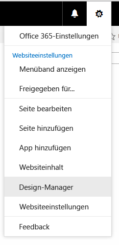

# Vorgehensweise: Erstellen eines Seitenlayouts in SharePoint 2013
Wenn Sie den Entwurfs-Manager zum Erstellen eines Seitenlayouts verwenden, werden zwei Dateien erstellt: eine .aspx-Datei, die SharePoint verwendet, und eine HTML-Version dieses Seitenlayouts, die Sie in Ihrem HTML-Editor bearbeiten können. Die HTML-Datei und das HTML-Seitenlayout sind verknüpft, sodass Ihre Änderungen mit dem entsprechenden Seitenlayout synchronisiert werden, wenn Sie die HTML-Datei bearbeiten und speichern.
## Einführung in Seitenlayouts
<a name="Introduction"> </a>

Wenn Sie den Entwurfs-Manager zum Erstellen eines Seitenlayouts verwenden, werden zwei Dateien erstellt: eine .aspx-Datei, die SharePoint verwendet, und eine HTML-Version dieses Seitenlayouts, die Sie in Ihrem HTML-Editor bearbeiten können. Die HTML-Datei und das HTML-Seitenlayout sind verknüpft, sodass Ihre Änderungen mit dem entsprechenden Seitenlayout synchronisiert werden, wenn Sie die HTML-Datei bearbeiten und speichern.
  
    
    
Wenn Sie eine Gestaltungsvorlage erstellen, laden Sie eine HTML-Datei hoch und wandeln sie direkt in eine Gestaltungsvorlage um. Eine HTML-Datei wandeln Sie jedoch nicht direkt in ein Seitenlayout um. Der Grund dafür ist, dass der Hauptzweck eines Seitenlayouts ist, Seitenfelder zu enthalten, und diese Seitenfelder müssen hinzugefügt werden, wenn das Seitenlayout im Entwurfs-Manager erstellt wird.
  
    
    
Bei der Erstellung eines Seitenlayouts geschieht Folgendes:
  
    
    

- Im Gestaltungsvorlagenkatalog werden eine .aspx-Datei und eine HTML-Datei mit dem gleichen Namen erstellt.
    
  
- Sämtliches Markup, das von SharePoint benötigt wird, wird der .aspx-Datei hinzugefügt, damit das Seitenlayout korrekt gerendert wird.
    
  
- Sonstiges Markup wie Kommentare, **<div>**-Tags, Codeausschnitte und Inhaltsplatzhalter werden der HTML-Datei hinzugefügt.
    
  
- Seitenfelder, die für den Inhaltstyp einzigartig sind, werden dem Seitenlayout automatisch hinzugefügt. Andere Seitenfelder können über das Menüband im Codeausschnittkatalog hinzugefügt werden.
    
  
- Die HTML-Datei und die .aspx-Datei sind verknüpft, sodass spätere Bearbeitungen an der HTML-Datei mit der .aspx-Datei synchronisiert werden, wenn die HTML-Datei gespeichert wird. Sonstiges Markup wie Kommentare, **<div>**-Tags, Codeausschnitte und Inhaltsplatzhalter werden der HTML-Datei hinzugefügt.
    
  

> **HINWEIS**
> Die Synchronisierung erfolgt nur in eine Richtung. Änderungen am HTML-Seitenlayout werden mit der verknüpften .aspx-Datei synchronisiert, aber wenn Sie die .aspx-Datei direkt bearbeiten möchten, werden diese Änderungen nicht mit der HTML-Datei synchronisiert. Jedes HTML-Seitenlayout (und jede HTML-Gestaltungsvorlage) weist eine Eigenschaft mit dem Namen **Zugeordnete Datei** auf, die standardmäßig auf **True** festgelegt ist, was für die Verknüpfung und Synchronisierung zwischen Dateien sorgt.
  
    
    

Wenn Sie z. B. ein Paar verknüpfter Dateien (HTML und .aspx) haben und die .aspx-Datei bearbeiten, ohne die Verknüpfung aufzuheben, werden die Änderungen an der .aspx-Datei gespeichert. Sie können die .aspx-Datei aber nicht einchecken oder veröffentlichen, sodass diese Änderungen nicht sinnvoll gespeichert werden. Die .aspx-Datei wird mit Änderungen in der HTML-Datei überschrieben. Wenn Sie die HTML-Datei einchecken oder veröffentlichen, werden alle an der .aspx-Datei vorgenommenen Änderungen mit den Änderungen an der HTML-Datei überschrieben. Die Änderungen an der .aspx-Datei gehen verloren.
  
    
    
Wenn Sie als Webentwickler mit ASP.NET vertraut sind, können Sie nur mit der .aspx-Datei arbeiten, indem Sie die Verknüpfung zwischen den Dateien aufheben. Um die Verknüpfung zwischen der HTML-Datei und der .aspx-Datei aufzuheben, wählen Sie im Entwurfs-Manager bei der HTML-Datei **Eigenschaften bearbeiten** aus, und deaktivieren Sie dann das Kontrollkästchen **Zugeordnete Datei**. Sie können die Verknüpfung später wieder erstellen, indem Sie die Eigenschaften bearbeiten und dieses Kontrollkästchen aktivieren. Die .aspx-Datei wird dann wieder mit in der HTML-Datei gespeicherten Änderungen überschrieben.
  
    
    

## Grundlegendes zur Beziehung zwischen Seitenfeldern und einem Inhaltstyp
<a name="UnderstandingPageFields"> </a>

Jedes Seitenlayout ist mit einem Inhaltstyp verknüpft. Dabei handelt es sich normalerweise um einen der Inhaltstypen in der Seitenlayoutgruppe. So ist z. B. der Inhaltstyp "Artikelseite" mit dem Seitenlayout "Artikelseite" verknüpft, wobei beide in einer Veröffentlichungswebsite enthalten sind.
  
    
    
Ein Inhaltstyp besteht aus Websitespalten, die zusammen ein Schema zugelassener Datentypen definieren. Daran, dass die Spalte "Quelle" leer ist, können Sie erkennen, dass es die Websitespalten nur für den aktuellen Inhaltstyp gibt. Das bedeutet, dass diese Websitespalten durch den aktuellen Inhaltstyp definiert sind und nicht vom übergeordneten Inhaltstyp geerbt werden.
  
    
    
Bei einem bestimmten Seitenlayout entsprechen die Websitespalten, die den Inhaltstyp darstellen, direkt den Seitenfeldern, die für das Seitenlayout verfügbar sind. Die erste Gruppe von Seitenfeldern auf dem Menüband sind Seitenfelder, die dem Seitenlayout automatisch hinzugefügt werden, wenn Sie es erstellen. SharePoint fügt diese Felder automatisch hinzu, da sie für diesen Inhaltstyp einzigartig sind, und somit ist es wahrscheinlich, dass diese Felder speziell dazu erstellt wurden, um vom Seitenlayout verwendet zu werden, und keine allgemeinen SharePoint-Metadaten darstellen.
  
    
    
Bevor Sie ein Seitenlayout im Entwurfs-Manager erstellen, müssen Sie möglicherweise zuerst einen Inhaltstyp erstellen, der die Seitenfelder definiert, die Sie für dieses Seitenlayout verwenden möchten.
  
    
    

## Grundlegendes zur Beziehung zwischen Inhaltsplatzhaltern in einem Seitenlayout und einer Gestaltungsvorlage
<a name="UnderstandingContentPlaceholders"> </a>

Ein Seitenlayout und eine Gestaltungsvorlage müssen den gleichen Satz von Inhaltsplatzhaltern aufweisen, damit das Seitenlayout korrekt gerendert wird. Dies ist kein Problem, wenn Sie zum Erstellen von Gestaltungsvorlagen und Seitenlayouts den Entwurfs-Manager verwenden, da jeder Datei bei deren Erstellung der korrekte Satz von Inhaltsplatzhaltern hinzugefügt wird. Dadurch wird sichergestellt, dass jedes Seitenlayout in jedem Kanal verwendet werden kann, der eine andere Gestaltungsvorlage verwendet. Sie müssen die meisten dieser Inhaltsplatzhalter nicht kennen oder verwenden. Sie sind vorhanden, weil sie von SharePoint zum korrekten Rendern der Seite benötigt werden.
  
    
    
Wenn Sie aber ein HTML-Seitenlayout bearbeiten und einen Inhaltsplatzhalter manuell hinzufügen, sollten Sie den gleichen Inhaltsplatzhalter jeder Gestaltungsvorlage hinzufügen, die dieses Seitenlayout verwenden soll. Dieses Szenario kommt selten vor.
  
    
    
Wenn Sie zum Erstellen von Seitenlayouts und Gestaltungsvorlagen den Entwurfs-Manager verwenden, arbeiten Sie wahrscheinlich nur mit den folgenden Inhaltsplatzhaltern:
  
    
    

- **PlaceHolderMain** Die Gestaltungsvorlage enthält einen Inhaltsplatzhalter mit `ID="PlaceholderMain"`, der das **DefaultContentBlock** **<div>**-Tag mit dem gelben Feld enthält, in dem **Dieser Bereich wird durch Inhalt gefüllt, den Sie in Ihren Seitenlayouts erstellen** steht. In der Gestaltungsvorlage sollten Sie diesen Platzhalter nicht mit Inhalt füllen. Das Seitenlayout enthält einen Inhaltsplatzhalter mit der gleichen ID. Sie sollten Markup in einem Seitenlayout nur in diesen Platzhalter einfügen und kein Markup außerhalb dieses Platzhalters platzieren. Die IDs für die zwei Platzhalter ( **PlaceholderMain**) sollten identisch sein.
    
  
- **PlaceHolderAdditionalPageHead** Wenn Sie mit einem Seitenlayout arbeiten, fügen Sie in das **<head>**-Tag des Seitenlayouts normalerweise keine Elemente ein. Stattdessen fügen Sie Elemente dem Inhaltsplatzhalter mit  `id="PlaceHolderAdditionalPageHead"` hinzu. Wenn eine Inhaltsseite im Browser gerendert wird, wird diese zusätzliche Kopfzeile mit dem Ende der Kopfzeile der Gestaltungsvorlage zusammengeführt.
    
  

## Erstellen eines Seitenlayouts
<a name="CreatePageLayout"> </a>

Bevor Sie beginnen, müssen Sie wissen, mit welchem Inhaltstyp und welcher Gestaltungsvorlage das Seitenlayout verknüpft wird.
  
    
    

### So erstellen Sie ein Seitenlayout


1. Navigieren Sie zu Ihrer Veröffentlichungswebsite.
    
  
2. Wählen Sie oben rechts auf der Seite das Zahnradsymbol und dann **Entwurfs-Manager** aus.
    
   **Menü mit Zahnradsymbol**

  


  

  

  
3. Wählen Sie im Entwurfs-Manager im linken Navigationsbereich **Seitenlayouts bearbeiten** aus.
    
  
4. Wählen Sie **Seitenlayout erstellen** aus.
    
  
5. Geben Sie im Dialogfeld **Seitenlayout erstellen** einen Namen für Ihr Seitenlayout ein.
    
  
6. Wählen Sie eine Gestaltungsvorlage aus.
    
    Die hier von Ihnen gewählte Gestaltungsvorlage wird in der Vorschau für dieses Seitenlayout angezeigt. Von dieser Gestaltungsvorlage hängt auch ab, welche Inhaltsplatzhalter dem Seitenlayout hinzugefügt werden.
    
    > **HINWEIS**
      > Nachdem Sie diese Gestaltungsvorlage ausgewählt haben, können Sie keine Vorschau des Seitenlayouts mit einer anderen Gestaltungsvorlage anzeigen. Dies gilt auch dann, wenn Sie auf die Live-Website eine andere Gestaltungsvorlage angewendet haben. 
7. Wählen Sie einen Inhaltstyp aus. Vom Inhaltstyp für dieses Seitenlayout hängt ab, welche Seitenfelder für dieses Seitenlayout in der Codeausschnittgalerie verfügbar sind.
    
  
8. Wählen Sie **OK** aus.
    
    Nun erstellt SharePoint eine HTML-Datei und eine .aspx-Datei mit dem gleichen Namen.
    
    Im Entwurfs-Manager wird Ihre HTML-Datei jetzt mit einer Statusspalte angezeigt, die einen von zwei möglichen Status aufweist:
    
  - **Warnungen und Fehler**
    
  
  - **Konvertierung erfolgreich**
    
  
9. Klicken Sie auf den Link in der Statusspalte, um die Datei in der Vorschau anzuzeigen und etwaige Fehler oder Warnungen zur Gestaltungsvorlage anzuzeigen.
    
    Die Vorschauseite ist eine serverseitige Liveansicht Ihres Seitenlayouts. Oben in der Vorschau werden Warnungen und Fehler angezeigt, die Sie möglicherweise beheben müssen, indem Sie die HTML-Datei in einem HTML-Editor bearbeiten. Fehler müssen behoben werden, bevor die Vorschau das Seitenlayout korrekt anzeigt.
    
    Weitere Informationen zum Beheben von Fehlern und Warnungen finden Sie unter  [Vorgehensweise: Beheben von Fehlern und Warnungen bei der Vorschau einer Seite in SharePoint 2013](how-to-resolve-errors-and-warnings-when-previewing-a-page-in-sharepoint-2013.md).
    
    Weitere Informationen zur Anzeige einer Vorschau des Seitenlayouts finden Sie unter  [Vorgehensweise: ändern die Vorschauseite in SharePoint 2013-Design-Manager](how-to-change-the-preview-page-in-sharepoint-2013-design-manager.md).
    
    Die Vorschauseite enthält oben rechts auch den Link **Ausschnitte**. Über diesen Link wird die Codeausschnittgalerie geöffnet, wo Sie damit beginnen können, Modellsteuerelemente in Ihrem Entwurf durch dynamische SharePoint-Steuerelemente zu ersetzen. Weitere Informationen finden Sie unter  [Codeausschnitte des SharePoint 2013-Entwurfs-Managers](sharepoint-2013-design-manager-snippets.md).
    
  
10. Um Fehler zu beheben, bearbeiten Sie die HTML-Datei, die sich direkt auf dem Server befindet, mithilfe eines HTML-Editors, um die HTML-Datei auf dem verbundenen Laufwerk zu öffnen und zu bearbeiten. Immer wenn Sie die HTML-Datei speichern, werden alle Änderungen mit der zugeordneten .aspx-Datei synchronisiert.
    
  
11. Die Vorschau des Seitenlayouts zeigt die Seitenfelder, die dem Seitenlayout automatisch hinzugefügt wurden. Diese Seitenfelder sind Websitespalten, die nur der aktuelle Inhaltstyp aufweist. Jetzt können Sie das Seitenlayout gemäß Ihren ursprünglichen HTML-Modellen gestalten.
    
  

## Bestimmen, wo die Formate für ein Seitenlayout eingefügt werden sollen
<a name="WhereStyles"> </a>

Wenn Sie HTML-Modelle für Ihre Website erstellen, haben Sie möglicherweise HTML-Dateien, die unterschiedliche Klassen von Seiten darstellen, etwa eine Artikelseite oder eine Seite mit Elementdetails, die ein Webpart enthält, um die Details eines einzelnen Elements aus dem Katalog anzuzeigen. Nachdem Sie das Seitenlayout erstellt haben, das diese Klasse von Seiten darstellt, können Sie die Formate aus Ihrem HTML-Modell in die HTML-Version Ihres Seitenlayouts übertragen.
  
    
    
Sie können die Formate für ein oder mehrere Seitenlayouts einfach im gleichen Stylesheet ablegen, mit dem die Gestaltungsvorlage verknüpft ist. Wenn Sie aber die Größe der CSS minimieren möchten, die pro Seite geladen werden, können Sie auch unterschiedliche Stylesheets für unterschiedliche Seitenlayouts verwenden. In diesem Fall ist es wichtig zu wissen, dass ein Link zu einem Stylesheet nicht in das **<head>**-Tag eines Seitenlayouts eingefügt werden kann. Stattdessen muss der Link in den Inhaltsplatzhalter mit der Bezeichnung **PlaceHolderAdditionalPageHead** eingefügt werden.
  
    
    

> **HINWEIS**
> In diesem Markup schließt das Attribut  `ms-design-css-conversion="no"` das Stylesheet vom Design aus. Außerdem sollte der Link zum Stylesheet nach den mit **<!--SPM** kommentierten Zeilen angezeigt werden.
  
    
    


```HTML

<!--MS:<asp:ContentPlaceHolder id="PlaceHolderAdditionalPageHead" runat="server">-->
            <!--SPM:<%@Register Tagprefix="SharePoint" Namespace="Microsoft.SharePoint.WebControls" Assembly="Microsoft.SharePoint, Version=15.0.0.0, Culture=neutral, PublicKeyToken=71e9bce111e9429c"%>-->
            <!--SPM:<%@Register Tagprefix="Publishing" Namespace="Microsoft.SharePoint.Publishing.WebControls" Assembly="Microsoft.SharePoint.Publishing, Version=15.0.0.0, Culture=neutral, PublicKeyToken=71e9bce111e9429c"%>-->
<link href="MyPageLayout.css" rel="stylesheet" type="text/css" ms-design-css-conversion="no" />
        <!--ME:</asp:ContentPlaceHolder>-->

```

Wenn ein Websitebesucher zu einer Seite navigiert, die dieses Seitenlayout verwendet, wird diese zusätzliche Kopfzeile mit dem Ende der Kopfzeile der Gestaltungsvorlage zusammengeführt. Formate für das Seitenlayout werden also nach Formaten für die Gestaltungsvorlage angewendet.
  
    
    
Dadurch kann jedes Seitenlayout ein eigenes Stylesheet haben. Sie können z. B. ein **<div>** mit `id="xyz"` in einem Seitenlayout haben, das links angezeigt wird, und in einem anderen Seitenlayout, das rechts angezeigt wird.
  
    
    
Jedes Seitenlayout kann auch eine oder mehrere gerätekanalspezifische Stylesheets aufweisen. So möchten Sie z. B. vielleicht für Mobiltelefone ein anderes Layout haben als für Desktop-PCs. Dazu können Sie einen oder mehrere Gerätekanalbereiche in **PlaceHolderAdditionalPageHead** einschließen, wobei jeder Kanalbereich einen Link zu einem Stylesheet mit kanalspezifischen Formaten enthält. So kann z. B. ein **<div>** mit `id="abc"` in einem Kanal großen Text und in einem anderen Kanal kleinen Text anzeigen.
  
    
    
Hier einige gängige Szenarios dafür, wo die Stylesheet-Links für Seitenlayouts eingefügt werden sollen.
  
    
    

### Link zu Formaten in einer Gestaltungsvorlage

Das einfachste Szenario ist, Formate für ein oder mehrere Seitenlayouts in das Stylesheet einzuschließen, mit dem die Gestaltungsvorlage verknüpft ist. Platzieren Sie den Link zur .css.Datei in der Gestaltungsvorlage direkt vor dem schließenden **</head>**-Tag, sodass die SharePoint-Standardstylesheets wie "corev15.css" überschrieben werden.
  
    
    

```HTML

<head>
…
<link rel="stylesheet" type="text/css" href="MyStyleSheet.css" />
</head>

```


### Link zu Formaten in einem Seitenlayout

Wenn Sie die Größe der CSS minimieren möchten, die pro Seite geladen werden, können Sie für jedes Seitenlayout eigene CSS-Dateien verwenden. In diesem Szenario werden die Formate für ein Seitenlayout im Inhaltsplatzhalter mit der Bezeichnung **PlaceHolderAdditionalPageHead** eingefügt.
  
    
    

```HTML

<!--MS:<asp:ContentPlaceHolder id="PlaceHolderAdditionalPageHead" runat="server">-->
            <!--SPM:<%@Register Tagprefix="SharePoint" Namespace="Microsoft.SharePoint.WebControls" Assembly="Microsoft.SharePoint, Version=15.0.0.0, Culture=neutral, PublicKeyToken=71e9bce111e9429c"%>-->
            <!--SPM:<%@Register Tagprefix="Publishing" Namespace="Microsoft.SharePoint.Publishing.WebControls" Assembly="Microsoft.SharePoint.Publishing, Version=15.0.0.0, Culture=neutral, PublicKeyToken=71e9bce111e9429c"%>-->
<link href="MyPageLayout.css" rel="stylesheet" type="text/css" ms-design-css-conversion="no" />
        <!--ME:</asp:ContentPlaceHolder>-->

```


### Link zu Formaten im Seitenlayout pro Gerätekanal

Wenn Sie unterschiedliche Gerätekanäle haben, möchten Sie wahrscheinlich, dass Ihre Seitenlayouts für unterschiedliche Kanäle unterschiedlich gerendert werden. In diesem Fall fügen Sie einen oder mehrere Gerätekanalbereiche in **PlaceHolderAdditionalPageHead** ein, und schließen dann in jeden Kanalbereich einen Link zu kanalspezifischen CSS-Dateien ein.
  
    
    

```HTML

<!--MS:<asp:ContentPlaceHolder id="PlaceHolderAdditionalPageHead" runat="server">-->
<div data-name="DeviceChannelPanel">
    <!--CS: Start Device Channel Panel Snippet-->
    <!--SPM:<%@Register Tagprefix="Publishing" Namespace="Microsoft.SharePoint.Publishing.WebControls" Assembly="Microsoft.SharePoint.Publishing, Version=15.0.0.0, Culture=neutral, PublicKeyToken=71e9bce111e9429c"%>-->
    <!--MS:<Publishing:DeviceChannelPanel runat="server" IncludedChannels="Channel1">-->
…..
<link rel="stylesheet" type="text/css" href="MyStyleSheet.css" ms-design-css-conversion="no" />
    <!--ME:</Publishing:DeviceChannelPanel>-->
    <!--CE: End Device Channel Panel Snippet-->
</div><div data-name="DeviceChannelPanel">
    <!--CS: Start Device Channel Panel Snippet-->
    <!--SPM:<%@Register Tagprefix="Publishing" Namespace="Microsoft.SharePoint.Publishing.WebControls" Assembly="Microsoft.SharePoint.Publishing, Version=15.0.0.0, Culture=neutral, PublicKeyToken=71e9bce111e9429c"%>-->
    <!--MS:<Publishing:DeviceChannelPanel runat="server" IncludedChannels="Channel2">-->
…..
<link rel="stylesheet" type="text/css" href="CSS5.css" />
    <!--ME:</Publishing:DeviceChannelPanel>-->
    <!--CE: End Device Channel Panel Snippet-->
</div>

```


## Grundlegendes zum Markup im HTML-Seitenlayout
<a name="UnderstandMarkup"> </a>

Wenn Sie ein Seitenlayout erstellen, wird eine .aspx-Datei erstellt, die SharePoint verwendet, und der HTML-Version des Seitenlayouts wird HTML-Markup hinzugefügt. Wenn Sie das HTML-Seitenlayout in Ihrem HTML-Editor bearbeiten, kann es hilfreich sein, den Zweck eines Teils dieses Markups zu kennen. Der Großteil ähnelt dem Markup, das einer HTML-Gestaltungsvorlage hinzugefügt wird. Weitere Informationen finden Sie unter  [Vorgehensweise: Konvertieren einer HTML-Datei in eine Gestaltungsvorlage in SharePoint 2013](how-to-convert-an-html-file-into-a-master-page-in-sharepoint-2013.md).
  
    
    
Das Markup, das für Seitenlayouts eindeutig ist, sind Seitenfelder, die dem Seitenlayout auf Basis des Inhaltstyps hinzugefügt werden, mit dem das Seitenlayout verknüpft ist. Seitenfelder werden im Inhaltsplatzhalter mit  `id="PlaceHolderMain"` angezeigt. So enthält beispielsweise das folgende Markup für **PlaceHolderMain** zwei Seitenfelder, welche die **Title**- und **Page Image**-Felder aus dem verknüpften Inhaltstyp darstellen.
  
    
    


```HTML

<!--MS:<asp:ContentPlaceHolder ID="PlaceHolderMain" runat="server">-->
            <div>
                <!--CS: Start Page Field: Title Snippet-->
                <!--SPM:<%@Register Tagprefix="PageFieldTextField" Namespace="Microsoft.SharePoint.WebControls" Assembly="Microsoft.SharePoint, Version=15.0.0.0, Culture=neutral, PublicKeyToken=71e9bce111e9429c"%>-->
                <!--SPM:<%@Register Tagprefix="Publishing" Namespace="Microsoft.SharePoint.Publishing.WebControls" Assembly="Microsoft.SharePoint.Publishing, Version=15.0.0.0, Culture=neutral, PublicKeyToken=71e9bce111e9429c"%>-->
                <!--MS:<Publishing:EditModePanel runat="server" CssClass="edit-mode-panel">-->
                    <!--MS:<PageFieldTextField:TextField FieldName="fa564e0f-0c70-4ab9-b863-0177e6ddd247" runat="server">-->
                    <!--ME:</PageFieldTextField:TextField>-->
                <!--ME:</Publishing:EditModePanel>-->
                <!--CE: End Page Field: Title Snippet-->
            </div>
            <div>
                <!--CS: Start Page Field: Page Image Snippet-->
                <!--SPM:<%@Register Tagprefix="PageFieldRichImageField" Namespace="Microsoft.SharePoint.Publishing.WebControls" Assembly="Microsoft.SharePoint.Publishing, Version=15.0.0.0, Culture=neutral, PublicKeyToken=71e9bce111e9429c"%>-->
                <!--MS:<PageFieldRichImageField:RichImageField FieldName="3de94b06-4120-41a5-b907-88773e493458" runat="server">-->
                    <!--PS: Start of READ-ONLY PREVIEW (do not modify)--><div id="ctl02_label" style="display:none">Page Image</div><div id="ctl02__ControlWrapper_RichImageField" class="ms-rtestate-field" style="display:inline" aria-labelledby="ctl02_label"><div align="left" class="ms-formfieldcontainer"><div class="ms-formfieldlabelcontainer" nowrap="nowrap"><span class="ms-formfieldlabel" nowrap="nowrap">Page Image</span></div><div class="ms-formfieldvaluecontainer"><div class="ms-rtestate-field"></div></div></div></div><!--PE: End of READ-ONLY PREVIEW-->
                <!--ME:</PageFieldRichImageField:RichImageField>-->
                <!--CE: End Page Field: Page Image Snippet-->
            </div>
        <!--ME:</asp:ContentPlaceHolder>-->

```


## Zusätzliche Ressourcen
<a name="AdditionalResources"> </a>


-  [Übersicht über den Entwurfs-Manager in SharePoint 2013](overview-of-design-manager-in-sharepoint-2013.md)
    
  
-  [Vorgehensweise: Konvertieren einer HTML-Datei in eine Gestaltungsvorlage in SharePoint 2013](how-to-convert-an-html-file-into-a-master-page-in-sharepoint-2013.md)
    
  
-  [Codeausschnitte des SharePoint 2013-Entwurfs-Managers](sharepoint-2013-design-manager-snippets.md)
    
  

