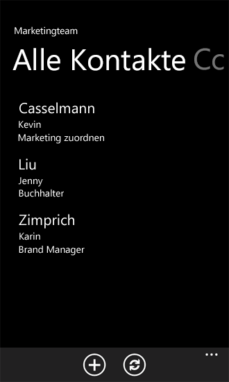

# Vorgehensweise: Erstellen eine Windows Phone SharePoint 2013 Liste app
Erstellen Sie eine Windows Phone-App in Visual Studio basierend auf der Vorlage "Windows Phone - SharePoint-Listenanwendung".
Installieren von Windows Phone SharePoint SDK stellt zwei SharePoint-Anwendung für Windows Phone-Vorlagen zur Verfügung Sie in Visual Studio 2010 oder Visual Studio 2010 Express für Windows Phone. (Siehe  [Vorgehensweise: Einrichten einer Umgebung für die Entwicklung von mobilen Anwendungen für SharePoint](how-to-set-up-an-environment-for-developing-mobile-apps-for-sharepoint.md)). Mit der Vorlage Windows Phone SharePoint List Application können Sie die Schritte eines Assistenten zum Erstellen einer funktionalen Windows Phone-app ausführen, die zugreifen und Bearbeiten von Daten in einer SharePoint-Liste.
  
    
    

> **WICHTIG**
> Wenn Sie eine app für Windows Phone 8 entwickeln, müssen Sie anstelle von Visual Studio 2010 Express Visual Studio Express 2012 verwenden. Alle Informationen in diesem Artikel betrifft mit Ausnahme der Entwicklungsumgebung Erstellen von apps für Windows Phone 8 und Windows Phone 7.> Weitere Informationen finden Sie unter  [Vorgehensweise: Einrichten einer Umgebung für die Entwicklung von mobilen Anwendungen für SharePoint](how-to-set-up-an-environment-for-developing-mobile-apps-for-sharepoint.md).
  
    
    

Wenn Sie eine Demonstration eine mobile app erstellen, bevor Sie mit diesem Artikel beginnen möchten, das folgende Video.
  
    
    

**Erstellen von mobilen apps mit SharePoint 2013 (Demo)**

  
    
    

  
    
    

  
    
    

  
    
    

  
    
    

## Erstellen Sie die Windows Phone SharePoint-listenanwendung

In der Windows Phone-SharePoint-Listen-app können Sie die meisten der Listen zugreifen, die in SharePoint-Add-Ins verfügbar sind. Für die Zwecke dieser Beispiel-app für Windows Phone verwenden wir SharePoint-Listen mit Beispieldaten aus einem fiktiven Unternehmen mit dem Namen Contoso, Ltd. Für die Schritte zum Erstellen der ersten Iteration der in diesem SharePoint-Listen-app verwenden wir eine SharePoint-Liste Kontakte, die Mitglieder der ein Marketingteam bei Contoso, Informationen enthält, wie in Abbildung 1 dargestellt.
  
    
    

**Abbildung 1. Kontakteliste für Contoso-Marketingteam**

  
    
    

  
    
    

  
    
    

### Erstellen eine Windows Phone-SharePoint-Listen-app

1. Starten Sie Visual Studio 2010 mit der Option **Als Administrator ausführen**.
    
  
2. Klicken Sie auf **Datei**, **Neu**, **Projekt**.
    
    Das Dialogfeld **Neues Projekt** wird angezeigt.
    
  
3. Klicken Sie im Dialogfeld **Neues Projekt** den Knoten **Visual c#**, und wählen Sie dann den Knoten **für Fenster Phone Silverlight**. (Stellen Sie sicher, dass die Zielversion .NET Framework 4 festgelegt ist.)
    
    > **HINWEIS**
      > Die im Rahmen des Windows Phone SharePoint SDK installierten Vorlagen eignen sich nur für C#-Projekte. Für Visual Basic-Projekte sind die Vorlagen nicht verfügbar.
4. Wählen Sie im Bereich **Vorlagen** die Vorlage **Windows Phone SharePoint List Application**, und geben Sie dem Projekt einen Namen, beispielsweise ContosoSPListApp.
    
  
5. Beim Ausführen des **Assistenten für SharePoint Phone-Anwendung**, kann der in Abbildung 2 dargestellten Fehler auftreten. Dieser Fehler tritt auf, weil das Konto der Entwickler verwendet wird, während der Ausführung des **Assistenten für SharePoint Phone-Anwendung** über unzureichende Berechtigungen verfügt.
    
   **Abbildung 2. SPList-Assistenten-Fehlermeldung**

  

  

    Sie können den Fehler beheben, erteilen Sie über ausreichende Berechtigungen für das Konto, mit dem der Entwickler den SPList-Assistenten ausgeführt wird. Ausführen Sie **Splist-Assistenten** erneut, nachdem über ausreichende Rechte erfolgt sind.
    
  
6. Wählen Sie die Schaltfläche **OK**. Der **Assistent für SharePoint Phone-Anwendung** wird angezeigt. Sie verwenden dieses Assistenten zum Auswählen einer SharePoint-Liste und Konfigurieren der Eigenschaften von dieser Liste aus, um zu bestimmen, wie es in Ihrer Windows Phone-app angezeigt wird.
    
  
7. Geben Sie die URL der SharePoint-Zielwebsite in Ihrem Netzwerk (d. h., eine lokale Installation von SharePoint Server ).
    
  
8. Wählen Sie **Listen Suchen**. Wenn das Konto, unter dem Sie Visual Studio ausführen, Zugriff auf die Website für die angegebene Ziel hat, zeigt der **Assistent für SharePoint Phone-Anwendung** die Listen, die auf dieser Website verfügbar sind.
    
  
9. Wählen Sie eine der verfügbaren Listen, wie etwa eine Kontaktliste (mit Beispieldaten in einer angepassten Ansicht in Abbildung 1 dargestellt).
    
  
10. Wählen Sie auf **Weiter**. Der Assistent zeigt die verfügbaren Ansichten der ausgewählten Liste zugeordnet.
    
    Die vom Assistenten angezeigten Ansichten sind diese Ansichten, die von Benutzern erstellte (oder durch SharePoint Server bereitgestellt) wurde und eine bestimmte Liste auf dem Server zugeordnet ist. Einige SharePoint-Listen haben nur eine Ansicht standardmäßig zugeordnet. Eine Kontaktliste ist standardmäßig eine Ansicht für alle Kontakte zugeordnet. Eine Ankündigungsliste ist standardmäßig eine Ansicht für alle Elemente zugeordnet. Eine Aufgabenlisten wird standardmäßig sechs Ansichten, einschließlich einer Ansicht alle Tasks und einer aktiven Vorgangsansicht zugeordnet. Für die einzelnen Ansichten, die Sie in dieser Phase im Assistenten zum auswählen ein Steuerelements **PivotItem** erstellt und mit dem **Pivot** -Steuerelement in der XAML-Code, der die Benutzeroberfläche der Windows Phone-app definiert hinzugefügt.
    
  
11. Aktivieren Sie das Kontrollkästchen der Ansichten, die in der Windows Phone-App enthalten sein sollen.
    
  
12. Wählen Sie auf **Weiter**. Der Assistent zeigt die verfügbaren Aktionen für die ausgewählte Liste in Ihrer Windows Phone-app.
    
    Die Auswahlmöglichkeiten sind **neu**, **Anzeigen**, **Bearbeiten** und **Löschen**. Wenn Sie möchten möglicherweise bearbeiten oder Löschen von Listenelementen in Ihrer app, müssen Sie den **Display**-Vorgang in dieser Phase im Assistenten auswählen. (Die Kontrollkästchen für die Vorgänge **Bearbeiten** und **Löschen von** sind deaktiviert, wenn der Vorgang **Anzeigen** ausgewählt ist.)
    
  
13. Aktivieren Sie das Kontrollkästchen neben jedem gewünschte Aktion haben verfügbar für die ausgewählte Liste in Ihrer Windows Phone-app.
    
  
14. Wählen Sie auf **Weiter**. Der Assistent zeigt die Felder der ausgewählten Liste auf der SharePoint-Website zugeordnet.
    
    > **HINWEIS**
      > Ein benutzerdefiniertes Feld verfügbar aus der SharePoint-Liste-Assistent für mobile Geräte nicht. Sie können jedoch benutzerdefinierten Code zum Zugreifen auf eine beliebige benutzerdefinierte Feld schreiben. Ein Feld kann nicht den Inhaltstyp zugeordnet werden. Wenn mehrere Inhaltstypen für die Liste aktiviert sind, werden alle Felder jedoch für Entwickler in ihren apps Telefon Nutzung von verfügbar sein.
15. Aktivieren Sie das Kontrollkästchen neben jedem Feld, das in der Liste enthalten sein, wie es in Ihrer Windows Phone-app angezeigt werden sollen.
    
    > **HINWEIS**
      > Listenfelder, die in SharePoint Server eine erforderliche Informationen vorgesehen sind sind bereits ausgewählt. Sie können nicht im Assistenten gelöscht werden soll.
16. Klicken Sie auf **Weiter**. Der Assistent gibt Ihnen Gelegenheit zum Sortieren der Felder, die Sie im vorherigen Schritt ausgewählt haben.
    
  
17. Sortieren Sie die Felder gemäß Ihren Anforderungen. Wählen Sie hierzu ein Feld aus, und verschieben Sie es mithilfe des Aufwärts- oder Abwärtspfeils nach oben bzw. nach unten.
    
  
18. Klicken Sie auf **Fertig stellen**. Von Visual Studio werden die erforderlichen Dateien für das Projekt erstellt, und die Datei "List.xaml" wird zur Bearbeitung geöffnet.
    
  

## Führen Sie mithilfe des Assistenten für SharePoint Phone-Anwendung generierte Windows Phone-app

Das Projekt mit dem **Assistenten für SharePoint Phone-Anwendung** generiert kann erstellt werden, wie es ist, erstellen eine einfache, aber funktionale Windows Phone SharePoint-Listen-app. Wir können ändern und Entwickeln der app weiter, aber, jetzt ein Benutzer können Tippen Sie auf (oder, klicken Sie in der Windows Phone-Emulator auf) ein bestimmtes Listenelement und die app zeigt alle Felder zugeordnet, dass das Element (diese Felder, die Sie im Assistenten zum Einschließen in die app ausgewählt haben). Ein Benutzer kann auch neue Listenelemente hinzufügen, Löschen von Listenelementen und die Feldwerte für Listenelemente bearbeiten. Mehrere Benutzer anmelden in einer einzelnen app wird nicht unterstützt. Entwickler kann jedoch Code schreiben, die den aktuellen Benutzer abmeldet, wenn ein anderer Benutzer, zur Anmeldung bei der gleichen mobile app versucht.
  
    
    
Das Deployment-Ziel für die Lösung wird standardmäßig auf Windows Phone-Emulator festgelegt. Sie können das Projekt in Visual Studio ausführen, unverändert (durch Drücken von F5, um das Projekt im Zusammenhang mit den Debugger starten oder durch Drücken von STRG + F5, um das Projekt ohne Debuggen starten). Die Windows Phone-Emulator neu gestartet wird, das Betriebssystem Windows Phone wird geladen und Ihre app für den Emulator bereitgestellt und gestartet wird. Wenn Sie mit dem Code starten, während sie vom Assistenten erstellt werden, wenn Ihre SharePoint-Listen-app im Emulator ausgeführt wird, werden Sie für die Anmeldeinformationen für die angegebene SharePoint-Liste auf die Zielwebsite gefragt. Geben Sie die Anmeldeinformationen für ein Konto, das über ausreichende Berechtigungen zum Zugriff auf die Liste, und wählen Sie **Anmelden** im Emulator hat. Die Hauptseite der Windows Phone-app (definiert durch die List.xaml-Datei in das Projekt) wird im Emulator angezeigt. Je nach den Feldern, die Sie ausgewählt haben und den Auftrag, den Sie für diese Felder in den vorherigen Schritten angegeben, sollte die Elemente aus der angegebenen Liste angezeigt werden. Basierend auf den Daten in der Liste, die durch die in Abbildung 1 dargestellt, wird eine Liste von Elementen im Emulator wie in Abbildung 3 dargestellt angezeigt werden.
  
    
    

**Abbildung 3. SharePoint-Listenelemente in einer Windows Phone-app**

  
    
    

  
    
    

  
    
    
Während der Ausführung einer Windows Phone-app, kann der in Abbildung 4 dargestellte Authentifizierungsfehler auftreten. In diesem Fall, da die mobile SharePoint-app **Standardauthentifizierung Formular** benötigt; Dies ist nicht standardmäßig aktiviert.
  
    
    

**Abbildung 4. Authentifizierungsfehler für Windows Phone-app**

  
    
    

  
    
    

  
    
    
Sie können diesen Fehler beheben, indem-Zentraladministration **grundlegende Formularauthentifizierung** auswählen.
  
    
    

### So aktivieren Sie grundlegende Formularauthentifizierung

1. Navigieren Sie zur **Zentraladministration**; Stellen Sie sicher, dass Sie Administratorrechte auf dem Server verfügen.
    
  
2. Wählen Sie unter **Verwaltung von** **Webanwendungen verwalten**.
    
  
3. Wählen Sie die Webanwendung (auf dem der SharePoint-Website, die Sie von der mobilen Anwendung zugreifen müssen).
    
  
4. Wählen Sie im Menüband **Authentifizierungsanbieter**.
    
  
5. Wählen Sie im Menüband **Authentifizierungsanbieter**.
    
  
6. Wählen Sie im Dialogfeld **Authentifizierungsanbieter** **Standard** Authentifizierung bearbeiten.
    
  
7. Klicken Sie im Modell **Authentifizierung bearbeiten** wählen Sie unter **Claims Authentication** Typen **Standardauthentifizierung**.
    
  
Wenn Sie Ihre Windows Phone-app auf den Daten aus der Kontaktliste basierend, wie in Abbildung 1 dargestellt, können Sie ein bestimmtes Listenelement auswählen und die app stellt eine Seite mit einer Ansicht des Elements (durch DisplayForm.xaml im Projekt definiert) alle für das Element verfügbaren Felder in der app, wie in Abbildung 5 angezeigt. (In diesem Beispiel alle Felder, die mit einer SharePoint-Liste Kontakte verknüpft sind im Application-Assistent für SharePoint-Telefon ausgewählt wurden und wurde die Standardreihenfolge dieser Felder beibehalten.)
  
    
    

**Abbildung 5. DisplayForm-Ansicht eines kontaktlistenelements**

  
    
    

  
    
    

  
    
    
Beachten Sie die **Bearbeiten** und **Löschen von** Schaltflächen auf der Anwendungsleiste auf dieser Seite der app. Diese Vorgänge sind für Sie von Methoden in Microsoft.SharePoint.Phone.Application.dll implementiert (die eine der Bibliotheken, die von Windows Phone SharePoint SDK installiert ist). Wenn Sie die Schaltfläche **Bearbeiten** geklickt haben, wird ein Windows Phone- **Page** -Steuerelement (d. h., ein Objekt aus einer Klasse, die von der **Microsoft.Phone.Controls.PhoneApplicationPage** -Klasse erbt instanziiert) angezeigt. Die zugrunde liegende **UpdateItem** -Methode der **EditItemViewModelBase** -Klasse wird ausgeführt, wenn Sie die Felder bearbeiten, und wählen Sie die Schaltfläche **Absenden** auf dieser Seite in der app, (, die schließlich führt die **Update** -Methode eines **ListItem** -Objekts aus der SharePoint Silverlight-Clientobjektmodell) Ihre Änderungen an der SharePoint-Liste gespeichert.
  
    
    

## Zusätzliche Ressourcen

-  [Erstellen von Windows Phone-Apps, die auf SharePoint 2013 zugreifen](build-windows-phone-apps-that-access-sharepoint-2013.md)
    
  
-  [Vorgehensweise: Einrichten einer Umgebung für die Entwicklung von mobilen Anwendungen für SharePoint](how-to-set-up-an-environment-for-developing-mobile-apps-for-sharepoint.md)
    
  
-  [Windows Phone SDK 8.0](http://www.microsoft.com/en-us/download/details.aspx?id=35471)
    
  
-  [Microsoft SharePoint SDK für Windows Phone 8](http://www.microsoft.com/en-us/download/details.aspx?id=36818)
    
  
-  [Windows Phone SDK 7.1](http://www.microsoft.com/de-de/download/details.aspx?id=27570)
    
  
-  [Microsoft SharePoint SDK for Windows Phone 7.1](http://www.microsoft.com/en-us/download/details.aspx?id=30476)
    
  

