# Vorgehensweise: Erstellen von benutzerdefinierten SharePoint Server 2013-Workflowformularen mit Visual Studio 2012
In diesem Artikel werden Workflowformulare in SharePoint Server 2013 veranschaulicht. In diesem Artikel wird SharePoint Server 2013 verwendet, wobei das öffentliche Update von März 2013 angewendet wurde. Außerdem werden Office Developer Tools für Visual Studio 2012 verwendet. Alle Informationen in diesem Artikel gelten für lokale SharePoint Server 2013-Bereitstellungen und für Office 365 gleichermaßen.
 **Bereitgestellt von:** [Andrew Connell](http://social.msdn.microsoft.com/profile/andrew%20connell%20%5bmvp%5d/),  [www.AndrewConnell.com](http://www.andrewconnell.com)
  
    
    

Seit der Einführung von Microsoft SharePoint 2007 unterstützt die SharePoint-Plattform Workflows zur Automatisierung von Geschäftsprozessen. Die SharePoint-Workflowplattform ist auf Windows Workflow Foundation aufgebaut, einem Teil des .NET Framework. Während die Workflowumgebung (Workflow Foundation) zahlreiche Funktionen zum Erstellen benutzerdefinierter Workflows und Verwalten automatisierter Geschäftsprozesse bereitstellt, ergänzt SharePoint darüber hinaus die Endbenutzerintegration. Diese Integration wird in zwei Teilen implementiert: 
- Benutzern und Gruppen zugewiesene **Aufgaben**, die durch die Workflows erstellt und überwacht werden können.
    
  
- **Formulare**, in denen Informationen von Benutzern erfasst werden, wenn Workflows einem Inhaltstyp (zum Beispiel einer Website, Liste oder Bibliothek) zugeordnet werden oder wenn ein Workflow gestartet wird.
    
  

## Workflowformulare in SharePoint 2007 und SharePoint 2010
<a name="sec1"> </a>

Bei der Implementierung von Workflows in SharePoint 2007 und SharePoint 2010 wurden von Version zu Version stetig Verbesserungen vorgenommen. Insbesondere hat Microsoft in SharePoint 2010 neue Funktionen hinzugefügt, wie beispielsweise die Möglichkeit, Workflows mit Websites zu verknüpfen. Darüber hinaus wurden die Tools zum Erstellen von Workflows, SharePoint Designer 2010 und Visual Studio 2010, gegenüber ihren Vorgängerversionen verbessert. Die Implementierung von Workflowaufgaben und Workflowformularen ist in SharePoint 2013 jedoch weitestgehend unverändert geblieben.
  
    
    
Vor SharePoint Server 2013 standen Entwicklern zwei Möglichkeiten zum Erstellen von Workflowformularen zur Verfügung. In SharePoint 2007 wurden InfoPath-Formulare und ASP.NET-Webfomulare gleichermaßen empfohlen. Jede Option hatte Vor- und Nachteile. In SharePoint 2010 wurden Entwickler ermutigt, ASP.NET-Webformulare zu verwenden, da diese von den SharePoint Developer Tools in Visual Studio 2010 mithilfe der Projektelementvorlagen für die Workflowzuordnungs- und Workflowinitiierungsformulare erstellt wurden. Die Implementierung entsprach in vieler Hinsicht jedoch der Implementierung in SharePoint 2007.
  
    
    

## Änderungen an Workflowformularen in SharePoint 2013
<a name="sec2"> </a>

In SharePoint Server 2013 wurden eine neue Workflowarchitektur und eine neue Plattform eingeführt, die ein grundlegendes Umdenken im Umgang mit SharePoint nach sich ziehen. Die wesentliche Änderung besteht darin, dass Workflows in SharePoint Server 2013 nicht mehr vom SharePoint-Laufzeitmodul ausgeführt und verwaltet werden. Stattdessen bedient sich SharePoint Server 2013 einer neuen Komponente namens Workflow-Manager, die die Windows Workflow Foundation-Laufzeitdienste und sonstige notwendigen Dienste hostet, die von Workflow Foundation benötigt werden. Wichtig dabei ist, dass Workflow-Manager außerhalb von SharePoint ausgeführt wird. Wenn ein Workflow veröffentlicht wird oder eine neue Instanz eines veröffentlichten Workflows gestartet wird, benachrichtigt SharePoint Workflow-Manager, der daraufhin die Workflowepisoden verarbeitet. Wenn der Workflow auf Informationen in SharePoint zugreifen muss, wie beispielsweise auf Listenelementeigenschaften oder Benutzereigenschaften, authentifiziert er den Benutzer mit dem OAuth-Authentifizierungsmodell und kommuniziert über die in SharePoint Server 2013-Version eingeführten REST-APIs.
  
    
    
Die generelle Richtung bei der Durchführung von Anpassungen auf der SharePoint-Plattform wurde in der SharePoint Server 2013-Version ebenfalls geändert, wobei diese Veränderung im Grunde bereits mit SharePoint 2010 und Sandkastenlösungen begonnen hat. In SharePoint Server 2013 führte Microsoft Features ein, durch die Anpassungen vom SharePoint-Server weg auf den Clientbrowser oder andere externe Ressourcen verschoben wurden. Zu diesen Features zählt das neue SharePoint-App-Modell, das Zuweisen von Apps zu einer Identität, die Authentifizierung über das OAuth-Autorisierungsmodell sowie Verbesserungen am clientseitigen Objektmodell (CSOM) und den REST-APIs.
  
    
    
Wie wirkt sich dies auf Workflowformulare aus? Rufen Sie sich wieder ins Gedächtnis, dass Microsoft beginnend mit SharePoint 2010 Entwickler ermutigte, beim Erstellen von Workflows, die mithilfe von Visual Studio erstellt wurden, ASP.NET-Webformulare zu verwenden. Für diesen Ansatz ist natürlich serverseitiger Code erforderlich, um das Formular zu verarbeiten und die Kommunikation zwischen dem Formular und dem Workflowmodul abzuwickeln. In SharePoint Server 2013 ist dies jedoch nur in der lösungsorientierten Entwicklung möglich (d. h. Entwicklung von *.WSP-Paketen). Das in SharePoint Server 2013 eingeführte neue SharePoint-App-Modell gestattet keine Ausführung von serverseitigem Code im SharePoint-Prozess.
  
    
    
Microsoft erweiterte CSOM um eine API für die Interaktion mit dem Workflowmodul, um diese Einschränkung zu verringern. Um eine SharePoint Server 2013-Farm mit der Workflow-Manager-Farm zu verbinden, müssen Sie den Workflow-Manager-Client auf den SharePoint-Servern installieren. Diese Komponente dient als Proxy, den SharePoint für die Kommunikation mit der Workflow-Manager-Farm verwendet. Die Workflowdienste-CSOM-API ist im Grunde die clientseitige Komponente, die Sie zur Interaktion mit dem neuen Workflowmodul verwenden. Weitere Informationen zum Workflowdienste-CSOM von SharePoint Server 2013 finden Sie unter  [Arbeiten mit dem clientseitigen Objektmodell in SharePoint 2013-Workflowdiensten](working-with-the-sharepoint-2013-workflow-services-client-side-object-model.md).
  
    
    
Welche Vorteile bietet dies nun für SharePoint-Workflowformulare? Beim Erstellen von SharePoint Server 2013-Workflows mit Visual Studio 2012 erstellen Sie Workflowformulare mithilfe von ASP.NET-Webformularen. Sie können diese Formulare als SharePoint-Lösung oder (und dies ist der wichtige Teil) in bereitstellen. Dadurch erhalten Sie Zugriff auf alle Serversteuerelemente, die bereits auf dem Server bereitgestellt wurden, wie beispielsweise die ASP.NET-Websteuerelemente und andere nützliche (und manchmal erforderliche) SharePoint-Steuerelemente. Sie können auch das neue Workflowdienste-CSOM verwenden, um alle erforderlichen Aufgaben von der Zuordnung und Initiierung von Formularen bis hinzu zu folgenden Aufgaben (einschließlich, aber nicht beschränkt auf) durchzuführen:
  
    
    

- Erstellen von Workflowaufgaben und Verlaufslistens
    
  
- Erstellen einer neuen Workflowzuordnung auf einer Website, in einer Liste oder einer Dokumentbibliothek
    
  
- Starten einer neuen Instanz einer vorhandenen Workflowzuordnung
    
  
Das Workflowdienste-CSOM ist äußerst stabil und lässt Ihnen eine Menge Raum für Innovationen in Workflows - im Browser und auf einem Remotecomputer.
  
    
    

## In SharePoint Server 2013 verfügbare Workflowformulare
<a name="sec3"> </a>

Vor der Veröffentlichung von SharePoint Server 2013 konnten Sie drei Arten von benutzerdefinierten Workflowformularen erstellen: Formulare für die **Initiierung**, die **Zuordnung** und die **Aufgabenbearbeitung**. Von diesen drei Formulartypen haben Formulare für Aufgabenbearbeitung als benutzerdefinierte Formularlösung an Bedeutung verloren. Dies begann mit SharePoint 2010, da den SharePoint-Entwicklungstools von Visual Studio 2010ein Projektelement für Aufgabenformulare fehlte. Stattdessen stützten sich diese beim Rendern von Aufgaben auf die standardmäßige Listenanzeige und Bearbeitungsformulare.
  
    
    
In SharePoint Server 2013 wird die Art und Weise, wie Sie mit Workflowaufgaben arbeiten können, insofern verbessert, als dass Sie benutzerdefinierte Ergebnisschaltflächen für bestimmte Szenarien erstellen können. Sie können auch das Rendern und das Verhalten bestimmter Spalten in Aufgabenelementen über das neue in SharePoint Server 2013 eingeführte clientseitige Rendering (CSR) anpassen. Beachten Sie, dass CSR im Client ausgeführten JavaScript-Code verwendet. Diese Themen werden im Artikel  [Arbeiten mit Aufgaben in SharePoint 2013-Workflows mit Visual Studio 2012](working-with-tasks-in-sharepoint-2013-workflows-using-visual-studio-2012.md) behandelt. Weitere Informationen erhalten Sie darüber hinaus im Artikel [Anpassen einer Listenansicht in Add-Ins für SharePoint durch clientseitiges Rendering](http://msdn.microsoft.com/library/8d5cabb2-70d0-46a0-bfe0-9e21f8d67d86%28Office.15%29.aspx).
  
    
    

### Grundlegendes zu Workflowinitiierungsformularen

Ein Initiierungsformular wird geöffnet, wenn ein Benutzer manuell einen Workflow startet, dessen Workflowdefinition mit dem Formular verknüpft ist. Wenn der Workflow gestartet wird, wird dem Benutzer das Initiierungsformular vorgelegt, und er wird zur Eingabe der Informationen aufgefordert, die der Workflow benötigt. Beispielsweise könnte der Benutzer eine Begründung für einen Workflow eingeben, mit dem eine Genehmigung neuer geschäftlicher Ausgaben eingeleitet wird.
  
    
    
Ein wichtiger Punkt bei Initiierungsformularen ist, dass sie nur angezeigt werden, wenn ein Workflow manuell gestartet wird. Beim Start von Workflows, die gemäß ihrer Konfiguration automatisch gestartet werden, wird kein Initiierungsformular aufgerufen. Diese Bedingung kann bei Workflows, bei denen Daten aus dem Formular übergeben werden müssen, zu Komplikationen führen. Beachten Sie daher Folgendes: Wenn Ihre Workflows so konfiguriert sind, dass sie automatisch gestartet werden, und der Workflow Benutzereingaben erfordert, müssen Sie anstelle eines Initiierungsformulars ein Zuordnungsformular verwenden.
  
    
    

### Grundlegendes zu Workflowzuordnungsformularen

Zuordnungsformulare werden Administratoren angezeigt, wenn sie sich erstmalig entscheiden, einen Workflow einer bestimmten Liste oder Dokumentbibliothek hinzuzufügen (oder zuzuordnen). Verwenden Sie die Zuordnungsformulare, um es einem Administrator zu ermöglichen, Parameter, Standardwerte und weitere Informationen für den Workflow anzugeben, der auf Elemente in der Liste oder der Bibliothek angewendet wird.
  
    
    
Mit diesem Standardzuordnungsformular kann der Administrator die Workflowdefinition auswählen, einen Anzeigenamen für die Zuordnung angeben, die Listen angeben, die als Container für alle Aufgaben und Verlaufslistenelemente dienen, die von dem in der Zuordnung ausgewählten Workflow erstellt wurden, sowie die Bedingungen angeben, unter denen der Workflow gestartet werden kann (manuell oder automatisch), wenn Listen- oder Bibliothekselemente erstellt oder aktualisiert werden.
  
    
    
Sie können auch benutzerdefinierte Zuordnungsformulare erstellen. Wenn Sie über ein benutzerdefiniertes Zuordnungsformular für eine Workflowdefinition verfügen, leitet SharePoint den Benutzer an das benutzerdefinierte Formular weiter, sobald das Standardformular ausgefüllt ist. Erfassen Sie mit dem benutzerdefinierten Formular Konfigurationsinformationen, die der Workflow möglicherweise benötigt, wie beispielsweise beim Anruf bei einem externen Webdienst, bei dem sich der Anrufer mit einem eindeutigen API-Schlüssel für den Zugriff authentifizieren bzw. diesen Schlüssel übergeben muss. Hierbei handelt es sich um die Art von Informationen, die ein Entwickler nicht als vordefinierten Code in den Workflow aufnehmen möchte. Dieses Szenario liegt vor, wenn ein Workflow in einer App enthalten ist, die über den SharePoint Store verkauft wird. In diesem Fall benötigt jeder Kunde ein eigenes Konto bei dem Remotedienst. Hierbei handelt es sich um die Art von Informationen, die Sie von Benutzern erfassen, wenn sie die Workflowzuordnung erstellen.
  
    
    
Bei einem weiteren üblichen Szenario müssen Sie Informationen sammeln, die der Initiator des Workflows normalerweise für Workflows übermittelt, die automatisch gestartet werden. Wie zuvor erläutert werden Initiierungsformulare nur dann vorgelegt, wenn Workflows manuell gestartet werden. Wenn hingegen Workflows für einen automatischen Start konfiguriert sind und der Workflow Daten in einigen Feldern des Formulars erwartet, besteht die bevorzugte Lösung in der Verwendung eines benutzerdefinierten Zuordnungsformulars. 
  
    
    
In dem Initiierungsformular sind diese Werte dann vorhanden, wenn der Workflow manuell gestartet wird. Bei einem automatischen Start kann der Workflow erkennen, dass von dem Initiierungsformular keine Daten übergeben wurden. In diesem Fall wird dann auf die Werte im Zuordnungsformular zurückgegriffen.
  
    
    

## Vorgehensweise: Erstellen und Bereitstellen eines benutzerdefinierten Zuordnungsformulars
<a name="sec4"> </a>

Bei dieser Vorgehensweise wird gezeigt, wie ein benutzerdefiniertes Zuordnungsformular erstellt wird und wie diese Formular zum Erfassen von Informationen verwendet wird, die dann an den Workflow übergeben werden. Stellen Sie bevor Sie beginnen sicher, dass Sie Zugriff auf eine SharePoint Server 2013-Entwicklerwebsite haben.
  
    
    

### Erstellen des benutzerdefinierten Zuordnungsformulars


1. Erstellen Sie einen benutzerdefinierten Workflow mithilfe von Visual Studio 2012. 
    
  
2. Erstellen Sie in Visual Studio ein neues SharePoint Server 2013-App-Projekt, und konfigurieren Sie es als SharePoint-gehostete App.
    
  
3. Fügen Sie dem Projekt eine neue **Ankündigungsliste** hinzu. Diese Liste wird dem Workflow zugeordnet, und die Ereignisse in dieser Liste lösen den Workflow aus.
    
  
4. Fügen Sie dem Projekt ein Workflowelement hinzu, indem Sie im **Projektmappen-Explorer** mit der rechten Maustaste auf das Projekt klicken und dann **Hinzufügen** und anschließend **Neues Element** auswählen. Wählen Sie dann im Dialogfeld **Neues Element hinzufügen** das Projektelement **Workflow** in der Kategorie **Office/SharePoint** aus. Geben Sie "SampleWorkflow" als Name ein, und klicken Sie dann **Weiter**. Wenn Sie vom Assistenten zum Anpassen von SharePoint dazu aufgefordert werden, legen Sie das neue Element als **Listenworkflow** fest.
    
  
5. Auf der nächsten Seite des **Assistenten zum Anpassen von SharePoint** (siehe Abbildung 1) kann automatisch eine Workflowzuordnung erstellt werden. Wenn Sie benutzerdefinierte Zuordnungsformulare erstellen, sollten Sie diese Option jedoch **nicht** verwenden. Deaktivieren Sie stattdessen das Kontrollkästchen, und klicken Sie auf **Fertig stellen**.
    
   **Abbildung 1: Deaktivieren der Option zum automatischen Zuordnen des Workflows**

  

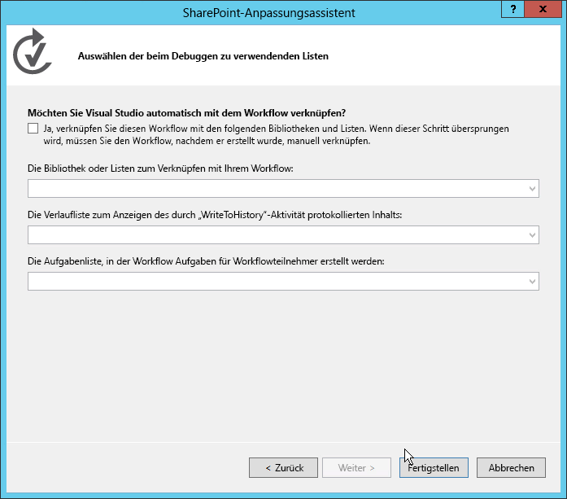
  

  

  
6. Fügen Sie das anschließend das Formular dem Visual Studio-Projekt hinzu, indem Sie mit der rechten Maustaste auf das Workflowelement im **Projektmappen-Explorer** klicken, und wählen Sie dann **Hinzufügen**, **Neues Element** aus.
    
    Dieser letzte Schritt ist wichtig, da hiermit das Dialogfeld **Neues Element hinzufügen** darüber informiert wird, dass es sich bei dem Kontext um ein Workflowelement handelt. Daraufhin werden im Dialogfeld **Neues Element hinzufügen** die beiden Projektelementvorlagen des Formulars (Initiierungsformular und Zuordnungsformular) als Optionen angezeigt, wie in Abbildung 2 dargestellt.
    

   **Abbildung 2: Auswählen der Vorlage für das Zuordnungsformular**

  

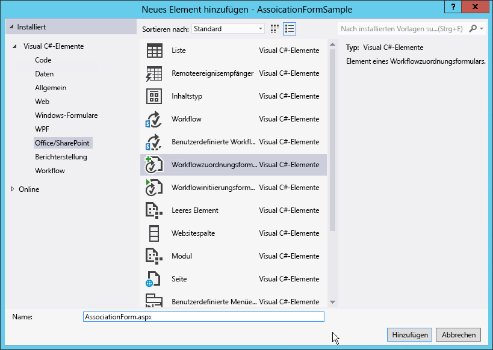
  

  

  
7. Wählen Sie das Element **Workflowzuordnungsformular** aus, und entfernen Sie die "1" von dem Feldnamen. Klicken Sie auf **Hinzufügen**, um den Vorgang abzuschließen.
    
  

### Aktualisieren von HTML und JavaScript im Standardzuordnungsformular

Nachdem das neue Formular dem Projekt hinzugefügt wurde, wird es in Visual Studio automatisch geöffnet. Zu diesem Zeitpunkt müssen Sie nur zwei Aktionen an dem Formular durchführen, damit es mit Ihrem Workflow kompatibel ist:
  
    
    

- Aktualisieren des HTML-Formulars, um die Datenelemente anzugeben, die Sie von den Benutzern erfassen müssen, und um anzugeben, wie das Formular gerendert werden soll
    
  
- Aktualisieren des standardmäßigen JavaScript-Codes, um die Werte aus dem aktualisierten Formular abzurufen und um die Eigenschaftsnamen den Namen der Argumente zuzuordnen, die von Ihnen im Workflow erstellt wurden.
    
  

1. Öffnen Sie das Formular, um den Code anzuzeigen.
    
  
2. Ermitteln Sie das im folgenden Codeausschnitt angezeigte Serversteuerelement:
    
  ```
  
<WorkflowServices:WorkflowAssociationFormContextControl ID="WorkflowAssociationFormContextControl1" runat="server" />
  ```


    Dieses Serversteuerelement führt zwei wichtige Aufgaben durch. Erstens fügt es die vom Zuordnungsformular benötigten JavaScript-Bibliotheken hinzu. Zweitens verwendet es die vom vorherigen Formular übermittelten Formularwerte und schreibt sie als verborgene HTML-Eingabesteuerelemente auf die Seite. Bei der vorherigen Seite handelte es sich um das SharePoint-Standardzuordnungsformular, d. h. das Formular, in dem der Benutzer die Workflowdefinition, den Zuordnungsnamen, die Workflowaufgabe und die Verlaufsliste sowie die Startoptionen angegeben hat. Dieses Formular verwendete eine HTTP POST-Anforderung, um zu dem benutzerdefinierten Zuordnungsformular zu gelangen, das dem Workflow hinzugefügt wurde. Da es sich um eine HTTP POST-Anforderung handelt, ist der Zugriff auf die Werte in dem Formular nicht möglich, weil die gesamte benutzerdefinierte Logik ohne serverseitigen Code implementiert werden muss. SharePoint stellt daher dieses Serversteuerelement zur Verfügung, um diese Werte aus der HTTP-Anforderungspipeline zu extrahieren und dieser Seite hinzuzufügen.
    
  
3. Führen Sie einen Bildlauf in der Quelldatei durch, bis Sie die HTML-Beispieltabelle gefunden haben, und ersetzen Sie durch den folgenden Code:
    
  ```XML
  <table>
    <tr>
      <td colspan="2">
        String:<br /><textarea id="strInput" rows="1" columns="50"/>
      </td>
    </tr>
    <tr>
        <td><button id="Save" onclick="return runAssocWFTask()">Save</button></td>
        <td><button id="Cancel" onclick="location.href = cancelRedirectUrl; return false;">Cancel</button></td>
    </tr>
</table>

  ```


    Diese Tabelle zeigt ein einfaches HTML-Textfeld, mit dem Informationen in die Workflowzuordnung übergeben werden. Beachten Sie, dass das Formular zwei Schaltflächen aufweist. Über diese Schaltflächen wird der Workflow gespeichert oder abgebrochen. Wenn Sie auf die Schaltfläche **Speichern** klicken, ruft der Workflow die JavaScript-Funktion **runAssocWfTask()** auf, die sich einige Zeilen weiter unten in der Quelldatei befindet. Dies muss als Nächstes geändert werden.
    
  

### Aktualisieren des Workflowdienste-JSOM zum Erstellen der Workflowzuordnung

Unmittelbar auf den HTML-Formularabschnitt in der Quelldatei folgt ein ungefähr 200 Zeilen umfassender  _ecmascriptshort_-Codeblock. Dieser Codeblock veranschaulicht die API-Implementierung des neuen Workflowdienste-JSOM (JavaScript Client Side Object Model) in SharePoint Server 2013. Dieser JavaScript-Code sollte weitestgehend unverändert bleiben, da er einige wichtige Aufgaben erfüllt:
  
    
    

- Er bestimmt, ob eine neue zugeordnete Workflowaufgabenliste erstellt werden muss, und erstellt diese, falls nötig.
    
  
- Er bestimmt, ob eine neue zugeordnete Workflowverlaufsliste erstellt werden muss, und erstellt diese, falls nötig.
    
  
- Er erstellt eine neue Workflowzuordnung mit dem angegebenen Namen, der Workflowdefinition, den Startoptionen und den zugeordneten Listen.
    
  
Der entscheidende Teil, mit dem Sie sich beim Erstellen der benutzerdefinierten Formulare befassen müssen, ist wo die Werte aus dem Formular erfasst und an die neue Zuordnung übergeben werden. Dies wird im folgenden Verfahren behandelt.
  
    
    

1. Suchen Sie im JSOM-Skriptblock der Workflowzuordnung nach der JavaScript-Funktion **associateWF()**.
    
  
2. Ermitteln Sie innerhalb des Skriptblocks für diese Funktion die Zeile, die ein neues Array namens **metadata** definiert:
  
    
    
 `var metadata = new Object();`
    
  
3. Fügen Sie anschließend eine Auflistung von Name-Wert-Paaren hinzu, die die Formularfelder darstellen, die Sie an SharePoint übergeben möchten. Für das benutzerdefinierte Formular in dieser Vorgehensweise benötigen Sie lediglich den folgenden JavaScript-Code. Aktualisieren Sie daher den Block, der die **metadata**-Variable festlegt, wie folgt:
    
  ```XML
  
var strInputValue = document.getElementById("strInput").value;
if (strInputValue) {
  metadata['AssociationFormValue'] = strInputValue;
}
  ```

4. An diesem Punkt ist das benutzerdefinierte Zuordnungsformular vollständig.
    
  

### Verwenden der Zuordnungsformularwerte im Workflow

Wenn das Formular vollständig ist, besteht der nächste Schritt darin, den Workflow so zu konfigurieren, dass die aus dem Zuordnungsformular übergebenen Werte verwendet werden. Ein aus dem Zuordnungsformular übergebener Wert wird als Konfigurationswert übergeben. Hierbei nutzen Sie eine spezielle Aktivität zum Extrahieren des Konfigurationswerts aus den Zuordnungsmetadaten des Workflows und speichern diesen in einer Variablen zur späteren Verwendung.
  
    
    

1. Öffnen Sie den Workflow in Visual Studio, navigieren Sie zur Registerkarte **Variablen**, und erstellen Sie eine neue Zeichenfolgenvariable namens **AssociationFormValue**, wie in Abbildung 3 gezeigt.
    
   **Abbildung 3: Erstellen der AssociationFormValue-Variablen**

  

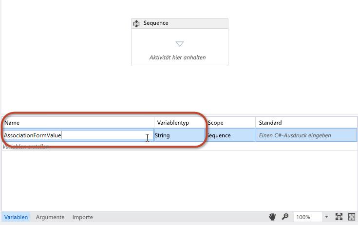
  

  

  
2. Verschieben Sie eine **GetConfigurationValue**-Aktivität mittels Drag &amp; Drop auf die Workflow-Designer-Oberfläche, und legen Sie die **Name**-Eigenschaft auf den Namen der im Formular verwendeten Metadateneigenschaft fest, wie in Abbildung 4 gezeigt.
    
   **Abbildung 4**

  

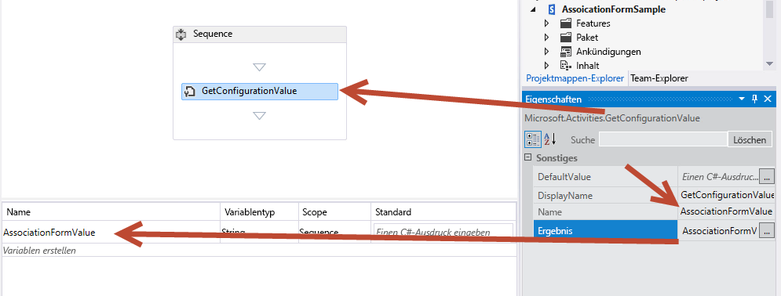
  

  

  
3. Legen Sie die **Result**-Eigenschaft auf den Namen der Variablen fest, wie in Abbildung 4 gezeigt.
    
    Diese Aktivität ruft den Wert der **AssociationFormValue**-Eigenschaft aus den Metadaten des Workflows ab und speichert ihn in der lokalen Variable. Um den Inhalt der Variablen anzuzeigen, fügen Sie dem Workflow eine **WriteToHistory**-Aktivität hinzu, und legen sie dessen **Message**-Eigenschaft fest, um den Wert der Variablen in die Verlaufsliste zu schreiben.
    
  
4. Sie haben die Schritte durchgeführt, wie notwendig sind, um die Formularwerte mit dem Workflow zu verknüpfen. Speichern Sie Ihre Arbeit, und testen Sie das Formular.
    
  

### Testen des benutzerdefinierten Zuordnungsformulars


1. Drücken Sie zum Testen des Workflows **F5**, oder klicken Sie auf die Schaltfläche **Start** in Visual Studio. Bei dieser Vorgehensweise wird davon ausgegangen, dass eine lokale Installation von SharePoint Server 2013 vorhanden ist. Visual Studio startet dann das Workflow Manager Test Service Host-Dienstprogramm und stellt den Workflow auf der Entwicklerwebsite bereit.
    
  
2. Erstellen Sie die Zuordnung, indem Sie zur Liste **Ankündigungen** navigieren. Wählen Sie dann auf dem Menüband die Registerkarte **Liste** aus, und klicken Sie anschließend auf die Schaltfläche **Workfloweinstellungen**, **Workfloweinstellungen**. Klicken Sie dann auf den Link **Workflow hinzufügen**. An diesem Punkt wird Ihnen das SharePoint-Zuordnungsformular vorgelegt.
    
  
3. Wählen Sie im Zuordnungsformular den Workflow aus, den Sie testen möchten, und legen Sie einen Namen fest.
    
  
4. Entscheiden Sie sich dafür, neue Aufgaben- und Verlaufslisten zu erstellen, legen Sie fest, dass der Workflow manuell gestartet wird, und klicken Sie dann auf **Weiter**.
    
  
5. Da Sie ein benutzerdefiniertes Zuordnungsformular in der Workflowdefinition angegeben haben, wird das in Abbildung 5 dargestellte benutzerdefinierte Zuordnungsformular geöffnet.
    
   **Abbildung 5: Das benutzerdefinierte Workflowzuordnungsformular**

  

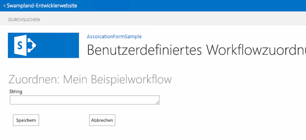
  

  

  
6. Geben Sie einen Wert in das Formularfeld ein, und klicken Sie auf **Speichern**. Dadurch wird die Zuordnung erstellt und der benutzerdefinierte Wert in den Metadaten für die Workflowzuordnung gespeichert.
    
  
7. Um zu überprüfen, ob der Workflow den Wert aus den Konfigurationseinstellungen extrahieren kann, navigieren Sie zurück zur Liste **Ankündigungen**, und erstellen Sie ein neues Element. Nachdem Sie das Element erstellt haben, starten Sie den benutzerdefinierten Workflow manuell. Sobald der Workflow gestartet wurde, navigieren Sie zur Workflowinstanz-Statusseite des Elements, und überprüfen Sie, ob der Wert in die Verlaufsliste geschrieben wurde, wie in Abbildung 6 gezeigt.
    
   **Abbildung 6: Workflowstatusseite**

  

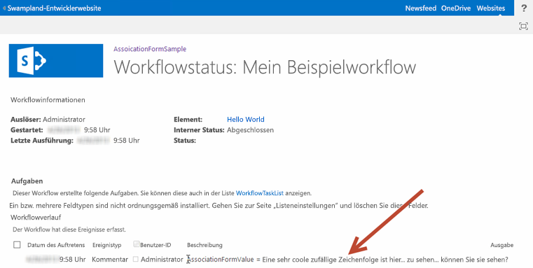
  

  

  

## Vorgehensweise: Erstellen eines benutzerdefinierten Initiierungsformulars
<a name="sec4"> </a>

Bei dieser Vorgehensweise wird gezeigt, wie ein benutzerdefiniertes Zuordnungsformular erstellt und verwendet wird, um Informationen von Benutzern zu erfassen, wenn der Workflow manuell gestartet wird.
  
    
    

### Erstellen eines neuen Workflowprojekts


1. Erstellen Sie zunächst einen benutzerdefinierten Workflow mithilfe von Visual Studio 2012, und stellen Sie sicher, dass Sie Zugriff auf eine SharePoint Server 2013-Entwicklerwebsite haben.
    
  
2. Erstellen Sie ein neues SharePoint-Projekt, das als SharePoint-gehostete App konfiguriert ist.
    
  
3. Fügen Sie dem Projekt eine neue **Ankündigungsliste** hinzu. Diese Liste wird als Container für Elemente verwendet, die den Workflow auslösen.
    
  
4. Fügen Sie danach dem Projekt ein Workflowelement hinzu, indem Sie mit der rechten Maustaste im **Projektmappen-Explorer** auf das Projektsymbol klicken. Wählen Sie dann **Hinzufügen**, **Neues Element** aus, und wählen Sie dann im Dialogfeld **Neues Element hinzufügen** das Projektelement **Workflow** aus.
    
  
5. Legen Sie für den neuen Workflow den Namen "SampleInitFormWorkflow" fest, und klicken Sie auf **Weiter**.
    
  
6. Wenn Sie dazu aufgefordert werden, legen Sie fest, dass das neue Workflowelement ein **Listenworkflow** ist, der mit der Liste **Ankündigungen** verknüpft ist. Legen Sie fest, dass der Workflow manuell gestartet wird. (Beachten Sie, dass das Initiierungsformular nicht angezeigt wird, wenn der Workflow automatisch gestartet wird.)
    
  
7. An diesem Punkt wird das Projekt im **Projektmappen-Explorer** angezeigt, wie in Abbildung 7 gezeigt. Beachten Sie, dass einige Element wie **WorkflowHistoryList** und **WorkflowTaskList** automatisch hinzugefügt wurden, als die Zuordnung erstellt wurde.
    
   **Abbildung 7. Darstellung des Projekts im Projektmappen-Explorer**

  

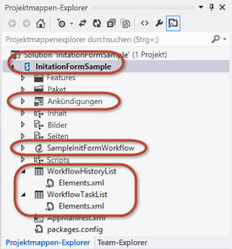
  

  

  

### Hinzufügen von Argumenten zum Erfassen von Initiierungsformularwerten

Das Workflowinitiierungsformular fordert Benutzer zur Angabe von zwei Informationen auf, die zum Starten des Workflows benötigt werden: eine Zufallszeichenfolge sowie ein Benutzer, der mit dem Personenauswahl-Steuerelement ausgewählt wird. Um dieses zu aktivieren, konfigurieren Sie zwei Argumente, deren Werte die Workflowdienste-CSOM-API aus dem Formular übernimmt, wenn dieses eingereicht wird.
  
    
    

1. Klicken Sie im Workflow-Designer am unteren Rand des Bildschirms auf die Registerkarte **Argumente**, und erstellen Sie zwei Argumente, wie in Abbildung 8 gezeigt. Legen Sie für die Argumente die Namen **UserLoginName** und **SomeRandomString** fest.
    
   **Abbildung 7: Konfigurieren der Initiierungsformularargumente**

  

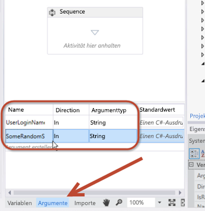
  

  

  
2. Legen Sie für beide Argumente den **Argumenttype** auf **String** fest. Legen Sie ebenfalls für beide Argumente die **Richtung** auf **In** fest, wie in Abbildung 8 gezeigt.
    
    Sie können sich die **Direction**-Eigenschaft als eine Eigenschaft in einer .NET-Klasse vorstellen. Wenn die Richtung auf **In** festgelegt ist, hat die Eigenschaft eine öffentliche **Set**-Methode, aber eine private **Get**-Methode. Wenn die Richtung auf **Out** festgelegt ist, hat die Eigenschaft eine öffentliche **Get**-Methode, aber eine private **Set**-Methode. Ist die Richtung auf **In/Out** festgelegt, ist sowohl die **Get**- als auch die **Set**-Methode öffentlich.
    
  
3. Zum Anzeigen des Inhalts dieser beiden Argumente fügen Sie dem Workflow ein Paar von **WriteToHistory**-Aktivitäten hinzu, und konfigurieren Sie diese so, dass die Inhalte der Argumente in die Verlaufsliste geschrieben werden.
    
    Sie können diese Argumente auf die gleiche Weise verwenden wie Variablen. Beachten Sie jedoch, dass Sie beim Festlegen der **Richtung** deren Lese-/Schreibfunktion bestimmen. Abbildung 9 zeigt, wie eine dieser Aktivitäten möglicherweise aussieht, nachdem sie konfiguriert wurde:
    

   **Abbildung 9: Konfigurieren einer WriteToHistory-Aktivität zum Testen von Argumenten**

  

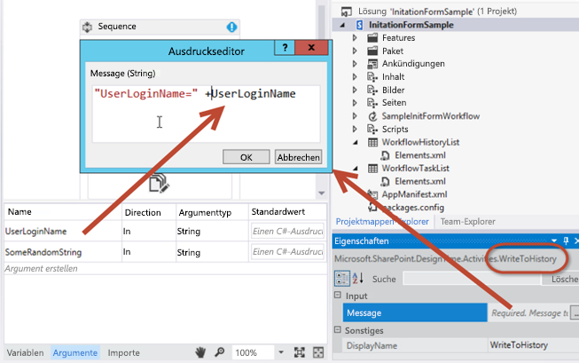
  

  

  

### Hinzufügen des Initiierungsformular-Projektelements

Nachdem der Workflow so konfiguriert wurde, dass zwei Eingabeargumente aus dem Formular akzeptiert werden, besteht der nächste Schritt darin, das Formular dem Projekt hinzuzufügen.
  
    
    

1. Klicken Sie mit der rechten Maustaste im **Projektmappen-Explorer** auf das Workflowelement, und wählen Sie dann **Hinzufügen** und anschließend **Neues Element** aus.
    
  
2. Wählen Sie das Projektelement **Workflowinitiierungsformular** aus, und entfernen Sie die Zahl "1" von dem Namen, sodass das Formular den Namen "InitForm.aspx" hat. Klicken Sie anschließend auf **Hinzufügen**. Daraufhin fügt Visual Studio die neue ASPX-Seite dem Modul **Seiten** hinzu, das bereits in der Projektstruktur vorhanden ist. Auf diese Weise wird sichergestellt, dass das Formular im Unterordner **Seiten** in der App bereitgestellt wird. Visual Studio hat darüber hinaus Eigenschaften im Workflowelement geändert.
    
  
3. Wählen Sie das Workflowelement **SimpleInitFormWorkflow** im **Projektmappen-Explorer** aus, und achten Sie im Raster **Eigenschaften** darauf, welche Eigenschaften im Initiierungsformular festgelegt wurden. Eine dieser Eigenschaften zeigt auf den relativen Websitepfad des Formulars, das soeben zum Modul **Seiten** hinzugefügt wurde.
    
  

### Überprüfen und Aktualisieren des standardmäßigen Initiierungsformulars

Nachdem das neue Initiierungsformular dem Projekt hinzugefügt wurde, wird es von Visual Studio 2012 automatisch geöffnet. Ebenso wie beim Zuordnungsformular müssen auch für dieses neue Initiierungsformular zwei Aufgaben durchgeführt werden:
  
    
    

- Aktualisieren des HTML-Formulars, um Datenelemente anzugeben, die vom Benutzer erfasst werden müssen, und um anzugeben, wie das Formular präsentiert werden soll
    
  
- Aktualisieren des standardmäßigen JavaScript-Blocks, um Benutzereingabewerte aus dem Formular abzurufen und die Eigenschaftsnamen den Namen der Argumente zuzuordnen, die im Workflow erstellt wurden
    
  

> **HINWEIS**
> Beachten Sie, dass in der Quelldatei der erste ASP.NET-Inhaltsplatzhalter, **PlaceHolderAdditionalPageHead**, Verweise auf die Workflowdienste-CSOM-Bibliothek ( **sp.workflowservices.js** ) und die wesentlichen SharePoint Server 2013-CSOM-Bibliotheken ( **sp.js** und **sp.runtime.js** ) enthält. Unmittelbar auf den Codeabschnitt folgt ein serverseitiger Kommentar, der einen kommentierten Hinweis enthält. Dieser in Abbildung 10 gezeigte Kommentar ist irrelevant und kann ignoriert werden.
  
    
    


**Abbildung 10: Zu ignorierende Codekommentar**

  
    
    

  
    
    
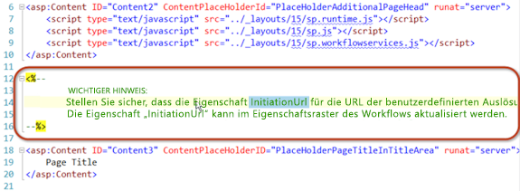
  
    
    

### Aktualisieren des HTML-Formulars


1. Führen Sie in der Codedatei des Formulars einen Bildlauf nach unten durch, bis Sie den ASP.NET-Inhaltsplatzhalter  `PlaceHolderMain` erreicht haben. Beachten Sie, dass der erste Teil dieses Abschnitts eine HTML-Tabelle mit drei Formularfeldern enthält. Es werden jedoch nur zwei Felder benötigt.
    
  
2. Aktualisieren Sie diese HTML-Tabelle, indem Sie sie durch folgenden Code ersetzen:
    
  ```
  
<table>
  <tr>
    <td>
      String:<br />
      <input type="text" id="strInput" />
    </td>
  </tr>
  <tr>
    <td>
      User Picker:<br />
      <SharePoint:PeopleEditor AllowEmpty="false" ValidatorEnabled="true" MultiSelect="false" ID="peoplePicker" runat="server" />
    </td>
  </tr>
  <tr>
    <td>
      <input type="button" name="startWorkflowButton" value="Start" onclick="StartWorkflow()" />
      <input type="button" name="cancelButton" value="Cancel" onclick="RedirFromInitForm()" />
      <br />
    </td>
  </tr>
</table>

  ```

Die Tabelle enthält nun zwei Eingabesteuerelemente. Beim ersten handelt es sich um ein standardmäßiges HTML-Textfeld mit der ID **strInput**. Das zweite ist ein SharePoint-Personenauswahl-Steuerelement mit der ID **peoplePicker**. Letzteres ist ein serverseitiges Steuerelement. Es ist jedoch auf der Seite zulässig, da es auf jedem SharePoint Server 2013-Computer bereitgestellt wurde. Außerdem wird auf das Steuerelement am oberen Rand des Initiierungsformulars verwiesen.
  
    
    
Beachten Sie nun die im Formular die beiden Schaltflächen **Start** ("startWorkflowButton") und **Abbrechen** ("cancelButton"). Wenn Sie auf die Schaltfläche **Start** klicken, wird die **StartWorkflow()**-JavaScript-Funktion aufgerufen. Die Funktion selbst befindet sich in einem Skriptblock weiter unten in der Formulardatei und wird bei der nächsten Änderung, die wir durchführen müssen, berücksichtigt.
  
    
    

### Aktualisieren des JSOM-Codeblocks zum Starten des Workflows


1. Ermitteln Sie den JavaScript-Codeblock, der unmittelbar auf die HTML-Tabelle folgt, die wir soeben geändert haben. Der Code in dem Skriptblock wird weitestgehend unverändert belassen.
    
    Dieser Code zeigt die enorme Leistungsfähigkeit und Flexibilität der API des Workflowdienste-JSOM (JavaScript Client Side Object Model), die in SharePoint Server 2013 implementiert wurde. Im Allgemeinen führt der Code die folgenden Schritte aus.
    
  
2. Suchen Sie die folgende Codezeile:  `var wfParams = new Object();`
    
  
3. Ersetzen Sie unmittelbar nach dieser Zeile den vorhandenen Code durch Ihren eigenen Code, um Werte aus den beiden HTML-Formularfeldern abzurufen, die wir kurz zuvor erstellt haben: **strInput** und **peoplePicker**. Führen Sie hierzu den folgenden Verweis auf die jQuery-Bibliothek dem **PlaceHolderAdditionalPageHead**-Element im HTML-Markup hinzu. Dadurch wird es einfacher, Werte aus dem Formular abzurufen.
    
  ```
  
<script type="text/javascript" src="../Scripts/jquery-1.8.2.min.js"></script>
  ```

4. Kehren Sie nun wieder zu dem Teil des JSOM-Skriptblocks zurück, in dem die Parameter aus dem Formular erfasst werden. Ersetzen Sie den vorhandenen JavaScript-Code durch den folgenden Code:
    
  ```
  var wfParams = new Object();
// get people picker value
var html = $("ctl00_PlaceHolderMain_peoplePicker_upLevelDiv");
wfParams['UserLoginName'] = $("#divEntityData", html).attr("key");

// get string input
var strInputValue = $("strInput").value;
wfParams['SomeRandomString'] = strInputValue

  ```

5. Speichern Sie die Änderungen.
    
  
Der Code, den wir im vorherigen Verfahren geändert haben, übernimmt viele Aufgaben:
  
    
    

- Er ruft die folgenden drei Parameter aus der Abfragezeichenfolge in der URL ab:
    
  - Die Element-ID, mit der die neue Workflowinstanz verknüpft wird, gespeichert in der JavaScript-Variablen **[itemId]**.
    
  
  - Die ID der Workflowzuordnung der aktuellen Website, Liste oder Dokumentbibliothek, gespeichert in der JavaScript-Variablen **[subscriptionId]**.
    
  
  - Die URL des Benutzers, gespeichert in der JavaScript-Variablen **[redirectUrl]**. Dies ist der Ort, an den die Benutzer geleitet werden, nachdem sie das Formular ausgefüllt haben und der Workflow gestartet wurde.
    
  
- Er erstellt ein Array von an den Workflow zu sendenden Eigenschaften, gespeichert in der JavaScript-Variablen **[wfParams]**. Dies sind die Werte, die Sie aus dem Formular erfassen müssen. Zudem handelt es sich hierbei um den zweiten der beiden Mindestschritte, die zur Bearbeitung des benutzerdefinierten Initiierungsformulars erforderlich sind.
    
  
- Er bezieht Verweise auf einen SharePoint-CSOM-Clientkontext sowie die erforderlichen Workflowdienste.
    
  
- Sobald das Skript mit dem Workflowdienste-Abonnementdienst verbunden ist (referenziert in der Variablen **[subscriptionService]** ), führt es eine der folgenden Aufgaben durch:
    
  
- 
  - Wenn das Skript eine Element-ID aus der Abfragezeichenfolge im ersten Schritt erhalten hat, startet es eine neue Instanz des Workflows für das angegebene Listenelement, indem die **[startWorkflowOnListItem()]** -Funktion vom Workflowdienste-Instanzdienst aus aufgerufen wird.
    
  
  - Wurde keine ID gefunden, startet es eine neue Instanz des Workflows auf der aktuellen Website, indem die **[startWorkflow()]** -Funktion vom Workflowdienste-Instanzdienst aus aufgerufen wird.
    
  

### Testen des benutzerdefinierten Initiierungsformulars

Testen Sie den Workflow, indem Sie F5 drücken oder auf die Schaltfläche **Start** in Visual Studio 2012 klicken. Wenn Sie den Test in einer lokalen Installation von SharePoint Server 2013 durchführen , startet Visual Studio 2012 das Workflow Manager Test Service Host-Dienstprogramm und stellt den Workflow auf der Entwicklerwebsite bereit. Nach kurzer Zeit wird die Entwicklerwebsite geöffnet.
  
    
    
Navigieren Sie zu der Liste **Ankündigungen**, und erstellen Sie ein neues Element. Nachdem das Element erstellt wurde, starten Sie den benutzerdefinierten Workflow.
  
    
    
Da die Workflowdefinition einen Verweis auf ein Initiierungsformular enthält, wird der Benutzer zuerst zu diesem Formular geleitet. Geben Sie die erforderlichen Werte ein, und klicken Sie dann auf die Schaltfläche **Start**. Dadurch wird der JavaScript-Code auf der Seite ausgelöst, und die Workflowinstanz wird gestartet, wie in Abbildung 11 gezeigt.
  
    
    

**Abbildung 11: Auslösen des Workflows**

  
    
    

  
    
    
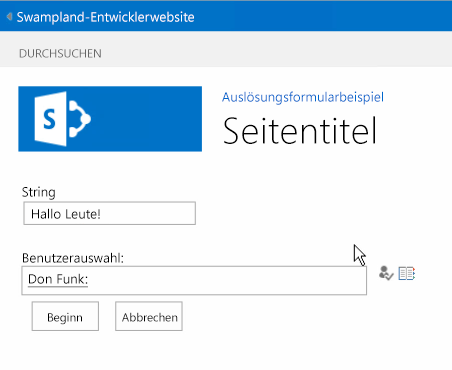
  
    
    
Nachdem der Workflow gestartet wurde, leitet die Seite den Benutzer zurück zur Ursprungsseite. Geben Sie dem Workflow etwas Zeit zum Starten, und navigieren Sie dann zurück zu dem Element, und zeigen Sie die Statusseite der Workflowinstanz an. Beachten Sie, dass die Verlaufsliste die Werte enthält, die in dem Formular übermittelt und dann an SharePoint gesendet wurden, nachdem die Workflowinstanz über das Workflowdienste-JSOM erstellt wurde.
  
    
    

**Abbildung 12: Abschließend des Workflows**

  
    
    

  
    
    
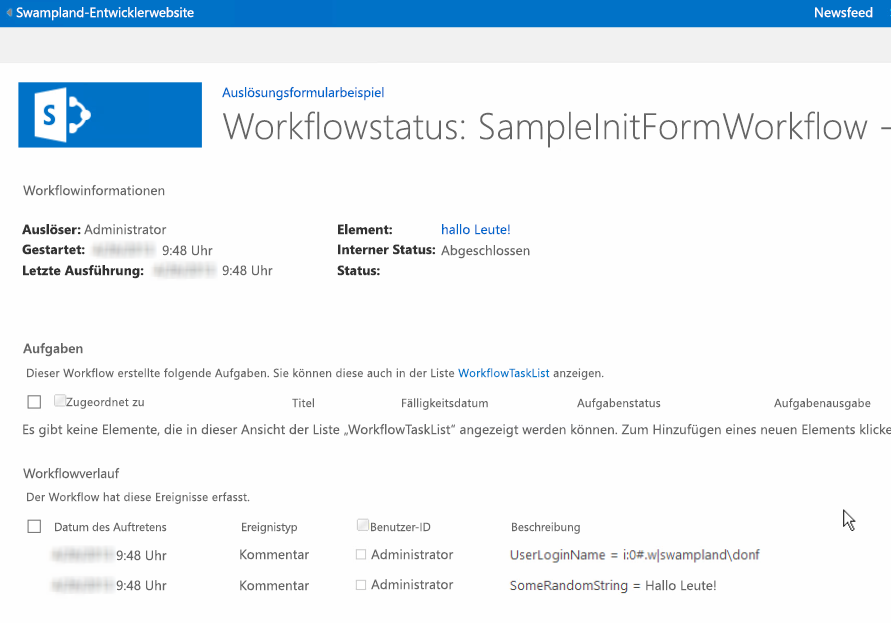
  
    
    

  
    
    

  
    
    

## Schlussbemerkung
<a name="sec6"> </a>

In SharePoint 2013 wurden zahlreiche Verbesserungen bei Workflows eingeführt. In diesem Artikel wurden die Änderungen im Zusammenhang mit Workflowformularen, die sich aufgrund der Änderungen an der Workflowarchitektur in SharePoint Server 2013 ergeben, detailliert behandelt. Zudem wurde in diesem Artikel gezeigt, wie benutzerdefinierte Zuordnungsformulare und Initiierungsformulare erstellt werden, mit denen die anspruchsvollen Anforderungen bei der Automatisierung der Geschäftsprozesse von heute mithilfe von Visual Studio 2012 erfüllt werden können.
  
    
    

## Zusätzliche Ressourcen
<a name="sec7"> </a>


-  [Zuordnungs- und -Initiierungsformulare für Workflows (SharePoint Foundation)](http://msdn.microsoft.com/de-de/library/office/ms481192%28v=office.14%29.aspx)
    
  
-  [Arbeiten mit dem clientseitigen Objektmodell in SharePoint 2013-Workflowdiensten](working-with-the-sharepoint-2013-workflow-services-client-side-object-model.md)
    
  
-  [Anpassen einer Listenansicht in Add-Ins für SharePoint durch clientseitiges Rendering](http://msdn.microsoft.com/library/8d5cabb2-70d0-46a0-bfe0-9e21f8d67d86%28Office.15%29.aspx)
    
  

