# Gewusst wie: Erstellen von SharePoint 2013-Workflows mit Visual Studio
Erfahren Sie mehr über die Grundlagen des Erstellens eines SharePoint-Workflows in der neuen SharePoint 2013- Workflowplattform.
 **Bereitgestellt von:** [Andrew Connell](http://social.msdn.microsoft.com/profile/andrew%20connell%20%5bmvp%5d/),  [AndrewConnell.com](http://www.andrewconnell.com)
  
    
    

  
    
    

> **HINWEIS**
> Dieser Artikel enthält ein durchgängiges Codebeispiel, das Sie beim Folgen des Artikels oder als Grundlage für eigene SharePoint-Workflowprojekte verwenden können. Den herunterladbaren Code finden Sie hier: LINK. 
  
    
    

  
    
    

  
    
    
Microsoft hat in SharePoint 2013 einen ganz anderen Ansatz für Workflows umgesetzt als in früheren Versionen. SharePoint-Workflows basieren jetzt auf Windows Workflow Foundation 4, und ihre Ausführung wird von einer neuen Komponente namens Workflow-Manager gesteuert, die extern von SharePoint ausgeführt wird.Workflow-Manager übernimmt die Rolle als Host für die Windows Workflow Foundation-Runtime und alle erforderlichen Dienste in einer hoch verfügbaren und skalierbaren Weise. Er nutzt Service Bus für Leistung und Skalierbarkeit und wird bei Bereitstellung in einer lokalen Bereitstellung exakt auf dieselbe Weise ausgeführt wie bei einer Bereitstellung an einen Cloud-basierten Dienst wie Office 365, da er für die Weitergabe der gesamten Workflowausführung und zugehöriger Aufgaben an die Workflow-Manager-Farm konfiguriert ist.Die drastische Änderung in der Workflowarchitektur machte einige Änderungen an den beiden primären Workflowerstellungstools für das Erstellen von benutzerdefinierten Workflows - Visual Studio und SharePoint Designer - erforderlich. In diesem Artikel wird die Verwendung von Visual Studio 2012 als Workflowerstellungstool zum Erstellen benutzerdefinierter Workflows zur Verwendung in **sp15allshort** -Bereitstellungen dargestellt, sowohl für lokale als auch für Office 365-Bereitstellungen
## Workflowtypen in Visual Studio 2012

Während SharePoint Designer 2013 nur Workflows erstellen kann, die aus Phasen bestehen, unterstützt Visual Studio einen anderen leistungsstarken Workflowtyp: den Zustandsautomatenworkflow. Effektiv unterstützen die Visual Studio 2012-Workflowentwicklungsumgebungen (und Visual Studio 2013) damit drei Arten der Workflowentwicklung: sequenziell, Flussdiagramm und Zustandsautomat.
  
    
    

### Sequenziell

Ein sequenzieller Workflow folgt einem bestimmten Pfad. Möglicherweise gibt es Entscheidungszweige und Schleifen oder der Workflow hat keinen Endpunkt, aber es ist einfach, dem vorhersagbaren Pfad im Entwurfsprozess zu folgen. Tatsächlich beginnen alle Workflows auf diese Weise, wenn Sie die Projektvorlage **Workflow** in Visual Studio verwenden.
  
    
    
Ein sequenzieller Workflow enthält eine einzelne **Sequence**-Aktivität, in der eine beliebige Anzahl von Aktivitäten enthalten ist. Einige dieser Aktivitäten könnten weitere **Sequence**-Aktivitäten sein, die Sie verwenden, um eine Reihe kleinerer Schritte zu gruppieren.
  
    
    

### Flussdiagramm

Im Flowchartworkflow kann der Ausführungspfad gemäß den von Ihnen angegebenen Bedingungen in verschiedene Bereiche übergehen, wie in Abbildung 1 gezeigt. Die Flussdiagrammaktivität wird normalerweise zusammen mit der zugehörigen FlowDescision- und FlowSwitch-Aktivität in eine Sequence-Aktivität platziert und agiert entweder wie eine herkömmliche **if**-Aussage oder wie eine **switch**-Aussage in gängigen Programmiersprachen. 
  
    
    
Das Phasenkonstrukt in einem SharePoint Designer 2013-basierten Workflow basiert auf den Grundsätzen eines Flussdiagramms. Diese Arten von Workflows haben im Gegensatz zu einem sequenziellen Workflow keinen vorgeschriebenen Pfad, in dem sie folgen. Stattdessen bestimmen die Dinge, die während des Workflows geschehen den Pfad, dem der Workflow folgt.
  
    
    

**Abbildung 1: Flussdiagrammworkflow in Visual Studio 2012**

  
    
    

  
    
    
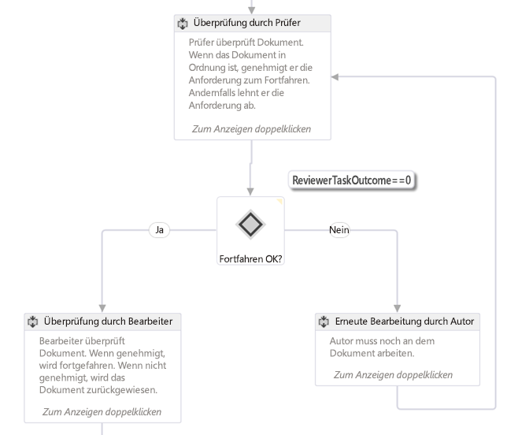
  
    
    

    
> **HINWEIS**
> Sie finden den in Abbildung 1 dargestellten Workflow als Workflowbeispiel hier auf MSDN:  [SharePoint 2013: Genehmigungsworkflow, der ein benutzerdefiniertes Initiierungsformular verwendet](http://code.msdn.microsoft.com/officeapps/SharePoint-2013-Approval-f5ac5eb2). 
  
    
    

### Zustandsautomat

Zustandsautomatworkflows folgen normalerweise wie Flussdiagrammsorkflows keinem bestimmten Ausführungspfad. Stattdessen bestehen sie aus zwei oder mehr Zuständen, wie in Abbildung 2 dargestellt. 
  
    
    

**Abbildung 2: Zustandsautomatworkflow in Visual Studio 2012**

  
    
    

  
    
    
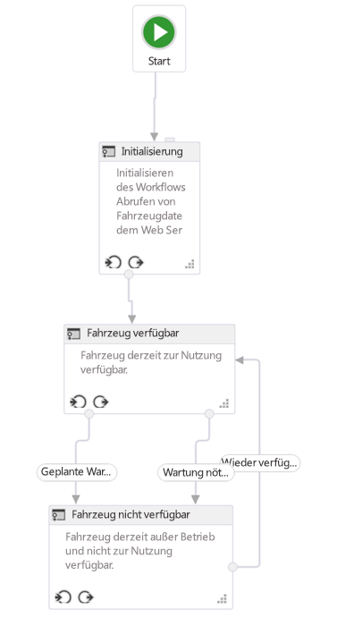
  
    
    

    
> **HINWEIS**
> Sie finden den in Abbildung 2 dargestellten Workflow als Workflowbeispiel hier auf MSDN:  [SharePoint 2013: Von Aktionen und Ereignissen abhängiges Weiterleiten von Workflows zu Zuständen](http://code.msdn.microsoft.com/officeapps/SharePoint-2013-Route-25a25d87). 
  
    
    

Stellen Sie sich jeden Zustand als einen kleineren Workflow vor, der mehrere Workflowaktivitäten enthält. Sie können festlegen, dass bestimmte Aktivitäten gestartet werden, wenn der Workflow in einen bestimmten wechselt oder diesen verlässt. Was Zustandsautomatcomputer wirklich interessant macht, sind die Übergänge, die Sie definieren können. Jeder Zustand kann einen oder mehrere Übergänge haben, die dem Workflowmodul mitteilen, wie der Wechsel von einem Zustand zu einem anderen erfolgt. 
  
    
    
Der Workflow ist immer in einem der Zustände in einen Zustandsautomatworkflow. Ein Übergang gibt den Auslöser für den Workflow zum Wechseln von einem Zustand in einen anderen vor. Viele ziehen Zustandsautomatworkflows den anderen Workflowtypen vor, da sie reale Geschäftsprozesse besser spiegeln können. Die Workflowtypen können jedoch schnell kompliziert werden.
  
    
    

## Oberfläche für die Workflowentwicklung in Visual Studio 2012

Beim Hinzufügen eines neuen Workflows zu einem SharePoint-Projekt fügt die Vorlage eine einzelne Sequenz-Aktivität hinzu, die als Hauptcontainer dient. Wenn Sie einen Flussdiagramm- oder Zustandsautomatworkflow erstellen möchten, löschen Sie diese Standardaktivität einfach und ziehen Sie eine StateMachine- oder Flowchart-Aktivität auf die Entwurfsoberfläche.
  
    
    
Vor dem Erstellen eines benutzerdefinierten Workflows sollten Entwickler ein gutes Verständnis für die Toolfenster und die Entwurfsoberfläche von Visual Studio 2012 haben. Viele der Elemente sind recht gängig, wie in Abbildung 3 dargestellt:
  
    
    

**Abbildung 3: Oberfläche für die Erstellung von Workflows in Visual Studio 2012**

  
    
    

  
    
    
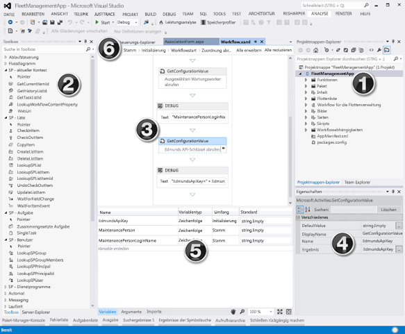
  
    
    
Die Oberfläche für die Workflowerstellung - d. h. der Workflow-Designer - verfügt über die folgenden wichtigen Elemente:
  
    
    

  
    
    

1. **Projektmappen-Explorer**, in dem Ihr Projekt als Dateistruktur angezeigt wird.
    
  
2. **Workflow-Toolbox** mit allen Aktivitäten, aus denen Sie einen Workflow zusammensetzen können. Sie ziehen Sie per Drag and Drop aus der Toolbox auf die Designeroberfläche.
    
  
3. **Workflow-Designeroberfläche**, in der Sie die Workflowelemente zusammenstellen und verknüpfen.
    
  
4. **Eigenschaftenraster**, in dem die Eigenschaften einer ausgewählten Aktivität oder eines Elements im **Projektmappen-Explorer** angezeigt werden. Verwenden Sie diese Option zum Festlegen oder Ändern der Eigenschaftswerte.
    
  
5. **Ausgabebereich**, in dem Informationen zu Aktivitätenelementen von Workflows angezeigt werden, z. B. Variablen, Argumente und Import.
    
  
6. **Registerkarten der Breadcrumb-Navigation**, die Ihnen ermöglichen, verschiedene Teile eines Workflows in der Entwicklungsphase ein- oder auszuzoomen.
    
  
Der **Ausgabebereich** (Nr. 5 in Abbildung 3) ist wichtig, da er Ihnen ermöglicht, alle Variablen in Ihrem Workflow im aktuellen Bereich anzuzeigen. Die Bereichsdefinition funktioniert genauso wie im objektorientierten Standardprogrammierungsentwurf: Eine Variable mit Bereichsdefinition im Stammverzeichnis ist für alle unteren Bereiche (wie Methoden innerhalb einer Klasse) zugänglich, aber eine Variable innerhalb eines niedrigeren Bereichs (wie eine Methode in einer Klasse) ist nur in diesem Bereich und dessen untergeordneten Bereichen, aber nicht in parallelen oder übergeordneten Bereichen zugänglich.
  
    
    
Klicken Sie auf die Registerkarte **Argumente**, um eine Liste der Argumente anzuzeigen, die verwendet werden, um Werte in den Workflow zu übergeben, z. B. von einem Initiierungsformular übergebene Werte.
  
    
    

## So erstellen Sie einen benutzerdefinierten Workflow

Stellen Sie zum Erstellen eines benutzerdefinierten Workflows mithilfe von Visual Studio 2012 oder höher sicher, dass Sie Zugriff auf eine SharePoint 2013-Entwicklerwebsite haben. In dieser exemplarischen Vorgehensweise wird empfohlen, dass Sie eine lokale SharePoint 2013-Installation verwenden. Der Grund dafür ist, dass Workflows, die lokal getestet werden, mithilfe der **WriteLine**-Aktivität Debuginformationen an das Konsolenhilfsprogramm zum Testen des Diensthosts schreiben kann. Dieses Hilfsprogramm ist im Lieferumfang der Office Developer Tools für Visual Studio 2013 enthalten, die Teil der Standardinstallation von Visual Studio 2012 und höher in den Editionen Professional, Premium und Ultimate sind.
  
    
    

### Erstellen eines neuen App-Projekts

1. Erstellen Sie in Visual Studio ein neues SharePoint-Add-Ins-Projekt, und konfigurieren Sie es als von SharePoint gehostete App.
    
  
2. Fügen Sie in diesem Projekt eine neue **Announcement**-Listeninstanz. Wir verwenden diese Liste als Container für Elemente, die wir zum Testen des Workflows verwenden möchten.
    
  
3. Fügen Sie dem Projekt ein Workflowelement hinzu, indem Sie im **Projektmappen-Explorer** mit der rechten Maustaste auf das Projektsymbol klicken und anschließend auf **Hinzufügen** und **Neues Element** klicken.
    
  
4. Wählen Sie im Dialogfeld **Neues Element hinzufügen** in der Kategorie **Office/SharePoint** das Projektelement **Workflow** aus, und nennen Sie es „Mein erster Workflow". Klicken Sie dann auf **Weiter**.
    
  
5. Wenn Sie vom **SharePoint-Anpassungs-Assistenten** aufgefordert werden, einen Namen einzugeben, behalten Sie den Standardwert bei, und legen Sie ihn dann auf einen **Listenworkflow** fest. Klicken Sie auf **Weiter**.
    
  
6. Aktivieren Sie auf der nächsten Seite des Assistenten das Kontrollkästchen zum Erstellen einer Zuordnung, und wählen Sie dann die soeben erstellte Liste **Announcements** aus. Wählen Sie **<Neu erstellen>** für den erforderlichen Workflowverlauf und die Aufgabenliste aus, und klicken Sie dann auf **Weiter**.
    
  
7. Aktivieren Sie auf der letzten Seite des Assistenten das Kontrollkästchen zum manuellen Starten des Workflows, lassen die beiden Optionen für den automatischen Start deaktiviert, und klicken Sie dann auf **Fertig stellen**. Visual Studio fügt automatisch die erforderlichen Elemente zum Projekt hinzu und lädt die Datei „Workflow.xaml" in den Designer, wie in Abbildung 4 dargestellt.
    
   **Abbildung 4: Standard-Designeroberfläche nach Hinzufügen des Workflowelements**

  

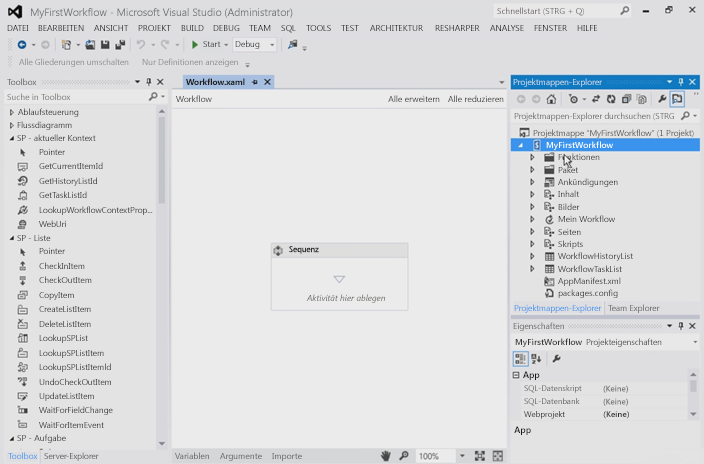
  

  

  

### Organisieren von Workflowschritten

Um einen bestimmten Geschäftsprozess zu automatisieren, können Workflows eine beliebige Anzahl von Aktivitäten enthalten, die Sie in einem Schritt oder einer **Sequenz** gruppieren. Wenn Sie jedoch zu viele dieser Aktivitäten in einer einzigen **Sequenz** gruppieren, wird der Workflow unübersichtlich und schwer zu folgen und zu debuggen. Das ist ganz ähnlich wie in einer üblichen Programmiersprache davon abgeraten wird, extrem lange und komplexe Methoden zu erstellen. Stattdessen sollten Sie Aktivitäten gruppieren, die zusammenarbeiten, um eine bestimmte Aufgabe in einer gängigen Sequenz durchzuführen.
  
    
    
Dieses Workflowbeispiel veranschaulicht die Methode der Segmentierung Ihrer Workflows. Fügen Sie in Ihrem neuen Projekt auf der Designeroberfläche der vorhandenen Sequence-Standardaktivität zwei neue Sequence-Aktivitäten hinzu, und nennen Sie sie in „Untergeordnete Sequenz 1" und „Untergeordnete Sequenz 2" um, wie in Abbildung 5 dargestellt. Ändern Sie außerdem den Namen der ursprünglichen Sequence-Aktivität zu „Root" (was jedoch nicht in Abbildung 5 gezeigt ist).
  
    
    

**Abbildung 5: Hinzufügen von untergeordneten Sequenzen zur Standard- oder Rootsequenz**

  
    
    

  
    
    
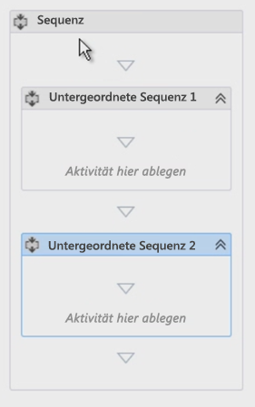
  
    
    

  
    
    

  
    
    

### Kommentieren des Workflows mithilfe von Anmerkungen

Bei Verwendung einer gängigen Programmiersprache wie C#, VB.NET oder C++ können Sie Ihren Code mithilfe der entsprechenden Kommentarbezeichner kommentieren. Das Kommentieren von Code ist wichtig für das Testen und Verwalten einer Codebasis. Nun, mit Visual Studio können Sie Ihre Workflowentwicklung auch mit einer Funktion namens **annotations** kommentieren.
  
    
    
Sie können eine bestimmte Workflowaktivität kommentieren, indem Sie die Aktivität auswählen und dann **Anmerkungen** und **Anmerkung hinzufügen** auswählen. Ein kleines Symbol mit invertierten Chevrons rechts neben der Titelleiste der Aktivität signalisiert, dass eine Anmerkung vorhanden ist. Zeigen oder klicken Sie auf das Symbol, um die Meldung anzuzeigen (siehe Abbildung 6). Sie haben die Möglichkeit, die Anmerkung an die Aktivität anzuheften, damit sie immer sichtbar ist, wie in Abbildung 6 dargestellt.
  
    
    

**Abbildung 6: Anmerkung zu einer Aktivität**

  
    
    

  
    
    
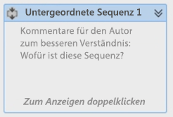
  
    
    

  
    
    

  
    
    

### Abrufen von Werten aus Listenelementen

Eine häufige Aufgabe, der Sie beim Erstellen von Workflows begegnen, ist das Abrufen von Eigenschaften eines Listenelements. Um diese Aufgabe auszuführen, verwenden Sie die Aktivität **LookupSPListItem**. Diese Aktivität für über die SharePoint 2013-REST-API einen Webdienstaufruf durch, um Informationen für das Listenelement zu suchen. Das folgende Verfahren zeigt, wie das geht:
  
    
    
Ziehen Sie zunächst eine **LookupSPListItem**-Aktivität aus der Toolbox, und legen Sie es sie in der Aktivität **Untergeordnete Sequenz 1** ab.
  
    
    
Nach dem Hinzufügen der Aktivität zum Designer müssen Sie einige Eigenschaften festlegen: **ListId** und **ItemId**. Diese Eigenschaften können so festgelegt werden, dass sie Informationen in einer beliebigen Liste suchen, aber mit den Verknüpfungen für **Aktuelle Liste** und **Aktuelles Element** weisen Sie Workflow-Manager an, diese Werte automatisch herauszufinden.
  
    
    
Da wir einen Webdienstaufruf vornehmen, ist der Rückgabewert aus dieser Aktivität, der in der **Result**-Eigenschaft dargestellt ist, vom Typ **DynamicValue**. Aus diesem Grund benötigen wir eine Variable dieses Datentyps zum Speichern der Ausgabe des Webdienstaufrufs. Dies ist ziemlich einfach, da ein großer Teil davon durch Klicken auf den Link **Eigenschaften abrufen** in der **LookupSPListItem**-Aktivität automatisch durchführt:
  
    
    

- Erstellen Sie zunächst eine neue Variable vom Typ **DynamicValue**.
    
  
- Anschließend wird diese neue Variable als Quelle für die Eigenschaft **Result** für die Aktivität **LookupSPListItem** festgelegt.
    
  
- Dann wird eine **GetDynamicValueProperties**-Aktivität für den Workflow festgelegt, sodass wir den Wert aus der Variablen abrufen können.
    
  
- Schließlich wird die Variable an die Eigenschaft **Source** für die Aktivität **GetDynamicValueProperties** gebunden.
    
  
Natürlich hätten Sie all dies manuell durchführen können, aber die Tools vereinfachen den Prozess. Falls erforderlich, können Sie die Namen der Variablen ändern.
  
    
    
Der Punkt ist natürlich, einige Werte aus dem Listenelement abzurufen, die den Workflow ausgelöst haben: In der Spalte „Zugewiesen zu" sind die Werte dieser Eigenschaften an zuvor erstellte Variablen gebunden, oder verwenden Sie den Link „Variablen auffüllen", über den die Variablen automatisch erstellt werden.
  
    
    

1. Klicken Sie in der Eigenschaft **Properties** für die Aktivität **GetDynamicValueProperties** auf die Schaltfläche mit den Auslassungspunkten [ **...**], um das Dialogfeld **Eigenschaften** zu öffnen, wie in Abbildung 7 gezeigt.
    
   **Abbildung 7: Extrahieren von Werten über das Dialogfeld „Eigenschaften"**

  

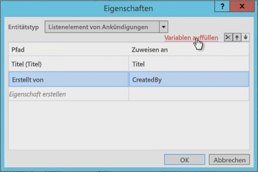
  

  

  
2. Ändern Sie dann den **Entitätstyp** so, dass er dem Typ des Elements entspricht, in diesem Fall dem Listenelement **Listenelement von Ankündigungen**.
    
  
3. Wählen Sie die zwei Eigenschaften zum Abrufen auf: die Felder **Title** und **Created By**.
    
  
4. In der Spalte **Zuweisen zu** binden Sie diese Eigenschaften an die erstellten Variablen. Alternativ können Sie den Link **Variablen auffüllen** verwenden, über den die Variablen automatisch zugewiesen werden.
    
  
Beachten Sie in Abbildung 7, wie das Tool die Variablen erstellt und sogar die Datentypen ordnungsgemäß zugeordnet hat. Beachten Sie außerdem, dass das Feld **Erstellt von** eine ganze Zahl ist. Es ist nicht wirklich sinnvoll, dem Benutzer eine Zahl für den Autor anzeigen, oder? Dieses Problem wird später im Workflow behoben.
  
    
    

### Abrufen von Benutzereigenschaften

Eine weitere gängige Aufgabe in der Entwicklung von benutzerdefinierten Workflows ist die Suche nach Benutzern. Unser Workflow weiß beispielsweise derzeit, wer das Ankündigungselement erstellt hat, kennt aber nur die ID. Diese ID ist die ID des Benutzers, der zur **Benutzerinformationsliste** der Website hinzugefügt wurde, die eine zwischengespeicherte Kopie der Profilinformationen ist. Wirklich erwünscht ist der Name oder Anmeldename.
  
    
    
Führen Sie folgende Schritte aus, um Benutzerinformationen abzurufen:
  
    
    

1. Benennen Sie unsere erste Sequenz ( **Untergeordnete Sequenz 1**) in „Elementeigenschaften abrufen" und die zweite Sequenz in „Autoreigenschaften abrufen" um.
    
    > **HINWEIS**
      > Stellen Sie sicher, dass für die Variable, die die Benutzer-ID enthält, die Bereichsdefinition für den gesamten Workflow und nicht nur für die Sequenz festgelegt wird, an der wir arbeiten. Lassen Sie uns den Bereich für die Variable jetzt ändern, wie in Abbildung 8 gezeigt. 

   **Abbildung 8: Ändern des Bereichs von Variablen**

  

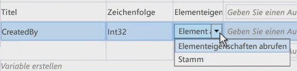
  

  

  
2. Um jetzt Benutzerinformationen abzurufen, ziehen Sie per Drag-and-Drop eine **LookupSpUser**-Aktivität in den Workflow, und benennen Sie sie in „Ankündigungsautor abrufen" um. Diese Aktivität ruft die SharePoint-REST-API auf und übergibt eine bestimmte ID. Überprüfen Sie, wie der REST-Dienst aussieht, indem Sie mithilfe des Browsers zu  `http://../_api/web/SiteUsers` navigieren. Notieren Sie auch die zurückgegebenen Eigenschaften, da wir diese in einem Moment benötigen.
    
  
3. Beachten Sie, dass jeder Benutzer über eine bestimmte URL verfügt, die seine ID zum Abrufen der Benutzerinformationen enthält. Beachten Sie außerdem, dass die Aktivität wahrscheinlich den Dienstoperator **GetUserById** aufruft und die ID des zu suchenden Benutzers übergibt. Übergeben Sie diese, indem Sie die Eigenschaft **PrincipalId** der Aktivität **LookupSPUser** als **CreatedBy**-Variable festlegen, die die ganze Zahl des Autors des Ankündigungselements ist.
    
  
4. Wie die Aktivität **LookupSPListItem** gibt die Aktivität **LookupSPUser** einen Wert des Typs **DynamicValue** zurück. Erstellen Sie deshalb eine Variable dieses Typs zum Zuweisen zu unserer Antwort, und binden Sie dann diese Variable an die **Result**-Eigenschaften der Aktivität **LookupSPUser**, wie in Abbildung 9 gezeigt.
    
   **Abbildung 9: Aktualisieren der Ausgabe der LookupSPUser-Aktivität**

  

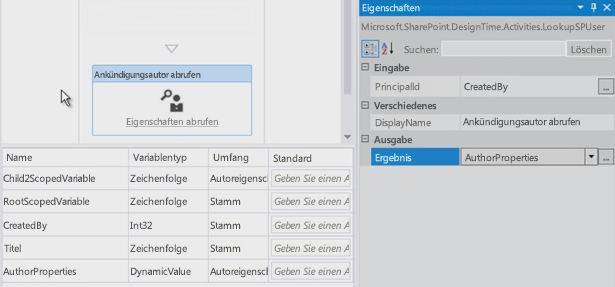
  

  

  
5. Wie bereits zuvor verwenden wir eine **GetDynamicValueProperties**-Aktivität zum Abrufen der Ergebnisse aus dem Wert **AuthorProperties**. Beachten Sie jedoch, dass **Entity Type** dieses Mal nicht über eine Option verfügt, die festgelegt werden kann. Das ist kein Problem, da die tatsächliche Webdienstantwort **LookupSPUser** im Browser angezeigt werden kann. Geben Sie zum Anzeigen den Pfad zu der Eigenschaft ein, die Sie suchen, in diesem Fall `d/results/(0)/LoginName`. Geben Sie dann eine andere ein, um den Anzeigenamen des Autors abzurufen, wie in Abbildung 10 dargestellt.
    
   **Abbildung 10. Abrufen von Werten aus der LookupSPUser-Aktivität**

  

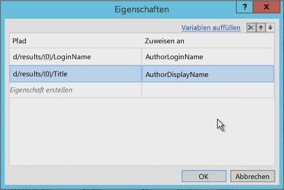
  

  

  

### Testen des Workflows

Lassen Sie uns abschließend den Workflow testen. Beginnen Sie, indem Sie zwei **WriteLine**-Aktivitäten hinzufügen. Mit diesen können wir die Inhalte unserer zwei Variablen anzeigen. Wenn der Workflow getestet wird, schreibt das Konsolenhilfsprogramm zum Testen des Diensthosts die beiden Werte aus, wie in Abbildung 11 gezeigt.
  
    
    

**Abbildung 11: Test mithilfe der Konsole zum Testen des Diensthosts**

  
    
    

  
    
    
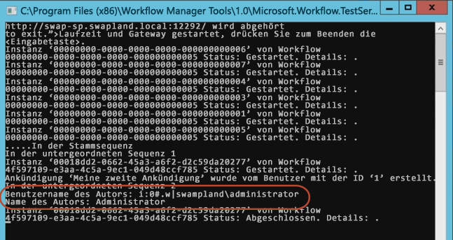
  
    
    

  
    
    

  
    
    

## Schlussbemerkung

In diesem Artikel wurden zunächst die verschiedenen Workflowtypen erläutert, die mithilfe von Visual Studio 2012 und höher für SharePoint 2013 erstellt werden können, wenn eine Verbindung zur einer Workflow-Manager-Farm hergestellt wurde. Als Nächstes wurde gezeigt, wie Sie einen Workflow erstellen, der nicht nur Werte aus dem Listenelement erfasst, das den Workflow auslöst, sondern auch eine gängige Aufgabe wie das Abrufen des Anmeldenamens und Anzeigenamens eines Benutzers mithilfe der **LookupSPUser**-Aktivität durchführt. Darüber hinaus wurden im Artikel einige bewährte Methoden für das Organisieren von Workflows und das Hinzufügen von Kommentaren mithilfe von Anmerkungen dargestellt.
  
    
    

## Zusätzliche Ressourcen

-  [Workflows in SharePoint 2013](workflows-in-sharepoint-2013.md)
    
  
-  [Bewährte Methoden für die SharePoint-Workflowentwicklung](sharepoint-workflow-development-best-practices.md)
    
  
-  [Beispiele für SharePoint 2013-Workflows](sharepoint-2013-workflow-samples.md)
    
  

  
    
    

