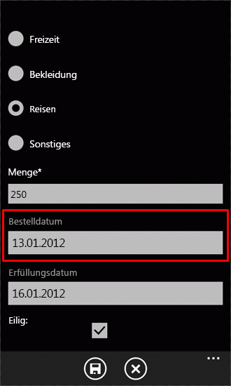
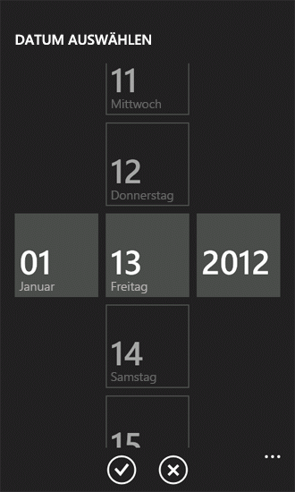

# Gewusst wie: Anpassen der Benutzeroberfläche einer SharePoint 2013-Listen-App für Windows Phone
Passen Sie die durch die Vorlage „Windows Phone - SharePoint-Listenanwendung" generierte Windows Phone-Benutzeroberfläche an.
SharePoint-Listen-Apps, die über die Vorlage „Windows Phone - SharePoint-Listenanwendung" erstellt werden, basieren auf dem Silverlight für Windows Phone-Framework. Alle von der Silverlight-Plattform auf einem Windows Phone bereitgestellten Funktionen stehen für Entwickler für die Anpassung der Benutzeroberfläche einer für ein Windows Phone entworfenen SharePoint-Listen-App zur Verfügung.
  
    
    


> **WICHTIG**
> Wenn Sie eine App für Windows Phone 8 entwickeln, müssen Sie Visual Studio Express 2012 anstelle von Visual Studio 2010 Express verwenden. Mit Ausnahme der Entwicklungsumgebung beziehen sich alle Informationen in diesem Artikel auf das Erstellen von Apps für Windows Phone 8 und Windows Phone 7. > Weitere Informationen finden Sie unter  [Vorgehensweise: Einrichten einer Umgebung für die Entwicklung von mobilen Anwendungen für SharePoint](how-to-set-up-an-environment-for-developing-mobile-apps-for-sharepoint.md). 
  
    
    


## Erstellen einer SharePoint-Listen-App für Anpassungen der Benutzeroberfläche
<a name="BKMK_CreatingSPListApp"> </a>

Bei den folgenden Verfahren wird davon ausgegangen, dass ein Server, auf dem SharePoint Server ausgeführt wird, über die Liste „Product Orders" verfügt, die aus der Vorlage „Benutzerdefinierte Liste" erstellt wurde, ähnlich wie die Beispielliste „Product Orders", die unter  [Vorgehensweise: Implementieren von Validierung von Business Logik und die Daten in einem Windows Phone-app für SharePoint 2013](how-to-implement-business-logic-and-data-validation-in-a-windows-phone-app-for-s.md) verwendet wird. Für die in diesem Thema verwendete Windows Phone-Beispiel-App wurden der Liste „Product Orders", auf der die App basiert, zusätzliche Felder hinzugefügt. Die geänderte Liste „Product Orders", die für die Zwecke der Beispiele in diesem Thema verwendet wird, wurde mit den Spalten und Felddtypen erstellt, die in Tabelle 1 aufgeführt sind.
  
    
    

**Tabelle 1: Geänderte Liste „Product Orders"**


|**Spalte**|**Typ**|**Erforderlich**|
|:-----|:-----|:-----|
|Product (d. h. Titel)  <br/> |Einzelne Textzeile (Text)  <br/> |Ja  <br/> |
|Description  <br/> |Einzelne Textzeile (Text)  <br/> |Nein  <br/> |
|Product Category  <br/> |Auswahl  <br/> |Nein  <br/> |
|Quantity  <br/> |Zahl  <br/> |Ja  <br/> |
|Order Date  <br/> |Datum und Uhrzeit (DateTime)  <br/> |Nein  <br/> |
|Fulfillment Date  <br/> |Datum und Uhrzeit (DateTime)  <br/> |Nein  <br/> |
|Rush  <br/> |Boolesch  <br/> |Nein  <br/> |
|Contact Number  <br/> |Einzelne Textzeile (Text)  <br/> |Nein  <br/> |
   
Befolgen Sie die Verfahren unter  [Vorgehensweise: Erstellen eine Windows Phone SharePoint 2013 Liste app](how-to-create-a-windows-phone-sharepoint-2013-list-app.md), um die Vorlage „Windows Phone - SharePoint-Listenanwendung" zu verwenden, um eine SharePoint-Listen-App als Anfangspunkt für die folgenden Benutzeroberflächenanpassungen zu verwenden. Geben Sie als Ziel-SharePoint-Liste für die App eine Liste an, die ein ähnliches Schema wie das in Tabelle 1 gezeigte hat.
  
    
    

## Ersetzen von TextBox-Steuerelementen durch DatePicker-Steuerelemente
<a name="BKMK_ReplacingControls"> </a>

Basierend auf dem von der Vorlage generierten Projekt sind die Felder in der Liste, die als **DateTime** -Felder festgelegt sind (z. B . das Feld **Order Date** in der Beispielliste „Product Orders") standardmäßig an **TextBox**-Steuerelemente im Formular „Bearbeiten" (EditForm.xaml) und im Formular „Neu" (NewForm.xaml) in der App gebunden. Die erste Verbesserung, die Sie an der Benutzeroberfläche vornehmen, ist eine Vereinfachung der Eingabe von Datumswerten für solche Felder, indem Sie die zugehörigen **TextBox**-Steuerelemente durch **DatePicker**-Steuerelemente aus dem  [Silverlight für Windows Phone-Toolkit](http://silverlight.codeplex.com/releases/view/75888) ersetzen. Sie installieren das Silverlight für Windows Phone-Toolkit über die [CodePlex-Website](http://www.codeplex.com/), eine Hostingswebsite für Open-Source-Softwareprojekte.
  
    
    

### So ersetzen Sie TextBox-Steuerelemente durch DatePicker-Steuerelemente


1. Falls noch nicht geschehen, öffnen Sie in Microsoft Visual Studio 2010 das Projekt, das Sie im vorherigen Abschnitt auf der Basis der Vorlage „Windows Phone - SharePoint-Listenanwendung" und unter Verwendung einer SharePoint-Liste wie der in Tabelle 1 aufgeführten Liste „Product Orders" erstellt haben.
    
  
2. Klicken Sie im Menü **Projekt** in Visual Studio auf **Verweis hinzufügen**. Das Dialogfeld **Verweis hinzufügen** wird angezeigt.
    
  
3. Navigieren Sie auf der Registerkarte **Durchsuchen** zur Microsoft.Phone.Controls.Toolkit.dll-Assembly, die vom Silverlight für Windows Phone-Toolkit installiert wurde.
    
    > **HINWEIS**
      > Sie finden die Microsoft.Phone.Controls.Toolkit.dll-Assembly unter %PROGRAMFILES%(x86)\\Microsoft SDKs\\Windows Phone\\v7.1\\Toolkit\\< *MonatJahr*  >\\Bin in einer Standardinstallation des Toolkits, wobei < *MonatJahr*  > etwas wie „Oct11" sein kann, je nachdem, welche Version des Toolkits installiert ist. (Oder Sie finden die vom Toolkit auf Ihrem System installierten Assembliys, indem Sie auf die Schaltfläche **Start** klicken, auf **Alle Programme** zeigen, das Element **Microsoft Silverlight für Windows Phone-Toolkit** im Menü „Programme" erweitern und dann auf **Binärdateien** klicken.)
4. Wählen Sie im **Projektmappen-Explorer** die Datei EditForm.xaml unter dem Knoten **Ansichten** aus.
    
  
5. Drücken Sie UMSCHALT + F7 (oder doppelklicken Sie auf die Datei), um die Datei im Designer zu öffnen.
    
  
6. Fügen Sie im XAML-Bereich des Designers eine Namespace-Deklaration zur Unterscheidung der Steuerelemente in der Toolkit-Assembly zum Tag  `<phone:PhoneApplicationPage>` hinzu.
    
  ```
  
<phone:PhoneApplicationPage
    x:Class="ContosoSPListApp.EditForm"
    xmlns="http://schemas.microsoft.com/winfx/2006/xaml/presentation"
    xmlns:x="http://schemas.microsoft.com/winfx/2006/xaml"
    xmlns:phone="clr-namespace:Microsoft.Phone.Controls;assembly=Microsoft.Phone"
    xmlns:toolkit="clr-namespace:Microsoft.Phone.Controls;assembly=Microsoft.Phone.Controls.Toolkit"
    xmlns:shell="clr-namespace:Microsoft.Phone.Shell;assembly=Microsoft.Phone"
    xmlns:d="http://schemas.microsoft.com/expression/blend/2008"
    xmlns:mc="http://schemas.openxmlformats.org/markup-compatibility/2006"
    mc:Ignorable="d" d:DesignWidth="480" d:DesignHeight="696"
    FontFamily="{StaticResource PhoneFontFamilyNormal}"
    FontSize="{StaticResource PhoneFontSizeNormal}"
    Foreground="{StaticResource PhoneForegroundBrush}"
    SupportedOrientations="Portrait" Orientation="Portrait"
    shell:SystemTray.IsVisible="True" x:Name = "EditPage">
  ```


    Die einzige Änderung an dem Standardmarkup, das von der Vorlage generiert wird, ist das Hinzufügen der Namespacebezeichnung „Xmlns:toolkit". Beachten Sie auch, dass der Wert des Attributs **Class** hier auf den Namen Ihres Projekts basiert. „ContosoSPListApp" ist der Name dieses Beispielprojekts. Der Wert dieses Attributs in Ihrem Projekt unterscheidet sich je nach Name des Projekts von dem hier gezeigten Wert.
    
  
7. Suchen Sie in der Datei EditForm.xaml nach dem **StackPanel**-Steuerelement im Markup, das die mit dem Feld **Order Date** (das als „Order_x0020_Date" im XML-Schema für das Feld festgelegt ist) verbundenen Steuerelemente enthält. Standardmäßig generiert die Vorlage ein **TextBox**-Steuerelement und zwei **TextBlock**-Steuerelemente für **DateTime** -Felder. Das Markup, das das Steuerelement **StackPanel** und die darin enthaltenen Steuerelemente enthält, sollte dem folgenden Markup ähneln.
    
  ```
  
<StackPanel Orientation="Vertical" Margin="0,5,0,5">
    <TextBlock TextWrapping="Wrap" HorizontalAlignment="Left" 
             Style="{StaticResource PhoneTextNormalStyle}">Order Date</TextBlock>
    <TextBox Height="Auto" Style="{StaticResource TextValidationTemplate}" 
                FontSize="{StaticResource PhoneFontSizeNormal}" Width="470" 
                HorizontalAlignment="Left" Name="txtOrder_x0020_Date" 
                Text="{Binding [Order_x0020_Date], Mode=TwoWay, ValidatesOnNotifyDataErrors=True,
                NotifyOnValidationError=True}" TextWrapping="Wrap" />
    <TextBlock FontSize="16" TextWrapping="Wrap" HorizontalAlignment="Left" Style="{StaticResource PhoneTextSubtleStyle}" Text="{Binding DateTimeFormat}" />
</StackPanel>
  ```

8. Ersetzen Sie das Steuerelement **StackPanel** und die darin enthaltenen Steuerelemente durch das folgende Markup.
    
  ```
  
<StackPanel Orientation="Vertical" Margin="0,5,0,5">
    <toolkit:DatePicker Header="Order Date" Value="{Binding [Order_x0020_Date], Mode=TwoWay}">
              </toolkit:DatePicker>
</StackPanel>
  ```

9. Suchen Sie als Nächstes (auch in EditForm.xaml) nach dem Steuerelement **StackPanel**, das die dem Feld „Fulfillment Date" zugeordneten Steuerelemente enthält (die im Schema für das Feld als „Fulfillment_x0020_Date" festgelegt sind). Das Markup für **StackPanel** und die darin enthaltenen Steuerelemente sollte dem folgenden Markup ähneln.
    
  ```
  
<StackPanel Orientation="Vertical" Margin="0,5,0,5">
    <TextBlock TextWrapping="Wrap" HorizontalAlignment="Left" Style="{StaticResource PhoneTextNormalStyle}">Fulfillment Date</TextBlock>
    <TextBox Height="Auto" Style="{StaticResource TextValidationTemplate}" 
           FontSize="{StaticResource PhoneFontSizeNormal}" Width="470" HorizontalAlignment="Left"
           Name="txtFulfillment_x0020_Date" Text="{Binding [Fulfillment_x0020_Date], 
           Mode=TwoWay, ValidatesOnNotifyDataErrors=True, NotifyOnValidationError=True}" 
           TextWrapping="Wrap" />
    <TextBlock FontSize="16" TextWrapping="Wrap" HorizontalAlignment="Left" 
          Style="{StaticResource PhoneTextSubtleStyle}" Text="{Binding DateTimeFormat}" />
</StackPanel>
  ```

10. Ersetzen Sie das Steuerelement **StackPanel** und die darin enthaltenen Steuerelemente durch das folgende Markup.
    
  ```
  
<StackPanel Orientation="Vertical" Margin="0,5,0,5">
    <toolkit:DatePicker Header="Fulfillment Date" Value="{Binding [Fulfillment_x0020_Date], Mode=TwoWay}"></toolkit:DatePicker>
</StackPanel>
  ```

11. Schließlich können Sie Bilder für Benutzeroberflächensymbole aus dem Silverlight für Windows Phone-Toolkit zu Ihrem Projekt hinzufügen. Wählen Sie im **Projektmappen-Explorer** den Knoten aus, der das Projekt (z. B. namens „ContosoSPListApp") darstellt.
    
  
12. Klicken Sie im Menü **Projekt** in Visual Studio auf **Neuer Ordner**. Unter den Knoten des Projekts wird ein neuer Ordner hinzugefügt. Nennen Sie den Ordner „Toolkit.Content".
    
  
13. Wählen Sie im **Projektmappen-Explorer** den Ordner aus, den Sie im vorherigen Schritt erstellt haben.
    
  
14. Klicken Sie im Menü **Projekt** auf **Vorhandenes Element hinzufügen**. Das Fenster **Dateibrowser** wird geöffnet.
    
  
15. Navigieren Sie zu dem Ordner, in dem die unterstützenden Symbolbilder ApplicationBar.Cancel.png und ApplicationBar.Check.png vom Silverlight für Windows Phone-Toolkit installiert wurden.
    
    > **HINWEIS**
      > Sie finden die Bilder unter %PROGRAMFILES%(x86)\\Microsoft SDKs\\Windows Phone\\v7.1\\Toolkit\\< *MonatJahr*  >\\Bin\\Icons in einer Standardinstallation des Toolkits, wobei < *MonatJahr*  > etwas wie „Oct11" sein kann, je nachdem, welche Version des Toolkits installiert ist.
16. Wählen Sie beide Bilder aus, und klicken Sie auf **Hinzufügen**. Die Bilddateien werden dem Projekt unter dem Ordnerknoten **Toolkit.Content** hinzugefügt.
    
    > **WICHTIG**
      > Damit die Komponenten des Silverlight für Windows Phone-Toolkits die Symbolbilder verwenden können, müssen diese an dem Standort in Ihrem Projekt abgelegt werden, den Sie in den vorherigen Schritten angegeben haben. 
17. Wählen Sie im **Projektmappen-Explorer**beide Bilddateien unter dem Ordner **Toolkit.Content** aus.
    
  
18. Legen Sie im **Eigenschaftenfenster** die Eigenschaft **Buildvorgang** für die Bilder auf „Inhalt" und die Eigenschaft **In Ausgabeverzeichnis kopieren** auf „Kopieren, wenn neuer" fest.
    
    > **HINWEIS**
      > Wenn das **Eigenschaftenfenster** nicht sichtbar ist, drücken Sie STRG + W und dann P , um das Fenster in Visual Studio anzuzeigen.
Wenn Sie das Projekt starten (indem Sie F5drücken), um es im Windows Phone-Emulator bereitzustellen, können Sie zum Formular **Bearbeiten** für ein Element navigieren (indem Sie auf ein Element auf der Hauptseite der Listenansicht und dann auf die Schaltfläche **Bearbeiten** auf der **Anwendungsleiste** in der App klicken). Die **DateTime** -Felder im Formular werden jetzt dem Steuerelement **DatePicker** zugeordnet, wie in Abbildung 1 dargestellt.
  
    
    

**Abbildung 1: Formular „Bearbeiten" mit DatePicker-Steuerelement**

  
    
    

  
    
    

  
    
    
Das Steuerelement **DatePicker** (das für das Feld **Order Date** in Abbildung 1 hervorgehoben ist) ähnelt stark einem **TextBox**-Steuerelement mit einem zugehörigen **TextBlock** als Bezeichnung. Aber wenn Sie auf das Steuerelement **DatePicker** klicken (oder darauf tippen auf einem Windows Phone-Gerät), zeigt das Steuerelement eine separate Seite mit Steuerelementen für die Auswahl von Datumsangaben mithilfe von Gesten an, wie in Abbildung 2 dargestellt.
  
    
    

**Abbildung 2: Seite mit Datumsauswahl**

  
    
    

  
    
    

  
    
    
Durch Klicken auf die Schaltfläche **Fertig** werden die ausgewählten Daten an das **DatePicker**-Steuerelement auf dem Formular **Bearbeiten** übertragen. Wenn Sie dann in diesem Formular auf die Schaltfläche **Speichern** klicken, werden die Werte der **DateTime** -Felder, die mit den **DatePicker**-Steuerelementen verbunden sind, in der SharePoint-Liste auf dem Server aktualisiert, da die **Value**-Eigenschaften der Steuerelemente im obigen Verfahren an die entsprechenden Felder in der EditForm.xaml gebunden wurden. Wenn Sie die **TextBox**-Steuerelemente auch im Formular „Neu" durch **DatePicker**-Steuerelemente ersetzen möchten, wiederholen Sie die Schritte 4 bis 10 des Verfahrens für die Datei NewForm.xaml im Projekt.
  
    
    

## Hinzufügen von Steuerelementen zur Unterstützung von benutzerdefinierten Ausfülloptionen für Auswahlfelder
<a name="BKMK_AddingControlsForChoiceFields"> </a>

Felder in einer SharePoint-Liste, für die der Feldtyp „Choice" festgelegt wird, können so auf einem SharePoint-Server konfiguriert werden, dass Benutzer benutzerdefinierte (oder „ausfüllbare") Auswahlwerte für ein Feld angeben können, zusätzlich zu deklarierten Auswahlwerten, die möglicherweise einem Choice-Feld zugewiesen sind, wenn dieses auf dem Server definiert wird. In Projekten, die aus der Vorlage „Windows Phone - SharePoint-Listenanwendung" erstellt werden, werden die Choice-Felder nicht standardmäßig so wiedergegeben, dass eine Benutzeroberflächenunterstützung für die Eingabe von „Ausfüll"-Optionen eingeschlossen ist. In den Verfahren in diesem Abschnitt fügen Sie UI-Steuerelemente und Code zu Ihrer App hinzu, um die Eingabe benutzerdefinierter Auswahlwerte für das Feld „Product Category" zu unterstützen.
  
    
    
In den folgenden Verfahren werden Sie Folgendes durchführen:
  
    
    

- Hinzufügen einer Klasse ( **ContosoConverter**) mit Konvertierungslogik zum Verarbeiten von Daten, die im Auswahlfeld „Product Category" gespeichert werden
    
  
- Hinzufügen eines Eigenschaftenmembers ( **OtherCategoryValue**) zur Klasse **EditItemViewModel**, der Zugriff auf eine Zeichenfolge bereitstellt, die den „Ausfüll"-Wert für das Choice-Feld bereitstellt. Dieser Eigenschaftenmember dient als Quelle in einer Binding-Deklaration für ein zusätzliches **TextBox**-Steuerelement auf dem Formular „Bearbeiten".
    
  
- Hinzufügen eines **RadioButton**-Steuerelements und eines **TextBox**-Steuerelements zum Formular „Bearbeiten", damit Benutzer einen „Ausfüll"-Auswahlwert für das „Product Category" angeben können
    
  
- Ändern der Code-Behind-Datei EditForm.xaml.cs, die mit dem Formular „Bearbeiten" verbunden ist, um eine **set** -Funktion für den Wertkonverter für das Feld zum Bearbeiten für Choice-Felder zu registrieren und Ereignishandler für die Steuerelemente zu implementieren, die dem Formular „Bearbeiten" hinzugefügt werden.
    
  

> **HINWEIS**
> Weitere Informationen zu Feldwertkonvertern finden Sie unter  [Vorgehensweise: Support- und konvertieren SharePoint 2013 FieldTypes für Windows Phone-apps](how-to-support-and-convert-sharepoint-2013-field-types-for-windows-phone-apps.md). 
  
    
    


  
    
    

### So fügen Sie eine Klasse zur Unterstützung der Datenkonvertierung für Choice-Felder hinzu


1. Wählen Sie im **Projektmappen-Explorer** den Knoten aus, der das Projekt (z. B. namensContosoSPListApp) darstellt.
    
  
2. Klicken Sie im Menü **Projekt** in Visual Studio (oder Visual Studio Express für Windows Phone) auf **Klasse hinzufügen**. Das Dialogfeld **Neues Element hinzufügen** wird geöffnet, in dem die C#-Vorlage **Klasse** bereits ausgewählt ist.
    
  
3. Geben Sie einen Namen für die Klassendatei (z. B. ContosoConverter.cs) an, und klicken Sie auf **Hinzufügen**. Die Klassendatei wird zum Projekt hinzugefügt und zur Bearbeitung geöffnet.
    
  
4. Ersetzen Sie den Inhalt der Datei durch den folgenden Code:
    
  ```cs
  
using System;
using System.Net;
using System.Windows;
using System.Collections.ObjectModel;
using Microsoft.SharePoint.Phone.Application;
using Microsoft.SharePoint.Client;

namespace SPListAppUICustomization
{
    public class ContosoConverter
    {
        // Edit Field Value Converter SET function for Choice fields.
        public static void SetConvertedChoiceEditFieldValue(string fieldName, object fieldValue, 
                                        ListItem item, ConversionContext context, string customCategory)
        {
            ObservableCollection<ChoiceFieldViewModel> choices = fieldValue as
                                                   ObservableCollection<ChoiceFieldViewModel>;
               bool isCustomValue = true;

            string specifiedChoice = string.Empty;

            if (choices != null)
            {
                foreach (ChoiceFieldViewModel choiceItem in choices)
                {
                    if ((choiceItem.IsChecked == true) || (choiceItem.Name.Equals(customCategory, 
                                                             StringComparison.CurrentCultureIgnoreCase)))
                    {
                        specifiedChoice = choiceItem.Name;
                        isCustomValue = false;
                        break;
                    }
                }

                if (isCustomValue == true)
                {
                    specifiedChoice = customCategory;
                }
            }
            else
            {
                specifiedChoice = customCategory;
            }

            item[fieldName] = specifiedChoice;
        }
    }
}
  ```

5. Speichern Sie die Datei.
    
  
Die Funktion **SetConvertedChoiceEditFieldValue** wird hier für die Implementierung des **set** -Funktionsdelegaten des Wertkonverters für das Feld zum Bearbeiten verwendet, der für Choice-Felder in der App registriert ist. Die Funktion durchläuft die Auflistung von **ChoiceFieldViewModel**-Objekten, die als das Argument **fieldValue** übergeben werden. **ChoiceFieldViewModel**-Objekte werden verwendet, um einzelne Werte für Choice-Felder in Projekten darzustellen, die auf der Vorlage „Windows Phone - SharePoint-Listenanwendung" basieren. Jedes Objekt verfügt über eine **Name**-Eigenschaft, die eine bestimmte Auswahl und eine boolesche Eigenschaft darstellt ( **IsChecked**), die darauf hinweist, ob ein angegebener Auswahlwert (der für ein Feld verfügbaren Werte, wie definiert) der für das Feld angegebene Wert ist. Die Funktion **SetConvertedChoiceEditFieldValue** bestimmt, ob ein **ChoiceFieldViewModel**-Objekt in der Auflistung überprüft wird oder ob die Eigenschaft **Name** eines Objekts einem angegebenen benutzerdefinierten Wert für das Feld „Product Category" entspricht. In diesem Fall wird die Eigenschaft **Name** dieses **ChoiceFieldViewModel**-Objekts verwendet, um den Wert des Felds festzulegen. Andernfalls wird ein angegebener benutzerdefinierter Wert (aus dem Argument **customCategory**) als Wert des Felds festgelegt.
  
    
    
Als Nächstes fügen Sie einen Eigenschaftenmember zur Klasse **EditItemViewModel** hinzu, die Zugriff auf den „Ausfüll"-Wert für ein Choice-Feld bereitstellt (oder eine leere Zeichenfolge, wenn der angegebene Wert des Choice-Felds eine der für das Feld auf dem Server definierten verfügbaren Auswahloptionen ist).
  
    
    

### So fügen Sie einen Eigenschaftenmember zur Klasse EditItemViewModel hinzu


1. Wählen Sie im **Projektmappen-Explorer**unter dem Ordnerknoten **ViewModels** die Datei EditItemViewModel.cs aus.
    
  
2. Drücken Sie F7 (oder doppelklicken Sie auf die Datei), um die Datei zum Bearbeiten zu öffnen.
    
  
3. Fügen Sie nach den standardmäßigen **using**-Direktiven in der Datei die folgende Direktive hinzu.
    
  ```cs
  
using System.Collections.ObjectModel;
  ```

4. Fügen Sie die folgende Implementierung eines Eigenschaftenmembers (namens **OtherCategoryValue**) innerhalb des Codeblocks (abgegrenzt von öffnenden und schließenden Klammern), der die **EditItemViewModel**-Klasse implementiert, zur Datei hinzu.
    
  ```cs
  public string OtherCategoryValue
{
    get
    {
        string specifiedCategory = string.Empty;

        // See if specified Choice field value is one of the available values
        // from the List ViewModel. If it is, return an empty string.
        ObservableCollection<ChoiceFieldViewModel> choicesCollection = this["Product_x0020_Category"] as
                                               ObservableCollection<ChoiceFieldViewModel>;
        if (choicesCollection != null &amp;&amp; choicesCollection.Any(choice => choice.IsChecked))
        {
            return specifiedCategory;
        }

        // If Choice field value is not one of the values from the List ViewModel,
        // get the value from the underlying list item and return value as string.
        specifiedCategory = SharePointListItem.FieldValuesAsText["Product_x0020_Category"];
        return specifiedCategory;
    }
}
  ```

5. Speichern Sie die Datei.
    
  
Als Nächstes fügen Sie Steuerelemente zum Formulare „Bearbeiten" hinzu, und konfigurieren Sie diese Steuerelemente so, dass die Eingabe von benutzerdefinierten Werten für das Feld „Product Category" unterstützt wird.
  
    
    

### So fügen Sie UI-Steuerelemente für das Eingeben benutzerdefinierter Choice-Feldwerte hinzu und konfigurieren diese


1. Wählen Sie im **Projektmappen-Explorer** die Datei EditForm.xaml unter dem Ordnerknoten **Ansichten** aus.
    
  
2. Drücken Sie UMSCHALT + F7 (oder doppelklicken Sie auf die Datei), um die Datei im Designer zu öffnen.
    
  
3. Suchen Sie nach dem **StackPanel**-Steuerelement, das die Steuerelemente (ein **TextBlock**-Steuerelement und ein **ListBox**-Steuerelement) für das Rendern des Felds **Product Category** aus der SharePoint-Liste „Product Orders" enthält. Fügen Sie ein **RadioButton**-Steuerelement und ein weiteres **TextBox**-Steuerelement zum **StackPanel**-Container hinzu, wie im folgenden Code gezeigt.
    
  ```
  
<StackPanel Orientation="Vertical" Margin="0,5,0,5">
    <TextBlock TextWrapping="Wrap" HorizontalAlignment="Left" Style="{StaticResource PhoneTextNormalStyle}">
                                                                    Product Category</TextBlock>
    <ListBox MaxHeight="400" Width="Auto" x:Name="lstBoxProduct_x0020_Category" 
                                             ItemsSource="{Binding [Product_x0020_Category]}">
        <ListBox.ItemTemplate>
            <DataTemplate>
                <RadioButton FontSize="{StaticResource PhoneFontSizeNormal}" HorizontalAlignment="Left" 
                               GroupName="Product_x0020_Category" Content="{Binding Name}" 
                                  IsChecked="{Binding IsChecked, Mode=TwoWay}" />
            </DataTemplate>
        </ListBox.ItemTemplate>
    </ListBox>
    <!-- The following two controls added to support UI Customization for Choice field. -->
    <RadioButton x:Name="rbOtherCategory" FontSize="{StaticResource PhoneFontSizeNormal}" HorizontalAlignment="Left" GroupName="Product_x0020_Category" Content="Other:" IsChecked ="True" /><TextBox x:Name="txtOtherCategory" Text="{Binding OtherCategoryValue}" FontSize="{StaticResource PhoneFontSizeNormal}" Width="470" HorizontalAlignment="Left" TextWrapping="Wrap" Visibility="Visible" />
</StackPanel>
  ```

4. Achten Sie darauf, dass die Datei EditForm.xaml im **Projektmappen-Explorer** ausgewählt ist, und drücken Sie F7, um die zugeordnete Code-Behind-Datei EditForm.xaml.cs für die Bearbeitung zu öffnen.
    
  
5. Ändern Sie den Konstruktor in der Datei, um den Ereignishandler **EditForm_Loaded** für das **Loaded**-Ereignis hinzuzufügen. Der geänderte Konstruktor sollte dem Konstruktor im folgenden Code entsprechen.
    
  ```cs
  
public EditForm()
{
    InitializeComponent();

    viewModel = App.MainViewModel.SelectedItemEditViewModelInstance;
    if (!viewModel.IsInitialized)
    {
        viewModel.InitializationCompleted += new
                       EventHandler<InitializationCompletedEventArgs>(OnViewModelInitialization);
        viewModel.Initialize();
    }
    else
    {
        this.DataContext = viewModel;
    }

    // Adding handler for Loaded event.
    this.Loaded += new RoutedEventHandler(EditForm_Loaded);
}
  ```

6. Fügen Sie die folgende Implementierung für den **EditForm_Loaded**-Ereignishandler innerhalb des Codeblocks (abgegrenzt von öffnenden und schließenden Klammern), der die partielle **EditForm**-Klasse implementiert, zur Datei hinzu.
    
  ```cs
  
private void EditForm_Loaded(object sender, RoutedEventArgs e)
{
    // Register EditFieldValueConverter SET function on Choice fields.
    Converter.RegisterEditFieldValueConverter(FieldType.Choice, 
                            (string fieldName, object fieldValue, ListItem item, 
                                               ConversionContext context) =>
    {
        string otherCategoryValue = string.Empty;
        if (this.rbOtherCategory.IsChecked == true)
        {                    
            otherCategoryValue = this.txtOtherCategory.Text.Trim();
            if (string.IsNullOrWhiteSpace(OtherCategoryValue))
            {
                otherCategoryValue = "(Unspecified)";
            }
        }

        ContosoConverter.SetConvertedChoiceEditFieldValue(fieldName, 
                                         fieldValue, item, context, otherCategoryValue);
    });

    // Adding RadioButton event handlers here because the
    // txtOtherCategory TextBox will be loaded and available at this point.
    this.rbOtherCategory.Checked += new RoutedEventHandler(rbOtherCategory_Checked);
    this.rbOtherCategory.Unchecked += new RoutedEventHandler(rbOtherCategory_Unchecked);
}
  ```


    In diesem Code bestimmt die Lambda-Anweisung, die im Aufruf an die Methode **RegisterEditFieldValueConverter** der **Converter**-Klasse verwendet wird, ob das Steuerelement **rbOtherCategory** **RadioButton** (in Schritt 3 hinzugefügt) aktiviert ist. In diesem Fall wird der Wert in der Eigenschaft **Text** des Steuerelements **txtOtherCategory** **TextBox** an die Funktion **SetConvertedChoiceEditFieldValue** übergeben. Wenn **rbOtherCategory** nicht aktiviert ist, wird eine leere Zeichenfolge übergeben. Wenn **rbOtherCategory** aktiviert, aber im Textfeld **txtOtherCategory** nichts vom Benutzer angegeben wird, wird der Wert „(Unspecified)" übergeben.
    
  
7. Fügen Sie schließlich Handler für die Ereignisse **Checked** und **Unchecked** von **rbOtherCategory** **RadioButton** hinzu, um das Steuerelement **TextBox** ein- oder auszublenden, das verwendet wird, um benutzerdefinierte Werte für „Product Category" bereitzustellen. Schließen Sie die folgenden Implementierungen für diese Handler in die Datei EditForm.xaml.cs ein, erneut innerhalb des Codeblocks, der die partielle **EditForm**-Klasse implementiert.
    
  ```cs
  
private void rbOtherCategory_Checked(object sender, RoutedEventArgs e)
{
    this.txtOtherCategory.Visibility = System.Windows.Visibility.Visible;
    this.txtOtherCategory.Focus();
}

private void rbOtherCategory_Unchecked(object sender, RoutedEventArgs e)
{
    this.txtOtherCategory.Visibility = System.Windows.Visibility.Collapsed;
}
  ```

8. Speichern Sie die Datei.
    
  
Wenn Sie das Projekt erstellen und an einen Windows Phone-Emulator (durch Drücken von F5) bereitstellen, sehen Sie, dass im Formular zum Bearbeiten ein **RadioButton**-Steuerelement für jeden Auswahlwert hinzugefügt wird, der in der Definition für das Feld „Product Category" festgelegt ist, basierend auf der Standard-UI-Renderinglogik für Choice-Felder. Darüber hinaus wird ein weiteres **RadioButton**-Steuerelement (das in der Benutzeroberfläche mit „Other:" beschriftet ist) eingeschlossen, damit Benutzer benutzerdefinierte Auswahlwerte angeben können. Wenn das zusätzliche **RadioButton**-Steuerelement aktiviert ist, wird ein **TextBox**-Steuerelement für das Eingeben des gewünschten Werts angezeigt.
  
    
    
Für Elemente in der Liste „Product Orders", die bereits mit einem benutzerdefinierten Product Category-Wert verbunden sind, und dann in der App bearbeitet werden, wird das zusätzliche **RadioButton**-Steuerelement bereits aktiviert, und das **TextBox**-Steuerelement, das den benutzerdefinierten Wert anzeigt, ist bereits sichtbar.
  
    
    

## Zusätzliche Ressourcen
<a name="BKMK_AddingControlsForChoiceFields"> </a>


-  [Erstellen von Windows Phone-Apps, die auf SharePoint 2013 zugreifen](build-windows-phone-apps-that-access-sharepoint-2013.md)
    
  
-  [Vorgehensweise: Einrichten einer Umgebung für die Entwicklung von mobilen Anwendungen für SharePoint](how-to-set-up-an-environment-for-developing-mobile-apps-for-sharepoint.md)
    
  
-  [Windows Phone SDK 8.0](http://www.microsoft.com/en-us/download/details.aspx?id=35471)
    
  
-  [Microsoft SharePoint SDK für Windows Phone 8](http://www.microsoft.com/en-us/download/details.aspx?id=36818)
    
  
-  [Windows Phone SDK 7.1](http://www.microsoft.com/en-us/download/details.aspx?id=27570)
    
  
-  [Microsoft SharePoint SDK für Windows Phone 7.1](http://www.microsoft.com/en-us/download/details.aspx?id=30476)
    
  

