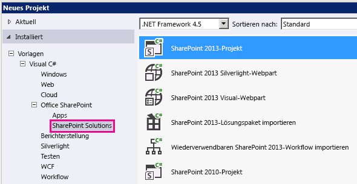

# Vorgehensweise: erweitern den Geolocation-Feldtyp verwenden clientseitiges Rendering
In diesem Artikel erfahren Sie, wie Sie den Geolocation-Feldtyp von SharePoint 2013 programmgesteuert mithilfe von clientseitigem Rendering anpassen.
In diesem Artikel
  
    
    
 [Voraussetzungen für die Erstellung eines benutzerdefinierten Geolocation-Felds](#CreatingCustomGeolocation_prereq)
  
    
    
 [Schritt 1: Einrichten des Visual Studio-Projekts](#CreatingCustomGeolocationStep_1)
  
    
    
 [Schritt 2: Erstellen einer benutzerdefinierten Feldklasse](#CreatingCustomGeolocationStep_2)
  
    
    
 [Schritt 3: Erstellen von Rendering für das neue benutzerdefinierte Feld](#CreatingCustomGeolocationStep_3)
  
    
    
 [Schritt 4: Erstellen einer feldtypdefinition](#CreatingCustomGeolocationStep_4)
  
    
    
 [Schritt 5: Erstellen Sie und Testen Sie den benutzerdefinierten Feldtyp](#CreatingCustomGeolocationStep_5)
  
    
    
 [Weitere Ressourcen](#SP15Createcustomgeo_addlresources)
  
    
    

SharePoint 2013 führt einen neuen Feldtyp namens Geolocation, die Ihnen das Hinzufügen von SharePoint-Listen mit Standortinformationen Anmerkungen ermöglicht. In Spalten vom Typ Geolocation können Sie Standortinformationen als ein Paar von Breiten- und Längengrad Koordinaten in decimal Grad eingeben, oder die Koordinaten des aktuellen Standort des Benutzers vom Browser abrufen, wenn sie die W3C Geolocation-API implementiert. Weitere Informationen über das Geolocation-Feld finden Sie unter  [Integrieren von Standort- und Kartenfunktionen in SharePoint 2013](integrating-location-and-map-functionality-in-sharepoint-2013.md).
Geolocation-Feldtyp ist in den Standardinhaltstyp eine beliebige Liste oder Dokumentbibliothek in SharePoint 2013 nicht verfügbar. Geolocation-Feldtyp in SharePoint 2013 enthalten ist, jedoch nicht auf der Seite der Spalte erstellen für die Liste sichtbar ist; Sie müssen den Geolocation-Feldtyp programmgesteuert hinzufügen. Weitere Informationen finden Sie unter  [Vorgehensweise: Hinzufügen einer Geolocation-Spalte einer Liste in SharePoint 2013 programmgesteuert](how-to-add-a-geolocation-column-to-a-list-programmatically-in-sharepoint-2013.md).
  
    
    

Nachdem Sie den Geolocation-Feldtyp SharePoint 2013 hinzugefügt haben, können Sie es zum Rendern von Karten mithilfe von Bing Maps verwenden. Das integrierte Geolocation-Feld kann nur mit Bing Maps gerendert werden. Jedoch können Sie ein benutzerdefiniertes Feld erstellen, mit der Geolocation-Feld als einen übergeordneten Feldtyp. Benutzerdefiniertes Rendering kann über die **JSLink** -Eigenschaft in clientseitiges Rendering Framework bereitgestellt werden. Clientseitiges Rendering Rahmen wird in SharePoint 2013 eingeführt. Weitere Informationen finden Sie unter [Vorgehensweise: Anpassen eines Feldtyps mithilfe vom clientseitigem Rendering](how-to-customize-a-field-type-using-client-side-rendering.md).
> **HINWEIS**
> Die JSLink Eigenschaft wird nicht auf Umfrage oder Ereignisse unterstützt werden aufgelistet. SharePoint-Kalender ist eine Ereignisliste.
  
    
    

In den Verfahren in diesem Abschnitt erstellen Sie ein benutzerdefiniertes Feld Geolocation-Feldtyps mit clientseitigem Rendering abgeleitet.
## Voraussetzungen für die Erstellung eines benutzerdefinierten Geolocation-Felds
<a name="CreatingCustomGeolocation_prereq"> </a>

Sie müssen über Folgendes verfügen:
  
    
    

- Ein Server mit SharePoint 2013
    
  
- Microsoft Visual Studio 2012
    
  
- Office Developer Tools für Visual Studio 2012
    
  
- Zugriff auf eine Liste SharePoint 2013 mit ausreichenden Berechtigungen zum Hinzufügen einer Spalte
    
  

### Kernkonzepte für das Anpassen des Geolocation-Felds


  
    
    

**In Tabelle 1. Zentrale Konzepte zur Erweiterung der Geolocation-Feldtyp**


|**Artikeltitel**|**Beschreibung**|
|:-----|:-----|
| [Integrieren von Standort- und Kartenfunktionen in SharePoint 2013](integrating-location-and-map-functionality-in-sharepoint-2013.md) <br/> |Erfahren Sie, wie Sie Standortinformationen und Karten in SharePoint-Listen und standortbasierte Web und mobilen apps mithilfe des neuen Geolocation-Felds und Erstellen eigener Geolocation-basierte Feldtypen integrieren. <br/> |
| [Vorgehensweise: Anpassen eines Feldtyps mithilfe vom clientseitigem Rendering](how-to-customize-a-field-type-using-client-side-rendering.md) <br/> |Erfahren Sie mehr über das neue clientseitige Rendering in SharePoint 2013 eingeführt. <br/> |
| [Vorgehensweise: Hinzufügen einer Geolocation-Spalte einer Liste in SharePoint 2013 programmgesteuert](how-to-add-a-geolocation-column-to-a-list-programmatically-in-sharepoint-2013.md) <br/> |Informationen Sie zum Hinzufügen einer Geolocation-Spalteninhalts zu einer Liste programmgesteuert in SharePoint 2013. <br/> |
   

## Schritt 1: Einrichten des Visual Studio-Projekts
<a name="CreatingCustomGeolocationStep_1"> </a>


### So richten Sie das Projekt für ein benutzerdefiniertes Feld ein


1. Starten Sie Visual Studio 2012 auf demselben Computer, auf dem SharePoint Server 2013 installiert ist.
    
  
2. Wählen Sie im Dialogfeld **Neues Projekt** unter **Installierte Vorlagen** **Visual c#**, **Office SharePoint**, **SharePoint-Lösungen**. Wählen Sie den **SharePoint 2013**-Projekttyp. Abbildung 1 zeigt den Speicherort der Vorlage **SharePoint 2013-Projekts** in Visual Studio 2012. Erleichtern Sie eine **farmlösung**, nicht in einer sandkastenlösung.
    
   **Abbildung 1. SharePoint 2013-Projektvorlage in Visual Studio**

  


  

  

  
3. Geben Sie einen Namen für das Projekt. In diesem Beispiel verwenden wir **CustomGeolocationField**. Wählen Sie dann die Schaltfläche **OK**.
    
  
4. Geben Sie im **Assistenten zum Anpassen von SharePoint** die URL für die SharePoint-Website, wo Sie Ihre neuen benutzerdefinierten Feldtyps bereitstellen möchten.
    
  
5. Öffnen Sie im **Projektmappen-Explorer** das Kontextmenü für den Projektnamen (in unserem Beispiel, es ist **CustomGeolocationField** ), und wählen Sie **Hinzufügen** und **Neues Element**.
    
  
6. Klicken Sie im Dialogfeld **Neues Element hinzufügen** unter dem Vorlagen **Code** wählen Sie **Klasse aus**, und geben Sie den Namen für die Klasse (in diesem Beispiel **CustomGeolocationField.cs** ).
    
  
7. Klicken Sie im **Projektmappen-Explorer** öffnen Sie das Kontextmenü für den Projektnamen, und wählen Sie **Hinzufügen** und **zugeordneten SharePoint-Ordner**.
    
  
8. Klicken Sie im Dialogfeld **Zugeordneten SharePoint-Ordner hinzufügen** mithilfe der Strukturansicht den Ordner **TEMPLATE\\LAYOUTS** zuzuordnen, und wählen Sie die Schaltfläche **OK**.
    
  
9. Klicken Sie im **Projektmappen-Explorer** öffnen Sie das Kontextmenü für den neuen Ordner " **LAYOUTS** " (nicht auf den Projektnamen), und wählen Sie **Hinzufügen** und **Neues Element**.
    
  
10. Klicken Sie im Dialogfeld **Neues Element hinzufügen** wählen Sie **Visual C#-** **Web**, und wählen Sie dann **Javascript-Datei** unter **Vorlagen**.
    
  
11. Klicken Sie im Feld **Name** Geben Sie den Namen für die Datei (CustomGeolocationField in unserem Beispiel), und wählen Sie **Hinzufügen**.
    
  
12. Wiederholen Sie Schritt 8, wenn Sie einen anderen zugeordneten SharePoint-Ordner zu erstellen, und ordnen Sie es **template\\xml zu**. Wählen Sie dann die Schaltfläche **OK**.
    
  
13. Klicken Sie im **Projektmappen-Explorer** öffnen Sie das Kontextmenü für den neuen Ordner **XML** (nicht auf den Projektnamen), und wählen Sie **Hinzufügen** und **Neues Element**.
    
  
14. Klicken Sie im Dialogfeld **Neues Element hinzufügen** wählen Sie **Visual C#-** **Daten**, und wählen Sie dann **XML-Datei** unter **Vorlagen**.
    
  
15. Geben Sie im Feld **Name** den Namen für die Datei (in diesem Beispiel wirdfldtypes_CustomGeolocationControl.xml), und wählen Sie die Schaltfläche **Hinzufügen**.
    
  

## Schritt 2: Erstellen einer benutzerdefinierten Feldklasse
<a name="CreatingCustomGeolocationStep_2"> </a>

Eine Feldklasse ist eine Klasse, deren Instanzen können bestimmte Felder darstellen, die auf benutzerdefinierten Feldtyps basieren. Diese Klasse muss von **SPField** oder eine der Klassen in SharePoint Foundation, die sich daraus ableiten erben. Diese Klasse muss zum Aktivieren Sie erweitern oder Anpassen des Geolocation-Feldtyps von **SPFieldGeolocation**erben. Weitere Informationen zum Erstellen von Feldtypen finden Sie unter  [Walkthrough: Creating a Custom Field Type](http://msdn.microsoft.com/library/089a1b8a-cafc-4050-b445-16650602fe4f%28Office.15%29.aspx).
  
    
    

> **HINWEIS**
> In diesem Beispiel werden die Klasse und die Lösung **CustomGeolocationField**benannt. Sie können angeben, den Namen der Klasse und Projekt, wie Sie Ihr Projekt Visual Studio erstellt werden soll.
  
    
    


### So erstellen Sie eine benutzerdefinierte Feldklasse


1. Öffnen Sie die Datei CustomGeolocationField.cs, und fügen Sie eine Richtlinie **using** wie folgt hinzu.
    
  ```cs
  
using System;
using Microsoft.SharePoint;
using Microsoft.SharePoint.WebControls;
  ```

2. Stellen Sie sicher, dass der Namespace **CustomGeolocationField**ist.
    
  
3. Achten Sie darauf, dass die Klasse **CustomGeolocationField**heißt, und ändern Sie die Deklaration so, dass es von **SPFieldGeolocation**erbt. Fügen Sie die folgenden erforderlichen Konstruktoren für die Klasse hinzu.
    
  ```cs
  
public class CustomGeolocationField : SPFieldGeolocation
    {
        /// <summary>
        /// Create an instance of CustomGeolocationField object.
        /// </summary>
        /// <param name="fields">Field collection</param>
        /// <param name="fieldName">Name of the field</param>
        /// 
        public CustomGeolocationField(SPFieldCollection fields, string fieldName)
            : base(fields, fieldName)
        {
        }

        /// <summary>
        /// Create an instance of CustomGeolocationField object.
        /// </summary>
        /// <param name="fields">Field collection</param>
        /// <param name="typeName">type name of the field</param>
        /// <param name="displayName">display name of the field</param>

        public CustomGeolocationField(SPFieldCollection fields, string typeName, string displayName)
            : base(fields, typeName, displayName)
        {
        }
  ```

4. Die folgende Überschreibung der **JSLink** -Methode der Klasse hinzufügen. CustomGeolocationControl.js ist eine JavaScript-Datei, die Sie im nächsten Schritt erstellen. Durch die Bereitstellung einer eigenen Datei JavaScript, überschreiben Sie die Standardwiedergabe von Bing Maps. Wenn Sie diese Methode nicht überschreiben, werden standardmäßig von Bing Maps. Die **JSLink** -Eigenschaft wird in SharePoint 2013 eingeführt. Weitere Informationen über die **JSLink** -Eigenschaft finden Sie unter [Vorgehensweise: Anpassen eines Feldtyps mithilfe vom clientseitigem Rendering](how-to-customize-a-field-type-using-client-side-rendering.md).
    
  ```cs
  
/// <summary>
        /// Override JSLink property.
        /// </summary>

public override string JSLink
        {
            get
            {
                return "CustomGeolocationControl.js";
            }
            set
            {
                base.JSLink = value;
            }
        }
  ```

5. Die **GetFieldValue** -Methode konvertiert den angegebenen Wert in einen Wert vom Typ dar. Weitere Informationen über die **GetFieldValue** -Methode finden Sie unter [GetFieldValue(String)](https://msdn.microsoft.com/library/Microsoft.SharePoint.SPField.GetFieldValue.aspx) . Die folgende Überschreibung der **GetFieldValue** -Methode der **CustomGeolocationField** -Klasse hinzufügen.
    
  ```cs
  
/// <summary>
        /// get the field values
        /// </summary>
        /// <param name="value"></param>
        /// <returns></returns>
        
        public override object GetFieldValue(string value)
        {
            return base.GetFieldValue(value);
        }
  ```

6. Die folgende Überschreibung der  [GetValidatedString](https://msdn.microsoft.com/library/Microsoft.SharePoint.SPField.GetValidatedString.aspx) -Methode der **CustomGeolocationField** -Klasse hinzufügen:
    
  ```cs
  
/// <summary>
        /// get validated string
        /// </summary>
        /// <param name="value"></param>
        /// <returns></returns>
        
       public override string GetValidatedString(object value)
        {
            return base.GetValidatedString(value);
        }
  ```


## Schritt 3: Erstellen von Rendering für das neue benutzerdefinierte Feld
<a name="CreatingCustomGeolocationStep_3"> </a>

Im nächsten Schritt sollten Sie die Datei JavaScript erstellen, der auf die **JSLink** -Methode der Feldklasse verweist. Diese Datei sollte das Rendering des benutzerdefinierten Feldtyps mit dem neuen Framework clientseitiges Rendering definieren. Weitere Informationen finden Sie unter [Vorgehensweise: Anpassen eines Feldtyps mithilfe vom clientseitigem Rendering](how-to-customize-a-field-type-using-client-side-rendering.md).
  
    
    
Das folgende Beispiel zeigt die Registrierung Logik für das Registrieren von mit dem Client Side Rendering Framework in SharePoint 2013 eingeführt.
  
    
    


```

function _registerCustomGeolocationFieldTemplate() {
          
            var geolocationFieldContext = {};
            geolocationFieldContext.Templates = {};
            geolocationFieldContext.Templates.Fields = {

                'CustomGeolocationField': {
                    'View': CustomGeolocationFieldTemplate.RenderGeolocationField,
                    'DisplayForm': CustomGeolocationFieldTemplate.SPFieldGeolocation_Display,
                    'EditForm': CustomGeolocationFieldTemplate.SPFieldGeolocation_Edit,
                    'NewForm': CustomGeolocationFieldTemplate.SPFieldGeolocation_Edit
                }
            };
            SPClientTemplates.TemplateManager.RegisterTemplateOverrides(geolocationFieldContext);
        }
```

In den Registrierungsprozess sind vier Variablen und ihre entsprechenden Methoden. Das clientseitiges Rendering-Framework ruft diese Methoden für das Rendering **CustomGeolocationControl**.
  
    
    
Das folgende Codebeispiel erstellt neues Rendering für ein neues benutzerdefiniertes Feld für neues benutzerdefiniertes Feld, das von Geolocation abgeleitet ist.
  
    
    

### So erstellen Sie die Datei JavaScript


1. Erstellen Sie eine Textdatei und geben Sie einen Namen, beispielsweise X, weisen Sie ihr eine JS-Erweiterung und die TEMPLATE\\LAYOUTS zugeordneten SharePoint-Ordner speichern. In diesem Beispiel wird der Name **CustomGeolocationControl.js** verwendet.
    
  
2. Kopieren Sie den folgenden Code in die JS-Datei.
    
  ```
  
(function () {
        if (typeof CustomGeolocationFieldTemplate == "object") {
            return;
        }
        window.CustomGeolocationFieldTemplate = (function () {
            return {
                SPFieldGeolocation_Display: function (rCtx) {
                    if (rCtx == null || rCtx.CurrentFieldValue == null || rCtx.CurrentFieldValue == '')
                        return '';
                    var listItem = rCtx['CurrentItem'];
                    var fldvalue = CustomGeolocationFieldTemplate.ParseGeolocationValue(listItem[rCtx.CurrentFieldSchema.Name]);
                    var _myData = SPClientTemplates.Utility.GetFormContextForCurrentField(rCtx);

                    if (_myData == null || _myData.fieldSchema == null)
                        return '';
                    var _latitude = 0;
                    var _longitude = 0;

                    if (fldvalue != null) {
                        _latitude = fldvalue.latitude;
                        _longitude = fldvalue.longitude;
                    }
                  
                    var result = '<div>';
                    result += '<span>Latitude:</span><span>' + _latitude + '</span><span>Longitude:</span><span>' + _longitude + '</span>';
                    result += '</div>';
                    return result;
                },                
                ParseGeolocationValue: function (fieldValue) {

                    if (fieldValue == null || fieldValue == '')
                        return null;

                    var point = new Object();
                    point.longitude = null;
                    point.latitude = null;
                    point.altitude = null;
                    point.measure = null;

                    var matches = fieldValue.match(/POINT\\s*\\((\\d+(\\.\\d+)?)\\s+(\\d+(\\.\\d+)?)\\s+(\\d+(\\.\\d+)?)\\s+(\\d+(\\.\\d+)?)\\)/i);
                    if (matches != null) {

                        point.longitude = parseFloat(matches[1]);
                        point.latitude = parseFloat(matches[3]);
                        point.altitude = parseFloat(matches[5]);
                        point.measure = parseFloat(matches[7]);
                    }
                    else
                    {
                        matches = fieldValue.match(/POINT\\s*\\((\\d+(\\.\\d+)?)\\s+(\\d+(\\.\\d+)?)\\)/i);
                        if (matches != null) {

                            point.longitude = parseFloat(matches[1]);
                            point.latitude = parseFloat(matches[3]);
                        }
                    }
                    return point;
                },
                SPFieldGeolocation_Edit: function (rCtx) {
                    if (rCtx == null)
                        return '';
                    var _myData = SPClientTemplates.Utility.GetFormContextForCurrentField(rCtx);

                    if (_myData == null || _myData.fieldSchema == null)
                        return '';
                    var _latitude = null;
                    var _longitude = null;
                    var _inputId_Latitude = _myData.fieldName + '_' + _myData.fieldSchema.Id + '_$geolocationField_Latitude';
                    var _inputId_Longitude = _myData.fieldName + '_' + _myData.fieldSchema.Id + '_$geolocationField_Longitude';
                    var _inputId_Div = _myData.fieldName + '_' + _myData.fieldSchema.Id + '_$geolocationField_Div';
                    var _latitudeBox = null;
                    var _longitudeBox = null;

                    var _value = _myData.fieldValue != null ? _myData.fieldValue : '';
                    var listItem = rCtx['CurrentItem'];
                    var fldvalue = CustomGeolocationFieldTemplate.ParseGeolocationValue(listItem[rCtx.CurrentFieldSchema.Name]);

                    if (fldvalue != null) {
                        _latitude = fldvalue.latitude;
                        _longitude = fldvalue.longitude;
                    }

                    var validators = new SPClientForms.ClientValidation.ValidatorSet();

                    if (_myData.fieldSchema.Required)
                        validators.RegisterValidator(new SPClientForms.ClientValidation.RequiredValidator());

                    _myData.registerClientValidator(_myData.fieldName, validators);

                    // Post DOM initialization callback.
                    _myData.registerInitCallback(_myData.fieldName, function () {

                        // Initialize the input control references.
                        _latitudeBox = document.getElementById(_inputId_Latitude);
                        _longitudeBox = document.getElementById(_inputId_Longitude);

                        // Set the initial values.
                        if ((_latitudeBox != null &amp;&amp; _longitudeBox != null) &amp;&amp;
                            (_latitude != null &amp;&amp; _longitude != null)) {
                            _latitudeBox.value = _latitude;
                            _longitudeBox.value = _longitude;
                        }
                    });
                    // On focus call back.
                    _myData.registerFocusCallback(_myData.fieldName, function () {
                        if (_latitudeBox != null)
                            _latitudeBox.focus();
                    });
                    // Validation failure handler.
                    _myData.registerValidationErrorCallback(_myData.fieldName, function (errorResult) {
                        SPFormControl_AppendValidationErrorMessage(_inputId_Div, "invalid Geolocation Field");
                    });

                    // Register a callback just before submit.
                    _myData.registerGetValueCallback(_myData.fieldName, function () {
                        if (_latitudeBox == null &amp;&amp; _longitudeBox == null)
                            return '';
                        else {
                            _latitude = _latitudeBox.value;
                            _longitude = _longitudeBox.value;

                            if (_latitude != null &amp;&amp; _longitude != null)
                                return "Point(" + _longitude + " " + _latitude + ")";
                        }
                    });
                    _myData.updateControlValue(_myData.fieldName, _value);

                    var result = '<div width="100%" id=' + STSHtmlEncode(_inputId_Div) + '>';
                    result += '<div><span>Latitude:</span><input id=' + STSHtmlEncode(_inputId_Latitude) + ' type="text" name="Latitude" /></div>';
                    result += '<div><span>Longitude:</span><input id=' + STSHtmlEncode(_inputId_Longitude) + ' type="text" name="Longitude" /></div>';
                    result += '</div>';
                    return result;

                },
                RenderGeolocationField: function (inCtx, field, listItem, listSchema) {
                    var fldvalue = CustomGeolocationFieldTemplate.ParseGeolocationValue(listItem[field.Name]);
                    var result = '';

                    if (fldvalue != null) {
                        var result = '<div>';
                        result += '<span>Latitude:</span><span>' + fldvalue.latitude + '</span><span>Longitude:</span><span>' + fldvalue.longitude + '</span>';
                        result += '</div>';                            
                    }
                    return result;                    
                }                                       
            };
        })();
        function _registerCustomGeolocationFieldTemplate() {
          
            var geolocationFieldContext = {};
            geolocationFieldContext.Templates = {};
            geolocationFieldContext.Templates.Fields = {

                'CustomGeolocationField': {
                    'View': CustomGeolocationFieldTemplate.RenderGeolocationField,
                    'DisplayForm': CustomGeolocationFieldTemplate.SPFieldGeolocation_Display,
                    'EditForm': CustomGeolocationFieldTemplate.SPFieldGeolocation_Edit,
                    'NewForm': CustomGeolocationFieldTemplate.SPFieldGeolocation_Edit
                }
            };
            SPClientTemplates.TemplateManager.RegisterTemplateOverrides(geolocationFieldContext);
        }
        ExecuteOrDelayUntilScriptLoaded(_registerCustomGeolocationFieldTemplate, 'clienttemplates.js');
    })();
  ```


## Schritt 4: Erstellen einer feldtypdefinition
<a name="CreatingCustomGeolocationStep_4"> </a>

Eine feldtypdefinition ist eine XML-Datei mit dem Namen  _fldtypes*.xml_, die in %ProgramFiles%\\Common Files\\Microsoft Shared\\web Server extensions\\15\\TEMPLATE\\XML bereitgestellt wird. Eine Feld-Definitionsdatei enthält Informationen, SharePoint Foundation benötigt, um das Feld in Listenansichten und Formularen anzeigen, bearbeiten und neu ordnungsgemäß zu rendern. Der wichtigste enthält die Definition Informationen über die Assembly, die den kompilierten Feldtyp enthält. Weitere Informationen zu feldtypdefinitionen finden Sie unter [Vorgehensweise: Erstellen einer Custom Field Type Definition](http://msdn.microsoft.com/library/b3315997-671f-4c29-9518-48cc4592f205%28Office.15%29.aspx).
  
    
    

### So erstellen Sie die Feldtypdefinition


1. Erstellen Sie das Projekt in Visual Studio. Das Projekt ist noch nicht fertig, aber Sie müssen es jetzt erstellen, um eine GUID und ein öffentliches Schlüsseltoken für die Assembly zu generieren.
    
  
2. Öffnen Sie die Datei fldtypes_CustomGeolocationControl.xml, und Ersetzen Sie den Inhalt durch Folgendes Markup.
    
  ```XML
  
?xml version="1.0" encoding="utf-8" ?>

<FieldTypes>
  <FieldType>
    <Field Name="TypeName">CustomGeolocationField</Field>
    <Field Name="ParentType">Geolocation</Field>
    <Field Name="TypeDisplayName">Custom Geolocation field</Field>
    <Field Name="TypeShortDescription"> Custom Geolocation field </Field>
    <Field Name="UserCreatable">TRUE</Field>
    <Field Name="ShowOnListCreate">TRUE</Field>
    <Field Name="ShowOnSurveyCreate">TRUE</Field>
    <Field Name="ShowOnDocumentLibraryCreate">TRUE</Field>
    <Field Name="ShowOnColumnTemplateCreate">TRUE</Field>
    <Field Name="FieldTypeClass">CustomGeolocationField.CustomGeolocationField,$SharePoint.Project.AssemblyFullName$</Field>
    <Field Name="SQLType">nvarchar</Field>
  </FieldType>
</FieldTypes>

  ```


    Diese Datei definiert den benutzerdefinierten Feldtyp für SharePoint 2013. Ausführliche Informationen zu den Zweck und die Bedeutung der darin enthaltenen Elemente finden Sie unter  [Vorgehensweise: Erstellen einer benutzerdefinierten Feldtypdefinition](http://msdn.microsoft.com/library/b3315997-671f-4c29-9518-48cc4592f205%28Office.15%29.aspx),  [Grundlegendes zur Datei "FldTypes.xml"](http://msdn.microsoft.com/library/8f8db866-03f8-4001-aae3-4c4102a7aed6%28Office.15%29.aspx),  [FieldTypes-Element (Feldtypen)](http://msdn.microsoft.com/library/ebac779f-c7c5-401b-8503-e514cd96f5a7%28Office.15%29.aspx),  [FieldType-Element (Feldtypen)](http://msdn.microsoft.com/library/9ab89988-3462-422f-9808-40618da7316b%28Office.15%29.aspx)und  [Field-Element (Feldtypen)](http://msdn.microsoft.com/library/c168e8bc-8aba-4b72-a9c4-a0ad7a4aff9a%28Office.15%29.aspx). Beachten Sie, dass das Element **<Field Name="FieldTypeClass">** vollständig in einer Zeile werden muss.
    
  
3. Der Wert des **<Field Name="FieldTypeClass">** -Elements ist der vollständig qualifizierte Name der der benutzerdefinierten Feldklasse gefolgt von einem Komma und ein Token Visual Studio ( `$SharePoint.Project.AssemblyFullName$`). Wenn Sie das Projekt kompilieren, wird eine Kopie dieser Datei erstellt, in dem das Token durch den vollständigen vierteiligen Namen der Assembly ersetzt wird. Die Kopie wird bereitgestellt, wenn Sie eine **Lösung bereitstellen**Visual Studio **Erstellen** im Menü Visual Studio 2012 auswählen.
    
  

## Schritt 5: Erstellen Sie und Testen Sie den benutzerdefinierten Feldtyp
<a name="CreatingCustomGeolocationStep_5"> </a>

Nachdem Sie ein benutzerdefiniertes Feld in der SharePoint-Server bereitstellen, steht eine neue benutzerdefinierte Spalte zum Hinzufügen zu einer beliebigen SharePoint-Liste auf dem Server, auf dem die Lösung bereitgestellt wird.
  
    
    

1. Wählen Sie die F5-Taste.
    
    > **HINWEIS**
      > Wenn Sie F5 auswählen, wird Visual Studio die Projektmappe erstellt, stellt die Lösung bereit und öffnet die SharePoint-Website, in dem die Lösung bereitgestellt wird.
2. Erstellen einer benutzerdefinierten Liste und Hinzufügen einer neuen benutzerdefinierten Geolocation-Feld-Spalte.
    
  
3. Der Liste ein Element hinzu, und geben Sie Länge und Breite Werte für die benutzerdefinierte Geolocation-Spalte.
    
  
4. Abbildung 2 zeigt mit den neuen benutzerdefinierten Feldtyp Seite Spalte erstellen.
    
   **Abbildung 2. Erstellen einer neuen Spalte mit benutzerdefiniertem Feldtyp**

  


  

  

  

## Weitere Ressourcen
<a name="SP15Createcustomgeo_addlresources"> </a>


-  [Integrieren von Standort- und Kartenfunktionen in SharePoint 2013](integrating-location-and-map-functionality-in-sharepoint-2013.md)
    
  
-  [Vorgehensweise: Hinzufügen einer Geolocation-Spalte einer Liste in SharePoint 2013 programmgesteuert](how-to-add-a-geolocation-column-to-a-list-programmatically-in-sharepoint-2013.md)
    
  
-  [Vorgehensweise: Anpassen eines Feldtyps mithilfe vom clientseitigem Rendering](how-to-customize-a-field-type-using-client-side-rendering.md)
    
  
-  [SharePoint 2013: Erstellen eines Geolocation-Felds, das Karten mithilfe von Nokia Maps wiedergibt](http://code.msdn.microsoft.com/SharePoint-2013-Create-a-d9a91551)
    
  
-  [Vorgehensweise: erstellen ein benutzerdefinierten Feldtyps](http://msdn.microsoft.com/library/aacdc6d1-86c8-4a6b-953d-22ecac209d0f%28Office.15%29.aspx)
    
  
-  [Bereitstellen von Dateien mithilfe von Ordnern zugeordnet sind](http://blogs.msdn.com/b/vssharepointtoolsblog/archive/2010/03/12/deploying-files-using-mapped-folders.aspx)
    
  

