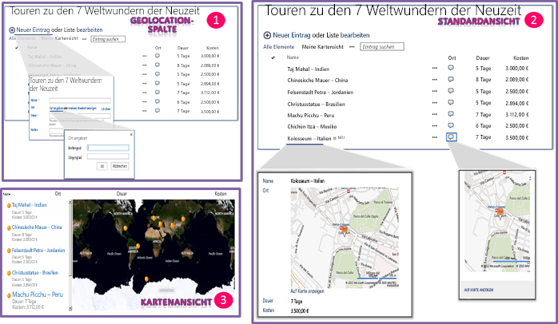

# Integrieren von Standort- und Kartenfunktionen in SharePoint 2013
In diesem Artikel erfahren Sie, wie Sie Standortinformationen und Karten in SharePoint-Listen sowie standortbasierte Web-Apps und mobile Apps für SharePoint mithilfe des neuen Felds „Geolocation" und durch Erstellen Ihrer eigenen auf dem Geolocation-Feld basierenden Feldtypen integrieren.
## Was sind die Standort- und Kartenfunktionen in SharePoint 2013?

Mit SharePoint 2013 wird ein neuer Feldtyp namens Geolocation eingeführt, mit dem Sie SharePoint-Listen mit Standortinformationen versehen können. In Spalten des Typs Geolocation können Sie Standortinformationen wie Breiten- und Längengradkoordinaten in Dezimalgrad eingeben oder die Koordinaten des aktuellen Standorts des Benutzers vom Browser abrufen, wenn dieser die W3C-Geolocation-API implementiert. SharePoint 2013 zeigt in der Liste den Standort auf einer Karte an, die von Bing Maps unterstützt wird. Außerdem zeigt eine neue Ansicht namens Kartenansicht die Listenelemente als Reißzwecken auf einem Bing Maps-Ajax-Steuerelement der Version 7 mit den Listenelementen als Karten im linken Bereich an. Abbildung 1 enthält eine Zusammenfassung der Standort- und Kartenstandardfunktionen in SharePoint 2013. Zusammen können Sie mit dem Geolocation-Feld und der Kartenansicht einen räumlichen Kontext für alle Informationen bereitstellen, indem Sie Daten aus SharePoint in eine Kartendarstellungserfahrung integrieren und Ihren Benutzern ermöglichen, Ihre Web- und mobilen Apps und Lösungen auf ganz neue Weise zu nutzen.
  
    
    

> **HINWEIS**
> Ein MSI-Paket namens SQLSysClrTypes.msi muss auf jedem SharePoint-Front-End-Webserver installiert sein, um den Werte des Geolocation-Felds oder Daten in einer Liste anzuzeigen. Dieses Paket installiert Komponenten, die die neuen ID-Typen für Geometrie, Geografie und Hierarchie in SQL Server 2008 implementieren. Standardmäßig ist diese Datei für SharePoint Online, nicht jedoch für lokale Bereitstellungen von SharePoint Server 2013 installiert. Sie müssen Mitglied der Gruppe „Farmadministratoren" sein, um diesen Vorgang ausführen zu können. Informationen zum Herunterladen von SQLSysClrTypes.msi finden Sie unter  [Microsoft SQL Server 2008 R2 SP1 Feature Pack](http://www.microsoft.com/de-de/download/details.aspx?id=26728) für SQL Server 2008 oder unter [Microsoft SQL Server 2012 Feature Pack](http://www.microsoft.com/en-us/download/details.aspx?id=29065)für SQL Server 2012 im Microsoft Download Center. 
  
    
    

**Abbildung 1: Zusammengefasste Ansicht der Standort- und Kartenstandardfunktionen**

  
    
    

  
    
    

  
    
    

  
    
    

  
    
    

## Was können Sie mit den Standort- und Kartenfunktionen tun?

Die Standort- und Kartenfunktionen in SharePoint 2013 bieten einzigartige Möglichkeiten für Entwickler, Standort-, Karten- und Entfernungssuchfunktoinen in ihre Web- und mobilen Apps und Lösungen zu integrieren. Tabelle 1 enthält einige grundlegende Aufgaben, die Ihnen helfen, Standort- und Kartenfunktionen in Ihre Apps und Lösungen zu integrieren.
  
    
    

**Tabelle 1: Grundlegende Aufgaben für die Ingetration von Standort- und Kartenfunktionen**

|**Aufgabe**|**Beschreibung**|
|:-----|:-----|
| [Vorgehensweise: Legen Sie die Bing Maps-Taste auf Ordnerebene Web und Farm in SharePoint 2013](how-to-set-the-bing-maps-key-at-the-web-and-farm-level-in-sharepoint-2013.md)   |SharePoint 2013verwendet Bing Maps zum Rendern einer Karte des Standorts. Um die Bing Maps-Funktion verwenden zu können, müssen Sie einen Bing Maps-Schlüssel erstellen und den Schlüssel auf Web- oder Farmebene festlegen. Der Artikel zeigt die verschiedenen Möglichkeiten zum Festlegen des Schlüssels in SharePoint 2013 und erläutert, wann Sie welche Option auswählen sollten. Auf der Karte wird eine Fehlermeldung angezeigt, wenn Sie keinen gültigen Bing Maps-Schlüssel verwenden oder ein Schlüssel nicht auf das Web, das die Liste enthält, oder die Farmebene festgelegt ist.    |
| [Vorgehensweise: Hinzufügen einer Geolocation-Spalte einer Liste in SharePoint 2013 programmgesteuert](how-to-add-a-geolocation-column-to-a-list-programmatically-in-sharepoint-2013.md)   |Die Geolocation-Spalte ist standardmäßig nicht in SharePoint-Listen für Benutzer verfügbar. Um die Spalte zu einer SharePoint-Liste hinzuzufügen, müssen Sie Code schreiben. Erfahren Sie in diesem Thema, wie das Geolocation-Feld programmgesteuert zu einer Liste hinzufügen.    |
| [Vorgehensweise: erweitern den Geolocation-Feldtyp verwenden clientseitiges Rendering](how-to-extend-the-geolocation-field-type-using-client-side-rendering.md)   |Sie können Ihr eigenes Rendering für die Standardbenutzeroberfläche, die Logik und das Verhalten des Geolocation-Felds bereitstellen, indem Sie benutzerdefinierte Feldtypen erstellen, die vom Geolocation-Feld abgeleitet sind. SharePoint 2013 vereinfacht das Erstellen von benutzerdefinierten Feldtypen, da Sie JavaScript ausführen können, indem Sie eine neue JSLink-Eigenschaft in der Geolocation-Feldklasse bereitstellen, die auf eine benutzerdefinierte JS-Datei verweist, die das Feld rendert.    |
   

## Zusätzliche Ressourcen

-  [Vorgehensweise: Hinzufügen einer Geolocation-Spalte einer Liste in SharePoint 2013 programmgesteuert](how-to-add-a-geolocation-column-to-a-list-programmatically-in-sharepoint-2013.md)
    
  
-  [Vorgehensweise: Legen Sie die Bing Maps-Taste auf Ordnerebene Web und Farm in SharePoint 2013](how-to-set-the-bing-maps-key-at-the-web-and-farm-level-in-sharepoint-2013.md)
    
  
-  [Vorgehensweise: erweitern den Geolocation-Feldtyp verwenden clientseitiges Rendering](how-to-extend-the-geolocation-field-type-using-client-side-rendering.md)
    
  
-  [Vorgehensweise: Integrieren von Zuordnungen in Windows Phone-Anwendungen und SharePoint 2013 aufgelistet](how-to-integrate-maps-with-windows-phone-apps-and-sharepoint-2013-lists.md)
    
  
-  [Verwenden des Standortfeldtyps in mobilen Anwendungen für SharePoint 2013](http://technet.microsoft.com/de-de/library/fp161355%28v=office.15%29.aspx)
    
  

