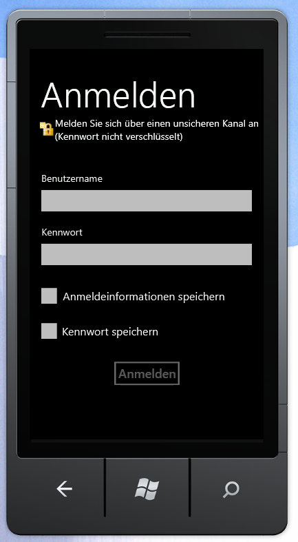

# Übersicht über das SharePoint 2013-Objektmodell für die mobile Clientauthentifizierung
Erhalten Sie eine Übersicht über die Entwicklung mit den Authentifizierung-APIs des SharePoint 2013-Clientobjektmodells für Silverlight.
## Authentifizierung und Clientkontext auf einem Windows Phone
<a name="SP15Mobileclientauth_auth"> </a>

Der Prozess der Authentifizierung eines SharePoint-Benutzers auf einem Windows Phone 7.5 ist ein wenig anders als derselbe Prozess auf einem Clientcomputer. Clientcode auf einem Windows Phone 7.5 erstellt zunächst ein Objekt der **Authenticator**-Klasse oder der **ODataAuthenticator**-Klasse, die dem SharePoint 2013Clientobjektmodell für Microsoft Silverlight für Windows Phone hinzugefügt wurden. Dann wird dieses Objekt als Anmeldeinformationen des Benutzers verwendet.
  
    
    

> **HINWEIS**
> Weitere Informationen über die in diesem Abschnitt erläuterten-APIs finden Sie unter  [Übersicht über die mobilen SharePoint 2013-Objektmodell](overview-of-the-sharepoint-2013-mobile-object-model.md). Weitere Informationen zum SharePoint-Clientobjektmodell für Silverlight finden Sie unter  [Verwaltetes Clientobjektmodell](http://msdn.microsoft.com/de-de/library/ee537247.aspx) und [Verwenden des Silverlight-Objektmodells](http://msdn.microsoft.com/de-de/library/ee538971.aspx). 
  
    
    


## Authentifizieren des Benutzers im SharePoint-Clientobjektmodell für Silverlight
<a name="SP15Mobileclientauth_user"> </a>

Nachfolgend finden Sie die erforderlichen Schritte, um ein authentifiziertes Clientkontextobjekt abzurufen:
  
    
    

1. Rufen Sie ein  [ClientContext](http://msdn.microsoft.com/de-de/library/microsoft.sharepoint.client.clientcontext.aspx)-Objekt ab.
    
  
2. Erstellen Sie ein neues **Authenticator**-Objekt, und initialisieren Sie seine Eigenschaften.
    
    > **HINWEIS**
      > Ein **Authenticator**-Objekt kann nur mit einem **ClientContext**-Objekt verwendet werden. Sie können kein **Authenticator**-Objekt über mehrere **ClientContext**-Objekte hinweg mit verschiedenen URLs freigeben. 
3. Die **Authenticator**-Klasse implementiert die  [ICredentials](http://msdn.microsoft.com/de-de/library/system.net.icredentials.aspx)-Schnittstelle, sodass Sie das Objekt der  [Credentials](http://msdn.microsoft.com/de-de/library/microsoft.sharepoint.client.clientruntimecontext.credentials.aspx)-Eigenschaft des **ClientContext**-Objekts zuweisen können.
    
  
Sie können dann den restlichen Code des Clientobjektmodells hinzufügen und **ExecuteQueryAsync** aufrufen.
  
    
    
Im folgenden Code werden diese Schritte veranschaulicht.
  
    
    


```cs

ClientContext context = new ClientContext(ListUrl);

// Create an instance of Authenticator object.
Authenticator at = new Authenticator();

// Replace <username> and <password> with valid values. 
at.UserName = "<username>";
at.Password = "<password>";
at.AuthenticationMode = ClientAuthenticationMode.FormsAuthentication;

at.CookieCachingEnabled = true;

// Assign the instance of Authenticator object to the ClientContext.Credential property.
// ClientContext is the object that is central to the client object model for making calls to the server running SharePoint 
// for fetching and updating data.
context.Credentials = at;

ListItemCollection items = context.Web.Lists.GetByTitle(ListName).GetItems(CamlQuery.CreateAllItemsQuery());

// Load the query and execute the request to fetch data.
context.Load(items);
context.ExecuteQueryAsync(
    (object obj, ClientRequestSucceededEventArgs args) =>
    {
// Success logic
    },

    (object obj, ClientRequestFailedEventArgs args) =>
    {
// Failure logic
    });


```

Optional können Sie einen UAG-Server (Unified Access Gateway) angeben, indem Sie die **Authenticator.UagServerUrl**-Eigenschaft festlegen.
  
    
    
Wenn die SharePoint-URL über eine einfache oder formularbasierte Authentifizierungsunterstützung verfügt, fordert der **ExecuteQueryAsync**-Aufruf den Benutzer auf, Anmeldeinformationen einzugeben, wie in Abbildung 1 gezeigt. Andernfalls führt der Aufruf zu einem Fehler. Aktivieren Sie die einfache oder formularbasierte Authentifizierungsautorisierung auf der SharePoint-Website, um einen Authentifizierungsfehler zu vermeiden. 
  
    
    

**Abbildung 1. SharePoint-Clientauthentifizierung**

  
    
    

  
    
    

  
    
    
Der Benutzer gibt den Benutzernamen und das Kennwort ein, und wählt **Anmelden** aus, wie in Abbildung 1 gezeigt. Der Benutzer hat die Möglichkeit **Anmeldeinformationen speichern** auszuwählen, damit der Benutzername gespeichert wird, und er kann **Kennwort speichern** auswählen, um das Kennwort zu speichern, wie in Abbildung 1 dargestellt. Nachdem der Benutzername oder das Kennwort gespeichert wurde, muss der Benutzer beim nächsten Start der App die Anmeldeinformationen nicht mehr eingeben. **ExecuteQueryAsync** verwendet dann die Anmeldeinformationen, um Webanforderungen an den Server zu stellen, auf dem SharePoint ausgeführt wird, um Daten abzurufen.
  
    
    

## Authentifizieren des Benutzers im SharePoint-OData-Objektmodell
<a name="SP15Mobileclientauth_OData"> </a>

Nachfolgend finden Sie die erforderlichen Schritte, um ein authentifiziertes OData-Kontextobjekt abzurufen:
  
    
    

1. Erstellen Sie ein neues **ODataAuthenticator**-Objekt, und initialisieren Sie seine Eigenschaften.
    
  
2. Registrieren Sie einen Handler für das **AuthenticationCompleted**-Ereignis.
    
  
3. Rufen Sie die **ODataAuthenticator.Authenticate**-Methode auf, die das **AuthenticationCompleted**-Ereignis auslöst.
    
  
4. Rufen Sie ein OData-Kontextobjekt innerhalb des **OnAuthenticationCompleted**-Handlers ab.
    
  
Sie können dann die restlichen OData-Aufrufe im **OnAuthenticationCompleted**-Handler hinzufügen.
  
    
    
Im folgenden Code werden diese Schritte veranschaulicht.
  
    
    


```cs

ODataAuthenticator oat = new ODataAuthenticator();

// Replace <username> and <password> with valid values. 
oat.UserName = "<username>";
oat.Password = "<password>";

oat.AuthenticationMode = ClientAuthenticationMode.FormsAuthentication;


oat.AuthenticationCompleted += 
           new EventHandler<SendingRequestEventArgs>(OnAuthenticationCompleted);

// The Authenticate method will raise the AuthenticationCompleted event.
oat.Authenticate("My_service_URL");  

```

Der Code muss auch zwei Ereignishandler implementieren, wie im folgenden Abschnitt beschrieben.
  
    
    

### Implementieren der OnAuthenticationCompleted- und OnSendingRequest-Handler und Abrufen des ClientContext-Objekts

Eine Implementierung des **OnAuthenticationCompleted**-Handlers sollte zuerst nach Fehlern bei der Authentifizierung suchen. Wenn Fehler vorhanden sind, sollten diese entsprechend behandelt werden, z. B. Anzeigen einer Fehlermeldung für den Benutzer, und beenden Sie dann den Vorgang.
  
    
    
Wenn keine Fehler vorhanden sind, sollte der Handler erstellen eine Instanz eines neuen **DataServiceContext**-Objekts erstellen und dann einen Handler für das **SendingRequest**-Ereignis registrieren. Von diesem Zeitpunkt an wird der OData-Aufrufcode gegen für das **DataServiceContext**-Objekt programmiert, genau wie auf einem Computer. 
  
    
    
Nachfolgend sehen Sie ein Beispiel für eine Implementierung eines **OnAuthenticationCompleted**-Handlers.
  
    
    


```cs

void OnAuthenticationCompleted(object sender, AuthenticationCompletedEventArgs e)
{
    if (e.Error != null)
    {
        MessageBox.Show(error);
        return;
    }
    ODataAuthenticator oat = sender as ODataAuthenticator;

    // Construct an OData context object.
    contextObj = new DataServiceContext(oat.ResolvedUrl);

    // Register the SendingRequest event handler.
    contextObj.SendingRequest += 
        new EventHandler<SendingRequestEventArgs>(OnSendingRequest);  
    
    // Your data retrieval logic goes here. 
    // For example, if there is a GetData method: 
    // contextObj.GetData();   
}


```

Alles, was der -Handler tun muss, ist den Cookiecontainer des **Request**-Objekts auf den Cookiecontainer des -Objekts festlegen. Es folgt ein Beispiel.
  
    
    


```cs

void OnSendingRequest(object sender, SendingRequestEventArgs e)
{ 
    ODataAuthenticator oat = sender as ODataAuthenticator;
    ((HttpWebRequest)e.Request).CookieContainer = oat.CookieContainer;
}

```


## Erweiterte Nutzung
<a name="SP15Mobileclientauth_advance"> </a>


1. Sie können ein **Authenticator**-Objekt mit einer hartcodierten Option für Benutzername/Kennwort erstellen. Der Benutzer der App wird nicht nach einem Benutzernamen und Kennwort gefragt, und es werden hartcodierte Anmeldeinformationen für die Authentifizierung des Benutzers verwendet.
    
     `public Authenticator(string userName, string password)`
    
     `public Authenticator(string userName, string password, string domain)`
    
    Der gleiche Konstruktor kann zum Erstellen einer benutzerdefinierten Anmeldeseite verwendet werden. Sie können eine benutzerdefinierte Anmeldeseite schreiben, indem Sie die Anmeldeinformationen aus CodeBehind-Dateien übergeben.
    


  ```cs
  
Authenticator at = new Authenticator();
at.AuthenticationMode = ClientAuthenticationMode.MicrosoftOnline;                          

  ```

2. Der Authentifizierungstyp kann entsprechend festgelegt werden. Standardmäßig wird die Standardauthentifizierung verwendet.
    
  

### Authentifizierung über SharePoint Online

Um eine Authentifizierung gegen eine SharePoint Online-URL auszuführen, legen Sie die URL, die **AuthenticationMode**-Eigenschaft des **Authenticator**-Objekt auf **MicrosoftOnline**-Modus fest. Die verbleibenden Schritte des Verfahrens sind dieselben wie für eine lokale SharePoint-URL.
  
    
    

> **HINWEIS**
> Der Benutzername und das Kennwort können nicht für SharePoint Online nicht hartcodiert werden. Der Benutzer wird zur Eingabe von Anmeldeinformationen aufgefordert. 
  
    
    


#### Verbundauthentifizierung

Die **FederationAuthURI**-Eigenschaft wird zum Übergeben der **ADFS**-Authentifizierungsschemaeinstellung verwendet, wobei **ADFS** so konfiguriert ist, dass mehrere Authentifizierungshandler verwendet werden. **FederationAuthURI** gibt die Art der Authentifizierung an, die für die Authentifizierungsanforderung erforderlich ist, wenn die SharePoint Online-Authentifizierung mit Verbund verwendet wird. Dieser Parameter kann die Priorität außer Kraft setzen, die von der Reihenfolge der Konfiguration der Authentifizierungshandler aufgestellt wurde. Weitere Informationen zu Authentifizierunghandlern finden Sie unter [Übersicht über Authentifizierungshandler](http://msdn.microsoft.com/de-de/library/ee895365.aspx).
  
    
    

```cs

 Authenticator auth = new Authenticator("domain\\\\name", "xyz"); 
 auth.FederationPassiveAuthUri = "urn:oasis:names:tc:SAML:2.0:ac:classes:Password"; 
//Replace <SiteUrl> with valid value 
ClientContext ctx = new ClientContext("SiteUrl"); 
               ctx.Credentials = auth; 
               ctx.ExecuteQueryAsync( 
 (object sender, ClientRequestSucceededEventArgs args) => 
   { 
    /* successful callback code */ 
   }, 
 (object sender, ClientRequestFailedEventArgs args) => 
   { 
   /* failure callback code */ 
  });

```

 **ADFS** ist eine optionale Eigenschaft, die nur wirksam ist, wenn sie mit Microsoft SharePoint Online verwendet wird. Die Verwendung der **ADFS**-Authentifizierung mit einem beliebigen anderen Authentifizierungsschema hat keine Auswirkungen. Bei Microsoft SharePoint Online wird, wenn **ADFS** nicht festgelegt ist, das Standardschema verwendet, z. B. die Servereinstellung.
  
    
    

## Zwischenspeichern von Cookies
<a name="SP15Mobileclientauth_cookie"> </a>

Die **Authenticator**-Klasse umfasst auch Elemente, die Sie zum Aktivieren und Verwalten des Zwischenspeicherns von Cookies oder Anmeldeinformationen oder von beidem verwenden können. Weitere Informationen zu diesen Elementen der **Authenticator**-Klasse und deren Verwendungen finden Sie unter  [Übersicht über die mobilen SharePoint 2013-Objektmodell](overview-of-the-sharepoint-2013-mobile-object-model.md).
  
    
    

## Zusätzliche Ressourcen
<a name="SP15Mobileclientauth_addlresources"> </a>


-  [Erstellen von Windows Phone-Apps, die auf SharePoint 2013 zugreifen](build-windows-phone-apps-that-access-sharepoint-2013.md)
    
  
-  [Übersicht über die mobilen SharePoint 2013-Objektmodell](overview-of-the-sharepoint-2013-mobile-object-model.md)
    
  

