# Übersicht über das SharePoint 2013-Seitenmodell
Informationen zum überarbeiteten Seitenmodell, einschließlich Gestaltungsvorlagen und Seitenlayouts, für SharePoint 2013.
## Einführung in das Seitenmodell

Bevor Sie eine SharePoint-Website gestalten, müssen Sie mit den Teilen einer SharePoint-Website und der Zusammensetzung einer SharePoint-Seite grundlegend vertraut sein. Dieser Artikel bietet einen grafischen Überblick über die Komponenten, die Sie bei der Planung der Gestaltung Ihrer Website berücksichtigen müssen. Dieser Artikel gilt spezifisch für Veröffentlichungswebsites in SharePoint 2013.
  
    
    

## Gestaltungsvorlagen, Seitenlayouts und Seiten

SharePoint verwendet Vorlagen zum Definieren und Rendern der Seiten, die zu einer Website gehören. Die Struktur einer SharePoint-Seite besteht aus drei Hauptelementen:
  
    
    

- Mit Gestaltungsvorlagen werden die gemeinsam genutzten Rahmenelemente aller Seiten Ihrer Website (der sog. Chrome) definiert.
    
  
- Seitenlayouts definieren das Layout einer bestimmten Klasse von Seiten.
    
  
- Seiten werden anhand eines Seitenlayouts von Autoren erstellt, die Seitenfeldern Inhalte hinzufügen.
    
  

**Abbildung 1. Gestaltungsvorlage, Seitenlayout und Seite**

  
    
    

  
    
    
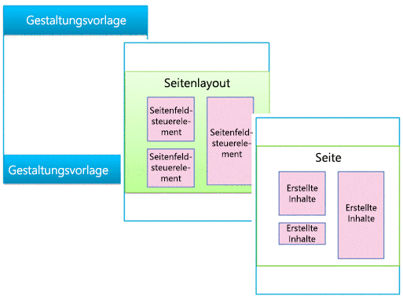
  
    
    

### Gestaltungsvorlagen

Eine Gestaltungsvorlage definiert den Chrome (die gemeinsam genutzten Rahmenelemente) Ihrer Website. Zu diesen Elementen zählen die Kopf- und Fußzeile, die oberste Navigationsleiste, Breadcrumbs, das Suchfeld, das Logo der Website und andere Gestaltungselemente. Die Gestaltungsvorlage bleibt einheitlich, wenn Besucher durch Ihre Website navigieren.
  
    
    

**Abbildung 2. Gestaltungsvorlage**

  
    
    

  
    
    
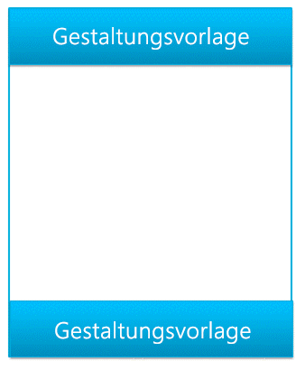
  
    
    
Eine Gestaltungsvorlage definiert außerdem als Inhaltsplatzhalter bezeichnete Bereiche, die mit Inhalten aus übereinstimmenden Bereichen in Seitenlayouts gefüllt werden. In der Regel enthält der Textkörper einer Gestaltungsvorlage nur einen einzigen Inhaltsplatzhalter (mit dem Namen **PlaceHolderMain**, der automatisch erstellt wird). Der gesamte Inhalt eines Seitenlayouts wird in diesem einen Inhaltsplatzhalter angezeigt (der Inhaltsplatzhalter **PlaceHolderMain** ist in Abbildung 3 rot umrandet).
  
    
    

**Abbildung 3. Gestaltungsvorlage mit umrandeten Seitenlayout**

  
    
    

  
    
    
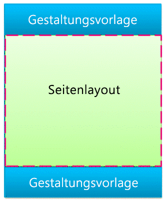
  
    
    
Wenn Sie im Entwurfs-Manager eine Vorschau einer Gestaltungsvorlage anzeigen, wird die folgende Meldung eingeblendet. Dieses **
**-Tag befindet sich innerhalb des primären Inhaltsplatzhalters. Kurz gesagt, definiert die Gestaltungsvorlage den Chrome einer Seite, während das Seitenlayout den Textkörper bestimmt, der im primären Inhaltsplatzhalter enthalten ist.
  
    
    

**Abbildung 4. Meldung bei Vorschau auf eine Gestaltungsvorlage**

  
    
    

  
    
    
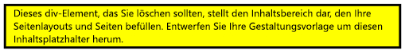
  
    
    

  
    
    

  
    
    

### Seitenlayouts

Ein Seitenlayout ist eine Vorlage für einen bestimmten Typ von Seite in Ihrer Website, z. B. eine Artikel- oder Produktdetailseite. Wie der Name schon sagt, wird mithilfe eines Seitenlayouts das Layout bzw. die Struktur des Textkörpers einer Seite bestimmt.
  
    
    

**Abbildung 5. Seitenlayout**

  
    
    

  
    
    
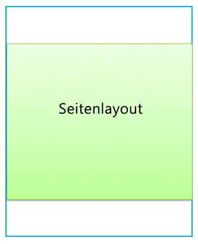
  
    
    
Mit Seitenlayouts werden Regionen oder Inhaltsbereiche definiert, die Inhaltsplatzhaltern in der Gestaltungsvorlage zugeordnet werden (in Abbildung 6 rot umrandet). Wiederum das gängigste Szenario ist, dass ein Seitenlayout einen einzelnen Inhaltsbereich bestimmt, der einem in einer Gestaltungsvorlage automatisch erstellten Inhaltsplatzhalter zugeordnet wird.
  
    
    

**Abbildung 6. Inhaltsbereich und Inhaltsplatzhalter**

  
    
    

  
    
    
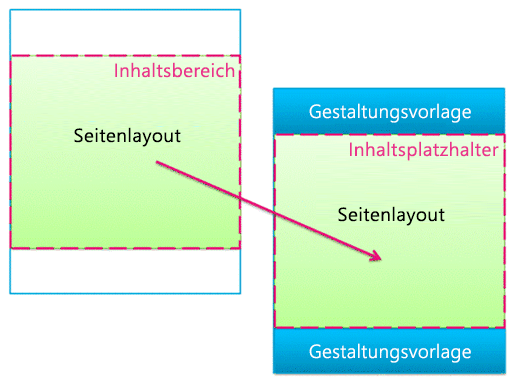
  
    
    

  
    
    

  
    
    

### Seitenfeld-Steuerelemente

Der primäre Zweck eines Seitenlayouts ist das Anordnen von Seitenfeldern. Wenn Sie ein Seitenlayout entwerfen, fügen Sie Positions- und Formatelemente ein, die Seitenfeld-Steuerelemente genannt werden. Diese Steuerelemente enthalten letztendlich Inhalte, wenn ein Autor eine Seite basierend auf diesem Seitenlayout erstellt. Neben Seitenfeldern können Seitenlayouts auch Webpartzonen enthalten, denen Autoren Webparts hinzufügen können. (Gestaltungsvorlagen dürfen keine Webpartzonen enthalten.)
  
    
    
Mit einem Seitenfeld-Steuerelement definieren Sie die Formate des Inhalts. Autoren können einer Seite Inhalte hinzufügen, doch der Designer hat die ultimative Kontrolle darüber, wie diese Inhalte mittels CSS gerendert werden, die auf diese Steuerelemente angewendet werden.
  
    
    

**Abbildung 7. Seitenlayout mit Seitenfeld-Steuerelementen**

  
    
    

  
    
    
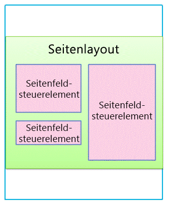
  
    
    
Jedem Seitenlayout ist in der Bibliothek **Seiten** ein Inhaltstyp zugeordnet. Ein Inhaltstyp ist ein Schema aus Spalten und Datentypen. Bei allen Seitenlayouts entsprechen die für das jeweilige Layout verfügbaren Seitenfelder direkt den Spalten, die für den Inhaltstyp des Seitenlayouts definiert sind.
  
    
    

### Beziehung von Gestaltungsvorlagen und Seitenlayouts

Gemeinsam bilden eine Gestaltungsvorlage und ein Seitenlayout eine Inhaltsseite.
  
    
    

**Abbildung 8. Gestaltungsvorlage mit Seitenlayout**

  
    
    

  
    
    
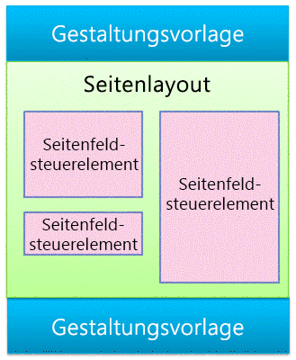
  
    
    
Die Gestaltungsvorlage definiert den Chrome aller Seiten der Website, sodass häufig zahlreiche Seitenlayouts (und demzufolge viele anhand dieser Seitenlayouts erstellte Seiten) einer Gestaltungsvorlage zugeordnet sind.
  
    
    

**Abbildung 9. Eine mit drei Seitenlayouts verknüpfte Gestaltungsvorlage**

  
    
    

  
    
    
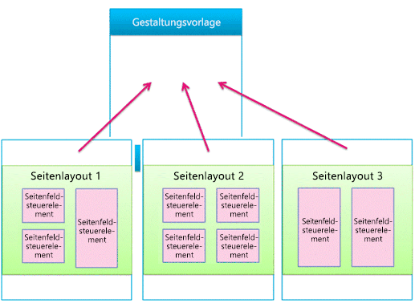
  
    
    
Doch auf Ihrer Website werden wahrscheinlich mehrere Gestaltungsvorlagen verwendet. Beispielsweise können Sie zusätzlich zur Standardgestaltungsvorlage über eine oder mehrere Gestaltungsvorlagen für bestimmte Geräte wie Smartphones und Tablets verfügen. In diesem Fall wird ein Seitenlayout von vielen Gestaltungsvorlagen verwendet (siehe den Abschnitt zu Gerätekanälen).
  
    
    
Sie können eine Gestaltungsvorlage pro Kanal pro SharePoint-Website verwenden.
  
    
    

### Seiten

Autoren können Seiten erstellen und Inhalte den Seitenfeldern hinzufügen. Sie können außerdem Webpartzonen und Rich-Text-Editoren Webparts hinzufügen. Seiten sind so strukturiert, dass Inhaltsautoren keine Änderungen außerhalb von Seitenfeldern vornehmen können.
  
    
    

**Abbildung 10. Seite mit erstelltem Inhalt**

  
    
    

  
    
    
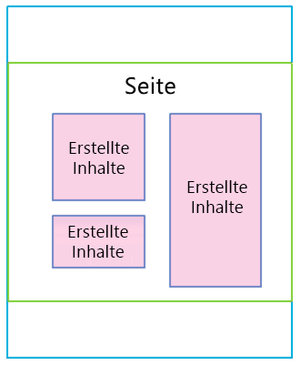
  
    
    
Die gerenderte Seite wird Besuchern der Website angezeigt. Wenn eine Seite vom Browser angefordert wird, erfolgt eine Zusammenführung der Gestaltungsvorlage mit dem Seitenlayout zum Erstellen einer Inhaltsseite. Der Inhalt dieser Seite wird anhand der jeweiligen Seite in der Bibliothek **Seiten** in den Seitenfeldern zusammengeführt.
  
    
    

**Abbildung 11. Gerenderte Seite im Browser**

  
    
    

  
    
    
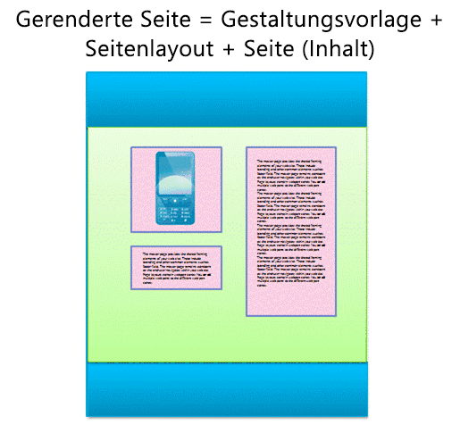
  
    
    

**Abbildung 12. Gestaltungsvorlage, Seitenlayout und Seite**

  
    
    

  
    
    
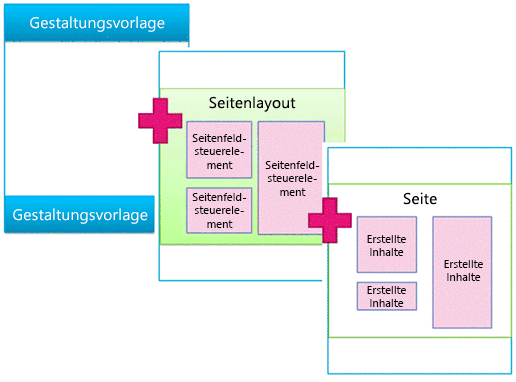
  
    
    

  
    
    

  
    
    

## Suchgesteuerte Webparts und Anzeigevorlagen

Im vorherigen Abschnitt wurde das SharePoint-Seitenmodell bezüglich Gestaltungsvorlagen, Seitenlayouts (mit Seitenfeldern) und Seiten erläutert. Diese Elemente sind auf einer Veröffentlichungswebsite am gängigsten, auf der Autoren neue Inhalte regelmäßig erstellen und veröffentlichen. Wenn es jedoch darum geht, diese Inhalte auf Ihrer Website anzuzeigen, kommen weitere Elemente ins Spiel. Ganz gleich, ob Sie eine Verbindung mit einem externen Katalog hergestellt haben oder einfach eine bestimmte Menge von Suchergebnissen anzeigen möchten, können Ihnen suchgesteuerter Webparts beim Erreichen Ihres Ziels helfen.
  
    
    
Beim Szenario mit suchgesteuerten Seiten enthält eine SharePoint-Seite diese Hauptelemente:
  
    
    

- Gestaltungsvorlagen
    
  
- Seitenlayouts:
    
  - Herkömmliche Seitenlayouts, die Sie für bestimmte Inhaltstypen (wie zuvor in diesem Artikel beschrieben) erstellen
    
  
  - Kategorie- und Elementdetail-Seitenlayouts, die durch die websiteübergreifende Veröffentlichung eines Katalogs erstellt werden
    
  
- Seiten
    
  
- Suchgesteuerte Webparts, wie z. B. das Inhaltssuche-Webpart
    
  
- Anzeigevorlagen zum Steuern, welche verwalteten Eigenschaften in den Suchergebnissen eines suchgesteuerten Webparts angezeigt werden, und des Formats und Verhaltens dieser Suchergebnisse:
    
  - Steuerelement-Anzeigevorlagen, die das Layout von Suchergebnissen und andere Elemente steuern, die alle Ergebnisse gemeinsam haben, z. B. Seitenverwaltung, Sortierung und andere Links
    
  
  - Elementanzeigevorlagen, die steuern, wie jedes Suchergebnis angezeigt und für jedes Ergebnis wiederholt wird
    
  

**Abbildung 13. Gestaltungsvorlage, Seitenlayout und Seite mit Webpart**

  
    
    

  
    
    
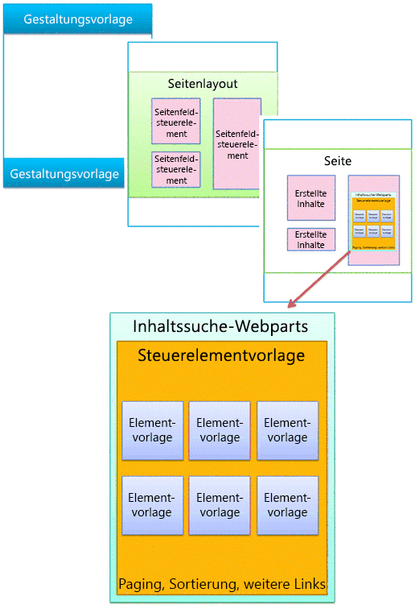
  
    
    

### Suchgesteuerte Webparts

Mit suchgesteuerten Webparts können Sie im Suchindex gespeicherte Informationen dynamisch präsentieren. Die Präsentation von Daten im Inhaltssuche-Webpart wird mithilfe von Anzeigevorlagen gesteuert, die neben Gestaltungsvorlagen und Seitenlayouts im Gestaltungsvorlagenkatalog enthalten sind.
  
    
    
SharePoint Server 2013 bietet mehrere direkt einsatzbereite Anzeigevorlagen, z. B. Listen und Bildschirmpräsentationen für Ihre Inhaltssuche-Webparts. Wenn Sie im Browser ein Inhaltssuche-Webpart konfigurieren, wählen Sie, welche Anzeigevorlagen verwendet werden sollen.
  
    
    

**Abbildung 14. Toolbereich des Inhaltssuche-Webparts**

  
    
    

  
    
    
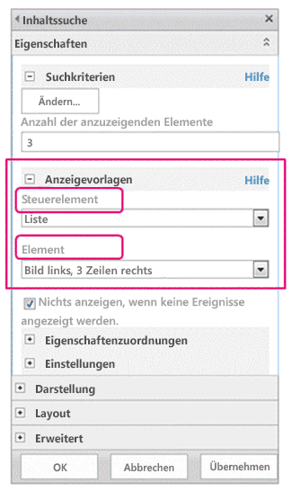
  
    
    
Inhaltssuche-Webparts verwenden zwei Typen von Anzeigevorlagen: Steuerelement und Element. Bei der Gestaltung Ihrer Website können Sie benutzerdefinierte Anzeigevorlagen erstellen, die von Ihnen festgelegte Layouts, Formate und Verhalten verwenden.
  
    
    

**Abbildung 15. Zwei Diagramme für Inhaltssuche-Webparts**

  
    
    

  
    
    
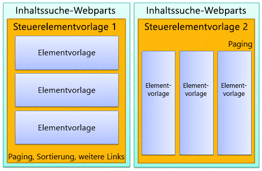
  
    
    

  
    
    

  
    
    

### Steuerelement-Anzeigevorlage

Die Steuerelementvorlage bestimmt die allgemeine Struktur und das Layout der Präsentation von Suchergebnissen, z. B. eine Liste mit Seitenverwaltung oder eine Bildschirmpräsentation. Jedes Inhaltssuche-Webpart verwendet eine Steuerelementvorlage.
  
    
    
Die Steuerelementvorlage bietet auch Funktionalität, die für alle Suchergebnisse gilt, einschließlich Seitenverwaltung, Sortierung, Anzeigeoptionen und Trennzeichen.
  
    
    

**Abbildung 16. In Webpart und Webseite hervorgehobene Steuerelementvorlage**

  
    
    

  
    
    
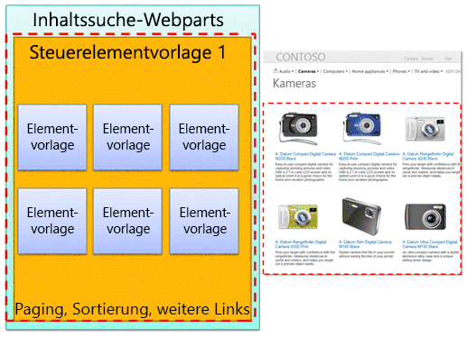
  
    
    

  
    
    

  
    
    

### Elementanzeigevorlage

Die Elementvorlage bestimmt, wie jedes Ergebnis in der Ergebnismenge angezeigt und die Vorlage für jedes Ergebnis wiederholt wird. Mithilfe einer Elementvorlage kann ein Bild, ein Bild mit Text, ein Video oder anderer Inhalt angezeigt werden.
  
    
    
Die Elementanzeigevorlage bestimmt außerdem, welche verwalteten Eigenschaften und Werte vom Inhaltssuche-Webpart angezeigt werden. Bei diesem Beispiel zeigt die Elementvorlage drei verwaltete Eigenschaften: ein kleines Bild, einen Produktnamen als Hyperlink und eine kurze Textbeschreibung.
  
    
    

**Abbildung 17. In Webpart und Webseite hervorgehobene Elementvorlagen**

  
    
    

  
    
    
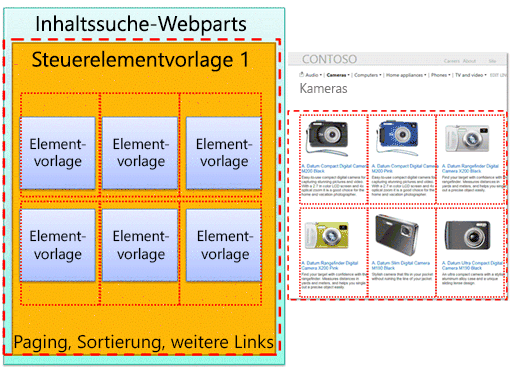
  
    
    

  
    
    

  
    
    

## Gerätekanäle und Gerätkanalbereiche

In SharePoint 2013 können Sie Gerätekanäle verwenden, um eine einzelne Veröffentlichungswebsite auf mehrere Weisen unter Verwendung verschiedener Designs für verschiedene Zielgeräte zu rendern. Sie erstellen eine einzelne Website und anschließend einmalig den dazugehörigen Inhalt. Danach können diese Website und ihr Inhalt auf die Verwendung verschiedener Gestaltungsvorlagen und Formatvorlagen für ein bestimmtes Gerät oder eine Gruppe von Geräten eingestellt werden.
  
    
    
Wenn Sie ein Design für mehrere Geräte entwerfen, berücksichtigen Sie diese Elemente:
  
    
    

- Gerätekanäle:
    
  - Durch Verwenden verschiedener Gestaltungsvorlagen und CSS pro Kanal können identische Seiteninhalte für bestimmte Geräte (z. B. Windows Phone) oder Gerätegruppen (alle Smartphones) auf verschiedene Weise dargestellt werden.
    
  
- Seitenlayouts:
    
  - Wenn sich der Inhalt nicht ändert, verwenden Sie dasselbe Seitenlayout für alle Gerätekanäle, wenngleich diese basierend auf den CSS der verschiedenen Gestaltungsvorlagen für jeden Kanal ein anderen Format haben können.
    
  
  - Wenn Sie Inhalte nur für bestimmte Geräte hinzufügen möchten, arbeiten Sie mit Gerätekanalbereichen.
    
  
- Seiten
    
  

### Gerätekanäle

Wenn Sie einen Gerätekanal erstellen, geben Sie die Benutzer-Agent-Teilzeichenfolgen für die Geräte an, die der Kanal abdecken soll. Dadurch können Sie besser kontrollieren, welche Geräte (oder Browser) vom jeweiligen Kanal abgedeckt werden. Wenn Sie dem Kanal anschließend eine Gestaltungsvorlage zuweisen, verbindet sich jede Gestaltungsvorlage wiederum mit ihrer eigenen Formatvorlage, durch die das Layout und die Formate für den jeweiligen Gerätetyp optimiert werden.
  
    
    

**Abbildung 18. Zwei Gerätekanäle mit separaten Gestaltungsvorlagen**

  
    
    

  
    
    
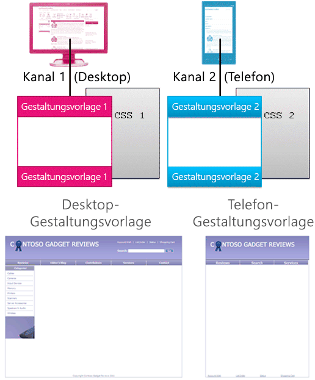
  
    
    
Sie können auch ausschließlich mit CSS viel erreichen. Es ist möglich, dass Gestaltungsvorlagen für zwei verschiedene Kanäle (z. B. Desktop und Smartphone) identisch sind, außer dass sie mit unterschiedlichen Formatvorlagen verknüpft sind. In den CSS-Dateien werden einfach unterschiedliche Formate für dieselben Seitenelemente verwendet.
  
    
    

### Beziehung von Gestaltungsvorlagen und Seitenlayouts

Im Gegensatz zu Gestaltungsvorlagen geben Sie nicht unterschiedliche Seitenlayouts für unterschiedliche Gerätekanäle an. Alle Seitenlayouts funktionieren mit allen Kanälen, die Sie erstellen. Demzufolge gilt ein Seitenlayout für viele Gerätekanäle und Gestaltungsvorlagen.
  
    
    
Dies ist einer der Hauptvorteile von Gerätekanälen: das Design (die Gestaltungsvorlage und CSS) ändert sich, aber der Inhalt (Seitenlayout und Seiten) bleibt gleicht. Doch mithilfe von Gerätekanalbereichen (siehe den nächsten Abschnitt) können Sie variieren, welche Inhalte eines Seitenlayouts auf verschiedenen Kanälen angezeigt werden.
  
    
    

**Abbildung 19. Layout mit einer Seite, das mit zwei Gestaltungsvorlagen arbeitet**

  
    
    

  
    
    
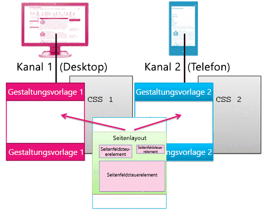
  
    
    

  
    
    

  
    
    

### Gerätekanalbereiche

Ein Gerätekanalbereich ist ein Steuerelement, das Sie einer Gestaltungsvorlage, einem Seitenlayout oder einer Anzeigevorlage hinzufügen können, um zu steuern, welche Inhalte über den jeweiligen Kanal gerendert werden. Ein Kanalbereich ist im Wesentlichen ein Container, der einen oder mehrere Kanäle angibt. Wenn einer oder mehrere dieser Kanäle beim Rendern der Seite aktiv sind, werden alle Inhalte des Kanalbereichs ebenfalls gerendert. Ein Kanalbereich kann beliebige Inhaltstypen enthalten, einschließlich eines Links zu einer CSS- oder JS-Datei, und ist eine einfache Möglichkeit, spezifische Inhalte für spezifische Kanäle hinzuzufügen.
  
    
    
Vielleicht das gängigste Szenario für die Nutzung von Kanalbereichen ist das selektive Hinzufügen von Teilen eines Seitenlayouts für bestimmte Kanäle. Angenommen, Sie haben ein Seitenlayout mit getrennten Textfeldern für eine lange und eine kurze Begrüßung. Durch Ablegen der Seitenfelder in Kanalbereichen können Sie die kurze Begrüßung nur auf Smartphones und die lange Begrüßung nur auf Desktopcomputern anzeigen. Der Inhalt eines Gerätekanalbereichs wird nicht Kanälen angezeigt, die nicht darin enthalten sind. Und der Inhalt dieses Gerätekanals wird überhaupt nicht angezeigt, was verhindert, dass Daten übertragen werden.
  
    
    

**Abbildung 20. Seitenlayout mit Kanalbereichen**

  
    
    

  
    
    
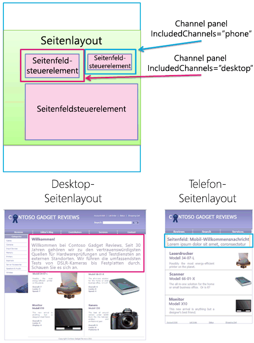
  
    
    
Sie können Kanalbereiche auch in Gestaltungsvorlagen verwenden. Wenn Sie beispielsweise eine Gestaltungsvorlage haben, die bei nur minimalen Änderungen zwei verschiedene Geräte oder (zwei verschiedene Browser) unterstützt, können Sie Kanalbereiche verwenden, um den Inhalt der Gestaltungsvorlage aufzunehmen, der für jedes dieser Geräte spezifisch ist.
  
    
    
Oder Sie können einen Kanalbereich innerhalb der Elementanzeigevorlage eines Inhaltssuche-Webparts verwenden, um weitere verwaltete Eigenschaften für dieses Element aus dem Katalog nur für Desktops und nicht für Smartphones anzuzeigen.
  
    
    

**Abbildung 21. Seitenlayout und Elementvorlagen mit Kanalbereichen**

  
    
    

  
    
    

  
    
    

  
    
    

  
    
    

## Zusätzliche Ressourcen

-  [Übersicht über den Entwurfs-Manager in SharePoint 2013](overview-of-design-manager-in-sharepoint-2013.md)
    
  
-  [Erstellen von Websites für SharePoint](build-sites-for-sharepoint.md)
    
  
-  [Anzeigevorlagen im SharePoint 2013-Entwurfs-Manager](sharepoint-2013-design-manager-display-templates.md)
    
  
-  [SharePoint 2013-Design-Manager-Gerätekanäle](sharepoint-2013-design-manager-device-channels.md)
    
  

