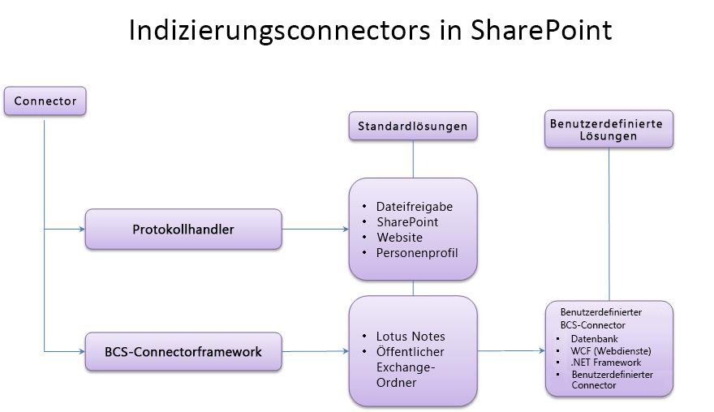
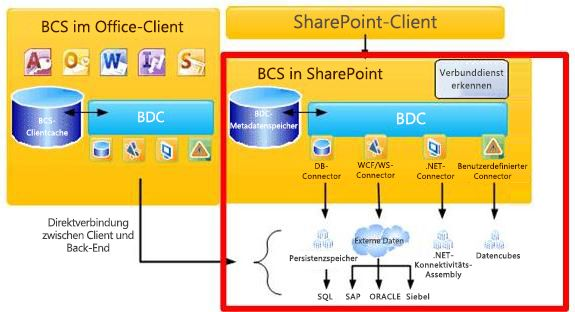
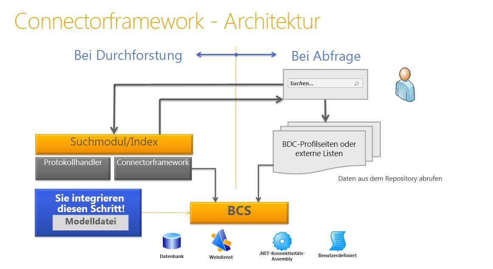

# Connector Framework für die Suche in SharePoint 2013
Erfahren Sie mehr über die SharePoint 2013-Indizierungsconnectors, das Connector Framework und das Erstellen von benutzerdefinierten BCS-Indizierungsconnectors zum Durchsuchen externer Systeme.
## Inhalt für die Suche in SharePoint 2013 verfügbar machen

Suche in SharePoint 2013 stellt zwei Ansätze für die Verarbeitung von Anfragen zum Zurückgeben von Suchergebnissen bereit: die Sammelsuche und das Durchforsten von Inhalten.
  
    
    
 **Sammelsuche** Bei diesem Ansatz werden Suchergebnisse für Inhalte zurückgegeben, die nicht von Ihrem Suchserver durchforstet werden. Die Abfrage wird an ein externes Inhaltsrepository weitergeleitet, in dem sie von der Suchmaschine dieses Repositorys verarbeitet wird. Die Suchmaschine des Repositorys gibt dann die Ergebnisse an den Suchserver zurück. Der Suchserver formatiert und rendert die Ergebnisse aus dem externen Repository für die Anzeige auf der Suchergebnisseite. Dieser Ansatz bietet folgende Vorteile:
  
    
    

- Sie benötigen keine zusätzlichen Kapazitäten für den Inhaltsindex, da der Inhalt nicht von Suche in SharePoint 2013 durchforstet wird.
    
  
- Sie können die vorhandene Suchmaschine eines Repositorys nutzen. Sie können z. B. einen Verbund mit einer Internetsuchmaschine herstellen, um das Internet zu durchsuchen.
    
  
- Sie können die Suchmaschine des Inhaltsrepositorys für die spezielle Inhaltsgruppe des Repositorys optimieren, was möglicherweise eine bessere Suchleistung für die Inhaltsgruppe bereitstellt.
    
  
- Sie können auf Repositories zugreifen, die gegen Durchforstungen gesichert sind, auf die jedoch mit Suchabfragen zugegriffen werden kann.
    
  
 **Durchforsten von Inhalten** Bei diesem Ansatz werden Ergebnisse vom Inhaltsindex der Suchdienstanwendung basierend auf der Abfrage des Benutzers zurückgegeben. Der Inhaltsindex enthält Inhalte, die von der Suchdienstanwendung durchforstet werden, und umfasst Textinhalte und Metadaten für jedes Inhaltselement. Dieser Ansatz ermöglicht Folgendes:
  
    
    

- Sie können Suchergebnisse nach Relevanz sortieren.
    
  
- Sie können steuern, wie häufig der Inhaltsindex aktualisiert wird.
    
  
- Sie können angeben, welche Metadaten durchforstet werden.
    
  
- Sie können einen einzelnen Sicherungsvorgang für durchforstete Inhalte durchführen.
    
  

## Durchforsten von Inhalten mit Indizierungsconnectors in SharePoint 2013

Der Crawler verwendet Indizierungsconnectors, um auf die zu durchforstenden Inhalte zuzugreifen. Der Indizierungsconnector ist eine Komponente, die weiß, wie eine Verbindung mit der Inhaltsquelle hergestellt wird, was durchforstet werden soll und wie der Inhalt durchforstet wird. In früheren Versionen von SharePoint wurden diese als Protokollhandler bezeichnet, Komponenten, die auf benutzerdefinierten Schnittstellen nicht verwalteten C++-Code ausführen. 
  
    
    
Suche in SharePoint 2013enthält ein Connector Framework, das in SharePoint Server 2010 eingeführt wurde und auf Microsoft Business Connectivity Services (BCS) basiert, was einen einfacheren Ansatz für die Entwicklung von Indizierungsconnectors bietet. Mit dem Connector Framework verwendet der Crawler auf BCS basierende Indizierungsconnectors zum Durchforsten von externen Inhalten. SharePoint 2013 verwendet sowohl Indizierungsconnectors, die auf Protokollhandlern basieren, als auch BCS-Indizierungsconnectors zum Durchforsten von Inhalten.
  
    
    
In Abbildung 1 sehen Sie eine allgemeine Übersicht über die SharePoint 2013-Indizierungsconnectors.
  
    
    

  
    
    

  
    
    

  
    
    

  
    
    

## BCS-Übersicht für Suche in SharePoint 2013

BCS ist die Sammlung von Tools und Infrastrukturen, mit denen Sie eine Verbindung zu externen Systemen von SharePoint herstellen können. Abbildung 2 enthält eine allgemeine Ansicht der BCS-Architektur, in der die für die Suche relevanten Bereiche markiert sind.
  
    
    

  
    
    

**Abbildung 2: BCS-Architektur einschließlich Suche**

  
    
    

  
    
    

  
    
    

  
    
    
BCS stellt die Verbindung mit den externen Daten basierend auf den externen Inhaltstypdefinition im Metadatenspeicher her. Der Metadatenspeicher enthält die folgenden Informationen für einen externen Inhaltstyp:
  
    
    

- **Konnektivitätsinformationen** Beschreibt, wie eine Verbindung mit dem externen System hergestellt wird.
    
  
- **Entitätsinformationen** Beschreibt die Struktur der externen Daten.
    
  
- **Vorgänge**Beschreibt Methoden, die für den Zugriff auf die externen Daten verwendet werden. Bei Datenbanken und Webdiensten werden diese Methoden vom externen System unterstützt: SQL-Anweisungen für Datenbankconnectors und Webmethoden für Webdienste. Bei .NET- und benutzerdefinierten BCS-Indizierungsconnectors handelt es sich um Methoden, die in der Connectorassembly implementiert sind, der Komponenten-DLL, die Sie für den Indizierungsconnector erstellen.
    
  
Diese Informationen sind in der BDC-Modelldatei für den externen Inhaltstyp angegeben. Weitere Informationen zu BDC-Modellen und deren Inhalten finden Sie unter  [BDC-Modellinfrastruktur](http://msdn.microsoft.com/library/2818ebdd-6cda-4d8f-82b2-7fde9fbf2633%28Office.15%29.aspx).
  
    
    
Ausführliche Informationen über die BCS-Architektur und -Funktionalität finden Sie unter  [Business Connectivity Services (Übersicht)](http://msdn.microsoft.com/library/91dd7b01-ead2-4f87-804b-b59ef2245c87%28Office.15%29.aspx) und [Mechanismen im Zusammenhang mit der Verwendung von Business Connectivity Services](http://msdn.microsoft.com/library/ff3e312b-0fbc-48ed-a752-76c50d286533%28Office.15%29.aspx).
  
    
    

### Verwenden des Connector Frameworks

Zum Durchforseten externer Daten müssen Sie einen der Inhaltsquellentypen hinzufügen, die das Verbinden mit externen Daten unterstützen. In Tabelle 1 sind diese Inhaltsquellentypen aufgelistet.
  
    
    

**Tabelle 1: Inhaltsquellentypen, die BCS-Indizierungsconnectors unterstützen**

|**Inhaltsquellentyp**|**Beschreibung**|
|:-----|:-----|
|Branchendaten    |Verwenden Sie diese Inhaltsquelle für Datenbank- und Webdienst-BCS-Indizierungsconnenctors.    |
|Benutzerdefiniertes Repository    |Verwenden Sie diese Inhaltsquelle für .NET- und benutzerdefinierte BCS-Indizierungsconnectors.    |
   
Mit dem Connector Framework können Sie BCS-Indizierungsconnectors verwenden, um eine Verbindung zu externen Inhalten herzustellen, die Sie durchforsten und in den Inhaltsindex einschließen möchten. Der BCS-Indizierungsconnector wird vom Crawler verwendet, um mit der externen Datenquelle zu kommunizieren. Zum Zeitpunkt der Durchforstung ruft der Crawler den BCS-Indizierungsconnector auf, um die Daten aus dem externen System abzurufen und zurück an den Crawler zu übergeben. Der BCS-Indizierungsconnector analysiert außerdem die Zugriffs-URLs, die von der Suche verstanden wurden, und die Kennungen, die von BCS verstanden wurden, wenn sie während der Durchforstung zwischen BCS und der Suche übergeben werden.
  
    
    
BCS-Indizierungsconnectors bestehen aus Folgendem:
  
    
    

  
    
    
> **BDC-Modelldatei** Die Datei, die die Struktur der Daten und die Verbindungsinformationen für das externe System bereitstellt
    
  

  
    
    
> **Connector** Die Komponente, die den Code enthält, der eine Verbindung mit dem externen System herstellt und die Zugriffs-URLs und BCS-Kennungen analysiert.
    
  
Für BCS-Indizierungsconnectors, die auf den Branchen-Inhaltsquelltypen basieren, enthält die Suche integrierte Connectors, sodass Sie nur eine BDC-Modelldatei erstellen müssen. 
  
    
    
Für BCS-Indizierungsconnectors, die auf dem Inhaltsquellentyp für ein benutzerdefiniertes Repository basieren, müssen Sie eine benutzerdefinierte Komponente zusätzlich zu einer BDC-Modelldatei entwickeln, um die Verbindung mit externen Daten herzustellen.
  
    
    
Abbildung 3 zeigt eine allgemeine Ansicht der Such-Connector-Framework-Architektur.
  
    
    

**Abbildung 3: Such-Connector-Framework-Architektur**

  
    
    

  
    
    

  
    
    

  
    
    

  
    
    

### BCS-Indizierungsconnectors

SharePoint 2013 unterstützt die folgenden Typen von BCS-Indizierungsconnectors:
  
    
    

- **Datenbankconnector** SharePoint 2013 enthält einen vordefinierten BCS-Connector, der das Herstellen einer Verbindung zu Datenbanken unterstützt, sodass Sie einen Datenbank-BCS-Indizierungsconnector erstellen können, ohne Code schreiben zu müssen - Sie erstellen einfach die BDC-Modelldatei für den Connector.
    
  
- **WCF-Connector (Webdienste)** SharePoint 2013 enthält einen vordefinierten BCS-Connector, der das Herstellen einer Verbindung zu Webdiensten unterstützt, sodass Sie einen Webdienst-BCS-Indizierungsconnector erstellen können, ohne Code schreiben zu müssen - Sie erstellen einfach die BDC-Modelldatei für den Connector.
    
    > **HINWEIS**
      > Auch wenn Sie keinen Code schreiben müssen, um einen Connector für Webdienste zu erstellen, muss der Webdienst Methoden enthalten, die dieselbe Funktionalität bereitstellen, die der .NET-BCS-Connector bereitstellt, um die externen Geschäftsdaten an BCS zu übergeben. Informationen zum Erstellen eines Webdiensts finden Sie unter  [Erstellen von .NET-Konnektivitäts-Assemblys und Webdiensten](http://msdn.microsoft.com/library/9a6c6712-868a-4a9c-9645-3aa448ad5092%28Office.15%29.aspx). Codebeispiele finden Sie unter  [Sample Orders ASP.NET Web Service Sample](http://msdn.microsoft.com/library/10e46860-788f-4ed0-a4d8-1e17ada58e83%28Office.15%29.aspx) und [Sample Orders WCF Service Sample](http://msdn.microsoft.com/library/535277c8-9d5c-41eb-ab23-0ae141d726c5%28Office.15%29.aspx). 
- **.NET-BCS-Connector**SharePoint 2013 enthält keinen vordefinierten BCS-Connector für .NET-Connectors, sodass Sie zusätzlich zum Erstellen einer BDC-Modelldatei auch eine .NET-Komponente für den BCS-Indizierungsconnector erstellen müssen. Sie müssen die erforderlichen stereotypen Vorgänge zur Unterstützung der Durchforstung der Daten sowie Methoden für die Analyse der Zugriffs-URLs und BDC-Kennungen implementieren. 
    
  
- **Benutzerdefinierter BCS-Connector**SharePoint 2013 enthält keinen vordefinierten BCS-Connector für benutzerdefinierte .NET-Connectors, deshalb müssen Sie zusätzlich zum Erstellen einer BDC-Modelldatei wie beim .NET-BCS-Connector auch eine .NET-Komponente für den BCS-Indizierungsconnector erstellen. Sie müssen die erforderlichen stereotypen Vorgänge zur Unterstützung der Durchforstung der Daten sowie Methoden für die Analyse der Zugriffs-URLs und BDC-Kennungen implementieren. Außerdem müssen Sie die **ISystemUtility**-Schnittstelle implementieren. 
    
  

## Erstellen von BCS-Indizierungsconnectors

Bei der Entwicklung eines BCS-Indizierungsconnectors müssen Sie unabhängig davon, ob Sie nur die BDC-Modelldatei für Datenbank- und Webdienst-Indizierungsconnectors erstellen oder die BDC-Modelldatei erstellen und die BCS-Connectorkomponente für .NET sowie benutzerdefinierte Indizierungsconnectors codieren, Folgendes berücksichtigen:
  
    
    

- **Konnektivität** Wie Sie die Verbindung zum externen Datenrepository erstellen, z. B. die Serveradresse, die IP-Adresse oder den Namen der Datenbankinstanz. Umfasst außerdem die Authentifizierungsinformationen, die zum Verbinden mit dem externen Datenrepository verwendet werden.
    
  
- **Struktur des Repositorys** Zum Lesen der Daten muss der Connector wissen, wie das Repository organisiert ist. Ist es hierarchisch, numerisch oder muss es Links durchlaufen?
    
  
- **Inkrementelle Durchforstungen** Geben Sie dem Connector zur Reduzierung der Leistungsauslastung im externen Datenrepository die Möglichkeit, zusätzliche zu vollständigen Durchforstungen inkrementelle Durchforstungen durchzuführen. Dafür muss der Connector erkennen, welche Daten seit der letzten Durchforstung geändert wurden und nur diese Daten durchforsten können. Dies kann mit einer zeitstempelbasierten inkrementellen Durchforstung oder einer Durchforstung auf der Basis des Änderungsprotokolls erfolgen. Der von Ihnen implementierte Ansatz hängt von den APIs, die das Repository bereitstellt, und den Aktualitätszielen für den Inhalt ab.
    
  
- **Sichern von Daten** In den meisten Szenarien sind nicht alle Daten für alle Benutzer zugänglich. Es ist wichtig, dass dies auch bei der Suche funktioniert, damit einem Benutzer, der über die Suchbenutzeroberfläche sucht, nur die Ergebnisse angezeigt werden, auf die er Zugriff hat. Das bedeutet, dass der Connector wissen muss, wie er die Sicherheit des externen Systems liest, und diese sicherheitsbezogenen Informationen während der Durchforstung zurück zum Index bringen muss. Sie können z. B. das Speichern von Windows NT-Zugriffssteuerungslisten (ACLs) während der Durchforstung implementieren.
    
  
In Tabelle 2 sind die stereotypen Vorgänge beschrieben, die für das Erstellen eines BCS-Indizierungsconnectors für SharePoint 2013 gelten.
  
    
    

**Tabelle 2: Von Suche in SharePoint 2013 unterstützte stereotype BCS-Vorgänge**

|**Vorgang**|**Beschreibung**|
|:-----|:-----|
|Finder    |Kernvorgang, der beim Erstellen eines BCS-Connectors erforderlich ist. Dieser Vorgang ruft die Liste der Elemente der externen Inhaltsquelle ab. Weitere Informationen finden Sie unter  [Implementieren eines Finders](http://msdn.microsoft.com/library/a0cb7cfe-8758-4057-aa85-03071536745e%28Office.15%29.aspx).    |
|SpecificFinder    |Kernvorgang, der beim Erstellen eines BCS-Connectors erforderlich ist. Dieser Vorgang ruft einzelne Elemente aus der externen Inhaltsquelle ab. Weitere Informationen finden Sie unter  [Implementieren von SpecificFinder](http://msdn.microsoft.com/library/9b6effa5-20ce-4ce7-a8dc-0fd601eb0f23%28Office.15%29.aspx).    |
|ChangedIdEnumerator    |Erforderlich, um inkrementelle Durchforstungen auf der Basis des Änderungsprotokolls zu implementieren. Weitere Informationen finden Sie unter  [Implementieren von ChangedIdEnumerator](http://msdn.microsoft.com/library/19d3c942-f6d7-49e7-853f-4d9b61b10422%28Office.15%29.aspx).    |
|DeletedIdEnumerator    |Erforderlich, um inkrementelle Durchforstungen auf der Basis des Änderungsprotokolls zu implementieren. Weitere Informationen finden Sie unter  [Implementieren von DeletedIdEnumerator](http://msdn.microsoft.com/library/aa1c521a-0c9b-4dc0-a32f-fb9e54c52bed%28Office.15%29.aspx).    |
|BinarySecurityDescriptorAccessor    |Erforderlich zum Implementieren der Sicherheit auf Elementebene. Gibt die Sicherheitsbeschreibung für ein Element aus der externen Inhaltsquelle zurück. Weitere Informationen finden Sie unter  [Implementieren von BinarySecurityDescriptorAccessor](http://msdn.microsoft.com/library/6cf70490-dd3c-49cd-bb13-ed33e938435d%28Office.15%29.aspx).    |
|StreamAccessor    |Erforderlich zum Aktivieren der Durchforstung von Anlagen aus der externen Inhaltsquelle. Gibt die Anlage als Datenstrom zurück. Weitere Informationen finden Sie unter  [Implementieren von StreamAccessor](http://msdn.microsoft.com/library/e3d8053b-90c0-4207-98e3-91e42db13cf1%28Office.15%29.aspx).    |
   

  
    
    

### Toolunterstützung für die Entwicklung von BCS-Indizierungsconnectors

BCS bietet Toolunterstützung für BCS-Connectors in SharePoint Designer und Visual Studio.
  
    
    

#### SharePoint Designer-Toolunterstützung für BCS-Connectors

SharePoint Designer stellt eine begrenzte Sammlung von Funktionen bereit. Sie können diese verwenden, um BDC-Modelldateien für vorhandene BCS-Connectortypen wie Datenbank-, Webdienst- und .NET-BCS-Connectors zu erstellen. Sie können sie auch verwenden, um BDC-Modelldateien aus einer BCS-Dienstanwendung in eine andere BCS-Dienstanwendung zu exportieren.
  
    
    

#### Visual Studio-Toolunterstützung für BCS-Connectors

Sie können mit Visual Studio die Komponente für .NET-BCS- und benutzerdefinierten BCS-Connectors erstellen. Für .NET-BCS-Connectors stellt Visual Studio die Business Data Connectivity-Modellprojektvorlage bereit, die eine Reihe von visuellen Designer- und Codeverwaltungsfunktionen enthält, mit denen Sie die .NET-Komponente und die zugehörige BDC-Modelldatei für den .NET-BCS-Connector einfacher erstellen, debuggen und bereitstellen können. Es gibt keine entsprechende Projektvorlage für benutzerdefinierte BCS-Connectors.
  
    
    

## Verbesserungen am Connector Framework in SharePoint 2013

In SharePoint 2013 unterstützt das Connector Framework BCS-Connectors, die Anspruchsinformationen für Inhalte abrufen, die in benutzerdefinierten externen Datenrepositorys gespeichert sind.
  
    
    
Das Connector Framework bietet außerdem eine verbesserte Ausnahmeerfassung und -protokollierung, die Ihnen helfen, Fehler beim Durchforsten von Inhaltsquellen mithilfe von BCS-Connectors zu beheben.
  
    
    

## Zusätzliche Ressourcen

-  [Optimieren der BDC-Modelldatei für die Suche in SharePoint 2013](enhancing-the-bdc-model-file-for-search-in-sharepoint-2013.md)
    
  
-  [SharePoint 2013: Beispiel für einen benutzerdefinierten MyFileConnector-BCS-Indizierungsconnector](http://code.msdn.microsoft.com/SharePoint-2013-MyFileConne-79d2ea26)
    
  
-  [Vorgehensweise: durchforsten zugeordneter externe Inhaltstypen in SharePoint 2013](how-to-crawl-associated-external-content-types-in-sharepoint-2013.md)
    
  
-  [Vorgehensweise: durchforsten binary large Objects () in SharePoint 2013](how-to-crawl-binary-large-objects-blobs-in-sharepoint-2013.md)
    
  
-  [Vorgehensweise: durchforsten zugeordneter externe Inhaltstypen in SharePoint 2013](how-to-crawl-associated-external-content-types-in-sharepoint-2013.md)
    
  
-  [Vorgehensweise: Konfigurieren der Sicherheit auf Elementebene in SharePoint 2013](how-to-configure-item-level-security-in-sharepoint-2013.md)
    
  

