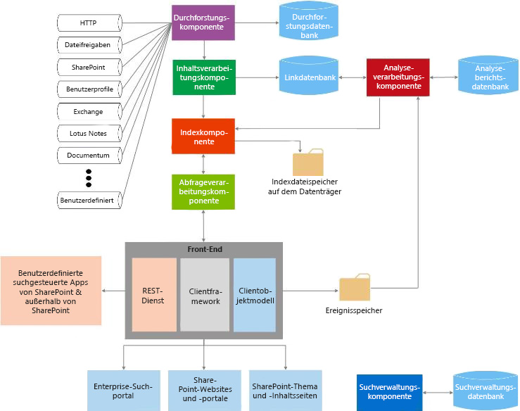

# Suche in SharePoint 2013
Informationen zur Erweiterbarkeit von Bausteinen in Suche in SharePoint 2013 und zu deren Verwendung für Ihre Anwendungsfälle.
Mithilfe von Suche in SharePoint 2013 können Benutzer relevante Informationen schneller und einfacher denn je finden. Zudem wird es für Suchadministratoren einfach gestaltet, die Suchabfrage anzupassen. Außerdem werden verschiedene API-Sätze für komplexere Anpassungen und Lösungen bereitgestellt.
  
    
    

In den folgenden Artikeln erhalten Sie eine geeignete Einführung zu allgemeinen SharePoint 2013-Entwicklungskonzepten. Möglicherweise ist es für Sie hilfreich, diese vor dem Fortfahren zu lesen:
-  [Einrichten einer allgemeinen Entwicklungsumgebung für SharePoint 2013](set-up-a-general-development-environment-for-sharepoint-2013.md)
    
  
-  [Auswählen des richtigen API-Satzes in SharePoint 2013](choose-the-right-api-set-in-sharepoint-2013.md)
    
  
-  [SharePoint-Add-Ins im Vergleich zu SharePoint-Lösungen](sharepoint-add-ins-compared-with-sharepoint-solutions.md)
    
  
-  [Entscheidung zwischen SharePoint-Add-Ins und SharePoint-Lösungen](deciding-between-sharepoint-add-ins-and-sharepoint-solutions.md)
    
  

## Übersicht über die Architektur der Suche

Suche in SharePoint 2013 umfasst eine Vielzahl von Verbesserungen und neuen Features. Mit dieser Version wird Suche in SharePoint 2013 zu einer einzelnen Unternehmenssuchplattform umgestaltet. Die Sucharchitektur besteht aus den folgenden Bereichen:
  
    
    

-  [Durchforsten und Inhaltsverarbeitung](#bk_crawl)
    
  
-  [Index](#bk_index)
    
  
-  [Abfrageverarbeitung](#bk_query)
    
  
-  [Suchverwaltung](#bk_searchadmin)
    
  
-  [Analyse](#bk_analytics)
    
  
Diese Bereiche bestehen aus Komponenten und Datenbanken, die gemeinsam Suchvorgänge ausführen. Abbildung 1 bietet einen Überblick über die verschiedenen Bereiche der Sucharchitektur und die darin enthaltenen Komponenten und Datenbanken, die gemeinsam die Suchvorgänge ausführen.
  
    
    

**Abbildung 1. Interaktion der Suchkomponenten**

  
    
    

  
    
    

  
    
    
Eine ausführlichere Ansicht finden Sie unter  [Technische Diagramme - Suche](http://technet.microsoft.com/de-de/library/cc263199.aspx#search) und [Übersicht über die Suche in SharePoint Server 2013](http://technet.microsoft.com/de-de/library/jj219738.aspx).
  
    
    

### Durchforsten und Inhaltsverarbeitung

Die Architektur für Durchforsten und Inhaltsverarbeitung umfasst Folgendes:
  
    
    
 **Durchforstungskomponente**
  
    
    
 Durchforstet Inhaltsquellen, um durchforstete Eigenschaften und Metadaten von durchforsteten Elementen zu erfassen. Diese Informationen werden dann an die Inhaltsverarbeitungskomponente gesendet.
  
    
    
 **Durchforstungsdatenbank**
  
    
    
Enthält Informationen zu durchforsteten Elementen, z. B. zum Zeitstempel der letzten Durchforstung, zur letzten Durchforstungs-ID und zum Typ der Aktualisierung während der letzten Durchforstung.
  
    
    
 **Inhaltsverarbeitungskomponente**
  
    
    
Durchforstet Inhaltsquellen, um durchforstete Eigenschaften und Metadaten von durchforsteten Elementen zu erfassen. Diese Informationen werden dann an die Indexkomponente gesendet.
  
    
    

### Index

Die Indexkomponente empfängt die von der Inhaltsverarbeitungskomponente verarbeiteten Elemente und schreibt diese in den Suchindex. Diese Komponente behandelt auch eingehende Abfragen, ruft Informationen aus dem Suchindex ab und sendet das Resultset an die Abfrageverarbeitungskomponente zurück.
  
    
    

### Abfrageverarbeitung

Die Abfrageverarbeitungkomponente analysiert und verarbeitet Suchabfragen und Ergebnisse. Die verarbeitete Abfrage wird dann an die Indexkomponente gesendet, die eine Reihe von Suchergebnissen für die Abfrage zurückgibt.
  
    
    

### Suchverwaltung

Die Suchverwaltung besteht aus der Suchverwaltungskomponente und ihrer entsprechenden Datenbank.
  
    
    
 **Suchverwaltungskomponente**
  
    
    
Führt die Systemprozesse für die Suche aus, fügt neue Instanzen von Suchkomponenten hinzu und initialisiert diese anschließend.
  
    
    
 **Suchverwaltungsdatenbank**
  
    
    
Speichert die Suchkonfigurationsdaten.
  
    
    

### Analyse

Die Analysearchitektur besteht aus der Analyseverarbeitungskomponente, Analyseberichtsdatenbank und Linkdatenbank.
  
    
    
 **Analyseverarbeitungskomponente**
  
    
    
Führt die Suchanalyse und Nutzungsanalyse durch.
  
    
    
 **Linkdatenbank**
  
    
    
Speichert Informationen, die von der Inhaltsverarbeitungskomponente und Klickinformationen der Suche extrahiert werden.
  
    
    
 **Analyseberichtsdatenbank**
  
    
    
Speichert die Ergebnisse der Nutzungsanalyse.
  
    
    
 **Ereignisspeicher**
  
    
    
Speichert die Nutzungsereignisse, die auf dem Front-End erfasst werden.
  
    
    

## Erweiterbarkeitspunkte der Suche

Die Suche in SharePoint 2013-Architektur bietet verschiedene Erweiterbarkeitspunkte, um Anpassungsszenarien zu unterstützen. In diesem Abschnitt werden diese Punkte beschrieben und gezeigt, wo Sie weitere Informationen zur Entwicklung für diese Szenarien finden können.
  
    
    

### Konnektorframework

Die Durchforstungskomponente durchforstet Inhalte, indem Konnektoren oder Protokollhandler aufgerufen werden, die mit Inhaltsquellen interagieren, um Daten abzurufen. Suche in SharePoint 2013 umfasst ein Konnektorframework, mit dem Sie Konnektoren anpassen und erstellen können, um neue Inhaltsquellen zu durchforsten. Weitere Informationen zur Architektur des Konnektorframeworks und zu deren Erweiterung finden Sie unter  [Connector Framework für die Suche in SharePoint 2013](search-connector-framework-in-sharepoint-2013.md).
  
    
    

### Benutzerdefinierte Inhaltsverarbeitung

Innerhalb der Inhaltsverarbeitungskomponente können Sie das Webdienstpopup für die Inhaltsanreicherung verwenden, um die verwalteten Eigenschaften von durchforsteten Elementen zu ändern, bevor diese zum Suchindex hinzugefügt werden. Dieses Webdienstpopup wird für jeden von Ihnen erstellten externen Webdienst für die Inhaltsanreicherung ausgerufen. Weitere Informationen finden Sie unter  [Benutzerdefinierte Inhaltsverarbeitung mit dem Webdienstpopup zur Inhaltsanreicherung](custom-content-processing-with-the-content-enrichment-web-service-callout.md). Informationen zur schrittweisen Implementierung eines Webdiensts für die Inhaltsanreicherung finden Sie unter  [Vorgehensweise: verwenden die Anreicherung Web Service als Legende für SharePoint Server](how-to-use-the-content-enrichment-web-service-callout-for-sharepoint-server.md). Der Blogbeitrag  [Anpassen der SharePoint 2013-Suchabfrage mit einem Webdienst für die Inhaltsanreicherung](http://blogs.msdn.com/b/sharepointdev/archive/2012/11/13/customize-the-sharepoint-2013-search-experience-with-a-content-enrichment-web-service.aspx) ist ebenfalls eine geeignete Ressource.
  
    
    

### Abfrage-APIs

Suche in SharePoint 2013 stellt verschiedene Abfrage-APIs zur Verfügung und bietet Ihnen damit unzählige Wege für den Zugriff auf Suchergebnisse. Suchergebnisse können somit in einer Vielzahl von benutzerdefinierten Lösungstypen zurückgegeben werden.
  
    
    
Tabelle 1 zeigt die APIs, die Sie zum Programmieren von Suche in SharePoint 2013 verwenden können, und wo Sie diese finden.
  
    
    

**Tabelle 1: Such-APIs**

|**API-Name**|**Klassenbibliothek oder Schema und Pfad**|
|:-----|:-----|
|.NET-Clientobjektmodelle (CSOM)    |Microsoft.SharePoint.Client.Search.dll          %ProgramFiles%\\Common Files\\Microsoft Shared\\web server extensions\\15\\ISAPI    |
|Silverlight-CSOM    |Microsoft.SharePoint.Client.Search.Silverlight.dll          %ProgramFiles%\\Common Files\\Microsoft Shared\\web server extensions\\15\\TEMPLATE\\LAYOUTS\\ClientBin    |
|JavaScript-CSOM    |SP.search.js          %ProgramFiles%\\Common Files\\Microsoft Shared\\web server extensions\\15\\TEMPLATE\\LAYOUTS    |
|REST-Endpunkte (Representational State Transfer)    |http://server/_api/search/query          http://server/_api/search/suggest    |
|Serverobjektmodell    |Microsoft.Office.Server.Search.dll          %ProgramFiles%\\Common Files\\Microsoft Shared\\web server extensions\\15\\ISAPI    |
   
Weitere Informationen finden Sie unter  [Verwenden der SharePoint 2013-Suchabfrage-APIs](using-the-sharepoint-2013-search-query-apis.md).
  
    
    

### Analyse

Zum Identifizieren und Bereitstellen der Inhalte, die Benutzer als am hilfreichsten und relevantesten betrachten, analysiert die Analyseverarbeitungskomponente sowohl den Inhalt als auch die Art und Weise, in der der Benutzer mit ihm interagiert. Diese Analysen werden von Zeitgeberaufträgen ausgeführt, die bei Bedarf für die Durchführung von Aufgaben für Analyselebenszyklen zuständig sind, z. B. für das Starten, Beenden, Anhalten und Fortsetzen eines Analyseauftrags. Sie können diese Zeitgeberaufträge über den  [Microsoft.Office.Server.Search.Analytics](https://msdn.microsoft.com/library/Microsoft.Office.Server.Search.Analytics.aspx) -Namespace ändern. Ausführliche Informationen zu Analysen in SharePoint Server 2013 finden Sie unter [Übersicht über die Analyseverarbeitung in SharePoint Server 2013](http://technet.microsoft.com/de-de/library/jj219554.aspx).
  
    
    

### Benutzerdefinierte Rangfolgemodelle

Suchergebnisse können auf verschiedene Weise sortiert werden, z. B. nach Rangfolge. Rangergebnisse werden vom Suchmodul mithilfe von Rangfolgemodellen berechnet. SharePoint Server 2013 bietet standardmäßig vierzehn Rangfolgemodelle. Wenn Sie jedoch mit der Sortierung Ihrer Suchergebnisse nicht zufrieden sind, können Sie ein benutzerdefiniertes Rangfolgemodell verwenden. Weitere Informationen zum Erstellen von benutzerdefinierten Rangfolgemodellen und zu deren Optimierung finden Sie unter  [Anpassen von Bewertungsmodellen zur Verbesserung der Relevanz in SharePoint 2013](customizing-ranking-models-to-improve-relevance-in-sharepoint-2013.md).
  
    
    

### Benutzerdefinierte Einschränkung aus Sicherheitsgründen

Die Suche in SharePoint Server 2013 führt für Suchergebnisse, die auf der Identität des Benutzers basieren, der die Abfrage übermittelt, zur Abfragezeit mithilfe von Sicherheitsinformationen, die von der Durchforstungskomponente ermittelt wurden, eine Einschränkung aus Sicherheitsgründen durch. In einige Fällen müssen Sie möglicherweise eine benutzerdefinierte Einschränkung aus Sicherheitsgründen implementieren. SharePoint Server 2013 stellt zwei Schnittstellen für diese Aufgabe bereit:  [ISecurityTrimmerPre](https://msdn.microsoft.com/library/Microsoft.Office.Server.Search.Query.ISecurityTrimmerPre.aspx) und [ISecurityTrimmerPost](https://msdn.microsoft.com/library/Microsoft.Office.Server.Search.Query.ISecurityTrimmerPost.aspx) .
  
    
    
Die Schnittstelle für die Aufgaben vor der Einschränkung ( **ISecurityTrimmerPre**) führt die Auswertung vor der Abfrage durch, wobei die Suchabfrage umgestaltet wird, um Sicherheitsinformationen hinzuzufügen, bevor die Suchabfrage mit dem Suchindex verglichen wird. Im Gegensatz dazu führt die Schnittstelle für die Aufgaben nach der Einschränkung ( **ISecurityTrimmerPost**) die Auswertung nach der Abfrage durch, wobei die Suchergebnisse gekürzt werden, bevor Sie an den Benutzer zurückgegeben werden. Weitere Informationen zu diesen beiden Schnittstellen finden Sie unter  [Benutzerdefinierte sicherheitskürzung für die Suche in SharePoint Server 2013](custom-security-trimming-for-search-in-sharepoint-server-2013.md). Schrittweise Informationen zum Implementieren einer Schnittstelle für die Einschränkung aus Sicherheitsgründen finden Sie unter  [Vorgehensweise: verwenden ein benutzerdefinierten Security Trimmer für SharePoint Server-Suchergebnisse](how-to-use-a-custom-security-trimmer-for-sharepoint-server-search-results.md).
  
    
    

### Inhaltssuche-Webpart

Das Inhaltssuche-Webpart ist ein Webpart, das dynamische Inhalte anzeigen kann, die zuvor durchforstet und zum Suchindex hinzugefügt wurden. Jede Instanz des Webparts wird einer Suchabfrage zugeordnet und zeigt die Ergebnisse für diese bestimmte Suchabfrage an. Wenn Benutzer zu einer Seite navigieren, die ein Inhaltssuche-Webpart enthält, wird automatisch eine Suchabfrage gestartet und die entsprechenden Suchergebnisse werden vom Suchindex zurückgegeben. Sie können das Inhaltssuche-Webpart jederzeit verwenden, wenn Sie Inhalte anzeigen möchten, die über automatisch generierte Suchabfragen aufgefüllt werden. In einigen Fällen können Sie das Inhaltssuche-Webpart erweitern, das über den  [Microsoft.Office.Server.Search.WebControls](https://msdn.microsoft.com/library/Microsoft.Office.Server.Search.WebControls.aspx) -Namespace als [ContentBySearchWebPart](https://msdn.microsoft.com/library/Microsoft.Office.Server.Search.WebControls.ContentBySearchWebPart.aspx) bereitgestellt wird. Informationen zum Erweitern von [ContentBySearchWebPart](https://msdn.microsoft.com/library/Microsoft.Office.Server.Search.WebControls.ContentBySearchWebPart.aspx) , damit das Webpart benutzerdefinierte Eigenschaften erkennt, finden Sie unter [Benutzersegmentierung in SharePoint 2013](user-segmentation-in-sharepoint-2013.md).
  
    
    

### Suchgesteuerte mobile Apps, die die REST-Schnittstellen für die Navigation und Ereignisprotokollierung verwenden

SharePoint Server 2013 stellt zwei neue REST-Schnittstellen bereit: Navigation und Ereignisprotokollierung. Mit diesen Schnittstellen können Sie suchgesteuerte mobile Apps für mobile Geräte erstellen, z. B. für Mobiltelefone und Tablets, die auf anderen Betriebssystemen als Windows ausgeführt werden. Mithilfe dieses Features können Sie den Produktkatalog auf alternative Weise auf einem mobilen Gerät anzeigen, anstatt einen mobilen Kanal zu verwenden. Ein ausführliches Beispiel zum Erstellen einer solchen App finden Sie unter  [Vorgehensweise: Erstellen Suchvorgänge gesteuerte mobile Anwendungen mit der Navigation und Ereignis protokollieren von REST-Schnittstellen](how-to-build-search-driven-mobile-apps-with-the-navigation-and-event-logging-res.md).
  
    
    

## Inhalt dieses Abschnitts

-  [What's new in SharePoint 2013-Suche für Entwickler](what-s-new-in-sharepoint-2013-search-for-developers.md)
    
  
-  [Durchsuchen neuer Inhalte mit SharePoint-Suche](searching-new-content-with-sharepoint-search.md)
    
  
-  [Konfigurieren der Suche in SharePoint 2013](configure-search-in-sharepoint-2013.md)
    
  
-  [Erstellen von Suchabfragen in SharePoint 2013](building-search-queries-in-sharepoint-2013.md)
    
  
-  [Übersicht über die REST-API der SharePoint-Suche](sharepoint-search-rest-api-overview.md)
    
  
-  [Anpassen von Suchergebnissen in SharePoint 2013](customizing-search-results-in-sharepoint-2013.md)
    
  
-  [Sortieren von Suchergebnissen in SharePoint 2013](sorting-search-results-in-sharepoint-2013.md)
    
  
-  [Anpassen von Bewertungsmodellen zur Verbesserung der Relevanz in SharePoint 2013](customizing-ranking-models-to-improve-relevance-in-sharepoint-2013.md)
    
  
-  [Benutzerdefinierte sicherheitskürzung für die Suche in SharePoint Server 2013](custom-security-trimming-for-search-in-sharepoint-server-2013.md)
    
  
-  [Exportieren und Importieren von Konfigurationseinstellungen für Suche in SharePoint 2013](exporting-and-importing-search-configuration-settings-in-sharepoint-2013.md)
    
  

## Zusätzliche Ressourcen

-  [Änderungen zwischen SharePoint 2010 und SharePoint 2013](http://technet.microsoft.com/de-de/library/ff607742.aspx)
    
  
-  [Technische Diagramme - Suchen](http://technet.microsoft.com/de-de/library/cc263199.aspx#search)
    
  
-  [Hinzufügen von SharePoint 2013-Funktionen](add-sharepoint-2013-capabilities.md)
    
  
