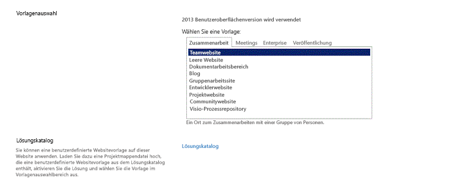

# Einrichten einer allgemeinen Entwicklungsumgebung für SharePoint 2013
Hier finden Sie Informationen zu den Schritten zur Einrichtung einer SharePoint-Entwicklungsumgebung, indem Sie SharePoint und Visual Studio installieren.
## Ermitteln der benötigten SharePoint-Umgebung
<a name="SP15_bk_determinedevenv"> </a>

Entscheiden Sie zuerst, welche Art von Lösungen Sie erstellen möchten (weitere Informationen zu SharePoint-Add-Ins finden Sie unter  [SharePoint-Add-Ins](http://msdn.microsoft.com/library/cd1eda9e-8e54-4223-93a9-a6ea0d18df70%28Office.15%29.aspx)):
  
    
    

- Wenn Sie Farmlösungen erstellen möchten, finden Sie in diesem Artikel die entsprechenden Schritte.
    
  
- Wenn Sie SharePoint-Add-Ins erstellen möchten, finden Sie weitere Informationen unter  [Tools und Umgebungen für die Entwicklung von Add-Ins für SharePoint](http://msdn.microsoft.com/library/6906eb86-8270-4098-8106-1e8d0d3c212e%28Office.15%29.aspx).
    
  

## Erstellen einer SharePoint-Entwicklungsumgebung auf einem virtuellen Microsoft Azure-Computer
<a name="SP15_bk_devenvazure"> </a>

Wenn Sie über ein MSDN-Abonnement verfügen, können Sie schnell einen virtuellen Computer in Azure bereitstellen.
  
    
    
Wenn Sie den Microsoft Azure-Vorteil, der mit Ihrem MSDN-Abonnement verbunden ist, nicht aktiviert haben, können Sie sich unter  [Microsoft Azure-Vorteil für MSDN-Abonnenten](http://azure.microsoft.com/de-de/pricing/member-offers/msdn-benefits/) darüber informieren.
  
    
    

> **HINWEIS**
> Die Microsoft Azure-Bildergalerie enthält keine Bildern mehr mit vorinstalliertem SharePoint und Visual Studio. Aber ein virtueller Microsoft Azure-Computer ist immer noch eine gute Wahl für einen Entwicklungscomputer. > Melden Sie sich am  [Microsoft Azure-Verwaltungsportal](https://manage.windowsazure.com) an.> Erstellen Sie einen virtuellen Computer mithilfe eines der Bilder in der Galerie für Windows Server 2008 R2 Service Pack 1 x64, Windows Server 2012 (oder höher). Folgen Sie den Anweisungen des Assistenten zum Erstellen virtueller Computer. Wir empfehlen die Größe des virtuellen Computers **Sehr groß** für die SharePoint-Entwicklung.> Nachdem der Computer bereitgestellt wurde und betriebsbereit ist, führen Sie die Einrichtung mit dem weiter unten im Abschnitt **Erstellen einer lokalen SharePoint-Entwicklungsumgebung** beschriebenen Verfahren aus. (Überspringen Sie den Abschnitt zur Installation des Betriebssystems.)> Sobald Sie Ihre Entwicklungsumgebung eingerichtet haben, können Sie auf dem virtuellen Computer mithilfe einer Azure-Punkt-zu-Site-Verbindung Ihre Quellcodeverwaltung über Visual Studio aufrufen. Anleitungen dazu finden Sie unter  [Konfigurieren einer Punkt-zu-Site-VPN-Verbindung mit einem Azure Virtual Network](https://azure.microsoft.com/de-de/documentation/articles/vpn-gateway-point-to-site-create/). 
  
    
    


## Erstellen einer lokalen SharePoint-Entwicklungsumgebung
<a name="SP15_bk_devenvazure"> </a>


  
    
    

### Installieren des Betriebssystems für Ihre SharePoint-Add-Ins-Entwicklungsumgebung
<a name="SP15_bk_InstallOS"> </a>

Die Anforderungen für eine Entwicklungsumgebung für eine SharePoint-Installation sind weniger stringent und kostengünstiger als die Anforderungen für eine Produktionsumgebung. In einer Entwicklungsumgebung sollten Sie einen Computer mit einer x64-fähigen CPU, und mindestens 16 GB RAM, um SharePoint zu installieren und auszuführen; 24 GB RAM sind empfehlenswert. Je nach Anforderungen und Budget können Sie aus den folgenden Optionen wählen:
  
    
    

- Installieren Sie SharePoint unter Windows Server 2008 R2 Service Pack 1 x64 oder Windows Server 2012 (oder höher).
    
  
- Verwenden Sie Microsoft Hyper-V, und installieren Sie SharePoint auf einem virtuellen Computer unter einem Gastbetriebssystem Windows Server 2008 R2 Service Pack 1 x64 oder Windows Server 2012. Eine Anleitung zum Einrichten eines virtuellen Microsoft Hyper-V-Computers für SharePoint finden Sie unter  [Verwenden bewährter Konfigurationsmethoden für virtuelle SharePoint 2013-Computer und die Hyper-V-Umgebung](http://technet.microsoft.com/de-de/library/ff621103%28v=office.15%29.aspx).
    
  

### Installieren der Voraussetzungen zur App-Entwicklung für das Betriebssystem und SharePoint 2013
<a name="SP15_bk_prereqsOS"> </a>

Für SharePoint müssen auf Ihrem Betriebssystem als Voraussetzung bestimmte Komponenten installiert sein, bevor die Installation beginnt. Aus diesem Grund enthält SharePoint das PrerequisiteInstaller.exe-Tool, das alle vorausgesetzten Komponenten für Sie installiert. Führen Sie dieses Tool aus, bevor Sie das Setup.exe-Tool ausführen.
  
    
    

1. Führen Sie das PrerequisiteInstaller.exe-Tool aus.
    
  
2. Führen Sie das in den Installationsdateien enthaltene Setup.exe-Tool aus.
    
  
3. Akzeptieren Sie die Microsoft-Software-Lizenzbedingungen.
    
  
4. Wählen Sie auf der Seite **Gewünschte Installation auswählen** die Option **Eigenständig** aus.
    
   **Abbildung 2. Wahl des Installationstyps**

  


  

  

  
5. Wenn bei der Installation Fehler auftreten, überprüfen Sie die Protokolldatei. Sie finden die Protokolldatei, indem Sie ein Eingabeaufforderungsfenster öffnen und die folgenden Befehle an der Eingabeaufforderung eingeben. Beim Abschluss der Installation wird ebenfalls ein Link zur Protokolldatei angezeigt.
    
  ```
  
cd %temp
dir /od *.log
  ```

6. Nach Abschluss der Installation werden Sie aufgefordert, den Konfigurations-Assistenten für SharePoint-Produkte und -Technologien zu starten.
    
    > **HINWEIS**
      > Der Konfigurations-Assistent für SharePoint-Produkte und -Technologien kann fehlschlagen, wenn Sie einen Computer verwenden, der Mitglied einer Domäne ist, aber mit keinem Domänencontroller verbunden ist. Wenn dieser Fehler auftritt, stellen Sie entweder direkt oder über ein VPN (Virtual Private Network) eine Verbindung zu einem Domänencontroller her, oder melden Sie sich mit einem lokalen Konto an, das auf dem Computer über Administratorrechte verfügt. 
7. Nach Abschluss des Konfigurations-Assistenten wird die neue Seite **Vorlagenauswahl** der neuen SharePoint-Website angezeigt.
    
   **Abbildung 3: Auswählen der Websitevorlagenseite**

  


  

  

  

### Installieren von Visual Studio
<a name="SP15_bk_installVS"> </a>

Wenn Sie Visual Studio installieren, erhalten Sie alle Vorlagen, Tools und Assemblys, um SharePoint auf Ihrem lokalen Entwicklungscomputer zu entwickeln.
  
    
    
Unter  [Installieren von Visual Studio](http://msdn.microsoft.com/de-de/library/e2h7fzkw.aspx) finden Sie Anleitungen zum Installieren von Visual Studio.
  
    
    

#### Ausführliche Protokollierung in Visual Studio

Führen Sie die folgenden Schritte aus, wenn Sie die ausführliche Protokollierung aktivieren möchten:
  
    
    

1. Öffnen Sie die Registrierung, und navigieren Sie zu **HKEY_CURRENT_USER\\Software\\Microsoft\\VisualStudio\\ _nn.n_\\SharePointTools**, wobei _nn.n_ die Version von Visual Studio ist, z. B. 12.0 oder 14.0.
    
  
2. Fügen Sie einen DWORD-Schlüssel mit dem Namen **EnableDiagnostics** hinzu.
    
  
3. Geben Sie dem Schlüssel den Wert **1**.
    
  
Der Registrierungspfad wird sich in kommenden Versionen von Visual Studio ändern.
  
    
    

## Nächste Schritte
<a name="SP15_bk_devenvazure"> </a>

Wenn Sie Workflows erstellen, fahren Sie mit  [Einrichten und Konfigurieren von SharePoint 2013-Workflow-Manager](set-up-and-configure-sharepoint-2013-workflow-manager.md).
  
    
    

## Zusätzliche Ressourcen
<a name="SP15_bk_AddlResources"> </a>


-  [Installieren von Visual Studio](http://msdn.microsoft.com/de-de/library/e2h7fzkw.aspx)
    
  
-  [Tools und Umgebungen für die Entwicklung von Add-Ins für SharePoint](http://msdn.microsoft.com/library/6906eb86-8270-4098-8106-1e8d0d3c212e%28Office.15%29.aspx)
    
  

  
    
    

