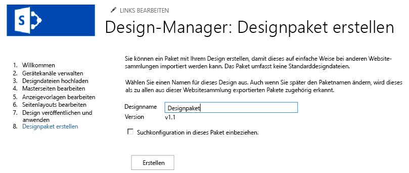

# Designpakete des SharePoint 2013-Entwurfs-Managers
Informationen zum Erstellen und Exportieren des visuellen Designs einer SharePoint-Websitesammlung als Paket
## Übersicht über Designpakete

InSharePoint 2013 kann der Entwurfs-Manager Webentwicklern und Designern dabei helfen, das visuelle Design einer SharePoint-Websitesammlung zu erstellen und als Paket zu exportieren. Dieses Paket kann problemlos an Kunden oder andere vorgesehene Gruppen zur Installation in ihren Websitesammlungen verteilt werden. Durch dieses neue Feature wird die Komplexität des Transports von Designs reduziert, und für Kunden wird das Auslagern des visuellen Designs ihrer Websites erleichtert. Folgende Nutzungsszenarien sind beispielsweise möglich:
  
    
    

- **Neues Design**: Ein Unternehmen mit eingeschränkten Fähigkeiten im Bereich Webdesign schließt möglicherweise einen Vertrag mit einer Agentur ab, die die aktuelle SharePoint-Website des Unternehmens aktualisiert und moderner gestaltet. Die Agentur kann die Website erstellen und die Inhalte problemlos packen, um sie in die SharePoint-Farm des Unternehmens zurück zu importieren.
    
  
- **Websiteübergreifende Veröffentlichung**: Die IT-Abteilung eines Unternehmens, das die websiteübergreifende Veröffentlichung in SharePoint 2013 nutzt, muss ggf. ein visuelles Design über mehrere Websitesammlungen hinweg freigeben. Das Unternehmen erstellt die Website intern und sucht nach einer einfachen Möglichkeit, das Design über mehrere SharePoint-Websites hinweg zu transportieren. Die Designpaketfunktion des Entwurfs-Managers bietet dem Unternehmen die Möglichkeit, die Daten mit geringerem Verwaltungsaufwand und reduzierter Komplexität zu exportieren und zu importieren.
    
  
Dieser Artikel kann Ihnen dabei helfen, zu verstehen, wie Designpakete in SharePoint 2013 erstellt und verwendet werden. Sie erhalten einen Überblick über die Paketerstellung und Anleitungen zum Workflow beim Exportieren und Importieren von Paketen. Außerdem werden erforderliche Berechtigungen für bestimmte Vorgänge sowie die Architektur von Designpaketen erörtert.
  
    
    

## Erstellen von Designpaketen

Benutzer erstellen als SharePoint-Lösungspakete (WSP-Datei) bezeichnete Designpakete auf ihrer SharePoint-Website über den Entwurfs-Manager in **Websiteeinstellungen**. Der Schritt zum Erstellen des Pakets folgt auf andere Entwurfs-Manager-Schritte für das Branding und die Veröffentlichung einer SharePoint-Website. Hierzu zählen das Hochladen der Designdateien, das Erstellen einer Gestaltungsvorlage und das Bearbeiten von Seitenlayouts. Nachdem die Website veröffentlicht wurde, ist das Erstellen der WSP-Datei für den Export ein relativ einfacher Vorgang.
  
    
    
In Abbildung 1 wird die Option im Entwurfs-Manager gezeigt, mit der das Designpaket benannt und erstellt wird.
  
    
    

**Abbildung 1: Exportieren eines Designpakets**

  
    
    

  
    
    

  
    
    
Alternativ können Sie ein Designpaket aus einer anderen SharePoint 2013-Websitesammlung über den Entwurfs-Manager auf der Homepage importieren, oder indem Sie **Designpaket importieren** unter **Websiteeinstellungen** auswählen.
  
    
    

    
> **HINWEIS**
> Weitere Informationen zum Entwurfs-Manager und zum Veröffentlichungsvorgang finden Sie unter  [Übersicht über den Entwurfs-Manager in SharePoint 2013](overview-of-design-manager-in-sharepoint-2013.md). 
  
    
    

Es ist ein Kontrollkästchen vorhanden, über das die Suchkonfiguration in das Designpaket aufgenommen wird. Diese Option wählen Sie, wenn Sie eine Website entwerfen und bedingte Suchergebnisse erstellen oder die Suchumgebung steuern. Diese Konfiguration enthält Objekte wie Abfrageregeln, Ergebnisquellen, Ergebnistypen sowie jegliche Schema- und Bewertungsmodelle. Damit sichergestellt wird, dass der Import der Suchkonfiguration nicht fehlschlägt, dürfen bei Elementen der Suchkonfiguration keine doppelten Namen vorhanden sein. Wenn Sie beispielsweise in einer Websitesammlung über eine Abfrageregel namens **SampleQueryRule** verfügen und diese in eine andere Websitesammlung mit einer bestehenden Regeln namens **SampleQueryRule** importieren, schlägt der Import der Suchkonfiguration fehl. Um dies zu verhindern, können Sie die Abfrageregel in der Quelle oder dem Ziel umbenennen oder löschen. Ergebnisquellen sowie das Schema müssen ebenfalls eindeutige Namen aufweisen. Wenn Sie eine Suchkonfiguration in Ihr Designpaket aufnehmen möchten, müssen Sie die folgenden Features auf Websiteebene unter **Websitefeatures verwalten** aktivieren, bevor Sie das Designpaket exportieren:
  
    
    

- Suchkonfigurationsdaten-Inhaltstypen
    
  
- Suchkonfigurationsdaten-Websitespalten
    
  
- Suchkonfigurationslisten-Instanzfeature
    
  
- Suchkonfigurationsvorlagen-Feature
    
  
Wenn Sie möchten, dass Ihr Design im Ziel des Imports veröffentlicht wird, sollten Sie alle Designobjekte veröffentlichen oder die Hauptversionsverwaltung in designbezogenen Bibliotheken in der Quelle des Exports deaktivieren. Der Entwurfs-Manager exportiert nur die neueste Version jedes Objekts aus der Quelle. Wenn Sie beispielsweise über die Version 1.1 einer Gestaltungsvorlage in der Quelle verfügen, wird diese als Entwurf in das Ziel kopiert. Version 1.0 wird jedoch nicht kopiert. Außerdem werden alle Dateien, die ausgecheckt sind, nicht exportiert.
  
    
    

## Exportieren und Importieren von Designpaketen

Sie können auf verschiedene Weise an einen End-to-End-Paketworkflow herangehen, wobei der Ansatz größtenteils von Ihren Zielsetzungen und den verfügbaren Designressourcen abhängig ist. Möglicherweise entscheiden Sie sich dafür, die Arbeit an eine Agentur auszulagern, oder Sie arbeiten intern, wenn Sie über die geeigneten internen Ressourcen verfügen. In Tabelle 1 wird ein Beispielworkflow erläutert. Dies umfasst den Austausch von Daten für das Design zwischen einem Kunden und einer Agentur sowie den Export und Import des Designpakets. Außerdem werden die benötigten Berechtigungen für designbezogene Vorgänge sowie Verpackungsvorgänge erläutert.
  
    
    

**Tabelle 1: Beispielworkflow für ein Designpaket**

|**Schritt**|**Aktion**|**Beschreibung**|
|:-----|:-----|:-----|
|1    |Ein Kunde beauftragt eine Agentur mit der Erstellung eines visuellen Designs.    | Der Designer erstellt die Website basierend auf den Anforderungen des Unternehmens.   > **HINWEIS**>  Der Designer benötigt die Berechtigungsstufe **Designers**, damit er den Entwurfs-Manager verwenden und Pakete erstellen und exportieren kann. Insbesondere benötigt er die Berechtigung **Design**, die das Anzeigen, Hinzufügen, Aktualisieren, Löschen, Genehmigen und Anpassen von visuellen Designs ermöglicht.           |
|2    |Der Designer exportiert das visuelle Design in ein Designpaket.    | Der Designer exportiert das SharePoint-Lösungspaket (WSP-Datei), nachdem er die übrigen erforderlichen Branding- und Veröffentlichungsschritte abgeschlossen hat.    Das Designpaket wird über einen sicheren Kanal an den Kunden geliefert.   |
|3    |Der Kunde importiert das visuelle Design in die angegebene SharePoint 2013-Websitesammlung.    | Der Kunde erhält das Designpaket über einen sicheren Kanal.    Über die Homepage im Entwurfs-Manager oder durch Auswahl von **Designpaket importieren** unter **Websiteeinstellungen** importiert der Kunde die WSP-Datei und wendet das Designpaket auf die angegebene Websitesammlung an.   > **HINWEIS**>  Der Kunde benötigt die Berechtigungsstufe **Designers**, damit er den Entwurfs-Manager verwenden und Designpakete importieren kann.           |
   

## Übersicht über den Inhalt von Designpaketen

Das Designpaket (WSP-Datei) enthält verschiedene Dateien, wenn es über den Entwurfs-Manager erstellt wird. Bei dem Verfahren werden Dateien aus verschiedenen Listen und Bibliotheken exportiert und bilden auf diese Weise das Gesamtpaket. Beim Import in eine Websitesammlung werden diese Dateien basierend auf dem Dateityp an verschiedene Speicherorte verteilt. Tabelle 2 enthält nähere Informationen zum Speicherort der Dateien und dem Typ der während des Zusammenstellungsvorgangs exportierten Dateien.
  
    
    

**Tabelle 2: Übersicht über den Inhalt eines Designpakets und Speicherorte für exportierte Dateien**

|**Exportspeicherort**|**Exportierte Objekte**|
|:-----|:-----|
|Dokumentbibliotheken    | Gestaltungsvorlagenkatalog    Designkatalog    Formatbibliothek    Websiteobjektbibliothek   |
|Inhaltstypen, Felder    | Inhaltstypen, die vom Inhaltstyp "Seite" erben   |
|Listen    | Design Gallery    Durchkomponierte Looks    Gerätekanäle   |
   

> **HINWEIS**
> In SharePoint 2013 werden nur angepasste Dateien in Designpakete aufgenommen. Beim Verpackungsvorgang werden die meisten der nicht angepassten Standardsystemdateien nicht exportiert. 
  
    
    

In SharePoint 2013 können Sie ein importiertes Designpaket nicht deinstallieren, und Sie sollten niemals versuchen, ein Designpaket über den Lösungskatalog zu deaktivieren. Falls Sie dies versuchen, werden die Inhaltstypen des Seitenlayouts entfernt, und Benutzer können möglicherweise keine Unterwebsites mehr erstellen. Um diesen Zustand zu beheben, sollten Sie die folgenden Schritte durchführen, bei denen Folgendes gilt: Website A ist die ursprüngliche Websitesammlung, Website B ist die Websitesammlung mit dem deaktivierten Designpaket (ungültiger Zustand), und Website C ist eine von Ihnen erstellte neue leere Website.
  
    
    

1. Exportieren Sie ein Designpaket von Website A
    
  
2. Importieren Sie das Designpaket in Website C
    
  
3. Exportieren Sie ein Designpaket von Website B
    
  
4. Importieren Sie das Designpaket in Website C
    
  
5. Exportieren Sie das Designpaket von Website C
    
  
6. Importieren Sie das Designpaket in Website B
    
  
Alle erstellen Gerätekanäle und ihre Konfigurationen werden ebenfalls importiert, wenn das Designpaket entladen wird. Sie müssen jedoch Gestaltungsvorlagen angegebenen Gerätekanälen neu zuordnen, da diese Zuordnungen nicht konfiguriert werden.
  
    
    
Beim Importieren eines Designpakets wird keine alternative CSS-URL festgelegt, selbst wenn eine solche in der Quelle des Exports konfiguriert war. CSS-Klassen sollten nicht in einer externen Datei im Gestaltungsvorlagenkatalog und auch nicht in der Gestaltungsvorlagendatei selbst gespeichert werden.
  
    
    

## Weitere Ressourcen

-  [Entwickeln des Website-Designs in SharePoint 2013](develop-the-site-design-in-sharepoint-2013.md)
    
  
-  [Übersicht über den Entwurfs-Manager in SharePoint 2013](overview-of-design-manager-in-sharepoint-2013.md)
    
  
-  [Neuerung bei SharePoint 2013-Websiteentwicklung](what-s-new-with-sharepoint-2013-site-development.md)
    
  
