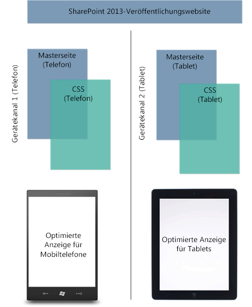
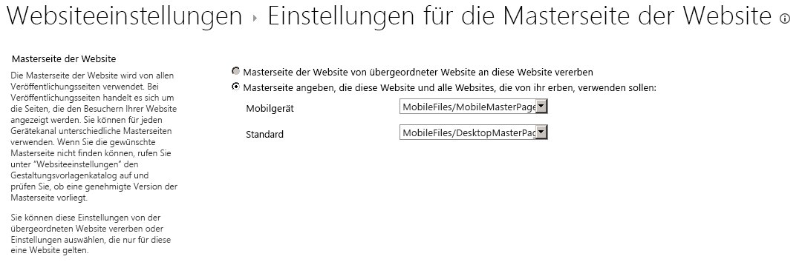

# SharePoint 2013-Design-Manager-Gerätekanäle
Erfahren Sie mehr über das Planen und Konfigurieren einer Gerätekanälefunktion auf einer SharePoint 2013-Website.
## Einführung in Gerätekanäle
<a name="Int"> </a>

Das Browsen im Web auf einem mobilen Gerät ist jetzt so üblich, dass eine SharePoint-Website für die Lesbarkeit und Benutzerfreundlichkeit auf Smartphones und anderen mobilen Geräten wie Tablets optimiert werden muss. Dank der Gerätekanäle in SharePoint 2013 können Sie eine einzige Veröffentlichungswebsite auf verschiedene Arten rendern, indem Sie verschiedene Designs verwenden, die auf verschiedene Geräte ausgerichtet sind. Die Informationen in diesem Artikel helfen Ihnen, die Verwendung der Funktion für Gerätekanäle in SharePoint 2013 zu planen. Er bietet eine ausführliche Übersicht über die Funktion selbst und die erforderlichen Informationen für das Erstellen eines Gerätekanals. Nach der Lektüre dieses Artikels wissen Sie außerdem, welches Gerätekanäle implementiert werden müssen und wie Sie diese Kanäle implementieren.
  
    
    
Gerätekanäle sind nur für SharePoint 2013-Veröffentlichungswebsites verfügbar. Bevor Sie Gerätekanäle implementieren, sollten Sie bereits ein allgemeines Verständnis für die Teile einer SharePoint-Website haben, wissen, wie eine SharePoint-Seite zusammengestellt wird und über allgemeine Kenntnisse des Entwurfs-Managers verfügen. Weitere Informationen zum SharePoint-Seitenmodell, einschließlich Masterseite und Seitenlayouts, finden Sie unter  [Übersicht über das SharePoint 2013-Seitenmodell](overview-of-the-sharepoint-2013-page-model.md). Weitere Informationen zum Entwurfs-Manager finden Sie unter  [Übersicht über den Entwurfs-Manager in SharePoint 2013](overview-of-design-manager-in-sharepoint-2013.md).
  
    
    

## Was ist ein Gerätekanal?
<a name="WhatDev"> </a>

Ein Gerätekanal ist Teil der SharePoint 2013-Veröffentlichungsinfrastruktur, mit der Sie bestimmte Websiteinhalte rendern, Ihre Inhalte formatieren und sogar Bilder ändern können - während Sie gleichzeitig dieselbe URL über einen Pool von verschiedenen Geräten beibehalten. Im Vergleich zur Desktopversion der SharePoint-Website kann ein mobiles Rendering mit einer geringeren Breite formatiert werden, eine bessere Navigation durch breitere Toucheingabeziele bereitstellen und eine reduzierte Menge von Informationen für eine bessere Benutzerfreundlichkeit anzeigen. Sie können eine einzelne Website erstellen und die Inhalte ein einziges Mal für alle verschiedenen mobilen Geräte erstellen und bearbeiten. Wenn ein Benutzer eine SharePoint-Website von einem mobilen Gerät wie einem Smartphone oder Tablet browst, übermittelt der mobile Browser eine HTTP GET-Anforderung an die Website, die eine Benutzer-Agent-Zeichenfolge enthält. Diese Zeichenfolge enthält Informationen über die Art von Gerät, das versucht, auf die Website zuzugreifen. Basierend auf dieser Geräteteilzeichenfolge kann der Browser des Geräts zu einer bestimmten Masterseitenansicht umgeleitet werden. Wenn Sie z. B. Sammlung von Windows Phone- und iPad-Geräten haben, können Sie jedem Pool ein eindeutiges Rendering der SharePoint-Website bereitstellen, indem Sie Gerätekanäle verwenden. Diese Gerätekanäle können jeweils eine andere Masterseite und damit CSS-Datei erhalten, damit Benutzer von einem optimalen Anzeigeerlebnis profitieren. In Abbildung 1 ist die Verwendung von zwei Gerätekanälen gezeigt, um zwei eindeutige Websiterendering für ein Telefon und Tabletgerät bereitzustellen.
  
    
    
Abbildung 1: Verwenden von Gerätekanälen über verschiedene Geräteplattformen
  
    
    

  
    
    

  
    
    
Sie können einen Gerätekanal über das Menü **Websiteeinstellungen** im Abschnitt **Aussehen und Verhalten** oder alternativ über die Option **Entwurfs-Manager** im selben Abschnitt erstellen und konfigurieren. Wenn Sie ein Gerätekanalelement erstellen, gibt es fünf erforderliche und optionale Felder, die Sie für den Prozess angeben müssen. Tabelle 1 enthält diese Felder und eine Beschreibung, welche Art von Informationen bereitgestellt werden muss.
  
    
    

**Tabelle 1: Erforderliche und optionale Felder für das Erstellen eines Gerätekanals**


|**Feld**|**Erforderlicher Wert**|**Wert**|
|:-----|:-----|:-----|
|Name  <br/> |Ja  <br/> |Dies ist der Name für Ihren Entwurfskanal, der ein Anzeigenamen sein kann, um den Kanal zu identifizieren.  <br/> |
|Alias  <br/> |Ja  <br/> |Mit dem Aliasnamen können Sie Ihren Gerätekanal im Code, in Gerätekanalbereichen (weiter unten in diesem Artikel beschrieben), in der Vorschau und anderen Kontexten identifizieren.  <br/> > **WICHTIG**> Wenn Sie den Kanalalias später ändern, müssen Sie die Masterseitenzuordnungen, Gerätekanalbereiche sowie benutzerdefinierten Code oder Markups manuell aktualisieren.           |
|Beschreibung  <br/> |Nein  <br/> |Ein Feld zum Angeben einer allgemeinen Beschreibung des Gerätekanals.  <br/> |
|Geräteeinschlussregeln  <br/> |Ja  <br/> |Ein Feld zum Angeben der Benutzer-Agent-Teilzeichenfolge wie Windows Phone OS. Die Geräteumleitung auf eine bestimmte Masterseite hängt davon ab, was für diesen Wert eingegeben wird. Weitere Informationen dazu, welche Werte in diesem Feld angegeben werden können, finden Sie im Abschnitt  [Benutzer-Agent-Teilzeichenfolgen und Gerätekanalbewertungen](#PlanDeviceChannels_UserAgentSubstrings) in diesem Artikel. <br/> |
|Aktiv  <br/> |Nein  <br/> |Wenn Sie dieses Kontrollkästchen aktivieren, wird Ihr Gerätekanal aktiviert. Wenn Sie an einer Livewebsite arbeiten, sollten Sie den Kanal erst aktivieren, wenn Sie das Entwerfen abgeschlossen haben. Verwenden Sie für Tests die Abfragezeichenfolge  `?DeviceChannel=alias` in einem Browser, um eine Vorschau Ihrer Website für einen bestimmten Kanal anzuzeigen. <br/> |
   

  
    
    

    
> **HINWEIS**
> Weitere Informationen und Schritte zum Erstellen eines Gerätekanal finden Sie im Abschnitt  [Erstellen eines Gerätekanals](sharepoint-2013-design-manager-device-channels.md#create) in diesem Artikel.
  
    
    

Nachdem ein Gerätekanal erstellt und aktiviert wurde, ist die Umleitung an eine bestimmte Masterseite, z. B. eine mobile Version, möglich. Der nächste Schritt besteht darin, anzugeben, welche Masterseite für mobile Geräte auf der Websiteebene angezeit werden soll, entweder über die Option **Einstellungen für die Masterseite der Website**oder die Option **Veröffentlichen und übernehmen** im Entwurfs-Manager.
  
    
    

**Abbildung 2: Festlegen der Masterseiten für die Anzeige auf mobilen Geräten und dem Standarddesktop**

  
    
    

  
    
    

  
    
    
Wie in Abbildung 2 dargestellt, können Sie eine bestimmte Masterseite für die normale Desktopanzeige der Website und mobile Masterseite für die Geräteumleitung zuweisen. Ob die mobile oder die Standardmasterseite gerendert wird, hängt vom konfigurierten, aktiven Gerätekanal ab. Insbesondere hängt es von der Teilzeichenfolge für die Geräteeinschlussregel ab, die während der Erstellung Gerätekanals angegeben wird.
  
    
    

### Benutzer-Agent-Teilzeichenfolgen und Gerätekanalbewertungen
<a name="PlanDeviceChannels_UserAgentSubstrings"> </a>

Wenn Sie einen Gerätekanal erstellen, werden Sie aufgefordert, eine Benutzer-Agent-Teilzeichenfolge anzugeben, die für die Gerätumleitung zu einer angegebenen Masterseite verantwortlich ist. Wenn Sie diesen Wert nicht im Feld **Geräteinschlussregeln** bereitstellen, ist keine Geräteumleitung möglich, und der Gerätekanal kann nicht erstellt werden. Tabelle 2 enthält einige Beispiele für Benutzer-Agent-Teilzeichenfolgenwerte, die verwendet werden können, wenn Sie einen Gerätekanal erstellen.
  
    
    

**Tabelle 2: Beispielwerte für Benutzer-Agent-Teilzeichenfolgen**


|**Gerät**|**Benutzer-Agent-Teilzeichenfolge(n)**|
|:-----|:-----|
|Windows Phone  <br/> | Windows Phone OS 7.5 (speziell für Windows Phone 7.5-Telefon) <br/>  Windows Phone OS (generische Teilzeichenfolge für alle Versionen von Windows Phone). <br/> |
|iPhone  <br/> |iPhone  <br/> |
|iPad  <br/> |iPad  <br/> |
|Android  <br/> |Android  <br/> |
   
Im Feld **Geräteeinschlussregeln** fügen Sie nur den jeweiligen Teilzeichenfolgenwert für die Geräte ein, die Sie einschließen möchten.
  
    
    

> **WICHTIG**
> Benutzer-Agent-Teilzeichenfolgenwerte sind je nach Gerätehersteller und möglicherweise auch innerhalb einer Gruppe von Geräten ähnlicher Marken unterschiedlich, wie oben bei Windows Phone gezeigt. Um eine erfolgreiche Datenverkehrsumleitung an einen bestimmten Pool zu erreichen, müssen Sie einen eindeutigen Bezeichner für die Benutzer-Agent-Teilzeichenfolge angeben. Weitere Informationen dazu, wie Sie eine Teilzeichenfolge auf unterschiedlichen Geräten isolieren, finden Sie im Abschnitt  [Planen Ihrer Gerätekanalerfahrung](sharepoint-2013-design-manager-device-channels.md#plan) in diesem Artikel.
  
    
    

Nach ihrer Erstellung werden Gerätekanäle in einer Liste sortiert und gespeichert. Sie können bis zu 10 Gerätekanäle pro Website in SharePoint 2013 unterstützen, sodass es möglicherweise erforderlich ist, den Kanäle für ein ordnungsgemäßes Weiterleiten von Datenverkehr einen Rang zuzuweisen. Sie sollten die spezifischsten Regeln für eine höhere Priorität oben anordnen. Angenommen, Sie haben verschiedene Betriebssystemversionen für mobile Geräte in Ihrer Organisation und möchten eine eindeutige Masterseite für das Rendering für Windows Phone 7.5-Geräte erstellen. Alle anderen Windows Phone-Geräten würden eine andere Masterseite für die mobile Ansicht erhalten. In Tabelle 3 sind zwei Sortierungsschemas, die angewendet werden können, und die Auswirkungen auf die Weiterleitungsentscheidung gezeigt.
  
    
    

> **HINWEIS**
> Weitere Informationen zum Neuanordnen von Gerätekanälen finden Sie im Abschnitt  [Erstellen eines Gerätekanals](sharepoint-2013-design-manager-device-channels.md#create) in diesem Artikel.
  
    
    


**Tabelle 3: Beispielsortierung von Gerätekanälen**


|**Sortierung 1 (Gerätekanäle)**|**Sortierung 2 (Gerätekanäle)**|
|:-----|:-----|
|Gerätekanal 1: Windows Phone OS 7.5  <br/> |Gerätekanal 1: Windows Phone OS  <br/> |
|Gerätekanal 2: Windows Phone OS  <br/> |Gerätekanal 2: Windows Phone OS 7.5  <br/> |
|Gerätekanal 3: Standard  <br/> |Gerätekanal 3: Standard  <br/> |
   
Wenn Sie Sortierung 1 auswählen, bei der die Teilzeichenfolge für die Geräteeinschlussregel auf **Windows Phone OS 7.5** festgelegt ist, wird ein Benutzer, der mit einem Windows Phone 7.5-Gerät zu Ihrer Website navigiert, an Gerätekanal 1 umgeleitet. Ein Benutzer mit einer anderen Windows Phone-Version wird an Gerätekanal 2 umgeleitet, und jeder Benutzer mit einem anderen Betriebssystem als Windows Phone erhält Kanal 3. Wenn Sie jedoch Sortierung 2 auswählen, die die generische Windows Phone OS-Teilzeichenfolge priorisiert, wird der gesamte Windows Phone-Datenverkehr an Gerätekanal 1 umgeleitet. Gerätekanal 2 wird aufgrund der Priorisierung und generischen Beschaffenheit von Gerätekanal 1 nicht aufgerufen Wenn Sie mehrere Gerätekanäle erstellen, müssen Sie verstehen, wie sich die Sortierung und Bewertung auf die Umleitung des Datenverkehrs für Ihre Gerätepools auswirken.
  
    
    

> **HINWEIS**
> Weitere Informationen und Schritte für die Sortierung von Gerätekanälen finden Sie unter im Abschnitt  [Ändern der Reihenfolge von Gerätekanälen](sharepoint-2013-design-manager-device-channels.md#reorder) in diesem Artikel.
  
    
    


### Gerätekanalbereiche
<a name="PlanDeviceChannels_UserAgentSubstrings"> </a>

Ein Gerätekanalbereich ist ein Container, der auf einer Masterseite oder in einem Seitenlayout verwendet werden kann, wenn Sie bestimmte Inhalte zum Rendern basierend auf den Alias eines bestimmten Gerätekanals oder einer Gruppe von Kanälen rendern möchten. Möglicherweise haben Sie z. B. ein Webpart oder Steuerelement, das nur in der Desktopansicht der Website und nicht auf mobilen Geräten angezeigt werden soll. Mit dem Gerätekanalbereich können Sie dieses Webpart im Code kapseln und nur über einen angegebenen Gerätekanal rendern. Ein großer Vorteil von Gerätekanalbereichen gegenüber der Verwendung von  `Display:None` in einer CSS-Klasse ist, dass der Inhalt in einem Gerätekanalbereich überhaupt nicht auf den nicht angegeben Kanälen gerendert wird. Gerätekanalbereiche können auch verwendet werden, um die gerenderte Größe einer Seite für Geräte durch Vermeidung unnötiger Inhalte zu reduzieren. Auf diese Weise können Sie die Websitereaktionszeiten auf Geräten mit eingeschränkter Bandbreite erhöhen.
  
    
    
Bei der Vorschau einer Masterseite oder eines Seitenlayouts kann ein Gerätekanalbereichs-Codeausschnitt aus dem Codeausschnittkatalog erstellt werden. Das folgende HTML-Beispiel zeigt, wie Sie einen Gerätekanalbereich erstellen. In diesem Szenario gibt es einen Absatz mit eingefügtem Text, der nur für einen bestimmten Gerätekanal gerendert wird. Im Attribut **IncludedChannels** geben Sie den Alias des konfigurierten Gerätekanals an. Ein Alias ist ein Name, der beim Erstellen des Gerätekanals zugewiesen wird und auf den im Code verwiesen werden kann.
  
    
    

  
    
    


```HTML

<div data-name="DeviceChannelPanel">
 <!--CS: Start device channel panel snippet.-->
<!--SPM:<%@Register Tagprefix="Publishing" Namespace="Microsoft.SharePoint.Publishing.WebControls" Assembly="Microsoft.SharePoint.Publishing, Version=15.0.0.0, Culture=neutral, PublicKeyToken=62TDCXXXXXXXXXX
<!--MS:<Publishing:MobilePanel runat="server" IncludedChannels="DEFAULT">-->
<p>
This paragraph of content shows up only in the default channel, which means that you can use the same page layout for all your different devices. You can put HTML content, page fields, web parts, or CSS/JavaScript links within a device channel panel so that the content loads only on your specified channels.
</p>
<!--ME:</Publishing:MobilePanel>-->
<!--CE: End Device Channel Panel Snippet-->
</div>
```

Wenn der Inhalt auf mehreren Kanälen angezeigt werden soll, müssen die Aliase durch Kommas in Anführungszeichen getrennt werden:  `IncludedChannels="alias1, alias2"`. Weitere Informationen zum Gerätekanal-Bereichscontainer finden Sie unter  [Übersicht über das SharePoint 2013-Seitenmodell](overview-of-the-sharepoint-2013-page-model.md). Weitere Informationen zur Verwendung von Entwurfs-Manager-Codeausschnitten finden Sie unter  [Codeausschnitte des SharePoint 2013-Entwurfs-Managers](sharepoint-2013-design-manager-snippets.md).
  
    
    

## Planen Ihrer Gerätekanalerfahrung
<a name="plan"> </a>

Es gibt verschiedene Fragen und Informationen, die beantwortet und gesammelt werden müssen, bevor Sie Gerätekanäle in Ihrer Organisation implementieren. Dieser Abschnitt unterstützt Sie bei der Planung für die Verwendung von Gerätekanälen durch relevante Fragen zu Ihren Anforderungen an Geräte und Benutzerfreundlichkeit und bietet Anleitungen für die Vorgehensweise hinsichtlich der Funktion. Die Fragen in diesem Abschnitt sollten in der vorgegebenen Reihenfolge und nicht einzeln gelesen werden.
  
    
    

### Welche Websiteerfahrung möchte ich auf dem Desktop und auf meinen Geräten erreichen?

Wie die meisten Unternehmen wird es auch bei Ihnen eindeutige Anforderungen an die Benutzerfreundlichkeit geben, die den Anforderungen Ihrer Organisation basieren. Das ideale Ziel ist, sicherzustellen, dass diese Erfahrung optimal in einen beliebigen Formfaktor übersetzt wird, unabhängig davon, ob es sich um einen Desktop oder ein Gerät handelt. Doch trotz dieser breiten Generalisierung ist es immer noch ein komplexer Vorgang, insbesondere, wenn Sie mit unterschiedlichen Auflösungen und weniger Bildschirmbereich für die Touchinteraktionen zu tun haben. Außerdem sind für einige Mobiltelefone in Ihrem Lager vielleicht spezielle Anpassungen der Benutzeroberfläche erforderlich, die andere nicht benötigen oder nicht haben sollten. Die Webentwicklung kann in diesen Szenarien schwierig sein, umso mehr, wenn Sie nicht den Luxus haben, eine einzige Masterseite über Geräte mehrerer Marken zuweisen zu können.
  
    
    
Eine erste Aufgabe sollte darin bestehen, dass Sie notieren, welche Funktionen Sie erreichen müssen, um eine erfolgreiche Benutzererfahrung auf allen Geräten zu erstellen. Was erwartet die Benutzerbasis von Ihrer SharePoint 2013-Veröffentlichungswebsite auf ihren Desktops, Telefonen und Tablets? Sie erkennen möglicherweise verschiedene Probleme, einschließlich möglicher Einschränkungen, und ermitteln Überlegungen für einzelne Geräte, die berücksichtigt werden müssen. Zeichnen Sie all diese Informationen in einem beliebigen Format auf. Sie helfen Ihnen, Ihre bestimmten Ziele mit der Gerätekanalfunktionen zu verstehen und die aufeinander folgenden Fragen weiter unten zu beantworten, z. B., welche Geräte Sie unterstützen möchten und wie viele Gerätekanäle Sie implementieren sollten.
  
    
    
Außerdem sollten Sie daran denken, dass einige wichtigen Funktionen, die die Gerätekanalfunktion bereitstellt, verschiedene Planungsprobleme beheben können. Beispiele sind die Unterstützung von mehreren Gerätekanälen für eindeutige Masterseitenzuordnungen zu mehreren Geräte. Auch die Verwendung von Gerätekanalbereichen zum selektiven Anzeigen verschiedener Inhaltselemente über verschiedene Gerätepools gehört dazu.
  
    
    

### Wie viele Gerätekanäle benötigen Sie?

Ihnen stehen maximal 10 Gerätekanäle, einschließlich dem auf einer bestimmten Website für eine lokale Installation konfigurierten Standardkanal, und insgesamt zwei Gerätekanäle zur Verfügung, wenn SharePoint Online verwenden. Für Ihre Organisation müssen Sie möglicherweise nicht mehr tun, als eines einen einzigen Gerätekanal zu erstellen, mehrere Geräteeinschlussregeln für alle Geräte anzuwenden und das Umleiten auf eine bestimmte Masterseite festzulegen. Im Idealfall ist es optimal, so wenig Gerätekanäle wie möglich zu haben. Möglicherweise ist es basierend auf einer Gerätedifferenzierung oder eindeutigen HTML-/CSS-Anpassung jedoch keine Option, nur einen Kanal zu haben, und es sind zusätzliche Gerätekanäle erforderlich.
  
    
    
Um die Anzahl der Gerätekanäle zu ermitteln, sollten Sie die zu Ihren Websitezielen über Geräte gesammelten Informationen, die Geräte, die Sie unterstützen möchten, und den Grand der erforderlichen Anpassung aus den vorherigen Fragen in Betracht ziehen. Erstellen Sie anhand dieser Informationen eine Liste der Kanäle, die Sie implementieren möchten. Kann eine mobile Masterseite, die an einen Gerätekanal angefügt wird, alle Anforderungen erfüllen? Oder benötigen Sie eine separate Masterseitenzuordnung für Tablets und deshalb mehrere Kanäle? Dies ist auch eine geeignete Zeit, um Ihre Kanäle zu benennen und über einen geeigneten Aliasnamen für jeden Kanal nachzudenken, damit im Code darauf verwiesen werden kann. Wenn Sie den Kanalalias später ändern, müssen Sie alle Verweise darauf aktualisieren.
  
    
    

### Wo gibt es eine Liste aller Geräteteilzeichenfolgen, die ich verwenden kann?

Es gibt einige Benutzer-Agent-Teilzeichenfolgen von Originalherstellern, die Sie für die Geräteumleitung wie Windows Phone OS oder iPhone verwenden können, wie in Tabelle 2 dargestellt. Die im Feld **Geräteeinschlussregeln** benötigte Teilzeichenfolge ist in der Regel eine Teilmenge der viel größeren Benutzer-Agent-Zeichenfolge, die bereitgestellt wird, wenn sich das Gerät mit der Website verbindet. Es wird empfohlen, auf der Website des Herstellers oder Softwareanbieters nach einer gerätespezifischen Teilzeichenfolge zu suchen oder eine allgemeine webbasierte Suche durchzuführen. Manchmal ist möglicherweise schwierig, aufgrund der Ähnlichkeiten in der Benutzer-Agent-Zeichenfolgenzusammensetzung eine spezielle Teilzeichenfolge für eine bestimmte Version zu finden. Tabelle 4 enthält zwei Beispiele für Benutzer-Agent-Zeichenfolgen für Windows 8-Desktop und für ein Tabletgerät.
  
    
    

> **HINWEIS**
> Die folgenden Zeichenfolgen sind Beispiele und keine Originalzeichenfolgen für die dargestellten Windows-Geräte. Sie werden bereitgestellt, um den Punkt der Isolierung einer Teilzeichenfolge darzustellen, falls dies erforderlich ist. 
  
    
    


**Tabelle 4: Unterscheidung zwischen den Zeichenfolgen des Benutzer-Agenten**


|**Gerät**|**Zeichenfolge des Benutzer-Agenten**|
|:-----|:-----|
|Windows 8-Desktop  <br/> |(kompatibel; MSIE 10.0; Windows NT 6.2; WOW64; Trident/6.0)  <br/> |
|Windows 8-Tablet (Beispiel)  <br/> |(kompatibel; MSIE 10.0; Windows NT 6.2; WOW64; Trident/6.0; Touch)  <br/> |
   
Diese Zeichenfolgen sind im Format sehr ähnlich. Der einzige Unterschied ist das Einschließen von  `touch` für das Windows 8-Tabletbeispiel. Für dieses bestimmte Szenario würden Sie, wenn Sie ein bestimmtes Masterseitenrendering für Tabletgeräte haben wollten, `touch` als Teilzeichenfolge angeben, wenn Sie eine Geräteeinschlussregel erstellen. In derartigen Situationen ist es wichtig, einen Aspekt der Unterscheidung zwischen ähnlichen Zeichenfolgen zu finden. Wenn Sie einen Gerätekanal mit einer Geräteeinschlussregel über einen gemeinsamen Wert wie **MSIE 10.0** erstellen würden, gäbe es keine Möglichkeit zur Unterscheidung zwischen dem Desktop und dem Tablet.
  
    
    

### Muss ich Gerätekanalbereiche verwenden?

Nein. Gerätekanalbereiche sind hilfreich, wenn Sie zulassen, anpassen oder verhindern möchten, dass einige UI-basierte Elemente über verschiedene Geräteumgebungen gerendert werden. Möglicherweise haben Sie z. B. Text oder ein Steuerelement, das auf einem iPhone, aber nicht auf einem Android-Gerät angezeigt werden soll. Ein Grund könnte sein, dass der Formfaktor auf einer kleineren Bildschirmgröße basiert und die Benutzerfreundlichkeit betroffen wäre. Unabhängig von den Bedingungen können Gerätekanalbereiche einem Alias für einen erstellten Gerätekanal zugewiesen werden und bieten die Flexibilität, die für diesen Grad der Unterscheidung erforderlich ist. Eine gute Frage ist, ob es einen Grund gibt, eine einzelne Masterseite nicht für eineGruppe von verschiedenen Geräten in meiner Organisation anzuwenden? Falls ja, ist ein Gerätekanalbereich möglicherweise die beste Option für eine präzisere Entwicklungserfahrung, die spezielle Geräteanforderungen erfüllt. Darüber hinaus können Sie Gerätekanalbereiche auch verwenden, um kanalspezifisches CSS zu Seitenlayouts hinzuzufügen.
  
    
    

### Kann ich Cookies verwenden, um einen Gerätekanal auszuwählen?

Ja, Sie können Sie die Gerätkanalauswahl mithilfe von Cookies erzwingen oder außer Kraft setzen. Hierzu müssen Sie ein Browsercookie namens DeviceChannel erstellen und ihm den Alias des angegebenen Gerätekanals bereitstellen. Gerätekanäle können auch eine JavaScript-Variable namens **EffectiveDeviceChannel** festlegen, die den aktuellen Kanalalias enthält. Diese Variable kann verwendet werden, um anzuzeigen, welcher Kanal derzeit verwendet wird. Damit Ihre Website die JavaScript-Variable ausgeben kann, fügen Sie diese Eigenschaft zur Eigenschaftensammlung der Stammwebsite hinzu:
  
    
    

```

key = PublishingInformationControlIncludeEffectiveDeviceChannel, value = true
```

Diese Variable kann auch verwendet werden, um das Rendering von Inhalten und Webparts auf einer Seite zu beeinflussen.
  
    
    

## Erstellen eines Gerätekanals
<a name="create"> </a>

Verwenden Sie das folgende Verfahren, um einen neuen Gerätekanal zu erstellen.
  
    
    

### So erstellen Sie einen Gerätekanal


1. Starten Sie den Entwurfs-Manager. (Wählen Sie z. B. im Menü **Einstellungen** die Option **Entwurfs-Manager** aus.)
    
  
2. Wählen Sie in der nummerierten Liste **Gerätekanäle verwalten** aus.
    
  
3. Wählen Sie im Entwurfs-Manager auf der Seite „Gerätekanäle verwalten" **Kanal erstellen** aus.
    
  
4. Geben Sie auf der Seite „Gerätekanäle - Neues Element" in das Textfeld **Name** einen Namen für den Gerätekanal ein.
    
  
5. Geben Sie in das Textfeld **Alias** einen Alias für den Gerätekanal ein. Der Alias muss alphanumerische Zeichen enthalten und darf keine Leerzeichen enthalten. Sie verwenden den Alias, um in Code und anderen Kontexten auf den Gerätekanal zu verweisen.
    
  
6. Geben Sie in das Textfeld **Beschreibung** eine kurze Beschreibung der Geräte oder Browser ein, die der Kanal erfasst.
    
  
7. Geben Sie in das Textfeld **Geräteeinschlussregeln** die Teilzeichenfolgen des Benutzer-Agenten für den Kanal ein. Eine Anforderung für eine Webseite verwendet diesen Kanal, wenn eine der Zeichenfolgen, die Sie bereitstellen, der Zeichenfolge des Benutzer-Agenten der Anforderung entspricht.
    
  
8. Wenn Sie bereit sind, den Kanal zum Rendern von Seiten zur Verfügung zu stellen, aktivieren Sie das Kontrollkästchen **Aktiv**.
    
  
9. Wählen Sie **Speichern** aus.
    
  

## Ändern eines Gerätekanals
<a name="modify"> </a>

Verwenden Sie das folgende Verfahren, um einen vorhandenen Gerätekanal zu ändern.
  
    
    

> **HINWEIS**
> Der Standardkanal kann nicht geändert werden. 
  
    
    


### So ändern Sie einen Gerätekanal


1. Starten Sie den Entwurfs-Manager. (Wählen Sie z. B. im Menü **Einstellungen** die Option **Entwurfs-Manager** aus.)
    
  
2. Wählen Sie in der nummerierten Liste **Gerätekanäle verwalten** aus.
    
  
3. Wählen Sie im Entwurfs-Manager auf der Seite „Gerätekanäle verwalten" **Vorhandene Kanäle bearbeiten oder neu sortieren** aus.
    
  
4. Wählen Sie in der Liste **Gerätekanäle** den Gerätekanal aus, den Sie ändern möchten, und wählen Sie dann auf der Registerkarte **Elemente** die Option **Element bearbeiten** aus.
    
  
5. Um den Namen des Gerätekanals zu ändern, geben Sie einen neuen Namen in das Textfeld **Name** ein.
    
  
6. Um den Alias des Gerätekanals zu ändern, geben Sie einen neuen Alias in das Textfeld **Alias** ein.
    
    > **HINWEIS**
      > Wenn Sie des Alias eines Gerätekanals ändern, müssen Sie den Alias an anderen Stellen manuell ändern, an dem Sie ihn verwenden. Beispielsweise müssen Sie den Alias in benutzerdefiniertem Code oder in einem Markup manuell ändern, und Sie müssen die Zuordnungen zwischen dem Gerätekanal und Masterseiten manuell ändern. 
7. Um die Beschreibung des Gerätekanals zu ändern, geben Sie eine neue Beschreibung in das Textfeld **Beschreibung** ein.
    
  
8. Um die Geräteeinschlussregeln zu ändern, bearbeiten Sie die Zeichenfolgen im Textfeld **Geräteeinschlussregeln**.
    
  
9. Um den Gerätekanal als aktiv festzulegen, aktivieren Sie das Kontrollkästchen **Aktiv**. Sie können den Kanal deaktivieren, indem Sie das Kontrollkästchen **Aktiv** deaktivieren.
    
  
10. Wählen Sie **Speichern** aus.
    
  

## Löschen eines Gerätekanals
<a name="delete"> </a>

Verwenden Sie das folgende Verfahren, um einen vorhandenen Gerätekanal zu löschen.
  
    
    

> **HINWEIS**
> Der Standardkanal kann nicht gelöscht werden. 
  
    
    


### So löschen Sie einen Gerätekanal


1. Starten Sie den Entwurfs-Manager. (Wählen Sie z. B. im Menü **Einstellungen** die Option **Entwurfs-Manager** aus.)
    
  
2. Wählen Sie in der nummerierten Liste **Gerätekanäle verwalten** aus.
    
  
3. Wählen Sie im Entwurfs-Manager auf der Seite „Gerätekanäle verwalten" **Vorhandene Kanäle bearbeiten oder neu sortieren** aus.
    
  
4. Wählen Sie in der Liste **Gerätekanäle** den Gerätekanal aus, den Sie löschen möchten.
    
  
5. Wählen Sie auf der Registerkarte **Elemente** die Option **Element löschen** aus.
    
  
6. Wählen Sie **OK** aus.
    
  

## Ändern der Reihenfolge von Gerätekanälen
<a name="reorder"> </a>

Verwenden Sie das folgende Verfahren, um die Reihenfolge von Gerätekanälen zu ändern.
  
    
    

### So sortieren Sie Gerätekanäle neu


1. Starten Sie den Entwurfs-Manager. (Wählen Sie z. B. im Menü **Einstellungen** die Option **Entwurfs-Manager** aus.)
    
  
2. Wählen Sie in der nummerierten Liste **Gerätekanäle verwalten** aus.
    
  
3. Wählen Sie im Entwurfs-Manager auf der Seite „Gerätekanäle verwalten" **Vorhandene Kanäle bearbeiten oder neu sortieren** aus.
    
  
4. Wählen Sie auf der Registerkarte **Elemente** die Option **Kanäle neu sortieren** aus.
    
  
5. Wählen Sie auf der Seite für das Neusortieren von Gerätekanälen den Kanal aus, dessen Reihenfolge Sie ändern möchten, und wählen Sie dann **Nach oben** oder **Nach unten** aus.
    
  
6. Nachdem die Kanäle wie gewünscht sortiert sind, wählen Sie **OK** aus.
    
  

## Zusätzliche Ressourcen
<a name="PlanDeviceChannels_addresources"> </a>


-  [Entwickeln des Website-Designs in SharePoint 2013](develop-the-site-design-in-sharepoint-2013.md)
    
  
-  [Übersicht über das SharePoint 2013-Seitenmodell](overview-of-the-sharepoint-2013-page-model.md)
    
  
-  [Übersicht über den Entwurfs-Manager in SharePoint 2013](overview-of-design-manager-in-sharepoint-2013.md)
    
  
