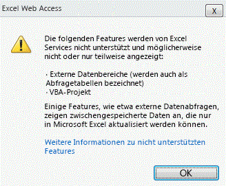
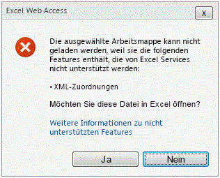

# Unterstützte und nicht unterstützte Features

  
    
    

Microsoft Excel weist umfangreiche Features auf. Mit jeder Version wird die Funktionslücke zwischen Excel und Excel Services kleiner, und die Anzahl nicht unterstützter Features wird geringer. Allerdings kann nicht jedes Excel-Feature in der zweiten Version von Excel Services, in Microsoft SharePoint Server 2010, unterstützt werden. 
Es werden bevorzugt Features unterstützt, die in wichtigen Excel Services-Szenarien benötigt werden und mit denen für Excel Services als Serverdienst sichergestellt wird, dass die Erwartungen der Kunden bezüglich Zuverlässigkeit, Skalierbarkeit und Sicherheit erfüllt werden.
  
    
    

> **HINWEIS**
> In diesem Thema wird davon ausgegangen, dass Sie damit vertraut sind, welche Features in Microsoft Office SharePoint Server 2007 unterstützt bzw. nicht unterstützt werden. Weitere Informationen zu den nicht unterstützten Features in Office SharePoint Server 2007 finden Sie in  [Nicht unterstützte Features in Excel Services](http://msdn.microsoft.com/de-de/library/ms496823.aspx). 
  
    
    

## Unterstützung neuer Excel-Features

Die Funktionsweise der meisten neuen Features in Microsoft Excel 2010 ist in Excel Services identisch. Einige Features werden wie in Excel angezeigt, während andere Features angezeigt werden können und außerdem interaktiv sind.
  
    
    
 **Die folgenden neuen Features können angezeigt werden:**
  
    
    

- Sparklines
    
  
-  [Symbolsatz](http://blogs.msdn.com/excel/archive/2009/08/05/icon-set-improvements-in-excel-2010.aspx) und [Verbesserungen bei den Datenbalken](http://blogs.msdn.com/excel/archive/2009/08/07/data-bar-improvements-in-excel-2010.aspx)
    
  
-  [Benannte PivotTable-Mengen](http://blogs.msdn.com/excel/archive/2009/10/05/pivottable-named-sets-in-excel-2010.aspx)
    
  
-  [Verbesserungen bei PivotTables](http://blogs.msdn.com/excel/archive/2009/10/15/a-few-more-pivottable-improvements-in-excel-2010.aspx)
    
  
 **Die folgenden neuen Features können angezeigt werden und sind interaktiv:**
  
    
    

- Datenschnitte
    
  
- PowerPivot-Dateien
    
  
Die neuen Funktionen in Excel werden ebenfalls unterstützt. Eingebettete Bilder, ein langjähriges Feature von Excel, werden nun unterstützt und können in Excel Services angezeigt werden. 
  
    
    

## Features, die früher das Laden von Excel-Dateien verhinderten

In Office SharePoint Server 2007 werden Excel-Arbeitsmappen, die nicht unterstützte Features wie z. B. VBA-Makros, Formsteuerelemente usw. enthalten, nicht in Excel Services geladen.
  
    
    
Um Benutzern mit dieser Einschränkung zu helfen, ignoriert Excel Services in SharePoint Server 2010 bestimmte nicht unterstützte Features. Das heißt, anstatt das Laden der gesamten Datei zu verhindern, wird die Datei von Excel Services geladen, aber die Features, die von Excel Services nicht unterstützt werden, werden nicht angezeigt.
  
    
    
Die folgenden Features hindern Excel Services nicht am Laden einer Datei:
  
    
    

- Zellkommentare.
    
  
- Formelbezüge auf externe Arbeitsmappen.
    
  
- Abfragetabellen (werden auch als externe Datenbereiche bezeichnet).
    
  
- Microsoft Visual Basic for Applications (VBA).
    
  
- Jede OfficeArt-Technologie. Beispielsweise Formen, WordArt, SmartArt, Organigramme, Diagramme, Signaturzeilen, Freihandanmerkungen usw.
    
  
Beachten Sie, dass diese Features auch weiterhin nicht unterstützt werden. Dies bedeutet, dass sie nicht gerendert, ausgeführt oder eingesetzt werden können wie dies auf dem Client der Fall ist. Die meisten aufgelisteten Features werden in Excel Services nicht angezeigt. Wenn z. B. beim Anzeigen im Client eine Form in der Nähe von Zelle A1 vorhanden ist, ist beim Anzeigen auf dem Server keine Form sichtbar. Andere Features, wie z. B. Formelbebezüge und Abfragetabellen, enthalten Werte, die zuletzt auf dem Client aktualisiert wurden. Die Werte in den Zellen sind also weiterhin vorhanden, aber sie können nicht aktualisiert werden. 
  
    
    
Schließlich wird VBA-Code nicht auf dem Server ausgeführt. In Office SharePoint Server 2007, Excel Services wurde das Laden von XLSM-Dateien nicht unterstützt. In SharePoint Server 2010 werden VBA-Makros von Excel Services ignoriert. Deshalb können XLSM-Dateien nun in Excel Services geladen werden.
  
    
    

## Anzeigen einer Datei mit ignorierten Features

Wenn Excel Services Dateien laden und bestimmte nicht unterstützte Features nicht rendern kann, woher können Sie dann wissen, dass in der angezeigten Datei Features fehlen? Sie wissen, dass Sie eine Datei mit fehlenden Features anzeigen, da von Excel Services oben in der Arbeitsmappe eine entsprechende Benachrichtigung anzeigt wird. Diese Benachrichtigung ist im folgenden Bildschirmfoto dargestellt.
  
    
    

**Benachrichtigung zu nicht unterstützten Features oben in der Arbeitsmappe**

  
    
    
Diese Benachrichtigung ist der erste Hinweis darauf, dass die Datei anders als im Excel-Client dargestellt wird.
  
    
    
Durch Klicken auf **Weitere Informationen zu nicht unterstützten Features** in der folgenden Abbildung werden Informationen zu den Features angezeigt, die in der Datei nicht unterstützt werden.
  
    
    

**Fehlermeldung zu nicht unterstützten Features für VBA**

  
    
    

  
    
    

  
    
    
Zugeschnittene Bilder werden nicht angezeigt (d. h., fehlende Features). 
  
    
    

    
> **HINWEIS**
> Wenn Sie für Arbeitsmappen, die ignorierte oder fehlende nicht unterstützte Features enthalten, die im Ansichtsmodus mit einer Benachrichtigungsleiste geladen wurden, eine Kopie der Arbeitsmappe zu speichern versuchen, müssen die nicht unterstützten Features entfernt werden. Der Benutzer wird in einem Dialogfeld darauf hingewiesen. 
  
    
    

## Weitere nicht unterstützte Features

Alle anderen unterstützten Features verhalten sich in Excel Services weiterhin wie in Office SharePoint Server 2007. Das heißt, Excel Services verhindert das Laden einer Datei, wenn nicht unterstützte Features gefunden werden. Die Benutzer werden wie im folgenden Bildschirmfoto gezeigt benachrichtigt, dass die Datei nicht geladen werden kann. 
  
    
    

> **HINWEIS**
> Im Thema  [Nicht unterstützte Features in Excel Services](http://msdn.microsoft.com/de-de/library/ms496823.aspx) enthält ausführlichere Informationen über diese nicht unterstützten Features.
  
    
    

> **VORSICHT**
> Die Informationsleiste mit der Liste nicht unterstützter Features wird nicht angezeigt, wenn die Datei über ein Webpart geladen wird. 
  
    
    

**Fehlermeldung zu nicht unterstützten Features für XML-Zuordnungen**

  
    
    

  
    
    

  
    
    
Im Gegensatz zu Arbeitsmappen mit externen Verknüpfungen werden Diagramme mit externen Verknüpfungen am Laden gehindert. 
  
    
    

## Siehe auch

#### Konzepte

  
    
    
 [Excel Services (Übersicht)](excel-services-overview.md)
  
    
    
 [Excel Services-Architektur](excel-services-architecture.md)
  
    
    
 [Excel Services - Blogs, Foren und Ressourcen](excel-services-blogs-forums-and-resources.md)
#### Weitere Ressourcen

  
    
    
 [Walkthrough: Developing a Custom Application Using Excel Web Services](walkthrough-developing-a-custom-application-using-excel-web-services.md)
