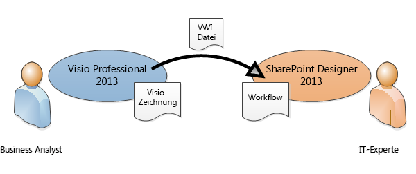
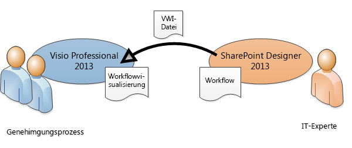

# Übertragen eines Workflows zwischen SharePoint Designer 2013 und Visio Professional 2013 (SharePoint 2010-Workflowplattform)
Verwenden Sie SharePoint Designer zum Importieren eines Workflows aus Visio oder Exportieren eines Workflows zu Visio.
## Übertragen eines Workflows zwischen SharePoint Designer 2013 und Visio Professional 2013

Geschäfts- und Prozessanalysten, die bereits mit der Flussdiagrammerstellung in Visio vertraut sind, können Visio zum Erstellen eines SharePoint-Workflows verwenden. Der Workflow stellt in Visio die Geschäftslogik dar. Wenn die Geschäftslogik vollständig ist, kann der Workflow zu SharePoint Designer exportiert werden. Wenn der Workflow in SharePoint Designer vorhanden ist, kann ein IT-Experte diesen mit der SharePoint-Website verknüpfen.
  
    
    

  
    
    

  
    
    
Sie können in Microsoft SharePoint Designer 2013 einen in Microsoft Visio Professional 2013 erstellten Workflow importieren oder einen Workflow zu Visio zur Ansicht exportieren. 
  
    
    
In diesem Artikel wird die Übertragung eines Workflows mithilfe der SharePoint 2010-Workflowplattform in SharePoint Designer 2013 beschrieben.
  
    
    
So wählen Sie die SharePoint 2010-Workflowplattform aus, wenn Sie einen Workflow erstellen
  
    
    

  
    
    

1. Klicken Sie im Bereich **Navigation** auf **Workflows**.
    
  
2. Klicken Sie auf der Registerkarte **Workflows** im Abschnitt **Neu** auf **Listenworkflow**, **Wieder verwendbarer Workflow** oder **Websiteworkflow**.
    
  
3. Klicken Sie im Dialogfeld **Workflow erstellen** im Feld **Plattformtyp** auf **SharePoint 2010-Workflow**.
    
  
Sie können Workflows in SharePoint Designer auf zwei Arten darstellen:
  
    
    

- Wenn Visio Services auf dem Server installiert ist, auf dem SharePoint 2013 ausgeführt wird, können Sie eine Workflowvisualisierung auf der Workflowstatusseite erstellen, auf der Status und Zuordnungen angezeigt werden.
    
  
- Sie können den Workflow zu Visio exportieren, um eine Workflowzeichnung zu erstellen, die für Feedback oder Genehmigung verwendet werden kann.
    
  

  
    
    

  
    
    

  
    
    

  
    
    

## Importieren eines Workflows aus Visio

So importieren Sie ein SharePoint-Workflow
  
    
    

1. Klicken Sie in SharePoint Designer 2013 im Bereich **Navigation** auf **Workflows**.
    
  
2. Klicken Sie auf der Registerkarte **Workflows** in der Gruppe **Verwalten** auf **Aus Visio importieren**.
    

  

  

  
3. Navigieren Sie im Dialogfeld **Workflow aus Visio-Zeichnung importieren** zu der zu verwendenden VWI-Datei ( Visio Workflow Interchange), wählen Sie diese aus, und klicken Sie dann auf **Weiter**.
    
  
4. Geben Sie einen Namen für den Workflow an, und wählen Sie dann den gewünschten Workflowtyp aus. Folgende Optionen stehen zur Auswahl:
    
  - **Listenworkflow** Ein Workflow, der einer bestimmten Liste angefügt ist. Wenn Sie diese Option wählen, müssen Sie die Liste wählen, der der Workflow angefügt werden soll.
    
  
  - **Wieder verwendbarer Workflow** Ein Workflow, der einem Inhaltstyp angefügt ist und daher portabel. Er kann von unterschiedlichen Listen auf einer SharePoint-Website verwendet werden. Wenn Sie diese Option wählen, müssen Sie den Inhaltstyp wählen, auf dem der Workflow ausgeführt wird.
    
  
5. Klicken Sie auf **Fertig stellen**.
    
  
Der importierte Workflow wird im Workflow-Editor in SharePoint Designer im Vollbildmodus angezeigt. Der gesamte Text in benutzerdefinierten Visio-Formen wird im SharePoint Designer als Aktivitätsbezeichnung importiert (der graue Text in der Abbildung unten), um die Absicht des Workflows zu erläutern.
  
    
    

  
    
    

  
    
    
Wenn der Workflow in SharePoint Designer importiert wurde, kann er bearbeitet. Es können die notwendigen Bedingungen, Aktionen, Schritte und Einstellungen hinzugefügt werden. 
  
    
    

## Exportieren eines Workflows zu Visio

Nachdem Sie einen Workflow in SharePoint Designer 2013 erstellt oder bearbeitet haben, können Sie den Workflow als Visio-Zeichnung exportieren, die in Visio Professional 2013 geöffnet werden kann. Die Möglichkeit, einen Workflow zurück zu Visio exportieren zu können, nachdem er in SharePoint Designer bearbeitet wurde, auch Roundtrips genannt, ermöglicht eine stärkere Zusammenarbeit zwischen Geschäftsbenutzern und Workflowdesignern. Wenn Sie den Workflowentwurf auf diese Weise durchlaufen, können Sie Visio zum Definieren der Geschäftsanforderungen verwenden und dann Roundtrips verwenden, um Änderungen zu koordinieren und zu genehmigen.
  
    
    

> **HINWEIS**
> In Visio Professional 2013 werden Schritte nicht unterstützt. Schrittinformationen, die in SharePoint Designer hinzugefügt wurden, gehen möglicherweise verloren, wenn der Workflow in Visio angezeigt und dann zurück in SharePoint Designer importiert wird. 
  
    
    

So exportieren Sie einen Workflow
  
    
    

1. Klicken Sie in SharePoint Designer 2013 im Bereich **Navigation** auf **Workflows**.
    
  
2. Klicken Sie auf der Registerkarte **Workflow** in der Gruppe **Verwalten** auf **Nach Visio exportieren**.
    
  
3. Geben Sie im Dialogfeld **Workflow in Visio-Zeichnung exportieren** einen Namen für die Datei an, wählen Sie einen Speicherort, und klicken Sie auf **Speichern**. Die exportierte Datei wird als VWI-Datei gespeichert, die in Visio Professional 2013 direkt geöffnet werden kann.
    
  

## Weitere Ressourcen

-  [Neuerungen in Workflows für SharePoint 2013](what-s-new-in-workflows-for-sharepoint-2013.md)
    
  
-  [Erste Schritte mit Workflows in SharePoint 2013](get-started-with-workflows-in-sharepoint-2013.md)
    
  
-  [Workflowentwicklung in SharePoint Designer und Visio](workflow-development-in-sharepoint-designer-and-visio.md)
    
  

  
    
    

