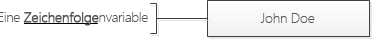
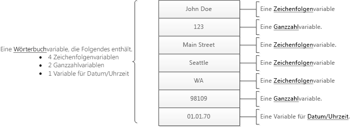
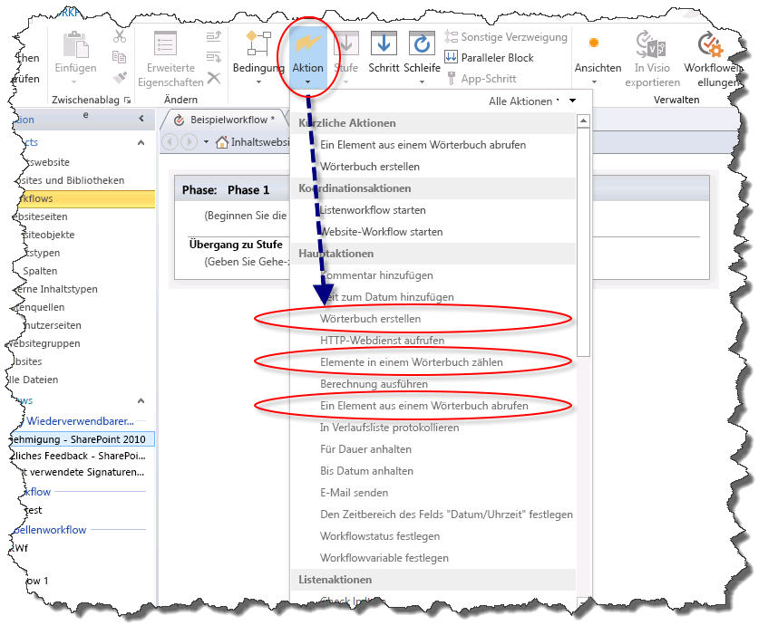
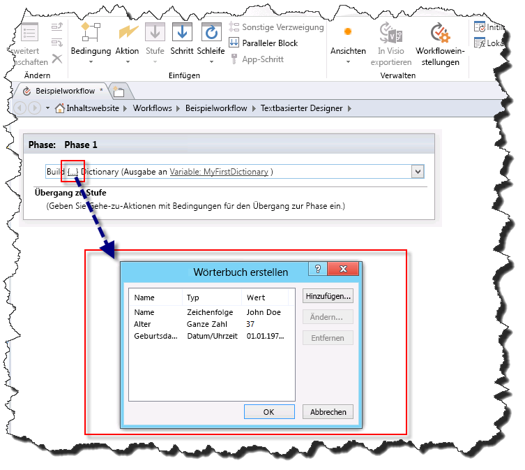
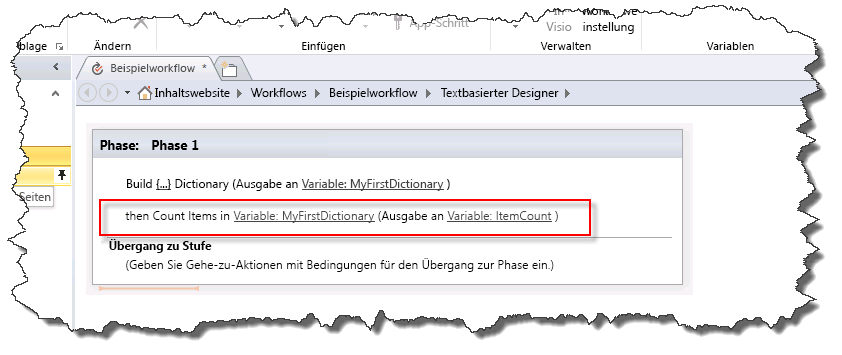
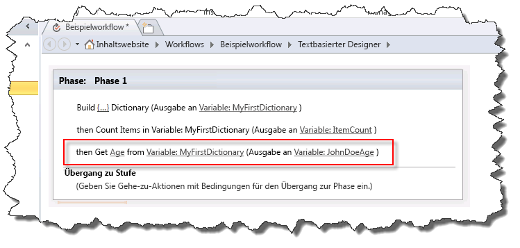

# Grundlegendes zu Wörterbuchaktionen in SharePoint Designer 2013
Der Variablentyp "Wörterbuch" ist ein neuer Variablentyp in der Workflowplattform von SharePoint 2013, die Sie mit SharePoint Designer 2013 verwenden können. 
||
|:-----|
||
   

## Grundlegendes zum Variablentyp "Wörterbuch"

Ein Workflow ist eine Folge von Aktionen, die zu einem gewünschten Ergebnis führen. Beim Erstellen eines Workflows müssen Sie häufig Werte für die Verwendung in anderen Teilen des Workflows in einer Variablen (Speichercontainer) speichern.
  
    
    
Wenn Sie eine Variable erstellen, müssen Sie dem Workflowmodul mitteilen, welche Art von Daten in der Variablen enthalten sind. Beispiel: Sie möchten den Namen eines Mitarbeiters in einer Variablen speichern. Der Name eines Mitarbeiters ist eine Zeichenfolge. Somit würden Sie eine Variable vom Typ **String** erstellen. Der Workflow könnte dann den Namen des Mitarbeiters, z. B. "John Doe", in der Variablen speichern.
  
    
    

**Abbildung: Eine Zeichenfolgenvariable**

  
    
    

  
    
    

  
    
    
SharePoint Designer 2013 verfügt über einen neuen Variablentyp **Wörterbuch**. Der Variablentyp **Wörterbuch** ist ein Container, der eine Auflistung von anderen Variablen enthalten soll. In Ihrem Workflow muss möglicherweise mehr als nur der Name des Mitarbeiters gespeichert werden. Sie müssen möglicherweise auch seine Adresse und sein Geburtsdatum speichern. Wenn Sie keine **Wörterbuch**-Variable verwenden, müssen Sie mehrere eigenständige Variablen erstellen. Dies kann schnell zu Schwierigkeiten in der Organisation und bei der Verwendung in der Workflowlogik führen. Eine **Wörterbuch**-Variable ermöglicht es, mehrere Datenpunkte in einer Variablen zu speichern.
  
    
    
Die Abbildung veranschaulicht das Konzept.
  
    
    

**Abbildung: Eine Wörterbuchvariable**

  
    
    

  
    
    

  
    
    

  
    
    

  
    
    

## Workflowaktionen für den Variablentyp "Wörterbuch"

Ein Workflow besteht aus mehreren Aktionen, die während der Verarbeitung des Workflows ausgeführt werden. SharePoint Designer 2013 enthält viele verschiedene Aktionen. Beispielsweise gibt es eine Aktion zum Senden einer E-Mail, zum Erstellen eines Listenelements und zum Protokollieren von Nachrichten im Workflowverlauf.
  
    
    
Im Folgenden sind die drei Aktionen aufgeführt, die speziell für den Variablentyp **Wörterbuch** entwickelt wurden.
  
    
    

- **Wörterbuch erstellen**
    
  
- **Elemente in einem Wörterbuch zählen**
    
  
- **Ein Element aus einem Wörterbuch abrufen**
    
  
Die Workflowaktionen für den Variablentyp Wörterbuch finden Sie in der Dropdownliste **Aktion**, wie in der Abbildung dargestellt.
  
    
    

**Abbildung: Wörterbuchaktionen**

  
    
    

  
    
    

  
    
    

### Erstellen von Variablen mit der Aktion "Wörterbuch erstellen"

Sie verwenden die Aktion **Wörterbuch erstellen**, um eine Variable vom Typ **Wörterbuch** zu erstellen. Sie geben den Inhalt des Wörterbuchs ein und geben dann den Namen des Wörterbuchs in der Variablenliste an.
  
    
    
Die Abbildung zeigt das Dialogfeld **Wörterbuch erstellen**. Beachten Sie, dass dem Wörterbuch drei Variablen hinzugefügt wurden: eine Zeichenfolge, eine ganze Zahl und eine Datum/Uhrzeit-Variable.
  
    
    

**Abbildung: Das Dialogfeld "Wörterbuch erstellen"**

  
    
    

  
    
    

  
    
    
Ein **Wörterbuch** kann jeden Typ von Variable enthalten, der in der SharePoint 2013-Workflowplattform verfügbar ist. In der folgenden Liste werden die verfügbaren Variablentypen definiert:
  
    
    

- **Boolean**: Ein Ja/Nein-Wert Wert
    
  
- **Date/Time**: Datum und Uhrzeit
    
  
- **Dictionary**: Eine Auflistung von Variablen
    
  
- **Guid**: Eine GUID (Globally Unique Identifier)
    
  
- **Integer**: Eine ganze Zahl ohne Dezimalstellen
    
  
- **Number**: Eine Zahl, die Dezimalstellen enthalten kann
    
  
- **String**: Eine Folge von Zeichen
    
  

    
> **WICHTIG**
> Der Variablentyp **Wörterbuch** ist wichtig bei der Verwendung der Aktion **HTTP-Webdienst aufrufen**. 
  
    
    

    
> **VORSICHT**
> Die Verwendung des **Name**-Felds als Nachschlagefeld wird nur unterstützt, wenn Sie einen Wert in einem Wörterbuch festlegen. Das **Name**-Feld als Nachschlagefeld wird nicht unterstützt, wenn Sie ein Wörterbuch erstellen. 
  
    
    

    
> **HINWEIS**
> Eine **Wörterbuch**-Variable kann eine Variable vom Typ **Wörterbuch** enthalten. Die Möglichkeit zum Speichern von **Wörterbuch**-Variablen innerhalb einer **Wörterbuch**-Variablen bietet eine Reihe von Vorteilen. Sie können z. B. ein **Wörterbuch** zum Speichern von Informationen zu Mitarbeitern erstellen. In diesem **Wörterbuch** könnten Sie einen weiteren **Wörterbuch**-Eintrag für jeden Mitarbeiter erstellen. Bei der Erstellung des Workflows können Sie die **Wörterbuch**-Variable verwenden, statt ständig neue eigenständige Variablen für die einzelnen Informationsarten zu jedem Mitarbeiter zu erstellen. Wie in diesem Beispiel dargestellt, kann ein **Wörterbuch** zum Organisieren komplexer Informationen innerhalb des Workflows verwendet werden.
  
    
    

### Zählen und Speichern von Variablen mit der Aktion "Elemente in einem Wörterbuch zählen"

Mit der Aktion **Elemente in einem Wörterbuch zählen** zählen Sie die Variablen, die ein **Wörterbuch** enthält, und speichern diese Zahl dann in einer ganzzahligen Variablen. Anschließend können Sie die Anzahl von Elementen zum Durchlaufen des **Wörterbuchs** verwenden.
  
    
    
Die Abbildung zeigt die Workflowaktion **Elemente in einem Wörterbuch zählen**. 
  
    
    

**Abbildung: Elemente in einem Wörterbuch zählen**

  
    
    

  
    
    

  
    
    

  
    
    

  
    
    

### Abrufen von Variablen mit der Aktion "Ein Element aus einem Wörterbuch abrufen"

Mit der Aktion **Ein Element aus einem Wörterbuch abrufen** rufen Sie eine im **Wörterbuch** gespeicherte Variable ab und platzieren sie in einer Variablen. Dies ist hilfreich, wenn Sie einen Wert aus dem Wörterbuch in einer eigenständigen Variablen gespeichert benötigen. Sie können einen Wert durch Eingeben des Namens der Variablen abrufen.
  
    
    
Die Abbildung zeigt die Workflowaktion **Ein Element aus einem Wörterbuch abrufen**. Beachten Sie, dass **Age** der Name der Variablen im **Wörterbuch** ist, die in eine neue **Integer**-Variable ausgegeben wird.
  
    
    

**Abbildung: Ein Element aus einem Wörterbuch abrufen**

  
    
    

  
    
    

  
    
    

  
    
    

  
    
    

## Weitere Ressourcen

-  [Workflow in SharePoint 2013 ](http://technet.microsoft.com/de-de/sharepoint/jj556245.aspx)
    
  
-  [What's new in workflow in SharePoint Server 2013](http://msdn.microsoft.com/library/6ab8a28b-fa2f-4530-8b55-a7f663bf15ea.aspx)
    
  
-  [Getting started with SharePoint Server 2013 workflow](http://msdn.microsoft.com/library/cc73be76-a329-449f-90ab-86822b1c2ee8.aspx)
    
  

  
    
    

