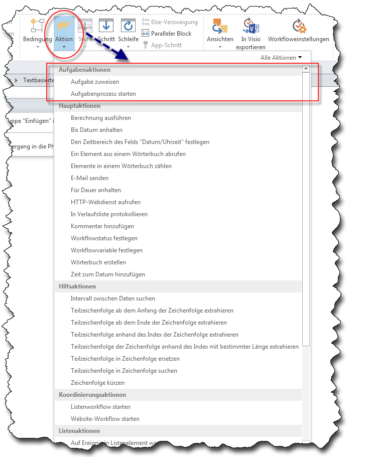
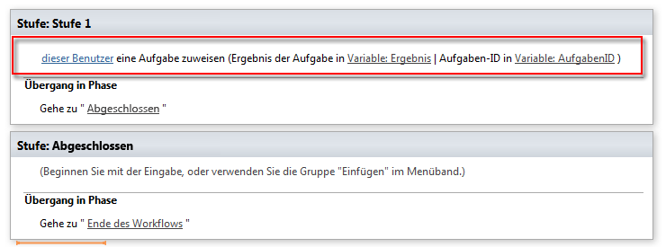
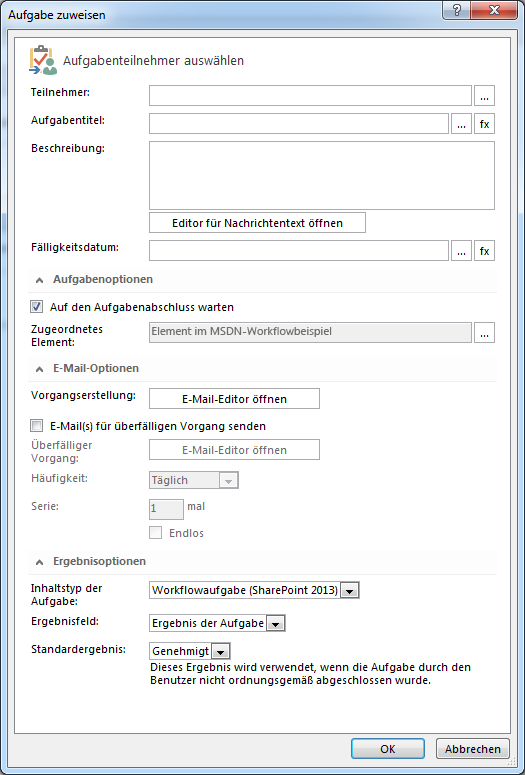
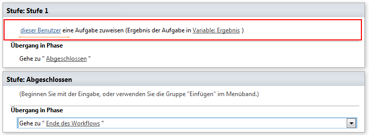
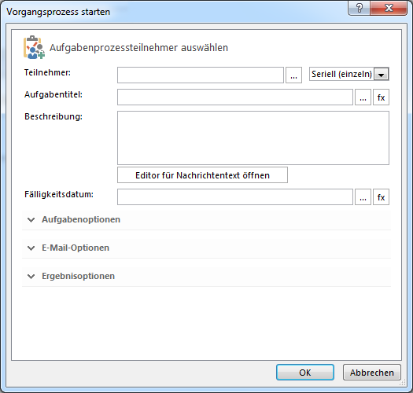

# Grundlegendes zu Aufgabenaktionen in SharePoint Designer 2013
Hier lernen, mit Aufgabenaktionen in SharePoint Designer 2013 zu arbeiten.
||
|:-----|
||
   

## Übersicht über Aufgabenaktionen in SharePoint Designer 2013

Mithilfe einer Aufgabe in SharePoint Server 2013 können Personen oder Gruppen Aufgaben zugeteilt werden, um dann den Fortschritt dieser Aufgaben nachzuverfolgen. Für die Arbeit mit Aufgaben gibt zwei Workflowaktionen in SharePoint Designer 2013.
  
    
    
Diese Aktionen sind:
  
    
    

- **Aufgabe zuweisen** wird verwendet, um eine SharePoint 2013-Aufgabe zu erstellen und einem einzelnen Teilnehmer zuzuweisen.
    
  
- **Vorgangsprozess starten** wird verwendet, um eine Aufgabe mehreren Teilnehmern zuzuweisen.
    
  
Sie finden die Aufgabenaktionen im Dropdown-Menü **Aktion** im Menüband von SharePoint Designer 2013, wie in der Abbildung unten zu sehen ist.
  
    
    

**Abbildung: Aufgabenaktionen in SharePoint Designer 2013**

  
    
    

  
    
    

  
    
    

  
    
    

  
    
    

## Verwenden von Aufgabenaktionen in SharePoint 2013

Ein Geschäftsprozess besteht häufig aus Aufgaben, die von Personen ausgeführt werden müssen. Ein Workflow koordiniert die einzelnen Prozesschritte. Ein Workflow verwendet Aufgabenaktionen, um Personen Aufgaben zuzuweisen. Beispielsweise müssen verschiedenen Aufgaben durchgeführt werden, wenn ein Unternehmen einen neuen Mitarbeiter anstellt. Eine dieser Aufgaben könnte die Mitarbeitereinführung sein. Für diese Aufgabe könnte dann ein Mitarbeiter der Personalabteilung verantwortlich sein.
  
    
    
Die Aktionen **Aufgabe zuweisen** und **Vorgangsprozess starten** befinden sich im Dropdown-Menü **Aktionen** auf dem Menüband in SharePoint Designer 2013. Sie können einem Workflow Aktionen hinzufügen und Sie an Ihre Bedürfnisse anpassen. Die Aktion **Aufgabe zuweisen** wird verwendet, um eine Aufgabe einem einzelnem Teilnehmer zuzuweisen. Die Aktion **Vorgangsprozess starten** wird verwendet, um eine Aufgabe mehreren Teilnehmern zuzuweisen.
  
    
    

### Zuweisen einer Aufgabe

Die untenstehende Abbildung zeigt die Aktion **Aufgabe zuweisen**.
  
    
    

**Abbildung: Aktion "Aufgabe zuweisen" in SharePoint Designer 2013**

  
    
    

  
    
    

  
    
    

  
    
    

  
    
    
Für die Aktion **Assign a task** werden drei Eingaben benötigt: der Benutzer, dem die Aufgabe zugeteilt werden soll, die Variable "Ergebnis" und die Variable "Aufgaben-ID.
  
    
    

- **this user**: Öffnet das Dialogfenster **Aufgabe zuweisen** (siehe Abbildung unten). In diesem Dialogfenster können Sie verschiedene Parameter festlegen: Teilnehmer, Aufgabentitel, Beschreibung, Fälligkeitsdatum, Aufgabenoptionen, E-Mail-Optionen und Ergebnisoptionen.
    
  
- **Variable: Outcome**: Hiermit wird die Variable zugewiesen, die das Ergebnis der Aufgabe enthält.
    
  
- **Variable: TaskID**: Hiermit wird die Variable zugewiesen, die die Aufgaben-ID enthält.
    
  

**Abbildung: Dialogfenster "Aufgabe zuweisen"**

  
    
    

  
    
    

  
    
    

  
    
    

  
    
    

### Vorgangsprozess starten

Die untenstehende Abbildung zeigt die Aktion **Vorgangsprozess starten**.
  
    
    

**Abbildung: Die Aktion "Vorgangsprozess starten".**

  
    
    

  
    
    

  
    
    

  
    
    

  
    
    
Für die Aktion **Vorgangsprozess starten** werden zwei Eingaben benötigt: die Bentutzer, die an der Aufgabe teilnehmen werden und die Variable "Ergebnis".
  
    
    

- **these users**: Öffnet das Dialogfenster **Vorgangsprozess starten**, wie in der Abbildung unten zu sehen ist. In diesem Dialogfenster können Sie verschiedene Parameter festlegen: Teilnehmer, Aufgabentitel, Beschreibung, Fälligkeitsdatum, Aufgabenoptionen, E-Mail-Optionen und Ergebnisoptionen.
    
  
- **Variable: Outcome**: Hiermit wird die Variable zugewiesen, die das Ergebnis des Vorgangsprozesses enthält.
    
  

**Abbildung: Dialogfenster "Vorgangsprozess starten"**

  
    
    

  
    
    

  
    
    

  
    
    

  
    
    

## Weitere Ressourcen

-  [What's new in workflow in SharePoint Server 2013](http://msdn.microsoft.com/library/6ab8a28b-fa2f-4530-8b55-a7f663bf15ea.aspx)
    
  
-  [Getting started with SharePoint Server 2013 workflow](http://msdn.microsoft.com/library/cc73be76-a329-449f-90ab-86822b1c2ee8.aspx)
    
  
-  [Workflowentwicklung in SharePoint Designer und Visio](workflow-development-in-sharepoint-designer-and-visio.md)
    
  
-  [Kurzübersicht zu Workflowaktionen (SharePoint 2013-Workflowplattform)](workflow-actions-quick-reference-sharepoint-2013-workflow-platform.md)
    
  

  
    
    

