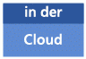

# Visio Services in SharePoint 2013
Mit Visio Services in Microsoft SharePoint Server 2013 können Sie programmgesteuert Visio-Dateien in den Formaten VSDX, VSDM und VDW (Visio-Webzeichnungen) in Microsoft SharePoint Server 2013 und Microsoft SharePoint Online laden, anzeigen und damit interagieren.
## Neuerungen in Visio Services in SharePoint Server 2013

Visio Services in Microsoft SharePoint Server 2013 und in Microsoft SharePoint Online enthält einige neue Features. Dazu zählt die Unterstützung des neuen Dateiformats für Microsoft Visio 2013, von Microsoft Business Connectivity Services (BCS)-Datenquellen und dem programmatischen Zugriff auf Kommentare.
  
    
    

### Neues Dateiformat

|||
|:-----|:-----|
|            |Mit Visio 2013 wird ein neues Dateiformat eingefügt (VSDX), das auf dem Standard Open Packaging Conventions (OPC, ISO 29500, Teil 2) und den XML-Elementen aus dem vorherigen Visio-Dateiformat (VDX) basiert. Es handelt sich um ein komprimiertes, XML-basiertes Dateiformat, ähnlich wie bei anderen -Anwendungen.    Mit dem neuen Dateiformat können Sie Visio 2013-Zeichnungen direkt in einer SharePoint Server- oder SharePoint Online-Bibliothek speichern, ohne die Datei als Visio-Webzeichnung (VDW) veröffentlichen zu müssen. Dennoch kann Visio Services Visio-Webzeichnungen weiterhin lesen und anzeigen.    Mit Visio Services können Visio-Webzeichnungen im Format VDW weiterhin im Browser angezeigt werden. Es können außerdem die neuen Formate Visio-Zeichnung (VSDX) und Visio-Zeichnung mit Makros (VSDM) gerendert werden.    Das Visio ServicesECMAScript (JavaScript, JScript)-Objektmodell enthält eine neue API zur Unterstützung der neuen Dateiformate:  [Vwa.VwaControl.getDiagramFileType Method](http://msdn.microsoft.com/library/fd8ca95f-a3be-4000-bce8-3aaf1f48148c%28Office.15%29.aspx). Die Methoden geben einen Wert von  [Vwa.DiagramFileType Enumeration](http://msdn.microsoft.com/library/dd2f8a5d-a54b-44bd-a458-02efdcba0201%28Office.15%29.aspx) zurück, der angibt ob eine im Visio Web Access-Webpart angezeigte Datei eine Visio-Zeichnung (VSDX) oder eine Visio-Webzeichnung (VDW) ist.   Weitere Informationen zum neuen Dateiformat in Visio 2013 finden Sie unter  [Einführung in das Visio-Dateiformat (.vsdx)](http://msdn.microsoft.com/library/69736f40-8f67-46c2-abf6-82dffecb2274%28Office.15%29.aspx).    > **HINWEIS**> Die neuen Visio-Dateien (VSDX und VSDM) wurden auf Visio Services nur im Rasterformat angezeigt. Visio-Webzeichnungen (VDW) können weiterhin mit Silverlight angezeigt werden.           |
   

### Unterstützung für BCS-Daten (Business Connectivity Services)

|||
|:-----|:-----|
|            |Visio 2013-Diagramme können nun mit externen Listen verbunden werden, die mit Microsoft Business Connectivity Services (BCS) auf SharePoint Server 2013-Servern oder in SharePoint Online erstellt wurden. Mit Visio Services können Sie Visio-Diagramme bei Aktualisierung der Daten aktualisieren.    > **HINWEIS**> Visio Services bietet keine Unterstützung für SQL, SQL Azure, OLEDC, ODBC und benutzerdefinierte Datenanbieter als Datenquellen in SharePoint Online.           |
   

### Kommentare

|||
|:-----|:-----|
|            |Visio 2013 enthält ein neues Framework für Kommentare. Kommentare können nun mit einer bestimmten Form oder Seite verknüpft werden. Visio Services enthält JavaScript-APIs zum Abrufen der Kommentare aus einem Diagramm.    Weitere Information zu den APIs für Kommentare im Visio ServicesJavaScript-Objektmodell finden Sie unter den Themen  [VwaPage.getPageComments Method](http://msdn.microsoft.com/library/d1e7740c-e0fa-4823-b2b6-14551bb84c36%28Office.15%29.aspx) und [VwaShape.getComments Method](http://msdn.microsoft.com/library/fcdec9c2-a503-4315-b048-033cd5ac09dd%28Office.15%29.aspx).    |
   

### Erweiterte Neuberechnung

|||
|:-----|:-----|
|            |Visio Services kann Formeln im ShapeSheet neu berechnen. Zusätzlich zum Aktualisieren von Datengrafiken kann Visio Services alle Formen aktualisieren, die Daten und Diagramme enthalten, die von Daten abhängig sind. Bei der Neuberechnung werden die meisten ShapeSheet-Funktionen unterstützt.    |
   

### Verbesserte Fehlerbehandlung

|||
|:-----|:-----|
|            |Bei einem Fehler bei der Aktualisierung der Daten in einer angezeigten Visio-Zeichnung in Visio Services wird nun ein statisches Bild des Diagramms angezeigt. Außerdem gibt Visio Services hilfreichere Informationen in Fehlermeldungen aus.    |
   

### Sichere Authentifizierung im Store

|||
|:-----|:-----|
|            |Bisher mussten Authentifizierungseinstellungen für externe Datenquellen (wie z. B. eine SQL-Datenbank) in einem Dienstprogramm in Microsoft Excel konfiguriert werden. Mit Visio 2013 können Benutzer Ihre mit Diagrammen verbundenen Daten direkt in der Visio-Clientanwendung konfigurieren, wodurch Datenquellen in Visio Services aktualisiert werden können.    |
   

## Visio Services-JavaScript-Objektmodell

|||
|:-----|:-----|
|            |Der  [Vwa-Namespace](http://msdn.microsoft.com/library/b67939fa-d3db-41ff-8864-eabd318ba7c4%28Office.15%29.aspx) im JavaScript-Objektmodell in Visio Services ermöglicht Ihnen den programmatischen Zugriff auf Visio-Zeichnungen, die im Visio Web Access-Webpart angezeigt werden. Mit dem JavaScript-Objektmodell können Sie auf Daten zu Diagrammen, Seiten, Formen, Formhyperlinks und umgebenden Felder von Formen zugreifen. Dadurch können Sie die Informationen neu anordnen und bspw. bestimmte Formen hervorheben, Überlagerungen auf Diagrammen platzieren, auf Diagramm- und Mausereignisse reagieren und die Schwenk- und Zoom-Eigenschaften des Viewports ändern.   Weitere Informationen zum Hinzufügen eines Visio Web Access-Webparts zu einer SharePoint-Seite und zum Programmieren dieser Seite mit den JavaScript-APIs in Visio 2013 finden Sie unter  [Anpassen von Visio-Webzeichnungen im Visio Web Access-Webpart](http://msdn.microsoft.com/de-de/library/ff394649.aspx).    |
   

## Visio Services-Klassenbibliothek

|||
|:-----|:-----|
||Sie können die Visio Services-Klassenbibliothek im  [Microsoft.Office.Visio.Server](https://msdn.microsoft.com/library/Microsoft.Office.Visio.Server.aspx) -Namespace zum Erstellen benutzerdefinierter Visio Services-Datenanbieter verwenden. Mit diesen Datenanbietern können Sie Daten, die aus benutzerdefinierten Datenquellen in Visio 2013-Diagrammen auf einer SharePoint Server 2013-Seite stammen, programmatisch aktualisieren.   Weitere Informationen zum Erstellen benutzerdefinierter Datenanbieter und zu einer vollständige End-to-End-Lösung finden Sie unter  [Erstellen einen benutzerdefinierten Datenanbieters mit Visio Services](http://msdn.microsoft.com/de-de/library/ff394595.aspx).    |
   

## Zusätzliche Ressourcen

-  [Microsoft.Office.Visio.Server](https://msdn.microsoft.com/library/Microsoft.Office.Visio.Server.aspx)
    
  
-  [Vwa-Namespace](http://msdn.microsoft.com/library/b67939fa-d3db-41ff-8864-eabd318ba7c4%28Office.15%29.aspx)
    
  
-  [Erstellen einen benutzerdefinierten Datenanbieters mit Visio Services](http://msdn.microsoft.com/de-de/library/ff394595.aspx)
    
  
-  [Anpassen von Visio-Webzeichnungen im Visio Web Access-Webpart](http://msdn.microsoft.com/de-de/library/ff394649.aspx)
    
  
-  [New in Visio for developers](http://msdn.microsoft.com/library/7e3fb858-0ab8-bd2e-217c-c85b10d79785%28Office.15%29.aspx)
    
  
- Eine Liste der neuen Features in vis15short für Endbenutzer finden Sie unter  [Neuerungen in Visio](http://office.com/redir/HA102749364.aspx).
    
  
