# Visio-Shapes in SharePoint Designer 2013: Eine Kurzübersicht (SharePoint 2010-Workflowplattform)
Sie können einen Workflow in Microsoft Visio Professional 2013 erstellen und diesen dann nach Microsoft SharePoint Designer 2013 exportieren. In diesem Handbuch sind die Visio-Shapes aufgeführt, die Sie zum Erstellen des Workflows verwenden.Verwenden Sie diesen Referenzartikel nur, wenn Sie in SharePoint Designer 2013 arbeiten, weiterhin jedoch die SharePoint 2010-Workflowplattform verwenden möchten.Die Shapes für die SharePoint 2010-Workflowplattform umfassen drei Schablonen: **Aktionen - SharePoint 2010-Workflow**, **Bedingungen - SharePoint 2010-Workflow** und **Abschlusszeichen - SharePoint 2010-Workflow**.
## Workflowaktionen

Workflowaktionen sind bestimmte Vorgänge, die ein Workflow durchführt. Jeder Workflow muss mindestens eine Aktion enthalten.
  
    
    
Die Aktionen in dieser Liste sind in Kategorien basierend auf ihrem Anwendungsbereich in einem Workflow organisiert. Beispielsweise werden die Aktionen, die Auswirkungen auf das Verhalten eines Listenelements haben, unter **Listenaktionen**, und Aktionen für Dokumentenmappen unter **Aktionen für die Dokumentenmappe** gruppiert. Die Kategorien für Aktionen sind:
  
    
    

-  [Hauptaktionen](visio-shapes-in-sharepoint-designer-2013-a-quick-reference-guide-sharepoint-2010.md#section1a) Hierbei handelt es sich um die am häufigsten verwendeten Aktionen in einem Workflow.
    
  
-  [Aktionen für die Dokumentenmappe](visio-shapes-in-sharepoint-designer-2013-a-quick-reference-guide-sharepoint-2010.md#section1e) Diese Aktionen werden normalerweise in Workflows verwendet, die einer Dokumentbibliothek oder dem Dokumentinhaltstyp zugeordnet sind.
    
  
-  [Listenaktionen](visio-shapes-in-sharepoint-designer-2013-a-quick-reference-guide-sharepoint-2010.md#section1b) Diese Aktionen führen Operationen in Listenelementen aus.
    
  
-  [Relationale Aktionen](visio-shapes-in-sharepoint-designer-2013-a-quick-reference-guide-sharepoint-2010.md#section1d) Die einzige Aktion in dieser Kategorie sucht nach dem Vorgesetzten eines Benutzers und speichert diese Informationen in einer Variablen.
    
  
-  [Aufgabenaktionen](visio-shapes-in-sharepoint-designer-2013-a-quick-reference-guide-sharepoint-2010.md#section1c) Diese Aktionen sind Genehmigungs-, Feedback- und Formularvorgängen zugeordnet.
    
  

> **WICHTIG**
> Für die meisten Aktions-Shapes, die Sie in einen SharePoint-Workflow in Visio einfügen können, ist eine zusätzliche Konfiguration erforderlich, wenn der Workflow in SharePoint Designer importiert wird. Vergessen Sie in Visio nicht, die Kommentarfeatures jedes Aktions-Shapes zu verwenden, um die Einstellungen oder die Konfiguration der Aktion anzugeben. 
  
    
    

### Hauptaktionen

Dies sind die am häufigsten verwendeten Aktionen, die in in jedem Workflowtyp oder -schritt verwendet werden können.
  
    
    

****

|**Visio-Aktions-Shapes**|**Entsprechende Aktion in SharePoint Designer**|**Aktionsbeschreibung**|
|:-----|:-----|:-----|
|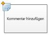|Diese Visio-Aktion ist identisch mit der Aktion **Kommentar hinzufügen** in SharePoint Designer 2013 und wird angezeigt als:      > **HINWEIS**> Kommentare bleiben sichtbar, wenn der Workflow nach Visio exportiert wird.           |**Kommentar hinzufügen**   Verwenden Sie diese Aktion, um informative Kommentare zu Referenzzwecken im Workflow-Designer zu hinterlassen. Dies ist besonders hilfreich, wenn es andere Benutzer gibt, die sich an der Erstellung von Workflows beteiligen. Wenn z. B. eine Variable im aktuellen Workflow keinen benutzerfreundlichen Namen aufweist, verwenden Sie diese Aktion zum Hinzufügen von Kommentaren, um anzugeben, welche Funktion die Variable im Workflow hat.    |
|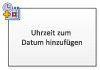|Diese Visio-Aktion ist identisch mit der Aktion **Zeit zum Datum hinzufügen** in SharePoint Designer 2013 und wird angezeigt als:  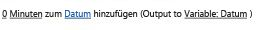|**Zeit zum Datum hinzufügen**   Mit dieser Aktion können Sie eine bestimmte Zeit in Minuten, Stunden, Tagen, Monaten oder Jahren zu einem Datum hinzufügen und den Ausgabewert als Variable speichern. Das Datum kann ein aktuelles Datum, ein bestimmtes Datum oder ein Nachschlagewert sein.    |
|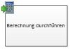|Diese Visio-Aktion ist identisch mit der Aktion **Berechnung ausführen** in SharePoint Designer 2013 und wird angezeigt als:  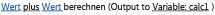|**Berechnung ausführen**   Verwenden Sie diese Aktion, um eine Berechnung durchzuführen, z. B. das Addieren, Subtrahieren, Multiplizieren oder Dividieren zweier Werte, und um den Ausgabewert in einer Variablen zu speichern.    |
|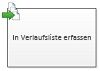|Diese Visio-Aktion ist identisch mit der Aktion **Für die Verlaufsliste protokollieren** in SharePoint Designer 2013 und wird angezeigt als:  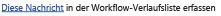|**Für die Verlaufsliste protokollieren**   Verwenden Sie diese Aktion, um eine Nachricht zum Workflow in seiner Verlaufsliste zu protokollieren. Eine Nachricht kann eine Zusammenfassung eines Workflowereignisses oder etwas anderes wichtiges über den Workflow sein. Die Verlaufsliste des Workflows kann bei der Behandlung von Problemen mit dem Workflow hilfreich sein.    |
|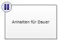|Diese Visio-Aktion ist identisch mit der Aktion **Für Dauer anhalten** in SharePoint Designer 2013 und wird angezeigt als:  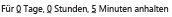|**Für Dauer anhalten**   Verwenden Sie diese Aktion, um den Workflow für einen bestimmten Zeitraum in Tagen, Stunden oder Minuten anzuhalten.    > **HINWEIS**> Die Verzögerungszeit spiegelt das Zeitgeberauftragsintervall wider, das einen Standardwert von fünf Minuten hat.           |
|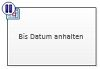|Diese Visio-Aktion ist identisch mit der Aktion **Bis Datum anhalten** in SharePoint Designer 2013 und wird angezeigt als:  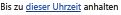|**Bis Datum anhalten**   Verwenden Sie diese Aktion, um den Workflow bis zu einem bestimmten Datum anzuhalten. Sie können das aktuelle Datum, ein bestimmtes Datum oder einen Nachschlagewert hinzufügen.    |
|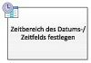|Diese Visio-Aktion ist identisch mit der Aktion **Den Zeitbereich des Felds 'Datum/Uhrzeit' festlegen** in SharePoint Designer 2013 und wird angezeigt als:  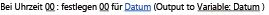|**Den Zeitbereich des Felds 'Datum/Uhrzeit' festlegen**   Verwenden Sie diese Aktion, um einen Zeitstempel zu erstellen und den Ausgabewert in einer Variablen zu speichern. Sie können die Uhrzeit in Stunden und Minuten festlegen und ein aktuelles Datum, ein bestimmtes Datum oder einen Nachschlagewert festlegen.    |
|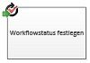| Diese Visio-Aktion ist identisch mit der Aktion **Workflowstatus festlegen** in SharePoint Designer 2013 und wird angezeigt als:  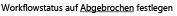 Sie können einen Statuswert nicht umbenennen oder löschen, nachdem dieser erstellt wurde. Allerdings müssen Sie diesen nicht verwenden.    Ein benutzerdefinierter Status ist nur für den aktuellen Workflow anwendbar und kann nicht in einem anderen Workflow verwendet werden.    Ein Workflow kann benutzerdefinierte in der Aktion definierte Statuswerte nicht verwenden, wenn die Aktion in einem Identitätswechselschritt verwendet wird.   |**Workflowstatus festlegen**   Verwenden Sie diese Aktion, um den Status des Workflows festzulegen. Die Standardoptionen sind **Abgebrochen**, **Genehmigt** und **Abgelehnt**.    Sie können einen neuen Statuswert in der Dropdownliste in der Aktion eingeben. Sobald Sie einen Statuswert eingegeben haben, wird der Eintrag der Dropdownliste automatisch hinzugefügt.    Wenn die Aktion **Workflowstatus festlegen** der letzte Schritt in einem Workflow war, in der auch ein benutzerdefinierter Wert verwendet wurde, wird der benutzerdefinierte Wert in der Spalte **Status** in der Liste angezeigt, wenn der Workflow angehalten oder abgeschlossen ist.   |
|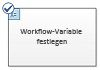|Diese Visio-Aktion ist identisch mit der Aktion **Workflowvariable festlegen** in SharePoint Designer 2013 und wird angezeigt als:  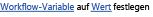|**Workflowvariable festlegen**   Verwenden Sie diese Aktion, um eine Workflowvariable auf einen Wert festzulegen. Verwenden Sie diese Aktion, wenn der Workflow einer Variablen Daten zuweisen soll.    |
|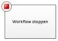|Diese Visio-Aktion ist identisch mit der Aktion **Workflow beenden** in SharePoint Designer 2013 und wird angezeigt als:  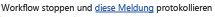|**Workflow beenden**   Verwenden Sie diese Aktion, um die aktuelle Instanz des Workflows zu stoppen und eine Nachricht in der Liste **Workflowverlauf** zu protokollieren. Die in der Aktion angegebene Nachricht wird in der Spalte **Beschreibung** im Workflowverlauf angezeigt, wenn der Workflow abgeschlossen wird.   |
   

### Listenaktionen

Diese Aktionen werden für Listenelemente verwendet.
  
    
    

****

|**VISIO-AKTIONS-SHAPE**|**ENTSPRECHENDE AKTION IN SHAREPOINT DESIGNER**|**AKTIONSBESCHREIBUNG**|
|:-----|:-----|:-----|
|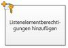|Diese Visio-Aktion ist identisch mit der Aktion ** Listenelementberechtigungen hinzufügen** in SharePoint Designer 2013 und wird angezeigt als:  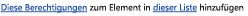    > **HINWEIS**> Diese Aktion ist nur in einem Identitätswechselschritt verfügbar.           |**Listenelementberechtigungen hinzufügen**   Diese Aktion gewährt bestimmten Benutzern bestimmte Berechtigungsstufen für ein Element.    |
|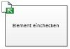|Diese Visio-Aktion ist identisch mit der Aktion **Element einchecken** in SharePoint Designer 2013 und wird angezeigt als:  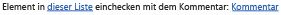|**Element einchecken**   Durch diese Aktion wird ein Element eingecheckt, das ausgecheckt ist.    > **HINWEIS**> Sie können nur Elemente aus einer Dokumentbibliothek einchecken.           |
|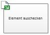|Diese Visio-Aktion ist identisch mit der Aktion **Element auschecken** in SharePoint Designer 2013 und wird angezeigt als:  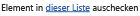|**Element auschecken**   Verwenden Sie diese Aktion, um ein Element auszuchecken. Der Workflow überprüft, ob das Element eingecheckt ist, bevor ein Dokument ausgecheckt wird.    > **HINWEIS**> Sie können nur Elemente aus einer Bibliothek auf Ihrer Website auschecken.           |
|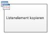|Diese Visio-Aktion ist identisch mit der Aktion **Listenelement kopieren** in SharePoint Designer 2013 und wird angezeigt als:  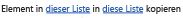|**Listenelement kopieren**   Verwenden Sie diese Aktion, um ein Listenelement in eine andere Liste zu kopieren. Wenn ein Dokument in dem Listenelement vorhanden ist, kopiert der Workflow auch das Dokument in die Zielliste.    > **WICHTIG**> Mindestens eine Spalte muss in der Quellliste und der Zielliste ähnlich sein.           |
|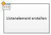|Diese Visio-Aktion ist identisch mit der Aktion **Listenelement erstellen** in SharePoint Designer 2013 und wird angezeigt als:  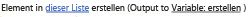|**Listenelement erstellen**   Verwenden Sie diese Aktion, um ein neues Listenelement in der angegebenen Liste zu erstellen. Sie können die Felder und Werte in dem neuen Element angeben.    Sie können diese Aktion immer dann verwenden, wenn ein neues Element mit bestimmten Informationen erstellt werden soll.    > **HINWEIS**> Die Ausgabevariable ist die ID des in der Liste erstellten Elements.           |
|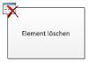|Diese Visio-Aktion ist identisch mit der Aktion **Element löschen** in SharePoint Designer 2013 und wird angezeigt als:  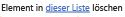|**Element löschen**   Verwenden Sie diese Aktion, um ein Element zu löschen.    |
|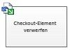|Diese Visio-Aktion ist identisch mit der Aktion **Auschecken von Element verwerfen** in SharePoint Designer 2013 und wird angezeigt als:  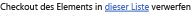|**Auschecken von Element verwerfen**   Verwenden Sie diese Aktion, wenn ein Element ausgecheckt ist, Änderungen daran vorgenommen wurden und Sie diese Änderungen verwerfen und das Element wieder einchecken möchten.    |
|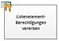|Diese Visio-Aktion ist identisch mit der Aktion **Übergeordnete Listenelementberechtigungen erben** in SharePoint Designer 2013 und wird angezeigt als:  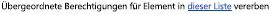    > **HINWEIS**> Diese Aktion ist nur in einem Identitätswechselschritt verfügbar.           |**Übergeordnete Listenelementberechtigungen erben**   Wenn das Element über eindeutige Berechtigungen verfügt, können Sie diese Aktion verwenden, damit das Element die übergeordneten Berechtigungen von der Liste erbt.    |
|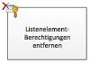|Diese Visio-Aktion ist identisch mit der Aktion **Listenelementberechtigungen entfernen** in SharePoint Designer 2013 und wird angezeigt als:  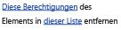    > **HINWEIS**> Diese Aktion ist nur in einem Identitätswechselschritt verfügbar.           |**Listenelementberechtigungen hinzufügen**   Durch diese Aktion werden Berechtigungen von einem Element für bestimmte Benutzer entzogen.    |
|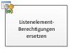|Diese Visio-Aktion ist identisch mit der Aktion **Listenelementberechtigungen ersetzen** in SharePoint Designer 2013 und wird angezeigt als:  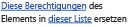    > **HINWEIS**> Diese Aktion ist nur in einem Identitätswechselschritt verfügbar.           |**Listenelementberechtigungen ersetzen**   Dadurch werden die aktuellen Berechtigungen eines Elements durch die neuen Berechtigungen ersetzt, die Sie in der Aktion angeben.    |
|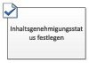|Diese Visio-Aktion ist identisch mit der Aktion **Status für die Genehmigung von Inhalten festlegen** in SharePoint Designer 2013 und wird angezeigt als:  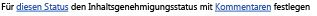    > **HINWEIS**> Die Inhaltsgenehmigung muss in der Liste aktiviert werden, bevor Sie diese Aktion verwenden können.           
|**Status für die Genehmigung von Inhalten festlegen**   Wenn Sie die Genehmigung von Inhalten in Ihrer Liste aktiviert haben, verwenden Sie diese Aktion, um das Statusfeld für die Inhaltsgehnemigung auf einen Wert wie "Genehmigt", "Abgelehnt" oder "Ausstehend" festzulegen. Sie können in der Aktion einen benutzerdefinierten Status eingeben.    > **HINWEIS**> Die Aktion **Status für die Genehmigung von Inhalten festlegen** verarbeitet das aktuelle Element, das derzeit vom Workflow verarbeitet wird, und steht daher in einem Websiteworkflow nicht zur Verfügung.          |
|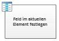|Diese Visio-Aktion ist identisch mit der Aktion **Feld im aktuellen Element festlegen** in SharePoint Designer 2013 und wird angezeigt als:  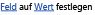|**Feld im aktuellen Element festlegen**   Verwenden Sie die Aktion, um ein Feld im aktuellen Element auf einen Wert festzulegen.    > **HINWEIS**> Wenn Sie den Workflow bis zur Änderung des Feldwerts anhalten möchten, verwenden Sie stattdessen die Aktion **Auf Feldänderung im aktuellen Element warten**.           Die Aktion **Feld im aktuellen Element festlegen** sollte nicht in einem Websiteworkflow verwendet werden.   |
|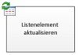|Diese Visio-Aktion ist identisch mit der Aktion **Listenelement aktualisieren** in SharePoint Designer 2013 und wird angezeigt als:  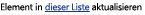|**Listenelement aktualisieren**   Verwenden Sie diese Aktion, um ein Listenelement zu aktualisieren. Sie können die Felder und die neuen Werte in diesen Feldern angeben.    |
|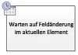|Diese Visio-Aktion ist identisch mit der Aktion **Auf Feldänderung im aktuellen Element warten** in SharePoint Designer 2013 und wird angezeigt als:  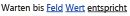|**Auf Feldänderung im aktuellen Element warten**   Durch diese Aktion wird der Workflow angehalten, bis das Feld im aktuellen Element auf einen neuen Wert geändert wurde.    > **HINWEIS**> Wenn der Workflow den Feldwert ändern soll, statt auf die Feldänderung zu warten, verwenden Sie stattdessen die Aktion **Feld im aktuellen Element festlegen**.           |
   

### Aufgabenaktionen

Aktionen in dieser Kategorie beziehen sich auf Aufgabenelemente. Diese Aktionen gelten nur für SharePoint-Websites, auf denen SharePoint Server 2013 ausgeführt wird.
  
    
    

****

|**VISIO-AKTIONS-SHAPE**|**ENTSPRECHENDE AKTION IN SHAREPOINT DESIGNER**|**AKTIONSBESCHREIBUNG**|
|:-----|:-----|:-----|
|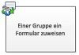|Diese Visio-Aktion ist identisch mit der Aktion **Formular einer Gruppe zuordnen** in SharePoint Designer 2013 und wird angezeigt als:  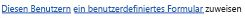|**Formular einer Gruppe zuordnen**   Mithilfe dieser Aktion können Sie ein benutzerdefiniertes Aufgabenformular mit angepassten Feldern erstellen.    Sie können diese Aktion verwenden, um eine Aufgabe einem oder mehreren Teilnehmern bzw. einer oder mehreren Gruppen zuzuweisen und diese aufzufordern, ihre Aufgaben auszuführen. Teilnehmer geben ihre Antworten in die Felder des benutzerdefinierten Aufgabenformulars ein, wenn sie mit der Aufgabe fertig sind, und klicken in dem Formular auf **Aufgabe erledigen**.    |
||Diese Visio-Aktion ist identisch mit der Aktion **Aufgabe zuordnen** in SharePoint Designer 2013 und wird angezeigt als:  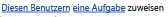|**Aufgabe zuordnen**   Mit dieser Aktion können Sie jedem Teilnehmer eine Aufgabe zuordnen und ihn auffordern, seine Aufgaben zu erledigen und nach Abschluss auf die Schaltfläche **Aufgabe erledigen** im Aufgabenformular zu klicken.   |
||Diese Visio-Aktion ist identisch mit der Aktion **Daten von einem Benutzer sammeln** in SharePoint Designer 2013 und wird angezeigt als:  |**Daten von einem Benutzer sammeln**   Mit dieser Aktion können Sie einem Teilnehmer eine Aufgabe zuordnen, ihn auffordern, die erforderlichen Informationen in einem benutzerdefinierten Aufgabenformular anzugeben und dann auf die Schaltfläche **Aufgabe erledigen** im Aufgabenformular zu klicken.   Diese Aktion hat eine OUTPUT-Klausel, d. h. der Workflow speichert die von dieser Aktion zurückgegebenen Informationen in einer entsprechenden Variablen. Die Listenelement-ID des abgeschlossenen Aufgabenelements der Aktion wird in der Sammelvariablen gespeichert.    |
||Diese Visio-Aktion ist identisch mit der Aktion **Genehmigungsprozess starten** in SharePoint Designer 2013 und wird angezeigt als:  |**Genehmigungsprozess starten**   Verwenden Sie diese Aktion, um ein Dokument zur Genehmigung weiterzuleiten. Genehmigende Personen können das Dokument genehmigen oder zurückweisen , die Genehmigungsaufgabe erneut zuweisen oder Änderungen anfordern.    Sie können internen und externen Teilnehmern Aufgaben in der Aktion zuweisen. Ein externer Teilnehmer kann ein Mitarbeiter Ihres Unternehmens sein, der kein Benutzer in der Websitesammlung ist, oder jemand außerhalb Ihres Unternehmens.    |
||Diese Visio-Aktion ist identisch mit der Aktion **Feedbackvorgang starten** in SharePoint Designer 2013 und wird angezeigt als:  |**Feedbackvorgang**   Mit dieser Aktion können Sie Benutzern in einer bestimmten Reihenfolge Aufgabenelemente für ein Feedback zuweisen - seriell oder parallel. Der Standard ist parallel. Benutzer oder Teilnehmer an der Aufgabe können eine Aufgabe auch an andere Benutzer zuweisen. Wenn die Benutzer fertig sind, klicken sie auf die Schaltfläche **Feedback übermitteln**, um anzugeben, dass die Aufgabe abgeschlossen wurde.    Sie können internen und externen Teilnehmern Aufgaben in der Aktion zuweisen. Ein externer Teilnehmer kann ein Mitarbeiter Ihres Unternehmens sein, der kein Benutzer in der Websitesammlung ist, oder jemand außerhalb Ihres Unternehmens.    |
||Diese Visio-Aktion ist identisch mit der Aktion **Benutzerdefinierten Aufgabenprozess starten** in SharePoint Designer 2013 und wird angezeigt als:  |**Benutzerdefinierten Aufgabenprozess starten**   Die Aktion **Benutzerdefinierten Aufgabenprozess starten** ist eine Vorlage für einen Genehmigungsprozess, die Sie verwenden können, wenn andere Genehmigungsaktionen nicht Ihren Anforderungen entsprechen.   |
   

### Relationale Aktionen

Die einzige Aktion in dieser Kategorie sucht nach dem Vorgesetzten eines Benutzers und speichert diese Informationen in einer Variablen. Diese Aktion gilt nur für SharePoint-Websites, auf denen SharePoint Server 2013 ausgeführt wird.
  
    
    

****

|**VISIO-AKTIONS-SHAPE**|**ENTSPRECHENDE AKTION IN SHAREPOINT DESIGNER**|**AKTIONSBESCHREIBUNG**|
|:-----|:-----|:-----|
||Diese Visio-Aktion ist identisch mit der Aktion **Vorgesetzten eines Benutzers nachschlagen** in SharePoint Designer 2013 und wird angezeigt als:  |**Vorgesetzten eines Benutzers nachschlagen**   Verwenden Sie diese Aktion, um den Vorgesetzten eines Benutzers nachzuschlagen. Der Ausgabewert wird in einer Variablen gespeichert.    > **HINWEIS**> Damit diese Aktion ordnungsgemäß funktioniert, muss der Benutzerprofildienst in SharePoint ausgeführt werden.           |
   

### Aktionen für die Dokumentenmappe

Einige Workflowaktionen sind nur verfügbar, wenn der Workflow mit einer Dokumentbibliothek, z. B. freigegebene Dokumente, oder mit dem Dokumentinhaltstyp verknüpft ist.
  
    
    

****

|**VISIO-AKTIONS-SHAPE**|**ENTSPRECHENDE AKTION IN SHAREPOINT DESIGNER**|**AKTIONSBESCHREIBUNG**|
|:-----|:-----|:-----|
||Diese Visio-Aktion ist identisch mit der Aktion **Genehmigungsvorgang für Dokumentenmappen starten** in SharePoint Designer 2013 und wird angezeigt als:  |**Genehmigungsvorgang für Dokumentenmappen starten**   Verwenden Sie diese Aktion, um den Genehmigungsprozess für eine Dokumentenmappe zu beginnen.    |
||Diese Visio-Aktion ist identisch mit der Aktion **Dokumentenmappe an Repository senden** in SharePoint Designer 2013 und wird angezeigt als:  |**Dokumentenmappe an Repository senden**   Mithilfe dieser Aktion können Sie die Dokumentenmappe in ein Dokumentrepository verschieben oder kopieren. Ein Dokumentrepository kann eine Bibliothek auf Ihrer SharePoint-Website oder eine eigene Website wie das Dokumentcenter sein, das Datensätze anhand der von Ihnen definierten Regeln an ein bestimmtes Ziel weiterleitet.    |
||Diese Visio-Aktion ist identisch mit der Aktion **Dokument an Repository senden** in SharePoint Designer 2013 und wird angezeigt als:  |**Dokument an Repository senden**   Mithilfe dieser Aktion können Sie ein Dokument in ein Dokumentrepository verschieben oder kopieren. Ein Dokumentrepository kann eine Bibliothek auf Ihrer SharePoint-Website oder eine eigene Website wie das Dokumentcenter sein, das Datensätze anhand der von Ihnen definierten Regeln an ein bestimmtes Ziel weiterleitet.    |
||Diese Visio-Aktion ist identisch mit der Aktion **Inhaltsgenehmigungsstatus für die Dokumentenmappe festlegen** in SharePoint Designer 2013 und wird angezeigt als:  |**Inhaltsgenehmigungsstatus für die Dokumentenmappe festlegen**   Verwenden Sie diese Aktion, um den Inhaltsgenehmigungsstatus für eine Dokumentenmappe auf **Genehmigt**, **Abgelehnt** oder **Ausstehend** festzulegen.   |
   

## Workflowbedingungen

Eine Workflowbedingung ist ein Verzweigungspunkt im Workflow. Die Workflowbedingung vergleicht die Eingabe mit einem angegebenen Wert. Stimmen sie überein, folgt der Workflow einer Verzweigung. Wenn dies nicht der Fall ist, folgt er der anderen Verzweigung.
  
    
    

> **WICHTIG**
> Für die meisten Bedingungs-Shapes, die Sie in einen SharePoint-Workflow in Visio einfügen können, ist eine zusätzliche Konfiguration erforderlich, wenn der Workflow in SharePoint Designer importiert wird. Vergessen Sie in Visio nicht, die Kommentarfeatures jedes Bedingungs-Shapes zu verwenden, um die Entscheidungskriterien der Bedingung anzugeben. 
  
    
    

### Allgemeine Bedingungen

In diesem Abschnitt werden die Bedingungen beschrieben, die in SharePoint Designer 2013 für Listen und wiederverwendbare Listenworkflows verfügbar sind, unabhängig davon, mit welchem Listen- oder Inhaltstyp der Workflow verküpft ist.
  
    
    

****

|**VISIO-BEDINGUNGS-SHAPE**|**ENTSPRECHENDE BEDINGUNG IN SHAREPOINT DESIGNER**|**BESCHREIBUNG DER BEDINGUNG**|
|:-----|:-----|:-----|
||Diese Visio-Bedingung ist identisch mit der Bedingung **Wenn ein beliebiger Wert gleich dem Wert ist** in SharePoint Designer 2013 und wird angezeigt als:  |**Datenquelle vergleichen**   Diese Bedingung vergleicht zwei Werte. Sie können angeben, ob die Werte gleich oder nicht gleich sein sollen.    |
||Diese Visio-Bedingung ist identisch mit der Bedingung **Wenn das aktuelle Elementfeld gleich Wert ist** in SharePoint Designer 2013 und wird angezeigt als:  |**Dokumentfeld vergleichen**   Diese Bedingung vergleicht ein Feld mit einem Wert, den Sie angeben. Sie können angeben, ob die Werte gleich oder nicht gleich sein sollen.    |
||Diese Visio-Bedingung ist identisch mit der Bedingung **Erstellt von einer bestimmten Person** in SharePoint Designer 2013 und wird angezeigt als:  |**Erstellt von einer bestimmten Person**   Diese Bedingung überprüft, ob ein Element von einem bestimmten Benutzer erstellt wurde. Der Benutzer kann als E-Mail-Adresse, z. B. olivier@contoso.com, angegeben oder aus SharePoint-, Exchange- oder Active Directory-Benutzern ausgewählt werden.    > **HINWEIS**> Beim Benutzernamen und der E-Mail-Adresse wird die Groß-/Kleinschreibung berücksichtigt. Es wird empfohlen, dass Sie einen Benutzernamen oder eine E-Mail-Adresse auswählen, um sicherzustellen, dass Sie die richtge Schreibweise verwenden. Wenn Sie einen Benutzernamen oder eine E-Mail-Adresse eingeben, muss dies mit der Schreibweise des Kontos übereinstimmen. Wenn das Konto beispielsweise von "contoso\\molly" erstellt wurde, wird dies nicht als TRUE ausgewertet, wenn das Benutzerkonto "Contoso\\Molly" lautet.           |
||Diese Visio-Bedingung ist identisch mit der Bedingung **Erstellt in einer bestimmten Zeitspanne** in SharePoint Designer 2013 und wird angezeigt als:  |**Erstellt in einer bestimmten Zeitspanne**   Diese Bedingung überprüft, ob das Element zwischen den Datumsangaben erstellt wurde. Sie können das aktuelle Datum, ein bestimmtes Datum oder einen Nachschlagewert verwenden.    |
||Diese Visio-Bedingung ist identisch mit der Bedingung **Geändert von einer bestimmten Person** in SharePoint Designer 2013 und wird angezeigt als:  |**Geändert von einer bestimmten Person**   Verwenden Sie diese Bedingung, um zu überprüfen, ob ein Element von einem bestimmten Benutzer geändert wurde. Der Benutzer kann als E-Mail-Adresse, z. B. olivier@contoso.com, angegeben oder aus SharePoint-, Exchange- oder Active Directory-Benutzern ausgewählt werden.    > **HINWEIS**> Beim Benutzernamen und der E-Mail-Adresse wird die Groß-/Kleinschreibung berücksichtigt. Es wird empfohlen, dass Sie einen Benutzernamen oder eine E-Mail-Adresse auswählen, um sicherzustellen, dass Sie die richtige Schreibweise verwenden. Wenn Sie einen Benutzernamen oder eine E-Mail-Adresse eingeben, muss dies mit der Schreibweise des Kontos übereinstimmen. Wenn das Konto beispielsweise von "contoso\\molly" geändert wurde, wird dies nicht als TRUE ausgewertet, wenn das Benutzerkonto "Contoso\\Molly" lautet.           |
||Diese Visio-Bedingung ist identisch mit der Bedingung **Geändert in einer bestimmten Zeitspanne** in SharePoint Designer 2013 und wird angezeigt als:  |**Geändert in einer bestimmten Zeitspanne**   Diese Bedingung überprüft, ob ein Element zwischen den Datumsangaben geändert wurde. Sie können das aktuelle Datum, ein bestimmtes Datum oder einen Nachschlagewert verwenden.    |
||Diese Visio-Bedingung ist identisch mit der Bedingung **Titelfeld enthält Schlüsselwörter** in SharePoint Designer 2013 und wird angezeigt als:  |**Titelfeld enthält Schlüsselwörter**   Diese Bedingung überprüft, ob das Feld **Titel** Feld für ein Element ein bestimmtes Wort enthält. Sie können entweder das Stichlwort im Zeichenfolgengenerator angeben - hierbei kann es sich um einen statischen Wert oder eine dynamische Zeichenfolge oder eine Kombination daraus handeln - oder fügen Sie eine Suche für ein Feld oder eine Variable ein.   > **HINWEIS**> In der Bedingung **Titelfeld enthält Stichwörter** können Sie nach maximal einem Stichwort suchen. Sie können jedoch logische Operatoren wie**||**(oder) oder **&amp;&amp;** (und) verwenden.          |
   

### Bedingungen für Dokumentenmappen

Einige Workflowbedingungen sind nur verfügbar, wenn der Workflow mit einer Dokumentbibliothek, z. B. freigegebene Dokumente, oder mit dem Dokumentinhaltstyp verknüpft ist.
  
    
    

|**VISIO-BEDINGUNGS-SHAPE**|**ENTSPRECHENDE BEDINGUNG IN SHAREPOINT DESIGNER**|**BESCHREIBUNG DER BEDINGUNG**|
|:-----|:-----|:-----|
||Diese Visio-Bedingung ist identisch mit der Bedingung **Die Dateigröße in einem bestimmten KB-Bereich** in SharePoint Designer 2013 und wird angezeigt als:  |**Die Dateigröße in einem bestimmten KB-Bereich**   Diese Bedingung überprüft, ob die Dateigröße eines Dokuments zwischen den angegebenen Größen liegt (in KB). Die Bedingung schließt die angegebenen Größenwerte nicht in die Auswertung mit ein. Sie können eine Zahl eingeben oder einen Nachschlagewert für die erste oder zweite Größe in der Bedingung verwenden.    |
||Diese Visio-Bedingung ist identisch mit der Bedingung **Der Dateityp weist einen bestimmten Typ auf** in SharePoint Designer 2013 und wird angezeigt als:  |**Der Dateityp weist einen bestimmten Typ auf**   Diese Bedingung überprüft, ob der Dateityp des aktuellen Elements dem angegebenen Typ entspricht, z. B. DOCX. Sie können den Dateityp als Zeichenfolge eingeben oder einen Nachschlagewert verwenden.    |
   

### Listenbedingungen

  
    
    

****

|**VISIO-BEDINGUNGS-SHAPE**|**ENTSPRECHENDE BEDINGUNG IN SHAREPOINT DESIGNER**|**BESCHREIBUNG DER BEDINGUNG**|
|:-----|:-----|:-----|
||Diese Visio-Bedingung ist identisch mit der Bedingung **Listenelement-Berechtigungsstufen überprüfen** in SharePoint Designer 2013 und wird angezeigt als:  |**Exakte Benutzerberechtigungen überprüfen**   Diese Bedingung überprüft, ob der angegebene Benutzer über die minimal erforderliche Berechtigungsstufe verfügt.    |
||Diese Visio-Bedingung ist identisch mit der Bedingung **Listenelementberechtigungen überprüfen** in SharePoint Designer 2013 und wird angezeigt als:  |**Benutzerberechtigung überprüfen**   Diese Bedingung überprüft, ob der angegebene Benutzer über die minimal erforderlichen Berechtigungen verfügt.    |
   

## Workflowabschlusszeichen

In Visio muss jeder Workflow mit einem Start-Abschlusszeichen (
  
    
    

  
    
    
) beginnen und mit einem Stop-Abschlusszeichen (
  
    
    

  
    
    
) enden. In einem Workflow kann jeweils nur ein Typ von Abschlusszeichen verwendet werden. Abschlusszeichen sind erforderlich, wenn Sie einen SharePoint-Workflow in Visio erstellen, damit der Workflow die Validierung besteht und exportiert werden kann. Workflowabschlusszeichen werden in SharePoint Designer nicht verwendet.
  
    
    

## Weitere Ressourcen

-  [Neuerungen in Workflows für SharePoint 2013](what-s-new-in-workflows-for-sharepoint-2013.md)
    
  
-  [Erste Schritte mit Workflows in SharePoint 2013](get-started-with-workflows-in-sharepoint-2013.md)
    
  
-  [Workflowentwicklung in SharePoint Designer und Visio](workflow-development-in-sharepoint-designer-and-visio.md)
    
  

  
    
    
