# Neuerungen für Entwickler in SharePoint 2013
Informationen zu den Features und Funktionen in SharePoint 2013, einschließlich des neuen Cloud-Add-In-Modells, der Entwicklungstools, Plattformverbesserungen, mobilen Add-Ins und vieles mehr.
## Cloud-Add-In-Modell

SharePoint 2013 führt ein Cloud-Add-In-Modell ein, mit dem SieAdd-Ins erstellen können. SharePoint-Add-Ins sind eigenständige Funktionalitätsteile, die die Fähigkeiten einer SharePoint-Website erweitern. Ein Add-In kann SharePoint-Komponenten, wie Listen, Workflows und Websiteseiten, enthalten, es kann aber eine Remote-Webanwendung und Remote-Daten in SharePoint darstellen. Ein Add-In hat nur wenige oder keine Abhängigkeiten zu anderer Software auf dem Gerät oder der Plattform, auf dem/der es installiert ist, mit Ausnahme der Abhängigkeiten, die der Plattform eigen sind. Dank dieser Eigenschaft können Add-Ins einfach installiert und sauber deinstalliert werden. Add-Ins verfügen über keinen benutzerdefinierten Code, der auf SharePoint-Servern ausgeführt wird. Die gesamte benutzerdefinierte Logik geht in die Cloud oder auf Clientcomputer. SharePoint 2013 führt außerdem ein innovatives Übermittlungsmodell für SharePoint-Add-Ins ein, das Komponenten wie Office Store und den Add-In-Katalog umfasst.
  
    
    
 [
  
    
    
](http://msdn.microsoft.com/library/cd1eda9e-8e54-4223-93a9-a6ea0d18df70%28Office.15%29.aspx) [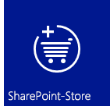
  
    
    
](http://msdn.microsoft.com/library/d15a74a7-3c10-485a-9885-7ef11aaa0d90%28Office.15%29.aspx) [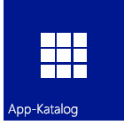
  
    
    
](http://msdn.microsoft.com/library/d15a74a7-3c10-485a-9885-7ef11aaa0d90%28Office.15%29.aspx)
  
    
    

## Vertrautes Programmierungsmodell, das Webstandards verwendet

Mit SharePoint 2013 kann jeder Webentwickler, auch jene, die auf Nicht-Microsoft-Plattformstapeln arbeiten, SharePoint-Lösungen erstellen. Dies ist möglich, da SharePoint 2013 auf den üblichen Webstandards wie HTML, CSS und JavaScript basiert. Die Implementierung stützt sich außerdem auf eingeführte Protokolle wie OData und OAuth.
  
    
    
 [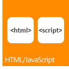
  
    
    
](http://msdn.microsoft.com/library/cd1eda9e-8e54-4223-93a9-a6ea0d18df70%28Office.15%29.aspx) [
  
    
    
](using-odata-sources-with-business-connectivity-services-in-sharepoint-2013.md) [
  
    
    
](get-to-know-the-sharepoint-2013-rest-service.md) [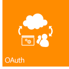
  
    
    
](http://msdn.microsoft.com/library/bde5647a-fff1-4b51-b67b-2139de79ce4a%28Office.15%29.aspx)
  
    
    

## Entwicklungstools

Die aktuelle Version zeigt die enormen Schritte, die für die Optimierung der vorhandenen Entwicklungstools wie Visual Studio und SharePoint Designer unternommen wurden. Daneben wurde auch das neu entwickelte webbasierte Tool Napa Office 365-Entwicklungstools zur Entwicklung von Add-Ins bereitgestellt. Mit dem neuen vereinheitlichten Projektsystem Visual Studio können Sie SharePoint-Add-Ins, Office-Add-Ins und SharePoint-Add-Ins entwickeln, die Office-Add-Ins oder Office-Add-Ins beinhalten, welche von SharePoint gehostet werden. Zusätzlich zu den SharePoint-Projektvorlagen aus früheren Versionen enthält Visual Studio 2012 nun eine neue Add-In-Projektvorlage im Ordner „Add-Ins" namens Add-Ins für SharePoint 2013. Dem Fenster „Eigenschaften" und den Eigenschaftenseiten wurden einige neue Eigenschaften zur Unterstützung von SharePoint-Add-In-Projekten hinzugefügt. Weitere Verbesserungen betreffen umfassende Unterstützung der Entwicklung des Cloud-Add-In-Modells, einschließlich OData- und OAuth-Unterstützung, sowie umfassende Unterstützung der Workflow-Manager-Client 1.0-Plattformentwicklung.
  
    
    
 [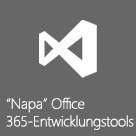
  
    
    
](http://msdn.microsoft.com/library/82a3645c-0911-4926-9176-236ac8d28bdd%28Office.15%29.aspx) [
  
    
    
](http://msdn.microsoft.com/library/e00dc63f-b4a4-4c08-b058-729fcb09af41%28Office.15%29.aspx) [
  
    
    
](workflow-development-in-sharepoint-designer-and-visio.md)
  
    
    

## Kernplattformverbesserungen

SharePoint 2013 wurde für die Unterstützung der neuen cloudbasierten Architektur und des app-gesteuerten Entwicklungsframework umfassend verbessert und optimiert. Angefangen bei den SharePoint-APIs auf der untersten Ebene, über Konnektivität bis hin zu Integration sozialer Medien ist SharePoint 2013 dafür ausgelegt, eine komplette Anwendungsentwicklungsumgebung zu unterstützen. Neben der Verwendung von REST-Endpunkten (Representational State Transfer) für Webdienste, gibt es auch eine neue API für die Server- und die Cliententwicklung. Remoteereignisempfänger werden jetzt auch neben dem clientseitigen Rendering unterstützt. 
  
    
    
 [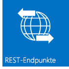
  
    
    
](e1ff2979-1c16-4cb0-a57e-9168dfe20a7c.md) [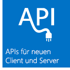
  
    
    
](choose-the-right-api-set-in-sharepoint-2013.md) [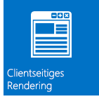
  
    
    
](how-to-customize-a-field-type-using-client-side-rendering.md) [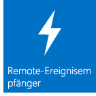
  
    
    
](http://msdn.microsoft.com/library/c050d056-8548-4496-a053-016779d723d9%28Office.15%29.aspx)
  
    
    

## Mobilität

SharePoint 2013 ermöglicht Ihnen, Windows Phone 7-Anwendungen mit lokalen SharePoint-Diensten und -Anwendungen bzw. mit in der Cloud ausgeführten Remote-SharePoint-Diensten und -Anwendungen (wie jene, die SharePoint Online verwenden) zu kombinieren, um leistungsfähige Anwendungen zu entwickeln, deren Funktionalität über die herkömmlichen Desktop- oder Laptopfunktionen hinausgehen und eine wirklich mobile und leichter zugängliche Umgebung schaffen. Die neuen Mobilitätsfeatures in SharePoint 2013 bauen auf vorhandenen Microsoft-Tools und -Technologien auf, wie SharePoint, Windows Phone 7, Visual Studio und Microsoft Silverlight. Sie können SharePoint-unterstützte mobile Anwendungen für Windows Phone mit dem neuen SharePoint Phone-Anwendungsassistenten Visual Studio für einfache listenbasierte mobile Anwendungen erstellen. Sie können die neuen Features aus SharePoint 2013, wie den Geolocation-Feldtyp, integrieren und Mitteilungen von SharePoint Server mit Push auf Ihre mobilen Anwendungen übertragen.
  
    
    
 [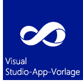
  
    
    
](overview-of-windows-phone-sharepoint-2013-application-templates-in-visual-studio.md) [
  
    
    
](how-to-configure-and-use-push-notifications-in-sharepoint-2013-apps-for-windows.md) [
  
    
    
](integrating-location-and-map-functionality-in-sharepoint-2013.md)
  
    
    

## Soziale Funktionen und Zusammenarbeit

Neue und verbesserte Features für soziale Funktionen und Zusammenarbeit erleichtern den Benutzern die Kommunikation, damit sie immer auf dem Laufenden sind. Der verbesserte soziale Meine Website-Feed verbindet Menschen und lässt sie Inhalte tauschen. Das neue Feature Communitywebsite stellt den Benutzern eine reichhaltige Communityumgebung bereit, in der sie nicht nur schnell Informationen finden und teilen können, sondern auch auf Menschen mit gleichen Interessen treffen.
  
    
    
 [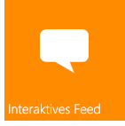
  
    
    
](work-with-social-feeds-in-sharepoint-2013.md) [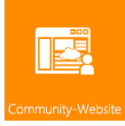
  
    
    
](what-s-new-for-developers-in-social-and-collaboration-features-in-sharepoint-201.md#bkmk_Collab) [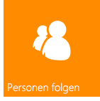
  
    
    
](follow-people-in-sharepoint-2013.md) [
  
    
    
](follow-content-in-sharepoint-2013.md)
  
    
    

## Suche

Die Suchfunktion in SharePoint 2013 enthält mehrere Verbesserungen, kundenspezifische Inhaltsverarbeitung mit dem Webdienst für Inhaltserweiterung und ein neues Framework für die Darstellung der Suchergebnistypen. Außerdem wurde bedeutende Verbesserungen bei der Sprache der Schlüsselwortabfrage (KQL) eingeführt.
  
    
    
 [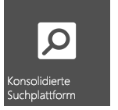
  
    
    
](custom-content-processing-with-the-content-enrichment-web-service-callout.md) [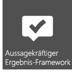
  
    
    
](what-s-new-in-sharepoint-2013-search-for-developers.md) [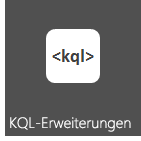
  
    
    
](building-search-queries-in-sharepoint-2013.md)
  
    
    

## Workflows

Workflow-Manager-Client 1.0 ist eine neu entworfene Workflowinfrastruktur, basierend auf Windows Workflow Foundation 4. Sie bringt dem Workflowauthoring in SharePoint 2013 mehr Leistungsstärke und Flexibilität. In einer vollständig deklarierten Authoringumgebung können IT-Arbeiter mit SharePoint Designer 2013 leistungsstarke Workflows nutzen. Mit einer Reihe neuer Visual Studio 2012-Workflowprojektvorlagen greifen Entwickler auf intelligentere Features, wie benutzerdefinierte Aktionen, zu. Der wichtigste Punkt aber ist, Workflow-Manager-Client 1.0 ist vollständig mit Modell für SharePoint-Add-Ins integriert. Workflows werden nicht in SharePoint ausgeführt, sondern in der Cloud. Dies bietet enorme Flexibilität bei der Entwicklung von workflowbasierten SharePoint-Add-Ins.
  
    
    
 [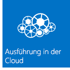
  
    
    
](what-s-new-in-workflows-for-sharepoint-2013.md) [
  
    
    
](sharepoint-2013-workflow-fundamentals.md) [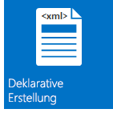
  
    
    
](workflow-development-in-sharepoint-designer-and-visio.md) [
  
    
    
](develop-sharepoint-2013-workflows-using-visual-studio.md)
  
    
    

## Enterprise Content Management

In SharePoint 2013 können Sie jetzt .NET-Client, Silverlight, Windows Phone und JavaScript APIs zusätzlich zu der erweiterten Gruppe von .NET-Server-verwalteten APIs verwenden, Um ECM-Bedienerfreundlichkeit und -Verhalten (Enterprise Content Management) anzupassen.
  
    
    
 [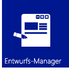
  
    
    
](what-s-new-with-sharepoint-2013-site-development.md) [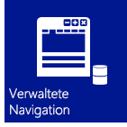
  
    
    
](managed-navigation-in-sharepoint-2013.md) [
  
    
    
](cross-site-publishing-in-sharepoint-2013.md) [
  
    
    
](ediscovery-in-sharepoint-2013.md)
  
    
    

## Business Connectivity Services

Business Connectivity Services (BCS) ermöglicht SharePoint, auf Daten aus externen Systemen, wie SAP, ERP und CRM, zuzugreifen, zusätzlich zu anderen datengesteuerten Anwendungen, die über WCF-Dienste oder OData-Endpunkte dargestellt werden. BCS in SharePoint 2013 wurde in vielfacher weise geändert und verbessert. Dazu zählen auch OData-Konnektivität, externe Ereignisse, externe Daten in Add-Ins, Filterung und Sortierung, REST-Unterstützung und anderes mehr.
  
    
    
 [
  
    
    
](using-odata-sources-with-business-connectivity-services-in-sharepoint-2013.md) [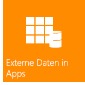
  
    
    
](add-in-scoped-external-content-types-in-sharepoint-2013.md) [
  
    
    
](external-events-and-alerts-in-sharepoint-2013.md)
  
    
    

## Anwendungsdienste

SharePoint Server 2013 beinhaltet mehrere Dienste für eine Interaktion mit Daten auf Ihren SharePoint-Websites. Neu ist der Maschinelle Übersetzungsdienst für SharePoint, der Websites, Dokumente und Streams für einen mehrsprachigen Support übersetzt. SharePoint Server 2013 beinhaltet auch Access Services sowie ein neues Datenzugriffsmodell. Für eine Konvertierung von Dateien und Streams in andere Formate verfügt SharePoint Server 2013 über Word Automation Services und PowerPoint Automation Services (ein neues Feature für SharePoint). SharePoint hat auch Datenanalysewerkzeuge, wie PerformancePoint-Dienste und Visio Services, die Business Intelligence fördern. SharePoint führt außerdem noch leistungsstarke neue Features in Excel Services ein.
  
    
    
 [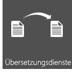
  
    
    
](machine-translation-services-in-sharepoint-2013.md) [
  
    
    
](powerpoint-automation-services-in-sharepoint-2013.md) [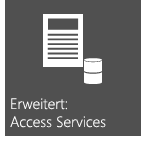
  
    
    
](what-s-new-in-access.md) [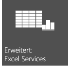
  
    
    
](09e96c8b-cb55-4fd1-a797-b50fbf0f9296.md)
  
    
    

## Zusätzliche Ressourcen

-  [Übersicht über die SharePoint 2013-Entwicklung](sharepoint-2013-development-overview.md)
    
  
-  [Entwickeln von Add-Ins für SharePoint](http://msdn.microsoft.com/library/71ddde4b-fac4-4d8c-aa2e-524f9c2c4c99%28Office.15%29.aspx)
    
  
-  [SharePoint-Add-Ins im Vergleich zu SharePoint-Lösungen](sharepoint-add-ins-compared-with-sharepoint-solutions.md)
    
  
-  [Auswählen des richtigen API-Satzes in SharePoint 2013](choose-the-right-api-set-in-sharepoint-2013.md)
    
  
-  [Barrierefreiheit in SharePoint 2013](accessibility-in-sharepoint-2013.md)
    
  

