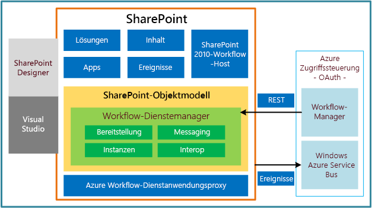

# Neuerungen in Workflows für SharePoint 2013
Hier erhalten Sie Informationen zu den neuen Features für Workflows in SharePoint 2013.
Das Workflow-Framework in SharePoint 2013 hat sich gegenüber früheren Versionen erheblich geändert. Die folgenden Abschnitte bieten kurze Zusammenfassungen zu den wichtigsten Updates und Verbesserungen an der Workflowinfrastruktur.
  
    
    

## Vollständig neu gestaltete Workflowinfrastruktur

SharePoint 2013-Workflows werden von Windows Workflow Foundation 4 (WF) unterstützt, das in Vergleich zu früheren Versionen erheblich überarbeitet wurde. Windows Workflow Foundation basiert wiederum auf der von  [Windows Communication Foundation (WCF)](http://msdn.microsoft.com/de-de/netframework/aa663324) bereitgestellten Messaging-Funktion.
  
    
    
Das wahrscheinlich bedeutendste Feature der neuen Workflowinfrastruktur ist die Einführung von Microsoft Azure als neuer Host für die Workflowausführung. Das Workflowausführungsmodul befindet sich jetzt außerhalb von SharePoint in Microsoft Azure. Abbild 1 zeigt eine verallgemeinerte Ansicht der neuen Workflowinfrastruktur. Ausführlichere Informationen zu den in Abbildung 1 präsentierten Konzepten finden Sie unter  [Grundlegendes zu SharePoint 2013-Workflows](sharepoint-2013-workflow-fundamentals.md).
  
    
    

**Abbildung 1. Allgemeine Architektur der Workflowinfrastruktur**

  
    
    

  
    
    

  
    
    

  
    
    

  
    
    

## Vollständig deklarative Erstellungsumgebung ohne Code

Eine weitere bedeutende Änderung besteht darin, dass Workflows auf der WF 4-Plattform vollständig deklarativ sind. Das bedeutet, dass Workflows nicht länger zu verwalteten Assemblys kompiliert und in einem Assembly-Cache bereitgestellt werden. Stattdessen definieren XAML-Dateien Ihre Workflows und legen ihre Ausführung fest.
  
    
    

## Erweiterte Unterstützung der SharePoint Designer 2013-Erstellung

SharePoint Designer 2013 wurde mit dem Ziel aktualisiert, es für die Erstellung von SharePoint-Workflows zur gewünschten Erstellungsumgebung zu machen. SharePoint Designer 2013 bietet Workflowautoren sowohl eine Designeroberfläche als auch eine textbasierte Erstellungsumgebung für Workflows. Zusätzlich können Sie für Workflows benutzerdefinierte Aktionen in Visual Studio 2012 entwickeln und diese dann in SharePoint Designer 2013 importieren, wo dann Workflow-Designer darauf zugreifen kann.
  
    
    
Kurz gesagt, wurden die Anforderungen der Information-Worker ("Hauptbenutzer") und der Entwickler in den Umgebungen zur SharePoint-Workflowerstellung und -entwicklung genutzt.
  
    
    

## Unterstützung des Visual Studio 2012-Workflowprojekttyps

Um die Zusammenarbeit von Information-Worker und Softwareentwickler zu vereinfachen, bietet Visual Studio 2012 die SharePoint-Workflowprojekttypen und einen benutzerdefinierten Aktionselementtyp für Workflows. Weitere Informationen zum Entwickeln von Workflows mithilfe von Visual Studio 2012 sowie Informationen zur Unterscheidung von SharePoint Designer 2013 und Visual Studio 2012 bei der Workflowentwicklung finden Sie unter  [Entwickeln von SharePoint 2013-Workflows mit Visual Studio](develop-sharepoint-2013-workflows-using-visual-studio.md).
  
    
    

## Unterstützung für das Erstellen benutzerdefinierter Aktionen

In die Vorhersage der Geschäftsanforderungen von Workflowautoren für die Bereitstellung von Workflowvorlagen, Aktionen und Aktivitäten in SharePoint Designer 2013 und in Visual Studio 2012 wurde viel Arbeit gesteckt. Dennoch können wir nicht die spezifischen Anforderungen jeder einzelnen Person vorhersagen. Aus diesem Grund bietet Visual Studio 2012 einen benutzerdefinierten Aktionselementtyp für Workflows, mit dem Entwickler benutzerdefinierte Aktionen erstellen können. Weitere Informationen zu benutzerdefinierte Aktionen für Workflows finden Sie unter  [Vorgehensweise: Erstellen und POST von benutzerdefinierten Workflowaktionen](how-to-build-and-deploy-workflow-custom-actions.md).
  
    
    

## Unterstützung von Tools für SharePoint-Workflows

Visual Studio 2012 bietet Vorlagen und Unterstützung für das Erstellen von Workflows für das SharePoint 2013-Workflow-Framework. SharePoint 2013-Workflows ähneln früheren Versionen von Workflows, allerdings werden Sie von WF 4 unterstützt und in Microsoft Azure ausgeführt. Außerdem sind sie rein deklarativ (XAML) und für die Interaktion mit der Cloud sowie für die Arbeit mit SharePoint-Add-Ins konzipiert. Einer ihrer Hauptvorteile besteht darin, dass Sie es Ihnen ermöglichen, Workflows außerhalb von SharePoint Server remote zu hosten und auszuführen.
  
    
    

## Neue Workflowaktionen

Nachfolgend sind die neuen Workflowaktionen aufgeführt, die in SharePoint 2013 bereitgestellt werden. Ausführliche Informationen zu neuen und überholten Aktionen finden Sie unter  [Workflowaktions- und -aktivitätenreferenz für SharePoint 2013](workflow-actions-and-activities-reference-for-sharepoint-2013.md). Neu für Workflows in SharePoint 2013 sind eine Reihe von Workflowaktionen, die Ihnen die Integration mit Project 2013 und die Erstellung projektbasierter Workflows gestatten.
  
    
    

**Tabelle 1. Neue Workflowaktionen in SharePoint 2013**

|**Aktion**|**Beschreibung**|
|:-----|:-----|
|Aufgabe zuweisen    |Weist eine einzelne Workflowaufgabe zu einem Benutzer oder einer Gruppe zu.    |
|Aufgabenprozess starten    |Startet die Ausführung eines Aufgabenprozesses.    |
|Zu dieser Phase wechseln    |Gibt die nächste Phase in einem Workflow an, an welche die Ablaufsteuerung übergeben werden sollte.    |
|HTTP-Webdienst aufrufen    |Dient als Methodenaufruf für einen REST-Endpunkt (Representational State Transfer).    |
|Listenworkflow starten    |Startet einen listenbezogenen Workflow.    |
|Website-Workflow starten    |Startet einen websitebezogenen Workflow.    |
|DynamicValue erstellen    |Erstellt eine neue Variable vom Typ **DynamicValue**.    |
|Eigenschaft von DynamicValue abrufen    |Ruft einen Eigenschaftswert von einer angegebenen Variablen vom Typ **DynamicValue** ab.   |
|Elemente in DynamicValue zählen    |Gibt die Anzahl der Zeilen in einer Variablen vom Typ **DynamicValue** zurück.   |
|Zeichenfolge kürzen    |Entfernt alle führenden und nachfolgenden Leerzeichen aus der aktuellen Zeichenfolge.    |
|Teilzeichenfolge in Zeichenfolge suchen    |Gibt den auf 1 basierenden Index für das erste Vorkommen eines oder mehrerer Zeichen oder das erste Vorkommen einer Zeichenfolge innerhalb einer Zeichenfolge zurück.    |
|Teilzeichenfolge in Zeichenfolge ersetzen    |Gibt eine neue Zeichenfolge zurück, in der alle Vorkommen eines angegebenen Zeichens oder einer Zeichenfolge durch ein anderes angegebenes Zeichen oder durch eine Zeichenfolge ersetzt werden.    |
|Dokument übersetzen    |Funktioniert als Wrapper für die HTTP-Aktivität, die die synchrone Übersetzungs-API aufruft. Sie müssen eine maschinelle Übersetzungsdienstanwendung für die SharePoint-Website konfigurieren, für die Sie den Workflow ausführen.    |
|Workflowstatus festlegen    |Aktualisiert den Workflowstatus gemäß der Meldungszeichenfolge.    |
|Projekt aus aktuellem Element erstellen [Microsoft Project]    |Erstellt auf Basis des aktuellen Elements ein Project Server-Projekt.    |
|Aktuellen Projektphasenstatus auf diesen Wert festlegen [Microsoft Project]    |Legt die beiden Statusfelder innerhalb der aktuellen Phase des Projekts fest.    |
|Statusfeld im Ideenlistenelement auf diesen Wert festlegen [Microsoft Project]    |Aktualisiert das Statusfeld des ursprünglichen SharePoint-Listenelements.    |
|Auf Projektereignis warten [Microsoft Project]    |Hält die aktuelle Instanz des Workflows an, um auf ein angegebenes Projektereignis zu warten: Projekt wurde eingecheckt, Projekt wurde bestätigt, Projekt wurde übermittelt.    |
|Dieses Feld im Projekt auf diesen Wert festlegen [Microsoft Project]    |Legt den Wert für das unternehmensspezifische Feld für ein angegebenes Projekt fest.    |
   

## Zusätzliche Ressourcen

-  [Erste Schritte mit Workflows in SharePoint 2013](get-started-with-workflows-in-sharepoint-2013.md)
    
  
-  [Neuerungen für Entwickler in SharePoint 2013](what’s-new-for-developers-in-sharepoint-2013.md)
    
  
-  [Workflowaktions- und -aktivitätenreferenz für SharePoint 2013](workflow-actions-and-activities-reference-for-sharepoint-2013.md)
    
  
-  [Kurzübersicht zu Workflowaktionen (SharePoint 2013-Workflowplattform)](workflow-actions-quick-reference-sharepoint-2013-workflow-platform.md)
    
  

