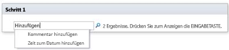

# Kurzübersicht zu Workflowaktionen (SharePoint 2010-Workflowplattform)
Learn about the workflow actions that are available in the SharePoint 2010 Workflow Platform in Microsoft SharePoint Designer 2013.Verwenden Sie diesen Artikel  *nur*  , wenn Sie in SharePoint Designer 2013 arbeiten, weiterhin jedoch die SharePoint 2010-Workflowplattform verwenden möchten.Wenn Sie stattdessen die SharePoint 2013-Workflowplattform verwenden möchten, finden Sie unter  [Kurzübersicht zu Workflowaktionen (SharePoint 2013-Workflowplattform)](workflow-actions-quick-reference-sharepoint-2013-workflow-platform.md) und weiteren im Abschnitt „Weitere Ressourcen" aufgeführten Artikeln Informationen zu neuen Funktionen, die in der neueren Plattformversion zur Verfügung stehen.Wählen Sie zum Erstellen eines Workflows mithilfe der 2010-Workflowplattform im Dialogfeld **Workflow erstellen** im Feld **Plattformtyp** **SharePoint 2010-Workflow** aus.
## Anzeigen der Workflowaktionen

Es gibt zwei Möglichkeiten, um auf das Menü mit verfügbaren Workflowaktionen zuzugreifen.
  
    
    
Führen Sie eine der folgenden Aktionen beim Bearbeiten in einem Workflowschritt aus:
  
    
    

- Klicken Sie auf der Registerkarte **Workflow** in der Gruppe **Einfügen** auf **Aktionen**.
    
  
- Doppelklicken Sie in einem Workflowschritt. Geben Sie in dem angezeigten Suchfeld den Text ein, der im Namen der benötigten Aktion anzeigt wird (z. B. „hinzufügen"), und drücken Sie dann EINGABE.
    

  

  

  
Die beim Erstellen eines Workflows verfügbaren Aktionen sind vom Kontext abhängig. Die Aktionen **Genehmigungsvorgang starten** und **Feedbackvorgang starten** sind für auf Microsoft SharePoint Foundation 2013 basierende Websites nicht verfügbar. Einige Listenaktionen sind nur in einem Identitätswechselschritt verfügbar, andere sind nur verfügbar, wenn der Workflow einer Dokumentbibliothek oder einem Dokumentinhaltstyp zugeordnet ist. Listenaktionen für das aktuelle Element wie **Status für die Genehmigung von Inhalten festlegen** und **Feld im aktuellen Element festlegen** sind in einem Websiteworkflow nicht verfügbar.
  
    
    
Aktionen werden basierend auf dem Anwendungsbereich in einem Workflow in zwei Kategorien unterteilt. Aktionen, die das Verhalten eines Elements beeinflussen, werden beispielsweise unter **Listenaktionen**, Aktionen, die Dokumentenmappen beeinflussen, unter **Dokumentenmappenaktionen** und benutzerdefinierte Workflowaktionen unter **Benutzerdefinierte Aktionen** aufgeführt. Die Kategorien für Aktionen sehen wie folgt aus:
  
    
    

- Kernaktionen
    
  
- Dokumentenmappenaktionen (nur verfügbar, wenn der Workflow einer Dokumentbibliothek oder einem Dokumentinhaltstyp zugeordnet ist)
    
  
- Listenaktionen
    
  
- Relationale Aktionen (nur verfügbar, wenn die SharePoint-Website mit SharePoint Server 2013 ausgeführt wird)
    
  
- Aufgabenaktionen (nur verfügbar, wenn die SharePoint-Website mit SharePoint Server 2013 ausgeführt wird)
    
  
- Aufgabenverhaltensaktionen (nur verfügbar, wenn Aufgaben in integrierten Workflowaktionen angepasst werden, z. B. **Genehmigungsvorgang starten** und **Feedbackvorgang starten**)
    
  
- Hilfsaktionen
    
  
- Benutzerdefinierte Aktionen
    
  

## Allgemeine Aktionen

Allgemeine Aktionen sind Aktionen, die in allen Workflowkontexten in der Aktionenliste angezeigt werden.
  
    
    

****

|**Aktion**|**Beschreibung**|
|:-----|:-----|
|**Kernaktionen**   |Die zu dieser Kategorie zählenden Aktionen stellen die am häufigsten verwendeten Aktionen in Workflows dar.    |
|Hinzufügen eines Kommentars    | Diese Aktion wird zunächst in einem Workflowschritt als **Kommentar: Kommentartext** angezeigt. Mit dieser Aktion können Sie informative Kommentare im Workflow-Designer für Referenzzwecke hinzufügen. Dies ist vor allem dann hilfreich, wenn andere Benutzer an dem Workflow mitarbeiten. Wenn eine Variable im aktuellen Workflow beispielsweise keinen Anzeigenamen hat, können Sie mit dieser Aktion einen Kommentar mit einem Hinweis auf die Funktion der Variablen im Workflow hinzufügen.    Im Folgenden finden Sie ein Beispiel dazu, wie die Aktion in einem Workflowschritt aussieht:    Kommentar: Diese Variable stellt die Abteilung des Workflowinitiators bereit.   > **HINWEIS**>  Jeder Benutzer, der den Workflow in Microsoft Visio 2013 bearbeitet, kann die Kommentare sehen.          |
|Hinzufügen der Zeit zum Datum    | Diese Aktion wird zunächst in einem Workflowschritt als **0 Minuten zum Datum hinzufügen (Ausgabe für Variable: Datum)** angezeigt. Mit dieser Aktion können Sie eine bestimmte Anzahl von Minuten, Stunden, Tagen, Monaten oder Jahren zu einem Datumswert hinzufügen, und den Ausgabewert in einer Variablen speichern. Der Datumswert, zu dem die Zeit hinzugefügt wird, kann das aktuelle Datum, ein bestimmtes Datum oder ein Suchergebnis sein.    Im Folgenden finden Sie ein Beispiel dazu, wie die Aktion in einem Workflowschritt aussieht:    Add7days toCurrent Item:Modified (Output to:Variable: A week from Modified)    |
|Ausführen der Berechnung    | Diese Aktion wird zunächst in einem Workflowschritt als **Wert plus Wert berechnen (Ausgabe für Variable: berechnen)** angezeigt. Mit dieser Aktionen können Sie eine Berechnung unter Verwendung von zwei Werten ausführen, und den Ausgabewert in einer Variablen speichern. Mögliche Berechnungen umfassen die Addition, Subtraktion, Multiplikation und Division.    Im Folgenden finden Sie Beispiele dazu, wie die Aktion in einem Workflowschritt aussieht:    Calculate36divided by9 (Output toVariable:Number of Widgets)     Calculate [fx :: Courses*, Filled Seats] plus 1 (Output to Variable: New Filled Seats)   |
|Protokollieren in Verlaufsliste    | Diese Aktion wird zunächst in einem Workflowschritt als **Diese Nachricht in der Workflow-Verlaufsliste protokollieren** angezeigt. Mit dieser Aktion können Sie eine Nachricht in der Workflow-Verlaufsliste zu Workflowaktionen und -Fortschritt protokollieren. Die Nachricht kann eine Zusammenfassung eines Workflowereignisses oder etwas anderes darstellen, das Sie über den aktuellen Ablauf des Workflows erfassen möchten. Nachrichten dieser Art können bei der Workflowfehlerbehebung hilfreich sein. Sie können z. B. eine Nachricht protokollieren, die Ereignisse wie **In Liste A kopiert** oder **E-Mail an Prüfer gesendet** erfasst. Nach erfolgreichem Abschluss des Workflows können Sie zur Liste **Workflow-Verlauf** wechseln, und die in der Spalte **Beschreibung** angezeigten Nachrichten sehen.    Im Folgenden finden Sie ein Beispiel dazu, wie die Aktion in einem Workflowschritt aussieht:   Variablen für Eine Woche seit Bearbeitung in der Workflow-Verlaufsliste protokollieren   > **HINWEIS**>  Wenn Sie eine Aktion benötigen, die den Workflow beendet und dann eine Nachricht in der Verlaufsliste protokolliert, verwenden Sie stattdessen die Aktion **Workflow beenden**.           |
|Anhalten für bestimmte Dauer    |Diese Aktion wird zunächst in einem Workflowschritt als **Für 0 Tage, 0 Stunden, 5 Minuten anhalten** angezeigt. Mit dieser Aktion können Sie den Workflow für eine bestimmte in Tagen, Stunden und Minuten angegebene Dauer anhalten.   > **HINWEIS**> Die zunächst angezeigte Verzögerungszeit spiegelt das Zeitgeberauftragsintervall wider, das einen Standardwert von fünf Minuten hat.           |
|Anhalten bis zum Datum    | Diese Aktion wird zunächst in einem Workflowschritt als **Bis zu dieser Zeit anhalten** angezeigt. Mit dieser Aktion können Sie den Workflow bis zu einem bestimmten Datum anhalten. Sie können das aktuelle Datum, ein bestimmtes Datum oder ein Suchergebnis verwenden.    Im Folgenden finden Sie Beispiele dazu, wie die Aktion in einem Workflowschritt aussieht:    Bis1.01.2010 12:00:00 anhalten    BisVariable: Eine Woche seit Bearbeitung anhalten   |
|Senden einer E-Mail    | Diese Aktion wird zunächst in einem Workflowschritt als **E-Mails an diese Benutzer senden** angezeigt. Mit dieser Aktion können Sie eine E-Mail-Nachricht an einen Benutzer oder eine Gruppe senden. Sie wird in der Regel zum Senden einer Bestätigungsnachricht an Workflowteilnehmer verwendet. E-Mail-Empfänger können ein Benutzer oder eine Gruppe in einer Websitesammlung sein, oder jemand außerhalb Ihrer Organisation. Sie können nun einen dynamischen Wert wie eine Suche oder eine Zeichenfolge im Betreff angeben.   > **WICHTIG**>  Ausgehende E-Mails müssen in der SharePoint-Zentraladministration konfiguriert werden.           Im Folgenden finden Sie ein Beispiel dazu, wie die Aktion in einem Workflowschritt aussieht:    E-Mail anVariable: genehmigende Personen senden.   |
|Festlegen der Zeitspanne für das Feld „Datum/Uhrzeit    | Diese Aktion wird zunächst in einem Workflowschritt als **Zeit auf 00:00 für Datum (Ausgabe für Variabe: date1) festlegen** angezeigt. Mit dieser Aktion können Sie einen Zeitstempel erstellen, und den Ausgabewert in einer Variablen speichern. Sie können die Zeit in Stunden und Minuten angeben, und das aktuelle Datum, ein bestimmtes Datum oder das Suchergebnis hinzufügen. Beispiel: Sie möchten einen Zeitstempel für jeden neuen Kundenauftrag hinzufügen, der zu einer Auftragsliste hinzugefügt wird. Anstelle der aktuellen Uhrzeit, zu der der Auftrag in dem Zeitstempel empfangen wurde, möchten Sie eine bestimmte Uhrzeit hinzufügen, damit der Workflow einen Vorgang (z. B. Routingaufträge für das Warenlager) für alle neuen Elemente mit dem gleichen Zeitstempel ausführt. Weiteres Beispiel: Angenommen Sie haben eine Präsentation um 9:00 Uhr an einem bestimmten Tag, und möchten eine Erinnerung per E-Mail erhalten. Mit dieser Aktion können Sie die Uhrzeit zum Datum hinzufügen, den Workflow bis zu einem Tag vor der Präsentation anhalten, und dann eine Erinnerung vom Workflow erhalten.    Im Folgenden finden Sie ein Beispiel dazu, wie die Aktion in einem Workflowschritt aussieht:    Set time as00: 00 forCurrent Item:Modified (Output toModified time variable set to midnight)    |
|Festlegen des Workflowstatus    | Diese Aktion wird zunächst in einem Workflowschritt als **Workflowstatus auf „Abgebrochen" festlegen** angezeigt. Mit dieser Aktion können Sie den Status des Workflows festlegen. Standardoptionen sind „Abgebrochen", „Bestätigt" und „Abgelehnt".    Wenn Sie einen neuen Statuswert in der Dropdownliste in der Aktion eingeben, wird der neue Status automatisch zu der Dropdownliste für die weitere Verwendung hinzugefügt. Beispiel: Sie möchten einen benutzerdefinierten Status wie **Spesenabrechnung genehmigt** hinzufügen, der benutzerfreundlicher und informativer als **Abgeschlossen** oder **Abgebrochen** ist.   > **HINWEIS**>  Sie können einen benutzerdefinierten Statuswert nicht umbenennen oder löschen, nachdem dieser erstellt wurde. Allerdings müssen Sie diesen nicht verwenden.>  Ein benutzerdefinierter Status ist nur für den aktuellen Workflow anwendbar und kann nicht in einem anderen Workflow verwendet werden.>  Ein Workflow kann benutzerdefinierte in der Aktion definierte Statuswerte nicht verwenden, wenn die Aktion in einem Identitätswechselschritt verwendet wird.           Wenn die Aktion **Workflowstatus festlegen** der letzte Schritt in einem Workflow war, in der auch ein benutzerdefinierter Wert verwendet wurde, wird der benutzerdefinierte Wert in der Spalte **Status** in der Liste angezeigt, wenn der Workflow angehalten oder abgeschlossen ist.    Im Folgenden finden Sie ein Beispiel dazu, wie die Aktion in einem Workflowschritt aussieht:    Workflowstatus aufSpezifikationsstatus: Bereit für Entwurfsüberprüfung festlegen   |
|Festlegen der Workflow-Variablen    | Diese Aktion wird zunächst in einem Workflowschritt als **Workflow-Variable auf Wert festlegen** angezeigt. Mit dieser Aktion können Sie Wertdaten einer Workflow-Variablen zuweisen.    Im Folgenden finden Sie ein Beispiel dazu, wie die Aktion in einem Workflowschritt aussieht:   Variable: Spesenabrechnung gesamt auf Aktuelles Element: Gesamt festlegen   |
|**Listenaktionen**   |Aktionen in dieser Kategorie führen Vorgänge zu Listenelementen durch.    > **HINWEIS**> Einige Aktionen in dieser Kategorie erscheinen nicht in allen Workflowkontexten. Einige Listenaktionen erscheinen z. B. nur, wenn Sie in einem Identitätswechselschritt in Ihrem Workflow klicken, während andere nur erscheinen, wenn der Workflow an eine Dokumentbibliothek oder einen Dokumentinhaltstyp angefügt ist. Weitere Informationen finden Sie unter  [Nur innerhalb eines Identitätswechselschritts verfügbare Aktionen](workflow-actions-quick-reference-sharepoint-2010-workflow-platform.md#section7a) und [Verfügbare Aktionen, wenn der Workflow mit einer Dokumentbibliothek oder einem Dokumentinhaltstyp verknüpft ist](workflow-actions-quick-reference-sharepoint-2010-workflow-platform.md#section6) im späteren Verlauf dieses Artikels.          |
|Einchecken eines Elements    | Diese Aktion wird zunächst in einem Workflowschritt als **Element in dieser Liste mit Kommentar einchecken** angezeigt. Mit dieser Aktion können Sie ein Element einchecken, das ausgecheckt ist.    Im Folgenden finden Sie ein Beispiel dazu, wie die Aktion in einem Workflowschritt aussieht:    Element inSpesenabrechnung mit Kommentar:Spesenabrechnung genehmigt einchecken   > **HINWEIS**>  Sie können nur Elemente in Dokumentbibliotheken einchecken.          |
|Auschecken eines Elements    | Diese Aktion wird zunächst in einem Workflowschritt als **Element in der Liste auschecken** angezeigt. Mit dieser Aktion können Sie ein Element auschecken, das eingecheckt ist.    Im Folgenden finden Sie ein Beispiel dazu, wie die Aktion in einem Workflowschritt aussieht:    Element inAktuelles Element auschecken   > **HINWEIS**>  Sie können nur Elemente aus einer Bibliothek auf Ihrer Website auschecken.>  Vor dem Auschecken des Elements überprüft der Workflow zunächst, ob das Element eingecheckt ist.          |
|Kopieren eines Listenelements    | Diese Aktion wird zunächst in einem Workflowschritt als **Element in der Liste in diese Liste kopieren** angezeigt. Mit dieser Aktion können Sie ein Listenelement in eine andere Liste kopieren. (Wenn ein Dokument im Listenelement enthalten ist, kopiert der Workflow das Dokument in die Zielliste.)    Im Folgenden finden Sie ein Beispiel dazu, wie die Aktion in einem Workflowschritt aussieht:    Element inAktuelles Element inArchivanforderungen kopieren   > **WICHTIG**>  Mindestens eine Spalte muss in der Quellliste und der Zielliste vergleichbar sein.          |
|Erstellen eines Listenelements    | Diese Aktion wird zunächst in einem Workflowschritt als **Element in der Liste erstellen (Ausgabe für Variable: erstellen)** angezeigt.    Mit dieser Aktion können Sie ein neues Element mit den angegebenen Informationen erstellen. Sie können beispielsweise eine Ankündigung erstellen, wenn ein wichtiges unternehmensbezogenes Dokument (z. B. ein Vertrag) genehmigt wurde, oder Dokumente archivieren.   > **HINWEIS**>  Die Ausgabevariable ist die ID des neuen in der Liste erstellten Elements.           Im Folgenden finden Sie ein Beispiel dazu, wie die Aktion in einem Workflowschritt aussieht:    Element inAufträge (Ausgabe für Variable: Neue Auftrags-ID) erstellen   |
|Löschen eines Elements    | Diese Aktion wird zunächst in einem Workflowschritt als **Element in der Liste löschen** angezeigt. Mit dieser Aktion können Sie ein Element in einer Liste löschen.    Im Folgenden finden Sie ein Beispiel dazu, wie die Aktion in einem Workflowschritt aussieht:    Element inDokumente löschen   |
|Verwerfen des Auscheckens eines Elements    | Diese Aktion wird zunächst in einem Workflowschritt als **Auschecken eines Elements in der Liste verwerfen** angezeigt. Mit dieser Aktion können Sie ein Element wieder Einchecken, ohne die Änderungen seit dem letzten Auschecken zu übernehmen.    Im Folgenden finden Sie ein Beispiel dazu, wie die Aktion in einem Workflowschritt aussieht:    Auschecken des Elements inDokumente verwerfen   |
|Festlegen des Status für die Genehmigung von Inhalten    | Diese Aktion wird zunächst in einem Workflowschritt als **Status für die Genehmigung von Inhalten auf diesen Status mit Kommentaren festlegen** angezeigt. Mit dieser Aktion können Sie den Status für die Genehmigung von Inhalten auf einen Wert wie **Genehmigt**, **Angelehnt** oder **Ausstehend** festlegen. (Sie können auch einen benutzerdefinierten Status in der Aktion eingeben.)    Im Folgenden finden Sie ein Beispiel dazu, wie die Aktion in einem Workflowschritt aussieht:    Status für die Genehmigung von Inhalten aufGenehmigt mitScheinbar in Ordnung festlegen   > **HINWEIS**>  Die Inhaltsgenehmigung muss in der Liste aktiviert sein, damit diese Aktion funktioniert.           Diese Aktion ist für das Element verfügbar, das derzeit vom Workflow bearbeitet wird, und steht daher in einem Websiteworkflow nicht zur Verfügung.   |
|Festlegen eines Felds im aktuellen Element    | Diese Aktion wird zunächst in einem Workflowschritt als **Feld auf Wert festlegen** angezeigt. Mit dieser Aktion können Sie ein Feld im aktuellen Element auf einen Wert festlegen.    Im Folgenden finden Sie ein Beispiel dazu, wie die Aktion in einem Workflowschritt aussieht:   Inhaltstyp-ID aufSpezifikation festlegen   > **HINWEIS**>  Wenn Sie den Workflow bis zur Änderung des Feldwerts anhalten möchten, verwenden Sie stattdessen die Aktion **Auf Feldänderung im aktuellen Element warten**. >  Die Aktion **Feld im aktuellen Element festlegen** steht nicht zur Verfügung, wenn Sie in einem Websiteworkflow arbeiten.          |
|Aktualisieren eines Listenelements    | Diese Aktion wir zunächst in einem Workflowschritt als **Element in der Liste aktualisieren** angezeigt. Mit dieser Aktion können Sie ein Listenelement aktualisieren. Sie können die Felder und die neuen Werte in diesen Feldern angeben.    Im Folgenden finden Sie ein Beispiel dazu, wie die Aktion in einem Workflowschritt aussieht:    Element inDokumente aktualisieren   |
|Warten auf Feldänderung im aktuellen Element    | Diese Aktion wird zunächst in einem Workflowschritt als **Warten, bis Feld dem Wert entspricht** angezeigt. Mit dieser Aktion wird der Workflow angehalten, bis das angegebene Feld im aktuellen Element auf einen angegebenen Wert geändert wurde.    Im Folgenden finden Sie ein Beispiel dazu, wie die Aktion in einem Workflowschritt aussieht:    Warten, bisGenehmigungsstatus zu1;#Abgelehnt geändert wird.   > **HINWEIS**>  Wenn der Workflow den Feldwert ändern soll, statt auf die Feldänderung zu warten, verwenden Sie stattdessen die Aktion **Feld im aktuellen Element festlegen**.           |
|**Aufgabenaktionen**   |Aktionen in dieser Kategorie beziehen sich auf Aufgabenelemente.    |
|Zuweisen eines Formulars zu einer Gruppe    | Diese Aktion wird zunächst in einem Workflowschritt als **Benutzerdefiniertes Formular diesen Benutzern zuweisen** angezeigt. Mit dieser Aktion können Sie ein benutzerdefiniertes Aufgabenformular erstellen, und das Formular einem oder mehreren Teilnehmern oder Gruppen zuweisen. Teilnehmer stellen ihre Antworten in den Formularfeldern zur Verfügung, und klicken nach Abschluss auf **Aufgabe erledigen**.     Im Folgenden finden Sie ein Beispiel dazu, wie die Aktion in einem Workflowschritt aussieht:   Anlagenberichte zuMarketing zuweisen   > **HINWEIS**>  Es gibt keinen Rückgabewert, der die Aufgabendaten identifiziert.          |
|Zuordnen eines Aufgabenelements    | Diese Aktion wird zunächst in einem Workflowschritt als **Aufgabenelement diesen Benutzern zuweisen** angezeigt. Mit dieser Aktion können Sie eine Aufgabe einem oder mehreren Teilnehmern oder Gruppen zuweisen und sie somit zum Ausführen der Aufgaben und, nach Abschluss, zum Klicken auf die Schaltfläche **Aufgabe erledigen** aufzufordern.    Im Folgenden finden Sie ein Beispiel dazu, wie die Aktion in einem Workflowschritt aussieht:   Spesenabrechnung übermitteln zuMarketing zuweisen   |
|Sammeln von Daten von einem Benutzer    | Diese Aktion wird zunächst in einem Workflowschritt als **Daten von diesem Benutzer sammeln (Ausgabe für Variable: sammeln)** angezeigt. Mit dieser Aktion können Sie eine Aufgabe Teilnehmern zuweisen und sie somit zum Bereitstellen von benötigten Informationen in einem benutzerdefinierten Aufgabenformular und, nach Abschluss der Eingabe, zum Klicken auf die Schaltfläche **Aufgabe erledigen** auffordern.    Diese Aktion hat eine OUTPUT-Klausel, d. h. der Workflow speichert die von dieser Aktion zurückgegebenen Informationen in einer entsprechenden Variable. Die Listenelement-ID des abgeschlossenen Aufgabenelements der Aktion wird in der Variable **sammeln** gespeichert.    Im Folgenden finden Sie ein Beispiel dazu, wie die Aktion in einem Workflowschritt aussieht:   Spesenabrechnung vonMarketing sammeln (Ausgabe fürVariable: Marketingspesenabrechnung)    |
|**Hilfsaktionen**   |Die meisten Aktionen in dieser Kategorie können zum Extrahieren von Informationen aus Textzeichenfolgen verwendet werden.    Sie können eine Textzeichenfolge aufteilen und sie in mehreren unterschiedlichen Szenarios in einem Workflow verwenden. Angenommen Ihr Unternehmen möchte falls eingehenden Dokumente mithilfe eines bestimmten Namenformats wie Datum_Abteilung kennzeichnen (z. B. 07142009_sales.docx), und Sie möchten Workflows ausführen, die einem Prüfer Aufgaben basierend auf dem Datum im Stempel der Datei zuweisen. Dazu können Sie eine Hilfsaktion verwenden, um die ersten acht Zeichen eines Dokumentnamens (07142009) abzurufen, und sie mithilfe von Suchkoersionen in ein Datum umzuwandeln, sodass Aufgaben mit diesem Fälligkeitsdatum zugewiesen werden können.    Weitere Informationen zu Suchkoersionen finden Sie im Abschnitt „Siehe auch".    |
|Extrahieren einer Teilzeichenfolge ab Ende der Zeichenfolge    | Diese Aktion wird zunächst in einem Workflowschritt als **0 Zeichen ab Ende der Zeichenfolge kopieren (Ausgabe für Variable: Teilzeichenfolge)** angezeigt. Mit dieser Aktion können Sie eine bestimmte Anzahl von Zeichen ab Ende der Zeichenfolge kopieren und den Ausgabewert in einer Variablen speichern. Sie können eine Anzahl von Zeichen angeben, die der Workflow aus der Zeichenfolge kopieren soll.    Im Folgenden finden Sie ein Beispiel dazu, wie die Aktion in einem Workflowschritt aussieht:   15 Zeichen ab Ende vonAktuelles Element:Name kopieren (Ausgabe für Variable:Copy15CharFromEndOfName)    |
|Extrahieren einer Teilzeichenfolge aus dem Index der Zeichenfolge    | Diese Aktion wird zunächst in einem Workflowschritt als **Aus Zeichenfolge, beginnend bei 0, kopieren (Ausgabe für Variable: Teilzeichenfolge** angezeigt. Mit dieser Aktion werden alle Zeichen ab einem bestimmten Zeichen in einer Zeichenfolge kopiert und die Ausgabe in einer Variablen gespeichert.    Im Folgenden finden Sie ein Beispiel dazu, wie die Aktion in einem Workflowschritt aussieht:    AusAktuelles Element:Name kopieren, beginnend bei4 (Ausgabe für Variable:CopyStringFromChar4)    |
|Extrahieren einer Teilzeichenfolge ab Beginn der Zeichenfolge    | Diese Aktion wird zunächst in einem Workflowschritt als **0 Zeichen ab Beginn der Zeichenfolge kopieren (Ausgabe für Variable: Teilzeichenfolge)** angezeigt. Mit dieser Aktion können Sie eine bestimmte Anzahl von Zeichen ab Beginn der Zeichenfolge kopieren und die Ausgabe in einer Variablen speichern. Sie können eine Anzahl von Zeichen angeben, die der Workflow aus der Zeichenfolge kopieren soll.    Im Folgenden finden Sie ein Beispiel dazu, wie die Aktion in einem Workflowschritt aussieht:    Copy15 characters from start ofCurrent Item:Name (Output to Variable:Copy15CharFromStartOfName)    |
|Extrahieren einer Teilzeichenfolge der Zeichenfolge anhand des Index mit bestimmter Länge    | Diese Aktion wird zunächst in einem Workflowschritt als **Aus Zeichenfolge 0 Zeichen kopieren, beginnend bei 0 (Ausgabe für Variable: Teilzeichenfolge)** angezeigt. Mit dieser Aktion können Sie eine bestimmte Anzahl von Zeichen ab einem bestimmten Zeichen in einer Zeichenfolge kopieren und die Ausgabe in einer Variablen speichern. Sie können die Anzahl von Zeichen angeben, die der Workflow aus der Zeichenfolge kopieren soll.    Im Folgenden finden Sie ein Beispiel dazu, wie die Aktion in einem Workflowschritt aussieht:    Copy fromCurrent Item:Name, starting at 4 for15 characters (Output to Variable:CopyfromChar4for15CharOfName)    |
|Suchen nach einem Intervall zwischen Datumsangaben    | Diese Aktion wird zunächst in einem Workflowschritt als **Minuten zwischen Datumsangaben ermitteln (Ausgabe für Variable: Zeit** angezeigt. Mit dieser Aktion können Sie den Zeitunterschied in Minuten, Stunden oder Tagen zwischen Datumsangaben berechnen und die Ausgabe in einer Variablen speichern.    Im Folgenden finden Sie ein Beispiel dazu, wie die Aktion in einem Workflowschritt aussieht:    Findminutes betweenCurrentItem:Modified andToday (Output toVariable: Last Modified In Minutes)    |
   

## Verfügbare Aktionen bei der Ausführung Ihrer SharePoint-Website auf SharePoint Server 2013

Aktionen wie z. B. **Genehmigungsvorgang starten**, **Datensatz deklarieren** und **Vorgesetzten eines Benutzers nachschlagen** sind nur verfügbar, wenn Ihre SharePoint-Website auf SharePoint Server 2013 ausgeführt wird.
  
    
    

****

|**Aktion**|**Beschreibung**|
|:-----|:-----|
|**Aktionen für die Dokumentenmappe**   |Aktionen in dieser Kategorie beziehen sich auf eine Dokumentenmappe. Eine Dokumentenmappe ist ein Ordner, indem Dokumente gespeichert werden. In einem Workflow wird eine Dokumentenmappe als einzelnes Element behandelt.    > **HINWEIS**> Damit Sie Dokumentenmappen in Ihrer Bibliothek verwenden können, müssen Sie den Inhaltstyp der Dokumentenmappe von Ihrer Bibliothekseinstellungsseite auf Ihrer SharePoint-Website einfügen.           |
|Starten des Genehmigungsvorgangs für Dokumentenmappen    | Diese Aktion wird in den Workflowschritten anfangs als **Genehmigungsvorgang für den Inhalt dieser Dokumentenmappe mit den in dieser Spalte angegebenen Benutzern starten** angezeigt. Verwenden Sie diese Aktion, um bei einer Dokumentenmappe und allen darin enthaltenen Dokumenten eine Genehmigungsaktion zu starten.    Wenn Sie diese Aktion verwenden, werden der Status der Dokumentenmappe und der Status aller darin enthaltenen Dokumente geändert (z. B. auf Genehmigt oder Abgelehnt).    Wenn Sie andererseits bei der Dokumentenmappe die Aktion **Genehmigungsvorgang starten**verwenden, wird nur der Status der Dokumentenmappe geändert, und nicht der Status der einzelnen darin enthaltenen Dokumente.     Im Folgenden finden Sie ein Beispiel dazu, wie die Aktion in einem Workflowschritt aussieht:    Starten Sie den VorgangStücklistengenehmigung für die Inhalte dieser Dokumentenmappe mit den durch dieVariable: Stücklistengenehmiger angegebenen Benutzern.   |
|Erfassen einer Version der Dokumentenmappe    | Diese Aktion wird in den Workflowschritten anfangs als **eine Version dieser Dokumentenmappe erfassen, die die Typversionen der Inhalte mit dem Kommentar: Kommentar enthält** angezeigt. Verwenden Sie diese Aktion, um die Dokumentenmappe zu sperren, die die Version von Dokumenten enthält, Hauptversion oder Nebenversion, die Sie in der Aktion angeben.    Im Folgenden finden Sie ein Beispiel dazu, wie die Aktion in einem Workflowschritt aussieht:    Erfassen Sie eine Version dieser Dokumentenmappe, die dieletzten Hauptversionen der Inhalte mit dem Kommentar: Letzte Hauptversion der Stückliste   |
|Senden der Dokumentenmappe an das Repository    | Diese Aktion wird in den Workflowschritten anfangs als **Dokumentensatz mithilfe dieser Aktion und dieser Erklärung an diese Zielinhaltsorganisation übermittelt (Ausgabe zur Variable: Dateiergebnis übermitteln)** angezeigt. Verwenden Sie diese Aktion, um eine Dokumentenmappe in ein Dokumentrepository zu verschieben oder zu kopieren. Ein Dokumentrepository kann eine Bibliothek auf Ihrer SharePoint-Website sein oder eine komplette Website (z. B. das Dokumentcenter) sein, die Datensätze anhand von von Ihnen definierten Regeln an einen bestimmten Ort weiterleitet.    Im Folgenden finden Sie ein Beispiel dazu, wie die Aktion in einem Workflowschritt aussieht:    Submit Document Set usingCopy toDocumentRepository:GUID withCopy final bill of Material to repository (Output toVariable: Copy Document Set to repository)    > **HINWEIS**>  Bevor Sie Regeln definieren und Dokumente weiterleiten können, müssen Sie auf Ihrer SharePoint-Website die Funktion **Inhaltsorganisation** aktivieren. Weitere Informationen finden Sie im Thema "Konfigurieren der Inhaltsorganisation zum Weiterleiten von Datensätzen" unter "Siehe auch".          |
|Festlegen des Inhaltsgenehmigungsstatus der Dokumentenmappe    | Diese Aktion wird in den Workflowschritten anfangs als **Inhaltsgenehmigungsstatus für die Inhalte dieser Dokumentenmappe auf diesen Status mit Kommentaren festlegen** angezeigt. Verwenden Sie diese Aktion, um die Inhaltsgenehmigung einer Dokumentenmappe auf **Genehmigt**, **Abgelehnt** oder **Ausstehend** festzulegen.    Im Folgenden finden Sie ein Beispiel dazu, wie die Aktion in einem Workflowschritt aussieht:    Legen Sie den Inhaltsgenehmigungsstatus für die Inhalte dieser Dokumentenmappe mit der "Stückliste ist genehmigt" aufGenehmigt fest   > **HINWEIS**>  Die Inhaltsgenehmigung muss in der Liste aktiviert werden, bevor Sie diese Aktion verwenden können.          |
|**Aufgabenaktionen**   |Aktionen in dieser Kategorie werden in Genehmigungsszenarios verwendet. Es gibt in dieser Kategorie zwei vordefinierte Workflowaktionen: **Genehmigungsvorgang starten** und **Feedbackvorgang starten**. Vordefinierte Aktionen funktionieren wie Teilworkflows, d. h. die Workflowlogik ist bereits in den Aktionen definiert. Dazu müssen Sie nur die entsprechenden Informationen angeben.    Diese Aktionen werden in die global wiederverwendbaren Workflows **Approval-SharePoint 2013** und **Collect Feedback-SharePoint 2013** verwendet, die bei SharePoint Server 2013 enthalten sind. Informationen zu Szenarien, in denen diese Workflows und Aktionen verwendet werden können, finden Sie im Abschnitt [Wann sollten Sie die Genehmigungs- und Feedbackaktionen verwenden?](workflow-actions-quick-reference-sharepoint-2010-workflow-platform.md#section5) dieses Artikels.   Außerdem ist die Option **Benutzerdefinierten Aufgabenvorgang starten** verfügbar, der ebenfalls über eine integrierte Logik verfügt, jedoch fehlt dabei die Definition der Aufgabe des Workflows in jeder Phase (im Gegensatz zu den beiden vorherigen Aktionen).   Die Aktionenkategorie mit der Bezeichnung **Aktionen für das Aufgabenverhalten** wird nur in der Aktionsliste angezeigt, wenn Sie das Verhalten einer Genehmigungsaktion anpassen, z. B. **Element für Genehmigung zuweisen** oder **Element für Feedback zuweisen**. Weitere Informationen zu **Aktionen für das Aufgabenverhalten** finden Sie im Abschnitt [Innerhalb von Aufgabenaktionen verfügbare Aktionen](workflow-actions-quick-reference-sharepoint-2010-workflow-platform.md#section4) dieses Artikels.   |
|Starten des Genehmigungsvorgangs    | Diese Aktion wird anfangs in einem Workflowschritt als **Genehmigungsvorgang zum aktuellen Element mit diesen Benutzern starten** angezeigt. Verwenden Sie diese Aktion, um ein Dokument zur Genehmigung weiterzuleiten. Genehmiger können das Dokument genehmigen oder ablehnen, die Genehmigungsaufgabe neu zuweisen, oder Änderungen an dem Dokument anfordern.    Die Aktion **Genehmigungsvorgang starten** verhält sich wie ein vordefinierter Workflow: die Logik ist bereits in der Aktion definiert. Die Aktion besitzt verschiedene integrierte Phasen zum Definieren von Aufgabenverhalten, Aufgabenvorgangsverhalten, zum Erfassen des Verlaufsprotokolls, für E-Mail-Benachrichtigungen und Bedingungen für die Vollendung. Obwohl die Aktion mit vordefinierter Logik bereitgestellt wird, benötigt Sie dennoch Informationen von Ihnen - z. B. Angaben zu den Prüfern, dazu, ob Genehmigungsaufgaben nacheinander zugewiesen werden ("seriell", Standard) oder alle gleichzeitig ("parallel"), und die Fälligkeitsdaten oder zugelassene Zeiträume zur Fertigstellung von Aufgaben.    Sie können internen und externen Teilnehmern Aufgaben zuweisen. Ein externer Teilnehmer kann ein Mitarbeiter Ihres Unternehmens sein, der kein Benutzer in der Websitesammlung oder jemand außerhalb Ihres Unternehmens ist.    Im Folgenden finden Sie ein Beispiel dazu, wie die Aktion in einem Workflowschritt aussieht:    Starten des VorgangsSpezifikationsgenehmigung zumAktuellen Element mitVariable: Genehmiger   |
|Starten des Feedbackvorgangs    | Diese Aktion wird anfangs in einem Workflowschritt als **Feedbackvorgang zu aktuellem Element mit diesen Benutzern starten** angezeigt. Verwenden Sie diese Aktion, um ein Dokument zum Feedback weiterzuleiten. Prüfer können Feedback übermitteln oder die Feedbackaufgabe neu zuweisen.    Die Aktion **Feedbackvorgang starten** verhält sich wie ein vordefinierter Workflow: die Logik ist bereits in der Aktion definiert. Die Aktion besitzt verschiedene integrierte Phasen zum Definieren von Aufgabenverhalten, Aufgabenvorgangsverhalten, zum Erfassen des Verlaufsprotokolls, für E-Mail-Benachrichtigungen und Bedingungen für die Vollendung. Obwohl die Aktion mit vordefinierter Logik bereitgestellt wird, benötigt Sie dennoch Informationen von Ihnen - z. B. Angaben zu den Prüfern, dazu, ob Genehmigungsaufgaben nacheinander zugewiesen werden ("seriell", Standard) oder alle gleichzeitig ("parallel"), und die Fälligkeitsdaten oder zugelassene Zeiträume zur Fertigstellung von Aufgaben.    Sie können internen und externen Teilnehmern Aufgaben zuweisen. Ein externer Teilnehmer kann ein Mitarbeiter Ihres Unternehmens sein, der kein Benutzer in der Websitesammlung oder jemand außerhalb Ihres Unternehmens ist.    Im Folgenden finden Sie ein Beispiel dazu, wie die Aktion in einem Workflowschritt aussieht:    Starten des VorgangsSpezifikationsfeedback zumAktuellen Element mitVariable: Prüfer   |
|Starten des benutzerdefinierten Aufgabenvorgangs    | Diese Aktion wird anfangs in einem Workflowschritt als **Aufgabenvorgang zum aktuellen Element mit diesen Benutzern starten** angezeigt. Verwenden Sie die Aktion **Benutzerdefinierten Aufgabenvorgang starten** (eine Genehmigungsvorgangsvorlage), wenn keine der beiden vorhergehenden Genehmigungsaktionen Ihre Anforderungen erfüllt. Mit der Option **Benutzerdefinierten Aufgabenvorgang starten** können Sie außerdem die Logik integrieren; im Gegensatz zu den anderen zwei Genehmigungsaktionen fehlt dabei jedoch die Definition der Aktion des Workflows in jeder Phase. Sie können auch Ihre eigenen Aktionen und Bedingungen in Aufgabenverhalten oder Fertigstellungsbedingungen angeben.    Im Folgenden finden Sie ein Beispiel dazu, wie die Aktion in einem Workflowschritt aussieht:    Starten des VorgangsVideolektionsgenehmigung zumAktuellen Element mitVariable: Genehmiger   |
|**Listenaktionen**   |Aktionen in dieser Kategorie führen Vorgänge zu Listenelementen durch.    |
|Datensatz deklarieren    |Diese Aktion wird in einem Workflowschritt als **Dieses Element als Datensatz deklarieren**. Verwenden Sie diese Aktion, um ein Dokument als Datensatz anzugeben und die Datensatzeinschränkungseinstellungen anzuwenden, die Sie möglicherweise auf der Seite **Datensatzdeklarationseinstellungen** auf Ihrer SharePoint-Website definiert haben.   Für diese Aktion müssen keine Variablen festgelegt werden.    Sie können Datensatzdeklarationseinstellungen auf der Stammwebsite Ihrer Websitesammlung definieren. Datensatzdeklarationseinstellungen steuern die Behandlung von Datensätzen, z. B. ob sie bearbeitet oder gelöscht werden können, welche Metadaten auf sie angewendet werden und wie die Datensatz-Aufbewahrungsrichtlinie lautet. Datensatzdeklarationseinstellungen geben Einschränkungen an, die nach der Deklaration eines Elements als Datensatz angewendet werden sollen. Außerdem geben sie an, welche Benutzerrollen Datensätze deklarieren dürfen und ob die Datensatzdeklaration für alle Websitebenutzer verfügbar ist.    |
|Deklaration des Datensatzes aufheben    |Diese Aktion wird in einem Workflowschritt als **Deklaration des Elements als Datensatz aufheben** angezeigt. Verwenden Sie diese Aktion, um Datensatzdeklarationseinstellungen rückgängig zu machen, die auf einen Datensatz angewendet werden.   Für diese Aktion müssen keine Variablen festgelegt werden.    Sie können Datensatzdeklarationseinstellungen auf der Stammwebsite Ihrer Websitesammlung definieren. Datensatzdeklarationseinstellungen steuern die Behandlung von Datensätzen, z. B. ob sie bearbeitet oder gelöscht werden können, welche Metadaten auf sie angewendet werden und wie die Datensatz-Aufbewahrungsrichtlinie lautet. Datensatzdeklarationseinstellungen geben Einschränkungen an, die nach der Deklaration eines Elements als Datensatz angewendet werden sollen. Außerdem geben sie an, welche Benutzerrollen Datensätze deklarieren dürfen und ob die Datensatzdeklaration für alle Websitebenutzer verfügbar ist.    |
|**Relationale Aktionen**   |Mit der Aktion in dieser Kategorie können Sie den Vorgesetzten eines Benutzers nachschlagen und den Ausgabewert in einer Variable speichern.    |
|Vorgesetzten eines Benutzers nachschlagen    | Diese Aktion wird in Workflowschritten anfangs als **Find Vorgesetzter dieses Benutzers (Ausgabe an die Variable: Vorgesetzter)** angezeigt. Verwenden Sie diese Aktion, um den Vorgesetzten eines Benutzers nachzuschlagen und den Ausgabewert in einer Variable zu speichern.    Im Folgenden finden Sie ein Beispiel dazu, wie die Aktion in einem Workflowschritt aussieht:    Find Manager ofWorkflow Context:Initiator (output toVariable: manager)    |
   

## Innerhalb von Aufgabenaktionen verfügbare Aktionen

Aktionen wie **Genehmigungsvorgang starten** und **Feedbackvorgang starten** können in Workflows verwendet werden, um Listenelemente zur Genehmigung oder zum Feedback zugewiesen werden. Obwohl diese Aktionen vordefiniert sind (d. h. ein Großteil der Workflowlogik ist bereits in der Aktion definiert), müssen Sie zusätzliche Informationen angeben, die für die Aktion erforderlich sind (z. B. indem Sie Angaben zu den Genehmigern oder Prüfern machen, denen Aufgaben zugewiesen werden müssen).
  
    
    

> **HINWEIS**
> Wenn diese Aktionen Ihre Anforderungen nicht vollständig erfüllen, können Sie sie im Browser, in SharePoint Designer 2013 und in Entwicklungsumgebungen anpassen, die mit SharePoint kompatibel sind, darunter auch Visual Studio. Sie können die Aktion **Benutzerdefinierten Aufgabenvorgang starten** außerdem anpassen, indem Sie die gleichen Tools verwenden. Bei dieser Aktion handelt es sich um eine Vorlage, die Sie zum Definieren eines neuen Aufgabenvorgangs für Ihr Unternehmen verwenden können.
  
    
    

Wenn Sie das Aufgabenverhalten innerhalb von Aktionen wie **Genehmigungsvorgang starten** und **Feedbackvorgang starten** anpassen, ist eine neue Aktionenkategorie mit der Bezeichnung **Aufgabenverhaltensaktionen** verfügbar.
  
    
    

> **HINWEIS**
> Welche Aktionen in dieser Kategorie verfügbar sind, variiert abhängig davon, an welcher Stelle im Workflow Sie gerade arbeiten. 
  
    
    

****

|**Aktion**|**Beschreibung**|
|:-----|:-----|
|Aufgabenvorgang beenden|Diese Aktion wird in einem Workflowschritt anfangs als **Aufgabenvorgang beenden** angezeigt. Verwenden Sie diese Aktion, um den Aufgabenvorgang zu beenden. Der Hauptworkflow fährt dann mit der nächsten Aktion fort.|
|Festlegen des Inhaltsgenehmigungsstatus (als Autor)|Diese Aktion wird in einem Workflowschritt anfangs als **Set Inhaltsgenehmigung des Elements festlegen, das der Aufgabenvorgang bis zu diesem Status ausführt (als Workflowautor ausführen)** angezeigt. Damit können Sie den Genehmigungsstatus des Listenelements auf **Genehmigt**, **Abgelehnt** oder **Ausstehend** festlegen, indem Sie die Berechtigungen des Workflowautors statt die der Person zu verwenden, die den Workflow startet. Diese Aktion wird häufig verwendet, wenn die Person, die einen Genehmigungsworkflow startet, nicht über die erforderlichen Berechtigungen zum Genehmigen eines Dokuments verfügt.Das in der Aktion angegebene Listenelement, zu dem die Aktion aktuell ausgeführt wird. Dabei kann es sich um das gleiche Element handelt, zu dem aktuell der gesamte Workflow ausgeführt wird, das muss aber nicht so sein.> **HINWEIS**> Die Inhaltsgenehmigung muss in der Liste aktiviert sein, damit diese Aktion funktioniert.           |
|Auf eine Änderung des Aufgabenvorgangselements warten|Diese Aktion wird in einem Workflowschritt als **Auf Änderung im Element warten, zu dem der Aufgabenvorgang ausgeführt wird** angezeigt. Verwenden Sie diese Aktion, um den Aufgabenvorgang zu unterbrechen, bis sich ein Wert in dem Element verändert, zu dem der Genehmigungsvorgang ausgeführt wird.|
|Auf einen Löschvorgang im Aufgabenvorgangselement warten|Diese Aktion wird in einem Workflowschritt als **Auf einen Löschvorgang des Elements warten, zu dem der Aufgabenvorgang ausgeführt wird** angezeigt. Verwenden Sie diese Aktion, um den Aufgabenvorgang zu unterbrechen, bis ein Wert in dem Element gelöscht wird, zu dem der Genehmigungsvorgang ausgeführt wird.|
||Die folgende Aktion wird nur angezeigt, wenn Sie die Aktion **Genehmigungsvorgang starten** anpassen, auf **Verhalten einer einzelnen Aufgabe ändern** klicken, und dann in den Schritt **Bevor eine Aufgabe zugewiesen wird** klicken.|
|Aufgabenfeld festlegen|Diese Aktion wird in einem Workflowschritt anfangs als **Aufgabenfeld auf Wert festlegen** angezeigt. Verwenden Sie diese Aktion, um ein bestimmtes Feld im aktuellen Aufgabenelement auf einen bestimmten Wert festzulegen. Diese Aktion kann bei einer Aufgabe verwendet werden, die noch nicht erstellt wurde.|
||Folgende Aktionen werden nur angezeigt, wenn Sie die Aktion **Genehmigungsvorgang starten** anpassen, auf **Verhalten einer einzelnen Aufgabe ändern** klicken, und dann in den Schritt **Bei ausstehender Aufgabe oder abgelaufener Aufgabe** klicken.|
|Aufgabe zurückziehen|Diese Aktion wird in einem Workflowschritt als **diese Aufgabe anschließend zurückziehen** angezeigt. Verwenden Sie diese Aktion, um die Aufgabe ohne Ergebnis abzuschließen.|
|Aufgabe anhängen|Diese Aktion wird in einem Workflowschritt als **neue Aufgabe anschließend anhängen und diesem Benutzer zuweisen**. Verwenden Sie diese Aktion, um dem angegebenen Benutzer am Ende der aktuellen Stufe in der Genehmigungsaktion eine neue Aufgabe zuzuweisen. Wenn die aktuelle Stufe Molly;Diane;Oliver lautete, würde das Anhängen einer Aufgabe zu Diane die Stufe zu Molly;Diane;Oliver;Diane ändern.|
|Aufgabe delegieren|Diese Aktion wird in einem Workflowschritt anfangs als **diese Aufgabe anschließend an diesen Benutzer delegieren** angezeigt. Verwenden Sie diese Aktion, um eine Aufgabenzuweisung an einen aktuellen Benutzer zurückzuziehen und die gleiche Aufgabe anschließend einem anderen Benutzer zuzuweisen. Wenn die neue Zuweisung für eine Gruppe erfolgt, wird nur der gesamten Gruppe eine einzelne Aufgabe zugewiesen, und nicht jedem Gruppenmitglied. Um jedem Gruppenmitglied eine Aufgabe zuzuweisen, verwenden Sie stattdessen die Aktion **Aufgabe weiterleiten**.|
|Aufgabe eskalieren|Diese Aktion wird in einem Workflowschritt als **diese Aufgabe anschließend an den Vorgesetzten des Zugewiesenen eskalieren** angezeigt. Verwenden Sie diese Aktion, um dem Vorgesetzten des Benutzers, dem die Aufgabe aktuell zugewiesen ist, die Aufgabe zuzuweisen. Für diese Aktion müssen keine Variablen festgelegt werden.|
|Aufgabe weiterleiten|Diese Aktion wird in einem Workflowschritt anfangs als **Diese Aufgabe anschließend an diesen Benutzer weiterleiten**. Verwenden Sie diese Aktion, um eine Aufgabenzuweisung an einen aktuellen Benutzer zurückzuziehen und die gleiche Aufgabe einem anderen Benutzer zuzuweisen. Wenn die neue Zuweisung für eine Gruppe erfolgt, wird jedem Gruppenmitglied eine Aufgabe zugewiesen und nicht der gesamten Gruppe eine einzelne Aufgabe zugewiesen. Verwenden Sie stattdessen die Aktion **Aufgabe delegieren**, um der gesamten Gruppe eine einzelne Aufgabe zuzuweisen.|
|Aufgabe einfügen|Diese Aktion wird in einem Workflowschritt anfangs als **eine diesem Benutzer zugewiesene Aufgabe anschließend einfügen** angezeigt. Verwenden Sie diese Aktion im Genehmigungsvorgang, um im Anschluss an die aktuelle Stufe eine neue Stufe einzufügen, in der der angegebene Benutzer nur Teilnehmer ist.|
|Aufgabe erneut zuweisen|Diese Aktion wird in einem Workflowschritt anfangs als **diese Aufgabe anschließend erneut diesem Benutzer zuweisen** anzuzeigen. Verwenden Sie diese Aktion, um diese Aktion neu an einen anderen Benutzer zuzuweisen.|
|Anfordern einer Änderung|Diese Aktion wird in einem Workflowschritt anfangs als **Änderung durch diesen Benutzer anfordern** angezeigt. Verwenden Sie diese Aktion, um eine Änderung von einem anderen Benutzer anzufordern und dem aktuellen Benutzer anschließend eine neue Aufgabe zuzuweisen, nachdem die angeforderte Änderung abgeschlossen wurde.|
|Aufgaben-E-Mail senden|Diese Aktion wird in einem Workflowschritt anfangs als **Anschließend eine E-Mail an diese Benutzer senden** angezeigt. Verwenden Sie diese Aktion, um die Schaltfläche **Aufgabe bearbeiten** in die E-Mail-Aufgabenbenachrichtigung einzubinden, die an die angegebenen Benutzer gesendet wird.|
   

## Wann sollten Sie die Genehmigungs- und Feedbackaktionen verwenden?

In Microsoft Office SharePoint Designer 2007 haben Sie Aufgabenaktionen in Genehmigungsszenarien verwendet. Bei vordefinierten wiederverwendbaren Workflows in SharePoint Server 2013, wie z. B. **Approval - SharePoint 2013** und **Collect Feedback - SharePoint 2013**, wundern Sie sich wahrscheinlich, wie sie sich von en Aufgabenaktionen **Genehmigungsvorgang starten** und **Feedbackvorgang starten** unterscheiden. Obwohl Aufgabenaktionen und vordefinierte Workflows in Szenarien zum Sammeln von Feedback und Erteilen von Genehmigungen verwendet werden, bieten vordefinierte Workflows eine ausgeklügeltere und vollständigere Lösung.
  
    
    
Wenn die vordefinierten wiederverwendbaren Workflows nicht Ihre Anforderungen erfüllen, können Sie sie mit SharePoint Designer 2013 anpassen. Wenn das Anpassen eines vordefinierten Workflows zur Erfüllung Ihrer Anforderungen einen höheren Aufwand als das Erstellen eines neuen Workflows bedeutet, können Sie die Aktionen **Genehmigungsvorgang starten** und **Feedbackvorgang starten** in Ihrem neuen Workflow nutzen. Wenn Sie die Struktur dieser Aktionen beibehalten wollen, jedoch nicht all ihre vorkonfigurieren Funktionen benötigen, können Sie die Aktion **Benutzerdefinierten Aufgabenvorgang starten** verwenden.
  
    
    
Beachten Sie, dass die verschiedenen Aufgabenaktionen in Szenarien verwendet werden können, die keine strengen Genehmigungs- und Feedbackvorgänge sind. Sie können eine Aufgabenaktion beispielsweise verwenden, um E-Mail-Nachrichten zu senden, die Mitarbeiter an die Vervollständigung ihrer Arbeitszeittabellen erinnern.
  
    
    
Die folgende Tabelle zeigt einen Vergleich zwischen den drei Aufgabenaktionen und den vordefinierten wiederverwendbaren Workflows:
  
    
    

****

|**Feature**|**Aufgabenaktionen**|**Vordefinierte wiederverwendbare Workflows**|
|:-----|:-----|:-----|
|Anzahl der an dem Vorgang beteiligten Benutzer    |Ein einzelner Benutzer oder eine einzelne Gruppe pro Aufgabenaktion.    |In den vordefinierten Workflows können mehrere Benutzer und Gruppen in mehreren Zuweisungsstufen angegeben werden. Bei jeder Zuweisungsstufe können Sie zwei Spezifikationen vornehmen: unabhängig davon, ob die Aufgaben seriell oder parallel zugewiesen werden, und welchen Benutzern, Gruppen oder sonstigen Teilnehmern die Aufgaben zugewiesen werden.    |
|Vorinstallierte Workflowlogik    |Die drei Aufgabenaktionen besitzen keine integrierte Logik. Sie müssen andere Aktionen und Bedingungen verwenden, um Genehmigungs- oder Feedbackmechanismen zu bilden.    |Die vordefinierten Workflows besitzen bereits alle Teile der integrierten Logik, um von Anfang bis Ende eine Genehmigungs- oder Feedbacksammlungserfahrung zu bieten. Sie können die Standard-Logik verwenden, oder sie anpassen, damit Sie Ihre Anforderungen erfüllen.    |
|Reihenfolge, in der die Aufgaben zugewiesen werden    |In den drei Aufgabenaktionen können Aufgaben nur parallel zugewiesen werden, sowohl für individuelle Benutzer und jedes Mitglied einer Gruppe. Das heißt: alle durch eine Aufgabenaktion zugewiesene Aufgaben werden gleichzeitig zugewiesen, in einer einzelnen Verteilungsstufe.    |In den vordefinierten Workflows können Aufgaben in einer einzelnen Verteilungsstufe oder mehreren Stufen zugewiesen werden; innerhalb jeder Stufe können Aufgaben dann wiederum seriell oder parallel zugewiesen werden.    |
|Datenbindung anhand von Aufgabeninformationen    |Die drei Aufgabenaktionen besitzen keine einsatzbereiten Suchvorgänge.    **Daten von einem Benutzer sammeln** ist eine Aktion, die eine Output-Klausel aufweist: die zur Laufzeit eines Workflows generierten Daten werden in der variable in der Output-Klausel gespeichert. Um Ihr eigenes Genehmigungs- oder Feedbackszenario zu erstellen, müssen Sie diese Variable anschließend in verschiedenen Aktionen im Workflow angeben   |Die vordefinierten Workflows profitieren von den Datenquellen (einschließlich dem aktuellen Element, vordefinierten Workflow-Variablen und -Parametern, dem Kontext des aktuellen Workflows und Aufgabenergebnissen), und vereinfachen das Anpassen des Workflows an Ihre Bedürfnisse.    Um beispielsweise eine E-Mail an eine Person zu senden, der die aktuelle Aufgabe zugewiesen ist, können Sie die Aktion **E-Mail senden** verwenden und die Aktion so konfigurieren, dass eine E-Mail an **Aktuelle Aufgabe: Zugewiesen an** gesendet wird.   |
|Spezielle Features für Aufgabenteilnehmer    |Die drei Aufgabenaktionen bieten keine speziellen Features (z. b. erneute Aufgabenzuweisung und Ändern der Anforderungsoptionen) für Aufgabenteilnehmer.    |In vordefinierten Workflows können Genehmigungsaktionen einem Aufgabenteilnehmer erlauben, die Aufgabe einem anderen Benutzer neu zuzuweisen oder eine Änderung des Aufgabenvorgangsbesitzers anzufordern, und das alles mit nur einem einzigen Klick.    |
|Abschluss der Aufgabe    |In den drei Aufgabenaktionen trägt die einzige verfügbare Schaltfläche zur Anzeige des Abschlusses der Aufgabe die Bezeichnung **Aufgabe abschließen**.    |In vordefinierten Workflows können Sie aussagekräftigere Schaltflächen hinzufügen, z. B. **Genehmigen** und **Ablehnen**, um das Aufgabenergebnis im Aufgabenabschluss-Formular anzugeben.    |
   

## Verfügbare Aktionen, wenn der Workflow mit einer Dokumentbibliothek oder einem Dokumentinhaltstyp verknüpft ist

Einige Workflowaktionen (z. B. **Freigegebene Dokumente**) sind nur verfügbar, wenn der Workflow mit einer Dokumentbibliothek, mit dem Inhaltstyp **Dokument** oder mit einem untergeordneten Elements des Inhaltstyps verknüpft ist.
  
    
    

****

|**Aktion**|**Beschreibung**|
|:-----|:-----|
|**Kernaktionen**   ||
|Senden des Dokuments an das Repository    | Diese Aktion wird in einem Workflowschritt anfangs als **Datei mithilfe dieser Aktion an diesen Zielrouter mit dieser Erklärung übermitteln (Ausgabe an Variable: Dateiergebnis übermitteln)** angezeigt. Verwenden Sie diese Aktion, um das mit dem Listenelement verknüpfte Dokument in ein Dokumentrepository zu verschieben oder zu kopieren. Ein Dokumentrepository kann eine Bibliothek auf Ihrer SharePoint-Website, oder eine komplette Website (z. B. Dokumentcenter) sein, die Datensätze anhand von von Ihnen definierten Regeln an einen bestimmten Speicherort weiterleitet.    Im Folgenden finden Sie ein Beispiel dazu, wie die Aktion in einem Workflowschritt aussieht:    Submit File usingMove toArchive:DocumentID Value withThe file is ready for archival (Output toVariable: Submit file for archival)    |
|**Dokumentmappenaktionen**   |Aktionen in dieser Kategorie beziehen sich auf eine Dokumentenmappe. Eine Dokumentenmappe ist ein Ordner, in dem Dokumente gespeichert sind. In einem Workflow wird eine Dokumentenmappe und alle darin enthaltenen Dokumente als einzelnes Element behandelt.    > **HINWEIS**>  Damit Sie Dokumentenmappen in Ihrer Bibliothek verwenden können, müssen Sie den Inhaltstyp der Dokumentenmappe von Ihrer Bibliothekseinstellungsseite auf Ihrer SharePoint-Website einfügen.>  Dokumentenmappen sind ein Feature von SharePoint Server 2013.          Weitere Informationen zu Dokumentenmappen-Aktionen finden Sie im Abschnitt  [Verfügbare Aktionen bei der Ausführung Ihrer SharePoint-Website auf SharePoint Server 2013](workflow-actions-quick-reference-sharepoint-2010-workflow-platform.md#section3) dieses Artikels.   |
|**Listenaktionen**   |Diese Aktionskategorie führt Vorgänge bei Listenelementen durch.    |
|Entwürfe löschen    |Diese Aktion wird in einem Workflowschritt als **Alle Entwürfe des Elements löschen (Nebenversionen)** angezeigt. Verwenden Sie diese Aktion, um alle vorhandenen Entwürfe oder Nebenversionen des aktuellen Elements zu löschen. Für diese Aktion müssen keine Variablen festgelegt werden.   > **HINWEIS**> Damit diese Aktion funktioniert, muss die Versionsverwaltung mit Nebenversionen in der SharePoint-Liste aktiviert werden.           |
|Vorherige Versionen löschen    |Diese Aktion wird in einem Workflowschritt als **Alle vorherigen Versionen des Elements löschen** angezeigt. Verwenden Sie diese Aktion, um alle vorherigen vorhandenen Versionen des aktuellen Elements zu löschen. Für diese Aktion müssen keine Variablen festgelegt werden.   > **HINWEIS**> Damit diese Aktion funktioniert, muss die Versionsverwaltung in der SharePoint-Liste aktiviert werden.           |
   

## Nur innerhalb eines Identitätswechselschritts verfügbare Aktionen

Einige Listenaktionen sind nur innerhalb eines Identitätswechselschritts verfügbar. Identitätswechselschritte weisen den Workflow dazu an, Aktionen durch den Identitätswechsel des Workflow-Verfassers durchzuführen, statt dafür den Workflowinitiator zu verwenden. Identitätswechselschritte sind beispielsweise in Genehmigungs- und Veröffentlichungsszenarien nützlich, bei denen Inhalt zur Genehmigung übermittelnde Personen möglicherweise nicht über die gleichen Berechtigungen verfügen wie Personen, die die Inhalte genehmigen. Sie sind ebenfalls hilfreich beim Automatisieren von Websiteadministrator-Aufgaben (z. B. in einem Workflow, der Benutzern automatisch Berechtigungen zuweist).
  
    
    

> **HINWEIS**
>  Der "Workflow-Verfasser" ist die Person, die den Workflow zuletzt veröffentlicht hat.>  Ein Identitätswechselschritt kann nicht innerhalb eines anderen Schritts geschachtelt werden.
  
    
    

|**Aktion**|**Beschreibung**|
|:-----|:-----|
|Hinzufügen von Listenelement-Berechtigungen    | Diese Aktion wird in einem Workflowschritt anfangs als **Element in der Liste diese Berechtigungen hinzufügen** angezeigt. Verwenden Sie diese Aktion, um den angegebenen Benutzern für das angegebene Element bestimmte Berechtigungsstufen zu gewähren.    Im Folgenden finden Sie ein Beispiel dazu, wie die Aktion in einem Workflowschritt aussieht:   Contribute, Read zum Element inImages hinzufügen   |
|Übergeordnete Listenelementberechtigungen erben    | Diese Aktion wird in einem Workflowschritt anfangs als **Übergeordnete Berechtigungen von einem Element in dieser Liste erben** angezeigt. Verwenden Sie diese Aktion, um bei einem Listenelement mit eindeutigen Berechtigungen zu erzwingen, dass es die übergeordneten Berechtigungen aus der Liste erbt.    Im Folgenden finden Sie ein Beispiel dazu, wie die Aktion in einem Workflowschritt aussieht:    Erben von übergeordneten Berechtigungen von einem Element inImages   |
|Listenelementberechtigungen entfernen    | Diese Aktion wird in einem Workflowschritt anfangs als **Diese Berechtigungen vom Element in der Liste entfernen** angezeigt. Verwenden Sie diese Aktion, um von angegebenen Benutzern bestimmte Berechtigungsstufen für ein angegebenes Element zu entfernen.    Im Folgenden finden Sie ein Beispiel dazu, wie die Aktion in einem Workflowschritt aussieht:   Contribute vom Element inImages entfernen   |
|Listenelementberechtigungen ersetzen    | Diese Aktion wird in einem Workflowschritt anfangs als **Diese Berechtigungen des Elements in der Liste ersetzen** angezeigt. Verwenden Sie diese Aktion, um für angegebene Benutzer ihre aktuelle Berechtigungsstufe für ein bestimmtes Element durch eine neu angegebene Berechtigungsstufe zu ersetzen.    Im Folgenden finden Sie ein Beispiel dazu, wie die Aktion in einem Workflowschritt aussieht:   Read des Elements inImages ersetzen   |
   

## Aktionen innerhalb eines Websiteworkflows

Ein Websiteworkflow wird auf einer Websiteebene ausgeführt und ist an kein spezifischeres Objekt angehängt (z. B. ein individuelles Element oder Inhaltstyp). Wenn Sie innerhalb eines Websiteworkflows arbeiten, stehen Ihnen Aktionen, die am aktuellen Element arbeiten, z. B. **Inhaltsgenehmigungsstatus festlegen** and **Feld im aktuellen Element festlegen** nicht zur Verfügung. Weitere Informationen zu diesen Aktionen finden Sie im Abschnitt [Allgemeine Aktionen](workflow-actions-quick-reference-sharepoint-2010-workflow-platform.md#section2) dieses Artikels.
  
    
    

## Weitere Ressourcen

-  [Kurzübersicht zu Workflowaktionen (SharePoint 2013-Workflowplattform)](workflow-actions-quick-reference-sharepoint-2013-workflow-platform.md)
    
  
-  [Neuerungen in Workflows für SharePoint 2013](what-s-new-in-workflows-for-sharepoint-2013.md)
    
  
-  [Erste Schritte mit Workflows in SharePoint 2013](get-started-with-workflows-in-sharepoint-2013.md)
    
  
-  [Workflowentwicklung in SharePoint Designer und Visio](workflow-development-in-sharepoint-designer-and-visio.md)
    
  

  
    
    
