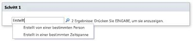
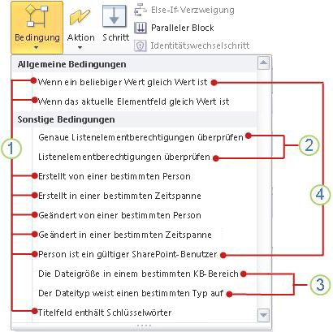
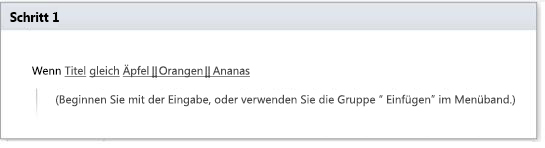

# Kurzübersicht zu Workflowbedingungen (SharePoint 2010-Workflowplattform)
Erfahren Sie mehr über die Workflowbedingungen, die in der SharePoint 2010-Workflowplattform in Microsoft SharePoint Designer 2013 verfügbar sind.Verwenden Sie diesen Artikel  *nur*  , wenn Sie in SharePoint Designer 2013 arbeiten, weiterhin jedoch die SharePoint 2010-Workflowplattform verwenden möchten.Wenn Sie stattdessen die SharePoint 2013-Workflowplattform verwenden möchten, finden Sie unter  [Workflowaktions- und -aktivitätenreferenz für SharePoint 2013](workflow-actions-and-activities-reference-for-sharepoint-2013.md) und weiteren im Abschnitt „Zusätzliche Ressourcen" aufgeführten Artikeln Informationen zu neuen Funktionen, die in der neueren Plattformversion zur Verfügung stehen.Wählen Sie zum Erstellen eines Workflows mithilfe der 2010-Workflowplattform im Dialogfeld **Workflow erstellen** im Feld **Plattformtyp** **SharePoint 2010-Workflow** aus.
## Anzeigen der Workflowbedingungen

Es gibt zwei Möglichkeiten, um auf das Menü mit verfügbaren Workflowbedingungen zuzugreifen.
  
    
    
Führen Sie eine der folgenden Aktionen beim Bearbeiten in einem Workflowschritt aus:
  
    
    

- Klicken Sie auf der Registerkarte **Workflow** in der Gruppe **Einfügen** auf **Bedingungen**, um die Liste der Workflowaktionen zu öffnen.
    
  
- Doppelklicken Sie in einen Workflowschritt. Geben Sie in dem angezeigten Suchfeld den Text ein, der im Namen der benötigten Bedingung angezeigt wird (z. B. „erstellt"), und drücken Sie dann EINGABE. Aktionen und Bedingungen, die den von Ihnen eingegebenen Text enthalten, werden nach dem Textfeld angezeigt.
    
  

  
    
    

  
    
    
Welche Bedingungen Ihnen beim Erstellen oder Ändern eines Workflows zur Verfügung stehen, hängt von dem genauen Kontext ab, in dem Sie arbeiten. Weitere Informationen finden Sie in der folgenden Abbildung.
  
    
    

  
    
    

  
    
    
 **1** Allgemeine Bedingungen in SharePoint Designer 2013
  
    
    
 **2** **Genaue Listenelementberechtigungen überprüfen** und **Listenelementberechtigungen überprüfen** sind nur in einem Identitätswechselschritt verfügbar.
  
    
    
 **3** **Die Dateigröße eine bestimmter KB-Bereich** und **Der Dateityp weist einen bestimmten Typ auf** stehen nur in einem Workflow zur Verfügung, der dem Dokumentinhaltstyp, einem untergeordneten Element des Dokumentinhaltstyps oder einer Bibliothek zugewiesen ist.
  
    
    
 **4** **Wenn ein beliebiger Wert gleich Wert ist** und **Person ist ein gültiger SharePoint-Benutzer** sind die einzige Bedingungen, die verfügbar sind, wenn Sie einen Websiteworkflow erstellen.
  
    
    

## Allgemeine Bedingungen

In diesem Abschnitt werden die Bedingungen beschrieben, die in SharePoint Designer 2013 für Listen und wiederverwendbare Listenworkflows verfügbar sind, unabhängig davon, mit welchem Listen- oder Inhaltstyp der Workflow verküpft ist.
  
    
    

### Wenn ein Wert dem Wert entspricht

Diese Bedingung wird anfänglich in einem Workflowschritt als **Wenn ein beliebiger Wert gleich Wert ist** angezeigt. Verwenden Sie diese Bedingung, wenn Sie einen Wert mit einem anderen Wert vergleichen möchten. Jeder Wert kann statischer Text, eine dynamische Zeichenfolge oder ein Nachschlagewert für eine Variable für Kontextinformationen oder ein SharePoint-Feld sein.
  
    
    
Sie haben die Auswahl aus einer breiten Palette von Operatoren in Ihrer Bedingung, z. B. **enthält** und **ist größer als**. Dafür müssen Sie den ersten **Wert** in der Bedingung festlegen und dann auf **entspricht** klicken. Die verfügbaren Operatoren hängen davon ab, auf was der erste **Wert** in der Bedingung festgelegt ist. Wenn Sie beispielsweise das Dialogfeld zum Nachschlagen verwendet haben, um den ersten **Wert** in der Bedingung auf einen Datum- und Uhrzeitdatentyp wie **erstellt** festzulegen, gehört der Operator **enthält** nicht zu den verfügbaren Optionen.
  
    
    
Es gibt zwei Varianten der Operatoren **entspricht** und **enthält**:
  
    
    

- Bei den Operatoren **entspricht** und **enthält** muss die Groß-/Kleinschreibung beachtet werden.
    
  
- Bei den Operatoren **entspricht (Groß-/Kleinschreibung wird ignoriert)** und **enthält (Groß-/Kleinschreibung wird ignoriert)** muss die Groß-/Kleinschreibung nicht beachtet werden.
    
  
Die Option, die Sie für den zweiten **Wert** in der Bedingung verwenden, hängt auch zu einem gewissen Grad davon ab, auf was der erste **Wert** festgelegt wird. Nehmen wir beispielsweise an, dass Sie den ersten **Wert** auf **erstellt** festlegen und dann den zweiten **Wert** suchen, indem Sie eine Variable verwenden, die eine Zeichenfolge wie **Letzte 10 Zeichen** ist. Sie möchten wahrscheinlich die Zeichenfolge **Als Datum/Uhrzeit** zurückgeben, damit der Vergleich mit **erstellt** vorhersagbare Ergebnisse zurückgibt.
  
    
    

> **HINWEIS**
> Sie können logische Operatoren wie**||**(oder) oder **&amp;&amp;** (und) in der Bedingung verwenden.
  
    
    

Im Folgenden finden Sie Beispiele dazu, wie die Bedingung in einem Workflowschritt aussehen kann:
  
    
    

- Wenn Variable: Eine Woche ab Änderungist größer alsHeute
    
  
- Wenn Variable: Spezifikationsnameenthält (Groß-/Kleinschreibung wird ignoriert)SharePoint Designer || SPD
    
  
Die Bedingung **Wenn ein beliebiger Wert gleich Wert ist** ist eine von nur zwei verfügbaren Bedingungen, wenn Sie in einem anderen Websiteworkflow als **Person ist ein gültiger SharePoint-Benutzer** arbeiten. Weitere Informationen zu Websiteworkflows, finden Sie im Abschnitt [Bedingungen, die in einem Websiteworkflow zur Verfügung stehen](workflow-conditions-quick-reference-sharepoint-2010-workflow-platform.md#section5) dieses Artikels.
  
    
    

### Wenn aktuelles Elementfeld dem Wert entspricht

Diese Bedingung wird anfänglich in einem Workflowschritt als **Wenn Feld gleich Wert ist** angezeigt. Verwenden Sie diese Bedingung, um den Wert in einem Feld im aktuellen Element (d. h. dem Element, in dem die Liste oder der wieder verwendbare Listenworkflow derzeit ausgeführt wird) mit einem anderen Wert zu vergleichen. Werte können statischer Text, dynamische Zeichenfolgen oder Suchvorgänge für Variablen für Kontextinformationen oder andere SharePoint-Felder sein.
  
    
    
Klicken Sie auf **Feld**, um die Liste der Optionen anzuzeigen. Die verfügbaren Optionen für **Feld** richten sich nach dem Inhaltstyp, der Liste, der Bibliothek oder der Website, dem oder der der Workflow zugeordnet ist. Ein Workflow, der z. B. einer Standardbibliothek zugeordnet ist, verfügt über Feldoptionen wie **Titel**, **erstellt** und **erstellt von**.
  
    
    
Sie haben die Auswahl aus einer Reihe von Operatoren in Ihrer Bedingung, darunter **enthält** und **ist größer als**. Bevor Sie einen Operator auswählen, müssen Sie zunächst einen Wert für **Feld** auswählen und dann auf **entspricht** klicken. Welche Operatoren verfügbar sind, hängt von der **Feld**-Einstellung ab. Wenn Sie beispielsweise das Dialogfeld zum Nachschlagen verwendet haben, um ein **Feld** auf einen Datum- und Uhrzeitdatentyp wie **erstellt** festgelegt haben, ist der Operator **enthält** nicht als Option aufgelistet.
  
    
    
Es gibt zwei Varianten der Operatoren **entspricht** und **enthält**. Bei den Operatoren **entspricht** und **enthält** muss die Groß-und Kleinschreibung beachtet werden, bei den Operatoren **entspricht (Groß-/Kleinschreibung wird ignoriert)** und **enthält (Groß-/Kleinschreibung wird ignoriert)** dagegen nicht. Wenn Sie z. B. **Feld** auf **Titel** festlegen und dann den Operator **enthält** verwenden und der **Wert** in Ihrer BedingungDokument ist, gilt die Bedingung nur, wenn der TitelDokument mit großem D enthält, und nicht, wenn er nurdokument ohne großes D enthält. Wenn Sie stattdessen den Operator **enthält (Groß-/Kleinschreibung wird ignoriert)** verwenden, gilt die Bedingung für Titel, dieDokument oderdokument oder beides enthalten.
  
    
    
Die Option, die Sie für **Wert** auswählen, hängt zu einem gewissen Grad auch von dem ab, auf das **Feld** festgelegt ist. Nehmen wir beispielsweise an, dass Sie **Feld** auf **erstellt** festlegen und dann nach dem **Wert** mit einer Variable suchen, die eine Zeichenfolge wie **Letzte 10 Zeichen** ist. Sie möchten wahrscheinlich die Zeichenfolge **Als Datum/Uhrzeit** zurückgeben, damit der Vergleich mit **erstellt** vorhersagbare Ergebnisse zurückgibt.
  
    
    

> **HINWEIS**
> Sie können logische Operatoren wie**||**(oder) oder **&amp;&amp;** (und) in der Bedingung verwenden.
  
    
    

Im Folgenden finden Sie Beispiele dazu, wie die Bedingung in einem Workflowschritt aussehen kann. (Beachten Sie, dass im ersten Beispiel **ist kleiner als** als „früher als" interpretiert wird.)
  
    
    

- Wenn Aktuelles Element: geändertist kleiner als1/1/2010 12:00:00 Uhr
    
  
- Wenn Current Item:Pathenthält (Groß-/Kleinschreibung wird ignoriert)Marketing || Public Relations
    
  

### Von einer bestimmten Person erstellt

Diese Bedingung wird anfänglich in einem Workflowschritt als **Wenn von bestimmter Person erstellt** angezeigt. Verwenden Sie diese Bedingung, um zu ermitteln, ob ein Element von einem angegebenen Benutzer erstellt wurde. Sie können den Benutzer angeben, indem Sie entweder den Benutzernamen oder die E-Mail-Adresse manuell eingeben (z. B. Olivier@contoso.com) oder indem Sie den Benutzer aus Benutzern auswählen, die bereits in SharePoint, Exchange oder Active Directory aufgelistet sind.
  
    
    

> **HINWEIS**
> Da sowohl beim Benutzernamen als auch bei der E-Mail-Adresse die Groß-/Kleinschreibung beachtet wird, empfiehlt es sich, die zweite Methode zu verwenden, um eine korrekte Groß-/Kleinschreibung sicherzustellen. Wenn Sie einen Benutzernamen oder eine E-Mail-Adresse manuell eingeben müssen, achten Sie darauf, dass Sie die Groß-/Kleinschreibung genau beachten. Die Bedingung **Wenn erstellt von contoso\\molly** wird beispielsweise nicht als wahr bewertet, wenn das Benutzerkonto als „Contoso/Molly" registriert ist.
  
    
    

Im Folgenden finden Sie ein Beispiel dazu, wie die Bedingung in einem Workflowschritt aussehen kann:
  
    
    

- Wenn erstellt von Molly Clark
    
  

### In einem bestimmten Zeitabschnitt erstellt

Diese Bedingung wird anfänglich in einem Workflowschritt als **Wenn zwischen Datum und Datum erstellt** angezeigt. Verwenden Sie diese Bedingung, um zu ermitteln, ob ein Element zwischen zwei angegebenen Datumswerten erstellt wurde. Sie können das aktuelle Datum, ein bestimmtes Datum oder das Ergebnis einer Suche verwenden.
  
    
    
Im Folgenden finden Sie ein Beispiel dazu, wie die Bedingung in einem Workflowschritt aussehen kann:
  
    
    

- Wenn zwischen 1/1/2009 und1/1/2010 12:00:00 AMerstellt
    
  

### Von einer bestimmten Person geändert

Diese Bedingung wird anfänglich in einem Workflowschritt als **Wenn von einer bestimmten Person geändert** angezeigt. Verwenden Sie diese Bedingung, um zu ermitteln, ob ein Element von einem bestimmten Benutzer geändert wurde. Der Benutzer kann als E-Mail-Adresse wie olivier@contoso.com angegeben oder aus SharePoint-, Exchange- oder Active Directory-Benutzern ausgewählt werden.
  
    
    

> **HINWEIS**
> Beim Benutzernamen und der E-Mail-Adresse wird die Groß-/Kleinschreibung berücksichtigt. Es wird empfohlen, dass Sie einen Benutzernamen oder eine E-Mail-Adresse auswählen, um sicherzustellen, dass Sie die richtige Schreibweise verwenden. Wenn Sie einen Benutzernamen oder eine E-Mail-Adresse eingeben, muss dies mit der Schreibweise des Kontos übereinstimmen. Beispielsweise wird **Wenn von contoso\\molly geändert** nicht als wahr bewertet, wenn das Benutzerkonto „Contoso\\Molly" lautet.
  
    
    

Im Folgenden finden Sie ein Beispiel dazu, wie die Bedingung in einem Workflowschritt aussehen kann:
  
    
    

- Wenn geändert von Molly Clark
    
  

### In einem bestimmten Zeitabschnitt geändert

Diese Bedingung wird anfänglich in einem Workflowschritt als **Wenn zwischen Datum und Datum geändert** angezeigt. Verwenden Sie diese Bedingung, um zu ermitteln, ob ein Element zwischen zwei angegebenen Datumswerten erstellt wurde. Sie können für jeden der Datumswerte das aktuelle Datum, ein bestimmtes Datum oder das Ergebnis einer Suche verwenden.
  
    
    
Im Folgenden finden Sie ein Beispiel dazu, wie die Bedingung in einem Workflowschritt aussehen kann:
  
    
    

- Wenn zwischen 1/1/2009 und1/1/2009 12:00:00 AM geändert
    
  

### Person ist ein gültiger SharePoint-Benutzer

Diese Bedingung wird anfänglich in einem Workflowschritt als **Person ist ein gültiger SharePoint-Benutzer** angezeigt. Verwenden Sie diese Bedingung, um zu ermitteln, ob der angegebene Benutzer ein Mitglied der SharePoint-Website ist.
  
    
    
In SharePoint Designer 2013 können Sie Personen außerhalb Ihrer Unternehmensdomäne (die als externe Teilnehmer bezeichnet werden) in Ihre Workflows einschließen. Nehmen wir beispielsweise an, dass Sie Aufgaben in Ihrem Workflow an externe Teilnehmer zugewiesen haben. Diese Aktion können anschließend verwenden, um eine Nachverfolgung der Websitebenutzer mit den externen Teilnehmern durchzuführen, bis die Aufgaben abgeschlossen sind.
  
    
    
Im Folgenden finden Sie ein Beispiel dazu, wie die Bedingung in einem Workflowschritt aussehen kann:
  
    
    

- Wenn Molly Clark ein gültiger SharePoint-Benutzer ist
    
  
Die Bedingung **Wenn Person ein gültiger SharePoint-Benutzer ist** ist eine von nur zwei verfügbaren Bedingungen, wenn Sie in einem anderen Websiteworkflow als **Wenn ein beliebiger Wert gleich Wert ist** arbeiten. Weitere Informationen zu Websiteworkflows, finden Sie im Abschnitt [Bedingungen, die in einem Websiteworkflow zur Verfügung stehen](workflow-conditions-quick-reference-sharepoint-2010-workflow-platform.md#section5) dieses Artikels.
  
    
    

### Titelfeld enthält Stichwörter

Diese Bedingung wird anfänglich in einem Workflowschritt als **Wenn Titelfeld Stichwörter enhält** angezeigt. Verwenden Sie diese Bedingung, um zu ermitteln, ob das Feld **Titel** für ein Element angegebenen Text enthält. Sie können dem Text im Zeichenfolgen-Generator (als statischen Wert, dynamische Zeichenfolge oder eine Kombination der beiden) angeben oder eine Suche für ein Feld oder eine Variable einfügen.
  
    
    

> **HINWEIS**
> Bei Verwendung der Bedingung **Titelfeld enthält Schlüsselwörter** können Sie nicht nach mehr als einem einzelnen Schlüsselworttext suchen. Für die Suche nach mehreren alternativen Schlüsselworttexten können Sie logische Operatoren wie**||**(oder) und **&amp;&amp;** (und) in einer der folgenden zwei Bedingungen verwenden: **Wenn ein beliebiger Wert gleich Wert ist** und **Wenn das aktuelle Elementfeld gleich Wert ist**. (Verwenden Sie die zweite Bedingung, wenn Sie nur im Feld **Titel** suchen möchten.) Ein Beispiel finden Sie in der folgenden Abbildung:> 
  
    
    

  
    
    

  
    
    

  
    
    

  
    
    

## Nur innerhalb eines Identitätswechselschritts verfügbare Bedingungen

Standardmäßig werden beim manuellen Starten eines Workflows die Berechtigungen der Person verwendet, die ihn startet. Aber was passiert, wenn die Person, die den Workflow startet nicht über ausreichende Rechte für einen oder mehrere der Vorgänge verfügt, die der Workflow ausführen muss? Beispiel: Was passiert, wenn der Workflow manchmal ein Dokument in einer Dokumentbibliothek archivieren muss, für die die Person, die den Workflow startet, möglicherweise nur Berechtigungen auf Leseebene hat, die keine Berechtigung zum Archivieren einschließen? 
  
    
    
In solchen Fällen können Sie eine oder mehrere Identitätswechselschritte im Workflow verwenden. Ein Identitätswechselschritt verwendet die Berechtigungen der Person, die die Workflowvorlage zuletzt gespeichert hat - in der Regel ist das der Autor der Vorlage, der normalerweise über die erforderlichen Berechtigungen für alle Workflowvorgänge verfügt, einschließlich der Berechtigung zum Archivieren des Dokuments in der richtigen Bibliothek für diesen Fall. 
  
    
    

> **HINWEIS**
>  Für beide Bedingungen müssen *alle*  der angegebenen Benutzer und Gruppen den Vergleich bestehen, mit die Bedingung als wahr bewertet wird.>  Für beide Bedingungen spielt es keine Rolle, ob die angegebenen Berechtigungen *explizit*  den angegebenen einzelnen Benutzern zugewiesen wurden oder ob diese einzelnen Benutzer nur *implizit*  über die Berechtigungen verfügen (z. B. als Mitglieder einer Gruppe, der die Berechtigungen zugewiesen wurden). Für angegebene *Gruppen*  dagegen müssen die Berechtigungen *explizit*  zugewiesen und *nicht*  von einer übergeordneten Gruppe vererbt sein.
  
    
    

### Überprüfen von Listenelementberechtigungen

Diese Bedingung wird anfänglich in einem Identitätswechselschritt als **Wenn Berechtigungen für diese Benutzer mindestens diese Berechtigungen für die Elemente in dieser Liste sind** angegeben.
  
    
    
Verwenden Sie diese Bedingung, um zu ermitteln, ob für die angegebene Liste oder Bibliothek die  *einzelnen Berechtigungen*  aller angegebenen Benutzer oder Gruppen alle *einzelnen Berechtigungen*  enthalten, die in der angegebenen Sicherheitsebene enthalten sind.
  
    
    
 **Beispiele**
  
    
    

- Ein Benutzer oder eine Gruppe verfügt nur über Berechtigungen auf der Lesestufe für eine Liste, die Bedingung gibt aber die Stufe „Genehmigen" an. Die Lesestufe schließt  *nicht*  alle Berechtigungen ein, die in der Stufe „Genehmigen" enthalten sind, deshalb wird die Bedingung in diesem Fall als falsch ausgewertet.
    
  
- Ein anderer Benutzer oder eine andere Gruppe verfügt über die Berechtigungsstufe „Vollzugriff" für dieselbe Liste. Die Stufe „Vollzugriff"  *umfasst*  alle Berechtigungen, die in der Stufe „Genehmigen" (sowie andere Berechtigungen) ein, deshalb wird die Bedingung diesmal als wahr ausgewertet.
    
  
Im Folgenden finden Sie ein Beispiel dazu, wie die Bedingung in einem Workflowschritt aussehen kann:
  
    
    

- Wenn Berechtigungen für Contoso-Mitglieder mindestensLeseberechtigungen für die Elemente inAktuelle Elemente sind
    
  

### Überprüfen von Berechtigungsstufen für Listenelemente

Diese Bedingung wird anfänglich in einem Identitätswechselschritt als **Wenn Berechtigungsstufen für diese Benutzer mindestens diese Berechtigungsstufen für die Elemente in dieser Liste sind** angegeben.
  
    
    
Verwenden Sie diese Bedingung, um zu ermitteln, ob für die angegebene Liste oder Bibliothek allen Benutzern und Gruppen  *explizit*  die angegebenen *Berechtigungsstufen*  zugewiesen wurden. Berechtigungen, die nur *implizit*  vorhanden sind (z. B. durch ein Mitglied einer Gruppe, der die Berechtigungen zugewiesen wurden) werden von dieser Bedingung *nicht*  berücksichtigt, genau so wenig wie einzelne Berechtigungen, über die die angegebenen Benutzer und Gruppen verfügen.
  
    
    
 **Beispiele**
  
    
    

- Einem Benutzer wurde explizit nur die Berechtigungsstufe „Vollzugriff " für eine Liste zugewiesen, aber die Bedingung gibt nur die Lesestufe an. Obwohl der Benutzer über alle einzelnen Berechtigungen  *verfügt*  , die in der Lesestufe enthalten sind, wurde dem Benutzer nicht *explizit*  die Lesestufe zugewiesen und deshalb wird die Bedingung als falsch ausgewertet.
    
  
- Einem anderen Benutzer wurde nur die Berechtigungsstufe „Entwurf" für eine andere Liste explizit zugewiesen, aber die Bedingung gibt sowohl die Stufe „Entwurf" als auch die Stufe „Hierarchie verwalten" an. Da dem Benutzer nur eine der beiden erforderlichen Stufen zugewiesen wurde, wird die Bedingung als falsch ausgewertet.
    
  
- Für eine dritte Liste ist ein Benutzer ein Mitglied der Gruppe „Mitglieder" und erbt die Berechtigungen der Gruppe. Dem Benutzer wurde aber keine Berechtigungsstufe  *explizit*  zugewiesen. Die Bedingung erfordert eine *explizite Zuweisung*  der Stufe „Beitragen", deshalb wird auch diese Bedingung als falsch ausgewertet, da der Benutzer nur implizit über die Berechtigungen dieser Stufe verfügt.
    
  
Im Folgenden finden Sie ein Beispiel dazu, wie die Bedingung in einem Workflowschritt aussehen kann:
  
    
    

- Wenn Berechtigungsstufen für Contoso-Mitglieder mindestensLeseberechtigungen für die Elemente inAktuelle Elemente sind
    
  

## Bedingungen, die nur verfügbar sind, wenn der Workflow einer Bibliothek oder dem Dokumentinhaltstyp zugewiesen ist

Die Bedingungen **Die Dateigröße liegt in einem bestimmten KB-Bereich** und **Der Dateityp weist einen bestimmten Typ auf** sind nur verfügbar, wenn der Workflow einer Bibliothek oder dem Dokumentinhaltstyp zugeordnet ist.
  
    
    

### Die Dateigröße liegt in einem bestimmten KB-Bereich

Diese Bedingung wird anfänglich in einem Workflowschritt als **Die Dateigröße liegt zwischen Größe und Größe KB** angezeigt. Verwenden Sie diese Bedingung, um zu ermitteln, ob die Dateigröße eines Dokuments zwischen zwei angegebenen, in KB gemessenen Größen liegt. Die Bedingung schließt die angegebenen Größenwerte nicht in die Bewertung ein. Sie können für jede Instanz von **Größe** entweder eine Zahl eingeben oder eine Suche verwenden.
  
    
    
Im Folgenden finden Sie ein Beispiel dazu, wie die Bedingung in einem Workflowschritt aussehen kann:
  
    
    

- Wenn die Dateigröße zwischen 1023 und1048577 KB liegt
    
  

> **HINWEIS**
> Der angegebene obere und untere Grenzwert ist nicht im definierten Bereich enthalten. In dem hier angeführten Beispiel würde eine Datei mit 1023 KB als falsch ausgewertet, da sie nicht zwischen 1023 und 1048577 liegt. 
  
    
    

### Der Dateityp weist einen bestimmten Typ aus

Diese Bedingung wird anfänglich in einem Workflowschritt als **Wenn der Dateityp einen bestimmten Typ aufweist** angegeben. Verwenden Sie diese Bedingung, um zu ermitteln, ob der Dateityp des aktuellen Elements dem angegebenen Typ entspricht (z. B. DOCX). Sie können den Dateityp als Zeichenfolge eingeben oder eine Suche verwenden.
  
    
    
Im Folgenden finden Sie ein Beispiel dazu, wie die Bedingung in einem Workflowschritt aussehen kann:
  
    
    

- Wenn der Dateityp docx entspricht
    
  

## Bedingungen, die in einem Websiteworkflow zur Verfügung stehen

Websiteworkflows arbeiten auf Websiteebene und sind nicht mit einem Listenelement verknüpft. Wenn Sie in einem Websiteworkflow arbeiten, stehen nur die folgenden Bedingungen zur Verfügung. (Alle anderen Bedingungen in SharePoint Designer 2013 arbeiten mit Listenelementen und funktionieren deshalb nicht in Websiteworkflows.)
  
    
    

- **Wenn ein beliebiger Wert gleich dem Wert ist**
    
  
- **Person ist ein gültiger SharePoint-Benutzer**
    
  
In einem Identitätswechselschritt in einem Websiteworkflow:
  
    
    

- **Überprüfen von Listenelementberechtigungen**
    
  
- **Überprüfen von Berechtigungsstufen für Listenelemente**
    
  
- **Person ist ein gültiger SharePoint-Benutzer**
    
  
Weitere Informationen zu Bedingungen finden Sie im Abschnitt  [Allgemeine Bedingungen](workflow-conditions-quick-reference-sharepoint-2010-workflow-platform.md#section2) in diesem Artikel.
  
    
    

## Zusätzliche Ressourcen

-  [Neuerungen in Workflows für SharePoint 2013](what-s-new-in-workflows-for-sharepoint-2013.md)
    
  
-  [Erste Schritte mit Workflows in SharePoint 2013](get-started-with-workflows-in-sharepoint-2013.md)
    
  
-  [Workflowentwicklung in SharePoint Designer und Visio](workflow-development-in-sharepoint-designer-and-visio.md)
    
  

  
    
    

