# Arbeiten mit Aufgaben in SharePoint 2013-Workflows mit Visual Studio 2012
Erfahren Sie mehr über das neue und überarbeitete Framework für Workflowaufgaben, das in SharePoint 2013 eingeführt wurde und auf dem neuen Workflow-Manager basiert. 
 **Bereitgestellt von:** [Andrew Connell](http://social.msdn.microsoft.com/profile/andrew%20connell%20%5bmvp%5d/),  [AndrewConnell.com](http://www.andrewconnell.com)
  
    
    


  
    
    

> **HINWEIS**
> Dieser Artikel enthält ein durchgängiges Codebeispiel, das Sie beim Folgen des Artikels oder als Grundlage für eigene SharePoint-Workflowprojekte verwenden können. Den herunterladbaren Code finden Sie  [ hier](http://assets.andrewconnell.com/media/Default/Downloads/SP2013Wf-CustomTasks.zip). 
  
    
    


  
    
    
Einer der größten Vorteile, den SharePoint der Windows Workflow Foundation bietet, ist die Implementierung eines neuen und verbesserten Frameworks für das Aufgabenmanagement, das den neuen Workflow-Manager als Hostingumgebung umfasst.
## Rückblick auf Workflowaufgaben in SharePoint 2007 und SharePoint 2010

In SharePoint 2007 und SharePoint 2010 wurden Workflowaufgaben auf ähnliche Weise implementiert. Wenn Sie (in SharePoint 2010) eine Workflowzuordnung für eine Liste, einen Inhaltstyp oder ein Website erstellt haben, wurde eine bestimmte Liste als Speicherort festgelegt, in der die Workflowaufgaben erstellt werden sollten. Diese Liste war eine standardmäßige SharePoint- **Task**nliste (ID = 107), die den standardmäßigen Inhaltstyp SharePoint- **Task** (ID = 0x0108) verwendet hat. Benutzer konnten dann auf Elemente in der Liste zugreifen, um sie anzuzeigen, zu bearbeiten und Aufgaben auszuführen. Die Workflowinstanzen überwachten die Aufgabenelemente in der Liste auf Aktualisierungen, sofern der Workflow entsprechend konfiguriert war.
  
    
    
Das standardmäßige Rendern des Aufgabenformulars in SharePoint war jedoch selbst bei benutzerdefinierten Workflows vorgegeben. War Flexibilität gefragt, mussten Sie ASP.NET [Web Forms](http://www.asp.net/web-forms) oder [InfoPath-Formulare](http://msdn.microsoft.com/de-de/library/ms540731%28v=office.14%29.aspx) zum Erstellen benutzerdefinierter Formularlösungen zum Bewältigen Ihrer Aufgaben verwenden.
  
    
    

## Neuerungen bei Aufgaben in SharePoint 2013

Die Art und Weise, in der Aufgaben in SharePoint 2013 erstellt, verwaltet und bearbeitet werden, hat sich aufgrund von Änderungen an der SharePoint-Architektur verändert.
  
    
    
Die zentrale Änderung besteht darin, dass Workflows nicht mehr innerhalb von SharePoint verwaltet und verarbeitet werden. Stattdessen nutzt SharePoint 2013 eine neue Komponente mit dem Namen Workflow-Manager, die extern ausgeführt wird. Workflow-Manager hostet die Windows Workflow Foundation-Laufzeit und die erforderlichen Dienste, die von der Windows Workflow Foundation benötigten werden. Wenn ein Workflow veröffentlicht oder eine neue Instanz eines veröffentlichten Workflows gestartet wird, benachrichtigt SharePoint den Workflow-Manager, der wiederum die Workflowphasen verarbeitet. Wenn ein Workflow Zugriff auf Informationen in SharePoint benötigt, z. B. zu Eigenschaften von Listenelementen oder Benutzern, authentifiziert er sich selbst mithilfe von OAuth und kommuniziert anschließend mit SharePoint mittels Webdienstaufrufen über die REST-APIs.
  
    
    
Die generelle Richtung für Anpassungen auf der SharePoint-Plattform wurde in SharePoint 2013 ebenfalls geändert, wobei diese Änderung bereits mit der Implementierung von Sandkastenlösungen in SharePoint 2010 eingeleitet wurde. In SharePoint 2013 hat Microsoft Änderungen eingeführt, durch die Anpassungen von SharePoint Server auf den Clientbrowser oder andere externe Ressourcen verlagert werden. Zu diesen Änderungen zählt das neue SharePoint-App-Modell, die Unterstützung der Zuweisung von App-Identitäten, die Authentifizierung über OAuth sowie Verbesserungen am clientseitigen Objektmodell (CSOM) und den REST-APIs.
  
    
    

## Architekturbezogene Änderungen an Workflowaufgaben in SharePoint 2013

Wie wirken sich die architekturbezogenen Änderungen in SharePoint 2013 auf Workflowaufgaben aus? Für Workflowaufgaben ist die Auswirkung nicht signifikant, außer wenn Sie mit benutzerdefinierten Aufgabenformularen arbeiten. In der Vergangenheit wurden Aufgabenformulare mit InfoPath-Formularen oder ASP.NET Web Forms erstellt. SharePoint 2013 arbeitet hingegen mit dem standardmäßigen Formular für das Rendern von Listenelementen für Workflowaufgaben. 
  
    
    
Möglicherweise müssen Sie mitunter die Darstellung oder das Verhalten der Aufgabenfelder anpassen. Dazu erstellen Sie einen benutzerdefinierten Aufgabeninhaltstyp, der eine Websitespalte enthält. Die Websitespalte kann anschließend das neue clientseitige Renderframework in SharePoint 2013 nutzen, welches das Erstellen einer JavaScript-Datei erfordert, die bestimmt, wie das Feld aussehen und sich im Browser verhalten soll. 
  
    
    
Weitere Informationen zum clientseitigen Rendering finden Sie unter  [Gewusst wie: Anpassen einer Listenansicht in Apps für SharePoint durch clientseitiges Rendering](http://msdn.microsoft.com/de-de/library/jj220045.aspx).
  
    
    
Einzelne Aufgabenelemente basieren auf Inhaltstypen. Vor allem an Inhaltstypen sind in SharePoint 2013 verschiedene Änderungen erfolgt. In SharePoint 2007 und SharePoint 2010 wurden Workflowaufgaben mit dem Inhaltstyp **Task** (ID = 0x0108) erstellt. Dies ist derselbe Inhaltstyp, mit dem nicht workflowbezogene Aufgaben in der Aufgabenliste manuell erstellt werden. In SharePoint 2013 wird dies durch die Einführung des neuen Inhaltstyps **Workflow Task (SharePoint 2013)** (ID = 0x0108003365C4474CAE8C42BCE396314E88E51F) geändert. Dieser erbt Informationen vom Inhaltstyp "Aufgabe" und vorgibt, dass die Aufgaben nur für den Workflow zu verwenden sind.
  
    
    
Dieser neue Inhaltstyp **Workflow Task** unterscheidet sich vom früheren Inhaltstyp **Task** dadurch, dass er zwei neue Spalten hat:
  
    
    

- **WorkflowInstanceId**: Enthält einen Verweis auf die Workflowinstanz-ID, mit der die Aufgabe erstellt wurde, und die beispielsweise auf der Workflowstatusseite verwendet wird. Auf der Statusseite wird dieses Feld genutzt, um die zugeordnete Workflowaufgabenliste auf alle Elemente abzufragen, deren Spalte **WorkflowInstanceId** die angegebene ID enthält.
    
  
- **TaskOutcome**: Ein Auswahlfeld, das bei der Darstellung des Aufgabenformulars verwendet wird, um dem Benutzer zu erlauben, verschiedene Optionen für Fertigstellungskriterien auszuwählen. Das Aufgabenbearbeitungsformular zeigt die angegebenen Ergebnisse der Workflowaufgaben als Schaltflächen am unteren Rand des Formulars neben den Schaltflächen **Speichern** und **Abbrechen** an. Workflows sind in SharePoint 2013 nicht bloß auf die beiden Optionen **Approved** und **Rejected** beschränkt (siehe Abbildung 1).
    
   **Abbildung 1. Ergebnisse von Workflowaufgaben**

  

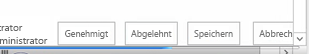
  

  

  
Inhaltstypen sind ein Bestandteil von Workflowaufgaben. Die Struktur der Aufgabenlistenelemente wird von Inhaltstypen bestimmt. Ebenso wichtig ist die Aufgabenlistenvorlage, die sich in SharePoint 2013 ebenfalls geändert hat.
  
    
    
Vor SharePoint 2013 hat die Workflowaufgabenliste dieselbe Listenvorlage als Standardaufgabenliste (ID = 107) verwendet. Es handelte sich um eine standardmäßige SharePoint-Aufgabenliste, die auch nicht im Workflow ausgeführte Aufgaben enthalten konnte. Doch in SharePoint 2013 ist der Ansatz dahingehend anders, dass ein neuer Typ von Liste eingeführt wird. Diese Liste mit der Bezeichnung Hierarchieaufgabenliste bietet am oberen Rand der Seite eine Zeitachsenansicht, um die Planung von Aufgaben anzuzeigen (siehe Abbildung 2). Beachten Sie, dass Benutzer auch Aufgabenabhängigkeiten erkennen können.
  
    
    

**Abbildung 2: Hierarchieaufgabenliste**

  
    
    

  
    
    
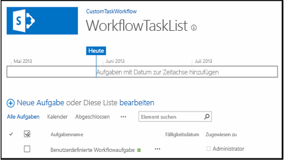
  
    
    

  
    
    

  
    
    

## Erstellen von Workflowaufgabenoptionen in SharePoint 2013

Sowohl SharePoint Designer 2013 als auch Visual Studio 2012 bieten Workflowautoren zwei Möglichkeiten zum Erstellen von Workflowaufgaben. Eine ist das Erstellen einer einzelnen Aufgabe, die einer Person oder Gruppe zugewiesen wird. Die andere besteht darin, eine Aufgabe zu erstellen und mehreren Personen zuzuweisen. Zum Erstellen einer einzelnen Aufgabe in einem benutzerdefinierten Workflow in Visual Studio 2012 verwenden Sie die Aktivität **SingleTask**. Bei Wahl dieser Aktivität können Sie die Eigenschaften entweder im Toolfenster **Eigenschaften** oder mit dem Assistenten ändern (siehe Abbildung 3).
  
    
    

**Abbildung 3. Assistent für einzelne Aufgabe**

  
    
    

  
    
    
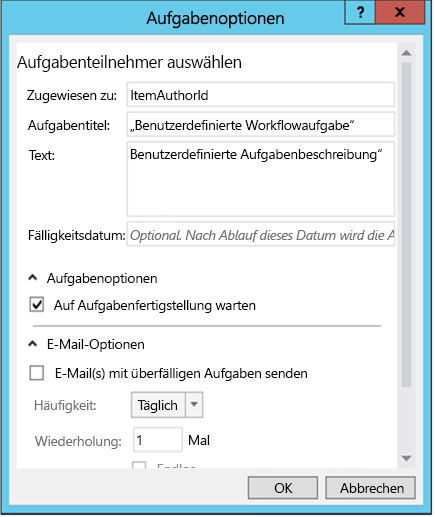
  
    
    
SharePoint ermöglicht die Angabe, ob mehrere Aufgaben seriell oder parallel ausgeführt werden sollen, sowie die Angabe der Kriterien für die Erledigung der Aufgabe. Soll SharePoint die Erledigung aller Aufgaben oder eines Prozentsatzes davon mit einem bestimmten Ergebnis abwarten? Um in Visual Studio 2012 mehrere Aufgaben zu erstellen, verwenden Sie die Aktivität **CompositeTask**, deren Assistent und Eigenschaften der Aktivität **SingleTask** ähneln (siehe Abbildung 4).
  
    
    

**Abbildung 4. Assistent für mehrere Aufgaben**

  
    
    

  
    
    
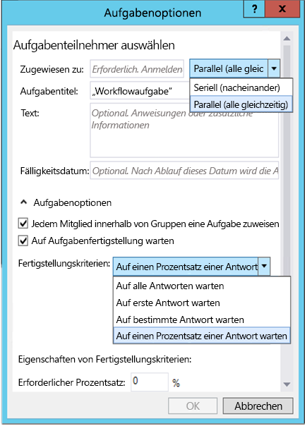
  
    
    

  
    
    

  
    
    

## Anleitung zum Erstellen und Zuweisen von Aufgaben in benutzerdefinierten Workflows

Nachstehend folgt eine exemplarische Vorgehensweise, die das Erstellen und Zuweisen von Aufgaben in einem benutzerdefinierten Workflow veranschaulicht. Bevor Sie beginnen, stellen Sie sicher, dass Sie Zugriff auf eine SharePoint 2013-Entwicklerwebsite haben.
  
    
    

### 1. Erstellen eines neuen SharePoint 2013-App-Projekts


1. Erstellen Sie ein neues SharePoint 2013-App-Projekt, und konfigurieren Sie das Projekt als eine Von SharePoint gehostetes Add-In.
    
  
2. Fügen Sie dem Projekt eine **Announcement**-Listeninstanz hinzu. Diese dient als Container für Elemente, die zum Testen des Workflows dienen.
    
  
3. Fügen Sie dem Projekt ein Workflowelement hinzu, indem Sie im **Projektmappen-Explorer** mit der rechten Maustaste auf das Projektsymbol klicken und anschließend auf **Hinzufügen** und **Neues Element** klicken.
    
  
4. Wählen Sie im Dialogfeld **Neues Element hinzufügen** in der Kategorie **Office/SharePoint** das Projektelement **Workflow** aus, und nennen Sie es "BenutzerdefinierterAufgabenworkflow", und klicken Sie dann auf **Weiter**.
    
  

### 2. Erfassen von Informationen zum Element "Neue Ankündigung"

Wir erstellen eine Aufgabe in unserem Workflow und weisen sie der Person zu, die das Listenelement mit der Ankündigung erstellt hat, mit dem der Workflow gestartet wird. Das Listenelement übermittelt die Informationen an den Workflow. Wir verwenden eine **LookupSPListItemProperties**-Aktivität, die einen dynamischen Wert aus dem REST-Webdienst zurückgibt, der in SharePoint aufgerufen wird. Wir speichern diesen Wert dann in einer neuen Variablen namens **AnnouncementItemProperties**, deren Datentyp wir in **DynamicValue** ändern.
  
    
    

1. Erstellen Sie eine **AnnouncementItemAuthorId**-Variable zum Speichern der ID der Person, die das Listenelement erstellt hat (siehe Abbildung 5) .
    
   **Abbildung 5: "LookupSPListItemProperties"-Aktivität**

  

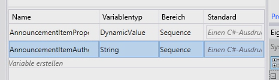
  

  

  
2. Legen Sie die **LookupSPListItem**-Aktivität auf der Entwurfsoberfläche des Workflows ab, und legen Sie die **ListID**-Eigenschaft auf  _(current list)_ fest.
    
  
3. Legen Sie den **ItemId**-Wert auf  _(current item)_ fest.
    
  
4. Legen Sie die **Result**-Ausgabe auf die **AnnouncementItemProperties**-Variable fest, die wir zuvor erstellt haben.
    
  
5. Zum Abrufen des Autors des Elements aus der Variablen klicken Sie auf den Link **Eigenschaften abrufen** in der **LookupSPListItem**-Aktivität und fügen der Entwurfsoberfläche eine **GetDynamicValueProperties**-Aktivität hinzu. Legen Sie deren **Source**-Eigenschaft auf die Ausgabe der **LookupSPListItem**-Aktivität fest.
    
  
6. Klicken Sie für die Eigenschaft **Properties** auf die Schaltfläche **[...]**, um das Dialogfeld **Eigenschaften** einzublenden.
    
  
7. Ändern Sie im Dialogfeld **Eigenschaften** den **Entitätstyp** in das **Listenelement "Ankündigungen"** (siehe Abbildung 6).
    
  
8. Weisen Sie den Pfad **Erstellt von** der Variablen **AnnouncementItemAuthorId** zu (siehe Abbildung 6).
    
   **Abbildung 6. Dialogfeld "Eigenschaften"**

  

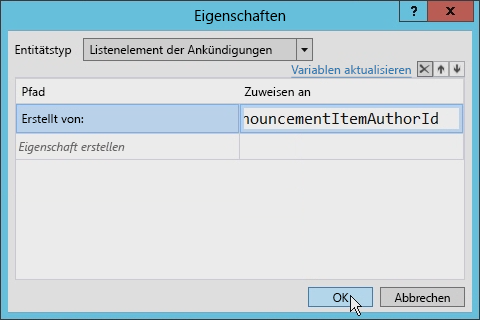
  

  

  

### 3. Erstellen und Zuweisen der Aufgabe

An dieser Stelle können wir die Aufgabe erstellen und dem Autor des Ankündigungselements zuweisen.
  
    
    

1. Ziehen Sie aus der Toolbox eine **SingleTask**-Aktivität auf die Entwurfsoberfläche des Workflows.
    
  
2. Klicken Sie in der Aktivität auf den Link **Konfigurieren**, um das Dialogfeld **Aufgabenoptionen** zu öffnen.
    
  
3. Legen Sie die Eigenschaft **Zugewiesen an** auf die Variable fest, in der die Autor-ID gespeichert wird.
    
  
4. Ändern Sie den Titel und Text der Aufgabe (siehe Abbildung 7).
    
   **Abbildung 7: Dialogfeld "Aufgabenoptionen"**

  

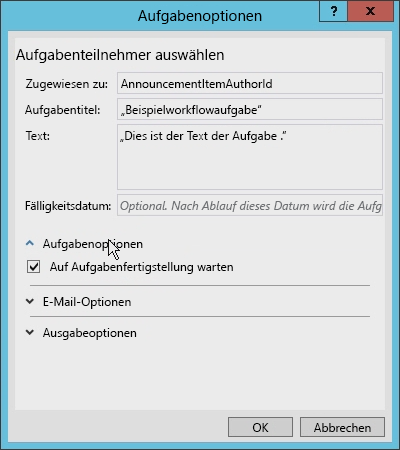
  

  

  
Es gibt verschiedene andere Optionen, die Sie im Dialogfeld **Aufgabenoptionen** festlegen können. Sie können z. B. den Workflow so festlegen, dass er auf den Abschluss der Aufgabe wartet, indem Sie einfach das Kontrollkästchen aktivieren (siehe Abbildung 7). In früheren Versionen von SharePoint-Workflows war hierfür eine schwierige Befehlslösung erforderlich.
  
    
    
Beachten Sie in Abbildung 8 die E-Mail-Optionen, die Sie festlegen können. Sie können u. a. sicherstellen, dass E-Mail-Nachrichten gesendet werden, wenn die Aufgabe überfällig ist, sowie angeben, wie oft die Erinnerungen gesendet werden. 
  
    
    

**Abbildung 8. Einstellungen für E-Mail-Optionen**

  
    
    

  
    
    
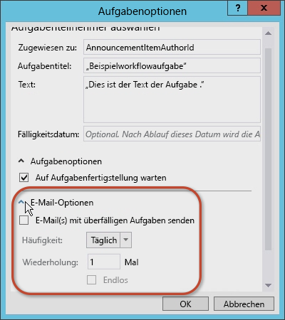
  
    
    
Sie können auch Optionen für das Ergebnis von Aufgaben festlegen. Sie können den Inhaltstyp der Workflowaufgabe, das **Ergebnisfeld** und das **Standardergebnis** auswählen (siehe Abbildung 9).
  
    
    

**Abbildung 9. Einstellungen für Ergebnisoptionen**

  
    
    

  
    
    
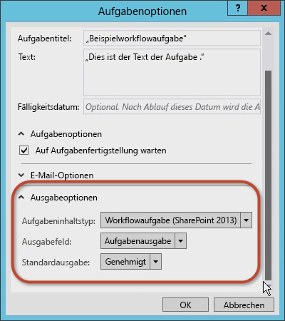
  
    
    

  
    
    

  
    
    

### 4. Prüfen und Ändern der Aufgabeneigenschaften

Nachdem Sie die Werte im Dialogfeld **Aufgabenoptionen** akzeptiert haben, wählen Sie die **SingleTask**-Aktivität und untersuchen dann das Eigenschaftenraster **Eigenschaften** (siehe Abbildung 10).
  
    
    

**Abbildung 10: Toolfenster "Eigenschaften"**

  
    
    

  
    
    
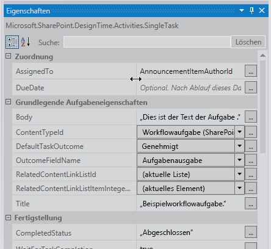
  
    
    
Im Eigenschaftenraster **Eigenschaften** können Sie angeben, ob die Aufgabe bis zur Fertigstellung warten soll, ehe Sie fortfahren, und Sie können die E-Mail-Nachrichten konfigurieren, die die Aufgabe generiert, einschließlich der anfänglichen Zuweisungs-E-Mail, der E-Mail bei Überfälligkeit und der E-Mail zum Abbruch der Aufgabe.
  
    
    
Beachten Sie, dass die **Outcome**-Eigenschaft automatisch eine Variable namens **outcome_0** für die Aufgabe erstellt hat. Um zu sehen, was in dieser Variablen enthalten ist, fügen Sie auf der Entwurfsoberfläche eine **WriteToHistory**-Aktivität hinzu und aktualisieren die Nachricht mit der Ausgabe des Ergebnisses (siehe Abbildung 11).
  
    
    

**Abbildung 11. Wert der Eigenschaft "Ergebnis"**

  
    
    

  
    
    
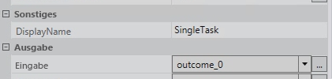
  
    
    

  
    
    

  
    
    

### 5. Testen des Workflows

Gehen Sie zum Testen des Workflows wie folgt vor:
  
    
    

1. Drücken Sie **F5** zum Erstellen und Ausführen des Workflows, oder klicken Sie in Visual Studio 2012 auf die Schaltfläche **Start**. Wenn Sie den Test in einer lokalen Installation von SharePoint 2013 durchführen , startet Visual Studio 2012 das Workflow-Manager Test Service Host-Dienstprogramm und stellt den Workflow auf der Entwicklerwebsite bereit. Nach kurzer Zeit wird die Entwicklerwebsite geöffnet.
    
  
2. Navigieren Sie zur Liste **Ankündigungen**, und erstellen Sie ein Listenelement, und starten Sie den benutzerdefinierten Workflow manuell.
    
  
3. Kehren Sie zur Statusseite der Workflowinstanz zurück, um die Aufgabe zu suchen, die vom Workflow erstellt wurde. Klicken Sie auf die Aufgabe, um das Formular anzuzeigen. Beachten Sie die Felder **Aufgabenname** und **Zugewiesen an**, die im Workflow definiert wurden (siehe Abbildung 12).
    
   **Abbildung 12. Aufgabenformular**

  

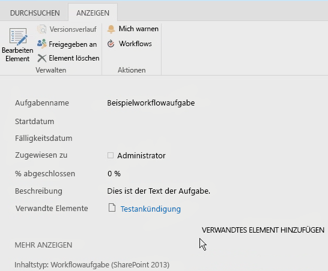
  

  

  
4. Kehren Sie abschließend zur Aufgabe zurück, bearbeiten Sie das Formular, und klicken Sie dann auf die Schaltfläche **Genehmigen** oder **Ablehnen**, um die Aufgabe abzuschließen. Beachten Sie, dass das Ergebnis der Aufgabe in der Liste **Workflowverlauf** für die Workflowinstanz angezeigt wird (siehe Abbildung 13).
    
   **Abbildung 13: Liste "Workflowverlauf"**

  

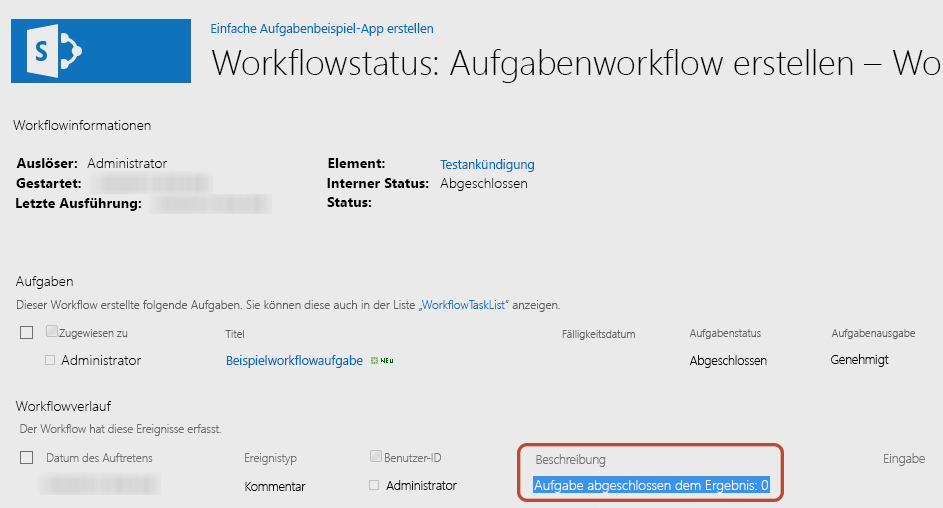
  

  

  

## Vorgehensweise: Erstellen eines benutzerdefinierten Aufgabentyps mit einem benutzerdefinierten Ergebnis

In der vorherigen exemplarischen Vorgehensweise wurde gezeigt, wie Sie eine einfache Aufgabe erstellen und ihre Eigenschaften konfigurieren. Allerdings ist es möglich, dass die Standardoptionen nicht Ihren Anforderungen entsprechen. Nehmen Sie z. B. eine Aufgabe, bei der jemand gebeten wird, ein Dokument zu überprüfen. Beim Überprüfen des Dokumententwurfs hat der Prüfer eine von zwei Optionen: den Entwurf des Dokuments zur Überarbeitung an den Autor zurücksenden oder das Dokument an den Redakteur weiterleiten. Leider erfüllt keine der Standardoptionen ( **Genehmigt** und **Abgelehnt**) die Anforderungen des Prüfers. Besser geeignete Optionen wären "An Autor zurücksenden" und "An Redakteur weiterleiten".
  
    
    
Beim Erstellen von Workflows mit entweder SharePoint Designer 2013 oder Visual Studio 2012 können Sie benutzerdefinierte Workflowaufgaben erstellen, die benutzerdefinierte Aufgabenergebnisse aufweisen. Zu diesem Zweck müssen Sie eine benutzerdefinierte Aufgabe als speziellen Inhaltstyp erstellen und dann eine benutzerdefinierten Websitespalte hinzufügen, die die gewünschten Ergebnisse definiert. Sie können die benutzerdefinierte Spalte vom Feldtyp **OutcomeChoice** ableiten, bei dem es sich um ein Auswahlfeld handelt.
  
    
    
Dieser Ansatz kann jedoch dahingehend eine Herausforderung darstellen, dass der Inhaltstyp, von dem die benutzerdefinierte Aufgabe abgeleitet ist, der Inhaltstyp **Workflow Task (SharePoint 2013)** ist, der die standardmäßige Websitespalte **TaskOutcome** mit den Optionen **Genehmigt** und **Abgelehnt** enthält. Sie können allerdings die Standardeinstellung umgehen, indem Sie die Spalte **TaskOutcome** aus dem benutzerdefinierten Aufgabeninhaltstyp entfernen und sicherstellen, dass sie nicht in der Aufgabenliste des Workflows vorhanden ist. Andernfalls würden mehrere Optionen angezeigt. Nehmen Sie z. B. ein benutzerdefiniertes Ergebnis mit den beiden Möglichkeiten "Rote Pille" und "Blaue Pille". Wenn das Standardergebnis nicht entfernt wird, würden den Benutzern, die die Aufgabe ausführen, alle verfügbaren Ergebnisoptionen angezeigt (siehe Abbildung 14), auch wenn diese Ergebnisoptionen irrelevant sind.
  
    
    

**Abbildung 14. Ergebnisoptionen**

  
    
    

  
    
    
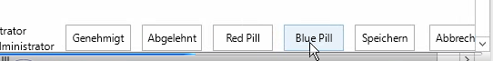
  
    
    
Bewährt hat sich, für jeden Aufgabentyp, den Sie erstellen, eine andere Aufgabenliste für den Workflow zu erstellen. 
  
    
    

### Erstellen eines SharePoint 2013-App-Projekts

Als ersten Schritt bei der exemplarischen Vorgehensweise zum Erstellen einer benutzerdefinierten Workflowaufgabe mit Visual Studio 2012 müssen Sie sicherstellen, dass Sie Zugriff haben eine SharePoint 2013-Entwicklerwebsite haben. 
  
    
    

1. Erstellen Sie in Visual Studio 2012 ein neues SharePoint 2013-App-Projekt, das als Von SharePoint gehostetes Add-In konfiguriert ist.
    
  
2. Fügen Sie dem Projekt eine neue **Announcement**-Listeninstanz hinzu. Diese dient als Container für Elemente, die zum Testen des Workflows dienen.
    
  
3. Fügen Sie dann dem Projekt ein Workflowelement hinzu, indem Sie mit der rechten Maustaste im **Projektmappen-Explorer** auf das Projektsymbol klicken und anschließend auf **Hinzufügen** und **Neues Element** klicken.
    
  
4. Wählen Sie im Dialogfeld **Neues Element hinzufügen** in der Kategorie **Office/SharePoint** das Projektelement **Workflow** aus, und nennen Sie es "BenutzerdefinierterAufgabenworkflow", und klicken Sie dann auf **Weiter**.
    
  

### Erstellen der benutzerdefinierten Ergebnisspalte

Nachdem wir die Liste **Announcements** erstellt haben, wollen wir als Nächstes den benutzerdefinierten Inhaltstyp erstellen, der die benutzerdefinierte Aufgabe und die Websitespalte für das benutzerdefinierte Ergebnisfeld enthalten soll.
  
    
    

1. Klicken Sie mit der rechten Maustaste auf das Projekt, klicken Sie auf **Hinzufügen** und dann auf **Neues Element**.
    
  
2. Wählen Sie nun die Projektelementvorlage **Websitespalte**, und legen Sie den Namen dieses Felds auf "BenutzerdefinierteErgebnisspalte" fest. An der Vorlage für die Websitespalte sind einige Änderungen vorzunehmen.
    
  
3. Legen Sie den Feldtyp der Spalte auf **OutcomeChoice**, den erforderlichen Feldtyp für eine Ergebnisspalte, fest.
    
  
4. Entfernen Sie die Spalte **Erforderlich**.
    
  
5. Fügen Sie als Nächstes, da der Feldtyp **OutcomeChoice** auf dem Feldtyp "Auswahl" basiert, eigene Auswahlmöglichkeiten hinzu.
    
  
Das Markup der neuen benutzerdefinierten Spalte sollte jetzt wie folgt aussehen:
  
    
    


```XML

<?xml version="1.0" encoding="utf-8"?>
<Elements xmlns="http://schemas.microsoft.com/sharepoint/">  
  <Field
       ID="{7b7edd9e-f5d1-4558-a2c8-e733dcfb0a5e}"
       Name="CustomSiteColumn"
       DisplayName="Better State"
       Type="Choice"
       Required="FALSE"
       Group="Custom Site Columns">
       <CHOICES>
         <CHOICE>Florida</CHOICE>
         <CHOICE>Georgia</CHOICE>
       </CHOICES>
       <Default>Florida</Default>
  </Field>
</Elements>
```


### Erstellen eines benutzerdefinierten Aufgabeninhaltstyps

Nach Erstellen der Websitespalte ist der nächste Schritt das Erstellen eines speziellen Inhaltstyp für die benutzerdefinierte Aufgabe.
  
    
    

1. Fügen Sie dem Projekt als neues Element den Inhaltstyp mit dem Namen **CustomTaskContentType** hinzu.
    
  
2. Bei der Aufforderung zum Auswählen, auf welchem Inhaltstyp dieser basieren soll, wählen Sie den Inhaltstyp **Workflow Task (SharePoint 2013)**.
    
  
3. Fügen Sie als Nächstes die benutzerdefinierte Ergebnisspalte der Liste verfügbarer Spalten hinzu, und entfernen Sie die standardmäßige Ergebnisspalte, damit das Markup des Inhaltstyps wie im folgenden Beispiel aussieht.
    
  ```XML
  
<?xml version="1.0" encoding="utf-8"?>
<Elements xmlns="http://schemas.microsoft.com/sharepoint/">
  <!-- Parent ContentType: Workflow Task (SharePoint 2013) (0x0108003365C4474CAE8C42BCE396314E88E51F) -->
  <ContentType 
      ID="0x0108003365C4474CAE8C42BCE396314E88E51F00D368DFB2B31A447BB184BA1334E5119E" 
      Name="CustomContentType" 
      Group="Custom Content Types" 
      Description="My Content Type" 
      Inherits="TRUE" Version="0">
      <FieldRefs>
         <FieldRef 
            ID="{7b7edd9e-f5d1-4558-a2c8-e733dcfb0a5e}" 
            DisplayName="Better State" 
            Required="FALSE" 
            Name="CustomSiteColumn" />
            <RemoveFieldRef 
               ID="{55B29417-1042-47F0-9DFF-CE8156667F96}" 
               Name="TaskOutcome" />
      </FieldRefs>
  </ContentType>
</Elements>
  ```


### Erstellen eines Workflows

Jetzt erstellen wir einen Workflow, damit wir die benutzerdefinierte Websitespalte und den Inhaltstyp testen können. 
  
    
    

1. Fügen Sie unserem Projekt einen Workflow hinzu, und konfigurieren Sie ihn als Listenworkflow.
    
  
2. Erstellen Sie eine Zuordnung mit diesem Workflow mithilfe der Liste **Ankündigungen**, die wir zuvor erstellt haben.
    
  
3. Erstellen Sie eine neue Variable vom Typ **DynamicValue**, und nennen Sie sie "Elementeigenschaften". Wir nutzen diese Variable zum Speichern des Elements, das die Eigenschaften des Workflows aktiviert.
    
  
4. Erstellen Sie eine **Int32**-Variable, und nennen Sie sie "Elementautor-ID" (siehe Abbildung 15).
    
   **Abbildung 15: Erstellen einer Workflowvariablen**

  

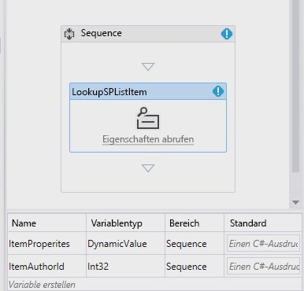
  

  

  

### Erfassen der Listenelementeigenschaften

Nun erfassen wir die Listenelementeigenschaften.
  
    
    

1. Legen Sie die **LookupSPListItem**-Aktivität auf der Entwurfsoberfläche des Workflows ab, und legen Sie die **ListID**-Eigenschaft auf  _(current list)_ und die **ItemId**-Eigenschaft auf  _(current item)_ fest.
    
  
2. Legen Sie jetzt die **Result**-Ausgabe auf die **ItemProperties** **DynamicValue**-Variable fest, die wir zuvor erstellt haben.
    
  
3. Zum Abrufen des Autors des Elements aus der Variablen klicken Sie auf den Link **Eigenschaften abrufen** in der **LookupSPListItem**-Aktivität und fügen der Entwurfsoberfläche eine **GetDynamicValueProperties**-Aktivität zu.
    
  
4. Legen Sie die **Source**-Eigenschaft des Elements automatisch auf die Ausgabe der **LookupSPListItem**-Aktivität fest.
    
  
5. Klicken Sie für die Eigenschaft **Properties** auf die Schaltfläche **[...]**, um das Dialogfeld **Eigenschaften** anzuzeigen.
    
  
6. Ändern Sie die **Entity Type**-Eigenschaft in **List Item of Announcements**, um dem Dialogfeld einen Kontext zu geben, und weisen den **Created By**-Pfad der Variablen **ItemAuthorId** zu (siehe Abbildung 16).
    
   **Abbildung 16. Dialogfeld "Eigenschaften"**

  

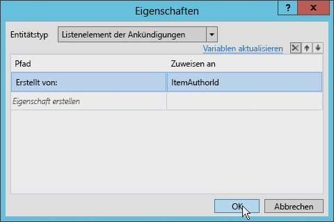
  

  

  

### Erstellen einer einzelnen Aufgabe

Jetzt können wir die einzelne Aufgabe erstellen. 
  
    
    

1. Fügen Sie die **SingleTask**-Aktivität der Entwurfsoberfläche zu.
    
  
2. Klicken Sie in der Aktivität auf den Link **Konfigurieren**, um das Dialogfeld **Aufgabenoptionen** zu öffnen.
    
  
3. Legen Sie das Feld **Text** auf eine beliebige Zeichenfolge fest. Legen Sie danach die Eigenschaft **Zugewiesen an** auf die Variable fest, die zum Speichern der Autor-ID dient (in unserem Fall **ItemAuthorId**).
    
  
4. Ändern Sie den Titel der Aufgabe (siehe Abbildung 17).
    
   **Abbildung 17: Einstellung "Aufgabentitel"**

  

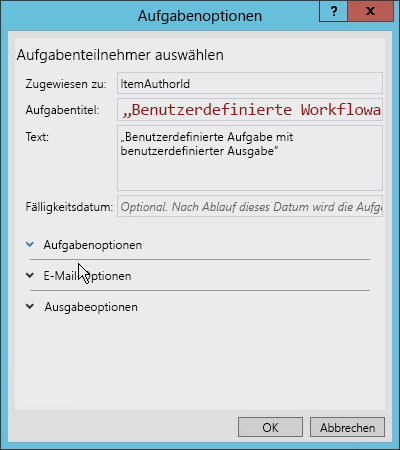
  

  

  
5. Legen Sie abschließend das Feld **Ergebnisoptionen** auf das Verwenden des neuen benutzerdefinierten Inhaltstyp und der benutzerdefinierten Ergebnisspalte fest.
    
    Das Dialogfeld bestimmt die verfügbaren Optionen, indem alle Inhaltstypen untersucht werden, die vom Inhaltstyp **Workflow Task (SharePoint 2013)** abgeleitet sind (siehe Abbildung 18).
    

   **Abbildung 18. Einstellungen für Ergebnisoptionen**

  

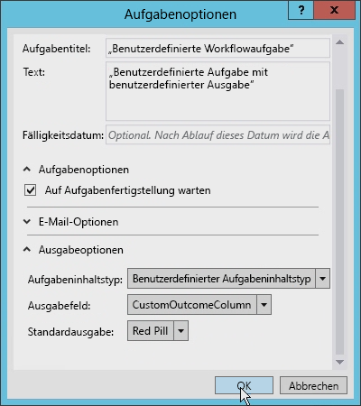
  

  

  

### Aktualisieren des "AssignedTo"-Felds

Bevor wir fortfahren, müssen wir das **AssignedTo**-Feld für die **SingleTask**-Aktivität ändern, da es eine Zeichenfolge und keine ganze Zahl erwartet. Um dies zu beheben, fügen Sie **ToString()** am Ende des Ausdrucks hinzu.
  
    
    
Beachten Sie auch, dass die **Outcome**-Eigenschaft automatisch eine Variable namens **outcome_0** erstellt hat. Um zu sehen, was in dieser Variablen enthalten ist, fügen Sie auf der Entwurfsoberfläche eine **WriteToHistory**-Aktivität hinzu und aktualisieren die Nachricht mit der Ausgabe des Ergebnisses.
  
    
    

### Aktualisieren der Aufgabenliste des Workflows

Der letzte Schritt ist das Konfigurieren der Aufgabenliste des Workflows. Standardmäßig lässt die von der App erstellte Aufgabenliste nur den Inhaltstyp **Workflow Task (SharePoint 2013)** zu. Dieser Workflow verwendet einen benutzerdefinierten Inhaltstyp für das benutzerdefinierte Ergebnis. Öffnen Sie die Datei `Elements.xml` für die Aufgabenliste des Workflows, und ändern Sie das **ContentTypeId**-Attribut des **<ContentTypeBinding>**-Elements entsprechend dem Inhaltstyp im Projekt (siehe das folgende Codebeispiel).
  
    
    

```XML

<?xml version="1.0" encoding="utf-8" ?>
<Elements xmlns="http://schemas.microsoft.com/sharepoint/">
  <ListInstance 
      FeatureId="{f9ce21f8-f437-4f7e-8bc6-946378c850f0}"
      TemplateType="171"
      Title="WorkflowTaskList"
      Description="This list instance is used for workflow Task items."
      Url="Lists/WorkflowTaskList"
      RootWebOnly="FALSE" />
  <!-- CustomContentType -->
  <ContentTypeBinding 
      ListUrl="Lists/WorkflowTaskList"
      RootWebOnly="FALSE"
      ContentTypeId="0x0108003365C4474CAE8C42BCE396314E88E51F00D368DFB2B31A447BB184BA1334E5119E"/>
</Elements>
```


### Testen der benutzerdefinierten Inhaltsaufgabe mit einem benutzerdefinierten Aufgabenergebnis

Lassen Sie uns nun den Workflow testen. 
  
    
    

1. Drücken Sie in Visual Studio 2012 **F5**, oder klicken Sie auf die Schaltfläche **Start**. Wenn Sie den Test in einer lokalen Installation von SharePoint 2013 durchführen , startet Visual Studio 2012 das Workflow-Manager Test Service Host-Dienstprogramm und stellt den Workflow auf der Entwicklerwebsite bereit. Nach kurzer Zeit wird die Entwicklerwebsite geöffnet.
    
  
2. Navigieren Sie zur Liste **Ankündigungen**, und erstellen Sie ein neues Element. Nachdem das Element erstellt wurde, starten Sie den benutzerdefinierten Workflow manuell.
    
  
3. Kehren Sie als Nächstes zur Statusseite der Workflowinstanz zurück, um die Aufgabe zu suchen, die vom Workflow erstellt wurde.
    
  
4. Klicken Sie auf die Aufgabe, und wechseln Sie über die Schaltfläche **Bearbeiten** auf dem Menüband in den Bearbeitungsmodus. Am unteren Rand des Formulars sollten vier Schaltflächen vorhanden sein. Die ersten beiden Schaltflächen sind die benutzerdefinierten Ergebnisschaltflächen, auf die geklickt wird, um die Aufgabe als erledigt zu markieren. Die nächsten beiden Schaltflächen sind die Standardschaltflächen **Speichern** und **Abbrechen**, die zum Aktualisieren des Listenelements dienen, ohne die Aufgabe abzuschließen (siehe Abbildung 19).
    
   **Abbildung 19. Benutzerdefinierte Ergebnisschaltfläche**

  

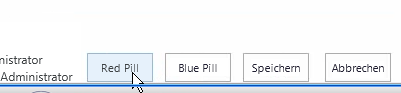
  

  

  

## Schlussbemerkung

Workflows wurden von Microsoft in die SharePoint 2007-Plattform eingeführt, die in SharePoint 2010 hinsichtlich Architektur, Implementierung oder Prozesse so gut wie unverändert blieb. Gleiches galt für Aufgaben in SharePoint-Workflows. In SharePoint 2013 wurden Workflows, was Architektur und Implementierung angeht, umfassend geändert.
  
    
    
In diesem Artikel wurden die Änderungen in Bezug auf Workflowaufgaben erläutert, die sich aufgrund von Änderungen am gesamten Thema Workflow in SharePoint 2013 ergeben haben. Es wurde veranschaulicht, wie Sie einen einfachen Workflow erstellen, der mit Aufgaben in SharePoint 2013 mithilfe von Visual Studio 2012 arbeitet. Diese Arten von Aufgaben eignen sich für viele Entwickler, obwohl mitunter benutzerdefinierte Aufgaben und benutzerdefinierte Ergebnisse gewünscht werden, die mit Visual Studio 2012 wie gezeigt realisiert werden können.
  
    
    

## Weitere Ressourcen
<a name="bk_addresources"> </a>


-  [Workflows in SharePoint 2013](http://msdn.microsoft.com/de-de/library/jj163986.aspx)
    
  
-  [Autorisierung und Authentifizierung von Apps für SharePoint 2013](http://msdn.microsoft.com/de-de/library/office/fp142384.aspx)
    
  
-  [Gewusst wie: Anpassen einer Listenansicht in Apps für SharePoint durch clientseitiges Rendering](http://msdn.microsoft.com/de-de/library/jj220045.aspx)
    
  

