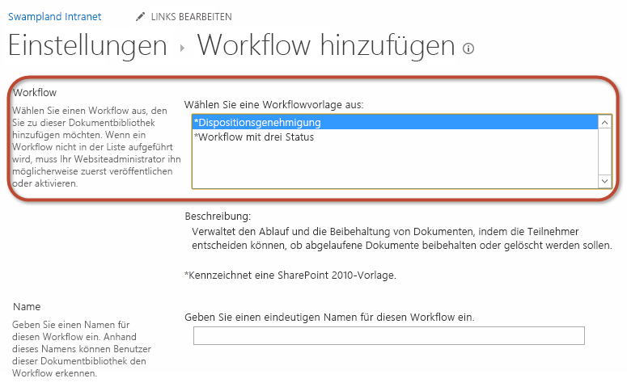
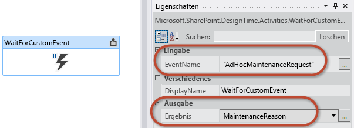

# Arbeiten mit dem clientseitigen Objektmodell in SharePoint 2013-Workflowdiensten
Zeigt, wie die clientseitige SharePoint 2013-Objektmodell-API (CSOM) zum Erstellen und Steuern von Workflow-Manager 1.0-Workflowdefinitionen und -Instanzen verwendet wird. 
 **Bereitgestellt von:** [Andrew Connell](http://social.msdn.microsoft.com/profile/andrew%20connell%20%5bmvp%5d/),  [AndrewConnell.com](http://www.andrewconnell.com)
  
    
    


## Arbeiten mit dem clientseitigen Objektmodell in SharePoint 2013-Workflowdiensten

Die Implementierung von Workflows in SharePoint 2007 und SharePoint 2010 blieb im Wesentlichen von Version zu Version gleich. Microsoft hat einige neue Funktionen in SharePoint 2010 hinzugefügt, z. B. die Möglichkeit, Workflows zu Websites zuzuordnen, und Tools für die Erstellung von Workflows, SharePoint Designer 2010 und Visual Studio 2010, gegenüber den Vorgängern verbessert. Die Implementierung von Workflowaufgaben und Workflowformularen sowie die serverseitigen Workflow-APIs bleiben im Wesentlichen unverändert. 
  
    
    
In SharePoint 2010 hat Microsoft Features und Funktionen eingeführt, die Kunden ermutigten, ihre Anpassungen in Sandkastenlösung zu verschieben. Diese werden in einem isolierten Prozess ausgeführt und sind für beide Arten von SharePoint-Bereitstellungen geeignet: lokale, bei denen SharePoint auf Unternehmensservern installiert und vom Unternehmen verwaltet wird, und Cloud- oder genauer gesagt Office 365-Bereitstellungen. 
  
    
    
In SharePoint 2013 hat Microsoft noch weitere Funktionen hinzugefügt. Diese Updates waren an Cloud-Bereitstellungen orientiert. Insbesondere führte Microsoft das neue SharePoint-App-Modell ein, das einen Schritt weiter als die Sandkastenlösung geht, da im Gegensatz zu Sandkastenlösung die Ausführung von serverseitigem Code im SharePoint-Prozess ausdrücklich blockiert wird. Microsoft erweiterte außerdem vorhandene Technologien in SharePoint, z. B. das clientseitige Objektmodell (CSOM), und führte neue Funktionen ein, darunter die Unterstützung für App-Identitäten über  [OAuth](http://msdn.microsoft.com/library/office/fp142382.aspx).
  
    
    
Und mit der Einführung von SharePoint Server 2013 stellte Microsoft eine völlig neue Workflowarchitektur und -plattofrm bereit, die grundsätzliche Veränderungen in der Produktausrichtung darstellen. 
  
    
    
Die wichtigste Änderung in der neuen Architektur besteht darin, dass die Workflowausführung in SharePoint Server 2013 nicht mehr in SharePoint stattfindet. Stattdessen verwendet SharePoint Server 2013 ein vollkommen neues Ausführungsmodul: Workflow-Manager 1.0. Workflow-Manager hostet die Windows Workflow Foundation-Runtime und alle für Windows Workflow Foundation erforderlichen Dienste. Wenn ein Workflow veröffentlicht oder eine neue Instanz eines veröffentlichten Workflows gestartet wird, benachrichtigt SharePoint Workflow-Manager, der wiederum die Workflowabfolge verarbeitet. Wenn der Workflow auf Informationen in SharePoint zugreift, z. B. Listenelementeigenschaften oder Benutzereigenschaften, erfolgt die Authentifizierung über die OAuth-Unterstützung und die Kommunikation über neue und verbesserte REST-APIs.
  
    
    
Diese Änderungen an der Workflowarchitektur hatte erhebliche Auswirkungen in bestimmten Bereichen, z. B. bei benutzerdefinierten Workflowformularen, wie im MSDN-Artikel „Gewusst wie: Erstellen benutzerdefinierter SharePoint Server 2013-Workflowformulare mit Visual Studio 2012" erläutert. In diesem Artikel wird eins der Dinge dargestellt, die Microsoft zu SharePoint 2013 hinzugefügt hat, um die neue Art der Erstellung von benutzerdefinierten Workflowformularen zu unterstützen: die Verbesserungen an am CSOM und das Hinzufügen der Workflowdienste-CSOM-API.
  
    
    

## Einführung in die Workflowdienste-CSOM-API in SharePoint 2013

In SharePoint 2007 und SharePoint 2010 war die Workflow-API nur im serverseitigen Objektmodell vorhanden. In SharePoint 2013 ist derselbe Workflow-API immer noch vorhanden, da SharePoint 2013 das alte Workflowausführungsmodul in SharePoint aus Gründen der Abwärtskompatibilität beinhaltet. 
  
    
    
Aber die neue und bevorzugte Workflowarchitektur, die mit SharePoint 2013 eingeführt wurde und Workflow-Manager verwendet, enthält eine völlig neue serverseitige API. In SharePoint 2013 hat Microsoft das CSOM um eine stabile API für die neue Workflowarchitektur erweitert. Diese Ergänzung des CSOM gilt nur für die neue SharePoint 2013- und Workflow-Manager 1.0-Workflowarchitektur, nicht die ältere Version, die noch von SharePoint gehostet wird.
  
    
    
Die Workflowdienste-CSOM-API wird wie der Rest des CSOM sowohl in einer verwalteten .NET-Silverlight-API und einer JavaScript-API implementiert, die als JavaScript-Objektmodell (JSOM) bezeichnet wird. JSOM muss von Entwicklern verwendet werden, wenn sie benutzerdefinierte Workflowformulare erstellen, da diese Formulare ASP.NET-Webformulare sind, die keinen serverseitigen Code benötigen. Daher wird die Workflowdienste-JSOM-API in benutzerdefinierten Zuordnungsformularen für die Erstellung von Workflowzuordnungen sowie in Initiierungsformularen zum Starten neuer Workflowinstanzen verwendet.
  
    
    
Aber das sind noch nicht alle Möglichkeiten. Workflowdienste-CSOM und -JSOM sind sehr stabil und ermöglichen Entwicklern nahezu beliebige Aktionen mit Workflows in SharePoint 2013. Neben der Erstellung von Workflowzuordnungen und -instanzen können Entwickler auch programmgesteuert neue Workflowdefinitionen bereitstellen und sogar mit laufenden Workflowinstanzen vom CSOM und JSOM kommunizieren, wie im restlichen Teil dieses Artikels dargestellt wird.
  
    
    
Dieser Artikel konzentriert sich auf das Thema Workflowformulare im Kontext von SharePoint Server 2013. Er basiert auf dem SharePoint Server 2013angewendeten öffentlichen Update von März 2013 und Office Developer Tools für Visual Studio 2013. Alle Informationen in diesem Artikel gelten sowohl für lokale SharePoint Server 2013- als auch Office 365-Bereitstellungen.
  
    
    

## Komponenten der Workflowdienste-CSOM- und JSOM-API

In diesem Artikel liegt der Schwerpunkt auf der Workflowdienste-CSOM-API und infolgedessen auch auf der JSOM-API. Die serverseitige Workflowdienste-API wird hier nicht behandelt. Das Workflowdienste-CSOM besteht aus mehreren Diensten, die zum Ausführen verschiedener Aufgaben verwendet werden. Diese werden in den folgenden Abschnitten erläutert. 
  
    
    

> **HINWEIS**
> Es gibt einen zusätzlichen Dienst, der nicht im CSOM, sondern in der serverseitigen API vorhanden ist. Dabei handelt es sich um den Nachrichtendienst, der zum Verwalten von Nachrichtenwarteschlangen und den Nachrichtentransport verwendet wird. 
  
    
    

Zum Arbeiten mit den Workflowdienste-CSOM- und JSOM-APIs müssen Entwickler die erforderlichen Verweise zu ihren Projekten (bei CSOM) und Seiten (bei JSOM) hinzufügen. Beide Implementierungen haben dieselben Anforderungen:
  
    
    

- Verweisen Sie auf die SharePoint 2013-CSOM und JSOM-Kernbibliotheken:
    
  - Microsoft.SharePoint.Client.dll
    
  
  - Microsoft.SharePoint.Client.Runtime.dll
    
  
  - Microsoft.SharePoint.Client.WorkflowServices.dll
    
  

- Verweisen Sie auf die Workflowdienste-CSOM- und JSOM-Bibliotheken:
    
  - SP.js
    
  
  - SP.Runtime.js
    
  
  - SP.WorkflowServices.js
    
  

### Workflowdienst-Manager

Das Gateway zu alle in der Workflowdienste-CSOM-API enthaltenen Dienste ist der Workflowdienst-Manager. Dieses Objekt wird von Entwicklern verwendet, um Instanzen für alle anderen Dienste zu erhalten, die in den folgenden Abschnitten beschrieben sind. Ähnlich wie andere CSOM-API-Implementierungen hängt der  [WorkflowServicesManager](https://msdn.microsoft.com/library/Microsoft.SharePoint.WorkflowServices.WorkflowServicesManager.aspx) vom Kern-SharePoint 2013-CSOM ab, und deshalb müssen Sie einen gültigen Clientkontext und einen Verweis auf die SharePoint-Website übergeben, mit der Sie eine Verbindung herstellen möchten, wie in den folgenden Codebeispielen für CSOM und JSOM dargestellt.
  
    
    

#### CSOM: Erstellen einer WorkflowServicesManager-Instanz


```

var clientContext = new ClientContext(siteCollectionUrl);
var workflowServicesManager = new WorkflowServicesManager(clientContext, clientContext.Web); 

```


#### JSOM: Erstellen einer WorkflowServicesManager-Instanz


```

var clientContext = SP.ClientContext.get_current();
var workflowServicesManager = SP.WorkflowServices.WorkflowServicesManager.newObject(context, context.get_web()); 

```


### Bereitstellungsdienst

Beim Erstellen von benutzerdefinierten Workflows mit Visual Studio 2012, entweder über ein Lösungspaket (*.wsp) oder als SharePoint-App (*.app), erstellen Sie Workflowdefinitionen. Eine Definition umfasst den Workflowprozess und darin definierten Geschäftsregeln und Attribute wie den Speicherort der benutzerdefinierten Zuordnungs- und Initiierungsformulare. An sich sind diese Definitionen nicht sehr nützlich, da sie außerhalb des Kontexts einer Zuordnung zu einer Website, Liste oder Dokumentbibliothek nicht ausgeführt werden können. Sie können die auf einer Website veröffentlichten und verfügbaren Workflowdefinitionen finden, indem Sie die Seite aufrufen, auf der eine neue Workflowzuordnung erstellt werden kann, wie in der folgenden Abbildung dargestellt.
  
    
    

**Abbildung 1: Hinzufügen einer Workflowverknüpfung**

  
    
    

  
    
    

  
    
    
Auf die Sammlung von veröffentlichten Workflowdefinitionen kann über den Bereitstellungsdient zugegriffen werden. Mit diesem Dienst können Sie eine Liste aller derzeit gespeicherten und veröffentlichten Definitionen auf der Website abrufen und sowohl gespeicherte als auch neue Definitionen speicher, vorhandene Definitionen entfernen und bestimmen, welche Workflowaktionen für mit SharePoint Designer 2013 erstellte Workflows verfügbar sind.
  
    
    
Das Objekt **WorkflowDeploymentService** steht über die Klasse **WorkflowServicesManager** zur Verfügung, wie in den folgenden Codebeispielen gezeigt.
  
    
    

#### CSOM: Abrufen einer WorkflowDeploymentService-Instanz


```

var clientContext = new ClientContext(siteCollectionUrl);
var workflowServicesManager = new WorkflowServicesManager(clientContext, clientContext.Web);
var workflowDeploymentService = workflowServicesManager.GetWorkflowDeploymentService(); 

```


#### JSOM: Abrufen einer WorkflowDeploymentService-Instanz


```

var clientContext = SP.ClientContext.get_current();
var workflowServicesManager = SP.WorkflowServices.WorkflowServicesManager.newObject(context, context.get_web()); 
var workflowDeploymentService = workflowServicesManager.getWorkflowDeploymentService();

```


### Abonnementdienst

Sie erinnern sich aus dem vorherigen Abschnitt, dass Sie Workflows als Definitionen erstellen und an SharePoint veröffentlichen. Zum Verwenden dieser Definitionen muss ein Benutzer eine Zuordnung erstellen, die die Definition mit einer bestimmten SharePoint-Website, -Liste oder -Dokumentbibliothek zusammen mit zusätzlichen Metadaten verknüpft. Funktionsweise und Verhalten dieses Prozesses sind im Wesentlichen in SharePoint 2010 gleich, aber die Implementierung SharePoint 2013 unterscheidet sich deutlich. Workflow-Manager 1.0 nutzt eine Instanz von Microsoft Azure Service Bus 1.0.
  
    
    
Service Bus ist von entscheidender Bedeutung, da die Komponente den Veröffentlichungs- und Abonnementdienst unterstützt (auch bekannt als PubSub ). Das ist ein asynchrones Messagingframework, das einen Herausgeber unterstützt, der eine Nachricht zu einem in Service Bus gespeicherten Thema sendet. Beliebig viele Abonnenten können anfordern, benachrichtigt zu werden, wenn eine Nachricht zu diesem Thema veröffentlicht wird, die bestimmte Kriterien erfüllt.
  
    
    
SharePoint 2013 und Workflow-Manager 1.0 verwenden das PubSub-Modell zum Erstellen von Zuordnungen. Workflowzuordnungen werden als Abonnements für Themen erstellt. Eine Zuordnung für die Workflowdefinition kann beispielsweise in einer Liste erstellt und auf ein automatisches Starten festgelegt werden, wenn Elemente zu der Liste hinzugefügt werden. Wenn ein Element zu der Liste hinzugefügt wird, veröffentlicht SharePoint ein Ereignis an Workflow-Manager 1.0, das Service Bus-Thema sendet. Die Nachricht wird ausgewertet, und die registrierten Abonnenten werden über das Ereignis benachrichtigt. Die abonnierte Zuordnung wird gefunden, und der Workflow wird gestartet. Weitere Informationen zur Funktionsweise dieses Prozesses finden Sie im MSDN-Artikel  [Grundlegendes zu SharePoint 2013-Workflows](sharepoint-2013-workflow-fundamentals.md). 
  
    
    
Dies sollte also verdeutlichen, warum Workflowzuordnungen jetzt in der API als Abonnements bezeichnet werden (zumindest verdeckt). Sie können einen Abonnementdienst im Workflowdienste-CSOM verwenden, um vorhandene Zuordnungen und Abonnements zu erkunden, Zuordnungen und Abonnements zu erstellen und zu löschen und anzufordern, dass Sie bei Ereignissen benachrichtigt werden.
  
    
    
Das Objekt  [WorkflowSubscriptionService](https://msdn.microsoft.com/library/Microsoft.SharePoint.WorkflowServices.WorkflowSubscriptionService.aspx) steht über die Klasse **WorkflowServicesManager** zur Verfügung, wie in den folgenden Codebeispielen gezeigt.
  
    
    

#### CSOM: Abrufen einer WorkflowSubscriptionService-Instanz


```

var clientContext = new ClientContext(siteCollectionUrl);
var workflowServicesManager = new WorkflowServicesManager(clientContext, clientContext.Web);
var workflowSubscriptionService = workflowServicesManager.GetWorkflowSubscriptionService();

```


#### JSOM: Abrufen einer WorkflowSubscriptionService-Instanz


```

var clientContext = SP.ClientContext.get_current();
var workflowServicesManager = SP.WorkflowServices.WorkflowServicesManager.newObject(context, context.get_web()); 
var workflowSubscriptionService = workflowServicesManager.getWorkflowSubscriptionService();

```


### Instanzdienst

Der letzte Dienst, den wir darstellen, ist der Instanzdienst. Sie können diesen Dienst für verschiedene Aufgaben mit Workflowinstanzen verwenden, z. B. das Starten, Anhalten, Fortsetzen, Beenden und Abbrechen von Workflowinstanzen. Sie können ihn auch verwenden, um Debuginformationen zu sammeln und alle derzeit ausgeführten und bereits abgeschlossenen Workflows aufzuzählen. Schließlich können Sie diesen Dienst zum Veröffentlichen von Ereignissen an Workflows verwenden, die derzeit ausgeführt werden, wie wir weiter unten in diesem Artikel sehen werden.
  
    
    
Das Objekt  [WorkflowInstanceService](https://msdn.microsoft.com/library/Microsoft.SharePoint.WorkflowServices.WorkflowInstanceService.aspx) steht über die Klasse **WorkflowServicesManager** zur Verfügung, wie in den folgenden Codebeispielen gezeigt.
  
    
    

#### CSOM: Abrufen einer WorkflowInstanceService-Instanz


```

var clientContext = new ClientContext(siteCollectionUrl);
var workflowServicesManager = new WorkflowServicesManager(clientContext, clientContext.Web);
var workflowInstanceService = workflowServicesManager.GetWorkflowInstanceService();

```


#### JSOM: Abrufen einer WorkflowInstanceService-Instanz


```

var clientContext = SP.ClientContext.get_current();
var workflowServicesManager = SP.WorkflowServices.WorkflowServicesManager.newObject(context, context.get_web()); 
var workflowInstanceService = workflowServicesManager.getWorkflowInstanceService();

```


### Interopdienst

In früheren Versionen von SharePoint, insbesondere in SharePoint 2007 und SharePoint 2010 hostete SharePoint die Windows Workflow Foundation-Runtime. Wie bereits erwähnt, verwendet Microsoft diesen Ansatz in SharePoint 2013 nicht mehr, sondern führt eine Abhängigkeit von Workflow-Manager 1.0 ein, der die Workflowruntime außerhalb von SharePoint hostet. Folglich werden Workflows nicht mehr in SharePoint ausgeführt und verwaltet, sondern stattdessen übergibt SharePoint die Workflowverwaltung und die Ausführungsverantwortung an Workflow-Manager 1.0.
  
    
    
Um jedoch eine Abwärtskompatibilität bereitzustellen, hat Microsoft das Vorgängermodell mit dem Hosten von vor SharePoint 2013 erstellten Workflows in SharePoint aufrechterhalten, indem das Windows Workflow Foundation-Runtimemodul beibehalten wurde. Daher können alle SharePoint 2010 erstellten Workflows trotdem erwartungsgemäß in einer SharePoint 2013-Umgebung ausgeführt werden. Darüber hinaus hat Microsoft eine neue Aktivität, **InvokeSharePointWorkflow** eingeführt, die in einem SharePoint 2013-Workflow verwendet werden kann, um einen vorhandenen Workflow im SharePoint 2010-Workflowhost zu starten, der in SharePoint 2013 enthalten ist. Damit können Sie vorhandene Workflowinvestitionen nutzen, die aus früheren Versionen migriert wurden.
  
    
    

> **HINWEIS**
> Die Aktivität **InvokeSharePointWorkflow** ist ein Wrapper für die CSOM-Methode [StartWorkflow](https://msdn.microsoft.com/library/Microsoft.SharePoint.Client.WorkflowServices.InteropService.StartWorkflow.aspx) .
  
    
    

Das SharePoint 2013-Workflowdienste-CSOM umfasst außerdem einen speziellen Dienst, über den Entwickler mit diesen älteren Workflows interagieren können. Mit dem  [InteropService](https://msdn.microsoft.com/library/Microsoft.SharePoint.Client.WorkflowServices.InteropService.aspx) können Sie Workflows starten und beenden sowie Ereignisbenachrichtigungen für ausgeführte Workflows aktivieren und deaktivieren.
  
    
    
Das Objekt  [WorkflowDeploymentService](https://msdn.microsoft.com/library/Microsoft.SharePoint.Client.WorkflowServices.WorkflowDeploymentService.aspx) steht über die Klasse **WorkflowServicesManager** zur Verfügung, wie in den folgenden CSOM- und JSOM-Codebeispielen gezeigt.
  
    
    

#### CSOM: Abrufen einer InteropService-Instanz


```

var clientContext = new ClientContext(siteCollectionUrl);
var workflowServicesManager = new WorkflowServicesManager(clientContext, clientContext.Web);
var workflowInteropService = workflowServicesManager.GetWorkflowInteropService();

```


#### JSOM: Abrufen einer InteropService-Instanz


```

var clientContext = SP.ClientContext.get_current();
var workflowServicesManager = SP.WorkflowServices.WorkflowServicesManager.newObject(context, context.get_web()); 
var workflowInteropService = serviceManager.getWorkflowInteropService();

```


## Beispiel: Workflowdienste-CSOM-Szenarien

In den folgenden Abschnitten wird veranschaulicht, wie Sie die verschiedenen Dienste in im Workflowdienste-CSOM verwenden, um allgemeine Aufgaben in benutzerdefinierten Lösungen durchzuführen. 
  
    
    

### Abrufen aller installierten Workflows

Die meisten der anderen Diensten im Workflowdienste-CSOM erfordern, dass Sie Verweise auf die Workflowdefinition abrufen, die zuvor veröffentlicht wurde. Normalerweise wird auf Workflowdefinitionen anhand der ID verwiesen, die GUIDs sind. 
  
    
    
Zum Abrufen einer Liste aller veröffentlichten Workflowdefinitionen rufen Sie zunächst eine Instanz des Bereitstellungsdienst auf, indem Sie die Methode  [GetWorkflowDeploymentService](https://msdn.microsoft.com/library/Microsoft.SharePoint.Client.WorkflowServices.WorkflowServicesManager.GetWorkflowDeploymentService.aspx) verwenden. Rufen Sie dann die Sammlung aller Workflowdefinitionen ab, indem Sie die Methode [EnumerateDefinitions(Boolean)](https://msdn.microsoft.com/library/Microsoft.SharePoint.Client.WorkflowServices.WorkflowDeploymentService.EnumerateDefinitions.aspx) verwenden. Im Folgenden finden Sie einen Beispielcode:
  
    
    


```

// connect to the workflow services via a CSOM client context
var clientContext = new ClientContext(siteCollectionUrl);
var workflowServicesManager = new WorkflowServicesManager(clientContext, clientContext.Web);

// connect to the deployment service 
var workflowDeploymentService = workflowServicesManager.GetWorkflowDeploymentService();

// get all installed workflows
var publishedWorkflowDefinitions = workflowDeploymentService.EnumerateDefinitions(true);
clientContext.Load(publishedWorkflowDefinitions);
clientContext.ExecuteQuery();

// display list of all installed workflows
foreach (var workflowDefinition in publishedWorkflowDefinitions) {
  Console.WriteLine("{0} - {1}", workflowDefinition.Id.ToString(), workflowDefinition.DisplayName);
}

```


### Abrufen aller Zuordnungen und Abonnements

Zum Starten einer neuen Workflowinstanz müssen Sie zunächst einen Verweis zu einer vorhandenen Workflowzuordnung abrufen. Aufbauend auf dem vorherigen Codebeispiel zeigt das folgende Beispiel, wie Sie eine Liste aller Workflowzuordnungen für eine bestimmte Workflowdefinition auf einer Website abrufen. 
  
    
    
Nachdem Sie eine Workflowdefinition über das obige Beispiel abgerufen haben, verwenden Sie die Methode  [GetWorkflowSubscriptionService](https://msdn.microsoft.com/library/Microsoft.SharePoint.Client.WorkflowServices.WorkflowServicesManager.GetWorkflowSubscriptionService.aspx) , um eine Instanz des Abonnementdiensts zu erstellen. Verwenden Sie dann die Methode [EnumerateSubscriptionsByDefinition](https://msdn.microsoft.com/library/Microsoft.SharePoint.Client.WorkflowServices.WorkflowSubscriptionService.EnumerateSubscriptionsByDefinition.aspx) (und übergeben Sie die ID einer Workflowdefinition), um eine Liste aller Zuordnungen abzurufen, die für den angegebenen Workflow vorhanden sind. Beachten Sie, dass verschiedene Methoden zum Abrufen von Workflowzuordnungen verfügbar sind, darunter die folgenden:
  
    
    

-  [EnumerateSubscriptions](https://msdn.microsoft.com/library/Microsoft.SharePoint.Client.WorkflowServices.WorkflowSubscriptionService.EnumerateSubscriptions.aspx)
    
  
-  [EnumerateSubscriptionsByDefinition](https://msdn.microsoft.com/library/Microsoft.SharePoint.Client.WorkflowServices.WorkflowSubscriptionService.EnumerateSubscriptionsByDefinition.aspx)
    
  
-  [EnumerateSubscriptionsByEventSource](https://msdn.microsoft.com/library/Microsoft.SharePoint.Client.WorkflowServices.WorkflowSubscriptionService.EnumerateSubscriptionsByEventSource.aspx)
    
  
-  [EnumerateSubscriptionsByList](https://msdn.microsoft.com/library/Microsoft.SharePoint.Client.WorkflowServices.WorkflowSubscriptionService.EnumerateSubscriptionsByList.aspx)
    
  
Im folgenden Codebeispiel wird gezeigt, wie Sie Zuordnungen und Abonnements abrufen.
  
    
    


```

// connect to the workflow services via a CSOM client context
var clientContext = new ClientContext(siteCollectionUrl);
var workflowServicesManager = new WorkflowServicesManager(clientContext, clientContext.Web);

// connect to the deployment service
var workflowDeploymentService = workflowServicesManager.GetWorkflowDeploymentService();

// get all installed workflows
var publishedWorkflowDefinitions = workflowDeploymentService.EnumerateDefinitions(true);
clientContext.Load(publishedWorkflowDefinitions);
clientContext.ExecuteQuery();

// find the first workflow definition
var firstWorkflowDefinition = publishedWorkflowDefinitions.First();

// connect to the subscription service
var workflowSubscriptionService = workflowServicesManager.GetWorkflowSubscriptionService();

// get all workflow associations
var workflowAssociations = workflowSubscriptionService.EnumerateSubscriptionsByDefinition(firstWorkflowDefinition.Id);
clientContext.Load(workflowAssociations);
clientContext.ExecuteQuery();

foreach (var association in workflowAssociations) {
  Console.WriteLine("{0} - {1}",
    association.Id, association.Name);
}

```


### Erstellen einer Workflowzuordnung

Für das Erstellen einer neuen Workflowzuordnung, die auch als Abonnement bezeichnet werden kann, ist zusätzlicher Aufwand erforderlich, bevor Sie die Zuordnung tatsächlich an SharePoint veröffentlichen können. Der Grund ist, dass jedes Abonnement zusätzliche Informationen haben muss, die in der Regel auf der Zuordnungsseite gesammelt werden. Diese Metadaten umfassen Folgendes:
  
    
    

- Die ID der Workflowdefinition, auf der die Zuordnung basiert
    
  
- Die ID der SharePoint-Website, -Liste oder -Bibliothek, in der die Workflowzuordnung erstellt wird
    
  
- Der Anzeigename der Zuordnung 
    
  
- Die Startoptionen (ob manuell gestartet oder automatisch, wenn ein Listenelement hinzugefügt oder aktualisiert wird)
    
  
- Die ID der Liste, in der alle Verlaufslistennachrichten für diese Zuordnung gespeichert werden
    
  
- Die ID der Liste, in der alle Aufgaben für diese Zuordnung gespeichert werden
    
  
- Optional eine Sammlung aller Name-Wert-Paare, die an den Workflow gesendet werden sollten. Hierbei handelt es sich um die Felder, die in der Regel in Form eines benutzerdefinierten Zuordnungsformulars übergeben werden
    
  

### Erstellen einer benutzerdefinierten Workflowzuordnung


1. Zum Erstellen einer benutzerdefinierten Zuordnung verwenden Sie zunächst die Methode  [GetWorkflowSubscriptionService](https://msdn.microsoft.com/library/Microsoft.SharePoint.Client.WorkflowServices.WorkflowServicesManager.GetWorkflowSubscriptionService.aspx) , um einen Verweis auf den Abonnementdienst abzurufen.
    
  ```
  
// connect to the deployment service
var workflowDeploymentService = workflowServicesManager.GetWorkflowDeploymentService();

// get all installed workflows
var publishedWorkflowDefinitions = workflowDeploymentService.EnumerateDefinitions(true);
clientContext.Load(publishedWorkflowDefinitions);
clientContext.ExecuteQuery();

// find the first workflow definition
var firstWorkflowDefinition = publishedWorkflowDefinitions.First();

// connect to the subscription service
var workflowSubscriptionService = workflowServicesManager.GetWorkflowSubscriptionService();

  ```

2. Erstellen Sie eine neue Instanz der Klasse  [WorkflowSubscription](https://msdn.microsoft.com/library/Microsoft.SharePoint.Client.WorkflowServices.WorkflowSubscription.aspx) .
    
  
3. Leben Sie die erforderlichen Eigenschaften für das Objekt **WorkflowSubscription** fest, wie im folgenden Codebeispiel gezeigt. Im Beispiel werden die einzelnen Eigenschaftseinstellungen anhand von Codekommentaren erläutert. Beachten Sie, dass einige Eigenschaften, die für CSOM-Workflowdienste nicht relevant sind, aus Gründen der besseren Lesbarkeit ausgelassen wurden. Die folgenden Eigenschaften wurden ausgelassen:
    
1. **listId**. Die ID der Liste, in der die Zuordnung erstellt wird.
    
  
2. **historyListId**. Die ID der Liste, in der alle Verlaufslistennachrichten für die Zuordnung gespeichert werden.
    
  
3. **taskListId**. Die ID der Liste, in der alle Aufgaben für die Zuordnung gespeichert werden.
    
  
4. Nach der Erstellung muss das Abonnement auf SharePoint veröffentlicht werden, indem Sie die Methode  [PublishSubscriptionForList](https://msdn.microsoft.com/library/Microsoft.SharePoint.Client.WorkflowServices.WorkflowSubscriptionService.PublishSubscriptionForList.aspx) wie im folgenden Beispiel gezeigt verwenden:
    
  ```
  
// create a new association / subscription
WorkflowSubscription newSubscription = new WorkflowSubscription(clientContext) {
  DefinitionId = firstWorkflowDefinition.Id,
  Enabled = true,
  Name = "New Workflow Association"
};


var startupOptions = new List<string>();
// automatic start
startupOptions.Add("ItemAdded");
startupOptions.Add("ItemUpdated");
// manual start
startupOptions.Add("WorkflowStart");

// set the workflow start settings
newSubscription.EventTypes = startupOptions;


// set the associated task and history lists
newSubscription.SetProperty("HistoryListId", workflowHistoryListId.ToString());
newSubscription.SetProperty("TaskListId", workflowTaskListId.ToString());

// OPTIONAL: add any association form values
newSubscription.SetProperty("Prop1","Value1");
newSubscription.SetProperty("Prop2","Value2");

// create the association
workflowSubscriptionService.PublishSubscriptionForList(newSubscription, listId);
clientContext.ExecuteQuery();

  ```


### Abrufen aller Workflowinstanzen

Sie können den Instanzdienst der Workflowdienste auch verwenden, um alle Workflowinstanzen anzuzeigen, die in einer SharePoint-Website, -Liste oder -Dokumentbibliothek ausgeführt werden. Das zurückgegebene Instanzobjekt enthält Informationen zu der Instanz, z. B. wann diese zuletzt aktualisiert wurde, den aktuellen Status und Fehlermeldungen, die möglicherweise aufgetreten sind, als sie zuvor ausgeführt wurde. Darüber hinaus finden Sie eine Sammlung von Name-Wert-Paaren, die vom benutzerdefinierten Initiierungsformular an den Workflow übermittelt wurden.
  
    
    
Beginnen Sie dafür mit der Methode  [GetWorkflowInstanceService](https://msdn.microsoft.com/library/Microsoft.SharePoint.Client.WorkflowServices.WorkflowServicesManager.GetWorkflowInstanceService.aspx) , um einen Verweis auf den Instanzdienst abzurufen. Beachten Sie, dass der [WorkflowInstanceService](https://msdn.microsoft.com/library/Microsoft.SharePoint.Client.WorkflowServices.WorkflowInstanceService.aspx) mehrere Methoden zum Abrufen der Sammlung von ausgeführten Workflowinstanzen bereitstellt:
  
    
    

-  [Enumerate](https://msdn.microsoft.com/library/Microsoft.SharePoint.Client.WorkflowServices.WorkflowInstanceService.Enumerate.aspx) . Akzeptiert eine Workflowzuordnung (d. h. ein Abonnement) als Parameter und kann verwendet werden, um alle Instanzen abzurufen, die basierend auf der angegebenen Zuordnung erstellt wurden.
    
  
-  [EnumerateInstancesForSite](https://msdn.microsoft.com/library/Microsoft.SharePoint.Client.WorkflowServices.WorkflowInstanceService.EnumerateInstancesForSite.aspx) : Ruft eine Liste aller Workflowinstanzen ab, die auf der SharePoint-Website gestartet wurden, die festgelegt wurde, als das ursprüngliche **WorkflowServiceManager**-Objekt erstellt wurde.
    
  
-  [EnumerateInstancesForListItem](https://msdn.microsoft.com/library/Microsoft.SharePoint.Client.WorkflowServices.WorkflowInstanceService.EnumerateInstancesForListItem.aspx) . Akzeptiert eine Listen-ID und eine Element-ID. Verwenden Sie diese Methode, um alle Workflowinstanzen abzurufen, die für ein bestimmtes Listenelement erstellt wurden.
    
  
Jede dieser Methoden verfügt auch über eine alternative ***WithOffset()**-Methode (z. B.  [EnumerateWithOffset](https://msdn.microsoft.com/library/Microsoft.SharePoint.Client.WorkflowServices.WorkflowInstanceService.EnumerateWithOffset.aspx) ). Mit diesen alternativen Methoden können Sie eine Teilmenge der Workflowinstanzen in Situationen abrufen, in denen das Arbeiten mit der gesamten Websitesammlung umständlich wäre. Verwenden Sie zum Abrufen der Anzahl der Workflowinstanzen die Methode [CountInstances](https://msdn.microsoft.com/library/Microsoft.SharePoint.Client.WorkflowServices.WorkflowInstanceService.CountInstances.aspx) oder die Methode [CountInstancesWithStatus](https://msdn.microsoft.com/library/Microsoft.SharePoint.Client.WorkflowServices.WorkflowInstanceService.CountInstancesWithStatus.aspx) .
  
    
    
Das folgende Codebeispiel veranschaulicht das Abrufen von Workflowinstanzen:
  
    
    


```

// connect to the instance service
var workflowInstanceService = workflowServicesManager.GetWorkflowInstanceService();

// get all instances
var workflowInstances = workflowInstanceService.EnumerateInstancesForListItem(listId, listItemId);
foreach (var instance in workflowInstances)
{
  Console.WriteLine("{0} - {1} - {2}",
                    instance.Id.ToString(),
                    instance.LastUpdated,
                    instance.Status.ToString());
}
```


### Starten einer Workflowinstanz

Für das Starten einer neuen Instanz einer Workflowzuordnung werden viele der Schritte wiederholt, die in den vorherigen Beispielen gezeigt wurde. Zum Starten eines Workflows für ein Element in einer Liste oder Dokumentbibliothek, rufen Sie zuerst einen Verweis auf die Workflowzuordnung und die ID des Elements in der Liste ab. Eine Sammlung von Name-Wert-Paaren mit Informationen kann an den Workflow gesendet werden, wenn dieser gestartet wurde. Dies geschieht, wenn ein benutzerdefiniertes Initiierungsformular vorhanden ist, das verwendet wird, um Daten des Benutzers zu sammeln, der den Workflow startet. Übergeben Sie dann in eine Sammlung, selbst wenn diese leer ist, wenn Sie den Workflow starten, da andernfalls beim Starten ein Fehler auftritt und eine Fehlermeldung zurückgegeben wird.
  
    
    
Verwensen Sie aufbauend auf den vorherigen Beispielen die Methode  [GetWorkflowInstanceService](https://msdn.microsoft.com/library/Microsoft.SharePoint.Client.WorkflowServices.WorkflowServicesManager.GetWorkflowInstanceService.aspx) , um eine Instanz des Workflowinstanzdiensts abzurufen. Danach starten Sie den Workflow, indem Sie eine der zwei Methoden aufrufen. Die eine startet den Workflow auf einer Website, während die andere den Workflow in einem Listenelement startet.
  
    
    

-  [StartWorkflow](https://msdn.microsoft.com/library/Microsoft.SharePoint.Client.WorkflowServices.WorkflowInstanceService.StartWorkflow.aspx) . Startet einen Workflow auf der SharePoint-Website, die festgelegt wurde, als das ursprüngliche [WorkflowServicesManager](https://msdn.microsoft.com/library/Microsoft.SharePoint.Client.WorkflowServices.WorkflowServicesManager.aspx) -Objekt erstellt wurde. Wenn Sie diese Methode verwenden, müssen Sie die Workflowzuordnung und alle zusätzlichen Starteigenschaften übergeben, die im Initiierungsformular vorhanden sind.
    
  
-  [StartWorkflowOnListItem](https://msdn.microsoft.com/library/Microsoft.SharePoint.Client.WorkflowServices.WorkflowInstanceService.StartWorkflowOnListItem.aspx) . Startet einen Workflow für ein bestimmtes Listenelement. Bei dieser Methode müssen Sie die ID des gewünschten Listenelements sowie andere Parameterwerte übergeben, die für die Methode **StartWorkflow** erforderlich sind.
    
  
Im folgenden Codebeispiel wird veranschaulicht, wie Sie eine Workflowinstanz starten.
  
    
    


```

// connect to the deployment service
var workflowDeploymentService = workflowServicesManager.GetWorkflowDeploymentService();

// get all installed workflows
var publishedWorkflowDefinitions = workflowDeploymentService.EnumerateDefinitions(true);
clientContext.Load(publishedWorkflowDefinitions);
clientContext.ExecuteQuery();

// find the first workflow definition
var firstWorkflowDefinition = publishedWorkflowDefinitions.First();

// connect to the subscription service
var workflowSubscriptionService = workflowServicesManager.GetWorkflowSubscriptionService();

// get all workflow associations
var workflowAssociations = workflowSubscriptionService.EnumerateSubscriptionsByDefinition(firstWorkflowDefinition.Id);
clientContext.Load(workflowAssociations);
clientContext.ExecuteQuery();

// find the first association
var firstWorkflowAssociation = workflowAssociations.First();

// connect to the instance service
var workflowInstanceService = workflowServicesManager.GetWorkflowInstanceService();

// start the workflow
var startParameters = new Dictionary<string, object>();
workflowInstanceService.StartWorkflowOnListItem(firstWorkflowAssociation, listItemId, startParameters);
clientContext.ExecuteQuery();

```


### Veröffentlichen von Nachrichten und Ereignissen an ausgeführte Workflows

Eine weitere leistungsstarke Funktion, die in SharePoint 2013 hinzugefügt wurde, ist die Möglichkeit, benutzerdefinierte Ereignisse an ausgeführte Workflowinstanzen zu veröffentlichen. Diese Workflows können eine Aktivität, **WaitForCustomEvent**, haben, die auf ein bestimmtes Ereignis achte, das an den Workflow veröffentlicht werden soll. Das Ereignis kann auch eine Zeichenfolge als Teil der Nachricht enthalten, die die Aktivität als Variable speichern kann.
  
    
    
Wenn Sie ein Ereignis vom Client mithilfe des Workflowdienste-CSOM veröffentlichen möchten, rufen Sie zunächst einen Verweis auf die bestimmte Workflowinstanz ab, an die das Ereignis veröffentlicht werden soll. Veröffentlichen Sie das dann mithilfe des Instanzdiensts über die Methode  [PublishCustomEvent](https://msdn.microsoft.com/library/Microsoft.SharePoint.Client.WorkflowServices.WorkflowInstanceService.PublishCustomEvent.aspx) . Bei Verwendung dieser Methode müssen Sie die gewünschte Instanz, den Ereignisnamen und eine optionale Nutzlast übergeben, wie im folgenden Codebeispiel gezeigt.
  
    
    


```

// connect to the instance service
var workflowInstanceService = workflowServicesManager.GetWorkflowInstanceService();

// get all instances
var workflowInstances = workflowInstanceService.EnumerateInstancesForListItem(listId, listItemId);

var targetInstance = workflowInstances.First();

// publish custom event
instanceService.PublishCustomEvent(targetInstance, "AdHocMaintenanceRequest", "Flat Tire");
clientContext.ExecuteQuery();
```

Zum Empfangen der Nachricht im Workflow fügen Sie eine **WaitForCustomEvent**-Aktivität hinzu, und legen Sie über das Fenster **Eigenschaften** die Eigenschaft **EventName** auf den Namen des Ereignisses fest, das die Aktivität überwacht (im Beispiel oben ist das die Zeichenfolge „AdHocMaintenanceRequest"). Legen Sie dann die Eigenschaft **Result** auf die Variable fest, der die Nutzlast des Ereignisses gespeichert ist, wie in Abbildung 2 gezeigt.
  
    
    

**Abbildung 2: Eingeben von EventName und Ausgabeergebnis**

  
    
    

  
    
    

  
    
    
Dieses Verfahren für die Veröffentlichung eines benutzerdefinierten Ereignisses wird im MSDN-Codebeispiel dargestellt: SharePoint 2013: Von Aktionen und Ereignissen abhängiges Weiterleiten von Workflows zu Zuständen.
  
    
    

## Schlussbemerkung

Microsoft hat Workflows in die SharePoint 2007-Plattform eingeführt, und die Workflowplattform blieb weitgehend unverändert in SharePoint 2010. Das gilt auch für benutzerdefinierte Formulare in SharePoint-Workflows. In SharePoint 2013 wurden dagegen zahlreiche Änderungen an der Workflowplattform und -architektur eingeführt.
  
    
    
Eine der wichtigsten Verbesserungen für Workflows in SharePoint 2013 ist die Erweiterung des CSOM, das jetzt eine vollständige Workflowdienste-API umfasst. Mit dieser Erweiterung können Entwickler mit Workflowdefinitionen, Zuordnungen und Abonnements interagieren sowie Instanzen dieser Workflows erstellen und mit diesen interagieren.
  
    
    

## Zusätzliche Ressourcen
<a name="bk_addresources"> </a>


-  [Workflows in SharePoint 2013](http://msdn.microsoft.com/de-de/library/jj163986.aspx)
    
  
-  [Was ist Workflow-Manager 1.0?](http://msdn.microsoft.com/de-de/library/windowsazure/jj193471%28v=azure.10%29.aspx)
    
  

