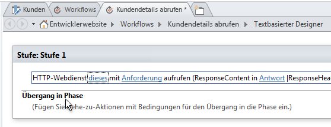
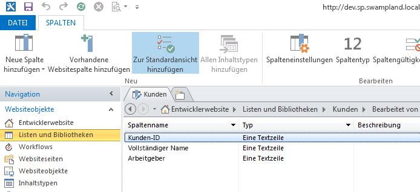
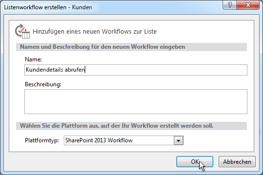
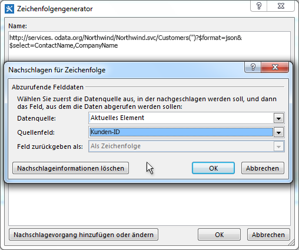
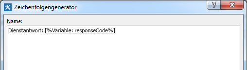
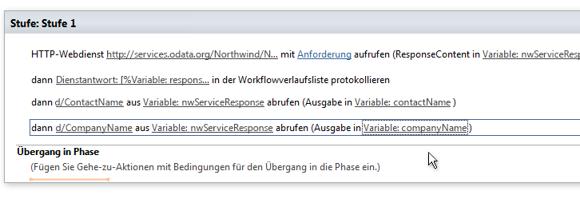
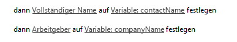
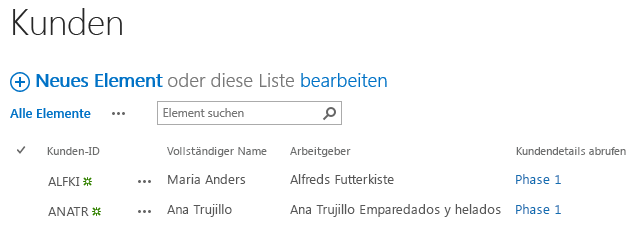

# Arbeiten mit Webdiensten in SharePoint 2013-Workflows mit SharePoint Designer 2013
Veranschaulicht, wie Webdienste in SharePoint Designer 2013-Workflows zu verwenden sind. 
 **Bereitgestellt von:** [Andrew Connell](http://social.msdn.microsoft.com/profile/andrew%20connell%20%5bmvp%5d/),  [www.AndrewConnell.com](http://www.andrewconnell.com)
  
    
    

Microsoft hat einen neuen Ansatz für Workflows in SharePoint Server 2013 gewählt. Das Workflowteam arbeitete mit dem Microsoft Azure-Team zusammen, um ein neues Produkt mit dem Namen Workflow-Manager zu entwickeln. Workflow-Manager dient als Host für die neueste Version der Windows Workflow Foundation-Laufzeit und enthält alle erforderlichen Dienste sowie die Nutzung von Microsoft Azure Service Bus zur Verbesserung der Leistung und Skalierbarkeit. Nach der Bereitstellung erfolgt die Ausführung auf die gleiche Weise, unabhängig davon, ob bei einer lokalen Bereitstellung oder Bereitstellung in der Cloud. SharePoint 2013 übergibt die Workflowausführung und alle verwandten Aufgaben an die Workflow-Manager-Farm außerhalb von SharePoint 2013.
Eine bedeutende Änderung an der Workflowarchitektur ist, dass jetzt alle Workflows auf einer Designeroberfläche erstellt werden, einschließlich solcher, die mit Visual Studio 2012 erstellt wurden. In früheren Versionen von SharePoint waren mit Visual Studio 2012 entwickelte Workflows nicht ausschließlich deklarativ. Stattdessen stellten sie eine Kombination aus deklarativem XAML und einer kompilierten Assembly dar, die die Workflow-Geschäftslogik enthielt.
  
    
    

Für Benutzer, die in der Vergangenheit Workflows mit SharePoint Designer erstellt haben, ist dies nichts Neues. Workflows, die mit SharePoint Designer erstellt wurden, waren immer deklarativ. Diese Änderung stellt einen Vorteil für Benutzer dar, die Workflows mit SharePoint Designer 2013 erstellen, da SharePoint Designer 2013-Workflows nun das Aufrufen und Verarbeiten von Webdiensten unterstützten.
## Warum sind Web Services für SharePoint 2013-Workflows wichtig

Beginnen wir mit Szenarien, in denen das Verwenden von Webdiensten sinnvoll ist. In SharePoint 2007 oder SharePoint 2010 wurde das Schreiben von benutzerdefiniertem Code häufig zum Erstellen von Workflows mit Visual Studio verwendet, da dies die beste Möglichkeit zur Durchführung von Berechnungen oder Implementierung benutzerdefinierter Geschäftslogik war.
  
    
    
Für Benutzer von SharePoint Designer 2013, die keine Entwickler waren, war dies jedoch nicht so einfach. Bei Anwendungsfällen, die nicht mit vorhandenen Workflowaktionen gelöst werden konnten, mussten sie Entwickler darum bitten, eine benutzerdefinierte Aktion zu schreiben. Dies war häufig schwierig, da sie nur Code für den Sandkasten (in einer gehosteten Umgebung) erstellen, oder nur voll vertrauenswürdige Lösungen in einer lokalen Bereitstellung verwenden konnten. In anderen Fällen mussten Workflows an einen Entwickler übergeben werden, damit er eine voll vertrauenswürdige Lösung erstellt, da das, was erforderlich war, nicht in SharePoint Designer zu erzielen war.
  
    
    
Die gute Nachricht: Wenn bei SharePoint 2013 in SharePoint Designer 2013 eine benötigte Aktion fehlt, müssen Sie lediglich einen benutzerdefinierten Webdienst erstellen. Und das Erstellen eines benutzerdefinierten Webdiensts ist viel einfacher als das Erstellen einer benutzerdefinierten Aktion. Während eine benutzerdefinierte Aktion jedoch nur von dem Workflow, in dem sie installiert ist (oder am besten nur von einem SharePoint-Workflow), verwendet werden kann, kann ein benutzerdefinierter Webdienst jedoch übertragen und von einer beliebigen Anzahl von Benutzern verwendet werden.
  
    
    
Das Beste ist wahrscheinlich die Tatsache, dass in Fällen mit einem vorhandenen Webdienst, auf den Sie zugreifen - entweder ein öffentlicher oder ein privater -, der von Ihrem Unternehmen gehostet wird, SharePoint Designer 2013 eine Aktion bietet, die Sie verwenden können, um den Webdienst aufzurufen. Sie sind nicht mehr auf einen Entwickler angewiesen, wenn Sie einen vorhandenen Webdienst aufrufen müssen. .
  
    
    
Während SharePoint 2013 jede Art von Webdienst nutzen kann, ist es am einfachsten (und empfohlen), Webdienste zu verwenden, die Daten mithilfe der standardmäßigen  [OData](http://www.odata.org/)-Formate von  [Atom](http://msdn.microsoft.com/de-de/library/ff478141.aspx) oder [JSON](http://json.org/) (JavaScript Object Notation) akzeptieren und zurückgeben.
  
    
    
Diese Empfehlung basiert auf der Unterstützung dieser OData-Formate in SharePoint 2013-Tools zum Erstellen von Workflows (sowohl in SharePoint Designer 2013 als auch in Visual Studio 2012). Beide Tools unterstützen das Erstellen von Nutzlasten zur Übermittlung an den Dienst und für die Verarbeitung der Antworten, die von Webdiensten zurückgegeben wurden. Darüber hinaus unterstützen die OData-Formate die Kommunikation mit anonymen Webdiensten und mit solchen, die mit verschiedenen Arten der Authentifizierung geschützt sind. Kurz gesagt, Sie haben die vollständige Kontrolle über die Anforderung und Antwort für jeden Dienstaufruf. Dadurch können Sie eine Reihe von Aktivitäten in einem Workflow zunächst mit einem Dienst authentifizieren und einen OAuth-Token abrufen, und dann das Token in zukünftigen Anforderungen für Dienste einschließen, die mit dem  [OAuth 2.0](http://oauth.net/2/)-Protokoll geschützt sind.
  
    
    

## Verwenden von Webdiensten in SharePoint-Workflows

Das Aufrufen von Webdiensten aus Workflows, die SharePoint 2013 verwenden, erfolgt in zwei Schritten: zuerst erfolgt der Aufruf des Webdiensts und dann der Datenaustausch mit dem Webdienst.
  
    
    
In SharePoint 2013-Workflows wird ein Webdienst mithilfe einer neuen in SharePoint 2013 aufgeführten Aktion mit dem Namen **Call HTTP Web Service** aufgerufen. Diese Aktion ist flexibel und ermöglicht es Ihnen, mühelos einen Webdienst aufzurufen, bei Bedarf komplexere Anrufe mithilfe von HTTP-Verben zu erstellen oder HTTP-Header hinzuzufügen. Abbildung 1 veranschaulicht die **Call HTTP Web Service**-Aktion auf der SharePoint Designer 2013-Oberfläche.
  
    
    

**Abbildung 1. SharePoint Designer 2013-Stufe, die die Aktion "HTTP-Webdienst aufrufen" darstellt.**

  
    
    

  
    
    

  
    
    
Mit der **Call HTTP Web Service**-Aktion können Sie zahlreiche Anforderungsmethoden angeben, einschließlich **GET**, **PUT**, **POST** und **DELETE**. Damit können Sie festlegen, welche Aktion Webdienste, insbesondere  [REST](http://msdn.microsoft.com/de-de/library/office/jj164022.aspx)-Dienste, für einen mit der URI-Eigenschaft für die Aktivität festgelegten Dienst durchführen sollen.
  
    
    
Um alle Eigenschaften eines bestimmten Elements abzurufen, enthält die Dienst-URL beispielsweise die eindeutige Adresse des Elements, und die Methode wird auf **GET** festlegen. Beim Löschen eines Elements ist der Prozess identisch, außer Sie legen die Methode auf **DELETE** fest. Das gleiche gilt für die Aktualisierung eines Elements, außer für das Festlegen der Methode auf **POST**. Legen Sie beim Erstellen eines Elements die URL auf die eindeutige Adresse der Sammlung fest, in der das Element erstellt werden soll, und legen Sie die Methode auf **POST** fest. Beim Erstellen oder Aktualisieren von Elementen verwenden Dienste im Allgemeinen Daten, die Sie als Inhalt in der Anforderung übergeben, und verwenden anschließend die **request**-Eigenschaft für die **Call HTTP Web Service**-Aktion.
  
    
    
Der zweite Schritt bei der Arbeit mit Webdiensten umfasst das Senden von Daten an und Empfangen von Daten von einem Webdienst, was Sie mit der **request**- oder **response**-Eigenschaft für die **Call HTTP Web Service**-Aktion durchführen können. Beachten Sie, dass Daten nicht als Stream, sondern als als eine komplexe Struktur mithilfe des  [dynamischen Wert](http://msdn.microsoft.com/de-de/library/windowsazure/microsoft.activities.dynamicvalue%28v=azure.10%29.aspx)-Objekts übergeben werden. (Weitere Informationen zu dynamischen Werten finden Sie unter  [Grundlegendes zum dynamischen Wert](http://msdn.microsoft.com/de-de/library/windowsazure/jj193505%28v=azure.10%29.aspx).)
  
    
    
Datenstrukturen dynamischer Werte sind JavaScript Object Notation (JSON)-Zeichenfolgen. Mit dem von Microsoft bereitgestellten Objekttyp **DynamicValue**, der zum Speichern von hierarchischen Daten und der Antwort auf einen Webdienstaufruf verwendet werden kann, sind Sie beim Erstellen und manuellen Bearbeiten von Zeichenfolgen nicht mehr auf einen Entwickler angewiesen. 
  
    
    
Es gibt eine Reihe von mit dem **DynamicValue**-Typ verknüpfter Aktivitäten, die zum Berechnen der Anzahl von Elementen in der Antwort, zum Extrahieren von Werten aus der Antwort oder zum Erstellen einer neuen Struktur für die Aktualisierung oder Erstellung von Elementen verwendet werden können. Beachten Sie, dass SharePoint Designer 2013 das direkte Arbeiten mit dem **DynamicValue**-Typ nicht unterstützt, und beim Erstellen von Workflows stattdessen der **Dictionary**-Typ verwendet wird.
  
    
    

## Erstellen von Webdiensten für SharePoint 2013-Workflows

Wir haben erfahren, dass SharePoint Designer 2013 das Aufrufen von Webdiensten unterstützt, das Aufrufen von benutzerdefiniertem Code aus Workflows jedoch  *nicht*  unterstützt. Daher müssen Sie wissen, wie Sie einen Webdienst erstellen, wenn Sie die Funktionalität Ihrer Workflows über die Standardaktionen hinaus erweitern möchten.
  
    
    
Glücklicherweise sind einige Optionen zum Erstellen von benutzerdefinierten Webdiensten für die Verwendung in SharePoint 2013-Workflows vorhanden. Insbesondere ist die **HttpSend**-Aktivität zusammen mit dem **DynamicValue**-Datentyp ideal für das Erstellen von REST-Webdiensten, die mit dem OData-Protokoll konform sind.
  
    
    
 OData ist ein Protokoll zum Erstellen und Verwenden von Daten auf Grundlage der Grundsätze der REST-Dienste. Es wurde entwickelt, um den Austausch von Daten über ausgereifte, zuverlässige und robuste HTTP-Protokolle zu standardisieren. Nachdem die OData-Spezifikation abgeschlossen war, haben verschiedene Organisationen das Protokoll in eigene Technologiestapel implementiert. Microsoft hat eine eigene Version von OData, [WCF Data Services](http://msdn.microsoft.com/de-de/library/hh487257%28v=vs.103%29.aspx), implementiert.
  
    
    
Im folgenden werden zwei gängige Szenarien erläutert, in denen REST-Webdienste für Workflowentwickler nützlich sind:
  
    
    

- Implementieren von OData-Dienst-CRUD-Q-Vorgängen
    
  
- Implementieren von OData-Vorgängen
    
  

### Implementieren von OData-Dienst-CRUD-Q-Vorgängen

Eine häufige Verwendung für Webdienste ist das Ausführen von einfachen Erstell-, Lese-, Aktualisierungs-, Lösch- und Abfrage (CRUD-Q)-Vorgängen für Daten in einer Datenbank. Es ist relativ einfach, einen OData-Webdienst für einen SharePoint 2013-Workflow-WCF-Datendienst zu erstellen, einen von einem Workflow unter Verwendung von  [WCF Data Services ](http://msdn.microsoft.com/de-de/library/cc668792.aspx),  [www.OData.org](http://www.odata.org) verwendeten OData-Dienst usw.
  
    
    
Mit der Annahme, dass Sie bereits eine Datenbank haben, die ausgeführt werden kann, sind vier einfache Schritte erforderlich:
  
    
    

1. Erstellen Sie ein Datenbankmodell mithilfe von Microsoft  [Entity Framework](http://msdn.microsoft.com/de-de/data/aa937723). Es ist kein Code erforderlich, da das Erstellen auf einem Assistenten in Visual Studio basiert. Weitere Informationen finden Sie unter  [Entity Framework 4 und WCF Data Services 4.0 in Visual Studio 2010](http://msdn.microsoft.com/de-de/magazine/ee336128.aspx) und [Verbesserungen an Entity Framework Designer in Visual Studio 2012](http://msdn.microsoft.com/en-us/magazine/jj721589.aspx).
    
  
2. Erstellen Sie einen WCF-Datendienst. Es ist kein Code in diesem Visual Studio-Assistenten erforderlich. Weitere Informationen finden Sie unter  [Exemplarische Vorgehensweise: Erstellen von und Zugreifen auf einen WCF-Datendienst in Visual Studio](http://msdn.microsoft.com/de-de/library/vstudio/cc668184.aspx).
    
  
3. Legen Sie in der Dienstcodedatei den Namen des Entitätsmodells fest, den Sie in Schritt 1 für die Quelle des Diensts erstellt haben. Legen Sie dann den Zugriff und die Berechtigung für die Entitäten im Modell fest (beide Schritte in weniger als zwei Codezeilen implementiert).
    
  
4. Veröffentlichen Sie den Dienst an einem Speicherort, auf den Workflow-Manager zugreifen kann.
    
  

### Implementieren von OData-Vorgängen

Es ist sehr wahrscheinlich, dass der Workflow eine bestimmte Geschäftslogik ausführen möchte, die nicht in das eingeschränkte CRUD-Q-Modell passt. Es gibt möglicherweise einen OData-Dienst, der CRUD-Q-Vorgänge beim Erstellen eines neuen Bankdarlehens unterstützt. Dieser Dienst kann auch Benutzer dazu auffordern, den Dienst aufzurufen und die Kreditwürdigkeit anzugeben, um den aktuellen Zinssatz abzurufen. Eine solche Aufgabe überschreitet die Möglichkeiten einfacher CRUD-Q-Vorgänge, da hierbei eine Methode aufgerufen, als ganze Zahl übergeben und eine Antwort empfangen wird.
  
    
    
Sie können dieses Szenario jedoch mithilfe von OData und WCF Data Services unterstützen, über die Sie  [Dienstvorgänge](http://msdn.microsoft.com/de-de/library/cc668788.aspx) implementieren können. Dienstvorgänge kommen häufig vor und werden sogar in SharePoint 2013-Diensten verwendet. Wenn SharePoint beispielsweise eine bestimmte Liste mit dem Adressformat `http://[..]/_api/web/lists/GetByTitle('ListTitle')` erhält, stellt die **GetByTitle()**-Funktion in der Adresse einen Dienstoperator dar, der vom SharePoint 2013-Team erstellt wurde. Entwickler erstellen in der Regel ihre benutzerdefinierten Dienstvorgänge in Webdiensten, die Sie mit WCF Data Services erstellen.
  
    
    

## Erstellen eines Workflows mit SharePoint Designer 2013

Die folgende exemplarische Vorgehensweise veranschaulicht das Erstellen eines benutzerdefinierten Workflows, der den OData-Webdienst der Northwind-Datenbank aufruft, die öffentlich auf der  [www.odata.org](http://www.odata.org)-Website gehostet wird. In diesem Beispiel gibt der Kunde eine Kunden-ID ein und startet dann den Workflow, der mit der Kunden-ID den Webdienst zum Erfassen von zusätzlichen Kundeninformationen abfragt, insbesondere vollständiger Name des Kunden und der Arbeitgeber. Der Workflow verwendet dann diese Informationen zum Aktualisieren des Elements der Liste durch Hinzufügen des vollständigen Kundennamens und des Arbeitgebers.
  
    
    

### Erstellen einer Kundenliste

1. Erstellen Sie in SharePoint Designer 2013 eine Kundenliste mit dem Namen "Kunden".
    
  
2. Benennen Sie das Feld **Titel**in **Kunden-ID** um.
    
  
3. Fügen Sie zwei neue Felder vom Typ **String** hinzu, und geben Sie die Namen **Vollständiger Name** und **Arbeitgeber**für diese ein, wie in Abbildung 2 dargestellt.
    
   **Abbildung 2. Erstellen der Kundenliste in SharePoint Designer 2013**

  

  

  

  

### Erstellen des Workflows

1. Wählen Sie im Navigationsbereich in SharePoint Designer 2013 die Option **Workflows**.
    
  
2. Klicken Sie auf dem Menüband auf die Schaltfläche **Listenworkflows**, und wählen Sie **Kunden** aus der resultierenden Dropdownliste.
    
  
3. Geben Sie für den Workflow den Namen "Abrufen von Kundendetails" ein.
    
  
4. Legen Sie **Plattformtyp** auf **SharePoint 2013-Workflow**, wie in Abbildung 3 dargestellt.
    
   **Abbildung 3. Erstellen eines neuen Listenworkflows mit SharePoint Designer 2013**

  

  

  

  

### Abfragen des Webdiensts für die Kundendetails

Nachdem der Workflow erstellt wurde, soll dieser für das Aufrufen eines Webdienst aktiviert werden, indem eine Aktion **HTTP-Webdienst aufrufen** zu der standardmäßigen Workflowstufe hinzugefügt wird.
  
    
    

1. Klicken Sie auf **diesen Link**.
    
  
2. Klicken Sie rechts neben des Textfelds ** URL des HTTP-Webdiensts eingeben** auf die Generator-Schaltfläche ( **…**), um das Dialogfeld **Zeichenfolgengenerator** zu öffnen.
    
  
3. Geben Sie in **Zeichenfolgengenerator** die folgende URL ein: `http://services.odata.org/Northwind/Northwind.svc/Customers('CUSTOMERID')?$format=json&amp;$select=ContactName,CompanyName`.Beachten Sie, dass der " `$select`"-Abschnitt der URL nur die für diese Liste relevanten Felder abruft. 
    
  
4. Suchen Sie in der URL nach dem URL-Abschnitt  `CUSTOMERID` und entfernen Sie diesen. Lassen Sie die Klammern und die einfachen Anführungszeichen stehen.
    
  
5. Klicken Sie zum dynamischen Erstellen der vollständigen URL auf die Schaltfläche **Nachschlagevorgang hinzufügen oder ändern** im **Zeichenfolgengenerator**.
    
  
6. Legen Sie im daraus resultierenden Dialogfeld **Nachschlagevorgang für Zeichenfolge** die **Datenquelle** auf **Aktuelles Element** und **Quellenfeld** auf **CustomerId** fest, wie in Abbildung 4 dargestellt.
    
   **Abbildung 4. Dynamisches Erstellen der URL für die Webdienstanforderung**

  

  

  

  
7. Klicken Sie auf **OK**, dann noch mal auf **OK**, um die neue URL zu bestätigen.
    
    Nachdem der Webdienst zum Empfangen von Ergebnissen vom Webdienst konfiguriert ist, müssen als Nächstes die Ergebnisse in einer anderen Variablen gespeichert werden.
    
  
8. Klicken Sie in der Aktion ** HTTP-Webdienst aufrufen** auf den Link **Antwort** in der Aktion, erstellen Sie eine neue Variable vom Typ **Dictionary**, und geben Sie für diese den Namen **nwServiceResponse** ein.
    
    Die gesamte Aktion **HTTP-Webdienst aufrufen** ist wahrscheinlich nicht sichtbar, da sie aus einem langen Satz im Designer besteht. Scrollen Sie nach rechts, und beachten Sie, dass der Antwortstatuscode in einer Variablen mit dem Namen **responseCode** gespeichert ist. Dies ist hilfreich und kann zu einer Statistikseite der Workflowinstanz mithilfe der Workflowverlaufsliste geschrieben werden.
    
  
9. Fügen Sie eine Aktion **In Verlaufsliste protokollieren** nach der Aktion **HTTP-Webdienst aufrufen** hinzu, und legen Sie **Meldung** fest, um den Statuscode für die Antwort für das Protokoll zu schreiben, wie in Abbildung 5 dargestellt.
    
   **Abbildung 5. Schreiben des Webdienst-Antwortcodes für die Verlaufsliste**

  

  

  

  

### Extrahieren von Werten aus der Antwort

Nachdem die Webdienstantwort in der **nwServiceResponse**-Variablen gespeichert wurde, werden nun im folgenden Schritt diese Variablen extrahiert und in lokalen Variablen platziert.
  
    
    
Hierzu werden zwei Aktionen **Element aus Wörterbuch abrufen** zum Workflow hinzugefügt. Beachten Sie, dass der Pfad zum Element, aus dem ein Wert extrahiert wird, mit der Antwortstruktur übereinstimmen und ein bestimmtes Format aufweisen muss. Geben Sie die URL im Browser ein, um die Antwort zu prüfen. Beachten Sie, dass die Ergebnisse innerhalb des Objekts mit dem Namen **d** verschachtelt sind. Aus diesem Grund lautet der Pfad zum Feld **CompanyName** in der Webdienstantwort `d/CompanyName`.
  
    
    

1. Hinzufügen von zwei **Element aus Wörterbuch abrufen**-Aktionen zum Workflow .
    
  
2. Legen Sie für die erste dieser neuen Aktionen **Element nach Name oder Pfad** auf `d/ComopanyName` fest.
    
  
3. Legen Sie den **Wörterbuch**-Link auf **nwServiceResponse** fest.
    
  
4. Legen Sie den **Element**-Link auf eine neue **String**-Variable mit dem Namen **CompanyName** fest.
    
  
5. Wiederholen Sie die Schritte 2, 3 und 4 für die zweite **Element aus Wörterbuch abrufen**-Aktion. Verwenden Sie dabei jedoch **ContactName** anstelle von "CompanyName", wie in Abbildung 6 dargestellt.
    
   **Abbildung 6. Extrahieren von Werten aus der Webdienst-Wörterbuchantwort**

  

  

  

  

### Aktualisieren des Listenelements

Im letzten Schritt wird das Listenelement mithilfe von zwei **Feld im aktuellen Element festlegen**-Aktionen aktualisiert. Damit werden die Felder in diesem Listenelement auf die in den erstellten Variablen gespeicherten Werte festgelegt, wie in Abbildung 7 dargestellt.
  
    
    

**Abbildung 7. Aktualisieren des Listenelements**

  
    
    

  
    
    

  
    
    
Abschließend geht es um den Abschluss des Abschnitts **Übergang in Phase** der Workflowstufe.
  
    
    

1. Fügen Sie eine **Zur Stufe wechseln**-Aktion hinzu.
    
  
2. Wählen Sie **Ende des Workflows**.
    
  
3. Speichern und veröffentlichen Sie den Workflow.
    
  

### Testen des Workflows

1. Öffnen Sie einen Browser, und navigieren Sie zur Liste **Kunden**.
    
  
2. Fügen Sie die zwei Kunden-IDs hinzu, die sich im Northwind-Dienst in zwei neuen Listenelementen, **ALFKI** und **ANATR**, befinden.
    
  
3. Starten Sie die Workflows manuell, indem Sie jedes Element auswählen und dann auf die Schalfläche **Workflows** auf dem Menüband klicken.
    
  
4. Wählen Sie den Workflow **Kundendetails abrufen**.
    
    Zu diesem Zeitpunkt wird der Workflow wird gestartet, und sendet eine Abfrage an den Webdienst.
    
  
5. Navigieren Sie zurück zur Liste **Kunden**, und aktualisieren Sie die Seite. Es können mehrere Aktualisierungsvorgänge notwendig sein, bis der Workflow abgeschlossen ist, sie sollte jedoch in etwa wie in Abbildung 8 dargestellt aussehen.
    
   **Abbildung 8. Durch benutzerdefinierten Workflow aktualisierte Listenelemente**

  

  

  

  

## Zusammenfassung

In SharePoint 2013wurde durch ein neues Produkt, Workflow-Manager 1.0, eine neue Workflowarchitektur eingeführt. Zur Gewährleistung, dass alle benutzerdefinierten Workflows unabhängig von der Art der SharePoint 2013-Bereitstellung, lokal oder in Office 365 gehostet, funktionieren, sind sie nun alle zu 100 % deklarativ. Die hinzugefügte Unterstützung für das Aufrufen von Webdiensten aus in SharePoint Designer 2013 erstellten Workflows bietet im Vergleich mit den vorherigen Versionen einen flexibleren und leistungsstärkeren Prozess zum Erstellen von Workflows.
  
    
    
 Microsoft hat die Unterstützung für das Aufrufen von Webdiensten in Workflow-Manager unter Verwendung der neuen **Call HTTP Web Service**-Aktion inSharePoint Designer 2013 eingeführt. In Workflow-Manager wurde auch die Unterstützung für das Erstellen von Strukturen zur Übermittlung an Webdienste sowie für die Verwendung ihrer Antworten mithilfe des **Dictionary**-Variablentyps eingeführt. Verwenden Sie beim Erstellen von Workflows den **Dictionary**-Typ und verknüpfte Aktionen in SharePoint-Workflows, die externe Webdienste verwenden.
  
    
    

## Weitere Ressourcen

-  [Workflows in SharePoint 2013](workflows-in-sharepoint-2013.md)
    
  
-  [OData](http://www.odata.org/)
    
  
-  [Einführung in JSON](http://json.org/)
    
  
-  [Erste Schritte mit dem SharePoint 2013 REST-Dienst](http://msdn.microsoft.com/de-de/library/office/fp142380.aspx)
    
  
-  [Entity Framework 4.0 und WCF Data Services 4.0 in Visual Studio 2010](http://msdn.microsoft.com/de-de/magazine/ee336128.aspx)
    
  

  
    
    

