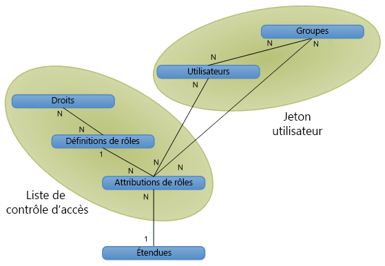

# Autorisation, utilisateurs, groupes et modèle objet dans SharePoint 2013

Dans SharePoint 2013, l'accès à des sites web, des listes, des dossiers et des éléments de liste est contrôlé par un système d'appartenance basé sur les rôles, par lequel les utilisateurs sont affectés à des rôles qui autorisent leur accès aux objets SharePoint 2013.
  
    
    

Pour autoriser un utilisateur à accéder à un objet, vous pouvez l'ajouter à un groupe qui est déjà autorisé à accéder à l'objet, ou vous pouvez créer un objet d'attribution de rôle, définir l'utilisateur pour l'attribution de rôle, lier éventuellement l'attribution de rôle à la définition de rôle appropriée avec des autorisations de base, puis ajouter l'attribution à la collection d'attributions de rôles pour l'élément de liste, le dossier, la liste ou le site web. Si vous ne liez pas l'attribution de rôle à une définition de rôle lors de l'affectation d'un utilisateur à un rôle, l'utilisateur n'obtient pas l'autorisation.
Plusieurs méthodes permettent de contrôler l'accès aux objets SharePoint 2013 :
  
    
    

- Les objets peuvent utiliser les mêmes autorisations que le site web, la liste ou le dossier parent (héritant à la fois des rôles et des utilisateurs disponibles sur l'objet parent), ou ils peuvent utiliser des autorisations uniques. 
    
  
- Les sites, listes, dossiers et éléments de liste fournissent des collections d'affectations de rôles, ce qui permet une gestion précise de l'accès des utilisateurs aux objets.
    
  
- Les groupes sont composés d'utilisateurs et peuvent être ou ne pas être affectés à des rôles. SharePoint 2013 comprend les trois groupes suivants par défaut :
    
  - **owners** (administrateur)
    
  
  - **members** (collaborateur)
    
  
  - **visitors** (lecteur)
    
  

    Lorsque vous créez un site web avec des autorisations uniques par le biais de l'interface utilisateur, vous êtes dirigé vers une page où vous pouvez affecter des utilisateurs à ces groupes dans le cadre de la mise en service du site.
    
  
- L'accès anonyme permet aux utilisateurs de contribuer de manière anonyme à des listes et des enquêtes, ou d'afficher des pages de manière anonyme. Vous pouvez également accorder l'accès à « tous les utilisateurs authentifiés » pour permettre à tous les membres de votre domaine d'accéder à un site web sans avoir à activer l'accès anonyme. 
    
  
- Les droits de création de site ( **CreateSSCSite** et **ManageSubwebs**) déterminent si les utilisateurs peuvent créer des sites web de niveau supérieur, des sous-sites ou des espaces de travail.
    
  
Les utilisateurs deviennent membres d'un objet SharePoint soit indirectement via un groupe qui a une affectation de rôle, ou directement via une affectation de rôle. Les utilisateurs peuvent également être membres d'un groupe de domaine Microsoft Windows NT qui est ajouté à un groupe ou à un rôle. Une définition de rôle associe un utilisateur ou groupe à un seul droit ou un ensemble de droits correspondant à des valeurs de l'énumération  [Microsoft.SharePoint.SPBasePermissions](https://msdn.microsoft.com/library/Microsoft.SharePoint.SPBasePermissions.aspx) . Chaque utilisateur ou groupe a un [ID](https://msdn.microsoft.com/library/Microsoft.SharePoint.SPMember.ID.aspx) de membre unique.Vous pouvez utiliser le modèle objet pour créer ou modifier les attributions et les définitions de rôles différemment de la façon dont vous le faites avec la fonctionnalité du fichier addrole.aspx et du fichier editrole.aspx. Contrairement à ces pages, qui sont présentées dans l'interface utilisateur, le modèle objet n'applique pas la dépendance des droits, de sorte que vous pouvez créer une définition de rôle avec une combinaison de droits arbitraire. Soyez prudent, cependant, lorsque vous utilisez le modèle objet pour personnaliser des définitions de rôles et des autorisations, car une définition de rôle planifiée de manière incorrecte et des droits indûment attribués peuvent conduire à une expérience utilisateur insatisfaisante.Pour plus d'informations sur les droits dans SharePoint 2013, voir  [SPBasePermissions](https://msdn.microsoft.com/library/Microsoft.SharePoint.SPBasePermissions.aspx) .
## Stratégie de sécurité

Une stratégie de sécurité permet de renforcer la sécurité uniforme dans toutes les collections de sites d'une application web (serveur virtuel). Grâce à la stratégie, vous pouvez attribuer un rôle, ou un ensemble de droits, à des utilisateurs SharePoint 2013 individuels et à des groupes de domaines à l'aide de l'authentification Windows ou de systèmes d'authentification enfichable, mais pas à des groupes SharePoint. Chaque entrée de stratégie spécifie les droits d'un utilisateur ou d'un groupe dans l'application web.
  
    
    
La stratégie est définie au niveau de l'application web logique ou au niveau de la zone. Par exemple, un utilisateur peut avoir plusieurs stratégies sur  `http://Server` et `http://Server.extranet.microsoft.com`, même si les deux applications web ont le même contenu.
  
    
    
Les droits peuvent être accordés ou refusés par l'intermédiaire de la stratégie. L'octroi d'un droit à un utilisateur lui permet d'en bénéficier sur tous les objets sécurisés dans l'application web, indépendamment des autorisations locales appliquées à l'objet. Le refus d'un droit correspond à une priorité plus élevée que l'octroi d'un droit, et bloque activement ce droit pour l'utilisateur ou le groupe sur tous les objets sécurisés dans l'application web. Le fait de n'accorder aucun droit à un utilisateur l'empêche d'accéder à l'ensemble du contenu, même s'il dispose d'autorisations explicites pour un contenu spécifique : la stratégie remplace les autorisations au niveau du site.
  
    
    
Dans les rôles de stratégie, les utilisateurs et les groupes sont identifiés à la fois par leur identificateur de sécurité (SID) et par leur nom de connexion ou d'utilisateur. L'application d'un rôle de stratégie est une procédure semblable à la gestion des autorisations pour un site web, une liste, un dossier ou document : vous ajoutez des utilisateurs ou des groupes et les affectez à une ou plusieurs définitions de rôles. Chaque application web dispose de ses propres rôles de stratégie. Une autre différence entre les rôles de stratégie et la gestion des autorisations porte sur le fait que les administrateurs centraux peuvent refuser un droit à un utilisateur par l'intermédiaire d'une application web.
  
    
    

> **REMARQUE**
> Les rôles de stratégie de l'Administration centrale diffèrent des définitions de rôles d'une collection de sites. 
  
    
    

## Utilisateurs, groupes et principaux

Un utilisateur individuel ( [SPUser](https://msdn.microsoft.com/library/Microsoft.SharePoint.SPUser.aspx) ) accède à un objet SharePoint directement via une attribution de rôle individuelle, ou indirectement via l'appartenance, soit à un groupe de domaine, soit à un groupe SharePoint ( [SPGroup](https://msdn.microsoft.com/library/Microsoft.SharePoint.SPGroup.aspx) ) qui comporte une attribution de rôle. Dans le cas d'une attribution de rôle directe, l'utilisateur est le principal ( [SPPrincipal](https://msdn.microsoft.com/library/Microsoft.SharePoint.SPPrincipal.aspx) ). Dans le cas d'une attribution de rôle via un groupe de domaines ou un groupe SharePoint, le groupe de domaines ou le groupe SharePoint est le principal.
  
    
    
SharePoint Server prend en charge les utilisateurs Windows (par exemple,  _DOMAINE_\\ _Alias_utilisateur_) et les utilisateurs externes (via l'authentification enfichable). L'identité de l'utilisateur est conservée par le système de gestion des identités (par exemple, le service d'annuaire Active Directory). Le profil utilisateur (qui comprend le nom d'affichage de l'utilisateur, son adresse électronique et d'autres informations) est étendu au niveau de la collection de sites. La modification d'un nom d'affichage a une incidence sur toute la collection de sites.
  
    
    
Un groupe est un ensemble d'utilisateurs via lequel SharePoint Server gère la sécurité. La gestion basée sur les utilisateurs est facile pour les sites simples, mais devient plus complexe quand le nombre de ressources sécurisées de manière unique augmente. Par exemple, un utilisateur peut disposer du rôle **Contribute** pour la liste 1, du rôle **Read** pour la liste 2 et du rôle **Design** pour la liste 3. Ce modèle n'est pas adapté pour, par exemple, 50 000 utilisateurs, car les listes de contrôle d'accès (ACL) comporteraient alors 50 000 entrées de contrôle d'accès (ACE) sur chaque objet sécurisé de manière unique.
  
    
    
Les groupes apportent une réponse aux problèmes de simplicité de gestion et d'échelle de la gestion d'autorisations basées sur les utilisateurs. La gestion basée sur les groupes peut être plus abstraite ou plus difficile à conceptualiser, mais elle permet une gestion plus facile des sites complexes avec de nombreux objets sécurisés de manière unique. Par exemple, lorsque vous ajoutez un utilisateur à un groupe qui a déjà reçu le rôle approprié pour plusieurs objets du système, la vérification des autorisations des groupes est mieux adaptée car beaucoup moins d'entrées de contrôle d'accès de groupe doivent être stockées.
  
    
    
SharePoint Server prend en charge deux types de groupes : les groupes de domaines et les groupes SharePoint. Les groupes de domaines restent en dehors du contrôle de SharePoint Server ; les utilisateurs ne peuvent pas utiliser SharePoint Server pour définir, parcourir ou modifier l'appartenance à un groupe de domaines. Les groupes SharePoint sont étendus au niveau des collections de sites et peuvent être utilisés uniquement à l'intérieur de la collection de sites. Les groupes de domaines peuvent être utilisés n'importe où dans l'étendue du service d'annuaire Active Directory.
  
    
    
Un principal est un utilisateur ou un groupe utilisé pour contrôler la sécurité. Si vous ajoutez un utilisateur à un site, l'utilisateur est le principal, mais si vous ajoutez un groupe au site, le groupe est le principal. L'élément clé pour définir l'échelle de la sécurité dans SharePoint Server est de maintenir un nombre raisonnable de principaux par étendue. Grâce aux groupes, un petit nombre de principaux peut être utilisé pour donner un accès à un nombre d'utilisateurs bien plus grand.
  
    
    

## Vue d'ensemble des relations objet : étendues, utilisateurs, groupes et rôles

La figure 1 présente une vue générale du système de gestion de la sécurité de SharePoint Server dans un diagramme de base de données logique. Chaque boîte représente un objet de sécurité du système. Les lignes représentent les relations entre les objets. Les indications **1** et **N** représentent le type de relation. La figure montre la structure des données d'autorisation dans un jeton d'utilisateur et une liste de contrôle d'accès.
  
    
    

**Figure 1. Relations entre les objets d'autorisation**

  
    
    

  
    
    

  
    
    
Une étendue représente un objet ou un ensemble d'objets sécurisé de manière unique. Vous pouvez définir l'étendue au niveau d'un site, d'une liste, d'un dossier ou d'un élément.
  
    
    
Les utilisateurs et les groupes ont une relation plusieurs à plusieurs (N à N). Chaque utilisateur ( [SPUser](https://msdn.microsoft.com/library/Microsoft.SharePoint.SPUser.aspx) ) peut être membre de plusieurs groupes et chaque groupe ( [SPGroup](https://msdn.microsoft.com/library/Microsoft.SharePoint.SPGroup.aspx) ) peut comporter plusieurs utilisateurs.
  
    
    
Les définitions de droits et de rôle ont également une relation plusieurs à plusieurs (N à N). Chaque droit ( [SPBasePermissions](https://msdn.microsoft.com/library/Microsoft.SharePoint.SPBasePermissions.aspx) ) peut faire partie de plusieurs définitions de rôles. Par exemple, le droit **Insert List Items** est inclus dans les définitions de rôles **Contributor**, **Designer**, et **Administrator**. Chaque définition de rôle ( [SPRoleDefinition](https://msdn.microsoft.com/library/Microsoft.SharePoint.SPRoleDefinition.aspx) ) peut également comporter plusieurs droits. Par exemple, **Contributor** inclut les droits d'insertion, de mise à jour et de suppression d'éléments de liste.
  
    
    
Les définitions de rôles et les attributions de rôles ( [SPRoleAssignment](https://msdn.microsoft.com/library/Microsoft.SharePoint.SPRoleAssignment.aspx) ) ont une relation un à plusieurs (1 à N). Chaque définition de rôle est utilisée dans plusieurs attributions de rôles. Les lecteurs de la liste 1 et les lecteurs de la liste 2 peuvent être différents, mais leurs attributions de rôles peuvent partager une seule définition de rôle : **Reader**.
  
    
    
Les utilisateurs ou les groupes et les attributions de rôles ont une relation plusieurs à plusieurs (N à N). Chaque utilisateur ou groupe peut être membre de plusieurs attributions de rôles sur un objet donné. Par exemple, un utilisateur peut avoir à la fois le rôle **Designer** et le rôle **Administrator** sur le même objet.
  
    
    
Les étendues et les attributions de rôles ont une relation un à plusieurs (1 à N). Chaque étendue a plusieurs attributions de rôles, mais chaque attribution de rôle n'a qu'une seule étendue. Par exemple, un utilisateur peut être lecteur sur la liste d'événements et un autre utilisateur peut être collaborateur sur la liste d'événements, mais aucune de ces attributions de rôles ne s'applique à la liste d'annonces. Deux listes ne peuvent partager la même attribution de rôle que si elles héritent des autorisations du conteneur parent, auquel cas l'étendue de sécurité est le conteneur, pas les deux listes.
  
    
    

## Jetons d'utilisateur et listes de contrôle d'accès

Pour accélérer la vérification des autorisations, SharePoint Server implémente des jetons d'utilisateur et des listes de contrôle d'accès dans son modèle de sécurité. Le jeton d'utilisateur identifie le processus d'authentification appliqué à un utilisateur. Un utilisateur Windows a un jeton complexe : une chaîne unique pour l'utilisateur (SID) et une liste de tous les groupes de domaines Windows de l'utilisateur (par exemple,  _DOMAINE_\\Service 15688). Un utilisateur qui n'a pas d'authentification Windows peut avoir un jeton très simple avec une chaîne unique pour le nom d'utilisateur, ou un jeton complexe avec l'appartenance au groupe/rôle, tel que cela a été exprimé dans l'authentification Windows. L'appartenance à un groupe SharePoint pour chaque utilisateur est exprimée par un jeton d'utilisateur de sorte que, lorsque SharePoint Server lit le jeton d'utilisateur, tous les groupes de l'utilisateur actuel sont identifiés.
  
    
    
Une liste de contrôle d'accès (ACL) est un objet binaire qui détermine les droits dont disposent les utilisateurs et les groupes sur un objet donné. Une ACL comporte plusieurs ACE, chaque principal de sécurité (utilisateur ou groupe) étant une ACE dans l'ACL. Les droits, les définitions de rôles et les attributions de rôles s'organisent en ACL pour chaque étendue, de sorte que SharePoint Server sait ce que chaque utilisateur ou groupe est autorisé à faire à l'intérieur de l'étendue donnée.
  
    
    

## Modifications des modèles objet : objets de sécurité obsolètes mais à compatibilité descendante

Dans SharePoint 2013, toutes les étendues d'objets partagent la même expérience de gestion des autorisations de base. SharePoint 2013 gère les autorisations par l'intermédiaire des définitions de rôles, ce qui permet une expérience cohérente au niveau de la liste, du dossier et de l'élément. Les objets de sécurité suivants utilisés dans Windows SharePoint Services 2.0 sont obsolètes, mais continuent à fonctionner pour la compatibilité descendante :
  
    
    

-  [Microsoft.SharePoint.SPPermission](https://msdn.microsoft.com/library/Microsoft.SharePoint.SPPermission.aspx)
    
  
-  [Microsoft.SharePoint.SPPermissionCollection](https://msdn.microsoft.com/library/Microsoft.SharePoint.SPPermissionCollection.aspx)
    
  
-  [Microsoft.SharePoint.SPRights](https://msdn.microsoft.com/library/Microsoft.SharePoint.SPRights.aspx)
    
  
-  [Microsoft.SharePoint.SPRole](https://msdn.microsoft.com/library/Microsoft.SharePoint.SPRole.aspx)
    
  
-  [Microsoft.SharePoint.SPRoleCollection](https://msdn.microsoft.com/library/Microsoft.SharePoint.SPRoleCollection.aspx)
    
  
Pour affecter des utilisateurs à des rôles, utilisez les membres de la classe  [Microsoft.SharePoint.SPRoleAssignment](https://msdn.microsoft.com/library/Microsoft.SharePoint.SPRoleAssignment.aspx) et de la classe [Microsoft.SharePoint.SPRoleAssignmentCollection](https://msdn.microsoft.com/library/Microsoft.SharePoint.SPRoleAssignmentCollection.aspx) . L'énumération [SPBasePermisssions](https://msdn.microsoft.com/library/Microsoft.SharePoint.SPBasePermisssions.aspx) , qui a remplacé [SPRights](https://msdn.microsoft.com/library/Microsoft.SharePoint.SPRights.aspx) , comprend des autorisations supplémentaires. L'énumération [SPBasePermisssions](https://msdn.microsoft.com/library/Microsoft.SharePoint.SPBasePermisssions.aspx) comprend également des autorisations héritées qui sont mappées aux mêmes valeurs constantes que les autorisations précédentes dans [SPRights](https://msdn.microsoft.com/library/Microsoft.SharePoint.SPRights.aspx) . Le concept de groupe SharePoint est mappé à l'objet [SPGroup](https://msdn.microsoft.com/library/Microsoft.SharePoint.SPGroup.aspx) existant et à l'objet [SPGroupCollection](https://msdn.microsoft.com/library/Microsoft.SharePoint.SPGroupCollection.aspx) , qui représentent des groupes intersites.
  
    
    

### Rôles de stratégie : créer ou modifier des stratégies de sécurité pour les zones URL

Pour créer ou modifier des stratégies de sécurité pour les zones URL, utilisez les classes suivantes et leurs membres :
  
    
    

-  [Microsoft.SharePoint.Administration.SPPolicy](https://msdn.microsoft.com/library/Microsoft.SharePoint.Administration.SPPolicy.aspx)
    
  
-  [Microsoft.SharePoint.Administration.SPPolicyCollection](https://msdn.microsoft.com/library/Microsoft.SharePoint.Administration.SPPolicyCollection.aspx)
    
  
-  [Microsoft.SharePoint.Administration.SPPolicyRole](https://msdn.microsoft.com/library/Microsoft.SharePoint.Administration.SPPolicyRole.aspx)
    
  
-  [Microsoft.SharePoint.Administration.SPPolicyRoleCollection](https://msdn.microsoft.com/library/Microsoft.SharePoint.Administration.SPPolicyRoleCollection.aspx)
    
  
-  [Microsoft.SharePoint.Administration.SPPolicy.SPPolicyRoleBindingCollection](https://msdn.microsoft.com/library/Microsoft.SharePoint.Administration.SPPolicy.SPPolicyRoleBindingCollection.aspx)
    
  
-  [Microsoft.SharePoint.Administration.SPPolicyPermissions](https://msdn.microsoft.com/library/Microsoft.SharePoint.Administration.SPPolicyPermissions.aspx)
    
  

## Rôles d'invité (accès limité) pour prendre en compte les ressources partagées

Le concept d'un rôle d'invité est de prendre en compte les ressources partagées dans la plateforme. Par exemple, la structure thématique et de navigation du site web doit être utilisée pour afficher la page en mode Liste. Ce concept s'étend pour inclure les autorisations au niveau des dossiers et les autorisations au niveau des listes.
  
    
    
Le modèle objet SharePoint continue de l'appeler le rôle **Guest** à des fins de compatibilité sémantique avec le modèle objet précédent, même si le rôle est désormais appelé **Accès limité** dans l'interface utilisateur.
  
    
    

### Extensions aux dossiers et éléments

Quand un utilisateur reçoit des autorisations sur un dossier, il reçoit également le rôle **Guest** sur la liste parente de ce dossier et sur le site web parent de cette liste : sur chaque étendue sécurisée de manière unique au-dessus du dossier, jusqu'au premier site web ancêtre unique. Cela est également vrai pour les éléments de liste : l'octroi d'autorisations à un utilisateur sur un élément lui octroie également le rôle **Guest** sur tous les dossiers, listes et sites web parents, jusqu'au premier site web ancêtre unique.
  
    
    

## Suppression d'utilisateurs d'une étendue ou de toutes les étendues

La suppression d'un utilisateur d'une étendue supprime également cet utilisateur de toutes les étendues sécurisées de manière unique sous l'étendue actuelle. Par exemple, la suppression d'un utilisateur d'un site web supprime également cet utilisateur des listes du site sécurisées de manière unique.
  
    
    
La seule façon de supprimer un utilisateur de toutes les étendues est de le supprimer de la collection de sites. L'utilisateur est alors supprimé de tous les rôles dans toutes les étendues à l'intérieur de la collection de sites.
  
    
    

## Ressources supplémentaires

-  [Authentification, autorisation et sécurité dans SharePoint 2013](authentication-authorization-and-security-in-sharepoint-2013.md)
    
  
-  [Rôle, héritage, élévation de privilèges et modifications de mot de passe dans SharePoint 2013](role-inheritance-elevation-of-privilege-and-password-changes-in-sharepoint-2013.md)
    
  
-  [Identité basée sur les revendications dans SharePoint 2013](claims-based-identity-in-sharepoint-2013.md)
    
  
-  [Identité basée sur les revendications et des concepts en SharePoint 2013](claims-based-identity-and-concepts-in-sharepoint-2013.md)
    
  
-  [Configuration, administration et ressources en SharePoint 2013](configuration-administration-and-resources-in-sharepoint-2013.md)
    
  

