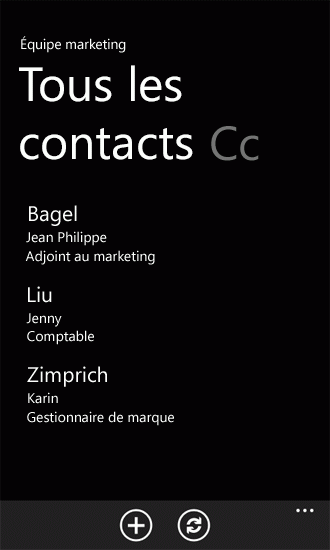
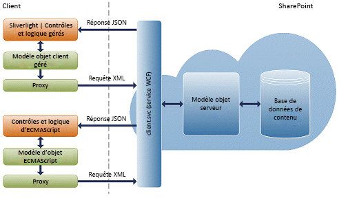
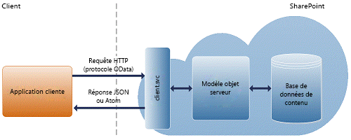

# Créer des applications Windows Phone accédant à SharePoint 2013
Découvrez comment créer des Compléments SharePoint qui s'intègrent à SharePoint 2013 et à des appareils mobiles tels que Windows Phone 8 et Windows Phone 7.
## Introduction à la création d'applications mobiles avec SharePoint 2013

SharePoint 2013 représente une excellente opportunité permettant aux développeurs de créer des applications mobiles pour suivre les utilisateurs en déplacement. Celles-ci sont interactives, attrayantes et disponibles à tout moment et partout où les utilisateurs en ont besoin. Vous pouvez associer des applications Windows Phone 8 et Windows Phone 7 aux services et applications SharePoint locaux ou distants exécutés sur le nuage (tels que ceux qui utilisent SharePoint Online) pour créer des applications puissantes qui prolongent les fonctionnalités au-delà d'un ordinateur portable ou de bureau traditionnel, vers un environnement réellement mobile et beaucoup plus accessible.
  
    
    
Les nouvelles fonctionnalités de mobilité proposées par SharePoint 2013 reposent sur des outils et technologies Microsoft existants, tels que SharePoint, Windows Phone, Visual Studio et Silverlight. Les développeurs connaissant déjà ces technologies et leurs outils associés seront en mesure de créer des applications mobiles fonctionnant sous SharePoint pour Windows Phone sans aucune difficulté. Dans cette section, nous explorons certains types d'applications mobiles fonctionnant sous SharePoint que vous pouvez créer pour Windows Phone 8 et Windows Phone 7, ainsi que les méthodes les plus courantes de personnalisation de ces applications. SharePoint 2013 propose une structure et des outils aux développeurs, notamment des modèles de projet Visual Studio 2010, pour les aider à créer des solutions mobiles interactives avec les données SharePoint, à la fois dans les installations SharePoint locales et sur le nuage, à l'aide de SharePoint Online. La figure 1 illustre la façon dont une simple application de liste peut se présenter sur Windows Phone.
  
    
    

**Figure 1. Éléments de liste SharePoint dans une application Windows Phone**

  
    
    

  
    
    

  
    
    

  
    
    

  
    
    

## De quelles compétences avez-vous besoin pour créer des applications mobiles ?

Dans cette section, nous supposons que vous connaissez déjà SharePoint, .NET Framework, le système de développement Visual Studio et Visual C#. Il est également préférable d'avoir une certaine expérience avec le développement d'application Windows Phone 8 ou Windows Phone 7 à l'aide de Silverlight, ce qui permet de se familiariser avec les contrôles XAML, StackPanel et Pivot pour Windows Phone et les concepts tels que les objets tombstone, la liaison de données Silverlight, etc. Si vous êtes débutant en développement d'applications Windows Phone à l'aide de Silverlight, nous vous recommandons de consulter les ressources suivantes.
  
    
    

-  [Le développement d'une application Windows Phone de A à Z](http://msdn.microsoft.com/fr-fr/library/gg680270%28v=pandp.11%29.aspx)
    
  
-  [Interface utilisateur pour Windows Phone](http://msdn.microsoft.com/fr-fr/library/windowsphone/develop/ff967556%28v=vs.105%29.aspx)
    
  
-  [Démarrage rapide : création d'une interface utilisateur avec XAML pour Windows Phone](http://msdn.microsoft.com/fr-fr/library/windowsphone/develop/jj207025%28v=vs.105%29.aspx)
    
  
-  [Architecture de contrôle Pivot pour Windows Phone](http://msdn.microsoft.com/fr-fr/library/windowsphone/develop/ff941097%28v=vs.105%29.aspx)
    
  

## Vue d'ensemble du développement d'applications mobiles à l'aide de SharePoint 2013

Vous pouvez créer un large éventail d'applications mobiles à l'aide de SharePoint 2013. Cette section décrit les nouveautés ou les modifications apportées à la version de SharePoint 2013 qui facilite le développement d'applications mobiles pour les développeurs.
  
    
    

### Modèle d'application SharePoint 2013 pour Windows Phone

Il s'agit du type d'application mobile le plus simple que vous pouvez créer pour apporter une liste standard au téléphone. SharePoint 2013 propose un modèle Visual Studio qui vous permet de créer rapidement et facilement des applications de liste SharePoint pour Windows Phone. Par exemple, vous pouvez créer une application Windows Phone de type « liste de tâches » qui importe votre liste de tâches de SharePoint vers Windows Phone, vous permettant ainsi d'utiliser votre téléphone pour mettre à jour le statut d'une tâche alors que vous êtes en déplacement. Un autre exemple consiste à utiliser le catalogue de produits en tant que liste d'inventaire dans SharePoint, et disponible sur le téléphone pour les commerciaux. Le fait d'installer le kit de développement SharePoint Windows Phone génère deux modèles d'application SharePoint Windows Phone que vous pouvez utiliser dans Visual Studio 2010 ou Visual Studio 2010 Express pour Windows Phone. (Voir  [Comment : configurer un environnement pour le développement d'applications mobiles pour SharePoint](how-to-set-up-an-environment-for-developing-mobile-apps-for-sharepoint.md).) À l'aide du modèle d'application de liste SharePoint pour Windows Phone, vous pouvez suivre les étapes de l'Assistant pour créer une application Windows Phone fonctionnelle pouvant aux données et manipuler celles-ci dans une liste SharePoint.
  
    
    

### Nouveau modèle objet de mobilité amélioré dans SharePoint 2013

SharePoint 2013 ajoute plusieurs nouvelles classes aux modèles d'objet client et serveur afin d'activer les scénarios de mobilité SharePoint que nous avons décrit plus haut dans cet article.
  
    
    
Pour activer les applications de géolocalisation, il existe une nouvelle classe de type de champ natif, **SPFieldGeoLocation**, ainsi que plusieurs classes associées pour structurer la valeur des champs d'emplacement et les afficher. Ces classes peuvent également être appelées dans le modèle objet client SharePoint 2013 pour Silverlight. Le nouveau type de champ dispose également d'une définition ajoutée au fichier fldtypes.xml SharePoint standard et ne nouveaux contrôles utilisateur pour le rendu du champ sur les formulaires Affichage, Modification et Nouveau. Pour obtenir une vue d'ensemble, voir  [Intégration de la fonctionnalité d'emplacement et de mappage dans SharePoint 2013](integrating-location-and-map-functionality-in-sharepoint-2013.md).
  
    
    
Pour activer l'authentification SharePoint 2013 pour les utilisateurs Windows Phone, le modèle objet client comprend une nouvelle classe **Authenticator** et plusieurs classes associées. Pour obtenir une vue d'ensemble, voir [Vue d'ensemble du modèle objet d'authentification de client mobile SharePoint 2013](overview-of-the-sharepoint-2013-mobile-client-authentication-object-model.md).
  
    
    
Pour activer les notifications automatiques destinées aux utilisateurs Windows Phone à propos d'événements sur une batterie de serveurs SharePoint, le modèle objet serveur comprend plusieurs nouvelles classes, chacune d'elles pouvant aussi être appelée à partir du modèle objet client. Ces classes comportent des méthodes qui permettent aux applications de téléphone de s'enregistrer auprès d'applications de serveur SharePoint 2013 pour les notifications relatives à des types d'événements spécifiques. Il existe également des méthodes que les applications de serveur utilisent pour envoyer des notifications aux abonnés. Pour obtenir une vue d'ensemble, voir  [Créer une application de liste SharePoint Windows Phone pour recevoir des notifications Push](how-to-configure-and-use-push-notifications-in-sharepoint-2013-apps-for-windows.md#BKMK_NotificationPhoneApp).
  
    
    
Avec SharePoint 2013, vous n'êtes pas limité au développement d'applications mobiles uniquement pour Windows Phone 8 et Windows Phone 7. Avec l'interface de programmation JavaScript et la nouvelle interface REST fournie par SharePoint 2013, vous pouvez créer des applications pour des appareils mobiles autre que Windows Phone. Vous pouvez interagir avec des sites SharePoint à l'aide de JavaScript qui s'exécute en tant que scripts dans le navigateur, ou à distance à l'aide de toute technologie prenant en charge les fonctionnalités REST standard. La section suivante fournit une vue d'ensemble des interfaces de programmation REST et JavaScript.
  
    
    

#### Architecture du modèle objet ECMAScript (JavaScript, JScript)

SharePoint Foundation 2010 a introduit les modèles objet client, qui ont permis aux développeurs d'effectuer une communication à distance avec SharePoint à l'aide de la technologie de programmation web de leur choix : .NET Framework, Silverlight ou JavaScript.
  
    
    
Dans SharePoint Foundation 2010, les modèles objet client fournissent des API qui permettent aux développeurs d'interagir avec des sites SharePoint à partir du script qui s'exécute dans le navigateur, à partir du code (basé sur .NET Framework 3.5 ou version ultérieure) qui s'exécute dans une application gérée par .NET Framework, ou à partir du code qui s'exécute dans une application Silverlight 2.0. Le proxy .js et les fichiers .dll gérés qui composent les modèles objet client sont créés sur le service web client.svc, et gèrent le traitement par lot, la sérialisation des demandes et l'analyse des réponses. La figure 2 présente un aperçu de l'architecture du modèle objet client SharePoint.
  
    
    

**Figure 2. Architecture du modèle objet client SharePoint**

  
    
    

  
    
    

  
    
    
Pour découvrir comment utiliser le modèle objet client JavaScript par rapport aux données SharePoint, consultez la vidéo relative au  [modèle objet client ECMAScript](http://channel9.msdn.com/learn/courses/SharePoint2010Developer/ClientObjectModel/ECMAScriptClientObjectModel)
  
    
    

#### Points de terminaison REST dans SharePoint 2013

Pour utiliser les fonctionnalités REST créées dans SharePoint 2013, vous pouvez élaborer une requête HTTP RESTful à l'aide du protocole OData standard qui correspond à l'API du modèle objet client souhaitée. Le service web client.svc traite la requête HTTP et fournit la réponse appropriée, au format Atom ou JavaScript Object Notation (JSON). L'application cliente doit ensuite analyser cette réponse. La figure 3 présente une vue d'ensemble de l'architecture REST SharePoint.
  
    
    

**Figure 3. Architecture REST SharePoint**

  
    
    

  
    
    

  
    
    
Le service REST dans SharePoint 2013 est actuellement en lecture seule. Cela signifie que seuls les points de terminaison REST qui représentent une opération HTTP GET sont disponibles.
  
    
    
Par défaut, les réponses de service REST SharePoint 2013 sont mises en forme à l'aide du protocole Atom, conformément à la spécification OData. En outre, le service REST prend en charge les en-têtes Accept HTTP qui permettent aux développeurs d'indiquer que la réponse est renvoyée au format JSON. Pour obtenir plus d'informations sur les services REST dans SharePoint 2013, voir  [Programmation à l'aide du service SharePoint 2013 REST](use-odata-query-operations-in-sharepoint-rest-requests.md).
  
    
    
Le service REST SharePoint 2013 prend en charge les opérateurs de requête OData suivants :
  
    
    

- Filter
    
  
- Take
    
  
- Expand
    
  

## Prise en main du développement d'applications mobiles pour SharePoint 2013

Les procédures et présentations suivantes plongent dans le vif du sujet et vous fournissent les informations spécifiques dont vous avez besoin pour démarrer le développement d'applications mobiles :
  
    
    

-  [Comment : configurer un environnement pour le développement d'applications mobiles pour SharePoint](how-to-set-up-an-environment-for-developing-mobile-apps-for-sharepoint.md)
    
  
-  [Vue d'ensemble des modèles d'applications Windows Phone SharePoint 2013 dans Visual Studio](overview-of-windows-phone-sharepoint-2013-application-templates-in-visual-studio.md)
    
  
-  [Architecture du modèle Application de liste SharePoint Windows Phone](architecture-of-the-windows-phone-sharepoint-list-application-template.md)
    
  
-  [Comment : créer une application de la liste Windows Phone SharePoint 2013](how-to-create-a-windows-phone-sharepoint-2013-list-app.md)
    
  
-  [Comment : magasin et SharePoint de récupérer des éléments sur un téléphone Windows de liste](how-to-store-and-retrieve-sharepoint-list-items-on-a-windows-phone.md)
    
  
-  [Procédure : implémenter une validation de la logique et des données métiers dans une application Windows Phone pour SharePoint 2013](how-to-implement-business-logic-and-data-validation-in-a-windows-phone-app-for-s.md)
    
  
-  [Comment : convert SharePoint 2013 et prise en charge des types pour les applications Windows Phone de champs](how-to-support-and-convert-sharepoint-2013-field-types-for-windows-phone-apps.md)
    
  
-  [Comment : personnaliser les requêtes d'élément de liste et de filtrer les données pour les applications Windows Phone](how-to-customize-list-item-queries-and-filter-data-for-windows-phone-apps.md)
    
  
-  [Comment : personnaliser l'interface utilisateur d'une application de liste SharePoint 2013 pour Windows Phone](how-to-customize-the-user-interface-of-a-sharepoint-2013-list-app-for-windows-ph.md)
    
  
-  [Comment : utiliser SharePoint 2013 plusieurs listes dans une application Windows Phone](how-to-use-multiple-sharepoint-2013-lists-in-a-windows-phone-app.md)
    
  
-  [Procédure : Configurer et utiliser les notifications Push dans les applications SharePoint 2013 pour Windows Phone](how-to-configure-and-use-push-notifications-in-sharepoint-2013-apps-for-windows.md)
    
  
-  [Intégration de la fonctionnalité d'emplacement et de mappage dans SharePoint 2013](integrating-location-and-map-functionality-in-sharepoint-2013.md)
    
  
-  [Comment : créer une application mobile en SharePoint 2013 qui contient les données d'une source de données externes](how-to-create-a-mobile-app-in-sharepoint-2013-that-contains-data-from-an-externa.md)
    
  
-  [Comment : intégration de cartes avec des applications Windows Phone et de plusieurs listes SharePoint 2013](how-to-integrate-maps-with-windows-phone-apps-and-sharepoint-2013-lists.md)
    
  
-  [Comment : créer des répondant aux souhaits des recherche des applications mobiles avec les interfaces de Navigation et le reste de la journalisation des événements](how-to-build-search-driven-mobile-apps-with-the-navigation-and-event-logging-res.md)
    
  

## Ressources supplémentaires

  
    
    

-  [Modèles de programmation dans SharePoint 2013](programming-models-in-sharepoint-2013.md)
    
  
-  [Comment : configurer un environnement pour le développement d'applications mobiles pour SharePoint](how-to-set-up-an-environment-for-developing-mobile-apps-for-sharepoint.md)
    
  
-  [Windows Phone SDK 8.0](http://www.microsoft.com/fr-fr/download/details.aspx?id=35471)
    
  
-  [Kit de développement logiciel Microsoft SharePoint pour Windows Phone 8](http://www.microsoft.com/fr-fr/download/details.aspx?id=36818)
    
  
-  [Windows Phone SDK 7.1](http://www.microsoft.com/fr-fr/download/details.aspx?id=27570)
    
  
-  [Microsoft SharePoint SDK pour Windows Phone 7.1](http://www.microsoft.com/en-us/download/details.aspx?id=30476)
    
  
-  [À propos d'Expression Blend](http://msdn.microsoft.com/fr-fr/library/cc296376%28Expression.40%29.aspx)
    
  

