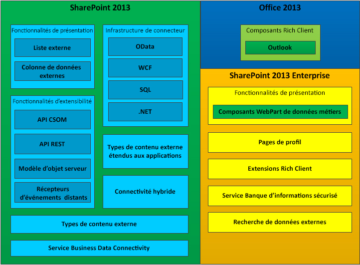

# Business Connectivity Services dans SharePoint 2013
Découvrez en quoi consiste Business Connectivity Services (BCS), les fonctionnalités associées et les informations nécessaires sur le développement des applications BCS dans SharePoint 2013.
Vous pouvez utiliser SharePoint 2013 comme un hub pour la création de solutions de productivité et de collaboration riches pouvant fonctionner avec plusieurs systèmes externes. Business Connectivity Services (BCS) fournit l'infrastructure permettant à SharePoint 2013 de renvoyer les données issues de ces systèmes externes dans un système central. En offrant un moyen flexible et extensible de décrire la source de données du système externe et la façon d'interagir avec celui-ci, BCS devient un argument probant en faveur de l'utilisation de SharePoint 2013 comme interface centrale des systèmes d'entreprise et des nouvelles Compléments SharePoint.
  
    
    

## Que permet BCS ?

BCS fournit des mécanismes permettant aux utilisateurs expérimentés, aux développeurs et aux professionnels de l'informatique d'effectuer les opérations suivantes beaucoup plus facilement :
  
    
    

- Afficher des données externes à partir d'applications d'entreprise, de services web et de services OData dans SharePoint Server 2013 et dans les applications clientes riches Office.
    
  
- Fournir des fonctionnalités et des comportements de type Office à des données et services externes (par exemple, des contacts, tâches et rendez-vous).
    
  
- Fournir une interaction complète avec les données, y compris les fonctionnalités d'écriture différée à partir des applications Office et SharePoint Server aux objets métiers et données de système externe sous-jacents.
    
  
- Activer l'utilisation en mode hors connexion des processus et données externes.
    
  
- Relier les données structurées appropriées verrouillées dans les systèmes externes aux personnes et aux documents non structurés.
    
  

## Composants de BCS

La figure 1 montre les fonctionnalités incluses dans SharePoint 2013 et Office 2013.
  
    
    

**Figure 1. Ensemble de fonctionnalités de Business Connectivity Services**

  
    
    

  
    
    

  
    
    

  
    
    

  
    
    

## Utilisation des types de contenu externe dans BCS

Les types de contenu externe constituent la base de BCS. Ils vous permettent de gérer et de réutiliser les métadonnées et les comportements d'une entité métier, comme un client ou une commande, à partir d'un emplacement central. Ils permettent aux utilisateurs d'interagir avec ces données externes et de les traiter de manière plus significative.
  
    
    
Prenons, par exemple, une entité métier telle qu'un client. Vous souhaitez être en mesure d'extraire les données de votre base de données propriétaire et de les utiliser dans SharePoint. Vous souhaitez également permettre à vos commerciaux sur le terrain d'extraire des données en mode hors connexion dans Outlook 2013 et que l'utilisateur soit en mesure de choisir un client parmi la liste de clients d'un document contractuel dans Microsoft Word. Pour cela, vous pouvez créer un type de contenu externe unique, puis le réutiliser partout où vous en avez besoin.
  
    
    
Pour plus d'informations sur l'utilisation des types de contenu externe dans BCS, voir  [Types de contenus externes dans SharePoint 2013](external-content-types-in-sharepoint-2013.md).
  
    
    

## Développement de solutions à l'aide de BCS

Vous pouvez créer de nombreuses solutions dans SharePoint 2013 à l'aide de BCS. Il s'agit notamment de solutions simples qui s'appuient sur des fonctionnalités natives peu, voire non personnalisées, des solutions intermédiaires qui impliquent la personnalisation de fonctionnalités dans SharePoint 2013 et Office 2013, et des solutions avancées permettant à des scénarios complexes et des applications riches d'étendre leur fonctionnalité. Les solutions avancées impliquent l'écriture de code à l'aide de Visual Studio. Il peut s'agir de solutions complètes de bout en bout ou de composants réutilisables basés sur du code inclus dans une solution intermédiaire.
  
    
    
BCS permet aux utilisateurs professionnels de répondre rapidement et facilement à de nombreux besoins en matière de données externes à l'aide d'un navigateur web et d'une application cliente Microsoft Office telle que Word ou Excel. Sans avoir à écrire de code, les utilisateurs peuvent assembler des solutions composites en utilisant des fonctionnalités BCS telles que les listes externes et les colonnes de données externes, ainsi que les composants réutilisables BCS, créés par des développeurs et approuvés par des informaticiens, dans les applications clientes Office et les sites SharePoint. Ces solutions permettent aux utilisateurs professionnels (et leurs équipes) d'utiliser des données externes aussi facilement que des données SharePoint, qu'ils soient hors connexion ou connectés, ou directement dans Office 2013.
  
    
    
Pour plus d'informations sur la mise en route, voir  [Configuration d'un environnement de développement pour BCS dans SharePoint 2013](setting-up-a-development-environment-for-bcs-in-sharepoint-2013.md).
  
    
    

## Utilisation d'OData avec Business Connectivity Services dans SharePoint 2013

Open Data Protocol (OData) est un protocole web vous permettant d'exposer des données sur le web à l'aide de technologies telles que HTTP, JavaScript Object Notation (JSON) et AtomPub. Les données sont accessibles grâce à des URL spécialement créées. Cette architecture vous permet d'interagir avec les données à l'aide de différentes technologies.
  
    
    
Pour plus d'informations, voir  [À l'aide de sources d'OData avec les Services Business Connectivity dans SharePoint 2013](using-odata-sources-with-business-connectivity-services-in-sharepoint-2013.md).
  
    
    

## Dans cette section

-  [Nouveautés dans Business Connectivity Services dans SharePoint 2013](what-s-new-in-business-connectivity-services-in-sharepoint-2013.md)
    
  
-  [Prise en main de Business Connectivity Services dans SharePoint 2013](get-started-with-business-connectivity-services-in-sharepoint-2013.md)
    
  
-  [Types de contenus externes dans SharePoint 2013](external-content-types-in-sharepoint-2013.md)
    
  
-  [À l'aide de sources d'OData avec les Services Business Connectivity dans SharePoint 2013](using-odata-sources-with-business-connectivity-services-in-sharepoint-2013.md)
    
  
-  [Des événements externes et les alertes dans SharePoint 2013](external-events-and-alerts-in-sharepoint-2013.md)
    
  
-  [Ajoutez dans-étendue de types de contenu externe dans SharePoint 2013](add-in-scoped-external-content-types-in-sharepoint-2013.md)
    
  
-  [Commencer à utiliser le modèle objet client avec des données externes dans SharePoint 2013](get-started-using-the-client-object-model-with-external-data-in-sharepoint-2013.md)
    
  
-  [Référence de programmeurs Business Connectivity Services pour SharePoint 2013](business-connectivity-services-programmers-reference-for-sharepoint-2013.md)
    
  

## Ressources supplémentaires

-  [Ajout de fonctionnalités SharePoint 2013](add-sharepoint-2013-capabilities.md)
    
  
-  [Configuration d'un environnement de développement pour BCS dans SharePoint 2013](setting-up-a-development-environment-for-bcs-in-sharepoint-2013.md)
    
  
-  [Vue d'ensemble du développement SharePoint 2013](sharepoint-2013-development-overview.md)
    
  

