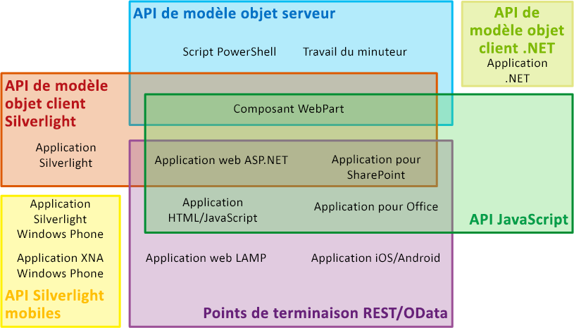
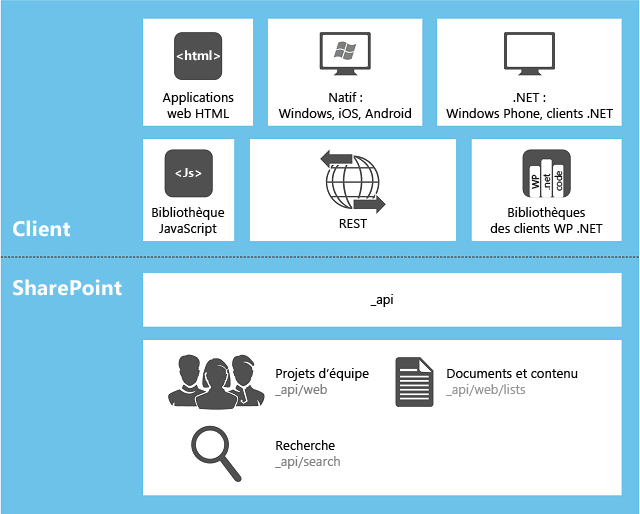

# Choisir l'ensemble d'API approprié dans SharePoint 2013
En savoir plus sur les ensembles d'API fournis dans SharePoint 2013, y compris le modèle objet serveur, les différents modèles objet client et le service web REST/OData.

**Regarder la vidéo : Stratégie SharePoint 2013 pour le modèle objet client (CSOM) et REST**

  
    
    

  
    
    

  
    
    

  
    
    

  
    
    

## Facteurs permettant de déterminer l'ensemble d'API à utiliser

Vous pouvez choisir parmi plusieurs ensembles d'API pour accéder à la plateforme SharePoint 2013. Leur utilisation dépend des facteurs suivants :
  
    
    

- **Le type d'application** Les possibilités incluent les éléments suivants (mais sans s'y limiter), qui ne sont pas des catégories mutuellement exclusives : une Complément SharePoint, un composant WebPart sur une page SharePoint, une application Silverlight en cours d'exécution sur un ordinateur client ou un périphérique mobile client, une application ASP.NET exposée dans SharePoint par un IFrame, JavaScript en cours d'exécution dans une page de site SharePoint, une page d'application SharePoint, une application Microsoft .NET Framework en cours d'exécution sur un ordinateur client, un script Windows PowerShell et un travail du minuteur en cours d'exécution sur un serveur SharePoint.
    
  
- **Vos compétences existantes.** Aussi surprenant qu'il soit, vous pouvez créer des applications dans SharePoint 2013 sans devoir dominer nécessairement la programmation SharePoint. Vous pouvez passer directement au développement SharePoint si vous maîtrisez l'un des modèles de programmation suivants :
    
  - JavaScript
    
  
  - ASP.NET
    
  
  - REST/OData
    
  
  - .NET Framework
    
  
  - Windows Phone
    
  
  - Silverlight
    
  
  - Windows PowerShell
    
  
- **Le dispositif sur lequel le code s'exécute.** Les possibilités incluent un serveur dans la batterie de serveurs SharePoint, un serveur externe tel qu'un serveur dans le nuage, un ordinateur client et un appareil mobile.
    
  
Cette rubrique offre une vue d'ensemble des différents ensembles d'API fournis par SharePoint 2013. La figure 1 indique les ensembles d'API pouvant être utilisés pour développer les 13 applications communes liées à SharePoint. Vous pouvez choisir parmi plusieurs API pour de nombreuses applications.
  
    
    

**Figure 1. Types d'extension SharePoint et ensembles d'API SharePoint sélectionnés**

  
    
    

  
    
    

  
    
    

  
    
    
Le tableau suivant fournit des indications sur les ensembles d'API à utiliser pour une liste de projets d'extensibilité communs SharePoint sélectionnés. Les autres sections de cette rubrique décrivent les différents ensembles d'API existants.
  
    
    

|**Pour faire ceci...**|**... utilisez ces API**|
|:-----|:-----|
|Créer une application web ASP.NET qui effectue des opérations de création/lecture/mise à jour/suppression (CRUD) dans un pare-feu sur les données SharePoint ou les données externes exposées dans SharePoint par un type de contenu externe Microsoft Business Connectivity Services (BCS).    |Modèle objet client JavaScript    |
|Créer une application web ASP.NET qui effectue des opérations CRUD sur les données SharePoint ou les données externes exposées dans SharePoint par un type de contenu externe BCS, sans avoir à appeler SharePoint dans un pare-feu.    |Modèle objet client .NET Framework, modèle objet client Silverlight ou points de terminaison REST/OData    |
|Créer une application web LAMP qui effectue des opérations CRUD sur les données SharePoint ou externes exposées dans SharePoint par un type de contenu externe BCS.    |Points de terminaison REST/OData    |
|Créer une application Windows Phone qui effectue des opérations CRUD sur les données SharePoint    |Modèle objet client mobile    |
|Créer une application Windows Phone qui utilise le service de notifications Push Microsoft (WNS) pour signaler les événements dans SharePoint par appareil mobile.    |Modèle objet client mobile et modèle objet serveur    |
|Créer une application iOS ou Android qui effectue des opérations CRUD sur les données SharePoint    |Points de terminaison REST/OData    |
|Créer une application .NET Framework qui effectue des opérations CRUD sur les données SharePoint    |Modèle objet client .NET Framework    |
|Créer une application Silverlight qui effectue des opérations CRUD sur les données SharePoint    |Modèle objet client Silverlight    |
|Créer une application HTML/JavaScript qui effectue des opérations CRUD sur les données SharePoint    |Modèle objet client JavaScript    |
|Créer une Complément Office qui fonctionne avec SharePoint    |Modèle objet client JavaScript    |
|Créer une commande Windows PowerShell personnalisée    |Modèle objet serveur    |
|Créer un travail du minuteur    |Modèle objet serveur    |
|Créer une extension de l'administration centrale    |Modèle objet serveur    |
|Créer la cohérence de la marque dans l'ensemble d'une batterie de serveurs SharePoint    |Modèle objet serveur    |
|Créer un composant WebPart, une page d'application ou un contrôle utilisateur ASP.NET personnalisé    |Modèle objet serveur    **IMPORTANTE**   Si la fonctionnalité que vous souhaitez offrir aux clients n'est pas orientée vers l'administration SharePoint à une portée s'étendant au-delà de la collection de sites, nous vous recommandons de créer une Complément SharePoint incluant une application web ASP.NET à distance avec des composants WebPart et des contrôles utilisateur personnalisés si nécessaire, au lieu d'utiliser le modèle objet serveur. Reportez-vous aux deux premières lignes de ce tableau.           |
   

## Modèle objet serveur

Le plus grand ensemble d'API se trouve dans le modèle objet serveur de classes managées. En ce qui concerne SharePoint Foundation 2013, ce modèle objet inclut des classes et des membres qui permettent un contrôle programmatique de la structure de base du site et de la liste SharePoint Foundation. La plupart de ces classes se trouvent dans l'espace de noms  [Microsoft.SharePoint](https://msdn.microsoft.com/library/Microsoft.SharePoint.aspx) . En outre, vous pouvez étendre presque tous les composants SharePoint Foundation à l'aide du modèle objet serveur, notamment des flux de travail, des alertes, des composants WebPart, des recherches de base et les Microsoft Business Connectivity Services (BCS). Le modèle objet serveur comprend également un ensemble complet d'API permettent des extensions de l'administration et du système de sécurité de SharePoint Foundation, notamment la sauvegarde, l'intégrité et les diagnostics de la batterie de serveurs, la journalisation, la gestion d'application web et batterie de serveur, la mise à niveau, le déploiement, la mise en cache et la personnalisation de Windows PowerShell.
  
    
    
En ce qui concerne SharePoint Server 2013, de nombreuses classes sont ajoutées pour permettre la programmation de la gestion de contenu d'entreprise (ECM), des profils utilisateur, de la taxonomie, de la recherche avancée et d'autres fonctionnalités de SharePoint Server 2013.
  
    
    
Vous pouvez utiliser  [LINQ to Objects](http://msdn.microsoft.com/fr-fr/library/bb397919.aspx) pour soumettre une requête à des collections **IEnumerable** en mémoire. Toutefois, un [fournisseur LINQ to SharePoint](http://msdn.microsoft.com/library/3fa2dc5f-d308-4337-aefd-191a5df8dbbe%28Office.15%29.aspx) permet de soumettre une requête des listes directement dans les bases de données de contenu SharePoint. À proprement parler, ce fournisseur n'est pas disponible avec un autre ensemble d'API présenté dans cette rubrique. Toutefois, il est possible d'utiliser la syntaxe LINQ de plusieurs façons dans la plupart des autres ensembles d'API.
  
    
    
Les assemblys qui définissent les classes côté serveur intégrées sont installés dans le Global Assembly Cache de chaque serveur lorsque SharePoint 2013 est installé. Lorsque vous programmez le modèle objet serveur, vos assemblys sont installés comme des solutions de batterie de serveurs dans le Global Assembly Cache.
  
    
    

> **REMARQUE**
> Le développement de nouvelles solutions bac à sable par rapport à SharePoint 2013 est obsolète en faveur du développement d'Compléments SharePoint. Toutefois, les solutions bac à sable peuvent encore être installées dans des collections de sites sur SharePoint 2013. Les assemblys de ces solutions demeurent dans le package sauf s'ils sont effectivement utilisés lorsqu'ils sont installés temporairement dans un dossier sur le serveur. Pour plus d'informations, voir  [Où les assemblys sont-ils déployés dans les solutions en bac à sable (sandbox) ?](http://msdn.microsoft.com/library/dadbb20b-1bf7-442c-9eeb-bd9f01dbda45%28Office.15%29.aspx). 
  
    
    

### Limitations lorsque vous pouvez utiliser le modèle objet serveur

La logique personnalisée dans Compléments SharePoint est toujours distribuée « vers le bas » pour le client ou « vers le haut » dans le nuage (ou « sur » un serveur en dehors de la batterie de serveur SharePoint). Dans tous ces modèles de distribution, l'un des modèles objets client ou les points de terminaison REST/OData doivent être utilisés. (Vous ne pouvez pas utiliser le modèle objet serveur dans une Complément SharePoint.) Par exemple, si l'application contient des pages SharePoint hébergées, celles-ci peuvent accéder aux données SharePoint à l'aide du modèle objet client JavaScript. Ces pages peuvent également exposer les applications Silverlight qui utilisent le modèle objet client SharePoint 2013 Silverlight. Pour plus d'informations sur les Compléments SharePoint, voir  [Aspects importants du contexte de développement et de l'architecture des compléments pour SharePoint](http://msdn.microsoft.com/library/ae96572b-8f06-4fd3-854f-fc312f7f2d88%28Office.15%29.aspx).
  
    
    

## Modèles objet client pour le code managé

SharePoint 2013 possède trois modèles objet client pour le code managé : .NET, Silverlight et mobile.
  
    
    

### Modèle objet client .NET

Le modèle objet SharePoint 2013 pour .NET Framework est utilisé dans les applications .NET Framework qui s'exécutent sur un client Windows sans téléphone. L'un des éléments suivants compte en tant que client :
  
    
    

- L'ordinateur d'un utilisateur
    
  
- Un serveur externe à la batterie SharePoint 2013
    
  
- Un rôle web ou rôle de travail sur Microsoft Azure
    
  
Pratiquement chaque classe dans le modèle objet côté client du site principal et de la liste présente une classe correspondante dans le modèle objet client .NET Framework. En outre, le modèle objet client .NET Framework expose également un jeu complet d'API pour étendre d'autres fonctionnalités, y compris certaines fonctionnalités de niveau SharePoint Server 2013, telles que la gestion de contenu d'entreprise (ECM), la taxonomie, les profils utilisateurs, la recherche avancée, les analyses, BCS et d'autres encore.
  
    
    
Pour améliorer les performances, des lignes de code écrites en conséquence dans le modèle objet client .NET Framework sont envoyées au serveur SharePoint par lots, où elles sont converties en code côté serveur, puis exécutées. Les résultats de requête et le nouvel état de toutes les variables sont alors renvoyés au client. En tant que développeur, vous devez déterminer si un lot s'exécute de manière synchrone ou asynchrone. (Dans un lot synchrone, les applications .NET Framework attendent les résultats renvoyés par le serveur avant de continuer ; dans un lot asynchrone, le traitement côté client continue immédiatement et l'interface utilisateur du client (UI) reste réactive.)
  
    
    
Vous pouvez utiliser la syntaxe de requête LINQ dans votre code client pour interroger tout objet **IEnumerable**, y compris les objets SharePoint 2013 qui implémentent **IEnumerable**. Toutefois, lorsque vous effectuez cette opération, vous utilisez  [LINQ to Objects](http://msdn.microsoft.com/fr-fr/library/bb397919.aspx), et non le  [fournisseur LINQ to SharePoint](http://msdn.microsoft.com/library/3fa2dc5f-d308-4337-aefd-191a5df8dbbe%28Office.15%29.aspx). Par conséquent, la documentation de ce dernier n'est pas pertinente pour le code côté client.
  
    
    
Les assemblys pour le modèle objet client .NET Framework doivent être installés sur le client. Ils sont inclus dans un package redistribuable que vous pouvez obtenir dans la page se rapportant aux  [composants client SharePoint](http://www.microsoft.com/en-us/download/details.aspx?id=35585).
  
    
    
Pour obtenir des exemples d'utilisation du modèle objet .NET Framework, voir  [Effectuer des opérations de base avec du code de bibliothèque client SharePoint 2013](http://msdn.microsoft.com/library/5a69c9e3-73bf-4ed5-bc19-182056bdb394%28Office.15%29.aspx).
  
    
    

> **REMARQUE**
> Vous pouvez également utiliser les points de terminaison REST/OData SharePoint dans une application .NET Framework. Pour obtenir une comparaison du modèle objet client .NET Framework avec les points de terminaison REST/OData SharePoint, consultez la section  [Points de terminaison REST/OData](#RESTOData) mentionnée plus bas.
  
    
    

### Modèle objet client Silverlight

Le modèle objet SharePoint 2013 pour Silverlight est utilisé dans les applications Silverlight, indépendamment de l'endroit où le fichier XAP compilé est conservé. Il peut se trouver dans une bibliothèque de biens sur un site web SharePoint 2013, sur un ordinateur client, dans le stockage en nuage ou sur un serveur externe. Généralement, une application Silverlight est exposée dans SharePoint 2013 dans un objet  [SilverlightWebPart](https://msdn.microsoft.com/library/Microsoft.SharePoint.WebPartPages.SilverlightWebPart.aspx) . Le modèle objet client Silverlight dans SharePoint 2013 est presque identique à celui dans .NET Framework, et inclut la prise en charge des mêmes zones d'extensibilité. La principale différence réside dans la version Silverlight : tous les lots de commandes sont envoyés au serveur de manière asynchrone, de sorte que l'interface utilisateur de l'application reste active.
  
    
    
Les assemblys du modèle objet client Silverlight sont conservés sur chaque serveur SharePoint 2013 sur le chemin %ProgramFiles%\\Common Files\\Microsoft Shared\\web server extensions\\15\\TEMPLATE\\LAYOUTS\\ClientBin. Ils n'ont pas à être installés sur l'ordinateur qui exécute l'application Silverlight, mais vous avez la possibilité de le faire. En outre, vous pouvez les regrouper dans le fichier Xap de l'application.
  
    
    
Vous pouvez inclure les fichiers Xap Silverlight dans les Compléments SharePoint, y compris les applications SharePoint hébergées, auquel cas le fichier Xap est déployé sur une bibliothèque dans le site web d'application. (Pour plus d'informations sur les applications web, voir  [Héberger des sites web, des sites web de complément et des composants SharePoint dans SharePoint 2013](http://msdn.microsoft.com/library/b791cdf5-8aa2-47fa-bc4c-aee437354759%28Office.15%29.aspx).) Les applications Silverlight constituent un moyen utile d'inclure du code personnalisé SharePoint dans une application, étant donné que le code personnalisé côté serveur n'est pas autorisé dans les Compléments SharePoint. Il permet aussi aux développeurs Silverlight d'utiliser leurs compétences pour créer des applications SharePoint 2013 avec une courbe d'apprentissage minimale.
  
    
    

> **REMARQUE**
> Vous pouvez également utiliser les points de terminaison REST/OData SharePoint dans une application Silverlight. Pour obtenir une comparaison du modèle objet client Silverlight avec les points de terminaison REST/OData SharePoint, consultez la section  [Points de terminaison REST/OData](#RESTOData) mentionnée plus bas. .
  
    
    

### Modèle d'objet mobile

Une version spéciale du modèle objet client Silverlight est disponible pour les appareils Windows Phone. Elle comprend des API supplémentaires uniquement destinées aux téléphones, notamment des API permettant à une application mobile d'enregistrer les notifications du service de notifications Push Microsoft. Elle prend en charge toutes les fonctionnalités SharePoint 2013 principales. Toutefois, elle ne prend en charge aucune des zones d'extensibilité secondaires étant prises en charge par les deux autres modèles objet client pour le code managé. Pour accéder à ces zones supplémentaires, utilisez les points de terminaison REST/OData SharePoint dans votre application mobile. Voir la section  [Points de terminaison REST/OData](#RESTOData), mentionnée plus bas.
  
    
    
Les assemblys pour le modèle objet mobile sont conservés sur chaque serveur SharePoint 2013 dans le chemin %ProgramFiles%\\Common Files\\Microsoft Shared\\web server extensions\\15\\TEMPLATE\\LAYOUTS\\ClientBin. Créez un package pour le fichier Xap de votre application Windows Phone.
  
    
    

## Modèle objet JavaScript

SharePoint 2013 fournit un modèle objet JavaScript utilisable dans le script inline ou des fichiers .js séparés. Il inclut les mêmes fonctionnalités que les modèles objets client .NET Framework et Silverlight. Comme le modèle objet client Silverlight, le modèle objet JavaScript constitue un moyen utile d'inclure du code personnalisé SharePoint dans une application, étant donné que le code côté serveur n'est pas autorisé dans les Compléments SharePoint. Il permet également aux développeurs web d'utiliser leurs compétences existantes JavaScript pour créer des applications SharePoint avec une courbe d'apprentissage minimale.
  
    
    
Comme les modèles objet client de code managé, l'infrastructure JavaScript de SharePoint 2013 interagit avec les serveurs de la batterie de serveurs dans les lots. Ces lots sont toujours exécutés de façon asynchrone. En outre, il est désormais possible d'accéder aux données SharePoint sur plusieurs domaines dans JavaScript (uniquement les données situées dans la même collection de site parente), ce qui n'était pas autorisé dans les versions précédentes de SharePoint. Pour plus d'informations, voir  [Accéder à des données SharePoint 2013 à partir de compléments à l'aide de la bibliothèque inter-domaines](http://msdn.microsoft.com/library/bc37ff5c-1285-40af-98ae-01286696242d%28Office.15%29.aspx). Les données sont renvoyées par le serveur dans JavaScript Object Notation (JSON).
  
    
    
Le modèle objet JavaScript est défini dans un ensemble de fichiers *.js situés dans le chemin %ProgramFiles%\\Common Files\\Microsoft Shared\\web server extensions\\15\\TEMPLATE\\LAYOUTS sur chaque serveur.
  
    
    
Pour obtenir des exemples d'utilisation du modèle objet .NET Framework, voir  [Procédure : effectuer des opérations de base avec du code de bibliothèque JavaScript dans SharePoint 2013](http://msdn.microsoft.com/library/29089af8-dbc0-49b7-a1a0-9e311f49c826%28Office.15%29.aspx).
  
    
    

> **REMARQUE**
> Vous pouvez également utiliser les points de terminaison REST/OData SharePoint dans une application JavaScript. Pour obtenir une comparaison du modèle objet client JavaScript avec des points de terminaison REST/OData SharePoint, consultez la section suivante :  [Points de terminaison REST/OData](#RESTOData). 
  
    
    

## Points de terminaison REST/OData

Pour les scénarios dans lesquels vous devez accéder aux entités SharePoint à partir de technologies clientes n'utilisant pas JavaScript et non intégrées aux plateformes .NET Framework ou Silverlight, SharePoint 2013 fournit une mise en œuvre d'un service web Representational State Transfer (REST) qui utilise le  [protocole OData](http://www.odata.org/) pour effectuer des opérations CRUD dans des données de liste SharePoint. En outre, pratiquement chaque API dans les modèles objets clients présente un point de terminaison REST correspondant. Cela permet à votre code d'interagir directement avec les artefacts SharePoint en utilisant une technologie prenant en charge les requêtes et réponses HTTP standard. Pour utiliser les fonctionnalités REST intégrées dans SharePoint 2013, votre code crée une requête HTTP RESTful vers un point de terminaison correspondant à l'API du modèle objet client souhaité. Le service web .svc client traite la requête HTTP et envoie une réponse au format Atom ou JSON.
  
    
    
Pour plus d'informations sur l'utilisation du service web OData/REST, consultez le nœud  [Programmation à l'aide du service SharePoint 2013 REST](use-odata-query-operations-in-sharepoint-rest-requests.md) ; pour obtenir des exemples, consultez la rubrique [Effectuer des opérations de base à l'aide de terminaux REST SharePoint 2013](http://msdn.microsoft.com/library/e3000415-50a0-426e-b304-b7de18f2f7d9%28Office.15%29.aspx).
  
    
    

### Comparaison de la programmation REST/OData avec la programmation de modèle objet client

Dans certains cas, il peut être préférable d'utiliser des points de terminaison REST même dans les applications pour lesquelles un modèle objet SharePoint est disponible, en particulier pour les développeurs n'ayant pas d'expérience de développement Windows. Le tableau suivant présente une comparaison des principales fonctionnalités de ces choix de programmation pour un développeur créant une application sur une plateforme Windows ou avec une plateforme qui prend en charge JavaScript.
  
    
    

|**Fonctionnalité**|**Modèles objet .NET Framework ou Silverlight**|**Modèle objet JavaScript**|**Points de terminaison REST/OData appelés à partir d'une plateforme Windows ou JavaScript**|
|:-----|:-----|:-----|:-----|
|Programmation orientée objet    |Oui    |Oui    |Non    |
|Traitement par lots    |Oui    |Oui    |Oui    |
|API de traitement conditionnel et de gestion des exceptions    |Oui    |Non    |Non    |
|Disponibilité de la syntaxe LINQ    |Oui    |Non    |Non    |
|Combinaison de données de liste à partir de différentes applications web SharePoint    |Oui    |Non    |Oui    |
|Connaissance par les développeurs REST/OData expérimentés    |Non    |Non    |Oui    |
|Similarité avec la programmation non Windows ou JavaScript    |Non    |Oui    |Oui    |
|Typage fort des champs d'élément de liste    |Non (sauf avec LINQ)    |Non    |Oui, à partir de la plateforme Windows          Non, à partir de JavaScript    |
|Utilisation de jQuery, Knockout et autres bibliothèques JavaScript    |Non    |Oui    |Non, à partir de la plateforme Windows          Oui, à partir de JavaScript    |
   

## Infrastructure WCF Data Services

Si vous préférez utiliser la syntaxe LINQ dans les applications clientes .NET Framework ou Silverlight, SharePoint 2013 prend en charge  [WCF Data Services](http://msdn.microsoft.com/fr-fr/library/cc668792.aspx), en tant que fournisseur LINQ. Vous pouvez cibler listdata.svc (pour les données de liste uniquement) comme dans les versions antérieures de SharePoint Foundation ou le même client.svc prenant en charge l'interface OData pour l'accès à toutes les entités SharePoint, outre la liste de données. Pour plus d'informations, voir  [Effectuer des requêtes sur SharePoint Foundation avec ADO.NET Data Services](http://msdn.microsoft.com/library/3e3e16f7-620a-4710-a3f3-19d0236f4b4a%28Office.15%29.aspx).
  
    
    
La figure 2 illustre la relation entre les différentes API clientes, les types d'applications clientes et SharePoint. Les différents URL _api* sont celles liées à la batterie de serveur des points de terminaison REST. Pour plus d'informations, consultez la rubrique  [Mise en route du service REST SharePoint 2015](get-to-know-the-sharepoint-2013-rest-service.md#bk_learnmore).
  
    
    

**Figure 2. Applications clients et API dans SharePoint**

  
    
    

  
    
    

  
    
    

  
    
    

  
    
    

## Ensembles d'API déconseillées

Deux ensembles d'API sont toujours pris en charge dans l'infrastructure SharePoint 2013 pour la compatibilité descendante, mais nous vous recommandons de ne pas les utiliser pour de nouveaux projets : les  [services Web ASP.NET (asmx)](http://msdn.microsoft.com/library/c587ee90-1f88-43f3-b1a7-5f3072d038f8%28Office.15%29.aspx) et l' [appel de procédure distant (RPC) appelant le fichier owssvr.dll](http://msdn.microsoft.com/library/4aa5c82b-90fb-4be5-b30c-d35ecae42a81%28Office.15%29.aspx).
  
    
    

## Ressources supplémentaires

-  [Vue d'ensemble du développement SharePoint 2013](sharepoint-2013-development-overview.md)
    
  
-  [Modèles de programmation dans SharePoint 2013](programming-models-in-sharepoint-2013.md)
    
  
-  [Comparaison des compléments pour SharePoint et des solutions SharePoint](sharepoint-add-ins-compared-with-sharepoint-solutions.md)
    
  
-  [Programmation à l'aide du service SharePoint 2013 REST](use-odata-query-operations-in-sharepoint-rest-requests.md)
    
  
-  [Effectuer des opérations de base à l'aide de terminaux REST SharePoint 2013](http://msdn.microsoft.com/library/e3000415-50a0-426e-b304-b7de18f2f7d9%28Office.15%29.aspx)
    
  
-  [Effectuer des opérations de base avec du code de bibliothèque client SharePoint 2013](http://msdn.microsoft.com/library/5a69c9e3-73bf-4ed5-bc19-182056bdb394%28Office.15%29.aspx)
    
  
-  [Procédure : effectuer des opérations de base avec du code de bibliothèque JavaScript dans SharePoint 2013](http://msdn.microsoft.com/library/29089af8-dbc0-49b7-a1a0-9e311f49c826%28Office.15%29.aspx)
    
  
-  [Effectuer des requêtes sur SharePoint Foundation avec ADO.NET Data Services](http://msdn.microsoft.com/library/3e3e16f7-620a-4710-a3f3-19d0236f4b4a%28Office.15%29.aspx)
    
  

  
    
    
