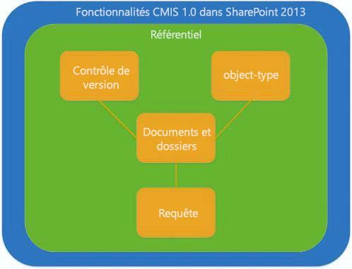
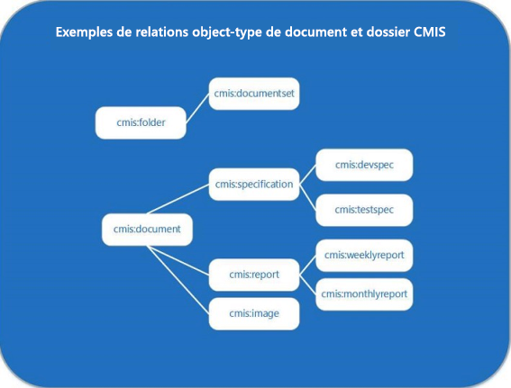

# Services CMIS (Content Management Interoperability Services) dans SharePoint 2013
Découvrez l'implémentation SharePoint 2013 de la version 1.0 de la norme CMIS (Content Management Interoperability Services) OASIS.
## Introduction à CMIS dans SharePoint 2013

La conformité de SharePoint Server avec la version 1.0 de la  [norme CMIS (Content Management Interoperability Services) OASIS](https://www.oasis-open.org/committees/tc_home.php?wg_abbrev=cmis) permet l'intégration entre les référentiels de contenu SharePoint Server et les autres référentiels de gestion de contenu d'une entreprise. CMIS permet le partage d'informations via des protocoles Internet entre des systèmes de documents, des éditeurs et des référentiels, dans l'entreprise et entre entreprises, le tout dans un format neutre concernant le fournisseur. La norme CMIS prend en charge les opérations de gestion des documents de base, telles que la création, la lecture, la mise à jour, la suppression, l'extraction et l'archivage. Elle prend en charge la gestion des versions des documents et de leurs métadonnées. CMIS est disponible sur tout site SharePoint 2013 local après activation de la fonctionnalité **Producteur CMIS (Content Management Interoperability Services)** dans la section **Gérer les fonctionnalités du site** des **paramètres du site**. Dans SharePoint 2013, le producteur CMIS SharePoint est disponible, mais désactivé par défaut sur tous les sites locaux.
  
    
    
CMIS assure l'interopérabilité entre les API qui le prennent en charge, mais ne remplace pas les API natives. Les objets pris en charge par CMIS définissent une intersection avec les objets avec lesquels les développeurs SharePoint Server interagissent fréquemment, y compris les documents et les dossiers. Cependant, les développeurs qui écrivent des applications qui prennent en charge CMIS devront sans doute continuer à écrire du code SharePoint Server personnalisé. CMIS permet d'économiser 60 à 70 % de temps de développement pour les solutions qui l'implémentent. Par conséquent, considérez-le comme un nouvel outil dans la boîte à outils de développement.
  
    
    

## Examen détaillé de l'implémentation de CMIS dans SharePoint 2013

Certaines parties de la spécification CMIS sont obligatoires, mais beaucoup d'autres sont facultatives. De nombreux fournisseurs, dont Microsoft, implémentent les parties obligatoires de la norme et certains de ses composants facultatifs. La figure 1 montre les fonctionnalités indiquées dans la spécification CMIS 1.0 et implémentées dans SharePoint 2013.
  
    
    
Figure 1. Fonctionnalités CMIS 1.0 implémentées dans SharePoint 2013
  
    
    

  
    
    

  
    
    
Le modèle de données CMIS définit un référentiel qui contient les autres types de données CMIS, y compris les types d'objet, le contrôle de version, les documents et dossiers, ainsi que la fonctionnalité de requête.
  
    
    

### Référentiels CMIS et bibliothèques de documents SharePoint

Le référentiel CMIS est le conteneur du reste du modèle de données CMIS. Dans SharePoint 2013, la bibliothèque de documents est équivalente au référentiel CMIS (les listes ne sont pas prises en charge dans le producteur CMIS SharePoint 2013). L'accès au référentiel constitue généralement le point de lancement pour une application cliente. Par exemple, imaginez un site SharePoint Server contenant plusieurs bibliothèques de documents équivalentes aux référentiels dans CMIS. La spécification CMIS décrit un service obligatoire, **getRepositories**, qui, dans SharePoint Server, obtient tous les référentiels valides (bibliothèques de documents) dans l'objet  [SPWeb](https://msdn.microsoft.com/library/Microsoft.SharePoint.SPWeb.aspx) actuel. Un développeur peut se connecter aux référentiels en appelant le service **getRepositories** ou le service **getRepositoryInfo**; **getRepositoryInfo** obtient le référentiel spécifié par le développeur.
  
    
    
Le référentiel CMIS contient les autres fonctionnalités CMIS prises en charge par SharePoint Server, y compris les types d'objet de document et de dossier spécifiés par CMIS, les fonctionnalités de contrôle de version CMIS (qui reflètent les fonctionnalités de contrôle de version natives dans SharePoint Server), ainsi que la fonctionnalité de requête CMIS, qui utilise une syntaxe de type SQL pour interroger les référentiels CMIS sur des données spécifiques.
  
    
    

### Documents, dossiers et autres types d'objet CMIS

CMIS définit une fonctionnalité de type d'objet équivalente au concept des types de contenu dans SharePoint Server (plus précisément, la classe [SPContentType](https://msdn.microsoft.com/library/Microsoft.SharePoint.SPContentType.aspx) ). Chaque type d'objet CMIS en lecture seule est composé d'attributs et de définitions de propriété. Les attributs déterminent si un objet peut être interrogé ou si plusieurs versions de cet objet peuvent être gérées, par exemple. CMIS prend en charge les définitions des propriétés associées aux types d'objet équivalents dans SharePoint 2013, le cas échéant. Par exemple, un objet de document ou de dossier dans CMIS peut comporter une propriété **LastModifiedBy** utilisant cette syntaxe : `cmis:LastModifiedBy`. Une propriété **Author** associée à un objet **Document** est écrite sous la forme `cmis:Author`. La norme CMIS définit quatre types d'objet qui sont utilisés en tant que types de base. Le tableau 1 décrit les types d'objet CMIS et indique s'ils sont pris en charge dans SharePoint 2013, et leur fonctionnalité équivalente dans SharePoint, le cas échéant.
  
    
    

  
    
    

**Tableau 1. Valeurs de type d'objet CMIS et leurs équivalents SharePoint 2013**

|**Type d'objet CMIS**|**Pris en charge dans SharePoint Server ?**|**Fonctionnalité équivalente dans SharePoint 2013**|**Description**|
|:-----|:-----|:-----|:-----|
|Document    |Oui    |Objets **Document**   |Le type d'objet de document CMIS est mappé directement avec l'objet **Document** dans SharePoint Server.   Les documents comportent des propriétés et un flux de contenu qui leur sont attachés, leurs différentes versions peuvent être gérées et ils prennent en charge les opérations de création, lecture, mise à jour et suppression de base.    |
|Dossier    |Oui    |Objets  [SPFolder](https://msdn.microsoft.com/library/Microsoft.SharePoint.SPFolder.aspx)   |Le type d'objet de dossier CMIS est mappé directement avec l'objet **SPFolder** dans SharePoint Server.   Les dossiers peuvent contenir des documents et d'autres dossiers, et doivent posséder un seul dossier parent. Ils comportent des propriétés qui leur sont attachées et prennent en charge les mêmes opérations CRUD que l'objet de document.    Les versions des dossiers CMIS ne peuvent pas être gérées.    |
|Stratégie    |Non    |Aucune    |Le type d'objet de stratégie CMIS n'est pas équivalent au concept de stratégie dans SharePoint, ni aux objets de stratégie définis dans le modèle objet SharePoint.    |
|Relation    |Non    |Aucune    |Non pris en charge.    |
   

  
    
    
CMIS ne fournit pas de méthodes permettant de créer, de modifier ou de supprimer des types d'objet. Les développeurs qui souhaitent créer, modifier ou supprimer un type d'objet de document ou de dossier SharePoint Server peuvent le faire à l'aide du modèle objet SharePoint Server propriétaire.
  
    
    
La figure 2 montre un exemple des relations qui peuvent exister entre les types d'objet de dossier et de document CMIS. La figure utilise des étiquettes que l'on peut trouver dans un scénario de gestion des documents SharePoint Server. Par exemple, un type d'objet CMIS nommé **cmis:folder** est le parent d'un type d'objet nommé **cmis:documentset**. Le type d'objet **cmis:documentset** peut contenir, mais ne contient pas obligatoirement, des objets de document organisés dans un objet [DocumentSet](https://msdn.microsoft.com/library/Microsoft.Office.DocumentManagement.DocumentSets.DocumentSet.aspx) .
  
    
    
Le type d'objet de document CMIS prend également en charge les relations parent/enfant, comme illustré ici, où le type d'objet **cmis:document** est un parent des types d'objet de document **cmis:specification**, **cmis:report** et **cmis:image**. Ces documents peuvent être organisés en ensembles de documents SharePoint Server, mais CMIS ne définit pas une telle construction. À la place, CMIS reconnaît les objets individuels comme étant du type d'objet de document ou de dossier, ou comme étant un sous-ensemble de l'un de ces deux types d'objet.
  
    
    
Figure 2. Exemples des types d'objet de document et de dossier CMIS
  
    
    

  
    
    

  
    
    

  
    
    

  
    
    

### Requête CMIS dans SharePoint 2013

Une requête est une partie facultative de la spécification CMIS prise en charge par SharePoint Server. La requête CMIS utilise une syntaxe simplifiée de type SQL. Chaque requête dans CMIS est étendue à un référentiel, par conséquent, tous les résultats de la requête sont renvoyés à partir du référentiel unique auquel la requête est étendue. L'exécution de plusieurs requêtes sur plusieurs référentiels renvoie les résultats d'un référentiel pour chaque requête exécutée, ce qui a pour effet de renvoyer les résultats de plusieurs référentiels. Le tableau 2 présente quelques exemples d'instructions de requête CMIS de base.
  
    
    

  
    
    

**Tableau 2. Exemples de syntaxe de requête CMIS**

|**Instruction de requête CMIS**|**Description**|
|:-----|:-----|
| `SELECT * FROM cmis:document`   |Sélectionne tous les documents dans le référentiel.    |
| `SELECT cmis:name, cmis:author FROM cmis:document WHERE cmis:author='Tina Makovec'`   |Sélectionne le nom et l'auteur d'un document dans le référentiel dont l'auteur est Tina Makovec.    |
| `SELECT * FROM cmis:document WHERE CONTAINS('4Q13')`   |Ceci est un exemple de recherche en texte intégral à l'aide du critère CONTAINS. Cette requête renvoie les documents du référentiel qui contiennent le mot 4Q13.    |
   

  
    
    
SharePoint Server ne prend pas en charge les jointures, mais la spécification CMIS 1.0 le fait. Les référentiels CMIS autres que SharePoint peuvent prendre en charge les jointures dans leur implémentation de requête CMIS. Tous les référentiels qui prennent en charge la requête CMIS prennent également en charge le tri, la sélection des propriétés à renvoyer et la pagination.
  
    
    

### Contrôle de version CMIS et SharePoint

Le contrôle de version CMIS est identique au contrôle de version de document dans SharePoint Server : les versions mineures et majeures et les opérations d'archivage et d'extraction sont prises en charge dans CMIS pour les documents uniquement.
  
    
    
Les versions des dossiers ne peuvent pas être gérées.
  
    
    

### Prise en charge du journal des modifications CMIS

CMIS spécifie un concept de journal des modifications. Les journaux des modifications CMIS prennent en charge les événements de création, de mise à jour et de suppression de base liés aux propriétés et à l'ID d'un objet. Les propriétés sont déclenchées lorsqu'un événement de création, de mise à jour ou de suppression survient. Le journal des modifications prend en charge la pagination, de sorte que les développeurs puissent stocker leur propre journal des modifications lorsqu'ils le souhaitent.
  
    
    

## Authentification et CMIS dans SharePoint 2013

Par défaut, SharePoint Server prend en charge l'authentification pour l'authentification anonyme, l'authentification de base, l'authentification NTLM, l'authentification Digest, la transition de protocole Kerberos/la délégation Kerberos contrainte, l'authentification basée sur les revendications Windows, l'authentification multiple basée sur les revendications, ainsi que le mode mixte basé sur les revendications.
  
    
    
L'authentification OAuth entrante n'est pas prise en charge.
  
    
    

## Producteur CMIS dans SharePoint 2013

Le producteur CMIS est disponible par défaut dans SharePoint Server pour le déploiement local. Il crée des points de terminaison conformes CMIS avec lesquels les services web consommateurs conformes CMIS peuvent interagir. La prise en charge de CMIS et la fonctionnalité de producteur CMIS sont disponibles sur toute implémentation locale de SharePoint Server sur laquelle la fonctionnalité de producteur CMIS est activée. CMIS n'est pas pris en charge dans SharePoint Online.
  
    
    

## Scénarios CMIS et idées d'application

Avec les fonctionnalités CMIS dans SharePoint 2013, les développeurs peuvent créer des applications qui intègrent des données conformes CMIS de SharePoint Server et d'autres applications conformes CMIS. Étant donné que CMIS est un format neutre du point de vue du fournisseur, les développeurs peuvent écrire du code produisant des points de terminaison conformes CMIS pouvant être partagés avec des applications consommatrices conformes CMIS sans avoir à écrire le code par rapport à l'API de l'application native. Par exemple, le producteur CMIS SharePoint 2013 par défaut peut partager un référentiel CMIS (par exemple, une bibliothèque de documents SharePoint Server) avec l'application de retouche photo d'un autre fournisseur. Un utilisateur peut ouvrir un fichier image stocké dans le référentiel CMIS du producteur de l'application de retouche photo et l'extraire dans SharePoint Server à partir de cette dernière. Après avoir effectué et enregistré ses modifications, toujours à partir de l'application de retouche photo, l'utilisateur peut archiver la dernière version dans la bibliothèque de documents SharePoint Server. Étant donné que la spécification CMIS définit le contrôle de version en matière de versions mineures et majeures, comme SharePoint, l'utilisateur de l'application de retouche photo enregistre les modifications dans une version dans le référentiel CMIS à l'aide d'une logique de contrôle de version identique à celle trouvée dans SharePoint Server.
  
    
    
Lors de la création d'une application, envisagez un code implémentant un dictionnaire qui initialise l'intégralité des paramètres. Ces derniers sont utilisés pour procéder à l'authentification auprès des référentiels et spécifient des données telles que la liaison utilisée (par exemple, REST, AtomPub ou SOAP), l'URL d'accès du serveur au point de terminaison REST, le nom d'utilisateur, le mot de passe et la classe du fournisseur d'authentification (par exemple, Authentification de base). Une fois les paramètres configurés, le développeur peut utiliser l'appel **getRepositories** pour se connecter à chaque référentiel.
  
    
    
CMIS prend en charge le développement d'une vaste gamme d'applications qui consomment des données provenant de plusieurs producteurs CMIS. CMIS est conçu pour prendre en charge les scénarios que les entreprises rencontrent fréquemment dans le cadre de la gestion de contenu sur plusieurs systèmes de gestion de contenu dans des environnements hybrides riches, notamment les éléments suivants : 
  
    
    

- Migration des données vers les systèmes de gestion de contenu d'une entreprise et à partir de ces derniers
    
  
- Interfaces graphiques utilisateur (GUI) dans les applications qui lisent des données provenant de plusieurs référentiels de contenu
    
  
- Composant WebPart SharePoint qui utilise CMIS pour répéter des données relatives au personnel provenant de plusieurs systèmes de gestion de contenu hérités au sein d'une entreprise
    
  
- Application mobile pouvant accéder aux documents à partir de n'importe quel système ECM
    
  
- Application de retouche photo qui enregistre les fichiers dans un référentiel CMIS avec des fonctionnalités ECM activées, telles que la capacité à archiver et à extraire des fichiers
    
  
- Système métier (LOB) qui exporte les données de rapport vers un référentiel ECM
    
  
- Application d'approbation de contrat qui utilise les éléments d'interface utilisateur SharePoint pour gérer un processus d'approbation central tout en activant la publication du contrat dans différents systèmes
    
  

### Exemple : application Contoso Finances

Considérez, en tant qu'application, un composant WebPart SharePoint Server qui consomme des données provenant de plusieurs fournisseurs de données CMIS : l'application Contoso Finances. Cette application collecte et met en tableaux des données financières distribuées sur trois serveurs : un serveur IBM, un serveur exécutant SharePoint Server et un serveur Contoso interne. L'application SharePoint Server utilise un composant WebPart pour afficher les données des trois sources de données dans une page SharePoint Server. L'application n'exige aucun code personnalisé spécifique d'une implémentation du référentiel CMIS (bibliothèque de documents SharePoint Server).
  
    
    

## CMIS et le modèle objet SharePoint

Le modèle objet SharePoint offre aux développeurs de nombreuses options d'extensibilité non prises en charge par CMIS, notamment les API de gestion des types d'objet, la gestion des colonnes de site ou de référentiel, les requêtes utilisant des mots clés et une syntaxe propres à SharePoint, les liens de mise en réseau et les entrées de contrôle d'accès (ACE). 
  
    
    
L'implémentation SharePoint Server de CMIS utilise la propriété  [BlockedFileExtensions](https://msdn.microsoft.com/library/Microsoft.SharePoint.Administration.SPWebApplication.BlockedFileExtensions.aspx) pour obtenir la liste des extensions de fichier qui ne peuvent pas être chargées ou téléchargées à partir des sites dans l'application web. CMIS respecte les [types de fichier que SharePoint bloque par défaut](http://technet.microsoft.com/fr-fr/library/cc262496.aspx).
  
    
    
Les développeurs peuvent écrire les clients CMIS dans n'importe quel langage. Par exemple, un développeur SharePoint peut utiliser le modèle objet côté client (CSOM) .NET ou le modèle objet JavaScript (JSOM) pour créer un client. Il peut également utiliser le code côté serveur pour développer une application SharePoint auto-hébergée sur Microsoft Azure ou hébergée par un fournisseur sur un serveur, y compris Internet Information Services (IIS) ou Microsoft Azure.
  
    
    

## Recherche d'implémentations CMIS open source et interopérabilité

De nombreux projets open source existent et peuvent être testés avec l'implémentation SharePoint 2013 de la norme CMIS 1.0. Voici quelques exemples : le  [projet Apache Chemistry](http://chemistry.apache.org) ; le [projet OpenCMIS](http://chemistry.apache.org/java/opencmis.mdl), qui teste les implémentations CMIS serveur et client avec Java ; le projet  [DotCMIS](http://chemistry.apache.org/dotnet/dotcmis.mdl) pour le client .NET, le projet [cmislib, une bibliothèque CMIS cliente pour Python](http://code.google.com/p/cmislib/) et le projet [phpclient, une bibliothèque CMIS cliente pour PHP](http://chemistry.apache.org/php/phpclient.mdl).
  
    
    
 [CMIS Workbench](http://chemistry.apache.org/java/developing/tools/dev-tools-workbench.mdl) est une application CMIS cliente de bureau destinée aux développeurs qui prend en charge la navigation dans les référentiels CMIS et le test interactif des projets de développement CMIS pour OpenCMIS. CMIS Workbench est configurable via les propriétés système. La boîte de dialogue de connexion des experts permet également aux développeurs de configurer des propriétés supplémentaires.
  
    
    

## Fonctionnalités CMIS 1.1

CMIS 1.1 n'est pas pris en charge dans SharePoint 2013, mais la nouvelle version de la spécification CMIS comprendra de nouvelles fonctionnalités qui vous seront peut-être utiles. Voici quelques-uns des points clés :
  
    
    

- **Type mutability**: possibilité de créer et de modifier des types de contenu.
    
  
- **Repository features**: possibilité d'étendre le service **getRepositoryInfo** pour publier une liste d'extensions des normes prises en charge.
    
  
- **Retention and hold**: services permettant d'empêcher la suppression d'un document pendant une période ou indéfiniment.
    
  
- **Browser binding**: nouvelle liaison facultative spécialement conçue pour prendre en charge les applications exécutées dans un navigateur web. Elle utilise le format JSON à la place du format XML, et applique toujours les commandes HTTP GET et POST.
    
  
- **Secondary object types**: jeux de propriétés nommés pouvant être ajoutés dynamiquement aux objets CMIS et supprimés de ces derniers.
    
  
- **cmis:item type**: nouveau type de modèle de données de niveau supérieur pour les référentiels qui doivent exposer des types d'objet via CMIS qui ne correspondent pas à la définition du modèle CMIS pour les types d'objet de document, de dossier, de stratégie ou de relation.
    
  
- **Bulk update properties**: méthode de prise en charge des mises à jour de propriété en bloc sur un jeu d'objets au sein d'un appel de service unique.
    
  
- **Append to a stream**: prise en charge de l'ajout à un flux de contenu. Cette fonctionnalité permet aux clients de décomposer de très grands téléchargements de contenu de document en plusieurs appels plus petits.
    
  

## Ressources supplémentaires

-  [Ajout de fonctionnalités SharePoint 2013](add-sharepoint-2013-capabilities.md)
    
  
-  [Gérer les types de fichier bloqués dans SharePoint 2013](http://technet.microsoft.com/fr-fr/library/cc262496.aspx)
    
  
-  [OASIS Content Management Interoperability Specification (CMIS) version 1.0](http://docs.oasis-open.org/cmis/CMIS/v1.0/os/cmis-spec-v1.0.mdl)
    
  
-  [OASIS Content Management Interoperability Specification (CMIS) version 1.1](http://docs.oasis-open.org/cmis/CMIS/v1.1/cs01/CMIS-v1.1-cs01.mdl) (non pris en charge dans SharePoint 2013)
    
  

  
    
    

