# Créer une application de flux de travail SharePoint à l'aide de Visual Studio 2012
Parcourez le processus de création d'une Complément SharePoint de flux de travail à l'aide de Microsoft Visual Studio 2012.
## Conditions préalables
<a name="bmPreReq"> </a>

Ce scénario de développement suppose que des batteries de serveurs SharePoint Server 2013 et Workflow Manager 1.0 sont installées et couplées. Ces deux batteries de serveurs peuvent se trouver sur le même serveur, ou sur des serveurs distincts. Le scénario suppose également que le développement de flux de travail s'effectue à distance, c'est-à-dire sur un ordinateur distinct à partir de l'un des ordinateurs serveur, et utilise Microsoft Visual Studio 2012 ou une version ultérieure.
  
    
    

- Sur les plateformes serveur :
    
  - les Windows Server 2008 R2 ;
    
  
  - Microsoft SharePoint Server 2013
    
  
  - Workflow Manager 1.0
    
  
- Sur la plateforme de développement :
    
  - Microsoft Visual Studio 2012 ou version ultérieure.
    
  
  - les Outils de développement Office pour Visual Studio 2013 ;
    
    > **REMARQUE**
      > Les Outils de développement Office pour Visual Studio 2013 sont requis uniquement lorsque vous utilisez Visual Studio 2012. Les versions ultérieures de Visual Studio incluent des outils de développement Office. 
Pour obtenir de l'aide lors de l'installation et de la configuration de votre environnement de développement de flux de travail SharePoint, voir les rubriques suivantes :
  
    
    

-  [Préparez-vous à installer et configurer un environnement de développement de flux de travail SharePoint](prepare-to-set-up-and-configure-a-sharepoint-workflow-development-environment.md)
    
  
-  [Configurer le flux de travail dans SharePoint Server 2013](http://technet.microsoft.com/fr-fr/library/jj658586%28v=office.15%29)
    
  
-  [Série de vidéos : installation et configuration du flux de travail dans SharePoint Server 2013](http://technet.microsoft.com/fr-fr/library/dn201724%28v=office.15%29)
    
  

## Prise en main
<a name="bmGetStarted"> </a>

Le processus de révision et d'approbation de document est un scénario de flux de travail courant dans les paramètres d'entreprise. Dans cette procédure, nous allons créer une Complément SharePoint qui automatise le routage, les notifications et l'approbation (ou le rejet) d'un document à l'aide du flux de travail SharePoint. Nous allons créer ce flux de travail à l'aide du concepteur de flux de travail SharePoint dans Microsoft Visual Studio 2012.
  
    
    
Voici un organigramme qui illustre le flux de travail que nous allons créer.
  
    
    

**Figure 1. Organigramme représentant le flux de travail d'approbation de document.**

  
    
    

  
    
    
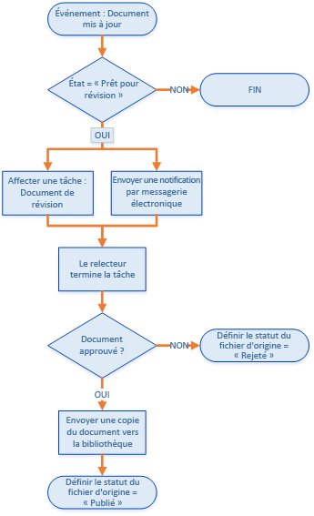
  
    
    
En résumé, le flux de travail effectue les opérations suivantes :
  
    
    

  
    
    

1. Un événement de modification de document associé à une bibliothèque de documents spécifique démarre l'instance de flux de travail.
    
  
2. Si le statut du document est défini sur « Prêt pour révision », le flux de travail affecte une tâche à un réviseur déterminé à l'avance, puis envoie à celui-ci une notification par courrier électronique relative à la tâche.
    
  
3. Si le réviseur ne parvient pas à approuver le document, le fichier du document reste dans la bibliothèque de documents provisoires. Toutefois, le statut du document est défini sur « Rejeté ».
    
  
4. Si le réviseur approuve le document, le flux de travail copie le document dans une bibliothèque de documents publiés. Le fichier d'origine reste dans la bibliothèque de documents provisoires, mais son statut est défini sur « Publié ».
    
  

    
> **IMPORTANTE**
> Avant de commencer cette procédure, assurez-vous que vous disposez d'un environnement de développement de flux de travail correctement installé et configuré. Pour plus d'informations, voir  [Préparez-vous à installer et configurer un environnement de développement de flux de travail SharePoint](prepare-to-set-up-and-configure-a-sharepoint-workflow-development-environment.md). En outre, assurez-vous de disposer d'une instance SharePoint Server 2013 par rapport à laquelle vous pouvez développer votre flux de travail. Pour plus d'informations, voir  [Installer SharePoint 2013](http://technet.microsoft.com/fr-fr/library/cc303424.aspx). 
  
    
    


## Préparation de votre environnement
<a name="bmPrepare"> </a>

La première étape consiste à préparer le site SharePoint avec des bibliothèques de documents que les flux de travail utiliseront.
  
    
    

1. Lancez Visual Studio 2012 et créez un projet à l'aide du modèle **Application pour SharePoint 2013**, comme illustré dans la figure 2.
    
    > **REMARQUE**
      > Dans cette procédure, le fichier de solution est appelé « DocApprovalWorkflow1 ». Il est recommandé d'utiliser le même nom. Toutefois, si vous attribuez un autre nom à votre solution, assurez-vous que vous apportez les modifications nécessaires dans les instructions qui suivent. 

   **Figure 2. Création d'un projet dans Visual Studio 2012**

  

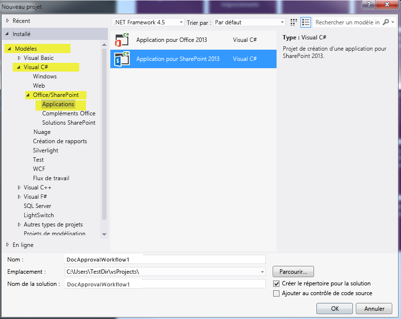
  

  

  
2. Sur votre site SharePoint associé, créez deux bibliothèques de documents en procédant comme suit :
    
  - Dans l' **Explorateur de solutions**, cliquez avec le bouton droit de la souris sur l'icône « DocApprovalWorkflow1 », sélectionnez **Ajouter** > **Nouvel élément**, puis choisissez **Liste**.
    
  
  - Dans l' **Assistant Personnalisation de SharePoint** qui s'ouvre, saisissez « documents provisoires » dans le champ de nom, puis sélectionnez « Bibliothèque de documents » dans le menu déroulant sous la première case d'option, comme illustré dans la figure 3.
    
  
  - Cliquez sur **Suivant**, sélectionnez les paramètres par défaut, puis cliquez sur **Terminer**.
    
   **Figure 3. Assistant Personnalisation de SharePoint pour les paramètres de la liste.**

  

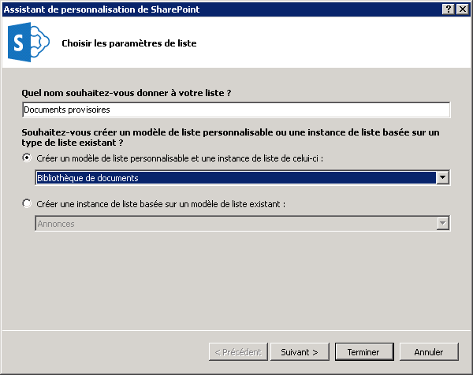
  

  

  
3. Créez la deuxième bibliothèque de documents à l'aide de la procédure utilisée ci-dessus, mais attribuez-lui le nom « Documents publiés ».
    
  
4. Ajoutez deux colonnes personnalisées aux **deux** bibliothèques de documents que vous venez de créer :
    
  - Créez une colonne personnalisée portant le nom « Approbateur » et attribuez-lui le type de colonne de liste **Personne ou groupe**.
    
  
  - Créez une colonne personnalisée portant le nom « Statut de document » et attribuez-lui le type de colonne de liste **Choix** (voir figure 4).
    
  
5. Dans la colonne **Statut de document**, ajoutez cinq choix en développant la propriété **Type** dans la grille des propriétés, puis en cliquant sur le bouton de sélection ( **...**) sur la propriété **Items**. Saisissez les valeurs de choix dans la boîte de dialogue qui s'affiche, comme illustré dans la figure 4.
    
  - Brouillon en cours
    
  
  - Prêt pour révision
    
  
  - Approuvé pour publication
    
  
  - Rejeté
    
  
  - Publié
    
  

   ****

  

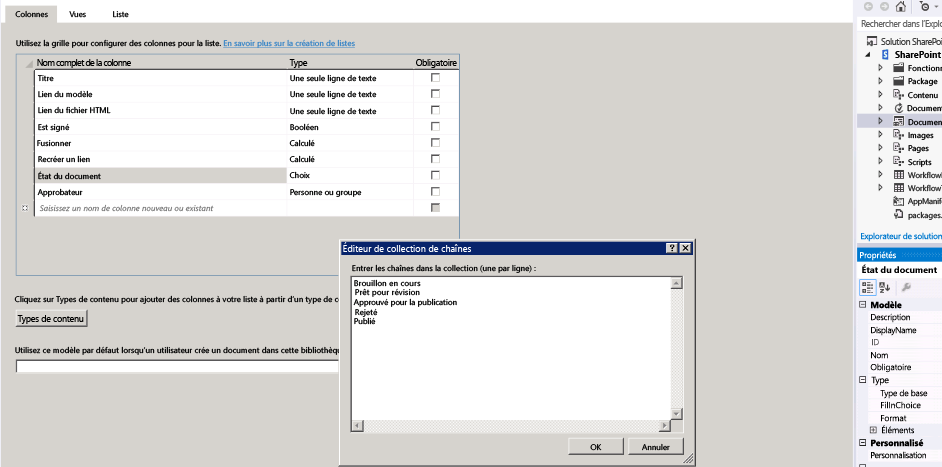
  

  

  

## Création du flux de travail de base
<a name="bmCreateWorkflow"> </a>

Nous sommes maintenant prêts à créer le flux de travail.
  
    
    

1. Dans Visual Studio, créez un flux de travail en cliquant avec le bouton droit de la souris sur l'icône **DocApprovalWorkflow1** (dans l' **Explorateur de solutions**), en sélectionnant **Ajouter** > **Nouvel élément**, et en cliquant sur **Flux de travail** (voir figure 5).
    
   **Figure 5. Assistant Ajouter un nouvel élément > Flux de travail.**

  

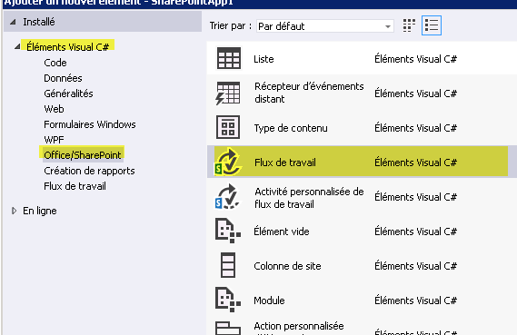
  

  

  
2. Lorsque vous y êtes invité, nommez le flux de travail « DocumentApprovalWorkflow » et sélectionnez **Flux de travail de liste** en tant que type de flux de travail (voir figure 6).
    
   **Figure 6. Indication du nom et du type de flux de travail.**

  

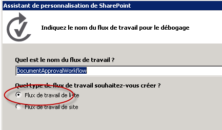
  

  

  
3. Dans l' **Assistant Personnalisation de SharePoint**, associez le nouveau flux de travail à la bibliothèque de documents provisoires. Ensuite, créez un historique et une liste de tâches de flux de travail, comme indiqué dans la figure 7, puis cliquez sur **Suivant**.
    
   **Figure 7. Exécution de l'Assistant Personnalisation de SharePoint pour le nouveau flux de travail.**

  

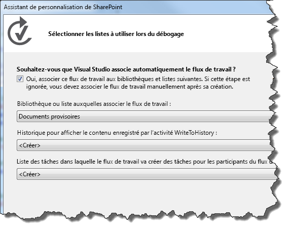
  

  

  
4. Définissez le flux de travail de façon à ce qu'il démarre automatiquement lorsqu'un élément dans la bibliothèque de documents provisoires est modifié. Vous pouvez également laisser la case de démarrage manuel du flux de travail cochée, cela vous permet de tester facilement le flux de travail sans avoir à modifier un document. Voir la figure 8.
    
   **Figure 8. Définition des paramètres d'activation pour le flux de travail.**

  

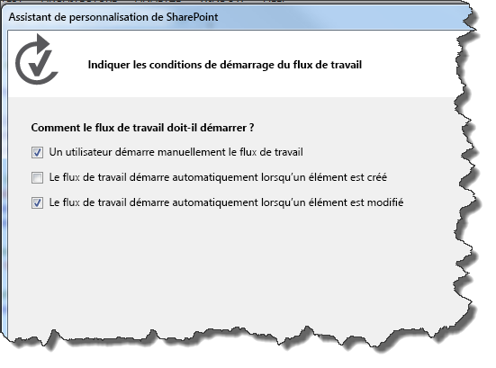
  

    
> **REMARQUE**
> Vous pouvez modifier le type d'association du flux de travail une fois que ce dernier a été créé, et ce à l'aide de la grille des propriétés avec le flux de travail sélectionné dans l' **Explorateur de solutions** (voir figure 9). Cliquez ensuite sur **Terminer**. 

   **Figure 9. Grille des propriétés de flux de travail.**

  

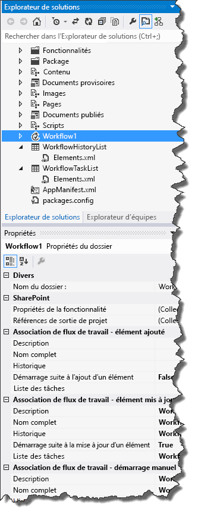
  

  

  
5. Enfin, configurez votre serveur SharePoint Server pour gérer le courrier électronique sortant à l'aide du service SMTP. Pour obtenir des instructions, voir  [Configurer le courrier sortant pour une batterie de serveurs SharePoint 2013](http://technet.microsoft.com/fr-fr/library/cc263462.aspx). Cela est nécessaire pour permettre au flux de travail d'envoyer des notifications par courrier électronique relatives aux tâches de flux de travail.
    
  

## Implémentation de la logique de flux de travail
<a name="bmImplementLogic"> </a>

Maintenant que SharePoint Server est configuré et que votre flux de travail de base est créé, vous pouvez commencer à concevoir la logique de flux de travail.
  
    
    

1. Ouvrez le Concepteur de flux de travail en cliquant deux fois sur l'élément de projet de flux de travail dans l' **Explorateur de solutions**. L'aire du concepteur de flux de travail et la boîte à outils apparaissent. Le concepteur comporte une étape de flux de travail initiale nommée **Séquence**.
    
  
2. La première étape consiste à récupérer l'activité **LookupSPListItem** à partir de la boîte à outils (voir figure 10) et à la déposer dans l'étape **Séquence** sur l'aire du concepteur. Cette activité permet d'obtenir le statut du document à un moment donné, que l'activité **LookupSPListItem** renvoie comme un objet [DynamicValue](http://msdn.microsoft.com/fr-fr/library/windowsazure/microsoft.activities.dynamicvalue%28v=azure.10%29.aspx). Ce dernier contient un ensemble de propriétés d'élément de liste SharePoint en tant que paires clé-valeur.
    
   **Figure 10. Sélecteur d'activité LookupSPListItem.**

  


  

  

1. Pour configurer l'activité **LookupSPListItem**, sélectionnez-la dans le concepteur. Cela active la grille des propriétés de l'activité.
    
  
2. Utilisez les zones de liste déroulante dans la grille des propriétés pour que l'activité **LookupSPListItem** utilise « élément en cours » pour **ItemId** et « liste en cours » pour **ListId**, comme illustré dans la figure 11.
    
   **Figure 11. Configuration des propriétés LookupSPListItem.**

  

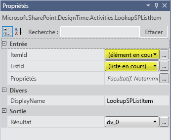
  

  

  
3. Sur la vignette d'activité **LookupSPListItem**, cliquez sur le lien **Obtenir des propriétés**. Cette action marque la fin de deux étapes importantes :
    
1. Tout d'abord, elle crée une variable de type **DynamicValue** et la lie à l'argument de sortie ( _Result_) de l'activité **LookupSPListItem**. Les propriétés de l'élément de liste sont stockées dans cette variable.
    
  
2. Ensuite, elle ajoute une nouvelle activité appelée **GetDynamicValueProperties** (voir figure 12) et définit la variable récemment créée **DynamicValue** en tant qu'argument d'entrée de cette nouvelle activité. Celle-ci vous permet d'extraire les propriétés d'élément de liste de la variable **DynamicValue**.
    
  
4. Dans l'activité **GetDynamicValueProperties**, cliquez sur  *Définir...*  pour ouvrir une boîte de dialogue qui vous permet de choisir les propriétés que vous souhaitez extraire. Pour la sélection des propriétés, reportez-vous à la figure 12, qui montre une partie de l'aire du concepteur fusionnée avec la boîte de dialogue active **Propriétés**.
    
   **Figure 12. Sélection des propriétés DynamicValue que vous souhaitez extraire.**

  

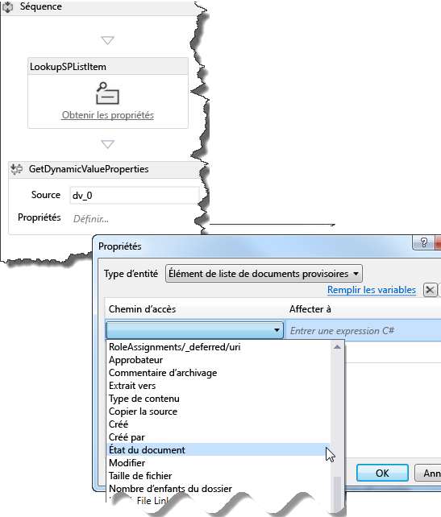
  

  

1. Pour **Type d'entité**, sélectionnez **Élément de liste de documents provisoires**.
    
  
2. Dans la grille de données, dans la colonne **Chemin**, cliquez sur  *Créer une propriété*  pour ouvrir une zone de liste déroulante qui contient des propriétés disponibles pour les éléments de liste dans la bibliothèque de documents provisoires. Sélectionnez **Statut de document** dans la zone de liste déroulante.
    
  
3. Dans la ligne suivante de la grille de données, cliquez à nouveau sur  *Créer une propriété*  . Cette fois, sélectionnez **Approbateur** dans la zone de liste déroulante.
    
  
4. Cliquez sur le lien **Renseigner les variables** dans la boîte de dialogue. Cela crée une variable du type de données approprié pour chaque ligne et l'affecte à la colonne **Affecter à** de la grille de données, comme indiqué dans la figure 13.
    
   **Figure 13. Obtention des propriétés Statut de document et Approbateur.**

  

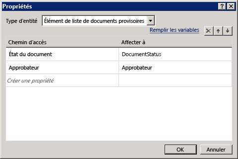
  

  

  
5. Vous disposez désormais des valeurs dont vous avez besoin. L'étape suivante consiste à configurer le flux de travail pour vérifier si le document est « prêt pour révision », et prendre les mesures appropriées si c'est le cas.
    
1. À partir de la boîte à outils, faites glisser l'activité **If** vers l'aire du concepteur de flux de travail. (Vous trouverez l'activité **If** dans la section **Flux de contrôle** de la boîte à outils.)
    
  
2. Définissez la condition **If** sur `DocumentStatus.Equals("Ready for Review")`, comme indiqué dans la figure 14.
    
   **Figure 14. Création d'une clause If/Then pour déclencher une tâche.**

  

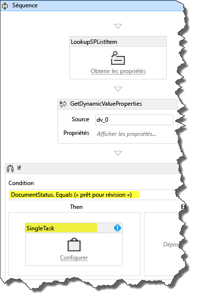
  

  

  
3. Ensuite, dans la section **SP - Tâche** de la boîte à outils, faites glisser une activité **SingleTask** et déposez-la dans la zone **Then** de votre activité **If**. En effet, vous avez configuré le flux de travail de telle manière que **If** (si) le document est prêt pour révision, **Then** (alors) il effectuera cette tâche.
    
  
6. L'étape suivante consiste à configurer la tâche que vous venez de créer à l'aide de la boîte de dialogue de configuration, comme indiqué dans la figure 15.
    
   **Figure 15. Boîte de dialogue de configuration de tâche.**

  

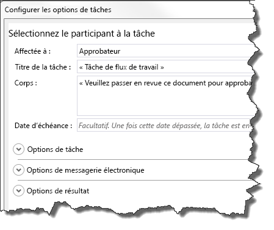
  

  

1. Tout d'abord, affectez la tâche à un approbateur. Pour ce faire, cliquez sur le lien **Configurer** dans la vignette d'activité **SingleTask**.
    
  
2. Définissez le champ **Affecté à** sur « Approbateur ».
    
  
3. Notez que le champ **Titre de la tâche** est automatiquement renseigné par « Tâche de flux de travail ».
    
  
4. Dans le champ **Corps**, saisissez un message simple avec des instructions pour l'approbateur, tel que « Veuillez réviser ce document pour approbation de publication ».
    
  
5. Cliquez sur **OK** pour enregistrer.
    
  

    Notez qu'à ce stade, vous avez une erreur de validation dans l'activité **SingleTask**. Une fois la vignette **SingleTask** sélectionnée, jetez un œil à la propriété **AssignedTo** dans la grille des propriétés et vous remarquerez qu'elle comporte une icône d'erreur. Placez le curseur sur le nom de la propriété pour afficher une info-bulle décrivant le problème. Vous pouvez voir que la propriété **AssignedTo** attend une valeur **String**. Toutefois, la variable **Approbateur** est de type **Int32**.
    
    Pour corriger cette erreur, effectuez un transtypage de la variable afin de la convertir en un type de données **String** en ajoutant « .ToString() » à « Approbateur » sur la ligne **AssignedTo** dans la grille des propriétés, comme indiqué dans la figure 16.
    

   **Figure 16. Transtypage de la variable « Approbateur » en un type de données de chaîne dans la grille des propriétés.**

  

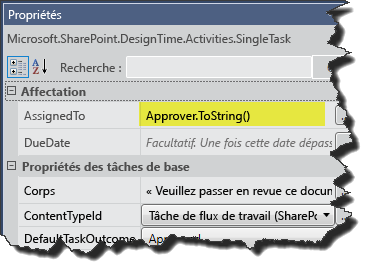
  

À ce point dans la procédure, vous avez créé et configuré une tâche de flux de travail qui a deux fonctions : elle définit un document à réviser, mais envoie également un courrier électronique au cessionnaire de la tâche (ici l'« approbateur »), lui indiquant qu'une tâche lui a été affectée et qu'il doit la traiter.
    
  
7. Examinez la grille des propriétés pour l'activité **SingleTask**. Faites défiler jusqu'au bas de la grille des propriétés et notez que la section **Sortie** comporte deux propriétés, **Outcome** et **TaskItemId**, qui sont des arguments de sortie.
    
    Notez le nom de la variable **Outcome**: _outcome_0_ (ou élément similaire). Vous utilisez cette variable pour vérifier le résultat de la tâche, c'est-à-dire si l'approbateur a approuvé ou rejeté le document.
    
    > **REMARQUE**
      > L'argument de sortie **Outcome** renvoie une valeur **Int32** correspondant à l'index du résultat, c'est-à-dire **0** pour « Approuvé » et **1** pour « Rejeté ». Ces entiers sont les valeurs par défaut fournies dans la colonne de site SharePoint prête à l'emploi intitulée « Résultat de la tâche ».
8. Afin que le flux de travail vérifie le résultat de la tâche, vous devez ajouter une autre activité **If** et la placer à la suite de l'activité **SingleTask**, mais à l'intérieur de la zone **Then**, comme indiqué dans la figure 17. La définition de la condition **If** sur « `outcome_0 == 0` » indique si le document a été approuvé.
    
   **Figure 17. Ajout de l'activité IF pour vérifier le statut de la tâche.**

  

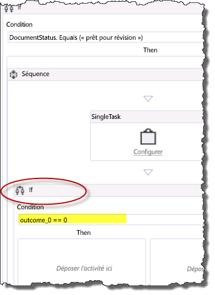
  

  

  
9. Si l'approbateur a défini la tâche sur « Approuvé », mettez à jour le statut du document sur « Approuvé pour publication », puis copiez le fichier du document dans la bibliothèque de documents publiés. Si l'approbateur a rejeté le document, vous devez définir le statut du document sur « Rejeté ».
    
1. Dans cette nouvelle activité **If**, faites glisser une activité **UpdateListItem** dans la zone **Then**.
    
  
2. Configurez l'activité **UpdateListItem** dans sa grille des propriétés de façon à ce que les éléments **ItemId** et **ListId** soient respectivement définis sur « (élément en cours) » et sur « (liste en cours) », comme indiqué dans la figure 18.
    
  
3. Ensuite, une fois l'activité **UpdateListItem** sélectionnée, cliquez sur le bouton de sélection ( **...**) en regard du champ **ListItemPropertiesDynamicValue** dans la grille des propriétés. Cette action ouvre une boîte de dialogue qui vous permet d'indiquer les propriétés d'élément de liste que vous souhaitez mettre à jour.
    
   **Figure 18. Définition des propriétés d'élément de liste à mettre à jour.**

  

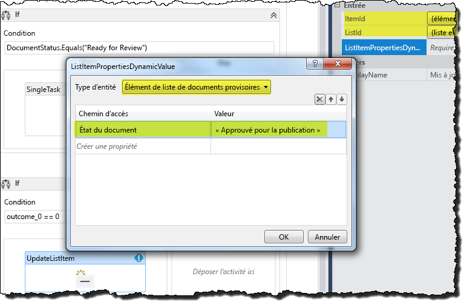
  

  

  
4. Dans la boîte de dialogue, utilisez d'abord la zone de liste déroulante pour définir **Type d'entité** sur **Élément de liste de documents provisoires** (comme indiqué dans la figure 18). Puis, dans la grille des données, cliquez sur **Créer une propriété**, et dans la liste déroulante, sélectionnez « Statut de document ». Ensuite, sous la colonne **Valeur**, saisissez « Approuvé pour publication » (pensez à inclure les guillemets), et cliquez sur **OK**.
    
  
10. Dans la zone **Then** de l'activité **If** en cours, faites glisser une activité **CopyItem** et placez-la directement sous l'activité **UpdateListItem**, comme indiqué dans la figure 19.
    
   **Figure 19. Ajout d'une activité CopyItem au flux de travail.**

  

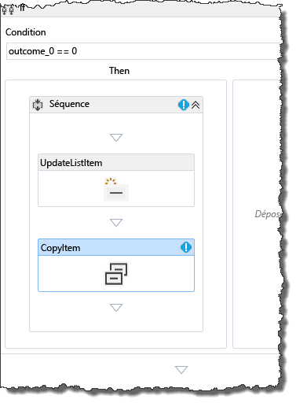
  

Ensuite, configurez les propriétés de l'activité **CopyItem** dans la grille des propriétés, comme illustré dans la figure 20. Les valeurs de propriété sont mises en surbrillance.
    

   **Figure 20. Configuration de l'activité CopyItem.**

  

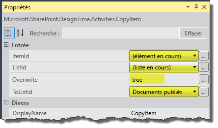
  

    
> **REMARQUE**
> Dans le cadre de cette procédure, supposons que tous les documents publiés proviennent de la bibliothèque de documents provisoires. Il n'est de ce fait pas nécessaire de se préoccuper des noms de fichiers en double. 

11. Enfin, vous devez ajouter une activité pour gérer le cas où le réviseur rejette le document. Pour ce faire, ajoutez une activité **UpdateListItem** à la zone **Else** de votre activité **If** en cours. Configurez cette activité **UpdateListItem** de la même manière que l'activité précédente à l'étape 9(c), sauf que vous souhaitez maintenant définir le statut du document sur « Rejeté », comme indiqué dans la figure 21.
    
   **Figure 21. Configuration des propriétés de l'activité UpdateListItem pour les documents rejetés.**

  

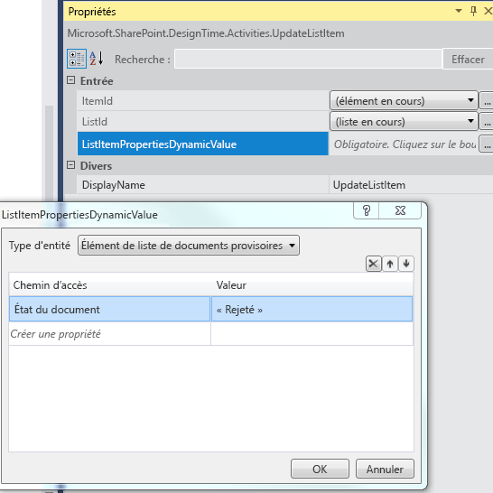
  

  

  
Cette action met fin à la création d'un flux de travail d'approbation de documents SharePoint. Le flux de travail créé est présenté dans la figure 22.
  
    
    

**Figure 22. Flux de travail d'approbation de document SharePoint terminé.**

  
    
    

  
    
    

  
    
    

  
    
    

  
    
    

## Empaquetage et déploiement du flux de travail
<a name="bk_deploy"> </a>

Vous trouverez ci-dessous des ressources qui fournissent des instructions pour empaqueter et déployer votre flux de travail en tant qu'Complément SharePoint :
  
    
    

-  [Déploiement et installation d'applications pour SharePoint : méthodes et options](http://msdn.microsoft.com/fr-fr/library/fp179933.aspx)
    
  
-  [Publier des applications pour SharePoint](http://msdn.microsoft.com/fr-fr/library/jj164070.aspx)
    
  
-  [Procédure pas à pas : création et déploiement de flux de travail déclaratifs dans des solutions en bac à sable (Sandbox)](http://msdn.microsoft.com/fr-fr/library/gg615452%28v=office.14%29.aspx) (à l'aide de SharePoint Designer 2013)
    
  

> **ATTENTION**
> Les Compléments SharePoint qui contiennent des flux de travail intégrés (qui peuvent être associés à des listes sur le site web parent) se distinguent des applications de flux de travail standard en définissant l'indicateur suivant sur **true** dans le fichier `workflowmanifest.xml` du package d'application :
  
    
    


```XML

<SPIntegratedWorkflow xmlns="http://schemas.microsoft.com/sharepoint/2014/app/integratedworkflow">
    <IntegratedApp>true</IntegratedApp>
</SPIntegratedWorkflow>

```


## Ressources supplémentaires
<a name="bk_addresources"> </a>


-  [Flux de travail dans SharePoint 2013](workflows-in-sharepoint-2013.md)
    
  
-  [Préparez-vous à installer et configurer un environnement de développement de flux de travail SharePoint](prepare-to-set-up-and-configure-a-sharepoint-workflow-development-environment.md)
    
  
-  [SharePoint flux de travail meilleures pratiques de développement](sharepoint-workflow-development-best-practices.md)
    
  
-  [Développer des flux de travail SharePoint 2013 à l'aide de Visual Studio](develop-sharepoint-2013-workflows-using-visual-studio.md)
    
  

  
    
    

