# Créer un flux de travail avec des autorisations élevées à l'aide de la plateforme SharePoint 2013 Workflow
Découvrez comment créer un flux de travail avec des autorisations élevées à l'aide de la plateforme de flux de travail SharePoint 2013.
## Flux de travail et catalogue d'applications SharePoint Server 2013
<a name="section1"> </a>

Cet article décrit comment créer des flux de travail SharePoint 2013 qui accèdent aux objets dans SharePoint nécessitant des autorisations élevées. Ces solutions utilisent deux fonctionnalités : l'octroi d'autorisations à l'application de flux de travail et l'intégration d'actions dans l'étape de l'application.
  
    
    

> **IMPORTANTE**
> Cet article part du principe que la plateforme de flux de travail SharePoint 2013 a été installée et configurée et que SharePoint 2013 a été configuré pour les applications. Pour plus d'informations sur le flux de travail SharePoint 2013 et les applications pour SharePoint 2013, y compris l'installation et la configuration, voir  [Flux de travail dans SharePoint 2013](http://technet.microsoft.com/sharepoint/jj556245.aspx) et [Install and manage apps for SharePoint 2013](http://msdn.microsoft.com/library/733647a3-a5d3-475b-967d-3bb627c2a0c2.aspx). 
  
    
    


### Vue d'ensemble de la création d'un flux de travail avec des autorisations élevées

Imaginez qu'en tant qu'administrateur SharePoint vous souhaitiez définir des processus de gestion des demandes des utilisateurs pour les achats d'applications à partir de l'Office Store. Dans le cas le plus simple, vous souhaitez envoyer un accusé de réception par courrier électronique lorsqu'un utilisateur demande une application. Vous voudrez peut-être également structurer le processus d'approbation des demandes.
  
    
    
Par défaut, le flux de travail ne dispose pas des autorisations pour accéder au catalogue de demande d'application. Les listes de catalogues dans SharePoint requièrent des autorisations de propriétaire (contrôle total). Les flux de travail s'exécutent généralement à un niveau d'autorisation équivalent à une autorisation d'écriture.
  
    
    
Pour résoudre ce problème, vous devez créer un flux de travail avec des autorisations élevées en procédant comme suit dans le site de collection de sites :
  
    
    

1. Autorisez le flux de travail à utiliser des autorisations d'application.
    
  
2. Accordez l'autorisation contrôle total au flux de travail.
    
  
3. Développez le flux de travail pour intégrer des actions à l'intérieur d'une étape de l'application.
    
  

### Permettre à un flux de travail d'utiliser des autorisations d'application dans un site SharePoint Server 2013

La première étape consiste à autoriser le flux de travail à utiliser les autorisations d'application. Pour configurer le flux de travail afin qu'il utilise des autorisations d'application, accédez à la page **Paramètres du site** du site SharePoint Server 2013 où le flux de travail sera exécuté. La procédure suivante configure le site SharePoint Server 2013 pour permettre au flux de travail d'utiliser les autorisations d'application.
  
    
    

> **IMPORTANTE**
> La procédure doit être exécutée par un utilisateur qui dispose des autorisations **Propriétaire du site**. 
  
    
    


### Pour permettre au flux de travail d'utiliser les autorisations d'application


1. Cliquez sur l'icône **Paramètres** comme illustré dans la figure.
    
   **Figure : ouverture de la page Paramètres du site**

  


  

  

  
2. Accédez à **Paramètres du site**.
    
  
3. Dans la section **Actions du site**, sélectionnez **Gérer les fonctionnalités du site**.
    
  
4. Recherchez la fonctionnalité appelée **Les flux de travail peuvent utiliser les autorisations d'applications**, comme illustré dans la figure, puis cliquez sur **Activer**.
    
    > **ATTENTION**
      > Cette fonctionnalité ne sera pas activée tant que vous n'aurez pas correctement configuré la plateforme de flux de travail SharePoint 2013 et également les applications pour SharePoint. 

   **Figure : fonctionnalité de site Les flux de travail peuvent utiliser les autorisations d'applications**

  

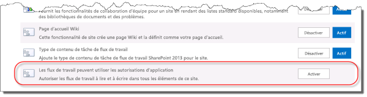
  

  

  

### Octroi de l'autorisation contrôle total à un flux de travail

Pour que le flux de travail fonctionne correctement, l'autorisation contrôle total sur le site doit lui être accordée. La procédure suivante accorde l'autorisation contrôle total au flux de travail.
  
    
    

> **IMPORTANTE**
>  Les exigences suivantes doivent être remplies :


-  La procédure doit être exécutée par un utilisateur qui dispose des autorisations **Propriétaire du site**.


-  Le flux de travail doit déjà être publié sur le site SharePoint Server 2013.
  
    
    


### Pour accorder l'autorisation contrôle total à un flux de travail


1. Cliquez sur l'icône **Paramètres**, comme illustré dans la figure.
    
   **Figure : ouverture de la page Paramètres du site**

  


  

  

  
2. Accédez à **Paramètres du site**.
    
  
3. Dans la section **Utilisateurs et autorisations**, sélectionnez **Autorisations d'application du site**.
    
  
4. Copiez la section **client** de l' **Identificateur d'application**. Il s'agit de l'identificateur entre la dernière barre verticale « | » et le signe « @ », comme illustré dans la figure.
    
   **Figure : sélection de l'identificateur d'application**

  


  

  

  
5. Accédez à la page **Accorder l'autorisation à une application**. Pour ce faire, accédez à la page appinv.aspx du site.
    
    Exemple : http://{nom hôte}/{collection de sites}/_layouts/15/appinv.aspx. 
    
    Pour plus d'informations sur la configuration d'un flux de travail, consultez  [l'article de blog de Sympraxis Consulting, relatif à la boucle dans le contenu d'un flux de travail de site SharePoint 2013](http://sympmarc.com/2016/01/14/looping-through-content-in-a-sharepoint-2013-site-workflow-part-1-introduction).
    
    La figure suivante montre un exemple.
    

   **Figure : exemple de page appinv.aspx et d'URL**

  

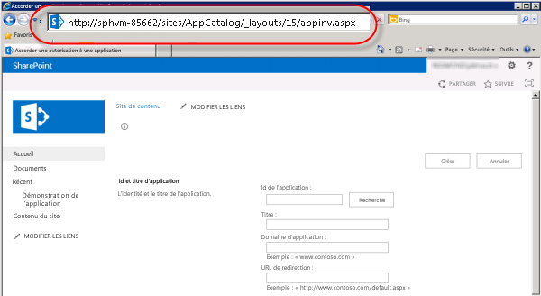
  

  

  
6. Collez l'ID client dans le champ **ID de l'application**, puis cliquez sur **Recherche**, comme illustré dans la figure.
    
  
7. Collez l'expression XML de **demande d'autorisations** suivante pour accorder l'autorisation contrôle total.
    
  ```
  
<AppPermissionRequests>
    <AppPermissionRequest Scope="http://sharepoint/content/sitecollection/web" Right="FullControl" />
</AppPermissionRequests>

  ```


> **ATTENTION**
> Aucun espace réservé ne se trouve dans la valeur **Scope** ci-dessus. Il s'agit d'une valeur littérale. Entrez-la exactement comme elle apparaît ici.

La figure suivante illustre un exemple de la page terminée.
    

   **Figure : recherche d'ID d'application**

  

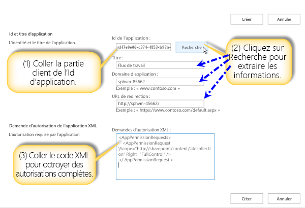
  

  

  
8. Cliquez sur **Créer**.
    
  
9. Vous serez ensuite invité à approuver l'application de flux de travail, comme indiqué dans la figure. Cliquez sur **Approuver**.
    
   **Figure : approbation de l'application de flux de travail**

  

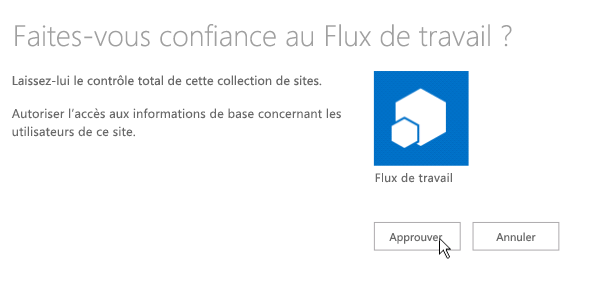
  

  

  

### Intégration d'actions dans une étape de l'application

Enfin, vous devez intégrer les actions de flux de dans une étape de l'application. La procédure suivante intègre une action **Envoyer un courrier électronique** dans une étape de l'application. Dans cet exemple, le flux de travail envoie un accusé de réception par courrier électronique à partir d'une liste personnalisée.
  
    
    

### Pour intégrer des actions dans une étape de l'application


1. Ouvrez le site de catalogue d'applications dans SharePoint Designer 2013.
    
  
2. Créez une liste personnalisée sur laquelle exécuter le flux de travail. Dans cet exemple, le nom de la liste est **Démonstration de l'application**.
    
  
3. Cliquez sur **Flux de travail** dans la fenêtre de navigation.
    
  
4. Créez un flux de travail de liste pour la liste Démonstration de l'application, comme illustré dans la figure.
    
   **Figure : création d'un flux de travail de liste**

  

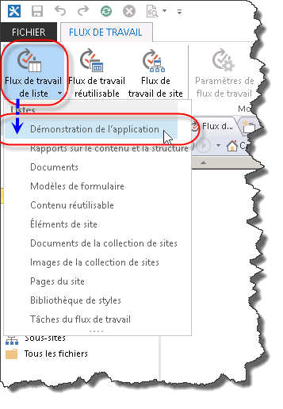
  

  

  
5. Insérez une **étape de l'application**, comme illustré dans la figure.
    
   **Figure : ajout d'une étape de l'application**

  

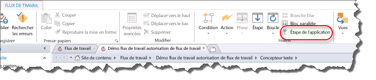
  

  

  
6. Insérez une action **Envoyer un courrier électronique** dans l' **étape de l'application**.
    
  
7. Cliquez sur le bouton **carnet d'adresses**. Dans le champ **À**, sélectionnez **Recherche de flux de travail pour un utilisateur** et cliquez sur **ajouter** comme le montre la figure.
    
   **Figure : sélection de Recherche de flux de travail pour un utilisateur**

  

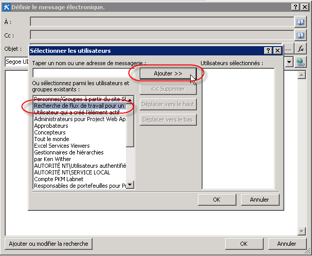
  

  

  
8. Définissez le champ **Créé par** comme valeur de recherche, tel qu'illustré dans la figure.
    
   **Figure : boîte de dialogue de recherche de personne**

  

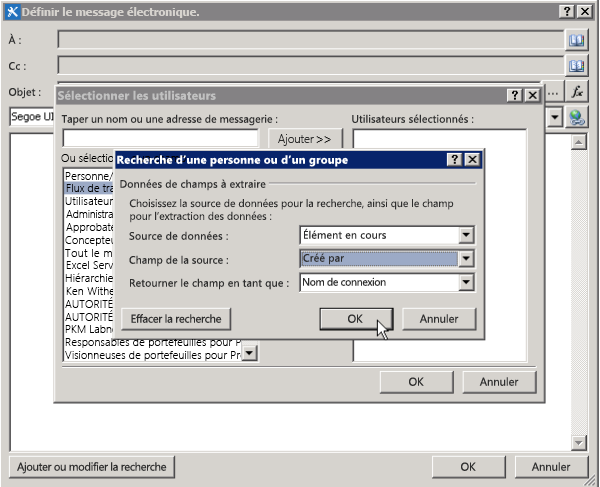
  

  

  
9. Entrez E-mail de la liste Démonstration de l'application dans le corps du message électronique.
    
  
10. Cliquez sur **OK** pour retourner dans le flux de travail. Le flux de travail terminé est illustré dans la figure.
    
   **Figure : action de message électronique dans l'étape de l'application**

  

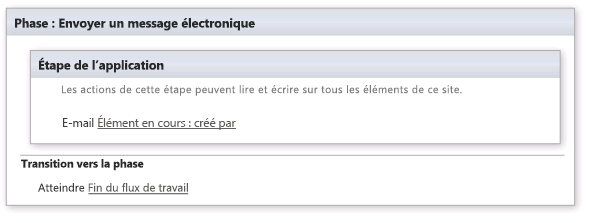
  

  

  
11. Cliquez sur l'icône **Paramètres du flux de travail** dans le ruban, comme illustré dans la figure.
    
   **Figure : icône Paramètres du flux de travail dans le ruban**

  

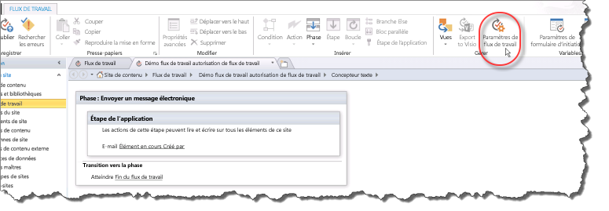
  

  

  
12. Désactivez la case en regard de **Mettre automatiquement à jour l'état du flux de travail au nom de l'étape actuelle**, puis cliquez sur **Publier**, comme illustré dans la figure.
    
   **Figure : désactivation de la case de mises à jour automatiques et publication**

  

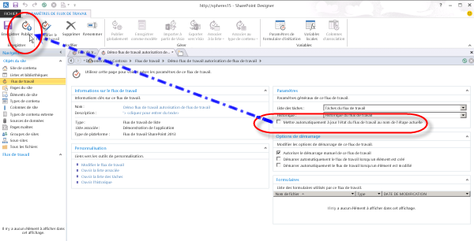
  

  

  

## Présentation du fonctionnement
<a name="section2"> </a>

Pour comprendre pourquoi l'élévation des autorisations pour un flux de travail est requise, considérez que les flux de travail sont, au fond, des applications pour SharePoint et qu'ils suivent les mêmes règles d'autorisation que celles du modèle d'application. La configuration par défaut du flux de travail définit les autorisations effectives du flux de travail comme une intersection entre les autorisations utilisateur et les autorisations d'application, comme illustré dans la figure.
  
    
    

**Figure : diagramme des autorisations**

  
    
    

  
    
    
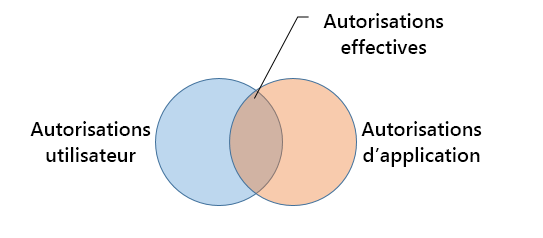
  
    
    
Voici les deux raisons qui justifient d'élever les autorisations pour créer un flux de travail dans la liste Demande d'application :
  
    
    

- Par défaut, le flux de travail dispose uniquement de l'autorisation d'écriture.
    
  
- L'utilisateur ne dispose d'aucune autorisation.
    
  
La première étape pour résoudre ce problème consiste à permettre à l'application d'accorder des autorisations à l'aide uniquement de son identité et d'ignorer celles de l'utilisateur. Pour ce faire, vous devez activer la fonctionnalité Étape de l'application. La deuxième étape accorde l'autorisation contrôle total au flux de travail.
  
    
    
Le diagramme suivant illustre la modification des autorisations
  
    
    

**Figure : matrice des autorisations**

  
    
    

  
    
    
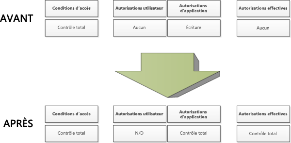
  
    
    

  
    
    

  
    
    

## Ressources supplémentaires
<a name="section3"> </a>


-  [Flux de travail dans SharePoint 2013](http://technet.microsoft.com/fr-fr/sharepoint/jj556245.aspx)
    
  
-  [Install and manage apps for SharePoint 2013](http://msdn.microsoft.com/library/733647a3-a5d3-475b-967d-3bb627c2a0c2.aspx)
    
  
-  [What's new in workflow in SharePoint Server 2013](http://msdn.microsoft.com/library/6ab8a28b-fa2f-4530-8b55-a7f663bf15ea.aspx)
    
  
-  [Getting started with SharePoint Server 2013 workflow](http://msdn.microsoft.com/library/cc73be76-a329-449f-90ab-86822b1c2ee8.aspx)
    
  
-  [Développement de flux de travail dans SharePoint Designer et Visio](workflow-development-in-sharepoint-designer-and-visio.md)
    
  
-  [Référence rapide relative aux actions de flux de travail (plateforme de flux de travail SharePoint 2013)](workflow-actions-quick-reference-sharepoint-2013-workflow-platform.md)
    
  
-  [Article du blog de l'équipe SharePoint Designer : scénario de création de package de flux de travail et de déploiement](http://blogs.msdn.com/b/sharepointdesigner/archive/2012/08/30/packaging-list-site-and-reusable-workflow-and-how-to-deploy-the-package.aspx)
    
  
-  [Article de blog de Sympraxis Consulting relatif à la boucle dans le contenu d'un flux de travail de site SharePoint 2013](http://sympmarc.com/2016/01/14/looping-through-content-in-a-sharepoint-2013-site-workflow-part-1-introduction).
    
  

