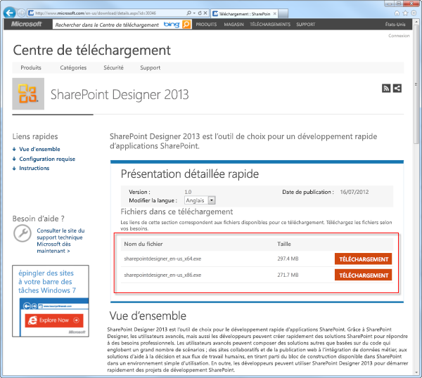
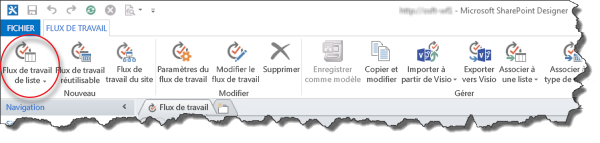
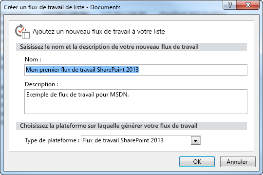
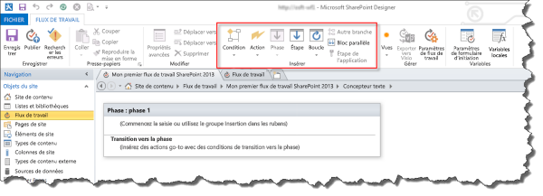

# Création d'un flux de travail à l'aide de SharePoint Designer 2013 et de la plateforme de flux de travail SharePoint 2013
Découvrez comment installer, ouvrir et créer un flux de travail à l'aide de SharePoint Designer 2013 et de la plateforme de flux de travail SharePoint 2013. 
||
|:-----|
||
   

## Installer SharePoint Designer 2013

SharePoint Designer 2013 est disponible en téléchargement gratuit. Pour télécharger et installer SharePoint Designer 2013, procédez comme suit : 
  
    
    

### Pour installer SharePoint Designer 2013

1. Ouvrez votre navigateur web et accédez au Centre de téléchargement Microsoft :  [http://www.microsoft.com/download/](http://www.microsoft.com/download/fr-fr.aspx). 
    
  
2. Tapez SharePoint Designer 2013 dans le champ de recherche.
    
  
3. Cliquez sur le lien correspondant à « SharePoint Designer 2013 ». 
    
  
4. Consultez les instructions relatives à la vue d'ensemble, à la configuration système et à l'installation. Assurez-vous que votre système est compatible. 
    
  
5. Sélectionnez votre type de la plateforme : 64 bits ( **x64**) ou 32 bits ( **x86**), comme le montre la figure. 
    
  
6. Suivez les instructions pour installer SharePoint Designer 2013.
    
  

**Figure : Page de téléchargement de SharePoint Designer 2013**

  
    
    

  
    
    

  
    
    

  
    
    

  
    
    

## Ouvrir SharePoint Designer 2013 et se connecter à un site SharePoint 2013

SharePoint Designer 2013 est installé comme une application Office 2013. Pour ouvrir SharePoint Designer 2013 et vous connecter à un site SharePoint 2013, procédez comme suit : 
  
    
    

### Pour ouvrir SharePoint Designer 2013 et se connecter à un site SharePoint 2013

1. Sélectionnez SharePoint Designer 2013 dans le menu **Démarrer** pour l'ouvrir. Cliquez sur l'icône **Démarrer**, **Tous les programmes**, **Microsoft Office 2013**, puis **SharePoint Designer 2013**. 
    
  
2. Cliquez sur **Ouvrir le site** sur la page de démarrage de SharePoint Designer 2013.
    
  
3. Saisissez le site SharePoint 2013 auquel vous souhaitez vous connecter. Par exemple, http://www.contoso.com/sites/a-sharepoint-site.
    
  
4. Cliquez sur **Ouvrir** pour ouvrir le site.
    
  
5. Saisissez vos informations d'identification, si vous y êtes invité (si l'ordinateur avec lequel vous vous connectez n'est pas sécurisé, vous êtes invité à saisir vos informations d'identification). Assurez-vous que vous utilisez des informations d'identification ayant accès au site SharePoint 2013.
    
  

## Créer un flux de travail de liste basé sur la plateforme de flux de travail SharePoint 2013

SharePoint Designer 2013 peut être utilisé pour de nombreuses tâches importantes. Le volet de navigation est utilisé pour basculer entre les différents aspects de SharePoint Designer 2013. Pour créer un flux de travail de liste basé sur la plateforme de flux de travail SharePoint 2013, procédez comme suit :
  
    
    

### Pour créer un flux de travail basé sur la plateforme de flux de travail SharePoint 2013

1. Cliquez sur le nœud Flux de travail dans le volet de navigation.
    
  
2. Cliquez sur la liste déroulante **Flux de travail de liste** dans la section **Nouveau** du ruban, comme le montre la figure.
    
  
3. Sélectionnez la liste que vous souhaitez associer au nouveau flux de travail.
    
  
4. Dans la boîte de dialogue **Créer un flux de travail de liste**, entrez le nom et la description du flux de travail, puis assurez-vous que le **type de plateforme** est défini sur **Flux de travail SharePoint 2013**, comme le montre la figure.
    
    > **REMARQUE**
      > Si Flux de travail SharePoint 2013 n'apparaît pas comme type de plateforme disponible, Workflow Manager n'est pas configuré pour fonctionner avec la batterie de serveurs SharePoint Server 2013. 
5. Cliquez sur **OK** pour créer le flux de travail.
    
  

**Figure : Bouton du ruban pour la création d'un flux de travail de liste**

  
    
    

  
    
    

  
    
    

  
    
    

  
    
    

**Figure : Boîte de dialogue Créer un flux de travail de liste**

  
    
    

  
    
    

  
    
    

  
    
    

  
    
    
Une fois le flux de travail créé, vous pouvez ajouter des actions, des conditions, des phases, des étapes et des boucles pour créer votre flux de travail. Ces composants de flux de travail sont disponibles dans le ruban de SharePoint Designer 2013, comme le montre la figure. 
  
    
    

**Figure : Éléments de flux de travail pour la plateforme de flux de travail SharePoint 2013**

  
    
    

  
    
    

  
    
    

    
> **REMARQUE**
> La procédure ci-dessus explique comment créer un flux de travail de liste. Un flux de travail réutilisable ou un flux de travail de site peut être créé à l'aide de la même procédure en appliquant la modification suivante : au lieu de sélectionner le bouton Flux de travail de liste dans le ruban, sélectionnez le bouton **Flux de travail réutilisable** ou **Flux de travail de site** lors de la création du flux de travail.
  
    
    

Pour en savoir plus sur les composants de développement de flux de travail disponibles, voir  [Référence rapide relative aux actions de flux de travail (plateforme de flux de travail SharePoint 2013)](workflow-actions-quick-reference-sharepoint-2013-workflow-platform.md).
  
    
    

## Ressources supplémentaires

-  [What's new in workflow in SharePoint Server 2013](http://msdn.microsoft.com/library/6ab8a28b-fa2f-4530-8b55-a7f663bf15ea.aspx)
    
  
-  [Getting started with SharePoint Server 2013 workflow](http://msdn.microsoft.com/library/cc73be76-a329-449f-90ab-86822b1c2ee8.aspx)
    
  
-  [Développement de flux de travail dans SharePoint Designer et Visio](workflow-development-in-sharepoint-designer-and-visio.md)
    
  

  
    
    

