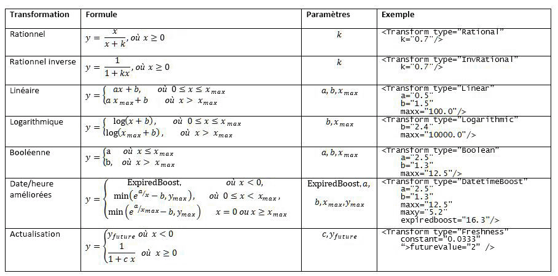
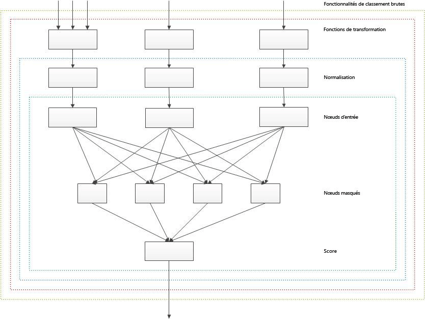

# Personnalisation des modèles de classement afin d'améliorer la pertinence dans SharePoint 2013
Améliorez la pertinence de la recherche en personnalisant les modèles de classement pour calculer précisément le score de classement (pertinence) à l'aide des fonctionnalités de classement dans SharePoint Server 2013.
Vous pouvez  [trier les résultats de recherche dans SharePoint 2013](sorting-search-results-in-sharepoint-2013.md) de quatre manières différentes, y compris par score de classement. Lorsque vous triez des résultats de recherche par score de classement, SharePoint Server 2013 place les résultats plus pertinents en premier dans le jeu des résultats de la recherche.
  
    
    

Un résultat de recherche est considéré comme pertinent s'il reçoit un score de classement élevé, qui correspond à un score calculé par le moteur de recherche avec le modèle de classement. Le modèle de classement est une liste d'une ou plusieurs étapes de classement qui contiennent un ensemble de fonctionnalités de classement.
Le modèle de classement définit la façon dont le moteur de recherche calcule la pertinence selon différents facteurs, qui sont représentés dans le modèle de classement par des fonctionnalités de classement. Les facteurs utilisés pour calculer la pertinence comprennent entre autres :
  
    
    


- La présence des termes de la requête dans l'index en texte intégral, ce qui comprend des informations telles que le titre et le corps du document.
    
  
- Les métadonnées associées à un élément spécifique, par exemple le type de fichier ou la longueur de l'URL d'un document.
    
  
- Le texte d'ancrage associé aux liens URL qui pointent vers un article particulier.
    
  
- Les informations sur lesquelles l'utilisateur clique pour chaque élément.
    
  
- La proximité des termes de la requête dans le corps du document ou dans son titre.
    
  

## Personnaliser votre modèle de classement sur la base d'un modèle de classement SharePoint
<a name="sp15_using_custom_ranking_model"> </a>

Pour faciliter la personnalisation, utilisez comme modèle un des modèles de classement par défaut de SharePoint Server 2013. Modifiez ensuite ce modèle de classement en fonction de votre jeu de données.
  
    
    
SharePoint Server 2013 comprend 14 modèles de classement par défaut. Pour plus d'informations sur ces modèles de classement et leur finalité, consultez l'article  [Qu'est-ce qu'un modèle de classement ?](http://technet.microsoft.com/library/7c8ddec1-c8ff-4a90-afae-387b27a653f1.aspx#Ranking_Models) (sur le site TechNet).
  
    
    

> **IMPORTANTE**
> Si vous installez la mise à jour cumulative d'août 2013 pour SharePoint Server 2013, nous vous recommandons d'utiliser le **Search Ranking Model with Two Linear Stages** comme base pour votre modèle de classement personnalisé. Le **Search Ranking Model with Two Linear Stages** est une copie de la **Default Search Model** avec une deuxième étape linéaire au lieu d'une deuxième étape de réseau neuronal.
  
    
    

Vous utilisez les applets de commande suivantes Windows PowerShell pour personnaliser les modèles de classement :
  
    
    

-  [Get-SPEnterpriseSearchRankingModel](http://technet.microsoft.com/fr-fr/library/ff607990.aspx)
    
  
-  [New-SPEnterpriseSearchRankingModel](http://technet.microsoft.com/fr-fr/library/ff607980.aspx)
    
  
-  [Remove-SPEnterpriseSearchRankingModel](http://technet.microsoft.com/fr-fr/library/ff608045.aspx)
    
  
-  [Set-SPEnterpriseSearchRankingModel](http://technet.microsoft.com/fr-fr/library/ff607940.aspx)
    
  

### Pour obtenir la liste de tous les modèles de classement disponibles


1. Ouvrez SharePoint Management Shell en tant qu'administrateur.
    
  
2. Exécutez les applets de commande Windows PowerShell suivantes dans cet ordre.
    
  ```
  
$ssa = Get-SPEnterpriseSearchServiceApplication -Identity "Search Service Application"
$owner = Get-SPenterpriseSearchOwner -Level ssa
Get-SPEnterpriseSearchRankingModel -SearchApplication $ssa -Owner $owner
  ```


### Pour récupérer un modèle de classement par défaut à utiliser en tant que modèle


1. Ouvrez SharePoint Management Shell en tant qu'administrateur.
    
  
2. Exécutez les applets de commande Windows PowerShell suivantes dans cet ordre.  *nomfichier.xml*  est le nom du fichier dans lequel vous souhaitez enregistrer le modèle de classement.
    
  ```
  
$ssa = Get-SPEnterpriseSearchServiceApplication
$owner = Get-SPenterpriseSearchOwner -Level ssa
$defaultRankingModel = Get-SPEnterpriseSearchRankingModel -SearchApplication $ssa -Owner $owner | Where-Object { $_.IsDefault -eq $True }
$defaultRankingModel.RankingModelXML > filename.xml

  ```

Si vous installez la mise à jour cumulative d'août 2013 pour SharePoint Server 2013, vous pouvez utiliser la procédure suivante pour récupérer le modèle de classement de recherche avec deux étapes linéaires pour l'utiliser comme modèle pour votre modèle de classement personnalisé.
  
    
    

### Pour récupérer le modèle de classement des résultats de recherche avec deux étapes linéaires à utiliser en tant que modèle


1. Ouvrez SharePoint Management Shell en tant qu'administrateur.
    
  
2. Exécutez les applets de commande Windows PowerShell suivantes dans cet ordre.  *nomfichier.xml*  est le nom du fichier dans lequel vous souhaitez enregistrer le modèle de classement.
    
  ```
  
$ssa = Get-SPEnterpriseSearchServiceApplication
$owner = Get-SPenterpriseSearchOwner -Level ssa 
$twoLinearStagesRankingModel = Get-SPEnterpriseSearchRankingModel -SearchApplication $ssa -Owner $owner -Identity 5E9EE87D-4A68-420A-9D58-8913BEEAA6F2 
$twoLinearStagesRankingModel.RankingModelXML > filename.xml

  ```


### Déployer un modèle de classement personnalisé


1. Dans la liste des modèles de classement disponibles, copiez le GUID du modèle de classement que vous souhaitez utiliser comme modèle. (Consultez  [Pour obtenir la liste de tous les modèles de classement disponibles](#sp15_list_available_ranking_models) pour récupérer la séquence d'applets de commande Windows PowerShell à appliquer.)
    
  
2. Exécutez la séquence d'applets de commande Windows PowerShell suivante avec le GUID copié à l'étape 1 pour  _<GUID>_.
    
  ```
  
$ssa = Get-SPEnterpriseSearchServiceApplication
$owner = Get-SPenterpriseSearchOwner -Level ssa
$rm = Get-SPEnterpriseSearchRankingModel -Identity <GUID> -SearchApplication $ssa -Owner $owner
$rm.RankingModelXML > myrm.xml 

  ```

3. Modifiez le fichier  `myrm.xml` dans un éditeur XML. Vous devez utiliser les nouvelles valeurs GUID pour les attributs **id** dans l'élément _RankModel2Stage_ et dans tous les éléments _RankingModel2NN_. Pour obtenir une nouvelle valeur GUID, vous pouvez par exemple utiliser la commande Windows PowerShell suivante :  `[guid]::NewGuid()`
    
  
4. Créez un modèle de classement avec l'applet de commande  [New-SPEnterpriseSearchRankingModel](http://technet.microsoft.com/fr-fr/library/ff607980.aspx) en exécutant les commandes suivantes.
    
  ```
  
$myRankingModel = Get-Content .\\myrm.xml
$myRankingModel = [String]$myRankingModel
$ssa = Get-SPEnterpriseSearchServiceApplication
$owner = Get-SPenterpriseSearchOwner -Level ssa
$newrm = New-SPEnterpriseSearchRankingModel -SearchApplication $ssa -Owner $owner -RankingModelXML $myRankingModel
  ```


### Détails du classement


> **IMPORTANTE**
> Nous fournissons les détails du classement et la page ExplainRank correspondante pour votre information et uniquement pour vous aider à ajuster vos propres modèles de classement personnalisé et à en résoudre les problèmes. Le contenu des détails du classement et la page ExplainRank qui l'accompagne ne sont pas pris en charge et peuvent être modifiés sans avertissement préalable dans les mises à jour et correctifs logiciels à venir. 
  
    
    

Le détail du classement est un document XML qui fournit des informations détaillées sur le calcul du score de classement par élément correspondant à une requête utilisateur donnée. Le détail du classement est stocké dans une propriété gérée spéciale, appelée **rankdetail**. 
  
    
    
Chaque fonction de classement d'un modèle de classement possède un nœud XML distinct dans le détail du classement et qui décrit les détails du calcul du score de classement. Le détail du classement est fourni uniquement pour les requêtes dont les résultats de recherche ne dépassent pas 100 éléments.
  
    
    
Du point de vue théorique, le format global des détails du classement ressemble à l'exemple qui suit.
  
    
    


```XML

<rank_log version='15.0.0000.1000' id='[internal guid of ranking model used for calculation]' >
    <query tree='[representation of user query used for ranking]'/>
    <stage type='linear'>
        [Details of rank calculation of the first ranking stage. One XML node for each rank feature.]
        <stage_model>
            [Definition of the first stage of the ranking model]
        </stage_model>
    </stage>
    <stage type='neural_net' >
        [Details of rank calculation of the second ranking stage. One XML node for each rank feature.]
        <stage_model>
            [Definition of the second stage of the ranking model]
        </stage_model>
    </stage>
</rank_log>
```

Pour récupérer le détail du classement, vous devez être administrateur de l'application de service de recherche (SSA).
  
    
    

### Pour récupérer le détail du classement


1. Ouvrez SharePoint Management Shell en tant qu'administrateur.
    
  
2. Exécutez la séquence d'applets de commande Windows PowerShell suivante et remplacez  _<query_text>_ et _<url>_ par les valeurs réelles.
    
  ```
  
$app = Get-SPEnterpriseSearchServiceApplication
$searchAppProxy =  Get-spenterprisesearchserviceapplicationproxy | Where-Object { ($_.ServiceEndpointUri.PathAndQuery -like $app.Uri.PathAndQuery)}
$request = New-Object Microsoft.Office.Server.Search.Query.KeywordQuery($searchAppProxy)
$request.ResultTypes = [Microsoft.Office.Server.Search.Query.ResultType]::RelevantResults
$request.QueryText = "<query_text> AND path:""<url>"""
$request.SelectProperties.Add("rankdetail")
$searchexecutor = new-Object Microsoft.Office.Server.Search.Query.SearchExecutor 
$resultTables = $searchexecutor.ExecuteQuery($request) 
$resultTables[([Microsoft.Office.Server.Search.Query.ResultType]::RelevantResults)].Table

  ```


### Comprendre le calcul du score de classement avec la page ExplainRank

SharePoint Server 2013 fournit la page **ExplainRank** qui se trouve dans le dossier de mises en page ( `<searchCenter>/_layouts/15/`). Cette page contient des informations détaillées sur le score de classement de chaque fonctionnalité en fonction d'une requête de recherche donnée, d'un ID de document et éventuellement d'un ID de modèle de classement. Les informations sont récupérées et analysées à partir du détail du classement.
  
    
    
Vous pouvez accéder à la page **ExplainRank** avec l'URL suivante :
  
    
    
 `http://<searchCenter>/_layouts/15/ExplainRank.aspx?q={x}&amp;d={y}&amp;rm={z}`
  
    
    
Où :
  
    
    

-  *x*  correspond à la requête de recherche.
    
  
-  *y*  est l'ID du document.
    
  
-  *z*  est l'ID du modèle de classement facultatif. Si aucun ID de modèle de classement n'est fourni, le modèle de classement par défaut est utilisé.
    
  
Comme pour le détail du classement, pour pouvoir consulter la page **ExplainRank**, vous devez être administrateur de l'application de service de recherche (SSA).
  
    
    

## Optimiser votre modèle de classement avec les fonctionnalités de classement
<a name="sp15_rank_features"> </a>

Les fonctionnalités de classement fonctionnent comme des réglages pour le modèle de classement. Les sections suivantes décrivent les fonctionnalités de classement disponibles dans le modèle de classement SharePoint Server 2013 par défaut et en quoi elles contribuent au calcul du classement selon la pertinence.
  
    
    

### BM25

La fonctionnalité de classement BM25 classe les éléments en fonction de la présence des termes de la requête dans l'index en texte intégral. L'entrée de la fonctionnalité BM25 peut être n'importe quelle propriété gérée dans l'index en texte intégral.
  
    
    

> **REMARQUE**
> La fonctionnalité de classement BM25 utilisée dans ce contexte est la version BM25F. 
  
    
    

La fonctionnalité de classement BM25 calcule le score de classement de pertinence à l'aide de la formule suivante.
  
    
    

  
    
    

  
    
    
Où :
  
    
    

-  _D_ est un document, représenté sous la forme d'une liste de champs de texte, par exemple le titre ou le corps.
    
  
-  _Q_ est la requête de l'utilisateur, représentée sous la forme d'une liste de termes de la requête, _t_.
    
  
-  _S_ définit la liste des champs qui contribuent au classement selon la pertinence. Cette liste est définie par le modèle de classement.
    
  
-  _w_f est une valeur numérique qui définit la pondération relative du champ _f_ ∈ _S_. Cette valeur est définie par le modèle de classement.
    
  
-  _b_f est une valeur numérique qui définit la normalisation de la longueur du document pour chaque champ _f_ ∈ _S_.
    
  
-  _TF_f _(t,D)_ est le nombre d'occurrences des termes de la requête _t_ dans le champ _f_ du document _D_.
    
  
-  _DL_f _(D)_ est le nombre total de mots dans le champ _f_ du document _D_.
    
  
-  _N_ est le nombre total de documents dans l'index.
    
  
-  _n_t est le nombre de documents qui ont un terme _t_ dans au moins une de leurs propriétés.
    
  
-  _AVDL_f correspond à la moyenne _DL_f _(D)_ dans tous les documents indexés.
    
  
-  _k_1 est un paramètre scalaire. Cette valeur est définie par le modèle de classement.
    
  
Vous devez mapper les propriétés gérées utilisées pour la fonction de classement BM25 sur l'index en texte intégral par défaut dans l'interface **Choisir les paramètres avancés utilisables dans une requête**. 
  
    
    
Au sein d'une requête utilisateur, les termes de la requête qui font partie des opérateurs suivants sont exclus des calculs de classement selon la pertinence :  `NOT(…)` dans FQL, `NOT(…)` dans KQL et `FILTER(…)` dans FQL.
  
    
    
En outre, les termes de la requête qui se trouvent dans l'étendue, par exemple  `title:apple AND body:orange`, sont exclus des calculs de classement selon la pertinence.
  
    
    
 **Exemple de définition de fonctionnalité de classement BM25**
  
    
    


```XML

<BM25Main name="ContentRank" k1="1">
    <Layer1Weights>
        <Weight>0.26236235707678</Weight>
    </Layer1Weights>
    <Properties>
        <Property name="body" w="0.019391078235467" b="0.44402228898786156" propertyName="body" />
        <Property name="Title" w="0.36096989709360422" b="0.38179554361297785" propertyName="Title" />
        <Property name="Author" w="0.15808522836934547" b="0.13896219383271818" propertyName="Author" />
        <Property name="Filename" w="0.15115036355698144" b="0.96245017871125826" propertyName="Filename" />
        <Property name="QLogClickedText" w="0.3092664171701901" b="0.056446823262849853" propertyName="QLogClickedText" />
        <Property name="AnchorText" w="0.021768362296187508" b="0.74173561196103566" propertyName="AnchorText" />
        <Property name="SocialTag" w="0.10217215754116529" b="0.55968554315932328" propertyName="SocialTag" />
    </Properties>
</BM25Main>
```

 **Exemple de détail de classement pour la fonctionnalité de classement BM25**
  
    
    


```

<bm25 name='ContentRank'>
<schema pid_mapping='[1:content::7:%default] [2:content::1:%default] [3:content::5:%default] [56:content::2:%default] [100:content::3:link] [10:content::6:link] [264:content::14:link] ' pids_not_mapped=''/>
<query_term term='WORDS(content:integration, content:integrations, content:integrations)'>
    <index name='content' N='10035' n='8'
           avdl='1 2.98018 2.00427 1 1 2.39394 1 637.308 1 1 1 1 1 1 1 1 '>
        <group id='%default'
               ext_doc_id='55' int_doc_id='16' precalc='0' tf_prime='0.500486' weight='1'
               tf='0 1 1 0 0 0 0 11 0 0 0 0 0 0 0 0 '
               dl='0 4 9 0 0 2 0 1291 0 0 0 0 0 0 0 0 '/>
        <group id='link'/>
    </index>
    <rank score='2.37967' score_acc='2.37967' term_weight='7.13439'/>
</query_term>

<query_term term='WORDS(content:effort, content:efforts, content:efforts)'>
    <index name='content' N='10035' n='9'
           avdl='1 2.98018 2.00427 1 1 2.39394 1 637.308 1 1 1 1 1 1 1 1 '>
        <group id='%default'/>
        <group id='link'/>
    </index>
    <rank score='0' score_acc='2.37967' term_weight='7.01661'/>
</query_term>

<query_term term='PHRASE(content:fastserver, content:plugin)'>
    <index name='content' N='10035' n='3'
           avdl='1 2.98018 2.00427 1 1 2.39394 1 637.308 1 1 1 1 1 1 1 1 '>
        <group id='%default'
               ext_doc_id='55' int_doc_id='16' precalc='0' tf_prime='0.0399696' weight='1'
               tf='0 0 0 0 0 0 0 3 0 0 0 0 0 0 0 0 '
               dl='0 4 9 0 0 2 0 1291 0 0 0 0 0 0 0 0 '/>
        <group id='link'/>
    </index>
    <rank score='0.311896' score_acc='2.69157' term_weight='8.11522'/>
</query_term>
<final score='2.69157' transformed='2.69157' normalized='2.69157' hidden_nodes_adds='0.706166 '/>
</bm25>

```


#### Groupes de pondération

Dans un modèle de classement personnalisé, vous pouvez avoir deux propriétés gérées ou plus qui sont mappées sur le même groupe de pondération dans le schéma de recherche. Dans ce cas, le contenu de ces propriétés gérées est combiné dans l'index en texte intégral et ne peut pas être classé séparément dans le calcul BM25. Cet effet est similaire à l'affectation de valeurs égales pour les paramètres  _w_f et _b_f de chaque groupe de propriétés gérées, mappées sur le même groupe de pondération dans le schéma de recherche. Pour éviter cela, mappez les propriétés gérées sur un des 16 différents groupes de pondération disponibles dans le schéma de recherche.
  
    
    
Les groupes de pondération sont également appelés contextes. Pour plus d'informations sur la relation entre une propriété gérée et son contexte, consultez l'article  [Influencer le classement des résultats de recherche avec le schéma de recherche](http://technet.microsoft.com/library/7c8ddec1-c8ff-4a90-afae-387b27a653f1.aspx#Ranking_Schema) (sur le site TechNet).
  
    
    

### Statique

La fonctionnalité de classement statique classe les éléments en fonction de propriétés numériques gérées qui sont stockées dans l'index de recherche. Les propriétés numériques gérées utilisées pour le calcul du classement selon la pertinence dans les fonctionnalités de classement statique doivent être de type  [Integer](https://msdn.microsoft.com/library/System.Integer.aspx) et la valeur [Refinable](https://msdn.microsoft.com/library/Microsoft.Office.Server.Search.Administration.ManagedProperty.Refinable.aspx) ou [Sortable](https://msdn.microsoft.com/library/Microsoft.Office.Server.Search.Administration.ManagedProperty.Sortable.aspx) doit être définie dans le schéma de recherche. Vous ne pouvez pas utiliser de propriétés gérées à plusieurs valeurs avec la fonctionnalité de classement statique.
  
    
    
Avant que la fonctionnalité de classement statique ne puisse être agrégée à d'autres fonctionnalités de classement, chaque fonctionnalité de classement statique est prétraitée via une transformation unique. Le tableau 1 répertorie toutes les fonctions de transformation prises en charge.
  
    
    

**Tableau 1. Fonctions de transformation prises en charge pour les fonctionnalités de classement statique et de proximité**

  
    
    

  
    
    

  
    
    
 **Exemple de définition de fonctionnalité de classement statique**
  
    
    


```XML

<Static name="clickdistance" default="5" propertyName="clickdistance">
    <Transform type="InvRational" k="0.27618729159042193" />
    <Layer1Weights>
        <Weight>0.616326852981262</Weight>
    </Layer1Weights>
</Static>

```

 **Exemple de détail de classement pour la fonctionnalité de classement statique**
  
    
    


```

<static_feature name='clickdistance' property_name='clickdistance'
    used_default='1' raw_value='5' raw_value_transformed='5' 
    transformed='0.420003' normalized='0.420003'
    hidden_nodes_adds='0.258859 '/>

```


### Statique regroupé

La fonctionnalité de classement statique regroupé classe les documents en fonction du type de fichier et de la langue. La définition d'une fonctionnalité de classement statique regroupé au sein d'un modèle de classement varie selon que la fonctionnalité de classement fait partie d'un modèle linéaire ou d'un réseau neuronal. Les exemples suivants s'appliquent uniquement aux modèles linéaires. Pour les réseaux neuronaux, le nombre d'attributs  `<Add>` de chaque groupe doit correspondre au nombre de nœuds masqués dans le réseau neuronal.
  
    
    
Les propriétés gérées utilisées pour le calcul de classement selon la pertinence des fonctionnalités de classement statique regroupé doivent être de type  [Integer](https://msdn.microsoft.com/library/System.Integer.aspx) et la valeur [Refinable](https://msdn.microsoft.com/library/Microsoft.Office.Server.Search.Administration.ManagedProperty.Refinable.aspx) ou [Sortable](https://msdn.microsoft.com/library/Microsoft.Office.Server.Search.Administration.ManagedProperty.Sortable.aspx) doit être définie dans le schéma de recherche. Vous ne pouvez pas utiliser de propriétés gérées à plusieurs valeurs avec la fonctionnalité de classement statique regroupé.
  
    
    
 **Exemple de définition de fonctionnalité de classement statique regroupé par type de fichier**
  
    
    
Chaque document possède un type de fichier associé que le composant de traitement de contenu détecte et stocke dans l'index de recherche sous forme d'une valeur entière de base zéro. Lorsque vous utilisez la fonctionnalité de classement statique regroupé pour classer des documents en fonction de leur type de fichier, chaque type de document est associé à un score de classement selon la pertinence spécifique. Par exemple, dans la définition suivante, le groupe **2** correspond à un document .ppt. Le nœud `<Add>0.680984743282165</Add>` définit les points de classement supplémentaires ajoutés aux scores de classement pour tous les documents .ppt.
  
    
    


```XML

<BucketedStatic name="InternalFileType" default="0" propertyName="InternalFileType">
    <Bucket name="Html" value="0">
        <HiddenNodesAdds>
            <Add>0.464062832328107</Add>
        </HiddenNodesAdds>
    </Bucket>
    <Bucket name="Doc" value="1">
        <HiddenNodesAdds>
            <Add>0.551558196047853</Add>
        </HiddenNodesAdds>
    </Bucket>
    <Bucket name="Ppt" value="2">
        <HiddenNodesAdds>
            <Add>0.680984743282165</Add>
        </HiddenNodesAdds>
    </Bucket>
    <Bucket name="Xls" value="3">
        <HiddenNodesAdds>
            <Add>-0.143152682829863</Add>
        </HiddenNodesAdds>
    </Bucket>
    <Bucket name="Xml" value="4">
        <HiddenNodesAdds>
            <Add>-1.29219869408375</Add>
        </HiddenNodesAdds>
    </Bucket>
    <Bucket name="Txt" value="5">
        <HiddenNodesAdds>
            <Add>-0.456669562992298</Add>
        </HiddenNodesAdds>
    </Bucket>
    <Bucket name="ListItems" value="6">
        <HiddenNodesAdds>
            <Add>0.170944938307345</Add>
        </HiddenNodesAdds>
    </Bucket>
    <Bucket name="Message" value="7">
        <HiddenNodesAdds>
            <Add>-0.0666769377412764</Add>
        </HiddenNodesAdds>
    </Bucket>
    <Bucket name="Image" value="8">
        <HiddenNodesAdds>
            <Add>0.106988843357609</Add>
        </HiddenNodesAdds>
    </Bucket>
</BucketedStatic>
```

 **Exemple de définition de fonctionnalité de classement statique regroupé par langue du document**
  
    
    
Le composant de traitement de contenu détecte automatiquement la langue de chaque document avant qu'il ne soit ajouté à l'index de recherche. Lorsque vous utilisez la fonctionnalité de classement statique regroupé pour classer des documents en fonction de leur langue, vous pouvez définir comment calculer le score de classement si la langue du document qui a été automatiquement détectée correspond à la langue de la requête.
  
    
    
Au moment de la requête, les informations sur la langue de l'utilisateur sont écrites dans le moteur de recherche sous forme de propriété de requête. 
  
    
    

### Proximité

La fonctionnalité de classement de proximité classe les éléments en fonction de la distance entre les termes de la requête dans l'index en texte intégral. Le classement est amplifié si deux termes de la requête figurent dans les mêmes propriétés gérées de l'index en texte intégral. Les calculs de proximité sont coûteux en termes d'activité sur disque et d'utilisation du processeur. Par conséquent, l'amplification de proximité a lieu uniquement lors de la deuxième étape du modèle de classement SharePoint Server 2013 par défaut (le cas échéant).
  
    
    
Vous pouvez évaluer la fonctionnalité de classement de proximité selon différentes options, contrôlées par les attributs décrits dans le tableau 2.
  
    
    

**Tableau 2. Attributs contrôlant l'évaluation des fonctionnalités de classement de proximité**


|**Attributs**|**Description**|
|:-----|:-----|
| `isExact=0` <br/> |Dans ce mode, l'algorithme de proximité tente de trouver l'étendue minimale (la distance) du sous-ensemble des termes de la requête dans un document.  <br/> L'algorithme de proximité prend en compte les fragments qui contiennent des termes de la requête dans le même ordre que celui dans lequel ils apparaissent dans la requête de l'utilisateur. S'il n'existe aucun fragment pour tous les termes de la requête, l'algorithme de proximité prend en compte les fragments qui contiennent tous les termes de la requête sauf un. Ce processus est répété en fonction du nombre de termes de la requête, jusqu'à ce que la longueur du fragment dépasse  `maxMinSpan`.  <br/>  `maxMinSpan` est un attribut de la fonctionnalité de classement de proximité qui spécifie un seuil pour définir la longueur maximale du fragment. <br/> Le fragment idéal est celui qui contient tous les termes de requête mais qui reste inférieur à  `maxMinSpan`.  <br/> |
| `isExact=1` <br/> |Dans ce mode, l'algorithme de proximité essaye de trouver un extrait consécutif du document qui contient tous les termes de la requête (ou une expression de requête).  <br/> |
| `isDiscounted` <br/> |Cet attribut est applicable à  `isExact=1` et à `isExact=0`. Lorsque  `isDiscounted` est activé, la valeur de proximité est multipliée par cette fraction : (nombre d'occurrences du meilleur fragment ou de correspondances exactes) divisé par (nombre d'occurrences du terme de requête le plus rare dans ce contexte). <br/> |
| `proximity="complete"` <br/> |Dans ce mode, la fonctionnalité de classement de proximité favorise uniquement les documents dans lesquels le texte de la requête de l'utilisateur dans son ensemble se trouve au sein d'une propriété gérée spécifique.  <br/> |
| `proximity="perfect"` <br/> |Ce mode est similaire au mode  `complete`, mais il n'est appliqué qu'aux champs courts, par exemple **title**. La fonctionnalité de classement de proximité favorise uniquement les documents dans lesquels le texte de la requête de l'utilisateur dans son ensemble correspond exactement à **title** dans une propriété gérée spécifique. Si **title** contient des termes supplémentaires en dehors de la requête de l'utilisateur, l'élément n'est pas pris en compte par l'algorithme de proximité. <br/> |
| `default` <br/> |Cet attribut ne s'applique qu'aux requêtes à terme unique. Pour les éléments qui contiennent le terme de la requête, la valeur  `default` est utilisée comme score de classement par la fonctionnalité de classement de proximité. <br/> La proximité  `perfect` constitue une exception à cette règle. Pour la proximité `perfect`, la valeur par défaut n'est jamais utilisée. Par contre, les requêtes à terme unique sont traitées de la même manière que les autres requêtes.  <br/> |
   
 **Exemple de définition de fonctionnalité de classement de proximité**
  
    
    
L'exemple suivant est un extrait de la valeur du modèle de classement SharePoint Server 2013 par défaut. Dans ce modèle, la fonctionnalité de proximité n'est qu'une partie de la deuxième phase de calcul, qui implique le réseau neuronal. Par conséquent, l'exemple contient plusieurs éléments de pondération  `<LayerWeights>`, ce qui correspond au nombre de neurones de la couche masquée du réseau neuronal.
  
    
    


```XML

<MinSpan name="Title_MinSpanExactDiscounted" default="0.43654446989518952" maxMinSpan="1" isExact="1" isDiscounted="1" propertyName="Title">
    <Normalize SDev="0.20833333333333334" Mean="0.375" />
    <Transform type="Linear" a="1" b="0" maxx="10000" />
    <Layer1Weights>
        <Weight>0.0399835450090479</Weight>
        <Weight>-0.00693681478614802</Weight>
        <Weight>0.0286196612755843</Weight>
        <Weight>0.11775902923563</Weight>
        <Weight>0.0885860088190342</Weight>
        <Weight>0.102859503886488</Weight>
    </Layer1Weights>
</MinSpan>

```

Vous devez mapper les propriétés gérées utilisées dans les fonctionnalités de classement de proximité sur l'index en texte intégral par défaut dans le schéma de recherche. 
  
    
    
 **Exemple de détail de classement pour la fonctionnalité de classement de proximité**
  
    
    


```XML

<proximity_feature name='Title_MinSpanExactDiscounted' pid='2'
                   proximity_type='exact_discounted' 
                   used_default='0' raw_value='0' transformed='0'
                   normalized='-1.8' 
                   hidden_nodes_adds='-0.0719704 0.0124863 -0.0515154 -0.211966 -0.159455 -0.185147 ' />

```


### Dynamique

La fonctionnalité de classement dynamique calcule le classement de l'élément si la propriété de la requête correspond à une propriété gérée donnée. S'il existe une correspondance, le classement de l'élément est multiplié par une valeur spécifique pour le faire ressortir. L'attribut de pondération est utilisé pour contrôler comment cette fonctionnalité affecte le classement global.
  
    
    

> **REMARQUE**
> La fonctionnalité de classement dynamique n'est pas personnalisable. Elle est à usage interne uniquement. Toutefois, si vous installez la mise à jour cumulative SharePoint Server 2013 d'août 2013, la fonctionnalité de classement AnchortextComplete est une fonctionnalité de classement dynamique personnalisable qui fait partie du modèle de classement par défaut. 
  
    
    

 **Exemple de définition de fonctionnalité de classement dynamique**
  
    
    


```XML

<Dynamic name="AnchortextComplete" pid="501" default="0" property="AnchortextCompleteQueryProperty">
    <Transform type="Rational" k="0.91495552365614574" />
        <Layer1Weights>
            <Weight>0.715419978898093</Weight>
        </Layer1Weights>
</Dynamic>
```


### Actualisation

Le modèle de classement SharePoint 2013 par défaut n'améliore pas le classement des résultats de la recherche en fonction de leur actualisation. Vous pouvez obtenir cette actualisation en ajoutant une nouvelle fonctionnalité de classement statique qui combine les informations de la propriété gérée **LastModifiedTime** à la propriété de requête **DateTimeUtcNow**, à l'aide de la fonction de transformation de l'actualisation. La fonction de transformation de l'actualisation est la seule transformation que vous pouvez utiliser pour cette fonctionnalité de classement par actualisation, car elle convertit l'âge de l'élément à partir d'une représentation interne en jours.
  
    
    
La transformation de l'actualisation est basée sur la formule suivante :
  
    
    

  
    
    

  
    
    
Où :
  
    
    

-  _c_ et _y_future sont définis dans le modèle de classement.
    
  
-  _x_ indique l'âge d'un élément en jours.
    
  
- La valeur  _y_future définit l'amélioration de l'actualisation pour tous les éléments ayant une **LastModifiedTime** supérieure à la date et à l'heure actuelles.
    
  
 **Exemple de définition de fonctionnalité de classement avec actualisation**
  
    
    


```XML

<Static name='freshboost' propertyName='LastModifiedTime' default='-1' convertPropertyToDatetime='1' rawValueTransform='compare' property='DateTimeUtcNow'>
    <Transform type="Freshness" constant="0.0333" futureValue="2" />
    <Layer1Weights>
        <Weight>1.0</Weight>
    </Layer1Weights>
</Static>
```

 **Exemple de détail de classement pour la fonctionnalité de classement avec actualisation à l'aide d'un document ancien (datant d'environ 580 jours)**
  
    
    


```XML

<static_feature name='freshboost' property_name='LastModifiedTime' raw_value_transform='compare' used_default='0' property_value_found='1' property_value='9807115930137649186' raw_value='9.80661e+018' raw_value_transformed='-5.03135e+014' transformed='0.0490396' normalized='0.0490396' hidden_nodes_adds='0.0490396 '/>

```

 **Exemple de détail de classement pour la fonctionnalité de classement avec actualisation à l'aide d'un nouveau document (datant de moins d'un jour)**
  
    
    


```XML

<static_feature name='freshboost' property_name='LastModifiedTime' raw_value_transform='compare' used_default='0' property_value_found='1' property_value='9807115934928966979' raw_value='9.80712e+018' raw_value_transformed='-2.55529e+011' transformed='0.990248' normalized='0.990248'hidden_nodes_adds='0.990248 '/>

```


## Agrégation de fonctionnalités de classement
<a name="sp15_aggregation_of_rank_features"> </a>

Le modèle de classement se compose de différentes fonctionnalités de classement qui sont prises en compte ensemble pour calculer le score de classement.
  
    
    

### Modèles de classement en deux étapes

Le modèle de classement peut comporter deux étapes. Dans la première étape, le modèle de classement applique des fonctionnalités de classement légères pour obtenir un classement brut des résultats. Dans la deuxième étape, le modèle de classement applique des fonctionnalités de classement supplémentaires, plus lourdes, aux éléments dont les scores de classement sont plus élevés.
  
    
    
Le modèle de classement par défaut SharePoint Server 2013 est un exemple de modèle de classement en deux étapes. Dans ce modèle, la deuxième étape fonctionne avec les 1 000 premiers éléments dont le score de classement est le plus élevé suite à la première étape.
  
    
    
Lorsque le processus de classement de la première étape est terminé, le moteur de recherche trie à nouveau tous les éléments, y compris ceux qui avaient été exclus de la deuxième étape. Cela conduit généralement à un score plus bas pour les éléments de la deuxième étape par rapport aux éléments de la première étape.
  
    
    
Toutefois, pour vous assurer que le moteur de recherche trie à nouveau les éléments avec précision, les éléments de la deuxième étape doivent avoir un score de classement plus élevé que les éléments de la première étape. Pour résoudre ce problème, les scores de classement de la deuxième étape sont amplifiés. Le moteur de recherche effectue ce calcul de façon automatique, en fonction d'un ensemble de fonctions de classement.
  
    
    

> **REMARQUE**
> Si vous installez la mise à jour cumulative SharePoint Server 2013 d'août 2013, le modèle de classement par défaut utilise une première étape linéaire et une deuxième étape avec un réseau neuronal. **The Search Ranking Model with Two Linear Stages** est une copie de **Default Search Model** avec deux étapes linéaires. Nous vous recommandons d'utiliser ce modèle comme modèle de base pour votre modèle de classement personnalisé, car il est plus facile d'ajuster un modèle linéaire qu'un modèle contenant un réseau neuronal.
  
    
    


#### Modèle linéaire

Le modèle linéaire définit une combinaison linéaire de scores de classement à partir des fonctionnalités de classement.
  
    
    
Le score de classement fourni par les modèles linéaires est calculé selon la formule suivante :
  
    
    

  
    
    

  
    
    

  
    
    

  
    
    
Où :
  
    
    

-  _score_ est le score de classement en sortie généré par le modèle linéaire.
    
  
-  _M_ est le nombre de fonctionnalités de classement, à l'exception des fonctionnalités de classement statique regroupé.
    
  
-  _K_ est le nombre de fonctionnalités de classement statique regroupé.
    
  
-  _f_j est la valeur de la _j_e fonctionnalité après la transformation.
    
  
-  _w_j est la pondération de la contribution de la _j_e fonctionnalité à la combinaison linéaire.
    
  

#### Réseau neuronal

Le réseau neuronal définit une combinaison non linéaire de scores de classement à partir des fonctionnalités de classement. Actuellement, SharePoint Server 2013 prend en charge les réseaux neuronaux limités à une couche masquée avec jusqu'à huit neurones.
  
    
    
Le score de classement produit par le réseau neuronal est calculé selon la formule suivante :
  
    
    

  
    
    

  
    
    

  
    
    

  
    
    
Où :
  
    
    

-  _score_ est le score de classement en sortie généré par le réseau neuronal.
    
  
-  _N_ est le nombre de neurones de la couche masquée du réseau neuronal.
    
  
-  _M_ est le nombre de fonctionnalités de classement, à l'exception des fonctionnalités de classement statique regroupé.
    
  
-  _K_ est le nombre de fonctionnalités de classement statique regroupé.
    
  
-  _W_i est la pondération de la contribution du _i_e neurone masqué.
    
  
-  _t_i est le seuil du _i_e neurone masqué.
    
  
-  _W_i,j est la pondération de la contribution de la _j_e fonctionnalité du _i_e neurone masqué.
    
  
-  _b_i,k est l'ajout de la _k_e fonctionnalité statique regroupée au _i_e neurone masqué.
    
  
Le schéma global du calcul du score de classement avec un réseau neuronal à deux couches est représenté dans le schéma suivant. Ce schéma ne tient pas compte de la fonctionnalité de classement statique regroupé qui contribue aux réseaux neuronaux en leur ajoutant des valeurs personnalisées directement dans les nœuds cachés, sans transformation ni normalisation.
  
    
    

**Figure 1. Schéma global du calcul du score de classement avec un réseau neuronal à deux couches**

  
    
    

  
    
    

  
    
    

  
    
    

  
    
    

## Calcul préalable de BM25 et des fonctionnalités de classement statique
<a name="sp15_precalculation_BM25_static_rank_features"> </a>

Dans un modèle de classement, les fonctionnalités BM25 et les fonctionnalités de classement statique peuvent bénéficier de calculs préalables pour améliorer la latence des requêtes portant sur des termes qui reviennent souvent dans les éléments. Cette amélioration de la latence des requêtes est obtenue au prix d'une indexation supplémentaire, à la fois en termes d'espace disque utilisé par l'index de recherche et d'utilisation du processeur.
  
    
    
N'utilisez le calcul préalable que dans la première étape du modèle de classement. Par conséquent, si le calcul préalable est activé, les détails du classement de la première phase ne seront pas complets.
  
    
    
Pour activer le calcul préalable, définissez l'attribut  `precalcEnabled` sur **1** dans la définition de l'étape de classement. Vous ne pouvez utiliser le calcul préalable qu'une seule fois dans le modèle de classement.
  
    
    

## Propriétés de la requête
<a name="sp15_query_properties_ranking"> </a>

Les propriétés de requête sont un mécanisme de classement qui renseigne des informations supplémentaires utiles pour le calcul du score de classement. Par exemple, les propriétés de requête peuvent être la date et l'heure d'exécution de la requête, qui peuvent être utilisées par la fonctionnalité de classement avec actualisation. Le tableau 3 répertorie les propriétés de requête disponibles pour le classement. Vous ne pouvez pas configurer les propriétés de requête.
  
    
    

**Tableau 3. Propriétés de requête pour le classement**


|**Propriété de requête**|**Description**|
|:-----|:-----|
|AnchortextCompleteQueryProperty  <br/> |Favorise le texte d'ancrage au complet.  <br/> |
|DateTimeUtcNow  <br/> |Date et heure actuelles. Cette propriété peut être utilisée par la fonctionnalité de classement avec actualisation.  <br/> |
|DetectedLanguageRanking  <br/> |ID de la langue de la requête. Cette propriété est utilisée par la fonctionnalité de classement **DetectedLanguageRanking**.  <br/> |
|PersonalizationData  <br/> |Classement des données personnalisées.  <br/> |
|RecommendedforQueryProperty  <br/> |Classement des recommandations.  <br/> |
   

## Exemple 1 : modèle de classement de base avec une étape linéaire contenant une seule fonctionnalité de classement statique
<a name="sp15_example_1_ranking"> </a>

Ce modèle de classement suppose que le client a créé une propriété gérée appelée **CustomRating**. La fonctionnalité de classement statique nécessite que **CustomRating** soit de type [Integer](https://msdn.microsoft.com/library/System.Integer.aspx) et soit configuré en tant que [Sortable](https://msdn.microsoft.com/library/Microsoft.Office.Server.Search.Administration.ManagedProperty.Sortable.aspx) ou [Refinable](https://msdn.microsoft.com/library/Microsoft.Office.Server.Search.Administration.ManagedProperty.Refinable.aspx) dans le schéma de recherche. Pour chaque document dans le jeu de résultats, le score de classement produit par ce modèle de classement est égal à la valeur du **CustomRating** pour le document. L'effet de ce modèle est semblable au tri décroissant de tous les résultats de la recherche avec la propriété gérée **CustomRating**.
  
    
    

```XML

<?xml version="1.0"?>
<RankingModel2Stage name="RankModel1"
    description="Rank model -- example 1"
    id="D3FAF680-D213-4916-A95A-0409031643F8"
    xmlns="urn:Microsoft.Search.Ranking.Model.2NN">
    <RankingModel2NN id="619F2ECD-24F7-41CD-824C-234FC2EFDDCA" precalcEnabled="0" >
        <HiddenNodes count="1">
            <Thresholds>
                <Threshold>0</Threshold>
            </Thresholds>
            <Layer2Weights>
                <Weight>1</Weight>
            </Layer2Weights>
        </HiddenNodes>
        <RankingFeatures>
            <Static name="CustomRating" propertyName="CustomRating" default="0.0">
                <Transform type="Linear" a="1" b="0" maxx="1000"/>
                    <Layer1Weights>
                        <Weight>1.0</Weight>
                    </Layer1Weights>
            </Static>
        </RankingFeatures>
    </RankingModel2NN>
</RankingModel2Stage>
```


## Exemple 2 : modèle de classement plus complexe avec une étape linéaire et quatre fonctions de classement
<a name="sp15_example_2_ranking"> </a>

Ce modèle de classement avec une étape linéaire contient les quatre fonctionnalités de classement statique suivantes : 
  
    
    

-  `BM25` Cette fonctionnalité de classement est basée sur les propriétés gérées **Title** et **body**. L'attribut  `w` de **title** est défini de façon à ce que les occurrences des termes de la requête dans **Title** soient deux fois (x2) plus importantes que les occurrences des termes de la requête dans **body**.
    
  
-  `UrlDepth` Cette fonctionnalité de classement est basée sur la propriété gérée **UrlDepth**, qui est disponible par défaut dans les installations SharePoint. **UrlDepth** contient le nombre de barres obliques inverses (\\) dans l'URL du document. La transformation rationnelle inverse ( `InvRational`) garantit que les documents dont les URL sont plus courtes reçoivent des scores de classement supérieurs.
    
  
-  `TitleProximity` Cette fonctionnalité de classement favorise les documents si certains des termes de la requête se trouvent près l'un de l'autre dans le **title** de ces documents.
    
  
-  `InternalFileType` Cette fonctionnalité de classement favorise les documents de type HTML, DOC, XLS ou PPT. Les noms des groupes dans la définition du modèle de classement sont fournis uniquement pour offrir une meilleure lisibilité.
    
    > **REMARQUE**
      > La propriété gérée  `InternalFileType`, disponible par défaut, utilise la valeur zéro ( `0`) pour coder les documents HTML, la valeur  `1` pour les fichiers DOC, la valeur `2` pour les fichiers XLS, et ainsi de suite. Consultez la définition du modèle de classement SharePoint par défaut pour obtenir la liste de tous les types de fichier utilisés pour la propriété gérée **FileType**. 

```XML

<?xml version="1.0"?>
<RankingModel2Stage name=" RankModel2"
                    description="Rank model -- example 2"
                    id="DE48A3A1-67CE-44A2-9712-E8A5128787CF"
                    xmlns="urn:Microsoft.Search.Ranking.Model.2NN">
    <RankingModel2NN id="A0A030D1-805D-437E-A001-CC151ED7473A" precalcEnabled="0">
        <HiddenNodes count="1">
            <Thresholds>
                <Threshold>0</Threshold>
            </Thresholds>
            <Layer2Weights>
                <Weight>1</Weight>
            </Layer2Weights>
        </HiddenNodes>
        <RankingFeatures>
            <BM25Main name="BM25" k1="1">
                <Layer1Weights>
                    <Weight>1</Weight>
                </Layer1Weights>
                <Properties>
                    <Property name="Title" propertyName="Title" w="2" b="0.5" />
                    <Property name="body" propertyName="body" w="1" b="0.5" />
                </Properties>
            </BM25Main>
            <Static name="UrlDepth" propertyName="UrlDepth" default="1">
                <Transform type="InvRational" k="1.5"/>
                <Layer1Weights>
                    <Weight>0.5</Weight>
                </Layer1Weights>
            </Static>
            <MinSpan name="TitleProximity" propertyName="Title" default="0" maxMinSpan="1" isExact="0" isDiscounted="0">
                <Normalize SDev="1" Mean="0"/>
                <Transform type="Linear" a="1" b="-0.5" maxx="2"/>
                <Layer1Weights>
                    <Weight>1.2</Weight>
                </Layer1Weights>
            </MinSpan>
            <BucketedStatic name="InternalFileType" propertyName="InternalFileType" default="0">
                <Bucket name="http" value="0">
                    <HiddenNodesAdds>
                        <Add>1.5</Add>
                    </HiddenNodesAdds>
                </Bucket>
                <Bucket name="doc" value="1">
                    <HiddenNodesAdds>
                        <Add>2.5</Add>
                    </HiddenNodesAdds>
                </Bucket>
                <Bucket name="ppt" value="2">
                    <HiddenNodesAdds>
                        <Add>0.5</Add>
                    </HiddenNodesAdds>
                </Bucket>
                <Bucket name="xls" value="3">
                    <HiddenNodesAdds>
                        <Add>-3.5</Add>
                    </HiddenNodesAdds>
                </Bucket>
            </BucketedStatic>
        </RankingFeatures>
    </RankingModel2NN>
</RankingModel2Stage>

```


## Ressources supplémentaires
<a name="bk_addresources"> </a>


-  [Recherche dans SharePoint 2013](search-in-sharepoint-2013.md)
    
  
-  [Référence de syntaxe de langage de requête de mot clé (KQL)](keyword-query-language-kql-syntax-reference.md)
    
  
-  [Référence de la syntaxe du langage de requête FQL (FAST Query Language)](fast-query-language-fql-syntax-reference.md)
    
  
-  [Vue d'ensemble du classement des résultats de recherche dans SharePoint Server 2013](http://technet.microsoft.com/library/7c8ddec1-c8ff-4a90-afae-387b27a653f1.aspx)
    
  
-  [Créer un modèle de classement personnalisé à l'aide de l'application Ranking Model Tuning](http://office.microsoft.com/fr-fr/office365-sharepoint-online-enterprise-help/create-a-custom-ranking-model-by-using-the-ranking-model-tuning-app-HA104104860.aspx?CTT=1)
    
  

  
    
    

