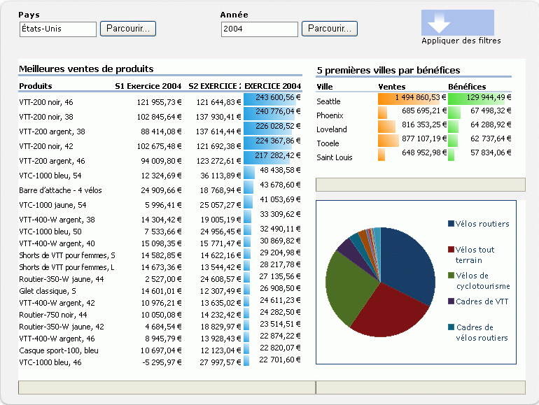
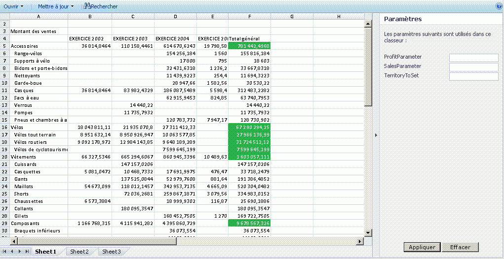

# Vue d'ensemble d'Excel Services

Excel Services est une application de service qui vous permet de charger, calculer et afficher des classeurs Microsoft Excel sur Microsoft SharePoint 2013. Excel Services est apparu pour la première fois dans Microsoft Office SharePoint Server 2007.
  
    
    

Grâce à Excel Services, vous pouvez réutiliser et partager des classeurs Excel sur des portails et des tableaux de bord SharePoint 2013. Par exemple, les analystes financiers, les planificateurs d'entreprise ou les ingénieurs peuvent créer du contenu dans Excel et le partager avec d'autres personnes au moyen d'un portail et d'un tableau de bord SharePoint 2013 sans écrire de code personnalisé. Vous pouvez contrôler les données affichées et gérer une version unique de votre classeur Excel. 
Il existe quatre interfaces principales pour Excel Services : 
  
    
    

- un composant WebPart Excel Web Access, qui vous permet d'afficher et d'interagir avec un classeur actif à l'aide d'un navigateur ; 
    
  
- Excel Web Services pour l'accès par programme ;
    
  
- un modèle objet ECMAScript (JavaScript, JScript) pour l'automatisation et la personnalisation, ainsi que pour piloter le contrôle Excel Web Access et aider à générer des solutions intégrées plus puissantes, et possibilité d'utiliser des fonctions définies par l'utilisateur pour étendre le modèle objet ECMAScript (JavaScript, JScript) ;
    
  
- une API REST (Representational State Transfer) pour l'accès à des composants de classeur directement par le biais d'une URL.
    
  

> **REMARQUE**
> La fonctionnalité du mode interactif Excel a été désactivée. Pour plus d'informations sur la suppression de cette fonctionnalité depuis votre site web, consultez la rubrique  [Suppression du mode interactif Excel à partir d'une page Web](removing-excel-interactive-view-from-a-webpage.md). 
  
    
    

Vous pouvez également étendre Services de calcul Excel à l'aide de fonctions définies par l'utilisateur (UDF).
> **REMARQUE**
> Pour plus d'informations sur Services de calcul Excel, voir  [Architecture d'Excel Services](excel-services-architecture.md). 
  
    
    

Excel Services, vous permet d'afficher des classeurs interactifs actifs au moyen d'un simple navigateur. Cela signifie que vous pouvez enregistrer des classeurs Excel et interagir avec eux dans des sites de portail.Vous pouvez également interagir avec des données Excel en triant, filtrant, étendant ou réduisant des tableaux croisés dynamiques et en passant des paramètres ; cela vous permet d'effectuer des analyses sur des classeurs publiés. Il est possible d'interagir avec un classeur sans modifier le classeur publié, ce qui est très utile aux auteurs et aux consommateurs de rapports.Excel Services prend en charge les classeurs qui sont connectés à des sources de données externes. Vous pouvez incorporer des chaînes de connexion à des sources de données externes dans le classeur ou les enregistrer de manière centralisée dans un fichier de bibliothèque de connexions de données.Vous pouvez également rendre modifiables des cellules sélectionnées dans des feuilles de calcul en les transformant en plages nommées (paramètres). Ces éléments que vous choisissez de rendre visibles, lorsque vous enregistrez dans Excel Services, apparaissent dans le volet **Paramètres** dans Excel Web Access. Vous pouvez modifier les valeurs de ces plages nommées dans le volet **Paramètres** et actualiser le classeur. Vous pouvez aussi utiliser le composant WebPart filtre du portail pour filtrer plusieurs composants WebPart (Excel Web Access et autres types de composants WebPart).En revanche, vous ne pouvez pas utiliser Excel Services pour créer des classeurs ou modifier des classeurs existants. Pour créer un classeur à utiliser dans Excel Services, vous pouvez vous servir de Microsoft Excel 2013.
> **REMARQUE**
> Microsoft Excel Online, qui fait partie d'Office Online, prend également en charge les classeurs Excel dans le navigateur. Pour plus d'informations sur Excel Online, reportez-vous à  [Guides de démarrage rapide d'Office 2013](http://office.microsoft.com/fr-fr/support/getting-started-with-office-2013-FX102809998.aspx). 
  
    
    

Excel Services possède également un service Web. Vous pouvez utiliser Excel Web Services pour charger des classeurs, définir des valeurs dans des cellules et des plages, actualiser des connexions de données externes, calculer des classeurs et extraire des résultats calculés (notamment des valeurs de cellules, tout le classeur calculé ou une capture instantanée du classeur). Dans SharePoint 2013, vous pouvez également enregistrer, enregistrer une copie et participer à des sessions de modification en collaboration à l'aide d'Excel Web Services.
> **REMARQUE**
> Pour plus d'informations sur les captures instantanées, voir  [How to: Get an Entire Workbook or a Snapshot](how-to-get-an-entire-workbook-or-a-snapshot.md). 
  
    
    

Excel Services prend en charge les fonctions UDF, que vous pouvez utiliser pour étendre les fonctionnalités de Services de calcul Excel, par exemple, pour implémenter des bibliothèques de calcul personnalisées ou pour lire des données à partir de services Web et des sources de données qui ne sont pas prise en charge en mode natif par Excel Services.Excel Services est conçu pour être un serveur évolutif, fiable, de catégorie entreprise qui garantit une parfaite compatibilité au niveau fonctionnalité et calcul avec Excel.
## Scénarios et fonctionnalités

Excel Services prend en charge plusieurs scénarios et fonctionnalités, dont certains sont décrits dans cette section. 
  
    
    

### Portail d'aide à la décision et analyse de classeur

Un portail d'aide à la décision affiche des tableaux de bord et des rapports et permet aux utilisateurs d'explorer des données à l'aide d'un simple navigateur. La fonction **Business Intelligence Center** dans SharePoint Server inclut un portail d'aide à la décision et des fonctionnalités de tableau de bord. La Figure 1 montre un tableau de bord de centre de rapport avec une bibliothèque de rapports, un graphique et des indicateurs de performance clés (KPI) déjà configurés.
  
    
    
Excel Services vous permet également de calculer des données sur le serveur. Excel Services participe au **Business Intelligence Center** en offrant la possibilité de calculer et d'exposer du contenu Excel sur des tableaux de bord d'aide à la décision intégrés. Vous pouvez afficher un classeur Excel à l'aide du composant WebPart Excel Web Access, vous connecter à des sources de données externes et procéder à d'autres interactions avec les données du classeur.
  
    
    
 La Figure 1 montre un tableau de bord avec un composant WebPart Filtre et des classeurs Excel affichés à l'aide des composants WebPart Excel Web Access.
  
    
    

**Figure 1. Tableau de bord avec filtrage et contenu Excel**

  
    
    

  
    
    

  
    
    
En plus de participer à des tableaux de bord intégrés, Excel Services peut servir à afficher tout ou une partie des classeurs Excel pour permettre aux utilisateurs d'interagir avec ce contenu dans l'interface utilisateur familière d'Excel. La Figure 2 illustre l'affichage d'une plage et l'exposition de cellules pour l'entrée utilisateur par le biais de paramètres. La désignation de cellules spécifiques en tant que paramètres permet aux utilisateurs de modifier les valeurs dans ces cellules dans une feuille de calcul à l'aide des zones d'édition du volet droit. Excel Services recalcule ensuite la feuille de calcul en fonction des nouvelles valeurs.
  
    
    
Si vous souhaitez utiliser certaines fonctionnalités dans Excel ou analyser un classeur à l'aide de toutes les fonctionnalités Excel, vous pouvez ouvrir un classeur dans Excel en cliquant sur **Ouvrir dans Excel**. Vous pouvez également ouvrir un classeur dans Excel pour l'imprimer et travailler hors connexion.
  
    
    

    
> **REMARQUE**
> Pour ouvrir un classeur à l'aide la commande **Ouvrir dans Excel**, vous devez disposer de droits « ouvrir ». Pour plus d'informations, voir la section suivante, **Gestion de classeurs** et [Autorisations utilisateur et niveaux d'autorisation](http://technet.microsoft.com/fr-fr/library/cc721640%28office.14%29.aspx) sur [TechNet](http://technet.microsoft.com/fr-fr/library/cc263215%28office.14%29.aspx). Les utilisateurs qui n'ont pas ce droit peuvent toujours ouvrir une capture instantanée dans Excel. 
  
    
    

**Figure 2. Utilisation du volet Paramètres**

  
    
    

  
    
    

  
    
    
Vous pouvez également analyser, afficher de façon dynamique et interagir avec des données à l'aide d'Excel Web Access.
  
    
    
Pour plus d'informations sur Excel Services et sur les fonctionnalités d'aide à la décision dans SharePoint 2013, voir la documentation sur l'aide à la décision dans l'aide de SharePoint Server. 
  
    
    

### Gestion des classeurs

Les fonctionnalités de gestion et de verrouillage de classeurs de Excel Services permettent les opérations suivantes :
  
    
    

- Gérer une seule copie d'un classeur, créée et modifiée par un auteur de confiance dans un endroit central et sécurisé, au lieu de conserver plusieurs copies sur l'ordinateur de chaque utilisateur. La version correcte de la feuille de calcul est ainsi plus facile à trouver, à partager et à utiliser dans Excel, SharePoint et d'autres applications. 
    
  
- Sécuriser et protéger des modèles de classeurs et des données principales. Vous pouvez accorder aux utilisateurs des droits « afficher uniquement » afin de limiter l'accès au classeur. Par exemple, vous pouvez empêcher à des utilisateurs d'ouvrir un classeur à l'aide d'Excel ou contrôler ce qu'ils sont autorisés à afficher dans un classeur. Les utilisateurs peuvent disposer d'un accès par navigateur au contenu d'un classeur que l'auteur souhaite partager, mais sans pouvoir ouvrir le classeur dans le client Excel, afficher les formules ni afficher le contenu de prise en charge ou autre propriété intellectuelle susceptible de se trouver dans le classeur. 
    
  
- Créer des captures instantanées d'un classeur.
    
  
Excel Services est optimisé pour de nombreux utilisateurs et de nombreux classeurs. Il peut également aider à équilibrer la charge de calcul sur la batterie de serveurs.
  
    
    
Pour plus d'informations sur la gestion des classeurs à l'aide d'Excel Services, reportez-vous à la documentation SharePoint Server sur le site  [TechNet](http://technet.microsoft.com/fr-fr/library/ee424405%28office.14%29.aspx) ou à l'aide de SharePoint Server.
  
    
    

### Accès par programme par des applications .NET personnalisées

Vous pouvez créer des applications personnalisées, par exemple des applications ASP.NET, qui :
  
    
    

- appellent Excel Web Services pour accéder à des classeurs, les paramétrer et les calculer ;
    
  
- ouvrent, actualisent des données externes, définissent des cellules ou des plages, recalculent, participent à des sessions de modification en collaboration avec d'autres applications ou personnes, enregistrent et enregistrent sous ; 
    
  
- utilisent des flux de travail personnalisés pour planifier des opérations de calcul ou envoyer des notifications par courrier électronique. (Ceci fait appel aux fonctionnalités natives de SharePoint et n'est pas une fonction native d'Excel Services.)
    
  

### Fonctions définies par l'utilisateur (UDF)

Vous pouvez également utiliser des fonctions UDF Excel Services, qui vous permettent d'utiliser des formules dans une cellule pour appeler des fonctions personnalisées écrites en code managé et déployées sur SharePoint Server.
  
    
    
Pour plus d'informations sur les fonctions UDF dans Excel Services, voir  [Understanding Excel Services UDFs](understanding-excel-services-udfs.md).
  
    
    

### ECMAScript (JavaScript, JScript)

Vous pouvez également utiliser le modèle objet JavaScript dans Excel Services pour automatiser, personnaliser et piloter le contrôle de composant WebPart Excel Web Access. Vous pouvez utiliser le modèle objet JavaScript pour générer des solutions plus intégrées et performantes.
  
    
    

### Fonctions définies par l'utilisateur (UDF) JavaScript

Nouveautés de Microsoft Excel Services et Microsoft SharePoint 2013, les UDF ECMAScript (JavaScript, JScript) permettent d'ajouter des fonctions personnalisées à Excel lorsque vous utilisez un classeur Excel incorporé avec OneDrive ou un composant WebPart Excel Web AccessExcel Web Access dans SharePoint. Outre les fonctions intégrées que vous utilisez dans Excel, vous pouvez ajouter vos propres fonctions personnalisées à l'aide des UDF JavaScript que vous pouvez appeler à partir de formules internes dans .
  
    
    
Les UDF JavaScript sont semblables aux  [UDF](http://msdn.microsoft.com/fr-fr/library/ms499792.aspx) que vous pouvez créer pour Microsoft Excel. La différence réside dans le fait que les UDF JavaScript sont utilisées uniquement dans les classeurs incorporés dans une page web et qu'elles n'existent que sur cette page web.
  
    
    

### Modèle objet JavaScript

L'API JSOM Excel Services inclut désormais les éléments suivants :
  
    
    

- La possibilité de recharger le classeur incorporé ; maintenant, vous pouvez réinitialiser le classeur incorporé avec les données contenues dans le fichier de classeur sous-jacent.
    
  
- Objets flottants créés par l'utilisateur ; l'objet EwaControl propose de nouvelles méthodes qui vous permettent d'ajouter/de supprimer les objets flottants que vous créez.
    
  
- Meilleur contrôle sur la zone d'affichage du contrôle Ewa.
    
  
- Événement SheetChanged ; cet événement se déclenche lorsque quelque chose change dans une feuille, comme la mise à jour de cellules, la suppression ou l'effacement de cellules, le fait de copier, couper ou coller des plages et d'annuler/de rétablir des actions.
    
  
- Activation de la validation des données ; vous pouvez maintenant valider des données entrées par un utilisateur.
    
  

### API REST

Vous pouvez utiliser l'API REST dans Excel Services pour accéder à des parties ou des éléments de classeurs directement par le biais d'une URL. Les mécanismes de découverte intégrés à l'API REST Excel Services permettent aux développeurs et aux utilisateurs d'explorer le contenu du classeur manuellement ou par programme. 
  
    
    
Pour plus d'informations sur l'API REST dans Excel Services, voir  [API REST Excel Services](excel-services-rest-api.md).
  
    
    

### ODATA REST

Nouveauté de Microsoft Excel Services et Microsoft SharePoint 2013, grâce à la nouvelle fonctionnalité OData dans l'API REST Excel Services, vous pouvez demander les tables à l'intérieur d'un classeur Excel sous forme de données OData. Par exemple, pour demander des métadonnées Excel sur les ressources disponibles dans le classeur SampleWorkbook.xlsx à l'aide d'un appel REST, utilisez la syntaxe suivante.
  
    
    
http://<NomServeur>/_vti_bin/ExcelRest.aspx/Docs/Documents/SampleWorkbook.xlsx/model Pour plus d'informations sur l'API REST, consultez la documentation 
  
    
    
 [API REST Excel Services 2010](http://msdn.microsoft.com/fr-fr/library/ee556413.aspx) dans la documentation du kit de développement SharePoint 2013.
  
    
    
Pour demander des métadonnées sur les ressources disponibles dans le classeur SampleWorkbook.xlsx à l'aide d'OData, utilisez la même syntaxe REST, mais remplacez /Model par /Odata, comme dans la demande suivante. 
  
    
    
http://<NomServeur>/_vti_bin/ExcelRest.aspx/Docs/Documents/sampleWorkbook.xlsx/OData
  
    
    
À partir de là, vous pouvez utiliser les options de requête du système OData pour obtenir des informations spécifiques sur les tables à l'intérieur du classeur.
  
    
    

## Ressources supplémentaires

-  [Excel Services Development Roadmap](excel-services-development-roadmap.md)
    
  
-  [Architecture d'Excel Services](excel-services-architecture.md)
    
  
-  [Vue d'ensemble des fonctions définies par l'utilisateur de JavaScript](javascript-user-defined-functions-overview.md)
    
  
-  [Utilisation d'OData avec Excel Services REST dans SharePoint 2013](using-odata-with-excel-services-rest-in-sharepoint-2013.md)
    
  
-  [Procédure pas à pas : développement d'une application personnalisée à l'aide des services Web Excel](walkthrough-developing-a-custom-application-using-excel-web-services.md)
    
  
-  [Frequently Asked Questions About Excel Services UDFs](frequently-asked-questions-about-excel-services-udfs.md)
    
  
-  [Fonctionnalités non prises en charge dans Excel Services](http://msdn.microsoft.com/library/5868e672-4786-4fed-9168-07ff538f6f5c%28Office.15%29.aspx)
    
  
-  [Blogs sur Excel Services](excel-services-blogs-forums-and-resources.md)
    
  

