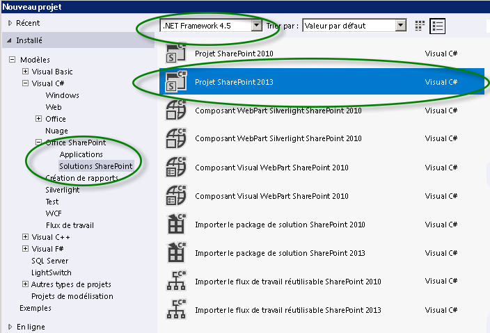
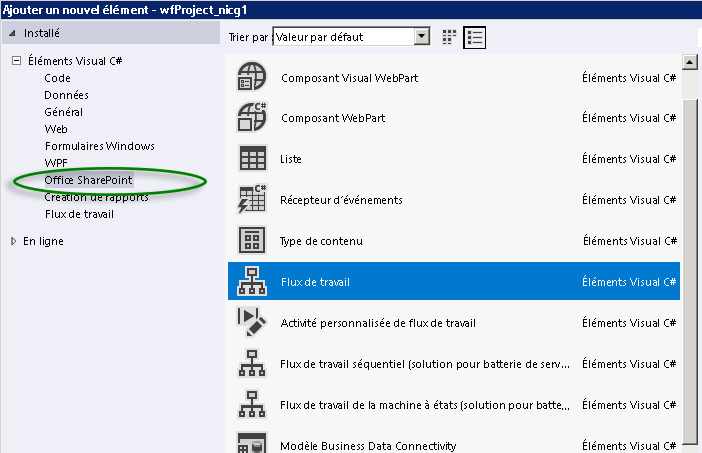
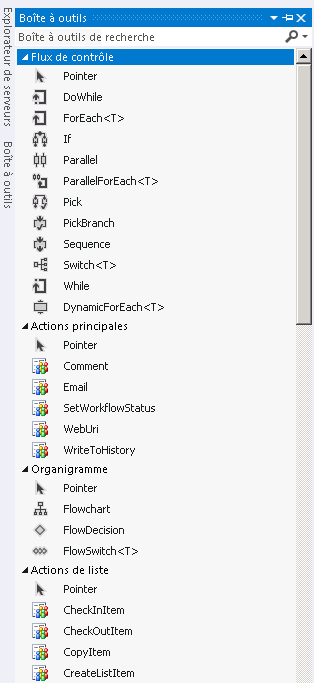

# Mise en route avec les flux de travail dans SharePoint 2013
Découvrez la nouvelle conception de Workflow Manager Client 1.0, qui fournit l'infrastructure des flux de travail dans SharePoint 2013, et découvrez comment les flux de travail SharePoint sont intégrés au nouveau modèle de complément SharePoint.
> **IMPORTANTE**
> Pour obtenir des instructions sur l'installation et la configuration de SharePoint Server 2013 et Microsoft Azure, voir  [Installer et configurer le Gestionnaire de workflow SharePoint 2013](set-up-and-configure-sharepoint-2013-workflow-manager.md). 
  
    
    

## Vue d'ensemble des flux de travail dans SharePoint 2013

Les flux de travail dans SharePoint 2013 permettent de modéliser et d'automatiser les processus d'entreprise. Ces derniers peuvent être simples, comme un processus d'approbation de document avec un seul approbateur (illustré à la figure 1), complexes, comme un catalogue de produits destiné aux clients utilisant des appels de service web et assurant la prise en charge des bases de données, ou exigeants, comme un processus d'entreprise structuré présentant de multiples conditions, boucles, entrées utilisateur, tâches et actions personnalisées.
  
    
    

**Figure 1. Flux de travail SharePoint simple**

  
    
    

  
    
    

  
    
    

  
    
    
SharePoint 2013 marque l'introduction de Workflow Manager Client 1.0 en tant que nouvel outil dédié aux flux de travail Visual Studio. Intégré à Windows Workflow Foundation 4, Workflow Manager Client 1.0 offre des avantages par rapport aux versions précédentes qui reflètent l'engagement de SharePoint envers le modèle de complément SharePoint et le cloud computing. Pour plus de détails sur ces changements, voir  [Nouveautés des flux de travail pour SharePoint 2013](what-s-new-in-workflows-for-sharepoint-2013.md) et [Notions de base sur les flux de travail SharePoint 2013](sharepoint-2013-workflow-fundamentals.md).
  
    
    
L'un des éléments probablement les plus importants pour les créateurs de flux de travail réside dans le fait que la création de ces derniers a été grandement améliorée et simplifiée. D'une part, les flux de travail sont désormais entièrement déclaratifs (c'est-à-dire qu'ils sont basés sur le concepteur et sans code) et, d'autre part, les environnements principaux de création de flux de travail, Visual Studio 2012 et SharePoint Designer 2013, ont été simplifiés et rationalisés.
  
    
    
Les principales améliorations apportées aux flux de travail dans SharePoint 2013 sont décrites ci-après. Pour obtenir une vue d'ensemble plus détaillée des nouveautés incluses dans les flux de travail pour SharePoint 2013, voir  [Nouveautés des flux de travail pour SharePoint 2013](what-s-new-in-workflows-for-sharepoint-2013.md).
  
    
    

- Amélioration de la connectivité pour permettre une exécution de flux de travail sur le cloud. En réalité, il existe une égale proportion de flux de travail locaux et basés sur Office 365 dans SharePoint 2013.
    
  
- Interopérabilité totale dans SharePoint 2013 avec les flux de travail SharePoint 2010, activée à l'aide du  [Interopérabilité de flux de travail SharePoint ](sharepoint-2013-workflow-fundamentals.md#bkm_InteropBridge).
    
  
- Amélioration de l'expression de création à l'aide d'événements, d'actions, de services web et de structures de programmation classiques Visual Studio, le tout fourni dans un environnement déclaratif sans code.
    
  
- Extensibilité et robustesse conformes aux exigences d'Office 365 et du modèle d'applications Cloud.
    
  
- Amélioration de la connectivité pour promouvoir des systèmes intégrés hautement fonctionnels. Vous pouvez appeler et contrôler vos flux de travail depuis n'importe quel système externe. En outre, votre flux de travail peut effectuer des appels de service web vers tout flux ou toute source de données à l'aide de protocoles communs tels que HTTP, SOAP, OData (Open Data Protocol) et REST (Representational State Transfer).
    
  
- Amélioration des capacités de création pour les utilisateurs non-développeurs dans SharePoint Designer 2013 et possibilité de composer une logique de flux de travail dans Visio.
    
  
- Amélioration et simplification du développement de flux de travail dans Visual Studio, y compris prise en charge des actions de flux de travail personnalisées, développement rapide dans un environnement déclaratif, déploiement en une seule étape et prise en charge du développement des Compléments SharePoint.
    
  
- Prise en charge complète des Compléments SharePoint basées sur un flux de travail, dans lesquelles les flux de travail font office de niveau intermédiaire pour la gestion des processus d'entreprise.
    
  

## Workflow Manager Client 1.0 et modèle de complément SharePoint

Visual Studio 2012 est optimisé pour le développement d'Compléments SharePoint basées sur un flux de travail ainsi que pour l'exploitation de la puissance et de la flexibilité du modèle de complément SharePoint. Vous pouvez utiliser le modèle objet de flux de travail SharePoint pour activer la logique de flux de travail sous une application SharePoint de manière à ce que les utilisateurs finaux expérimentent la surface de l'application elle-même, tandis que le dessous de l'application est piloté par la logique de votre flux de travail.
  
    
    
En outre, Visual Studio 2012 est idéal pour le développement d'Compléments Office, pouvant exécuter des flux de travail au sein d'une application Microsoft Office.
  
    
    

## Créer des flux de travail SharePoint 2013

Il existe deux principaux environnements de création pour Workflow Manager Client 1.0 : SharePoint Designer 2013 et Visual Studio. En outre, les travailleurs de l'information non techniques peuvent utiliser Visio pour construire une logique de flux de travail que vous pouvez ensuite importer dans SharePoint Designer et assembler dans un projet de flux de travail SharePoint.
  
    
    
Toutefois, les principaux environnements de création sont Visual Studio 2012 et SharePoint Designer 2013. Pour vous aider à identifier celui qui répond le mieux à vos besoins, consultez la matrice de décision dans  [Comparaison de SharePoint Designer et de Visual Studio](develop-sharepoint-2013-workflows-using-visual-studio.md#bkm_Comparing).
  
    
    

## SharePoint Designer 2013 en tant qu'outil de création de flux de travail

À bien des égards, SharePoint Designer 2013 est l'outil de création de choix pour les flux de travail SharePoint. Bien que certaines tâches avancées (la création d'actions personnalisées, par exemple) nécessitent l'intervention d'un développeur utilisant Visual Studio, SharePoint Designer 2013 est l'outil de développement de flux de travail le plus souple pour le plus grand nombre de créateurs.
  
    
    

## Créer un flux de travail à l'aide de Visual Studio 2012

Différents types de projets de flux de travail SharePoint 2013 sont intégrés dans Visual Studio 2012. Pour créer un projet de flux de travail SharePoint dans Visual Studio, suivez les étapes décrites ci-après.
  
    
    

### Pour créer un flux de travail à l'aide de Visual Studio

1. Ouvrez Visual Studio 2012 et créez un projet. Dans la boîte de dialogue **Nouveau projet**, choisissez **Modèles**, **Visual C#**, **Office SharePoint**, **Solutions SharePoint** et **Projet SharePoint 2013**, comme illustré à la figure 2.
    
   **Figure 2. Boîte de dialogue Nouveau projet**

  

  

  

  
2. Une fois le projet créé, choisissez **Ajouter un nouvel élément** dans le menu **Projet**, puis choisissez **Flux de travail** sous l'élément **Office SharePoint**, comme illustré à la figure 3.
    
   **Figure 3. Boîte de dialogue Ajouter un nouvel élément**

  

  

  

  
3. Une fois le projet de flux de travail créé, une aire de conception s'affiche, sur laquelle vous pouvez créer votre flux de travail. L'environnement de développement de flux de travail comprend une boîte à outils personnalisée comprenant une large palette d'éléments pour la création de flux de travail.
    
   **Figure 4. Boîte à outils Visual Studio pour la création de flux de travail**

  

  

  

  

## Ressources supplémentaires

Pour plus d'informations sur les **Compléments SharePoint**, consultez les rubriques suivantes :
  
    
    

-  [Compléments](http://msdn.microsoft.com/library/cd1eda9e-8e54-4223-93a9-a6ea0d18df70%28Office.15%29.aspx)
    
  
-  [Penser de trois manières différentes les options de conception des compléments pour SharePoint](http://msdn.microsoft.com/library/0942fdce-3227-496a-8873-399fc1dbb72c%28Office.15%29.aspx)
    
  
-  [Aspects importants du contexte de développement et de l'architecture des compléments pour SharePoint](http://msdn.microsoft.com/library/ae96572b-8f06-4fd3-854f-fc312f7f2d88%28Office.15%29.aspx)
    
  
-  [Utiliser des données externes dans SharePoint 2013](http://msdn.microsoft.com/library/1534a5f4-1d83-45b4-9714-3a1995677d85%28Office.15%29.aspx)
    
  
Pour plus d'informations sur le développement de flux de travail à l'aide de **Visual Studio 2012** et de **SharePoint Designer 2013**, consultez les rubriques suivantes :
  
    
    

-  [Développer des flux de travail SharePoint 2013 à l'aide de Visual Studio](develop-sharepoint-2013-workflows-using-visual-studio.md)
    
  
-  [Développement de flux de travail dans SharePoint Designer et Visio](workflow-development-in-sharepoint-designer-and-visio.md)
    
  
Pour plus d'informations sur Windows Workflow Foundation 4, consultez les rubriques suivantes : 
  
    
    

-  [Présentation de Windows Workflow Foundation (WF) dans .NET 4 pour les développeurs](http://msdn.microsoft.com/fr-fr/library/ee342461.aspx)
    
  
-  [Nouveautés dans Windows Workflow Foundation](http://msdn.microsoft.com/fr-fr/library/dd489410%28v=vs.110%29.aspx)
    
  
-  [Guide du débutant pour Windows Workflow Foundation](http://msdn.microsoft.com/fr-fr/netframework/first-steps-with-wf.aspx)
    
  
-  [Flux de travail : comprendre Windows Workflow Foundation](http://msdn.microsoft.com/fr-fr/library/dd851337.aspx)
    
  
-  [Présentation du moteur de règles Windows Workflow Foundation](http://msdn.microsoft.com/fr-fr/library/dd554919.aspx)
    
  
-  [Intégration de Windows Workflow Foundation à Windows Communication Foundation](http://msdn.microsoft.com/fr-fr/library/cc626077.aspx)
    
  

